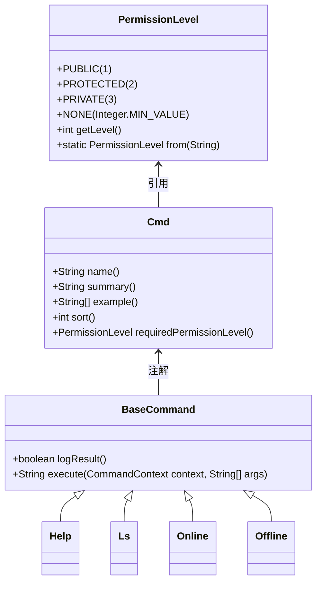
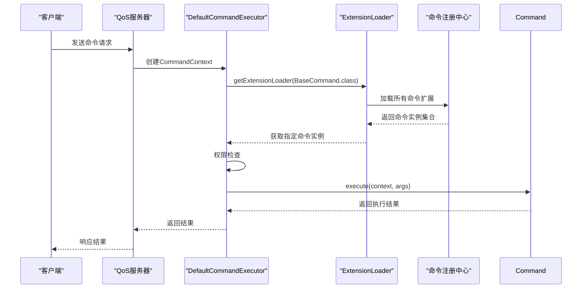
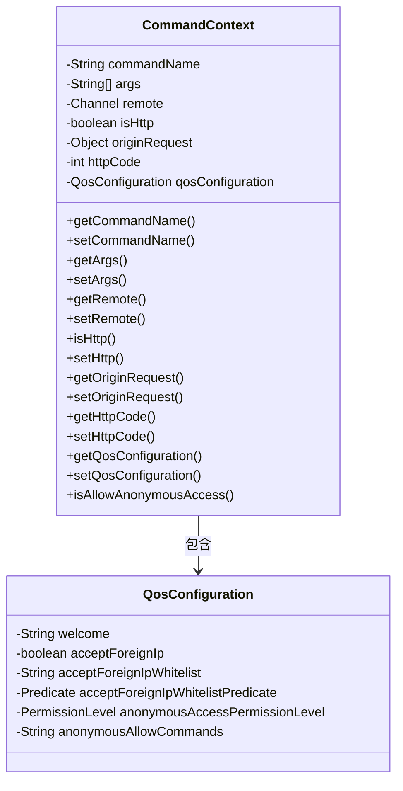
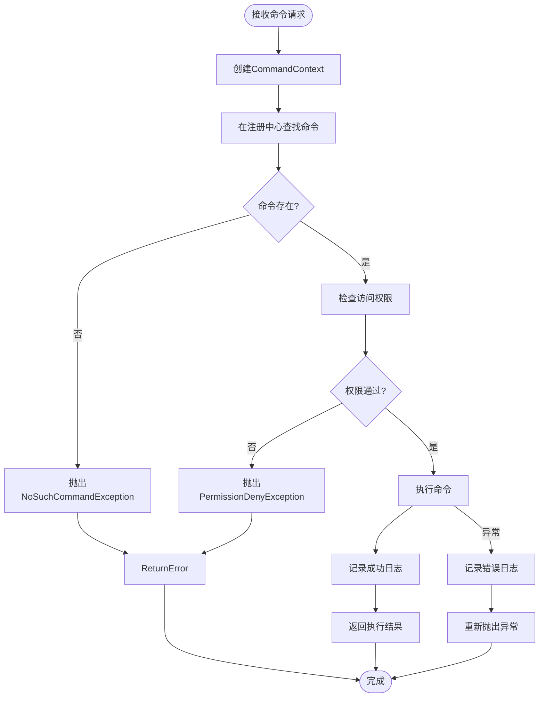
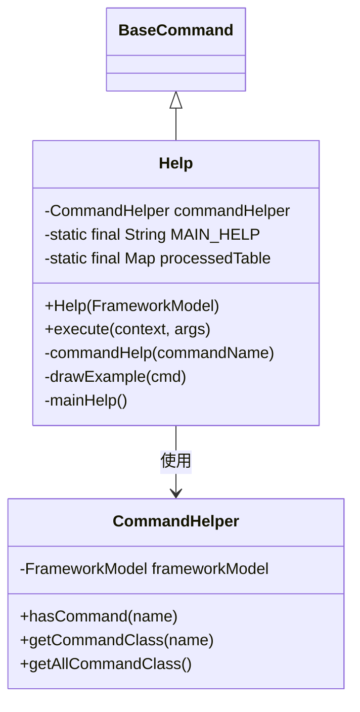

# 命令处理机制

<cite>
**本文档引用的文件**  
- [BaseCommand.java](file://dubbo-plugin\dubbo-qos-api\src\main\java\org\apache\dubbo\qos\api\BaseCommand.java)
- [CommandContext.java](file://dubbo-plugin\dubbo-qos-api\src\main\java\org\apache\dubbo\qos\api\CommandContext.java)
- [Cmd.java](file://dubbo-plugin\dubbo-qos-api\src\main\java\org\apache\dubbo\qos\api\Cmd.java)
- [PermissionLevel.java](file://dubbo-plugin\dubbo-qos-api\src\main\java\org\apache\dubbo\qos\api\PermissionLevel.java)
- [QosConfiguration.java](file://dubbo-plugin\dubbo-qos-api\src\main\java\org\apache\dubbo\qos\api\QosConfiguration.java)
- [DefaultCommandExecutor.java](file://dubbo-plugin\dubbo-qos\src\main\java\org\apache\dubbo\qos\command\DefaultCommandExecutor.java)
- [Help.java](file://dubbo-plugin\dubbo-qos\src\main\java\org\apache\dubbo\qos\command\impl\Help.java)
- [CommandContextFactory.java](file://dubbo-plugin\dubbo-qos\src\main\java\org\apache\dubbo\qos\command\CommandContextFactory.java)
</cite>

## 目录
1. [引言](#引言)
2. [命令接口设计](#命令接口设计)
3. [命令注册中心机制](#命令注册中心机制)
4. [命令上下文结构](#命令上下文结构)
5. [命令执行流程](#命令执行流程)
6. [简单命令示例](#简单命令示例)
7. [高级命令处理](#高级命令处理)
8. [结论](#结论)

## 引言
Dubbo QoS（Quality of Service）命令处理机制为系统提供了运行时管理和监控能力。该机制允许通过Telnet或HTTP接口执行各种管理命令，如服务状态查询、配置修改、性能监控等。本文档深入分析QoS命令处理的核心组件和工作原理，为开发者提供全面的技术指导。

## 命令接口设计

QoS命令处理机制的核心是`BaseCommand`接口，它定义了所有命令的基本行为。该接口采用SPI（Service Provider Interface）扩展机制，允许框架在运行时动态加载和执行命令。



**图示来源**
- [BaseCommand.java](file://dubbo-plugin\dubbo-qos-api\src\main\java\org\apache\dubbo\qos\api\BaseCommand.java#L23-L30)
- [Cmd.java](file://dubbo-plugin\dubbo-qos-api\src\main\java\org\apache\dubbo\qos\api\Cmd.java#L29-L65)
- [PermissionLevel.java](file://dubbo-plugin\dubbo-qos-api\src\main\java\org\apache\dubbo\qos\api\PermissionLevel.java#L23-L42)

`BaseCommand`接口的关键设计特点包括：
- **SPI扩展**：通过`@SPI(scope = ExtensionScope.FRAMEWORK)`注解，命令可以作为框架扩展被动态加载
- **默认方法**：`logResult()`方法提供默认实现，允许命令控制执行结果是否记录日志
- **上下文参数**：`execute`方法接收`CommandContext`对象，封装了命令执行所需的所有环境信息

`Cmd`注解用于描述命令的元数据，包括名称、摘要、示例、排序和权限级别。`PermissionLevel`枚举定义了四种权限级别：PUBLIC（公开）、PROTECTED（受保护）、PRIVATE（私有）和NONE（无权限）。

**本节来源**
- [BaseCommand.java](file://dubbo-plugin\dubbo-qos-api\src\main\java\org\apache\dubbo\qos\api\BaseCommand.java#L17-L30)
- [Cmd.java](file://dubbo-plugin\dubbo-qos-api\src\main\java\org\apache\dubbo\qos\api\Cmd.java#L29-L65)
- [PermissionLevel.java](file://dubbo-plugin\dubbo-qos-api\src\main\java\org\apache\dubbo\qos\api\PermissionLevel.java#L23-L67)

## 命令注册中心机制

命令注册中心是QoS系统的核心组件，负责管理所有可用命令的生命周期和访问。系统采用Dubbo的扩展机制（ExtensionLoader）实现命令的自动发现和注册。



**图示来源**
- [DefaultCommandExecutor.java](file://dubbo-plugin\dubbo-qos\src\main\java\org\apache\dubbo\qos\command\DefaultCommandExecutor.java#L46-L111)
- [CommandContext.java](file://dubbo-plugin\dubbo-qos-api\src\main\java\org\apache\dubbo\qos\api\CommandContext.java#L25-L123)

命令注册中心的工作流程如下：
1. **扩展发现**：系统启动时，`ExtensionLoader`扫描`META-INF/dubbo/internal/org.apache.dubbo.qos.api.BaseCommand`文件，发现所有实现`BaseCommand`接口的类
2. **延迟加载**：命令实例采用延迟加载策略，只有在首次被调用时才会实例化
3. **命名注册**：每个命令通过`Cmd`注解中的`name`属性注册到映射表中，形成名称到实例的映射关系
4. **动态更新**：支持运行时动态添加或移除命令，无需重启服务

命令的注册信息存储在`FrameworkModel`的扩展加载器中，确保了命令的隔离性和可管理性。这种设计使得QoS系统具有良好的扩展性，开发者可以轻松添加自定义管理命令。

**本节来源**
- [DefaultCommandExecutor.java](file://dubbo-plugin\dubbo-qos\src\main\java\org\apache\dubbo\qos\command\DefaultCommandExecutor.java#L58-L67)
- [QosConfiguration.java](file://dubbo-plugin\dubbo-qos-api\src\main\java\org\apache\dubbo\qos\api\QosConfiguration.java#L26-L167)

## 命令上下文结构

`CommandContext`是命令执行的核心数据结构，封装了命令执行所需的所有上下文信息。它作为命令执行的"环境对象"，提供了统一的访问接口。



**图示来源**
- [CommandContext.java](file://dubbo-plugin\dubbo-qos-api\src\main\java\org\apache\dubbo\qos\api\CommandContext.java#L25-L123)
- [QosConfiguration.java](file://dubbo-plugin\dubbo-qos-api\src\main\java\org\apache\dubbo\qos\api\QosConfiguration.java#L26-L167)

`CommandContext`的主要属性包括：
- **commandName**：命令名称，用于在注册中心查找对应的命令实现
- **args**：命令参数数组，包含用户输入的所有参数
- **remote**：远程连接通道，用于识别客户端和回写响应
- **isHttp**：标识请求是否通过HTTP协议发送
- **originRequest**：原始请求对象，保留协议特定的请求信息
- **httpCode**：HTTP响应状态码，用于HTTP请求的错误处理
- **qosConfiguration**：QoS配置对象，包含安全策略和访问控制规则

`CommandContext`通过工厂模式创建，`CommandContextFactory`提供了两个静态方法来创建不同配置的上下文实例。这种设计确保了上下文创建的一致性和可测试性。

**本节来源**
- [CommandContext.java](file://dubbo-plugin\dubbo-qos-api\src\main\java\org\apache\dubbo\qos\api\CommandContext.java#L25-L123)
- [CommandContextFactory.java](file://dubbo-plugin\dubbo-qos\src\main\java\org\apache\dubbo\qos\command\CommandContextFactory.java#L21-L29)

## 命令执行流程

命令执行流程是QoS系统的核心处理逻辑，从接收到命令请求到返回执行结果的完整过程。该流程确保了命令的安全执行和错误处理。



**图示来源**
- [DefaultCommandExecutor.java](file://dubbo-plugin\dubbo-qos\src\main\java\org\apache\dubbo\qos\command\DefaultCommandExecutor.java#L46-L111)

命令执行流程的具体步骤如下：

1. **请求接收**：QoS服务器通过Telnet或HTTP协议接收客户端发送的命令请求
2. **上下文创建**：使用`CommandContextFactory`创建`CommandContext`实例，填充命令名称、参数和连接信息
3. **命令查找**：通过`ExtensionLoader`在命令注册中心查找对应名称的命令实现
4. **权限验证**：根据QoS配置和命令的权限级别，检查当前请求是否具有执行权限
5. **命令执行**：调用命令的`execute`方法，传入上下文和参数数组
6. **结果处理**：捕获执行结果或异常，根据配置决定是否记录日志
7. **响应返回**：将执行结果或错误信息返回给客户端

在整个执行流程中，系统实现了完善的错误处理机制。对于未找到的命令抛出`NoSuchCommandException`，对于权限不足的请求抛出`PermissionDenyException`，其他执行异常则原样抛出以便调试。

**本节来源**
- [DefaultCommandExecutor.java](file://dubbo-plugin\dubbo-qos\src\main\java\org\apache\dubbo\qos\command\DefaultCommandExecutor.java#L46-L111)
- [CommandContext.java](file://dubbo-plugin\dubbo-qos-api\src\main\java\org\apache\dubbo\qos\api\CommandContext.java#L25-L123)

## 简单命令示例

`help`命令是QoS系统中最基础的命令之一，它展示了如何实现一个简单的管理命令。该命令用于显示系统中所有可用命令的帮助信息。



**图示来源**
- [Help.java](file://dubbo-plugin\dubbo-qos\src\main\java\org\apache\dubbo\qos\command\impl\Help.java#L37-L118)
- [CommandHelper.java](file://dubbo-plugin\dubbo-qos\src\main\java\org\apache\dubbo\qos\command\util\CommandHelper.java)

`help`命令的实现特点包括：
- **注解配置**：使用`@Cmd`注解声明命令元数据，包括名称、摘要和示例
- **依赖注入**：通过构造函数接收`FrameworkModel`，用于获取命令注册信息
- **缓存优化**：使用`WeakHashMap`缓存已生成的帮助信息，避免重复计算
- **表格输出**：利用`TTable`组件格式化输出，确保帮助信息的可读性

当用户执行`help`命令时，系统会根据是否有参数来决定显示全部命令列表还是特定命令的详细帮助。这种设计既满足了快速查看所有命令的需求，也支持深入了解特定命令的使用方法。

**本节来源**
- [Help.java](file://dubbo-plugin\dubbo-qos\src\main\java\org\apache\dubbo\qos\command\impl\Help.java#L37-L118)
- [Cmd.java](file://dubbo-plugin\dubbo-qos-api\src\main\java\org\apache\dubbo\qos\api\Cmd.java#L29-L65)

## 高级命令处理

对于复杂的管理需求，QoS系统支持高级命令处理模式，包括异步执行、超时控制和会话管理。这些特性使得QoS能够处理耗时较长的管理操作。

### 异步处理
对于可能耗时较长的命令，可以通过异步方式执行，避免阻塞QoS服务器的主线程。实现异步命令的关键是返回一个`CompletableFuture`对象：

```java
@Cmd(name = "longRunning", summary = "长时间运行的命令")
public class LongRunningCommand implements BaseCommand {
    
    private final ExecutorService executor = Executors.newSingleThreadExecutor();
    
    @Override
    public String execute(CommandContext context, String[] args) {
        CompletableFuture<String> future = CompletableFuture.supplyAsync(() -> {
            // 执行耗时操作
            try {
                Thread.sleep(10000);
                return "操作完成";
            } catch (InterruptedException e) {
                Thread.currentThread().interrupt();
                return "操作被中断";
            }
        }, executor);
        
        // 返回异步结果的占位符
        return "操作已提交，ID: " + future.hashCode();
    }
}
```

### 超时控制
为了防止命令无限期执行，系统提供了超时控制机制。可以通过`CommandContext`中的配置或在命令实现中使用`Future.get(timeout)`方法：

```java
@Override
public String execute(CommandContext context, String[] args) {
    try {
        String result = future.get(30, TimeUnit.SECONDS);
        return result;
    } catch (TimeoutException e) {
        future.cancel(true);
        return "操作超时";
    } catch (InterruptedException | ExecutionException e) {
        return "操作失败: " + e.getMessage();
    }
}
```

### 会话管理
对于需要维护状态的复杂命令，可以利用`CommandContext`中的`remote`通道属性来实现会话管理。通过通道的属性存储，可以在多个命令调用之间保持状态：

```java
// 在命令中存储会话数据
Channel channel = context.getRemote();
channel.attr(AttributeKey.valueOf("sessionData")).set(sessionObject);

// 在后续命令中读取会话数据
SessionObject session = channel.attr(AttributeKey.valueOf("sessionData")).get();
```

这些高级处理模式使得QoS系统能够支持复杂的管理场景，如批量操作、数据导出、系统诊断等需要长时间运行或状态维护的操作。

**本节来源**
- [CommandContext.java](file://dubbo-plugin\dubbo-qos-api\src\main\java\org\apache\dubbo\qos\api\CommandContext.java#L25-L123)
- [DefaultCommandExecutor.java](file://dubbo-plugin\dubbo-qos\src\main\java\org\apache\dubbo\qos\command\DefaultCommandExecutor.java#L46-L111)

## 结论
Dubbo QoS命令处理机制通过精心设计的接口、注册中心和执行流程，提供了一个灵活、安全和可扩展的运行时管理平台。其核心特点包括：

1. **模块化设计**：通过`BaseCommand`接口和SPI机制，实现了命令的模块化和可插拔性
2. **安全控制**：基于`PermissionLevel`的权限系统，确保了管理操作的安全性
3. **上下文隔离**：`CommandContext`封装了执行环境，保证了命令之间的隔离性
4. **扩展性强**：开放的扩展机制允许开发者轻松添加自定义管理命令
5. **健壮性高**：完善的错误处理和日志记录机制，确保了系统的稳定性

对于初学者，可以从简单的`help`命令开始，理解命令的基本结构和执行流程。对于高级开发者，可以利用异步处理、超时控制和会话管理等特性，构建复杂的管理功能。整体而言，QoS命令处理机制是Dubbo框架中一个强大而灵活的运维工具，为微服务系统的管理和监控提供了坚实的基础。