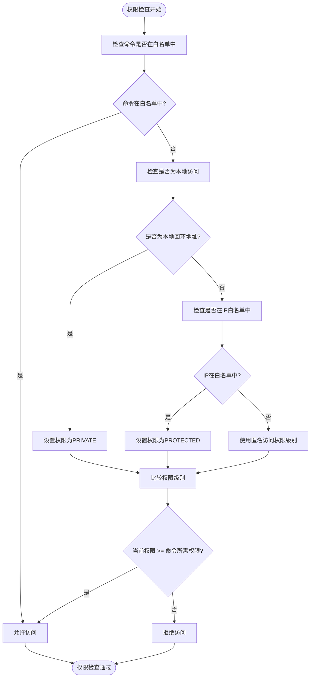
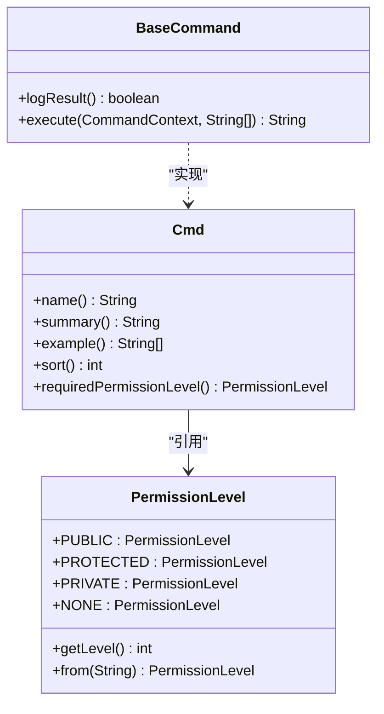
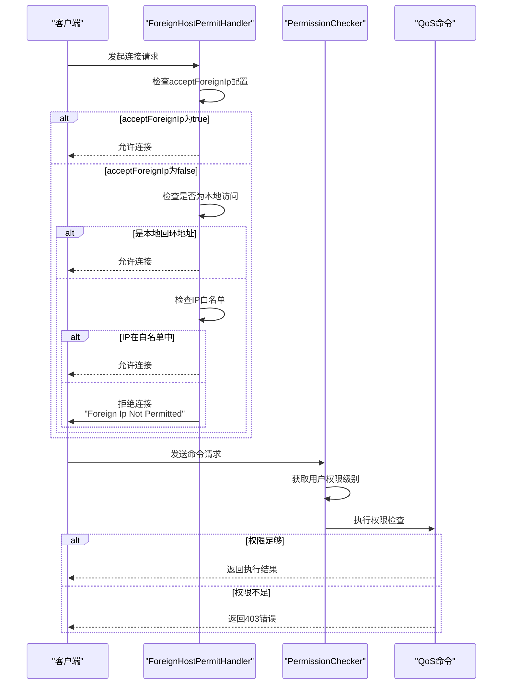

# 安全与访问控制

<cite>
**本文档中引用的文件**  
- [PermissionLevel.java](file://dubbo-plugin\dubbo-qos-api\src\main\java\org\apache\dubbo\qos\api\PermissionLevel.java)
- [QosConfiguration.java](file://dubbo-plugin\dubbo-qos-api\src\main\java\org\apache\dubbo\qos\api\QosConfiguration.java)
- [PermissionChecker.java](file://dubbo-plugin\dubbo-qos\src\main\java\org\apache\dubbo\qos\permission\PermissionChecker.java)
- [DefaultAnonymousAccessPermissionChecker.java](file://dubbo-plugin\dubbo-qos\src\main\java\org\apache\dubbo\qos\permission\DefaultAnonymousAccessPermissionChecker.java)
- [ApplicationConfig.java](file://dubbo-common\src\main\java\org\apache\dubbo\config\ApplicationConfig.java)
- [ForeignHostPermitHandler.java](file://dubbo-plugin\dubbo-qos\src\main\java\org\apache\dubbo\qos\server\handler\ForeignHostPermitHandler.java)
- [Cmd.java](file://dubbo-plugin\dubbo-qos-api\src\main\java\org\apache\dubbo\qos\api\Cmd.java)
</cite>

## 目录
1. [引言](#引言)
2. [权限检查器设计原理](#权限检查器设计原理)
3. [权限级别定义与使用](#权限级别定义与使用)
4. [访问控制列表配置](#访问控制列表配置)
5. [安全配置最佳实践](#安全配置最佳实践)
6. [初学者安全配置指南](#初学者安全配置指南)
7. [深度防御策略建议](#深度防御策略建议)
8. [结论](#结论)

## 引言

QoS（Quality of Service）控制台是Dubbo框架中用于监控和管理服务的重要组件。为了确保QoS控制台的安全性，系统实现了一套完整的安全机制，包括权限检查、访问控制、IP白名单等功能。本文档详细描述了QoS控制台的安全机制，重点介绍权限检查器（PermissionChecker）的设计原理和实现方式，解释不同权限级别的定义和使用方法，详细说明访问控制列表（ACL）的配置方式和生效机制，并提供安全配置的最佳实践建议。

**本节来源**  
- [PermissionLevel.java](file://dubbo-plugin\dubbo-qos-api\src\main\java\org\apache\dubbo\qos\api\PermissionLevel.java)
- [QosConfiguration.java](file://dubbo-plugin\dubbo-qos-api\src\main\java\org\apache\dubbo\qos\api\QosConfiguration.java)

## 权限检查器设计原理

权限检查器（PermissionChecker）是QoS控制台安全机制的核心组件，负责验证用户对特定命令的访问权限。该组件采用SPI（Service Provider Interface）扩展机制实现，允许用户自定义权限检查逻辑。

权限检查器接口定义如下：
```java
@SPI(scope = ExtensionScope.FRAMEWORK)
public interface PermissionChecker {
    boolean access(CommandContext commandContext, PermissionLevel defaultCmdPermissionLevel);
}
```

系统提供了默认的权限检查实现`DefaultAnonymousAccessPermissionChecker`，其权限判断逻辑遵循以下优先级顺序：

1. **命令白名单优先**：如果请求的命令在`anonymousAllowCommands`配置的白名单中，则直接允许访问
2. **本地访问特权**：来自本地回环地址（localhost）的请求自动获得最高权限（PRIVATE）
3. **IP白名单次之**：来自IP白名单中的请求获得中等权限（PROTECTED）
4. **匿名访问权限**：其他请求的权限由`anonymousAccessPermissionLevel`配置决定

这种设计确保了安全性和灵活性的平衡，既保护了敏感操作，又为合法用户提供了便利。



**图示来源**  
- [DefaultAnonymousAccessPermissionChecker.java](file://dubbo-plugin\dubbo-qos\src\main\java\org\apache\dubbo\qos\permission\DefaultAnonymousAccessPermissionChecker.java)
- [PermissionChecker.java](file://dubbo-plugin\dubbo-qos\src\main\java\org\apache\dubbo\qos\permission\PermissionChecker.java)

**本节来源**  
- [DefaultAnonymousAccessPermissionChecker.java](file://dubbo-plugin\dubbo-qos\src\main\java\org\apache\dubbo\qos\permission\DefaultAnonymousAccessPermissionChecker.java)
- [PermissionChecker.java](file://dubbo-plugin\dubbo-qos\src\main\java\org\apache\dubbo\qos\permission\PermissionChecker.java)

## 权限级别定义与使用

QoS控制台定义了四个权限级别，按安全等级从低到高排列，每个级别对应不同的访问控制策略。

### 权限级别定义

权限级别通过`PermissionLevel`枚举类定义，包含以下四个级别：

```java
public enum PermissionLevel {
    /**
     * 最低权限级别（默认），当anonymousAccessPermissionLevel=PUBLIC或更高时可访问
     */
    PUBLIC(1),
    
    /**
     * 中等权限级别，每个命令的默认权限
     */
    PROTECTED(2),
    
    /**
     * 最高权限级别，假设只有本地主机可以访问此命令
     */
    PRIVATE(3),
    
    /**
     * 预留的匿名权限级别，不能访问任何命令
     */
    NONE(Integer.MIN_VALUE),
}
```

### 权限级别使用方法

权限级别的使用主要通过以下两种方式：

1. **命令级别配置**：通过`@Cmd`注解为每个命令指定所需的最低权限级别
2. **全局配置**：通过QoS配置项设置匿名访问的默认权限级别

```java
@Cmd(name = "ls", 
     summary = "列出所有服务", 
     requiredPermissionLevel = PermissionLevel.PROTECTED)
public class LsCommand implements BaseCommand {
    // 命令实现
}
```

权限判断遵循"最小权限原则"，即用户的实际权限必须大于或等于命令所需的权限级别才能执行。例如，一个需要`PROTECTED`权限的命令，可以被`PROTECTED`或`PRIVATE`权限的用户执行，但不能被`PUBLIC`权限的用户执行。



**图示来源**  
- [PermissionLevel.java](file://dubbo-plugin\dubbo-qos-api\src\main\java\org\apache\dubbo\qos\api\PermissionLevel.java)
- [Cmd.java](file://dubbo-plugin\dubbo-qos-api\src\main\java\org\apache\dubbo\qos\api\Cmd.java)

**本节来源**  
- [PermissionLevel.java](file://dubbo-plugin\dubbo-qos-api\src\main\java\org\apache\dubbo\qos\api\PermissionLevel.java)
- [Cmd.java](file://dubbo-plugin\dubbo-qos-api\src\main\java\org\apache\dubbo\qos\api\Cmd.java)

## 访问控制列表配置

QoS控制台提供了灵活的访问控制列表（ACL）配置机制，支持IP白名单和用户认证等多种安全策略。

### IP白名单配置

IP白名单通过`acceptForeignIpWhitelist`配置项实现，支持以下两种格式：

1. **具体IP地址**：如`192.168.1.100`
2. **CIDR地址范围**：如`192.168.1.0/24`

配置示例如下：
```properties
# 允许特定IP和IP段访问
qos.accept.foreign.ip.whitelist=192.168.1.100, 10.0.0.0/8, 172.16.0.0/12
```

当`acceptForeignIp`设置为`false`时，只有IP白名单中的地址才能访问QoS控制台。系统使用`NetUtils.matchIpExpression`方法进行IP匹配，支持标准的CIDR规范。

### 用户认证实现

QoS控制台的用户认证基于权限级别和访问控制策略实现，主要通过以下配置项：

- `anonymousAccessPermissionLevel`：设置匿名访问的权限级别
- `anonymousAllowCommands`：设置匿名用户可执行的命令白名单
- `acceptForeignIp`：控制是否接受外部IP访问

认证流程如下：
1. 系统首先检查请求来源IP
2. 如果是本地回环地址，则自动获得最高权限
3. 如果IP在白名单中，则获得中等权限
4. 否则使用匿名访问权限级别
5. 最后比较用户权限与命令所需权限



**图示来源**  
- [ForeignHostPermitHandler.java](file://dubbo-plugin\dubbo-qos\src\main\java\org\apache\dubbo\qos\server\handler\ForeignHostPermitHandler.java)
- [DefaultAnonymousAccessPermissionChecker.java](file://dubbo-plugin\dubbo-qos\src\main\java\org\apache\dubbo\qos\permission\DefaultAnonymousAccessPermissionChecker.java)

**本节来源**  
- [QosConfiguration.java](file://dubbo-plugin\dubbo-qos-api\src\main\java\org\apache\dubbo\qos\api\QosConfiguration.java)
- [ForeignHostPermitHandler.java](file://dubbo-plugin\dubbo-qos\src\main\java\org\apache\dubbo\qos\server\handler\ForeignHostPermitHandler.java)

## 安全配置最佳实践

为了确保QoS控制台的安全性，建议遵循以下最佳实践：

### 端口隔离

将QoS控制台端口与业务端口隔离，避免暴露在公网环境中。建议配置如下：

```xml
<dubbo:application name="demo-provider">
    <!-- QoS控制台监听端口 -->
    <dubbo:parameter key="qos-port" value="33333"/>
    <!-- 不接受外部IP访问 -->
    <dubbo:parameter key="qos-accept-foreign-ip" value="false"/>
</dubbo:application>
```

### SSL加密

启用SSL加密保护QoS控制台的通信安全，防止敏感信息泄露。虽然当前版本主要支持明文通信，但建议在反向代理层（如Nginx）启用SSL。

### 审计日志

启用详细的审计日志记录所有QoS操作，便于安全审计和问题排查。系统会自动记录以下信息：
- 请求来源IP地址
- 执行的命令名称
- 命令执行结果
- 时间戳

### 配置示例

生产环境推荐的安全配置：
```properties
# QoS配置
qos.enable=true
qos.port=33333
qos.accept.foreign.ip=false
qos.accept.foreign.ip.whitelist=192.168.1.100,10.0.0.0/8
qos.anonymous.access.permission.level=NONE
qos.anonymous.allow.commands=ls,online,offline
```

此配置确保：
- 只有指定IP范围可以访问
- 匿名用户只能执行基本的查询命令
- 敏感操作需要认证

**本节来源**  
- [QosConfiguration.java](file://dubbo-plugin\dubbo-qos-api\src\main\java\org\apache\dubbo\qos\api\QosConfiguration.java)
- [ApplicationConfig.java](file://dubbo-common\src\main\java\org\apache\dubbo\config\ApplicationConfig.java)

## 初学者安全配置指南

对于初学者，建议按照以下步骤进行安全配置：

### 基本配置步骤

1. **启用QoS控制台**
```xml
<dubbo:application name="demo-provider">
    <dubbo:parameter key="qos-enable" value="true"/>
</dubbo:application>
```

2. **设置专用端口**
```xml
<dubbo:application name="demo-provider">
    <dubbo:parameter key="qos-port" value="33333"/>
</dubbo:application>
```

3. **限制外部访问**
```xml
<dubbo:application name="demo-provider">
    <dubbo:parameter key="qos-accept-foreign-ip" value="false"/>
</dubbo:parameter>
```

### 安全配置示例

开发环境安全配置：
```properties
# 开发环境配置
qos.enable=true
qos.port=22222
qos.accept.foreign.ip=true
qos.anonymous.access.permission.level=PUBLIC
```

生产环境安全配置：
```properties
# 生产环境配置
qos.enable=true
qos.port=33333
qos.accept.foreign.ip=false
qos.accept.foreign.ip.whitelist=192.168.1.100,10.0.0.0/8
qos.anonymous.access.permission.level=PROTECTED
```

### 常见问题排查

1. **无法连接QoS控制台**
   - 检查端口是否被占用
   - 确认防火墙设置
   - 验证`qos-enable`是否为`true`

2. **权限被拒绝**
   - 检查IP是否在白名单中
   - 验证权限级别配置
   - 确认命令所需的权限级别

**本节来源**  
- [ApplicationConfig.java](file://dubbo-common\src\main\java\org\apache\dubbo\config\ApplicationConfig.java)
- [QosConfiguration.java](file://dubbo-plugin\dubbo-qos-api\src\main\java\org\apache\dubbo\qos\api\QosConfiguration.java)

## 深度防御策略建议

对于安全专家，建议实施以下深度防御策略：

### 多层防御体系

构建多层防御体系，包括：
1. **网络层防御**：通过防火墙限制访问
2. **传输层防御**：使用SSL/TLS加密通信
3. **应用层防御**：实施严格的权限控制
4. **审计层防御**：记录所有操作日志

### 动态权限管理

实现动态权限管理机制：
- 基于时间的权限控制
- 基于角色的访问控制（RBAC）
- 临时权限授予

### 安全监控

建立全面的安全监控体系：
- 实时监控异常登录尝试
- 警告权限提升操作
- 定期审计访问日志

### 配置管理

使用配置中心集中管理安全配置：
```java
// 通过配置中心动态更新安全策略
QosConfiguration config = QosConfiguration.builder()
    .acceptForeignIp(false)
    .acceptForeignIpWhitelist(getWhitelistFromConfigCenter())
    .anonymousAccessPermissionLevel(PermissionLevel.from(getPermissionLevelFromConfigCenter()))
    .build();
```

这些策略可以显著提升系统的整体安全性，防止未授权访问和潜在的安全威胁。

**本节来源**  
- [QosConfiguration.java](file://dubbo-plugin\dubbo-qos-api\src\main\java\org\apache\dubbo\qos\api\QosConfiguration.java)
- [PermissionChecker.java](file://dubbo-plugin\dubbo-qos\src\main\java\org\apache\dubbo\qos\permission\PermissionChecker.java)

## 结论

QoS控制台的安全机制通过权限检查器、权限级别、访问控制列表等组件构建了一个完整的安全防护体系。系统采用灵活的配置方式，既满足了初学者的基本安全需求，又为安全专家提供了深度防御的可能。

核心安全特性包括：
- 基于SPI的可扩展权限检查机制
- 四级权限模型（PUBLIC、PROTECTED、PRIVATE、NONE）
- 支持CIDR的IP白名单控制
- 命令级别的细粒度权限控制

建议在生产环境中严格限制外部访问，使用IP白名单和适当的权限级别配置，确保QoS控制台的安全性。同时，通过审计日志监控所有操作，及时发现和响应潜在的安全威胁。

**本节来源**  
- [PermissionLevel.java](file://dubbo-plugin\dubbo-qos-api\src\main\java\org\apache\dubbo\qos\api\PermissionLevel.java)
- [QosConfiguration.java](file://dubbo-plugin\dubbo-qos-api\src\main\java\org\apache\dubbo\qos\api\QosConfiguration.java)