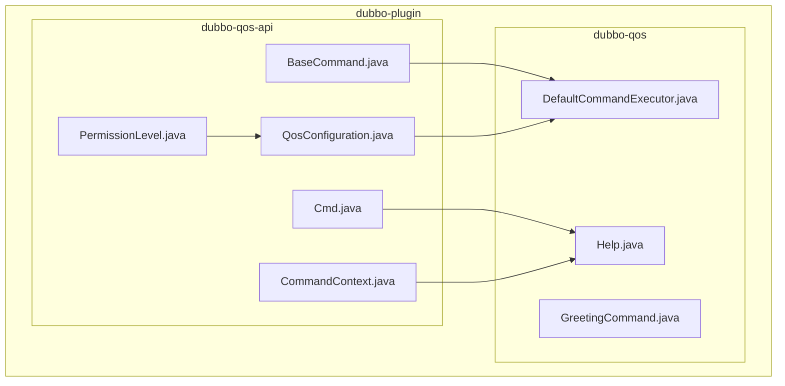
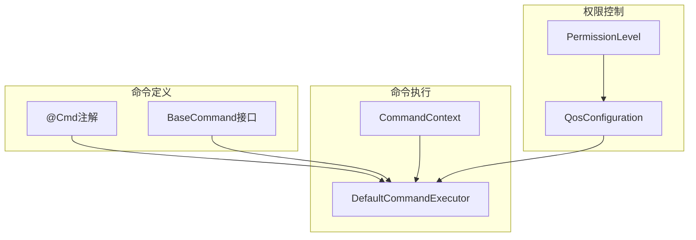
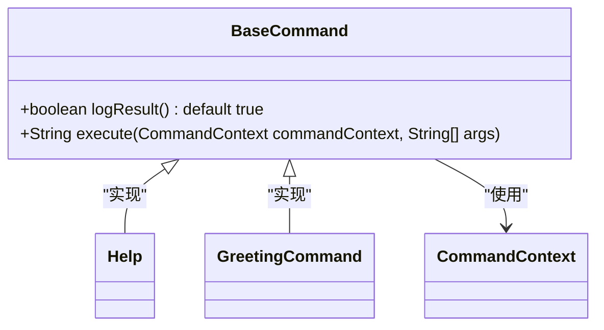
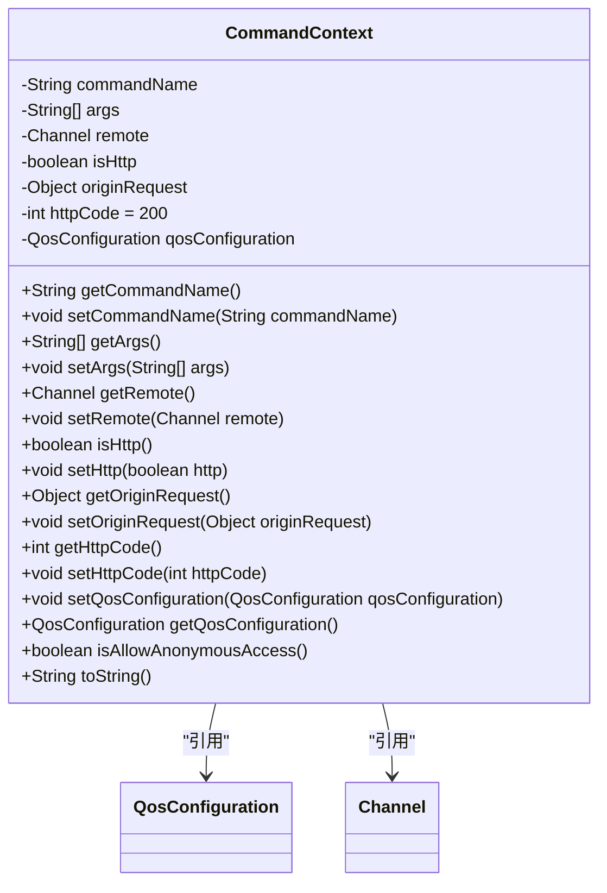
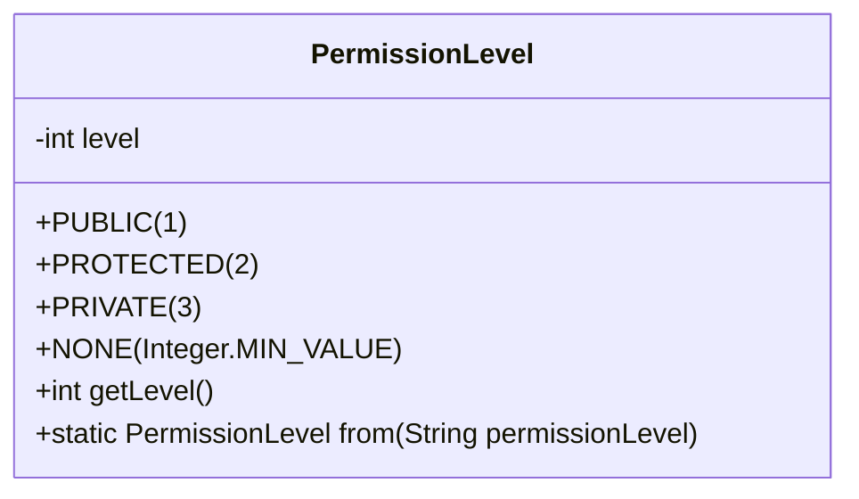
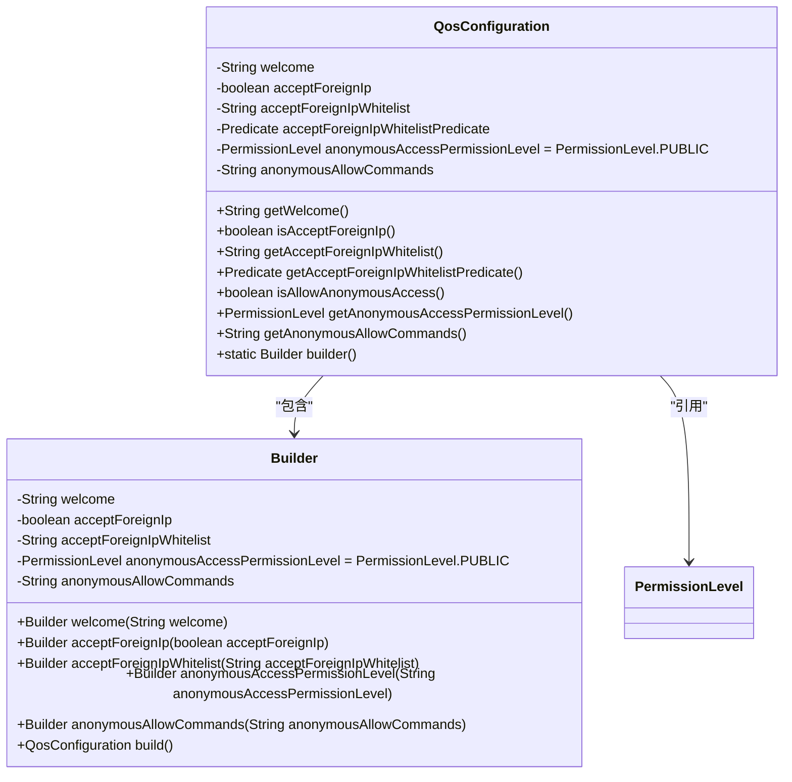
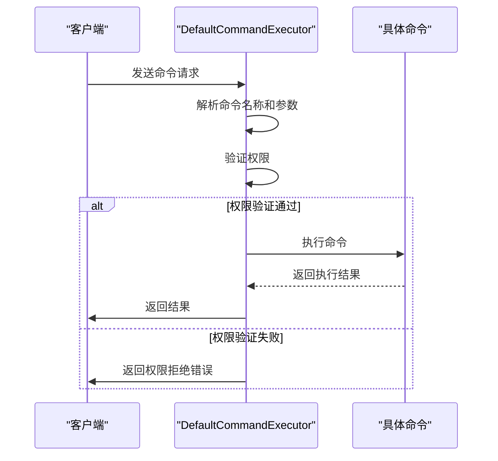
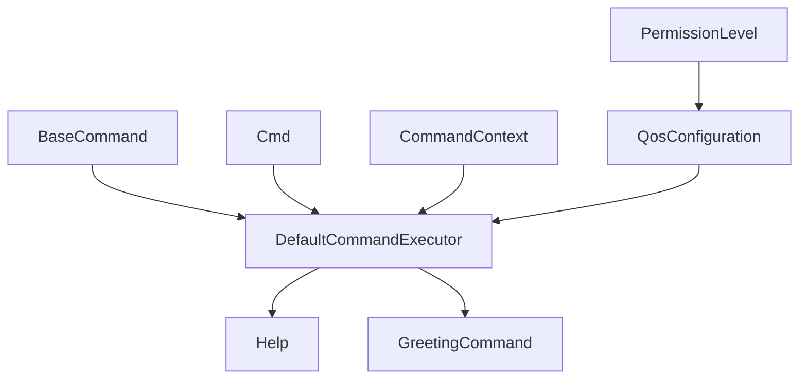

# 自定义命令开发

<cite>
**本文档引用的文件**  
- [BaseCommand.java](file://dubbo-plugin\dubbo-qos-api\src\main\java\org\apache\dubbo\qos\api\BaseCommand.java)
- [CommandContext.java](file://dubbo-plugin\dubbo-qos-api\src\main\java\org\apache\dubbo\qos\api\CommandContext.java)
- [Cmd.java](file://dubbo-plugin\dubbo-qos-api\src\main\java\org\apache\dubbo\qos\api\Cmd.java)
- [PermissionLevel.java](file://dubbo-plugin\dubbo-qos-api\src\main\java\org\apache\dubbo\qos\api\PermissionLevel.java)
- [QosConfiguration.java](file://dubbo-plugin\dubbo-qos-api\src\main\java\org\apache\dubbo\qos\api\QosConfiguration.java)
- [Help.java](file://dubbo-plugin\dubbo-qos\src\main\java\org\apache\dubbo\qos\command\impl\Help.java)
- [DefaultCommandExecutor.java](file://dubbo-plugin\dubbo-qos\src\main\java\org\apache\dubbo\qos\command\DefaultCommandExecutor.java)
- [GreetingCommand.java](file://dubbo-plugin\dubbo-qos\src\test\java\org\apache\dubbo\qos\command\GreetingCommand.java)
</cite>

## 目录
1. [引言](#引言)
2. [项目结构](#项目结构)
3. [核心组件](#核心组件)
4. [架构概述](#架构概述)
5. [详细组件分析](#详细组件分析)
6. [依赖分析](#依赖分析)
7. [性能考虑](#性能考虑)
8. [故障排除指南](#故障排除指南)
9. [结论](#结论)

## 引言
本文档深入探讨了Dubbo框架中QoS（Quality of Service）自定义命令的开发。文档全面解释了@Cmd注解的使用方法和属性配置，描述了自定义命令类的编写规范。详细说明了如何处理命令参数、生成命令输出和处理异常情况。提供了完整的自定义命令开发示例，包括命令注册、参数解析和结果格式化。为初学者提供简单的健康检查命令开发教程，同时为高级开发者提供复杂诊断工具的开发指南，如内存分析和性能剖析命令。

## 项目结构
Dubbo项目的QoS功能主要位于dubbo-plugin模块中，特别是dubbo-qos-api和dubbo-qos子模块。这些模块提供了自定义命令开发所需的核心API和实现。



**图示来源**
- [BaseCommand.java](file://dubbo-plugin\dubbo-qos-api\src\main\java\org\apache\dubbo\qos\api\BaseCommand.java)
- [Cmd.java](file://dubbo-plugin\dubbo-qos-api\src\main\java\org\apache\dubbo\qos\api\Cmd.java)
- [CommandContext.java](file://dubbo-plugin\dubbo-qos-api\src\main\java\org\apache\dubbo\qos\api\CommandContext.java)
- [PermissionLevel.java](file://dubbo-plugin\dubbo-qos-api\src\main\java\org\apache\dubbo\qos\api\PermissionLevel.java)
- [QosConfiguration.java](file://dubbo-plugin\dubbo-qos-api\src\main\java\org\apache\dubbo\qos\api\QosConfiguration.java)
- [DefaultCommandExecutor.java](file://dubbo-plugin\dubbo-qos\src\main\java\org\apache\dubbo\qos\command\DefaultCommandExecutor.java)
- [Help.java](file://dubbo-plugin\dubbo-qos\src\main\java\org\apache\dubbo\qos\command\impl\Help.java)
- [GreetingCommand.java](file://dubbo-plugin\dubbo-qos\src\test\java\org\apache\dubbo\qos\command\GreetingCommand.java)

**章节来源**
- [BaseCommand.java](file://dubbo-plugin\dubbo-qos-api\src\main\java\org\apache\dubbo\qos\api\BaseCommand.java)
- [Cmd.java](file://dubbo-plugin\dubbo-qos-api\src\main\java\org\apache\dubbo\qos\api\Cmd.java)

## 核心组件
QoS自定义命令的核心组件包括BaseCommand接口、Cmd注解、CommandContext类、PermissionLevel枚举和QosConfiguration类。这些组件共同构成了自定义命令开发的基础框架。

**章节来源**
- [BaseCommand.java](file://dubbo-plugin\dubbo-qos-api\src\main\java\org\apache\dubbo\qos\api\BaseCommand.java)
- [Cmd.java](file://dubbo-plugin\dubbo-qos-api\src\main\java\org\apache\dubbo\qos\api\Cmd.java)
- [CommandContext.java](file://dubbo-plugin\dubbo-qos-api\src\main\java\org\apache\dubbo\qos\api\CommandContext.java)
- [PermissionLevel.java](file://dubbo-plugin\dubbo-qos-api\src\main\java\org\apache\dubbo\qos\api\PermissionLevel.java)
- [QosConfiguration.java](file://dubbo-plugin\dubbo-qos-api\src\main\java\org\apache\dubbo\qos\api\QosConfiguration.java)

## 架构概述
Dubbo QoS自定义命令的架构基于SPI（Service Provider Interface）扩展机制，通过注解驱动的方式实现命令的注册和执行。整个架构分为命令定义、命令执行和权限控制三个主要部分。



**图示来源**
- [BaseCommand.java](file://dubbo-plugin\dubbo-qos-api\src\main\java\org\apache\dubbo\qos\api\BaseCommand.java)
- [Cmd.java](file://dubbo-plugin\dubbo-qos-api\src\main\java\org\apache\dubbo\qos\api\Cmd.java)
- [CommandContext.java](file://dubbo-plugin\dubbo-qos-api\src\main\java\org\apache\dubbo\qos\api\CommandContext.java)
- [PermissionLevel.java](file://dubbo-plugin\dubbo-qos-api\src\main\java\org\apache\dubbo\qos\api\PermissionLevel.java)
- [QosConfiguration.java](file://dubbo-plugin\dubbo-qos-api\src\main\java\org\apache\dubbo\qos\api\QosConfiguration.java)
- [DefaultCommandExecutor.java](file://dubbo-plugin\dubbo-qos\src\main\java\org\apache\dubbo\qos\command\DefaultCommandExecutor.java)

## 详细组件分析
### @Cmd注解分析
@Cmd注解是自定义命令的核心，用于定义命令的元数据信息，包括命令名称、描述、示例、排序和权限级别。

```mermaid
classDiagram
class Cmd {
+String name()
+String summary()
+String[] example() default {}
+int sort() default 0
+PermissionLevel requiredPermissionLevel() default PermissionLevel.PROTECTED
}
Cmd --> PermissionLevel : "引用"
```

**图示来源**
- [Cmd.java](file://dubbo-plugin\dubbo-qos-api\src\main\java\org\apache\dubbo\qos\api\Cmd.java)
- [PermissionLevel.java](file://dubbo-plugin\dubbo-qos-api\src\main\java\org\apache\dubbo\qos\api\PermissionLevel.java)

**章节来源**
- [Cmd.java](file://dubbo-plugin\dubbo-qos-api\src\main\java\org\apache\dubbo\qos\api\Cmd.java)

### BaseCommand接口分析
BaseCommand接口定义了自定义命令的基本行为，所有自定义命令都必须实现此接口。



**图示来源**
- [BaseCommand.java](file://dubbo-plugin\dubbo-qos-api\src\main\java\org\apache\dubbo\qos\api\BaseCommand.java)
- [CommandContext.java](file://dubbo-plugin\dubbo-qos-api\src\main\java\org\apache\dubbo\qos\api\CommandContext.java)
- [Help.java](file://dubbo-plugin\dubbo-qos\src\main\java\org\apache\dubbo\qos\command\impl\Help.java)
- [GreetingCommand.java](file://dubbo-plugin\dubbo-qos\src\test\java\org\apache\dubbo\qos\command\GreetingCommand.java)

**章节来源**
- [BaseCommand.java](file://dubbo-plugin\dubbo-qos-api\src\main\java\org\apache\dubbo\qos\api\BaseCommand.java)

### CommandContext类分析
CommandContext类封装了命令执行的上下文信息，包括命令名称、参数、远程连接、HTTP状态等。



**图示来源**
- [CommandContext.java](file://dubbo-plugin\dubbo-qos-api\src\main\java\org\apache\dubbo\qos\api\CommandContext.java)
- [QosConfiguration.java](file://dubbo-plugin\dubbo-qos-api\src\main\java\org\apache\dubbo\qos\api\QosConfiguration.java)

**章节来源**
- [CommandContext.java](file://dubbo-plugin\dubbo-qos-api\src\main\java\org\apache\dubbo\qos\api\CommandContext.java)

### PermissionLevel枚举分析
PermissionLevel枚举定义了命令的权限级别，用于控制命令的访问权限。



**图示来源**
- [PermissionLevel.java](file://dubbo-plugin\dubbo-qos-api\src\main\java\org\apache\dubbo\qos\api\PermissionLevel.java)

**章节来源**
- [PermissionLevel.java](file://dubbo-plugin\dubbo-qos-api\src\main\java\org\apache\dubbo\qos\api\PermissionLevel.java)

### QosConfiguration类分析
QosConfiguration类用于配置QoS服务的行为，包括欢迎信息、IP访问控制和匿名访问权限等。



**图示来源**
- [QosConfiguration.java](file://dubbo-plugin\dubbo-qos-api\src\main\java\org\apache\dubbo\qos\api\QosConfiguration.java)
- [PermissionLevel.java](file://dubbo-plugin\dubbo-qos-api\src\main\java\org\apache\dubbo\qos\api\PermissionLevel.java)

**章节来源**
- [QosConfiguration.java](file://dubbo-plugin\dubbo-qos-api\src\main\java\org\apache\dubbo\qos\api\QosConfiguration.java)

### DefaultCommandExecutor分析
DefaultCommandExecutor是命令执行的核心组件，负责解析命令、验证权限并执行相应的命令处理逻辑。



**图示来源**
- [DefaultCommandExecutor.java](file://dubbo-plugin\dubbo-qos\src\main\java\org\apache\dubbo\qos\command\DefaultCommandExecutor.java)

**章节来源**
- [DefaultCommandExecutor.java](file://dubbo-plugin\dubbo-qos\src\main\java\org\apache\dubbo\qos\command\DefaultCommandExecutor.java)

## 依赖分析
QoS自定义命令系统依赖于Dubbo框架的SPI扩展机制，通过ExtensionScope.FRAMEWORK作用域确保命令在整个框架范围内可用。各组件之间的依赖关系清晰，遵循了高内聚低耦合的设计原则。



**图示来源**
- [BaseCommand.java](file://dubbo-plugin\dubbo-qos-api\src\main\java\org\apache\dubbo\qos\api\BaseCommand.java)
- [Cmd.java](file://dubbo-plugin\dubbo-qos-api\src\main\java\org\apache\dubbo\qos\api\Cmd.java)
- [CommandContext.java](file://dubbo-plugin\dubbo-qos-api\src\main\java\org\apache\dubbo\qos\api\CommandContext.java)
- [PermissionLevel.java](file://dubbo-plugin\dubbo-qos-api\src\main\java\org\apache\dubbo\qos\api\PermissionLevel.java)
- [QosConfiguration.java](file://dubbo-plugin\dubbo-qos-api\src\main\java\org\apache\dubbo\qos\api\QosConfiguration.java)
- [DefaultCommandExecutor.java](file://dubbo-plugin\dubbo-qos\src\main\java\org\apache\dubbo\qos\command\DefaultCommandExecutor.java)
- [Help.java](file://dubbo-plugin\dubbo-qos\src\main\java\org\apache\dubbo\qos\command\impl\Help.java)
- [GreetingCommand.java](file://dubbo-plugin\dubbo-qos\src\test\java\org\apache\dubbo\qos\command\GreetingCommand.java)

**章节来源**
- [BaseCommand.java](file://dubbo-plugin\dubbo-qos-api\src\main\java\org\apache\dubbo\qos\api\BaseCommand.java)
- [Cmd.java](file://dubbo-plugin\dubbo-qos-api\src\main\java\org\apache\dubbo\qos\api\Cmd.java)
- [CommandContext.java](file://dubbo-plugin\dubbo-qos-api\src\main\java\org\apache\dubbo\qos\api\CommandContext.java)
- [PermissionLevel.java](file://dubbo-plugin\dubbo-qos-api\src\main\java\org\apache\dubbo\qos\api\PermissionLevel.java)
- [QosConfiguration.java](file://dubbo-plugin\dubbo-qos-api\src\main\java\org\apache\dubbo\qos\api\QosConfiguration.java)
- [DefaultCommandExecutor.java](file://dubbo-plugin\dubbo-qos\src\main\java\org\apache\dubbo\qos\command\DefaultCommandExecutor.java)

## 性能考虑
QoS自定义命令系统在设计时考虑了性能因素，通过WeakHashMap缓存帮助信息，避免重复计算。同时，使用Builder模式构建QosConfiguration，提高了配置的灵活性和性能。

**章节来源**
- [Help.java](file://dubbo-plugin\dubbo-qos\src\main\java\org\apache\dubbo\qos\command\impl\Help.java)
- [QosConfiguration.java](file://dubbo-plugin\dubbo-qos-api\src\main\java\org\apache\dubbo\qos\api\QosConfiguration.java)

## 故障排除指南
在开发和使用QoS自定义命令时，可能会遇到权限拒绝、命令未找到等常见问题。通过检查QosConfiguration配置、命令注解和权限级别设置，可以有效解决这些问题。

**章节来源**
- [DefaultCommandExecutor.java](file://dubbo-plugin\dubbo-qos\src\main\java\org\apache\dubbo\qos\command\DefaultCommandExecutor.java)
- [QosConfiguration.java](file://dubbo-plugin\dubbo-qos-api\src\main\java\org\apache\dubbo\qos\api\QosConfiguration.java)

## 结论
Dubbo的QoS自定义命令系统提供了一套完整、灵活且安全的命令行接口开发框架。通过@Cmd注解、BaseCommand接口和CommandContext类的组合使用，开发者可以轻松创建各种自定义命令。系统的权限控制机制确保了命令的安全性，而SPI扩展机制则保证了良好的可扩展性。这套系统不仅适用于简单的健康检查命令，也能支持复杂的诊断工具开发，为Dubbo应用的运维和管理提供了强大的支持。