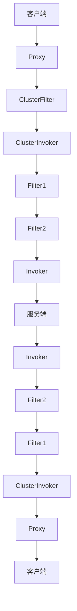
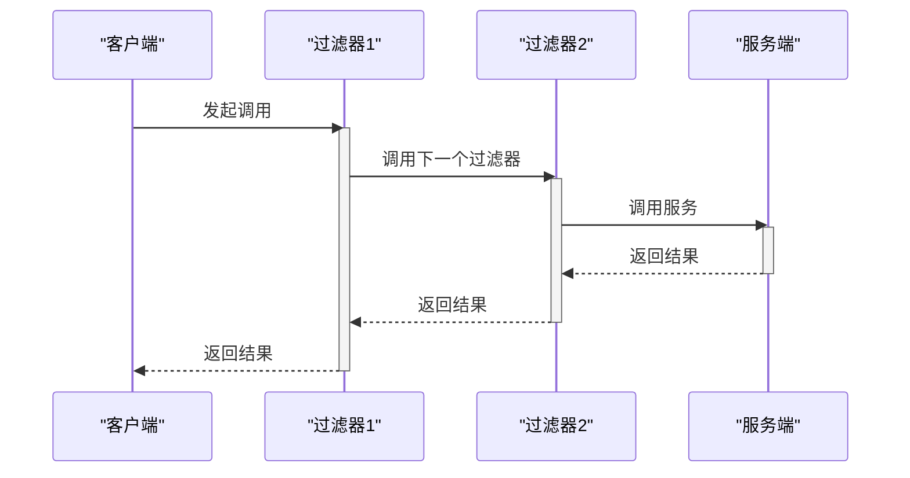

# dubbo-plugin模块

<cite>
**本文档引用的文件**   
- [Filter.java](file://dubbo-rpc\dubbo-rpc-api\src\main\java\org\apache\dubbo\rpc\Filter.java)
- [BaseFilter.java](file://dubbo-rpc\dubbo-rpc-api\src\main\java\org\apache\dubbo\rpc\BaseFilter.java)
- [Authenticator.java](file://dubbo-plugin\dubbo-auth\src\main\java\org\apache\dubbo\auth\spi\Authenticator.java)
- [BaseCommand.java](file://dubbo-plugin\dubbo-qos-api\src\main\java\org\apache\dubbo\qos\api\BaseCommand.java)
- [Cmd.java](file://dubbo-plugin\dubbo-qos-api\src\main\java\org\apache\dubbo\qos\api\Cmd.java)
- [QosConfiguration.java](file://dubbo-plugin\dubbo-qos-api\src\main\java\org\apache\dubbo\qos\api\QosConfiguration.java)
- [FilterChainBuilder.java](file://dubbo-cluster\src\main\java\org\apache\dubbo\rpc\cluster\filter\FilterChainBuilder.java)
</cite>

## 目录
1. [简介](#简介)
2. [插件化架构](#插件化架构)
3. [过滤器链设计与实现](#过滤器链设计与实现)
4. [安全认证实现](#安全认证实现)
5. [QoS控制台功能](#qos控制台功能)
6. [插件加载与管理](#插件加载与管理)
7. [过滤器示例](#过滤器示例)
8. [插件开发指南](#插件开发指南)
9. [执行流程图](#执行流程图)

## 简介
dubbo-plugin模块是Apache Dubbo框架的核心插件系统，提供了一套完整的插件化架构。该模块通过SPI（Service Provider Interface）机制实现了高度可扩展的系统设计，主要包括过滤器（Filter）、QoS（Quality of Service）控制台和安全认证（Authenticator）等核心功能。这些插件机制使得Dubbo能够在不修改核心代码的情况下，灵活地扩展各种功能，满足不同场景的需求。

## 插件化架构
dubbo-plugin模块采用基于SPI的插件化架构设计，通过Java的扩展机制实现功能的动态加载和替换。整个架构的核心是SPI（Service Provider Interface）机制，它允许开发者在不修改框架源码的情况下，通过简单的配置即可扩展或替换框架的特定功能。

插件化架构的主要特点包括：
- **模块化设计**：每个插件都是独立的模块，可以独立开发、测试和部署
- **动态加载**：插件在运行时动态加载，无需重启应用
- **可配置性**：通过配置文件或注解方式灵活配置插件的启用和参数
- **扩展性**：支持自定义插件的开发和集成

这种架构设计使得Dubbo框架具有极高的灵活性和可扩展性，能够适应各种复杂的业务场景。

**Section sources**
- [Filter.java](file://dubbo-rpc\dubbo-rpc-api\src\main\java\org\apache\dubbo\rpc\Filter.java)
- [BaseCommand.java](file://dubbo-plugin\dubbo-qos-api\src\main\java\org\apache\dubbo\qos\api\BaseCommand.java)
- [Authenticator.java](file://dubbo-plugin\dubbo-auth\src\main\java\org\apache\dubbo\auth\spi\Authenticator.java)

## 过滤器链设计与实现
过滤器链是dubbo-plugin模块的核心机制之一，用于在RPC调用过程中插入自定义的处理逻辑。过滤器链采用责任链模式设计，每个过滤器负责处理特定的业务逻辑，并将请求传递给下一个过滤器。

### 过滤器接口
`Filter`接口是所有过滤器的基础，定义了过滤器的核心方法：
```java
public interface Filter extends BaseFilter {
    Result invoke(Invoker<?> invoker, Invocation invocation) throws RpcException;
}
```

### 过滤器链执行流程
过滤器链的执行流程如下：
1. 客户端发起RPC调用
2. 请求进入过滤器链的第一个过滤器
3. 每个过滤器执行预处理逻辑
4. 调用`invoker.invoke()`方法将请求传递给下一个节点
5. 服务端处理请求并返回结果
6. 结果沿过滤器链反向传递
7. 每个过滤器执行后处理逻辑
8. 返回最终结果给客户端

### 过滤器链构建
`FilterChainBuilder`类负责构建过滤器链，通过`CopyOfFilterChainNode`内部类将多个过滤器连接成链式结构。每个节点包含原始调用者、下一个节点和当前过滤器三个核心组件。



**Diagram sources**
- [Filter.java](file://dubbo-rpc\dubbo-rpc-api\src\main\java\org\apache\dubbo\rpc\Filter.java)
- [FilterChainBuilder.java](file://dubbo-cluster\src\main\java\org\apache\dubbo\rpc\cluster\filter\FilterChainBuilder.java)

**Section sources**
- [Filter.java](file://dubbo-rpc\dubbo-rpc-api\src\main\java\org\apache\dubbo\rpc\Filter.java)
- [BaseFilter.java](file://dubbo-rpc\dubbo-rpc-api\src\main\java\org\apache\dubbo\rpc\BaseFilter.java)
- [FilterChainBuilder.java](file://dubbo-cluster\src\main\java\org\apache\dubbo\rpc\cluster\filter\FilterChainBuilder.java)

## 安全认证实现
安全认证机制通过`Authenticator`接口实现，为Dubbo服务提供了统一的认证框架。该机制允许在RPC调用前后进行身份验证和签名处理，确保服务调用的安全性。

### Authenticator接口
`Authenticator`接口定义了两个核心方法：
- `sign(Invocation invocation, URL url)`：对请求进行签名
- `authenticate(Invocation invocation, URL url)`：验证请求签名的有效性

```java
@SPI(scope = ExtensionScope.FRAMEWORK, value = "basic")
public interface Authenticator {
    void sign(Invocation invocation, URL url);
    void authenticate(Invocation invocation, URL url) throws RpcAuthenticationException;
}
```

### 认证流程
安全认证的执行流程如下：
1. 客户端发起调用前，调用`sign`方法对请求进行签名
2. 请求通过网络传输到服务端
3. 服务端接收到请求后，调用`authenticate`方法验证签名
4. 如果验证通过，继续处理请求；否则抛出`RpcAuthenticationException`异常
5. 处理结果返回客户端

这种设计实现了认证逻辑与业务逻辑的分离，使得认证机制可以灵活地应用于不同的服务场景。

**Diagram sources**
- [Authenticator.java](file://dubbo-plugin\dubbo-auth\src\main\java\org\apache\dubbo\auth\spi\Authenticator.java)

**Section sources**
- [Authenticator.java](file://dubbo-plugin\dubbo-auth\src\main\java\org\apache\dubbo\auth\spi\Authenticator.java)

## QoS控制台功能
QoS（Quality of Service）控制台为Dubbo服务提供了运行时管理和监控能力。通过QoS控制台，运维人员可以实时查看服务状态、执行管理命令和进行故障排查。

### 命令接口
`BaseCommand`接口定义了QoS命令的基本规范：
```java
@SPI(scope = ExtensionScope.FRAMEWORK)
public interface BaseCommand {
    default boolean logResult() {
        return true;
    }
    String execute(CommandContext commandContext, String[] args);
}
```

### 命令注解
`Cmd`注解用于定义QoS命令的元数据：
- `name()`：命令名称
- `summary()`：命令描述
- `example()`：使用示例
- `sort()`：帮助中的排序
- `requiredPermissionLevel()`：所需权限级别

### 配置管理
`QosConfiguration`类提供了QoS功能的配置管理，包括：
- 欢迎信息配置
- 外部IP访问控制
- 匿名访问权限级别
- 命令白名单管理

这些配置可以通过代码或配置文件进行设置，为QoS功能提供了灵活的管理方式。

**Diagram sources**
- [BaseCommand.java](file://dubbo-plugin\dubbo-qos-api\src\main\java\org\apache\dubbo\qos\api\BaseCommand.java)
- [Cmd.java](file://dubbo-plugin\dubbo-qos-api\src\main\java\org\apache\dubbo\qos\api\Cmd.java)
- [QosConfiguration.java](file://dubbo-plugin\dubbo-qos-api\src\main\java\org\apache\dubbo\qos\api\QosConfiguration.java)

**Section sources**
- [BaseCommand.java](file://dubbo-plugin\dubbo-qos-api\src\main\java\org\apache\dubbo\qos\api\BaseCommand.java)
- [Cmd.java](file://dubbo-plugin\dubbo-qos-api\src\main\java\org\apache\dubbo\qos\api\Cmd.java)
- [QosConfiguration.java](file://dubbo-plugin\dubbo-qos-api\src\main\java\org\apache\dubbo\qos\api\QosConfiguration.java)

## 插件加载与管理
dubbo-plugin模块的插件加载与管理基于SPI机制实现，通过`@SPI`注解和配置文件的方式进行插件的注册和管理。

### SPI机制
SPI（Service Provider Interface）是Java提供的一种服务发现机制。Dubbo通过SPI机制实现了插件的动态加载，主要特点包括：
- **扩展点注解**：使用`@SPI`注解标记接口为扩展点
- **默认实现**：通过`value`属性指定默认实现
- **作用域控制**：通过`scope`属性控制扩展点的作用域

### 配置文件
插件的实现类通过配置文件进行注册，配置文件位于`META-INF/dubbo/internal/`目录下，文件名与接口全限定名相同。配置文件采用键值对格式：
```
filter=org.apache.dubbo.rpc.cluster.filter.ProtocolFilterWrapper
```

### 扩展加载
扩展加载过程如下：
1. 通过`ExtensionLoader`获取扩展加载器
2. 根据配置文件加载所有实现类
3. 根据条件选择合适的实现
4. 实例化并返回扩展对象

这种机制使得插件的管理和使用变得简单而灵活。

**Section sources**
- [Filter.java](file://dubbo-rpc\dubbo-rpc-api\src\main\java\org\apache\dubbo\rpc\Filter.java)
- [BaseCommand.java](file://dubbo-plugin\dubbo-qos-api\src\main\java\org\apache\dubbo\qos\api\BaseCommand.java)
- [Authenticator.java](file://dubbo-plugin\dubbo-auth\src\main\java\org\apache\dubbo\auth\spi\Authenticator.java)

## 过滤器示例
本节提供一个简单的过滤器示例，帮助初学者理解过滤器的开发和使用。

### 基础过滤器
```java
@Activate(group = CommonConstants.PROVIDER, order = 10200)
public class MultipleRegistryCenterInjvmFilter implements Filter, Filter.Listener {
    private boolean called = false;
    private boolean error = false;
    
    @Override
    public Result invoke(Invoker<?> invoker, Invocation invocation) throws RpcException {
        // 前置处理
        called = true;
        
        try {
            // 调用下一个过滤器或服务
            Result result = invoker.invoke(invocation);
            return result;
        } catch (Exception e) {
            error = true;
            throw e;
        }
    }
}
```

这个示例展示了如何创建一个简单的过滤器，通过`@Activate`注解指定过滤器的激活条件，实现`invoke`方法处理请求。

**Section sources**
- [MultipleRegistryCenterInjvmFilter.java](file://dubbo-config\dubbo-config-api\src\test\java\org\apache\dubbo\config\integration\multiple\injvm\MultipleRegistryCenterInjvmFilter.java)

## 插件开发指南
本节为经验丰富的开发者提供复杂的插件开发指南。

### 高级过滤器开发
开发高级过滤器时需要注意以下几点：
1. **异常处理**：正确处理各种异常情况，避免影响正常调用流程
2. **性能优化**：避免在过滤器中进行耗时操作，影响RPC调用性能
3. **线程安全**：确保过滤器实现是线程安全的
4. **日志记录**：合理使用日志，便于问题排查

### 自定义认证插件
开发自定义认证插件的步骤：
1. 实现`Authenticator`接口
2. 添加`@SPI`注解，指定扩展名
3. 在`META-INF/dubbo/internal/`目录下创建配置文件
4. 实现`sign`和`authenticate`方法

### QoS命令开发
开发自定义QoS命令的步骤：
1. 实现`BaseCommand`接口
2. 使用`@Cmd`注解配置命令信息
3. 实现`execute`方法处理命令逻辑
4. 在配置文件中注册命令实现

这些指南为开发者提供了开发复杂插件的参考，帮助构建功能丰富的Dubbo生态系统。

**Section sources**
- [Filter.java](file://dubbo-rpc\dubbo-rpc-api\src\main\java\org\apache\dubbo\rpc\Filter.java)
- [Authenticator.java](file://dubbo-plugin\dubbo-auth\src\main\java\org\apache\dubbo\auth\spi\Authenticator.java)
- [BaseCommand.java](file://dubbo-plugin\dubbo-qos-api\src\main\java\org\apache\dubbo\qos\api\BaseCommand.java)

## 执行流程图
本节提供过滤器链的执行流程图和插件生命周期图，帮助理解插件的执行过程。

### 过滤器链执行流程


**Diagram sources**
- [Filter.java](file://dubbo-rpc\dubbo-rpc-api\src\main\java\org\apache\dubbo\rpc\Filter.java)

### 插件生命周期


**Diagram sources**
- [Filter.java](file://dubbo-rpc\dubbo-rpc-api\src\main\java\org\apache\dubbo\rpc\Filter.java)
- [BaseCommand.java](file://dubbo-plugin\dubbo-qos-api\src\main\java\org\apache\dubbo\qos\api\BaseCommand.java)
- [Authenticator.java](file://dubbo-plugin\dubbo-auth\src\main\java\org\apache\dubbo\auth\spi\Authenticator.java)