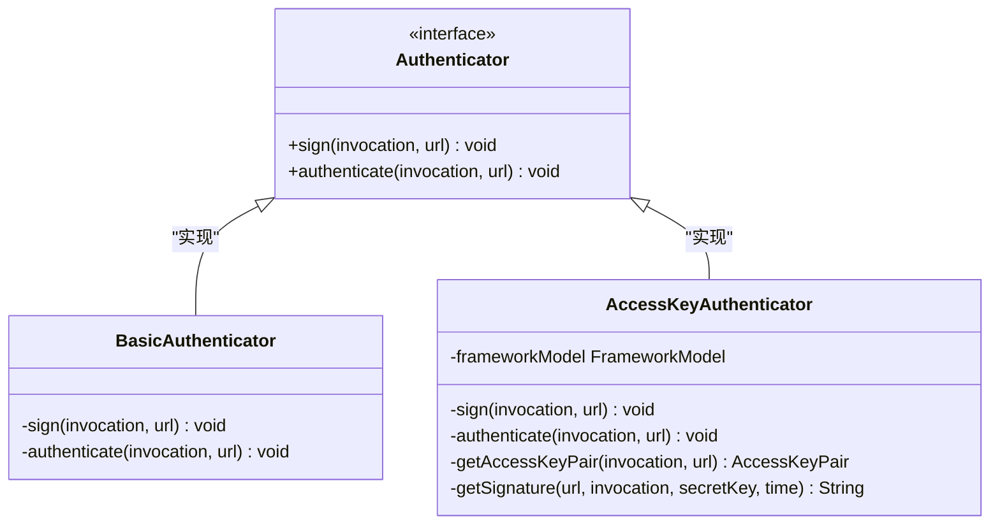
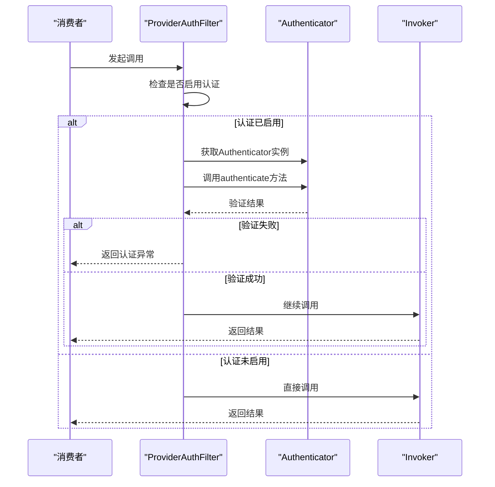
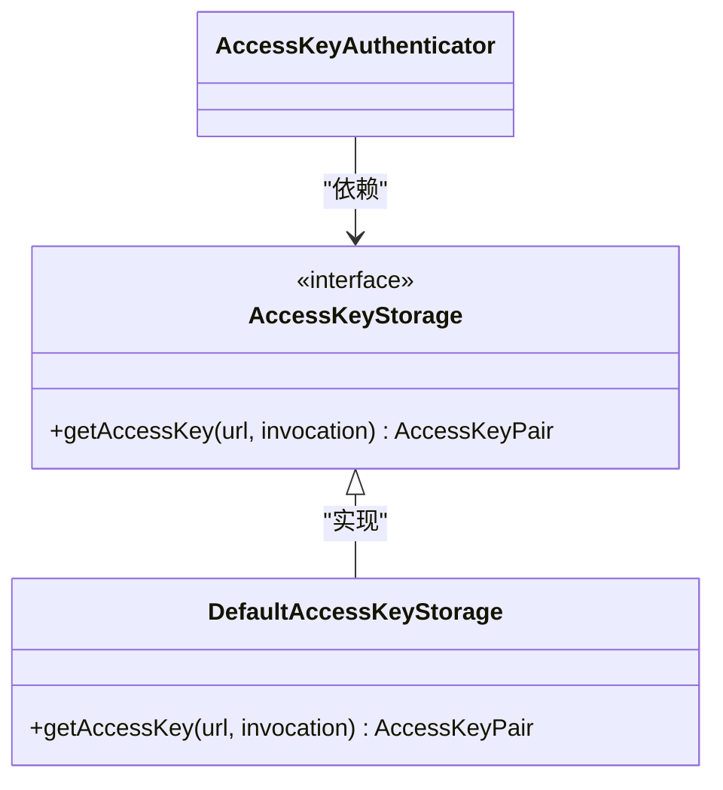
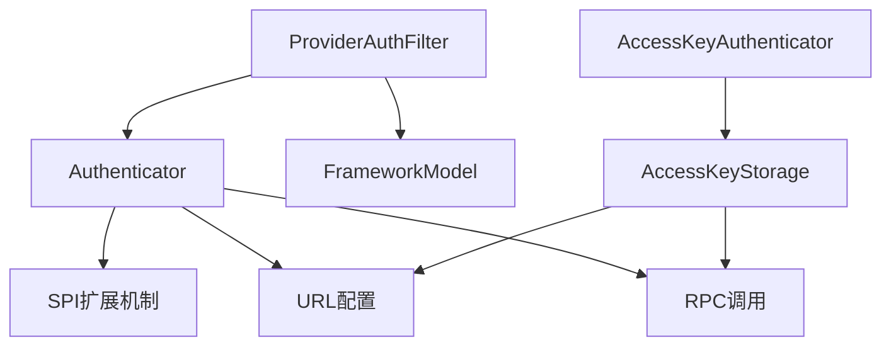

# Authenticator接口设计

<cite>
**本文档引用的文件**   
- [Authenticator.java](file://dubbo-plugin\dubbo-auth\src\main\java\org\apache\dubbo\auth\spi\Authenticator.java)
- [BasicAuthenticator.java](file://dubbo-plugin\dubbo-auth\src\main\java\org\apache\dubbo\auth\BasicAuthenticator.java)
- [AccessKeyAuthenticator.java](file://dubbo-plugin\dubbo-auth\src\main\java\org\apache\dubbo\auth\AccessKeyAuthenticator.java)
- [ProviderAuthFilter.java](file://dubbo-plugin\dubbo-auth\src\main\java\org\apache\dubbo\auth\filter\ProviderAuthFilter.java)
- [Constants.java](file://dubbo-plugin\dubbo-auth\src\main\java\org\apache\dubbo\auth\Constants.java)
- [AccessKeyStorage.java](file://dubbo-plugin\dubbo-auth\src\main\java\org\apache\dubbo\auth\spi\AccessKeyStorage.java)
- [DefaultAccessKeyStorage.java](file://dubbo-plugin\dubbo-auth\src\main\java\org\apache\dubbo\auth\DefaultAccessKeyStorage.java)
</cite>

## 目录
1. [引言](#引言)
2. [核心组件](#核心组件)
3. [架构概述](#架构概述)
4. [详细组件分析](#详细组件分析)
5. [依赖分析](#依赖分析)
6. [性能考虑](#性能考虑)
7. [故障排除指南](#故障排除指南)
8. [结论](#结论)

## 引言
Authenticator接口是Dubbo认证体系的核心组件，负责实现服务调用的安全认证机制。该接口通过SPI扩展机制提供了灵活的认证策略，支持基本认证和访问密钥认证等多种认证方式。本文档深入分析Authenticator接口的设计原理、方法定义和契约规范，详细说明其在Dubbo认证体系中的核心作用。

## 核心组件
Authenticator接口是Dubbo认证体系的核心，定义了服务调用的认证契约。该接口包含两个核心方法：sign用于为请求添加认证签名，authenticate用于验证请求的认证信息。接口通过SPI机制实现扩展，支持多种认证策略的动态切换。BasicAuthenticator和AccessKeyAuthenticator是两个主要的实现类，分别提供基本认证和访问密钥认证功能。

**核心组件**
- [Authenticator.java](file://dubbo-plugin\dubbo-auth\src\main\java\org\apache\dubbo\auth\spi\Authenticator.java#L25-L43)
- [BasicAuthenticator.java](file://dubbo-plugin\dubbo-auth\src\main\java\org\apache\dubbo\auth\BasicAuthenticator.java#L28-L54)
- [AccessKeyAuthenticator.java](file://dubbo-plugin\dubbo-auth\src\main\java\org\apache\dubbo\auth\AccessKeyAuthenticator.java#L32-L102)

## 架构概述
Authenticator接口在Dubbo认证体系中扮演着关键角色，通过ProviderAuthFilter与服务调用流程集成。当服务提供者启用认证功能时，ProviderAuthFilter会加载配置的Authenticator实现，对每个服务调用进行认证验证。整个认证流程遵循SPI扩展机制，允许用户自定义认证策略。

```mermaid
graph TB
subgraph "认证体系"
Authenticator[Authenticator接口]
BasicAuth[BasicAuthenticator]
AccessKeyAuth[AccessKeyAuthenticator]
ProviderFilter[ProviderAuthFilter]
AccessKeyStorage[AccessKeyStorage]
DefaultStorage[DefaultAccessKeyStorage]
end
ProviderFilter --> Authenticator : "依赖"
Authenticator --> BasicAuth : "实现"
Authenticator --> AccessKeyAuth : "实现"
AccessKeyAuth --> AccessKeyStorage : "依赖"
AccessKeyStorage --> DefaultStorage : "实现"
```

**图示来源**
- [Authenticator.java](file://dubbo-plugin\dubbo-auth\src\main\java\org\apache\dubbo\auth\spi\Authenticator.java#L25-L43)
- [ProviderAuthFilter.java](file://dubbo-plugin\dubbo-auth\src\main\java\org\apache\dubbo\auth\filter\ProviderAuthFilter.java#L32-L58)
- [AccessKeyStorage.java](file://dubbo-plugin\dubbo-auth\src\main\java\org\apache\dubbo\auth\spi\AccessKeyStorage.java#L29-L39)

## 详细组件分析

### Authenticator接口分析
Authenticator接口是Dubbo认证体系的核心契约，定义了服务调用的认证标准。接口通过@SPI注解标记为SPI扩展点，缺省实现为"basic"认证策略。接口包含两个核心方法：sign用于为请求添加认证信息，authenticate用于验证请求的认证有效性。



**图示来源**
- [Authenticator.java](file://dubbo-plugin\dubbo-auth\src\main\java\org\apache\dubbo\auth\spi\Authenticator.java#L25-L43)
- [BasicAuthenticator.java](file://dubbo-plugin\dubbo-auth\src\main\java\org\apache\dubbo\auth\BasicAuthenticator.java#L28-L54)
- [AccessKeyAuthenticator.java](file://dubbo-plugin\dubbo-auth\src\main\java\org\apache\dubbo\auth\AccessKeyAuthenticator.java#L32-L102)

### 认证流程分析
Authenticator接口的认证流程通过ProviderAuthFilter集成到服务调用链中。当服务提供者启用认证功能时，过滤器会加载配置的Authenticator实现，对每个服务调用进行认证验证。认证流程包括参数传递、签名验证和异常处理等关键环节。



**图示来源**
- [ProviderAuthFilter.java](file://dubbo-plugin\dubbo-auth\src\main\java\org\apache\dubbo\auth\filter\ProviderAuthFilter.java#L40-L57)
- [Authenticator.java](file://dubbo-plugin\dubbo-auth\src\main\java\org\apache\dubbo\auth\spi\Authenticator.java#L42-L43)

### 访问密钥存储分析
AccessKeyAuthenticator通过AccessKeyStorage SPI扩展点实现访问密钥的灵活存储。该设计允许用户将访问密钥存储在不同的位置，如URL参数、文件系统或远程配置中心。DefaultAccessKeyStorage是缺省实现，从URL参数中获取访问密钥。



**图示来源**
- [AccessKeyStorage.java](file://dubbo-plugin\dubbo-auth\src\main\java\org\apache\dubbo\auth\spi\AccessKeyStorage.java#L29-L39)
- [DefaultAccessKeyStorage.java](file://dubbo-plugin\dubbo-auth\src\main\java\org\apache\dubbo\auth\DefaultAccessKeyStorage.java#L27-L36)

## 依赖分析
Authenticator接口及其相关组件形成了一个完整的认证体系，各组件之间存在明确的依赖关系。核心依赖包括SPI扩展机制、FrameworkModel、URL配置和RPC调用上下文等。通过合理的依赖管理，实现了认证功能的高内聚低耦合。



**图示来源**
- [Authenticator.java](file://dubbo-plugin\dubbo-auth\src\main\java\org\apache\dubbo\auth\spi\Authenticator.java#L19-L23)
- [ProviderAuthFilter.java](file://dubbo-plugin\dubbo-auth\src\main\java\org\apache\dubbo\auth\filter\ProviderAuthFilter.java#L30-L31)
- [AccessKeyStorage.java](file://dubbo-plugin\dubbo-auth\src\main\java\org\apache\dubbo\auth\spi\AccessKeyStorage.java#L19-L23)

## 性能考虑
Authenticator接口的设计充分考虑了性能因素。认证操作作为服务调用的前置检查，需要在保证安全性的前提下尽量减少性能开销。BasicAuthenticator采用简单的Base64编码，性能开销较小；AccessKeyAuthenticator采用HMAC签名算法，安全性更高但计算开销相对较大。建议根据实际安全需求选择合适的认证策略。

## 故障排除指南
在使用Authenticator接口时，常见的问题包括认证失败、配置错误和扩展点加载失败等。排查时应首先检查auth参数是否启用，然后验证认证配置是否正确，最后确认SPI扩展点配置文件是否存在且格式正确。对于访问密钥认证，还需检查访问密钥的有效性和存储配置。

**故障排除指南**
- [ProviderAuthFilter.java](file://dubbo-plugin\dubbo-auth\src\main\java\org\apache\dubbo\auth\filter\ProviderAuthFilter.java#L43-L54)
- [Constants.java](file://dubbo-plugin\dubbo-auth\src\main\java\org\apache\dubbo\auth\Constants.java#L21-L40)

## 结论
Authenticator接口是Dubbo认证体系的核心，通过简洁的接口设计和灵活的SPI扩展机制，为服务调用提供了可靠的安全保障。接口的设计充分考虑了易用性、扩展性和性能等因素，支持多种认证策略的动态切换。通过深入理解Authenticator接口的设计原理和实现机制，开发者可以更好地利用Dubbo的安全特性，构建安全可靠的服务架构。