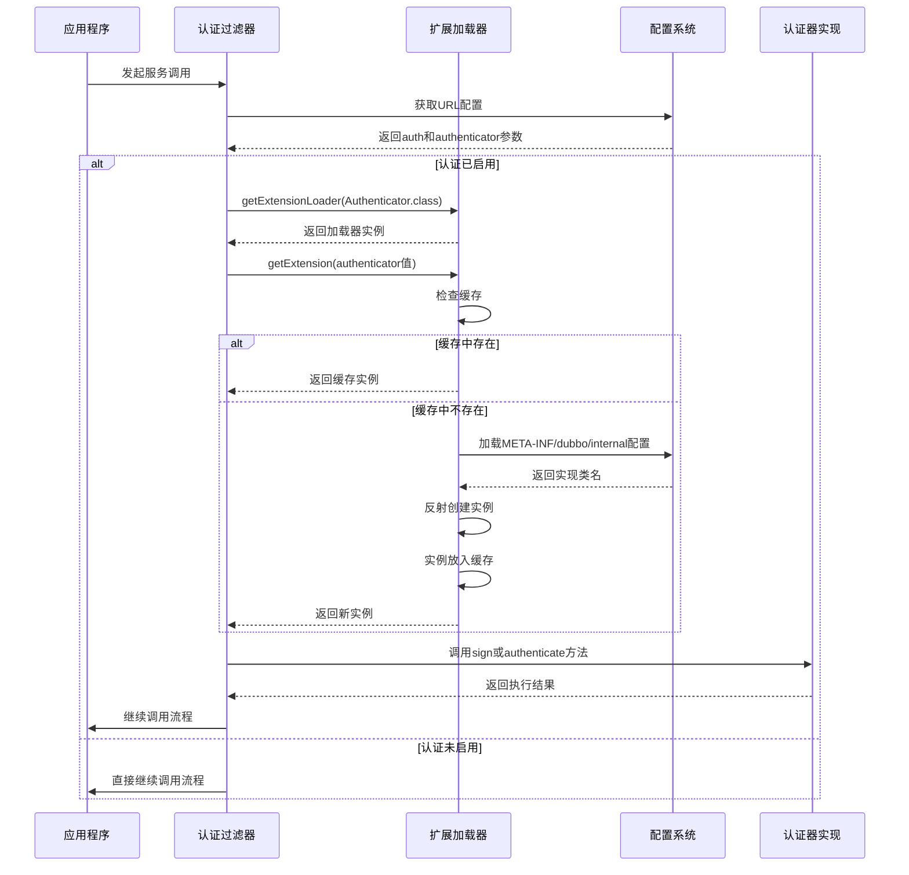
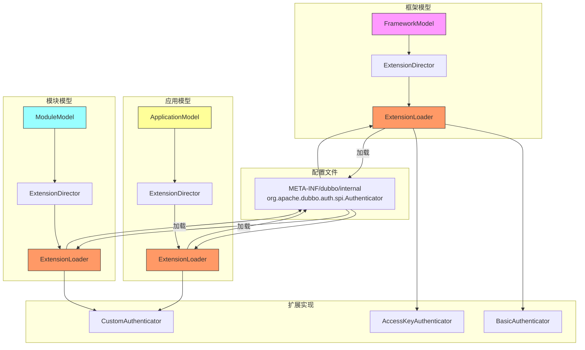

# SPI扩展机制

<cite>
**本文档引用的文件**
- [Authenticator.java](file://dubbo-plugin\dubbo-auth\src\main\java\org\apache\dubbo\auth\spi\Authenticator.java)
- [AccessKeyStorage.java](file://dubbo-plugin\dubbo-auth\src\main\java\org\apache\dubbo\auth\spi\AccessKeyStorage.java)
- [BasicAuthenticator.java](file://dubbo-plugin\dubbo-auth\src\main\java\org\apache\dubbo\auth\BasicAuthenticator.java)
- [AccessKeyAuthenticator.java](file://dubbo-plugin\dubbo-auth\src\main\java\org\apache\dubbo\auth\AccessKeyAuthenticator.java)
- [ConsumerSignFilter.java](file://dubbo-plugin\dubbo-auth\src\main\java\org\apache\dubbo\auth\filter\ConsumerSignFilter.java)
- [ProviderAuthFilter.java](file://dubbo-plugin\dubbo-auth\src\main\java\org\apache\dubbo\auth\filter\ProviderAuthFilter.java)
- [Constants.java](file://dubbo-plugin\dubbo-auth\src\main\java\org\apache\dubbo\auth\Constants.java)
- [SPI.java](file://dubbo-common\src\main\java\org\apache\dubbo\common\extension\SPI.java)
- [ExtensionLoader.java](file://dubbo-common\src\main\java\org\apache\dubbo\common\extension\ExtensionLoader.java)
- [ExtensionDirector.java](file://dubbo-common\src\main\java\org\apache\dubbo\rpc\model\ExtensionDirector.java)
- [ScopeModelUtil.java](file://dubbo-common\src\main\java\org\apache\dubbo\rpc\model\ScopeModelUtil.java)
- [org.apache.dubbo.auth.spi.Authenticator](file://dubbo-plugin\dubbo-auth\src\main\resources\META-INF\dubbo\internal\org.apache.dubbo.auth.spi.Authenticator)
</cite>

## 目录
1. [引言](#引言)
2. [认证扩展点配置方式](#认证扩展点配置方式)
3. [加载流程和实例化机制](#加载流程和实例化机制)
4. [扩展点配置文件格式规范](#扩展点配置文件格式规范)
5. [SPI扩展优先级管理](#spi扩展优先级管理)
6. [动态加载和错误处理机制](#动态加载和错误处理机制)
7. [自定义认证器开发示例](#自定义认证器开发示例)
8. [SPI扩展加载时序图](#spi扩展加载时序图)
9. [扩展点管理架构图](#扩展点管理架构图)
10. [初学者SPI扩展入门指南](#初学者spi扩展入门指南)
11. [高级开发者多认证器组合方案](#高级开发者多认证器组合方案)
12. [结论](#结论)

## 引言

Dubbo框架提供了强大的SPI（Service Provider Interface）扩展机制，允许开发者在不修改框架源码的情况下，通过插件化的方式扩展框架功能。本文档深入探讨了Dubbo中认证机制的SPI扩展，重点分析了Authenticator扩展点的配置方式、加载流程和实例化机制。通过本指南，开发者可以全面了解如何利用SPI机制实现自定义认证功能，从基础的配置到高级的多认证器组合方案。

**本文档引用的文件**
- [Authenticator.java](file://dubbo-plugin\dubbo-auth\src\main\java\org\apache\dubbo\auth\spi\Authenticator.java)
- [SPI.java](file://dubbo-common\src\main\java\org\apache\dubbo\common\extension\SPI.java)

## 认证扩展点配置方式

Dubbo的认证扩展点通过`@SPI`注解进行声明，该注解定义了扩展点的默认实现和作用域。在认证机制中，`Authenticator`接口是核心的扩展点，它定义了认证器的基本行为。

`Authenticator`接口通过`@SPI`注解标记，指定了默认实现为"basic"，作用域为`FRAMEWORK`。这意味着当没有显式指定认证器时，系统将使用基本认证器（BasicAuthenticator）作为默认实现。这种设计使得框架具有良好的可扩展性，同时保证了默认行为的可靠性。

配置认证扩展点主要通过URL参数进行。在Dubbo中，服务提供者和消费者可以通过配置URL参数来启用或禁用认证功能，并指定具体的认证器实现。关键的配置参数包括：
- `auth`: 布尔值，用于启用或禁用认证功能
- `authenticator`: 字符串值，指定使用的认证器类型
- `username`和`password`: 用于基本认证的凭据信息

这些配置参数可以在服务定义、应用配置或运行时动态设置，为开发者提供了灵活的配置选项。

**本文档引用的文件**
- [Authenticator.java](file://dubbo-plugin\dubbo-auth\src\main\java\org\apache\dubbo\auth\spi\Authenticator.java)
- [Constants.java](file://dubbo-plugin\dubbo-auth\src\main\java\org\apache\dubbo\auth\Constants.java)

## 加载流程和实例化机制

Dubbo的SPI扩展加载流程是一个精心设计的机制，确保了扩展的高效加载和实例化。整个流程始于`ExtensionLoader`类，它是SPI机制的核心组件，负责管理所有扩展点的加载和实例化。

当需要获取一个扩展实例时，系统首先通过`getExtensionLoader`方法获取对应的`ExtensionLoader`实例。这个过程涉及到作用域的确定：如果扩展点被标记为`FRAMEWORK`作用域，则使用框架级别的`ExtensionLoader`；如果是`APPLICATION`或`MODULE`作用域，则分别使用应用级别或模块级别的加载器。

实例化机制采用懒加载策略，只有在首次请求扩展实例时才会进行实际的类加载和实例创建。`ExtensionLoader`维护了一个缓存映射（cachedInstances），用于存储已创建的扩展实例，避免重复创建带来的性能开销。当调用`getExtension`方法时，系统会先检查缓存中是否存在对应实例，如果不存在则通过反射创建新实例并放入缓存。

对于认证扩展点，加载流程在过滤器中被触发。消费者端的`ConsumerSignFilter`和提供者端的`ProviderAuthFilter`都会在请求处理过程中检查认证配置，并根据配置动态加载相应的认证器实现。这种设计实现了认证功能的按需加载，提高了系统的整体性能。

**本文档引用的文件**
- [ExtensionLoader.java](file://dubbo-common\src\main\java\org\apache\dubbo\common\extension\ExtensionLoader.java)
- [ConsumerSignFilter.java](file://dubbo-plugin\dubbo-auth\src\main\java\org\apache\dubbo\auth\filter\ConsumerSignFilter.java)
- [ProviderAuthFilter.java](file://dubbo-plugin\dubbo-auth\src\main\java\org\apache\dubbo\auth\filter\ProviderAuthFilter.java)

## 扩展点配置文件格式规范

Dubbo的SPI扩展配置文件遵循严格的格式规范，这些文件通常位于`META-INF/dubbo`或`META-INF/dubbo/internal`目录下。对于认证扩展点，配置文件的命名规则为扩展接口的全限定名，如`org.apache.dubbo.auth.spi.Authenticator`。

配置文件采用键值对的形式，每行定义一个扩展实现。键（key）表示扩展的名称，值（value）表示实现类的全限定名。这种键值对格式相比传统的纯类名列表具有明显优势：即使某个实现类由于依赖缺失而无法加载，系统仍然能够识别其扩展名称，便于错误诊断和日志记录。

对于内部扩展，Dubbo使用`META-INF/dubbo/internal`目录来存放框架核心功能的扩展配置。这些内部扩展通常具有更高的优先级，在框架启动时被优先加载。认证相关的扩展配置就位于这个内部目录中，确保了认证功能的可靠性和稳定性。

配置文件的编码必须为UTF-8，且每行的格式必须严格遵守`key=value`的规范。系统在加载配置文件时会进行严格的格式验证，任何格式错误都会导致加载失败并抛出异常。这种严格的格式要求保证了配置的可靠性和可维护性。

**本文档引用的文件**
- [org.apache.dubbo.auth.spi.Authenticator](file://dubbo-plugin\dubbo-auth\src\main\resources\META-INF\dubbo\internal\org.apache.dubbo.auth.spi.Authenticator)

## SPI扩展优先级管理

Dubbo的SPI扩展系统通过`LoadingStrategy`接口实现了灵活的优先级管理机制。不同的加载策略具有不同的优先级，系统按照优先级从高到低的顺序依次加载扩展配置。这种设计允许框架核心功能覆盖用户自定义扩展，同时保持了良好的扩展性。

在认证扩展中，`DubboInternalLoadingStrategy`具有最高优先级（MAX_PRIORITY），负责加载`META-INF/dubbo/internal`目录下的内部扩展。这意味着框架内置的认证器实现（如BasicAuthenticator和AccessKeyAuthenticator）会优先于用户自定义的扩展被加载和注册。

优先级管理不仅体现在加载顺序上，还体现在扩展实例的获取过程中。当存在多个同名扩展时，高优先级的加载策略所注册的实现会覆盖低优先级的实现。这种覆盖机制确保了框架核心功能的稳定性，防止用户配置意外破坏关键的安全认证功能。

开发者可以通过实现自定义的`LoadingStrategy`来调整扩展的加载优先级，但需要谨慎使用这一功能，避免影响框架的正常运行。对于大多数应用场景，使用默认的优先级管理机制已经足够满足需求。

**本文档引用的文件**
- [DubboInternalLoadingStrategy.java](file://dubbo-common\src\main\java\org\apache\dubbo\common\extension\DubboInternalLoadingStrategy.java)

## 动态加载和错误处理机制

Dubbo的SPI扩展机制支持动态加载，允许在运行时根据配置变化动态加载或切换不同的扩展实现。这种动态性是通过`ExtensionLoader`的懒加载特性和缓存机制实现的。每次获取扩展实例时，系统都会检查当前配置，确保使用的是最新的实现。

在认证扩展中，动态加载机制尤为重要。系统可以根据服务调用的具体上下文，动态选择合适的认证器。例如，对于内部服务调用可以使用基本认证，而对于外部API调用则可以使用更安全的访问密钥认证。这种灵活性使得系统能够适应复杂多变的安全需求。

错误处理机制是SPI扩展的重要组成部分。当扩展加载失败时，系统会捕获并处理相关异常，避免因单个扩展的问题影响整个系统的运行。对于认证扩展，如果指定的认证器无法加载，系统会抛出`IllegalArgumentException`异常，提示"未找到扩展"。

在运行时认证过程中，如果认证失败，系统会抛出`RpcAuthenticationException`异常。这个异常会被`ProviderAuthFilter`捕获并转换为RPC调用结果，确保调用方能够收到明确的认证失败信息。这种分层的错误处理机制既保证了系统的健壮性，又提供了清晰的错误反馈。

**本文档引用的文件**
- [ExtensionLoader.java](file://dubbo-common\src\main\java\org\apache\dubbo\common\extension\ExtensionLoader.java)
- [ProviderAuthFilter.java](file://dubbo-plugin\dubbo-auth\src\main\java\org\apache\dubbo\auth\filter\ProviderAuthFilter.java)
- [RpcAuthenticationException.java](file://dubbo-plugin\dubbo-auth\src\main\java\org\apache\dubbo\auth\exception\RpcAuthenticationException.java)

## 自定义认证器开发示例

开发自定义认证器需要遵循Dubbo的SPI扩展规范。首先，需要定义一个实现`Authenticator`接口的类，并确保该类具有无参构造函数或框架模型构造函数，以便于通过反射实例化。

以下是一个简单的自定义认证器开发示例：

```java
public class CustomAuthenticator implements Authenticator {
    private final FrameworkModel frameworkModel;

    public CustomAuthenticator(FrameworkModel frameworkModel) {
        this.frameworkModel = frameworkModel;
    }

    @Override
    public void sign(Invocation invocation, URL url) {
        // 实现请求签名逻辑
        String customToken = generateCustomToken(url);
        invocation.setAttachment("custom-token", customToken);
    }

    @Override
    public void authenticate(Invocation invocation, URL url) throws RpcAuthenticationException {
        // 实现认证验证逻辑
        String token = invocation.getAttachment("custom-token");
        if (!validateToken(token)) {
            throw new RpcAuthenticationException("Custom authentication failed");
        }
    }
}
```

完成实现后，需要在`META-INF/dubbo/internal/org.apache.dubbo.auth.spi.Authenticator`文件中添加配置：
```
custom=com.example.CustomAuthenticator
```

最后，在服务配置中启用自定义认证：
```java
url.addParameter(Constants.AUTH_KEY, "true")
    .addParameter(Constants.AUTHENTICATOR_KEY, "custom");
```

这个示例展示了开发自定义认证器的基本步骤，开发者可以根据具体需求实现更复杂的认证逻辑。

**本文档引用的文件**
- [Authenticator.java](file://dubbo-plugin\dubbo-auth\src\main\java\org\apache\dubbo\auth\spi\Authenticator.java)
- [Constants.java](file://dubbo-plugin\dubbo-auth\src\main\java\org\apache\dubbo\auth\Constants.java)

## SPI扩展加载时序图



**时序图来源**
- [ConsumerSignFilter.java](file://dubbo-plugin\dubbo-auth\src\main\java\org\apache\dubbo\auth\filter\ConsumerSignFilter.java)
- [ProviderAuthFilter.java](file://dubbo-plugin\dubbo-auth\src\main\java\org\apache\dubbo\auth\filter\ProviderAuthFilter.java)
- [ExtensionLoader.java](file://dubbo-common\src\main\java\org\apache\dubbo\common\extension\ExtensionLoader.java)

## 扩展点管理架构图



**架构图来源**
- [ExtensionDirector.java](file://dubbo-common\src\main\java\org\apache\dubbo\rpc\model\ExtensionDirector.java)
- [ScopeModelUtil.java](file://dubbo-common\src\main\java\org\apache\dubbo\rpc\model\ScopeModelUtil.java)
- [org.apache.dubbo.auth.spi.Authenticator](file://dubbo-plugin\dubbo-auth\src\main\resources\META-INF\dubbo\internal\org.apache.dubbo.auth.spi.Authenticator)

## 初学者SPI扩展入门指南

对于初学者来说，理解Dubbo的SPI扩展机制可以从以下几个简单步骤开始：

1. **理解基本概念**：首先需要理解SPI（Service Provider Interface）的基本概念，它是一种服务发现机制，允许在运行时动态加载接口的实现。

2. **创建简单扩展**：从实现一个简单的`Authenticator`开始，可以创建一个继承`BasicAuthenticator`的类，重写`sign`和`authenticate`方法，添加一些简单的日志输出。

3. **配置扩展**：在`META-INF/dubbo/internal/org.apache.dubbo.auth.spi.Authenticator`文件中添加你的扩展配置，格式为`myauth=com.example.MyAuthenticator`。

4. **启用扩展**：在服务配置中添加`auth=true`和`authenticator=myauth`参数来启用你的自定义认证器。

5. **测试验证**：通过简单的服务调用测试，观察日志输出，验证你的认证器是否被正确加载和执行。

6. **调试优化**：如果遇到问题，可以通过调试`ExtensionLoader`的加载过程，检查配置文件路径和格式是否正确。

这个入门流程帮助初学者逐步理解SPI扩展的工作原理，从简单的实现开始，逐步深入到更复杂的扩展开发。

**本文档引用的文件**
- [Authenticator.java](file://dubbo-plugin\dubbo-auth\src\main\java\org\apache\dubbo\auth\spi\Authenticator.java)
- [BasicAuthenticator.java](file://dubbo-plugin\dubbo-auth\src\main\java\org\apache\dubbo\auth\BasicAuthenticator.java)

## 高级开发者多认证器组合方案

对于高级开发者，可以设计更复杂的多认证器组合方案来满足企业级安全需求。以下是一个高级的多认证器组合方案：

```java
public class CompositeAuthenticator implements Authenticator {
    private final List<Authenticator> authenticators;
    private final FrameworkModel frameworkModel;

    public CompositeAuthenticator(FrameworkModel frameworkModel) {
        this.frameworkModel = frameworkModel;
        this.authenticators = loadAuthenticators();
    }

    private List<Authenticator> loadAuthenticators() {
        List<Authenticator> list = new ArrayList<>();
        // 从配置中获取启用的认证器列表
        String[] authTypes = getConfiguredAuthTypes();
        for (String type : authTypes) {
            Authenticator auth = frameworkModel
                .getExtensionLoader(Authenticator.class)
                .getExtension(type);
            list.add(auth);
        }
        return list;
    }

    @Override
    public void sign(Invocation invocation, URL url) {
        // 为每个认证器生成签名
        for (Authenticator auth : authenticators) {
            auth.sign(invocation, url);
        }
    }

    @Override
    public void authenticate(Invocation invocation, URL url) throws RpcAuthenticationException {
        // 逐个验证认证信息，支持多种认证方式
        boolean authenticated = false;
        List<Exception> exceptions = new ArrayList<>();
        
        for (Authenticator auth : authenticators) {
            try {
                auth.authenticate(invocation, url);
                authenticated = true;
                break; // 任一认证成功即通过
            } catch (RpcAuthenticationException e) {
                exceptions.add(e);
            }
        }
        
        if (!authenticated) {
            throw new RpcAuthenticationException("All authentication methods failed: " + 
                exceptions.stream().map(Exception::getMessage).collect(Collectors.joining("; ")));
        }
    }
}
```

这个组合认证器方案支持：
- **多认证方式并行**：可以同时启用多种认证方式，如基本认证、访问密钥认证和自定义认证
- **灵活的认证策略**：支持"任一成功"或"全部成功"等多种认证策略
- **动态配置**：认证器列表可以从配置中心动态获取，支持运行时调整
- **错误聚合**：当所有认证都失败时，聚合所有错误信息，便于问题诊断

这种高级方案适用于需要多层次安全防护的复杂系统，提供了更高的安全性和灵活性。

**本文档引用的文件**
- [Authenticator.java](file://dubbo-plugin\dubbo-auth\src\main\java\org\apache\dubbo\auth\spi\Authenticator.java)
- [ExtensionLoader.java](file://dubbo-common\src\main\java\org\apache\dubbo\common\extension\ExtensionLoader.java)

## 结论

Dubbo的SPI扩展机制为认证功能提供了强大而灵活的扩展能力。通过`Authenticator`扩展点，开发者可以轻松实现自定义的认证逻辑，满足各种安全需求。本文档详细介绍了认证扩展点的配置方式、加载流程、实例化机制以及相关的配置文件格式规范。

SPI扩展的优先级管理机制确保了框架核心功能的稳定性，同时允许用户进行灵活的扩展。动态加载和错误处理机制保证了系统的健壮性，即使在扩展加载失败的情况下也能正常运行。

对于初学者，可以通过简单的步骤快速上手SPI扩展开发；而对于高级开发者，则可以利用多认证器组合方案构建复杂的安全体系。无论是简单的基本认证还是复杂的多因素认证，Dubbo的SPI机制都能提供良好的支持。

总之，理解并掌握Dubbo的SPI扩展机制，特别是认证相关的扩展，对于构建安全可靠的分布式系统至关重要。通过合理利用这一机制，开发者可以为应用添加强大的安全防护能力，同时保持系统的灵活性和可维护性。