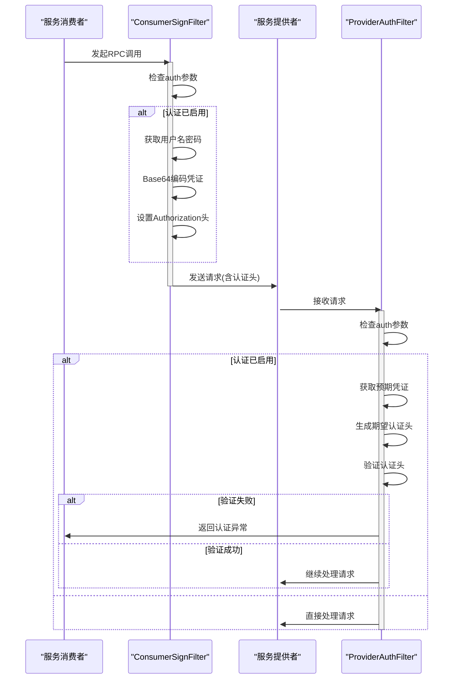
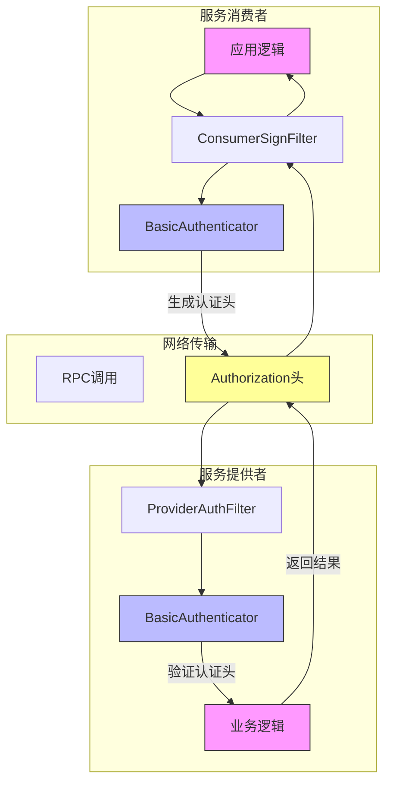

# 基础认证实现

<cite>
**本文档引用文件**  
- [BasicAuthenticator.java](file://dubbo-plugin\dubbo-auth\src\main\java\org\apache\dubbo\auth\BasicAuthenticator.java)
- [Constants.java](file://dubbo-plugin\dubbo-auth\src\main\java\org\apache\dubbo\auth\Constants.java)
- [ConsumerSignFilter.java](file://dubbo-plugin\dubbo-auth\src\main\java\org\apache\dubbo\auth\filter\ConsumerSignFilter.java)
- [ProviderAuthFilter.java](file://dubbo-plugin\dubbo-auth\src\main\java\org\apache\dubbo\auth\filter\ProviderAuthFilter.java)
- [ProviderAuthHeaderFilter.java](file://dubbo-plugin\dubbo-auth\src\main\java\org\apache\dubbo\auth\filter\ProviderAuthHeaderFilter.java)
- [Authenticator.java](file://dubbo-plugin\dubbo-auth\src\main\java\org\apache\dubbo\auth\spi\Authenticator.java)
- [RpcAuthenticationException.java](file://dubbo-plugin\dubbo-auth\src\main\java\org\apache\dubbo\auth\exception\RpcAuthenticationException.java)
</cite>

## 目录
1. [简介](#简介)
2. [基础认证实现原理](#基础认证实现原理)
3. [安全机制分析](#安全机制分析)
4. [配置参数详解](#配置参数详解)
5. [使用场景与性能特征](#使用场景与性能特征)
6. [配置示例与代码实现](#配置示例与代码实现)
7. [基础认证流程时序图](#基础认证流程时序图)
8. [安全架构图](#安全架构图)
9. [初学者配置指南](#初学者配置指南)
10. [高级扩展方法](#高级扩展方法)

## 简介
本文档深入分析Dubbo框架中BasicAuthenticator类的详细实现，全面解释基础认证的实现原理和安全机制。文档详细描述了用户名密码验证流程、凭证解析方式和安全传输策略，为开发者提供完整的配置示例和使用指南。

**Section sources**
- [BasicAuthenticator.java](file://dubbo-plugin\dubbo-auth\src\main\java\org\apache\dubbo\auth\BasicAuthenticator.java#L1-L55)

## 基础认证实现原理

BasicAuthenticator类实现了Dubbo框架中的基础认证功能，通过HTTP Basic Authentication机制实现服务调用的安全验证。该实现基于Authenticator接口，提供了sign和authenticate两个核心方法。

在服务消费者端，sign方法负责生成认证信息。该方法从URL配置中获取用户名和密码参数，将它们组合成"username:password"格式的字符串，然后使用Base64编码，并在前面添加"Basic "前缀，最后将生成的认证头信息作为附件添加到RPC调用上下文中。

在服务提供者端，authenticate方法负责验证认证信息。该方法同样从URL配置中获取预期的用户名和密码，生成期望的认证头信息，然后与调用上下文中的实际认证头信息进行比较。如果两者不匹配，则抛出RpcAuthenticationException异常，拒绝该调用请求。

**Section sources**
- [BasicAuthenticator.java](file://dubbo-plugin\dubbo-auth\src\main\java\org\apache\dubbo\auth\BasicAuthenticator.java#L28-L54)
- [Authenticator.java](file://dubbo-plugin\dubbo-auth\src\main\java\org\apache\dubbo\auth\spi\Authenticator.java#L25-L43)

## 安全机制分析

基础认证的安全机制主要体现在以下几个方面：

1. **凭证传输安全**：虽然Basic Authentication本身不加密凭证，但通过与TLS/SSL结合使用，可以确保凭证在传输过程中的安全性。认证信息通过Base64编码后在HTTP头部传输，防止明文暴露。

2. **双向验证机制**：系统实现了消费者签名和提供者验证的完整流程。消费者在调用前添加认证头，提供者在处理请求前验证认证头的有效性。

3. **异常处理机制**：当认证失败时，系统会抛出RpcAuthenticationException异常，该异常继承自Exception类，提供了详细的错误信息，便于问题排查。

4. **配置驱动安全**：通过URL参数控制认证开关，实现了灵活的安全策略配置。只有在明确启用认证的情况下才会执行认证流程。

**Section sources**
- [BasicAuthenticator.java](file://dubbo-plugin\dubbo-auth\src\main\java\org\apache\dubbo\auth\BasicAuthenticator.java#L42-L53)
- [RpcAuthenticationException.java](file://dubbo-plugin\dubbo-auth\src\main\java\org\apache\dubbo\auth\exception\RpcAuthenticationException.java#L1-L30)

## 配置参数详解

基础认证涉及多个关键配置参数，这些参数定义在Constants接口中：

- **auth**：认证开关参数，布尔类型，用于启用或禁用认证功能
- **authenticator**：认证器类型参数，指定使用的认证实现，默认值为"basic"
- **username**：用户名参数，用于指定认证的用户名
- **password**：密码参数，用于指定认证的密码
- **authorization**：认证头名称参数，支持大小写两种形式

这些参数通过URL配置传递，可以在服务提供者和消费者端分别设置。认证开关参数允许在运行时动态控制认证行为，而用户名和密码参数则定义了具体的认证凭证。

**Section sources**
- [Constants.java](file://dubbo-plugin\dubbo-auth\src\main\java\org\apache\dubbo\auth\Constants.java#L19-L55)

## 使用场景与性能特征

基础认证适用于以下使用场景：

1. **内部服务间认证**：在受信任的内部网络环境中，用于验证服务调用方的身份
2. **简单安全需求**：对于安全性要求不高的场景，提供基本的访问控制
3. **快速原型开发**：在开发和测试阶段，快速实现认证功能

性能特征方面，基础认证具有以下特点：

- **低开销**：Base64编码和字符串比较操作的计算开销很小
- **低延迟**：认证过程不涉及网络IO或复杂计算，对调用延迟影响极小
- **高吞吐**：由于算法简单，可以支持高并发的认证请求
- **内存友好**：认证过程不创建大量临时对象，内存占用稳定

**Section sources**
- [BasicAuthenticator.java](file://dubbo-plugin\dubbo-auth\src\main\java\org\apache\dubbo\auth\BasicAuthenticator.java#L28-L54)

## 配置示例与代码实现

### 服务提供者端配置
```java
// 在服务提供者端启用基础认证
ServiceConfig<DemoService> service = new ServiceConfig<>();
service.setInterface(DemoService.class);
service.setRef(new DemoServiceImpl());
// 启用认证并设置用户名密码
service.setParameters(Collections.singletonMap("auth", "true"));
service.setParameters(Collections.singletonMap("username", "admin"));
service.setParameters(Collections.singletonMap("password", "password123"));
```

### 服务消费者端配置
```java
// 在服务消费者端配置认证信息
ReferenceConfig<DemoService> reference = new ReferenceConfig<>();
reference.setInterface(DemoService.class);
// 启用认证并设置与提供者匹配的用户名密码
reference.setParameters(Collections.singletonMap("auth", "true"));
reference.setParameters(Collections.singletonMap("username", "admin"));
reference.setParameters(Collections.singletonMap("password", "password123"));
```

### Spring配置方式
```xml
<!-- 服务提供者配置 -->
<dubbo:service interface="com.example.DemoService" ref="demoService">
    <dubbo:parameter key="auth" value="true"/>
    <dubbo:parameter key="username" value="admin"/>
    <dubbo:parameter key="password" value="password123"/>
</dubbo:service>

<!-- 服务消费者配置 -->
<dubbo:reference interface="com.example.DemoService">
    <dubbo:parameter key="auth" value="true"/>
    <dubbo:parameter key="username" value="admin"/>
    <dubbo:parameter key="password" value="password123"/>
</dubbo:reference>
```

**Section sources**
- [ConsumerSignFilter.java](file://dubbo-plugin\dubbo-auth\src\main\java\org\apache\dubbo\auth\filter\ConsumerSignFilter.java#L36-L56)
- [ProviderAuthFilter.java](file://dubbo-plugin\dubbo-auth\src\main\java\org\apache\dubbo\auth\filter\ProviderAuthFilter.java#L32-L60)

## 基础认证流程时序图



**Diagram sources**
- [ConsumerSignFilter.java](file://dubbo-plugin\dubbo-auth\src\main\java\org\apache\dubbo\auth\filter\ConsumerSignFilter.java#L44-L54)
- [ProviderAuthFilter.java](file://dubbo-plugin\dubbo-auth\src\main\java\org\apache\dubbo\auth\filter\ProviderAuthFilter.java#L40-L57)

## 安全架构图



**Diagram sources**
- [ConsumerSignFilter.java](file://dubbo-plugin\dubbo-auth\src\main\java\org\apache\dubbo\auth\filter\ConsumerSignFilter.java#L37-L56)
- [ProviderAuthFilter.java](file://dubbo-plugin\dubbo-auth\src\main\java\org\apache\dubbo\auth\filter\ProviderAuthFilter.java#L33-L59)
- [BasicAuthenticator.java](file://dubbo-plugin\dubbo-auth\src\main\java\org\apache\dubbo\auth\BasicAuthenticator.java#L28-L54)

## 初学者配置指南

对于初学者，配置基础认证的步骤如下：

1. **启用认证功能**：在服务提供者和消费者端的配置中添加`auth=true`参数
2. **设置用户名**：通过`username`参数设置认证用户名
3. **设置密码**：通过`password`参数设置认证密码
4. **确保配置匹配**：服务提供者和消费者端的用户名密码必须完全一致
5. **测试连接**：进行简单的调用测试，验证认证功能是否正常工作

建议初学者先在测试环境中验证配置，确保理解认证流程后再部署到生产环境。同时，建议结合TLS/SSL使用，以增强传输安全性。

**Section sources**
- [Constants.java](file://dubbo-plugin\dubbo-auth\src\main\java\org\apache\dubbo\auth\Constants.java#L21-L27)

## 高级扩展方法

对于高级开发者，可以通过以下方式扩展基础认证功能：

1. **自定义认证器**：实现Authenticator接口，创建自定义的认证逻辑，如JWT认证、OAuth2等
2. **集成外部认证系统**：将认证逻辑与LDAP、OAuth服务器等外部系统集成
3. **多因素认证**：在基础认证之上添加额外的认证因素，如IP白名单、时间窗口等
4. **动态凭证管理**：实现动态的用户名密码管理，支持凭证轮换和过期机制
5. **审计日志**：添加详细的认证日志记录，便于安全审计和问题排查

通过SPI机制，可以轻松注册自定义的认证器实现，系统会根据配置自动加载和使用相应的认证器。

**Section sources**
- [Authenticator.java](file://dubbo-plugin\dubbo-auth\src\main\java\org\apache\dubbo\auth\spi\Authenticator.java#L25-L43)
- [BasicAuthenticator.java](file://dubbo-plugin\dubbo-auth\src\main\java\org\apache\dubbo\auth\BasicAuthenticator.java#L28-L54)