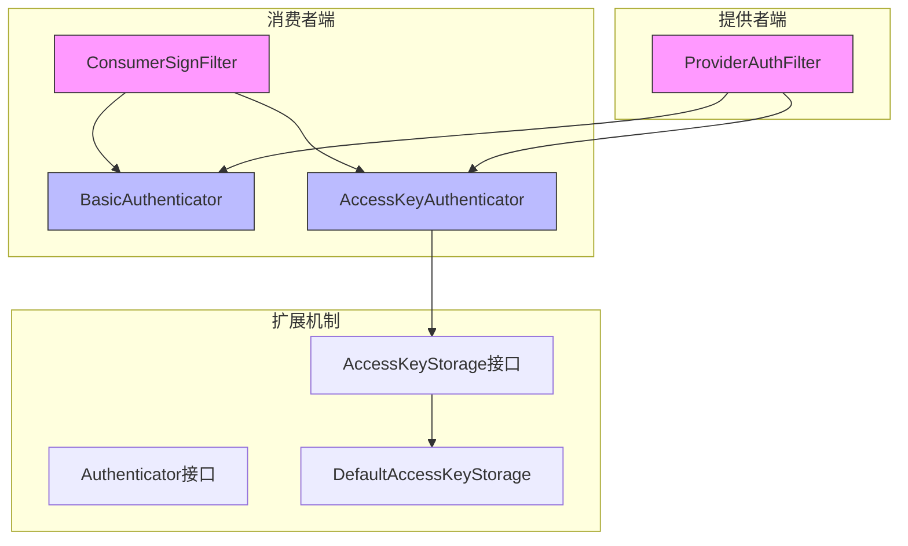
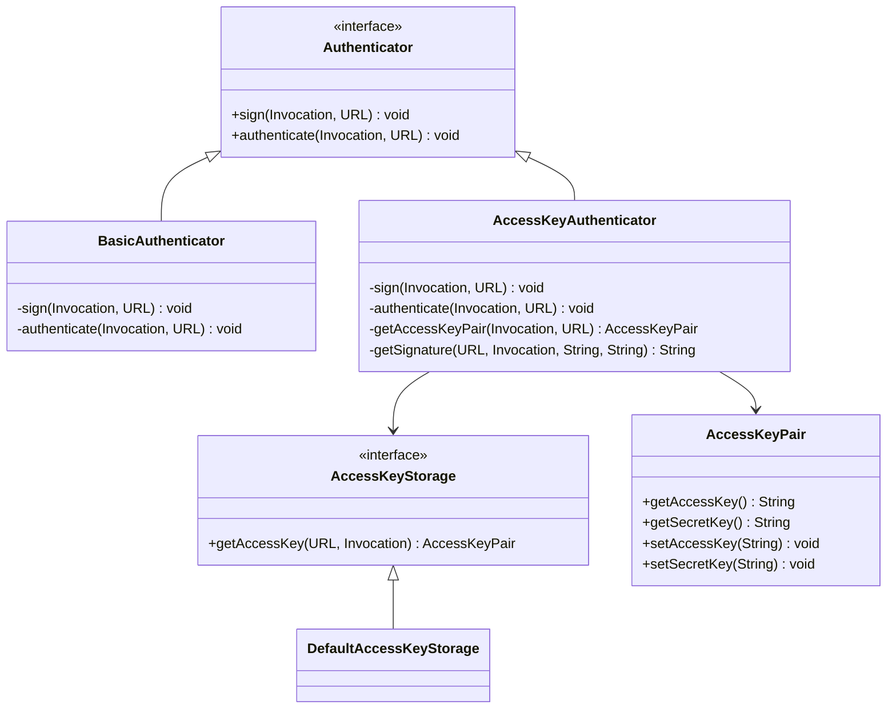
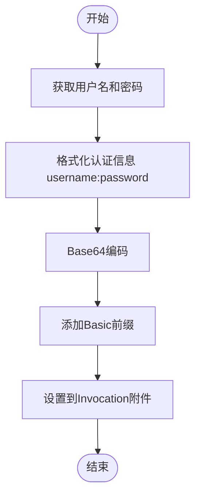
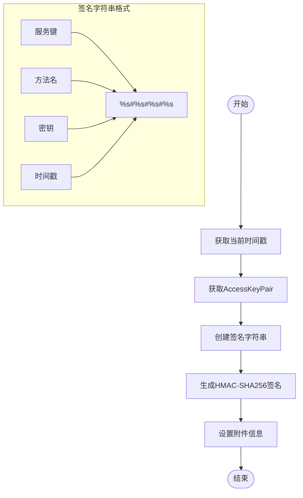
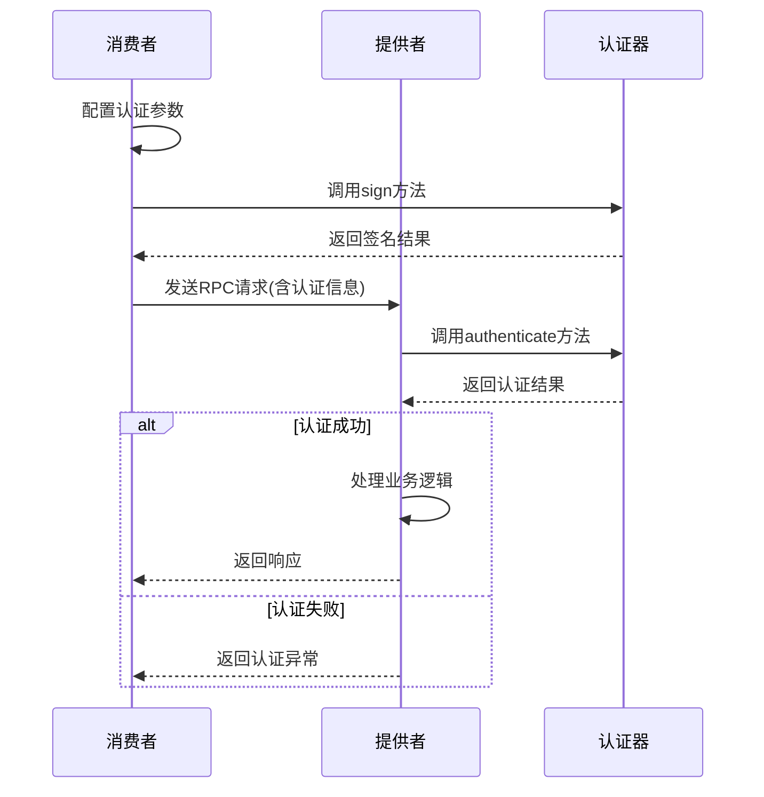
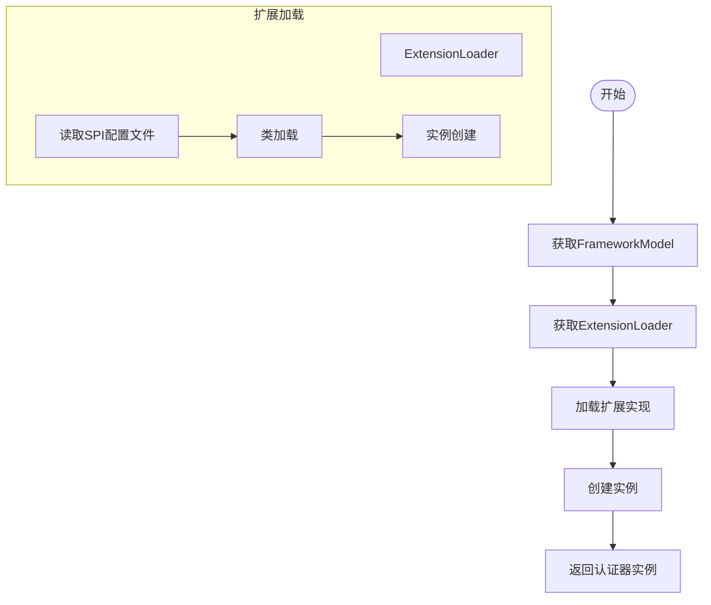
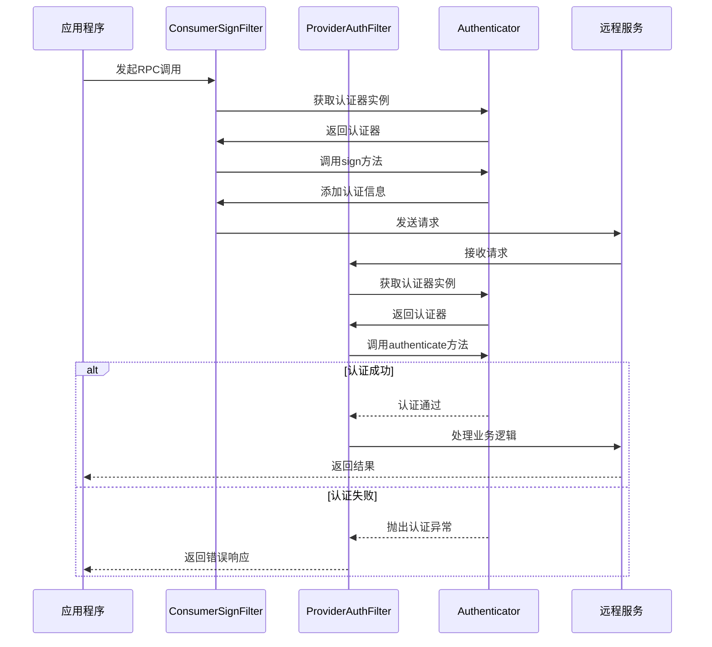
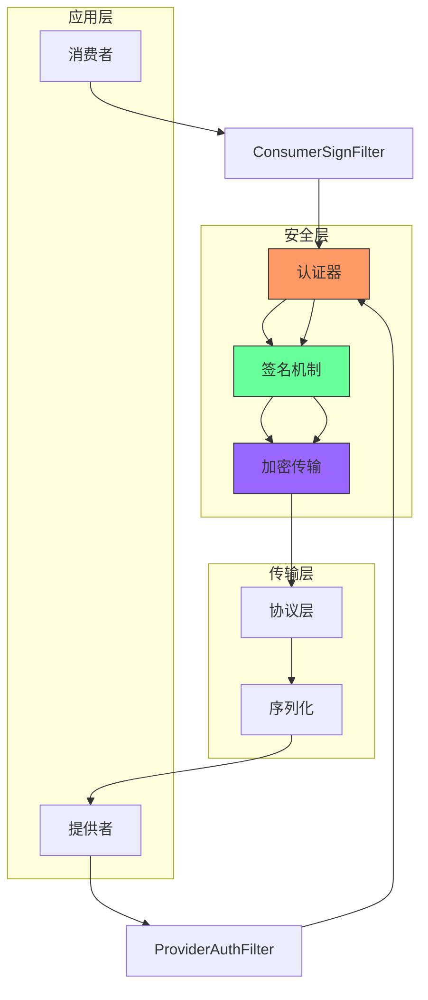

# 认证机制

<cite>
**本文档中引用的文件**  
- [Authenticator.java](file://dubbo-plugin/dubbo-auth/src/main/java/org/apache/dubbo/auth/spi/Authenticator.java)
- [BasicAuthenticator.java](file://dubbo-plugin/dubbo-auth/src/main/java/org/apache/dubbo/auth/BasicAuthenticator.java)
- [AccessKeyAuthenticator.java](file://dubbo-plugin/dubbo-auth/src/main/java/org/apache/dubbo/auth/AccessKeyAuthenticator.java)
- [ConsumerSignFilter.java](file://dubbo-plugin/dubbo-auth/src/main/java/org/apache/dubbo/auth/filter/ConsumerSignFilter.java)
- [ProviderAuthFilter.java](file://dubbo-plugin/dubbo-auth/src/main/java/org/apache/dubbo/auth/filter/ProviderAuthFilter.java)
- [Constants.java](file://dubbo-plugin/dubbo-auth/src/main/java/org/apache/dubbo/auth/Constants.java)
- [SignatureUtils.java](file://dubbo-plugin/dubbo-auth/src/main/java/org/apache/dubbo/auth/utils/SignatureUtils.java)
- [AccessKeyStorage.java](file://dubbo-plugin/dubbo-auth/src/main/java/org/apache/dubbo/auth/spi/AccessKeyStorage.java)
- [DefaultAccessKeyStorage.java](file://dubbo-plugin/dubbo-auth/src/main/java/org/apache/dubbo/auth/DefaultAccessKeyStorage.java)
- [AccessKeyPair.java](file://dubbo-plugin/dubbo-auth/src/main/java/org/apache/dubbo/auth/model/AccessKeyPair.java)
</cite>

## 目录
1. [引言](#引言)
2. [认证机制架构](#认证机制架构)
3. [Authenticator接口设计原理](#authenticator接口设计原理)
4. [基础认证实现](#基础认证实现)
5. [访问密钥认证实现](#访问密钥认证实现)
6. [认证信息传递与验证流程](#认证信息传递与验证流程)
7. [安全策略](#安全策略)
8. [SPI扩展机制](#spi扩展机制)
9. [认证流程时序图](#认证流程时序图)
10. [安全架构图](#安全架构图)
11. [自定义认证器开发示例](#自定义认证器开发示例)
12. [认证失败处理](#认证失败处理)

## 引言
Dubbo框架提供了灵活的认证机制，通过插件化设计实现了多种认证方式。本文档深入分析dubbo-plugin模块中的认证机制，详细解释Authenticator接口的设计原理和实现方式，描述基础认证（BasicAuthenticator）和访问密钥认证（AccessKeyAuthenticator）的具体实现和使用场景。

## 认证机制架构
Dubbo的认证机制采用过滤器模式，在RPC调用的消费者端和提供者端分别通过过滤器实现认证功能。整个认证体系由核心接口Authenticator、具体认证实现类、过滤器组件和SPI扩展机制组成。



**图示来源**
- [ConsumerSignFilter.java](file://dubbo-plugin/dubbo-auth/src/main/java/org/apache/dubbo/auth/filter/ConsumerSignFilter.java)
- [ProviderAuthFilter.java](file://dubbo-plugin/dubbo-auth/src/main/java/org/apache/dubbo/auth/filter/ProviderAuthFilter.java)
- [BasicAuthenticator.java](file://dubbo-plugin/dubbo-auth/src/main/java/org/apache/dubbo/auth/BasicAuthenticator.java)
- [AccessKeyAuthenticator.java](file://dubbo-plugin/dubbo-auth/src/main/java/org/apache/dubbo/auth/AccessKeyAuthenticator.java)
- [AccessKeyStorage.java](file://dubbo-plugin/dubbo-auth/src/main/java/org/apache/dubbo/auth/spi/AccessKeyStorage.java)
- [DefaultAccessKeyStorage.java](file://dubbo-plugin/dubbo-auth/src/main/java/org/apache/dubbo/auth/DefaultAccessKeyStorage.java)

## Authenticator接口设计原理
Authenticator接口是Dubbo认证机制的核心，定义了认证器的基本行为。该接口采用SPI（Service Provider Interface）机制，允许用户扩展自定义的认证方式。



**图示来源**
- [Authenticator.java](file://dubbo-plugin/dubbo-auth/src/main/java/org/apache/dubbo/auth/spi/Authenticator.java)
- [BasicAuthenticator.java](file://dubbo-plugin/dubbo-auth/src/main/java/org/apache/dubbo/auth/BasicAuthenticator.java)
- [AccessKeyAuthenticator.java](file://dubbo-plugin/dubbo-auth/src/main/java/org/apache/dubbo/auth/AccessKeyAuthenticator.java)
- [AccessKeyStorage.java](file://dubbo-plugin/dubbo-auth/src/main/java/org/apache/dubbo/auth/spi/AccessKeyStorage.java)
- [AccessKeyPair.java](file://dubbo-plugin/dubbo-auth/src/main/java/org/apache/dubbo/auth/model/AccessKeyPair.java)
- [DefaultAccessKeyStorage.java](file://dubbo-plugin/dubbo-auth/src/main/java/org/apache/dubbo/auth/DefaultAccessKeyStorage.java)

**接口设计特点：**
- **SPI注解**：通过@SPI注解标记，支持扩展机制，缺省实现为"basic"
- **双方法设计**：包含sign（签名）和authenticate（认证）两个核心方法
- **异常处理**：authenticate方法抛出RpcAuthenticationException异常，便于统一处理认证失败情况
- **参数设计**：使用Invocation和URL作为参数，便于获取调用上下文和配置信息

## 基础认证实现
基础认证（BasicAuthenticator）实现了HTTP Basic Authentication标准，通过Base64编码用户名和密码进行认证。

### 实现原理
基础认证将用户名和密码组合成"username:password"格式，然后使用Base64编码，最后在请求头中添加"Basic "前缀。

```java
// 认证信息格式：Basic base64(username:password)
String auth = username + ":" + password;
String encodedAuth = Base64.getEncoder().encodeToString(auth.getBytes(StandardCharsets.UTF_8));
String authHeaderValue = "Basic " + encodedAuth;
```

### 签名过程


**实现来源**
- [BasicAuthenticator.java](file://dubbo-plugin/dubbo-auth/src/main/java/org/apache/dubbo/auth/BasicAuthenticator.java)
- [Constants.java](file://dubbo-plugin/dubbo-auth/src/main/java/org/apache/dubbo/auth/Constants.java)

### 认证验证
提供者端验证过程：
1. 从URL获取配置的用户名和密码
2. 生成期望的认证头值
3. 从Invocation附件中获取实际的认证头值
4. 比较两者是否相等

当认证失败时，抛出RpcAuthenticationException异常，提示"Failed to authenticate, maybe consumer side did not enable the auth"。

## 访问密钥认证实现
访问密钥认证（AccessKeyAuthenticator）是一种更安全的认证方式，采用HMAC-SHA256签名算法，有效防止重放攻击。

### 实现原理
访问密钥认证使用AK/SK（Access Key/Secret Key）机制，通过时间戳和签名确保请求的完整性和时效性。

### 核心组件
- **AccessKeyPair**：存储访问密钥对，包含accessKey和secretKey
- **AccessKeyStorage**：访问密钥存储接口，支持从不同位置加载密钥对
- **SignatureUtils**：签名工具类，使用HMAC-SHA256算法生成签名

### 签名过程


**实现来源**
- [AccessKeyAuthenticator.java](file://dubbo-plugin/dubbo-auth/src/main/java/org/apache/dubbo/auth/AccessKeyAuthenticator.java)
- [SignatureUtils.java](file://dubbo-plugin/dubbo-auth/src/main/java/org/apache/dubbo/auth/utils/SignatureUtils.java)
- [AccessKeyPair.java](file://dubbo-plugin/dubbo-auth/src/main/java/org/apache/dubbo/auth/model/AccessKeyPair.java)

### 认证验证流程
1. 从Invocation附件中获取accessKeyId、时间戳、原始签名和消费者应用名
2. 验证这些关键信息是否为空
3. 通过AccessKeyStorage获取对应的AccessKeyPair
4. 使用相同的算法重新计算签名
5. 比较计算出的签名与原始签名是否一致

### 安全特性
- **防重放攻击**：通过时间戳验证，可以设置时间窗口，拒绝过期请求
- **数据完整性**：使用HMAC-SHA256确保请求内容未被篡改
- **密钥分离**：accessKey用于标识身份，secretKey用于签名，不直接传输

## 认证信息传递与验证流程
Dubbo认证机制通过RPC调用的附件（attachment）传递认证信息，在消费者端签名，在提供者端验证。

### 信息传递方式
认证信息通过Invocation的附件机制传递，使用以下键名：
- **authorization** 或 **Authorization**：基础认证的认证头
- **ak**：访问密钥认证的accessKeyId
- **timestamp**：请求时间戳
- **signature**：HMAC-SHA256签名值
- **consumer**：消费者应用名

### 验证流程


**流程来源**
- [ConsumerSignFilter.java](file://dubbo-plugin/dubbo-auth/src/main/java/org/apache/dubbo/auth/filter/ConsumerSignFilter.java)
- [ProviderAuthFilter.java](file://dubbo-plugin/dubbo-auth/src/main/java/org/apache/dubbo/auth/filter/ProviderAuthFilter.java)

### 过滤器执行顺序
1. **消费者端**：ConsumerSignFilter在调用前执行，负责添加认证信息
2. **提供者端**：ProviderAuthFilter在调用前执行，负责验证认证信息

过滤器通过@Activate注解配置，确保在正确的调用阶段执行。

## 安全策略
Dubbo认证机制采用了多层次的安全策略，确保系统的安全性。

### 加密算法
- **基础认证**：使用Base64编码（非加密，建议配合TLS使用）
- **访问密钥认证**：使用HMAC-SHA256签名算法，提供强安全性

### 密钥管理
- **密钥存储**：通过AccessKeyStorage SPI接口，支持多种密钥存储方式
- **缺省实现**：DefaultAccessKeyStorage从URL参数获取密钥
- **扩展能力**：可实现从文件系统、数据库或密钥管理服务获取密钥

### 防攻击机制
- **重放攻击防护**：通过时间戳验证，可配置时间窗口
- **暴力破解防护**：可通过外部机制（如限流）防止暴力破解
- **信息泄露防护**：敏感信息（如secretAccessKey）以"."开头，不会被输出

### 配置安全
通过Constants接口集中管理所有配置键名，避免硬编码，提高可维护性：
```java
String ACCESS_KEY_ID_KEY = ".accessKeyId";  // 以"."开头，不会被输出
String SECRET_ACCESS_KEY_KEY = ".secretAccessKey";  // 以"."开头，不会被输出
```

## SPI扩展机制
Dubbo认证机制采用SPI（Service Provider Interface）扩展机制，支持灵活的认证方式扩展。

### 扩展点配置
在`META-INF/dubbo/internal/`目录下配置扩展点：
```
# Authenticator扩展点
accesskey=org.apache.dubbo.auth.AccessKeyAuthenticator
basic=org.apache.dubbo.auth.BasicAuthenticator

# AccessKeyStorage扩展点  
urlstorage=org.apache.dubbo.auth.DefaultAccessKeyStorage
```

### 扩展加载过程


**扩展来源**
- [Authenticator.java](file://dubbo-plugin/dubbo-auth/src/main/java/org/apache/dubbo/auth/spi/Authenticator.java)
- [AccessKeyStorage.java](file://dubbo-plugin/dubbo-auth/src/main/java/org/apache/dubbo/auth/spi/AccessKeyStorage.java)
- [org.apache.dubbo.auth.spi.Authenticator](file://dubbo-plugin/dubbo-auth/src/main/resources/META-INF/dubbo/internal/org.apache.dubbo.auth.spi.Authenticator)
- [org.apache.dubbo.auth.spi.AccessKeyStorage](file://dubbo-plugin/dubbo-auth/src/main/resources/META-INF/dubbo/internal/org.apache.dubbo.auth.spi.AccessKeyStorage)

### 自定义扩展步骤
1. 实现Authenticator接口或AccessKeyStorage接口
2. 在`META-INF/dubbo/internal/`目录下创建对应的配置文件
3. 添加实现类的全限定名和别名
4. 在配置中通过别名引用自定义实现

## 认证流程时序图


**时序图来源**
- [ConsumerSignFilter.java](file://dubbo-plugin/dubbo-auth/src/main/java/org/apache/dubbo/auth/filter/ConsumerSignFilter.java)
- [ProviderAuthFilter.java](file://dubbo-plugin/dubbo-auth/src/main/java/org/apache/dubbo/auth/filter/ProviderAuthFilter.java)
- [Authenticator.java](file://dubbo-plugin/dubbo-auth/src/main/java/org/apache/dubbo/auth/spi/Authenticator.java)

## 安全架构图


**架构图来源**
- [ConsumerSignFilter.java](file://dubbo-plugin/dubbo-auth/src/main/java/org/apache/dubbo/auth/filter/ConsumerSignFilter.java)
- [ProviderAuthFilter.java](file://dubbo-plugin/dubbo-auth/src/main/java/org/apache/dubbo/auth/filter/ProviderAuthFilter.java)
- [Authenticator.java](file://dubbo-plugin/dubbo-auth/src/main/java/org/apache/dubbo/auth/spi/Authenticator.java)
- [SignatureUtils.java](file://dubbo-plugin/dubbo-auth/src/main/java/org/apache/dubbo/auth/utils/SignatureUtils.java)

## 自定义认证器开发示例
开发者可以基于Authenticator接口创建自定义认证器，实现特定的认证需求。

### 创建自定义认证器
```java
public class CustomAuthenticator implements Authenticator {
    @Override
    public void sign(Invocation invocation, URL url) {
        // 自定义签名逻辑
        String customToken = generateCustomToken(url);
        invocation.setAttachment("custom-token", customToken);
    }
    
    @Override
    public void authenticate(Invocation invocation, URL url) throws RpcAuthenticationException {
        // 自定义认证逻辑
        String token = invocation.getAttachment("custom-token");
        if (!validateToken(token)) {
            throw new RpcAuthenticationException("Custom authentication failed");
        }
    }
    
    private String generateCustomToken(URL url) {
        // 实现自定义token生成逻辑
        return "custom-token";
    }
    
    private boolean validateToken(String token) {
        // 实现自定义token验证逻辑
        return true;
    }
}
```

### 配置自定义认证器
在`META-INF/dubbo/internal/org.apache.dubbo.auth.spi.Authenticator`文件中添加：
```
custom=org.apache.dubbo.auth.CustomAuthenticator
```

在应用配置中启用自定义认证：
```java
// 启用认证
url.addParameter(Constants.AUTH_KEY, "true");
// 指定认证器类型
url.addParameter(Constants.AUTHENTICATOR_KEY, "custom");
```

## 认证失败处理
认证机制提供了完善的失败处理机制，确保系统稳定性和安全性。

### 失败场景
- **基础认证失败**：用户名或密码不匹配
- **访问密钥认证失败**：签名不正确、accessKeyId不存在、时间戳过期
- **配置错误**：未启用认证、认证器配置错误

### 异常处理
- **RpcAuthenticationException**：认证失败时抛出的标准异常
- **AccessKeyNotFoundException**：无法找到accessKey时抛出的异常
- **RuntimeException**：密钥加载失败时抛出的运行时异常

### 失败处理策略
1. **快速失败**：在调用初期验证认证信息，避免不必要的资源消耗
2. **详细日志**：记录认证失败的详细信息，便于问题排查
3. **安全响应**：返回通用的认证失败信息，避免泄露系统细节
4. **监控告警**：可集成监控系统，对频繁的认证失败进行告警