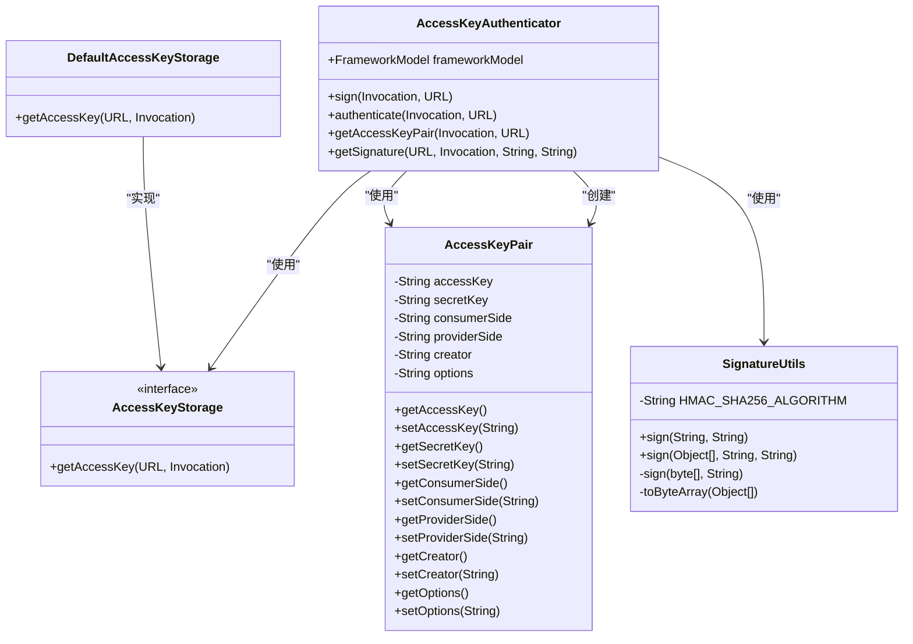
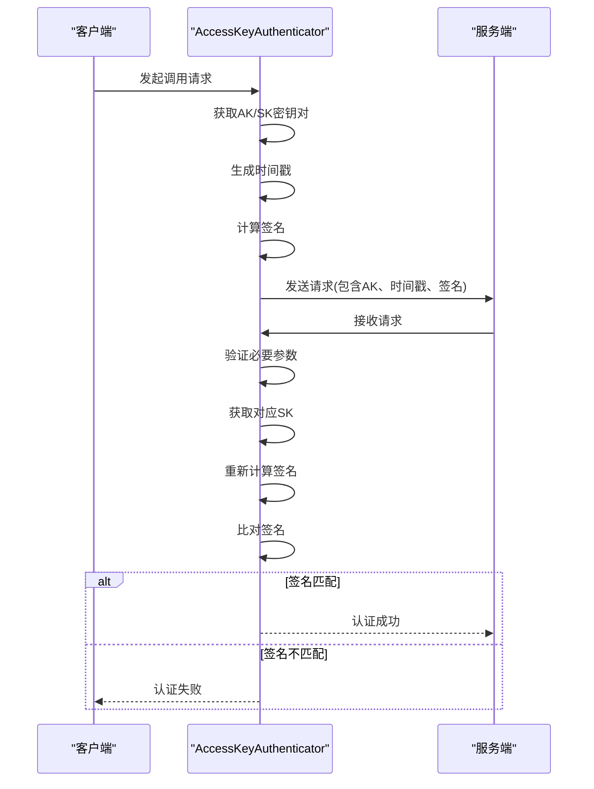
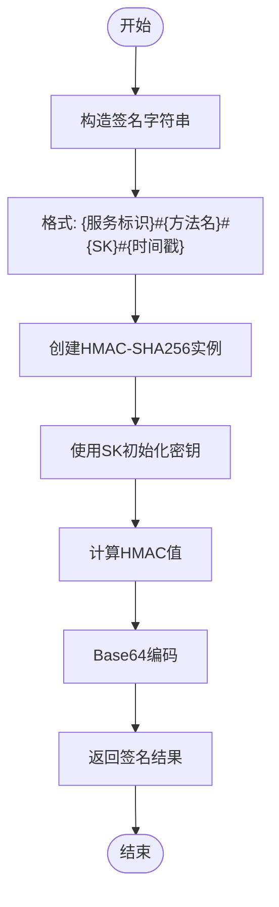
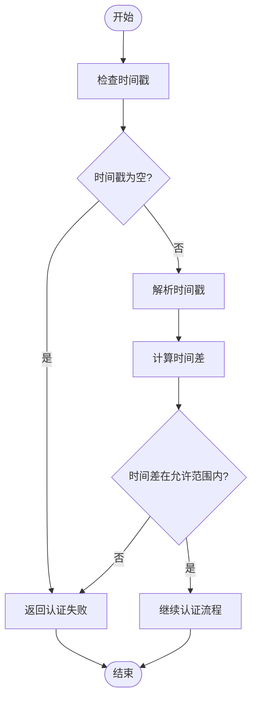
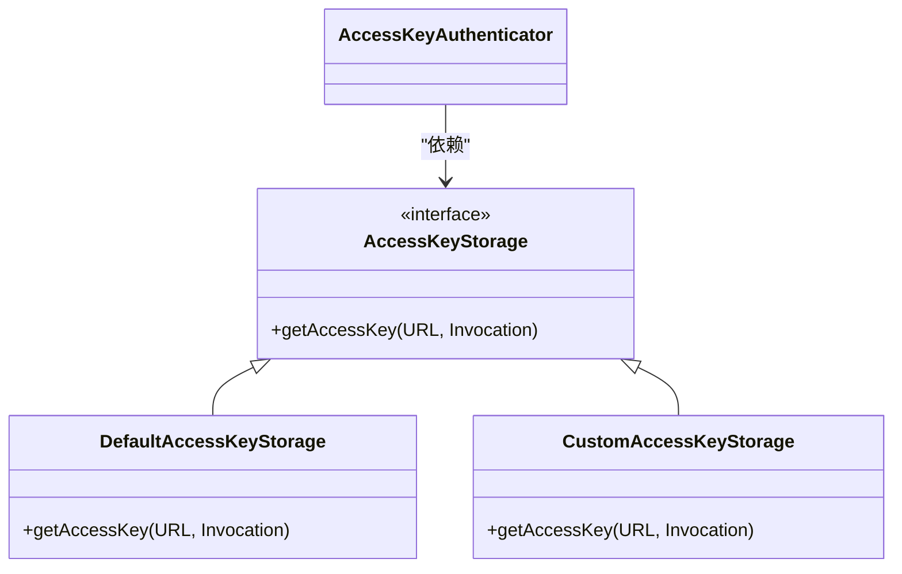
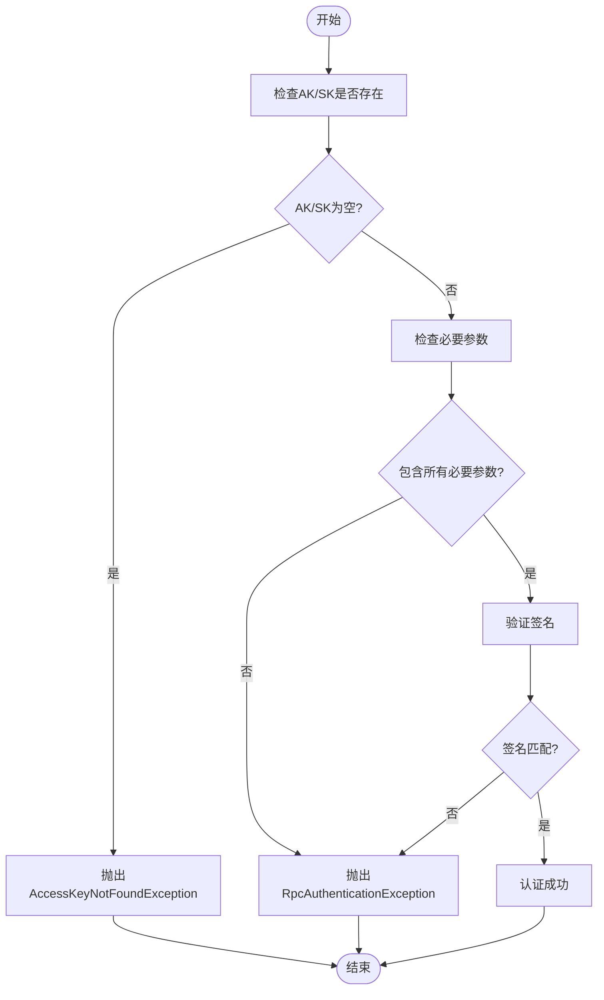
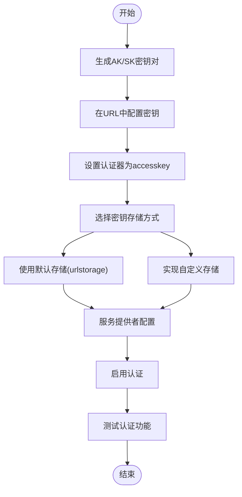
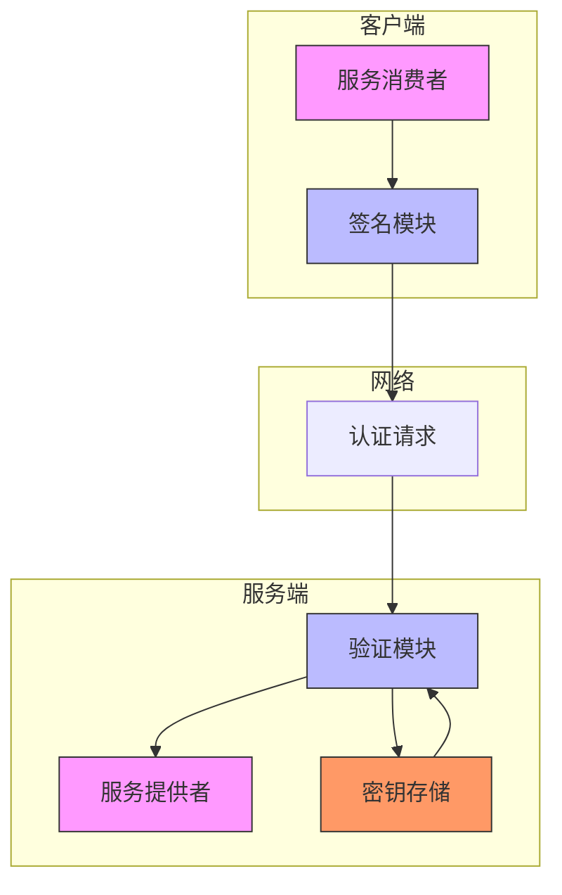

# 访问密钥认证实现

<cite>
**本文档引用的文件**
- [AccessKeyAuthenticator.java](file://dubbo-plugin\dubbo-auth\src\main\java\org\apache\dubbo\auth\AccessKeyAuthenticator.java)
- [Constants.java](file://dubbo-plugin\dubbo-auth\src\main\java\org\apache\dubbo\auth\Constants.java)
- [AccessKeyPair.java](file://dubbo-plugin\dubbo-auth\src\main\java\org\apache\dubbo\auth\model\AccessKeyPair.java)
- [SignatureUtils.java](file://dubbo-plugin\dubbo-auth\src\main\java\org\apache\dubbo\auth\utils\SignatureUtils.java)
- [DefaultAccessKeyStorage.java](file://dubbo-plugin\dubbo-auth\src\main\java\org\apache\dubbo\auth\DefaultAccessKeyStorage.java)
- [AccessKeyStorage.java](file://dubbo-plugin\dubbo-auth\src\main\java\org\apache\dubbo\auth\spi\AccessKeyStorage.java)
- [AccessKeyAuthenticatorTest.java](file://dubbo-plugin\dubbo-auth\src\test\java\org\apache\dubbo\auth\AccessKeyAuthenticatorTest.java)
</cite>

## 目录
1. [简介](#简介)
2. [核心组件](#核心组件)
3. [AK/SK验证流程](#aksksk验证流程)
4. [签名算法实现](#签名算法实现)
5. [防重放攻击策略](#防重放攻击策略)
6. [密钥存储机制](#密钥存储机制)
7. [访问控制规则](#访问控制规则)
8. [配置示例](#配置示例)
9. [安全架构图](#安全架构图)

## 简介
访问密钥认证（Access Key Authentication）是Dubbo框架中用于保护服务调用安全的重要机制。该机制通过访问密钥（Access Key）和秘密密钥（Secret Key）的配对使用，确保只有经过授权的客户端才能访问服务提供者。本文档深入分析AccessKeyAuthenticator类的实现原理，详细解释AK/SK验证流程、签名算法、防重放攻击策略以及密钥存储机制。

**Section sources**
- [AccessKeyAuthenticator.java](file://dubbo-plugin\dubbo-auth\src\main\java\org\apache\dubbo\auth\AccessKeyAuthenticator.java#L1-L31)

## 核心组件
访问密钥认证系统由多个核心组件构成，包括AccessKeyAuthenticator、AccessKeyStorage、AccessKeyPair和SignatureUtils等。这些组件协同工作，实现了完整的认证流程。

**Diagram sources**
- [AccessKeyAuthenticator.java](file://dubbo-plugin\dubbo-auth\src\main\java\org\apache\dubbo\auth\AccessKeyAuthenticator.java#L32-L102)
- [AccessKeyStorage.java](file://dubbo-plugin\dubbo-auth\src\main\java\org\apache\dubbo\auth\spi\AccessKeyStorage.java#L29-L40)
- [AccessKeyPair.java](file://dubbo-plugin\dubbo-auth\src\main\java\org\apache\dubbo\auth\model\AccessKeyPair.java#L22-L88)
- [SignatureUtils.java](file://dubbo-plugin\dubbo-auth\src\main\java\org\apache\dubbo\auth\utils\SignatureUtils.java#L32-L92)
- [DefaultAccessKeyStorage.java](file://dubbo-plugin\dubbo-auth\src\main\java\org\apache\dubbo\auth\DefaultAccessKeyStorage.java#L27-L36)

**Section sources**
- [AccessKeyAuthenticator.java](file://dubbo-plugin\dubbo-auth\src\main\java\org\apache\dubbo\auth\AccessKeyAuthenticator.java#L32-L102)
- [AccessKeyStorage.java](file://dubbo-plugin\dubbo-auth\src\main\java\org\apache\dubbo\auth\spi\AccessKeyStorage.java#L29-L40)
- [AccessKeyPair.java](file://dubbo-plugin\dubbo-auth\src\main\java\org\apache\dubbo\auth\model\AccessKeyPair.java#L22-L88)
- [SignatureUtils.java](file://dubbo-plugin\dubbo-auth\src\main\java\org\apache\dubbo\auth\utils\SignatureUtils.java#L32-L92)

## AK/SK验证流程
访问密钥认证的验证流程分为客户端签名和服务器端验证两个阶段。在客户端，系统使用秘密密钥对请求进行签名；在服务器端，系统使用相同的算法重新计算签名并进行比对。

**Diagram sources**
- [AccessKeyAuthenticator.java](file://dubbo-plugin\dubbo-auth\src\main\java\org\apache\dubbo\auth\AccessKeyAuthenticator.java#L39-L73)
- [Constants.java](file://dubbo-plugin\dubbo-auth\src\main\java\org\apache\dubbo\auth\Constants.java#L39-L41)

**Section sources**
- [AccessKeyAuthenticator.java](file://dubbo-plugin\dubbo-auth\src\main\java\org\apache\dubbo\auth\AccessKeyAuthenticator.java#L39-L73)
- [Constants.java](file://dubbo-plugin\dubbo-auth\src\main\java\org\apache\dubbo\auth\Constants.java#L39-L41)

## 签名算法实现
访问密钥认证使用HMAC-SHA256算法进行签名计算，确保请求的完整性和真实性。签名算法通过组合服务标识、方法名、秘密密钥和时间戳来生成唯一的签名值。

**Diagram sources**
- [SignatureUtils.java](file://dubbo-plugin\dubbo-auth\src\main\java\org\apache\dubbo\auth\utils\SignatureUtils.java#L32-L82)
- [Constants.java](file://dubbo-plugin\dubbo-auth\src\main\java\org\apache\dubbo\auth\Constants.java#L45)

**Section sources**
- [SignatureUtils.java](file://dubbo-plugin\dubbo-auth\src\main\java\org\apache\dubbo\auth\utils\SignatureUtils.java#L32-L82)
- [Constants.java](file://dubbo-plugin\dubbo-auth\src\main\java\org\apache\dubbo\auth\Constants.java#L45)

## 防重放攻击策略
为防止重放攻击，系统在认证流程中引入了时间戳机制。通过验证请求时间戳的有效性，确保请求在合理的时间窗口内，从而有效防止攻击者重放旧的请求。

**Diagram sources**
- [AccessKeyAuthenticator.java](file://dubbo-plugin\dubbo-auth\src\main\java\org\apache\dubbo\auth\AccessKeyAuthenticator.java#L52-L73)
- [Constants.java](file://dubbo-plugin\dubbo-auth\src\main\java\org\apache\dubbo\auth\Constants.java#L39)

**Section sources**
- [AccessKeyAuthenticator.java](file://dubbo-plugin\dubbo-auth\src\main\java\org\apache\dubbo\auth\AccessKeyAuthenticator.java#L52-L73)
- [Constants.java](file://dubbo-plugin\dubbo-auth\src\main\java\org\apache\dubbo\auth\Constants.java#L39)

## 密钥存储机制
访问密钥认证支持灵活的密钥存储机制，通过SPI扩展点AccessKeyStorage实现。系统提供了默认的URL参数存储方式，同时也支持自定义存储实现。

**Diagram sources**
- [AccessKeyStorage.java](file://dubbo-plugin\dubbo-auth\src\main\java\org\apache\dubbo\auth\spi\AccessKeyStorage.java#L29-L40)
- [DefaultAccessKeyStorage.java](file://dubbo-plugin\dubbo-auth\src\main\java\org\apache\dubbo\auth\DefaultAccessKeyStorage.java#L27-L36)
- [AccessKeyAuthenticator.java](file://dubbo-plugin\dubbo-auth\src\main\java\org\apache\dubbo\auth\AccessKeyAuthenticator.java#L75-L90)

**Section sources**
- [AccessKeyStorage.java](file://dubbo-plugin\dubbo-auth\src\main\java\org\apache\dubbo\auth\spi\AccessKeyStorage.java#L29-L40)
- [DefaultAccessKeyStorage.java](file://dubbo-plugin\dubbo-auth\src\main\java\org\apache\dubbo\auth\DefaultAccessKeyStorage.java#L27-L36)
- [AccessKeyAuthenticator.java](file://dubbo-plugin\dubbo-auth\src\main\java\org\apache\dubbo\auth\AccessKeyAuthenticator.java#L75-L90)

## 访问控制规则
访问密钥认证系统通过一系列规则确保认证的安全性和可靠性。这些规则包括密钥对的完整性验证、必要参数的检查以及异常处理机制。

**Diagram sources**
- [AccessKeyAuthenticator.java](file://dubbo-plugin\dubbo-auth\src\main\java\org\apache\dubbo\auth\AccessKeyAuthenticator.java#L80-L89)
- [AccessKeyAuthenticator.java](file://dubbo-plugin\dubbo-auth\src\main\java\org\apache\dubbo\auth\AccessKeyAuthenticator.java#L57-L72)
- [AccessKeyNotFoundException.java](file://dubbo-plugin\dubbo-auth\src\main\java\org\apache\dubbo\auth\exception\AccessKeyNotFoundException.java#L24-L32)

**Section sources**
- [AccessKeyAuthenticator.java](file://dubbo-plugin\dubbo-auth\src\main\java\org\apache\dubbo\auth\AccessKeyAuthenticator.java#L80-L89)
- [AccessKeyAuthenticator.java](file://dubbo-plugin\dubbo-auth\src\main\java\org\apache\dubbo\auth\AccessKeyAuthenticator.java#L57-L72)
- [AccessKeyNotFoundException.java](file://dubbo-plugin\dubbo-auth\src\main\java\org\apache\dubbo\auth\exception\AccessKeyNotFoundException.java#L24-L32)

## 配置示例
以下是访问密钥认证的完整配置示例，包括如何生成密钥对、配置密钥存储和管理密钥生命周期。

**Diagram sources**
- [Constants.java](file://dubbo-plugin\dubbo-auth\src\main\java\org\apache\dubbo\auth\Constants.java#L31-L37)
- [AccessKeyAuthenticator.java](file://dubbo-plugin\dubbo-auth\src\main\java\org\apache\dubbo\auth\AccessKeyAuthenticator.java#L35-L37)
- [DefaultAccessKeyStorage.java](file://dubbo-plugin\dubbo-auth\src\main\java\org\apache\dubbo\auth\DefaultAccessKeyStorage.java#L31-L34)

**Section sources**
- [Constants.java](file://dubbo-plugin\dubbo-auth\src\main\java\org\apache\dubbo\auth\Constants.java#L31-L37)
- [AccessKeyAuthenticator.java](file://dubbo-plugin\dubbo-auth\src\main\java\org\apache\dubbo\auth\AccessKeyAuthenticator.java#L35-L37)
- [DefaultAccessKeyStorage.java](file://dubbo-plugin\dubbo-auth\src\main\java\org\apache\dubbo\auth\DefaultAccessKeyStorage.java#L31-L34)

## 安全架构图
访问密钥认证的整体安全架构图展示了各个组件之间的关系和数据流动。

**Diagram sources**
- [AccessKeyAuthenticator.java](file://dubbo-plugin\dubbo-auth\src\main\java\org\apache\dubbo\auth\AccessKeyAuthenticator.java#L32-L102)
- [AccessKeyStorage.java](file://dubbo-plugin\dubbo-auth\src\main\java\org\apache\dubbo\auth\spi\AccessKeyStorage.java#L29-L40)
- [SignatureUtils.java](file://dubbo-plugin\dubbo-auth\src\main\java\org\apache\dubbo\auth\utils\SignatureUtils.java#L32-L92)

**Section sources**
- [AccessKeyAuthenticator.java](file://dubbo-plugin\dubbo-auth\src\main\java\org\apache\dubbo\auth\AccessKeyAuthenticator.java#L32-L102)
- [AccessKeyStorage.java](file://dubbo-plugin\dubbo-auth\src\main\java\org\apache\dubbo\auth\spi\AccessKeyStorage.java#L29-L40)
- [SignatureUtils.java](file://dubbo-plugin\dubbo-auth\src\main\java\org\apache\dubbo\auth\utils\SignatureUtils.java#L32-L92)