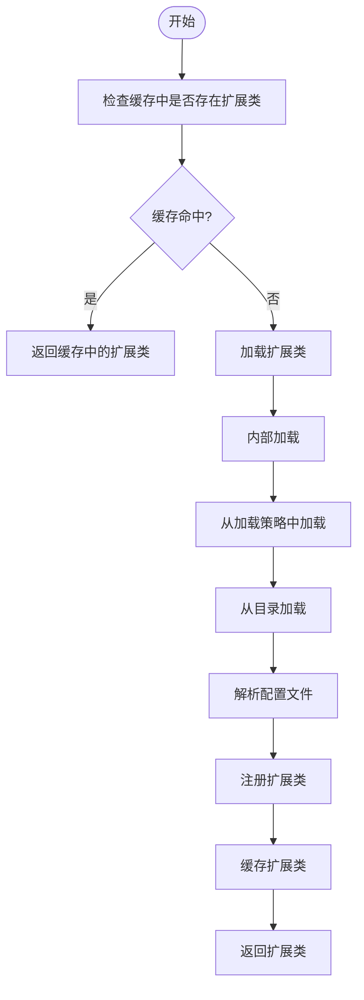
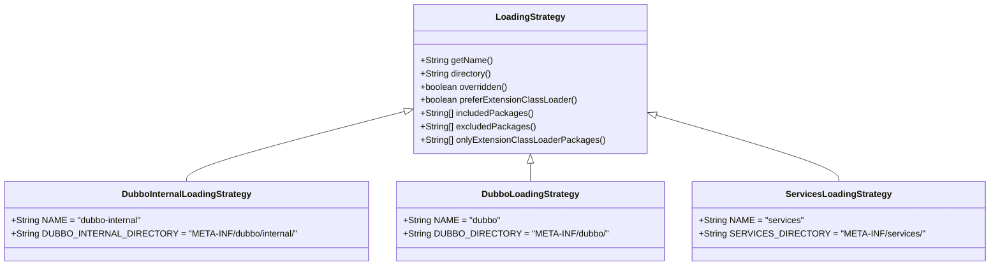
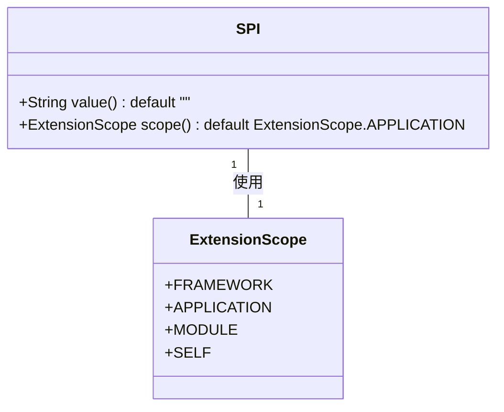
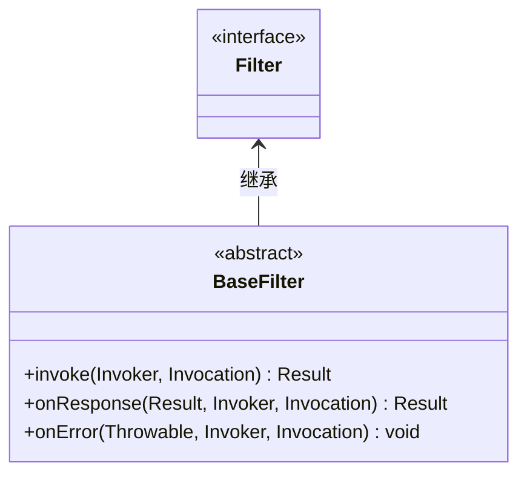
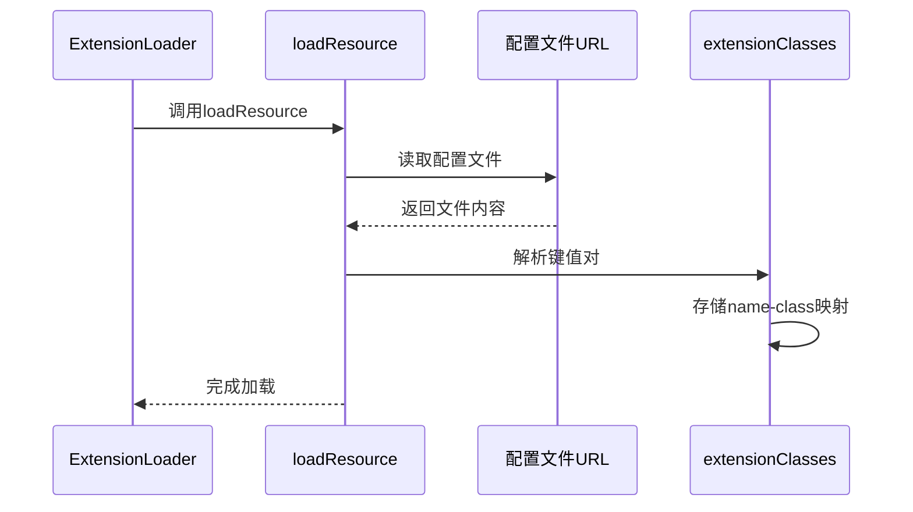
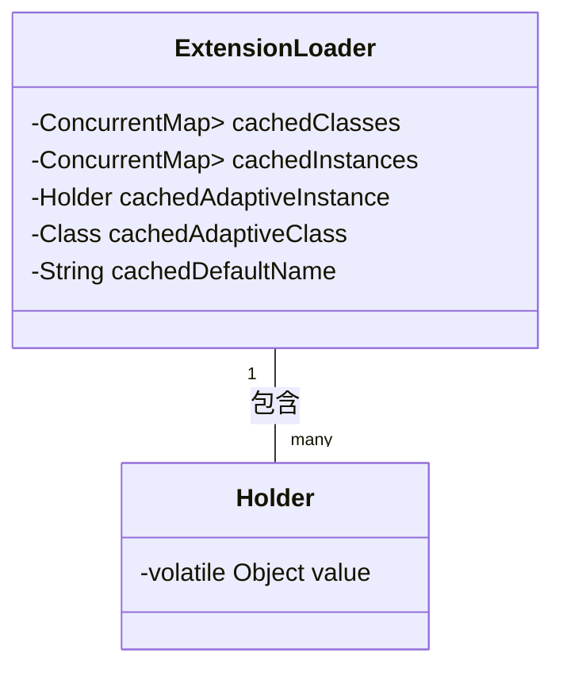
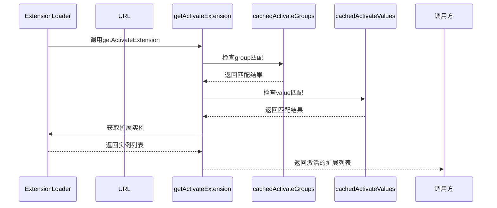
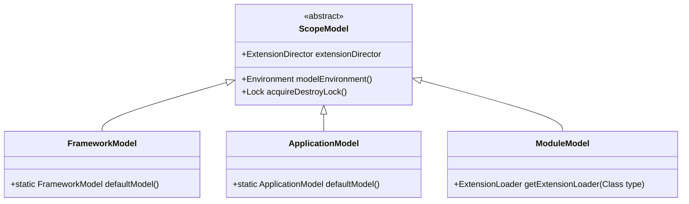

# SPI扩展机制

<cite>
**本文档引用的文件**   
- [ExtensionLoader.java](file://dubbo-common\src\main\java\org\apache\dubbo\common\extension\ExtensionLoader.java)
- [SPI.java](file://dubbo-common\src\main\java\org\apache\dubbo\common\extension\SPI.java)
- [Activate.java](file://dubbo-common\src\main\java\org\apache\dubbo\common\extension\Activate.java)
- [Filter.java](file://dubbo-rpc\dubbo-rpc-api\src\main\java\org\apache\dubbo\rpc\Filter.java)
- [DefaultFilterChainBuilder.java](file://dubbo-cluster\src\main\java\org\apache\dubbo\rpc\cluster\filter\DefaultFilterChainBuilder.java)
- [ScopeModelUtil.java](file://dubbo-common\src\main\java\org\apache\dubbo\rpc\model\ScopeModelUtil.java)
- [ExtensionDirector.java](file://dubbo-common\src\main\java\org\apache\dubbo\common\extension\ExtensionDirector.java)
</cite>

## 目录
1. [SPI扩展机制概述](#spi扩展机制概述)
2. [ExtensionLoader工作原理](#extensionloader工作原理)
3. [@SPI注解详解](#spi注解详解)
4. [过滤器扩展点定义与实现](#过滤器扩展点定义与实现)
5. [自定义过滤器扩展示例](#自定义过滤器扩展示例)
6. [扩展实例缓存与单例模式](#扩展实例缓存与单例模式)
7. [动态过滤器加载机制](#动态过滤器加载机制)
8. [版本管理与兼容性处理](#版本管理与兼容性处理)

## SPI扩展机制概述

SPI（Service Provider Interface）扩展机制是Dubbo框架的核心特性之一，它提供了一种基于接口的插件化扩展能力。通过SPI机制，开发者可以在不修改框架源码的情况下，动态地添加、替换或禁用各种功能组件，如协议、序列化方式、负载均衡策略、过滤器等。

Dubbo的SPI机制在Java原生SPI的基础上进行了深度增强，提供了更强大的功能，包括：
- 基于名称的扩展加载
- 自适应扩展（Adaptive Extension）
- 扩展自动激活（Activate Extension）
- 扩展包装（Wrapper Extension）
- 依赖注入（IOC）
- AOP支持

SPI机制的核心思想是将接口与实现分离，通过配置文件定义接口与实现类的映射关系，运行时根据配置动态加载相应的实现类。这种设计模式实现了高度的解耦，使得框架具有极强的可扩展性和灵活性。

**Section sources**
- [ExtensionLoader.java](file://dubbo-common\src\main\java\org\apache\dubbo\common\extension\ExtensionLoader.java#L92-L141)
- [SPI.java](file://dubbo-common\src\main\java\org\apache\dubbo\common\extension\SPI.java#L25-L130)

## ExtensionLoader工作原理

`ExtensionLoader`是Dubbo SPI机制的核心实现类，负责加载、缓存和管理所有的扩展实现。它采用懒加载模式，只有在首次请求某个扩展时才会进行加载和实例化。

### 加载过程

`ExtensionLoader`的加载过程遵循以下步骤：



**Diagram sources**
- [ExtensionLoader.java](file://dubbo-common\src\main\java\org\apache\dubbo\common\extension\ExtensionLoader.java#L1250-L1276)

### 核心方法

`ExtensionLoader`提供了多个核心方法来获取扩展实例：

- `getExtension(String name)`：根据名称获取指定的扩展实例
- `getAdaptiveExtension()`：获取自适应扩展实例
- `getActivateExtension(URL url, String key, String group)`：根据URL参数获取激活的扩展实例
- `getSupportedExtensions()`：获取所有支持的扩展名称

### 加载策略

Dubbo定义了多种加载策略，按照优先级顺序依次加载扩展：



**Diagram sources**
- [ExtensionLoader.java](file://dubbo-common\src\main\java\org\apache\dubbo\common\extension\ExtensionLoader.java#L233-L344)

**Section sources**
- [ExtensionLoader.java](file://dubbo-common\src\main\java\org\apache\dubbo\common\extension\ExtensionLoader.java#L1340-L1410)

## @SPI注解详解

`@SPI`注解是Dubbo SPI机制的基石，用于标记一个接口为扩展点。所有需要通过SPI机制加载的接口都必须使用此注解进行标记。

### 注解定义



**Diagram sources**
- [SPI.java](file://dubbo-common\src\main\java\org\apache\dubbo\common\extension\SPI.java#L134-L153)

### 属性说明

`@SPI`注解包含两个重要属性：

#### value属性
- **作用**：指定默认的扩展实现名称
- **用法**：当未指定具体扩展时，使用该名称对应的实现
- **示例**：`@SPI("dubbo")`表示默认使用名为"dubbo"的扩展实现

#### scope属性
- **作用**：定义扩展的作用域和生命周期
- **可选值**：
  - `FRAMEWORK`：框架级扩展，全局共享
  - `APPLICATION`：应用级扩展，同一应用内共享（默认值）
  - `MODULE`：模块级扩展，同一模块内共享
  - `SELF`：自身作用域，不共享

### 使用示例

```java
@SPI("default")
public interface Protocol {
    // 协议相关方法
}

@SPI(scope = ExtensionScope.FRAMEWORK)
public interface Filter {
    // 过滤器相关方法
}
```

**Section sources**
- [SPI.java](file://dubbo-common\src\main\java\org\apache\dubbo\common\extension\SPI.java#L25-L153)
- [Filter.java](file://dubbo-rpc\dubbo-rpc-api\src\main\java\org\apache\dubbo\rpc\Filter.java#L68-L69)

## 过滤器扩展点定义与实现

过滤器（Filter）是Dubbo中重要的扩展点之一，用于在服务调用的前后插入自定义逻辑，如日志记录、性能监控、权限验证等。

### 扩展点定义

过滤器扩展点通过`@SPI`注解定义，并继承自`BaseFilter`接口：



**Diagram sources**
- [Filter.java](file://dubbo-rpc\dubbo-rpc-api\src\main\java\org\apache\dubbo\rpc\Filter.java#L68-L69)

### 实现类注册

过滤器实现类通过配置文件进行注册，配置文件位于`META-INF/dubbo/`目录下，文件名为接口的全限定名。

#### 配置文件格式

配置文件采用键值对格式，其中键为扩展名称，值为实现类的全限定名：

```
# META-INF/dubbo/org.apache.dubbo.rpc.Filter
log-filter=com.example.LogFilter
monitor-filter=com.example.MonitorFilter
auth-filter=com.example.AuthFilter
```

#### 注册机制

注册机制的核心是`ExtensionLoader`的`loadResource`方法，它会扫描所有类路径下的配置文件，并将扩展名称与实现类的映射关系存储在内存中。



**Diagram sources**
- [ExtensionLoader.java](file://dubbo-common\src\main\java\org\apache\dubbo\common\extension\ExtensionLoader.java#L1422-L1431)

**Section sources**
- [Filter.java](file://dubbo-rpc\dubbo-rpc-api\src\main\java\org\apache\dubbo\rpc\Filter.java#L68-L69)
- [ExtensionLoader.java](file://dubbo-common\src\main\java\org\apache\dubbo\common\extension\ExtensionLoader.java#L1412-L1432)

## 自定义过滤器扩展示例

本节提供一个完整的自定义过滤器扩展示例，包括实现类编写、配置文件创建和扩展加载。

### 简单日志过滤器

#### 实现类编写

```java
@Activate(group = {"provider", "consumer"}, value = "log-filter")
public class LogFilter implements Filter {
    
    private static final Logger logger = LoggerFactory.getLogger(LogFilter.class);
    
    @Override
    public Result invoke(Invoker<?> invoker, Invocation invocation) throws RpcException {
        // 调用前处理
        long start = System.currentTimeMillis();
        String methodName = invocation.getMethodName();
        logger.info("开始调用方法: {}", methodName);
        
        try {
            // 执行实际调用
            Result result = invoker.invoke(invocation);
            return result;
        } catch (Exception e) {
            // 异常处理
            logger.error("调用方法 {} 失败", methodName, e);
            throw e;
        } finally {
            // 调用后处理
            long cost = System.currentTimeMillis() - start;
            logger.info("方法 {} 调用完成，耗时: {}ms", methodName, cost);
        }
    }
}
```

#### 配置文件创建

在`META-INF/dubbo/org.apache.dubbo.rpc.Filter`文件中添加：

```
log-filter=com.example.LogFilter
```

#### 扩展加载

```java
// 获取过滤器扩展加载器
ExtensionLoader<Filter> loader = ExtensionLoader.getExtensionLoader(Filter.class);

// 获取日志过滤器实例
Filter logFilter = loader.getExtension("log-filter");

// 或者通过URL参数自动激活
URL url = URL.valueOf("dubbo://127.0.0.1:20880?filter=log-filter");
List<Filter> filters = loader.getActivateExtension(url, "filter");
```

**Section sources**
- [Activate.java](file://dubbo-common\src\main\java\org\apache\dubbo\common\extension\Activate.java#L57-L138)
- [Filter.java](file://dubbo-rpc\dubbo-rpc-api\src\main\java\org\apache\dubbo\rpc\Filter.java#L68-L69)

## 扩展实例缓存与单例模式

Dubbo的SPI机制采用了高效的缓存策略和单例模式，确保扩展实例的高效复用和线程安全。

### 缓存机制

`ExtensionLoader`使用多个缓存来提高性能：



**Diagram sources**
- [ExtensionLoader.java](file://dubbo-common\src\main\java\org\apache\dubbo\common\extension\ExtensionLoader.java#L161-L214)

### 缓存类型

#### 类缓存（cachedClasses）
- **作用**：缓存扩展接口的所有实现类
- **类型**：`ConcurrentMap<String, Class<?>>`
- **特点**：一次性加载，永久缓存

#### 实例缓存（cachedInstances）
- **作用**：缓存已创建的扩展实例
- **类型**：`ConcurrentMap<String, Holder<Object>>`
- **特点**：懒加载，按需创建

#### 自适应实例缓存（cachedAdaptiveInstance）
- **作用**：缓存自适应扩展实例
- **类型**：`Holder<Object>`
- **特点**：单例模式，线程安全

### 单例模式实现

扩展实例的单例模式通过双重检查锁定和`volatile`关键字实现：

```java
private T createExtension(String name, boolean wrap) {
    Class<?> clazz = getExtensionClasses().get(name);
    if (clazz == null) {
        throw new IllegalArgumentException("...");
    }
    try {
        T instance = (T) EXTENSION_INSTANCES.get(clazz);
        if (instance == null) {
            EXTENSION_INSTANCES.putIfAbsent(clazz, clazz.newInstance());
            instance = (T) EXTENSION_INSTANCES.get(clazz);
        }
        return instance;
    } catch (Throwable t) {
        throw new IllegalStateException("...");
    }
}
```

**Section sources**
- [ExtensionLoader.java](file://dubbo-common\src\main\java\org\apache\dubbo\common\extension\ExtensionLoader.java#L161-L218)

## 动态过滤器加载机制

Dubbo提供了灵活的动态过滤器加载机制，可以根据运行时条件自动激活相应的过滤器。

### @Activate注解

`@Activate`注解用于标记一个扩展在特定条件下自动激活：

```mermaid
classDiagram
class Activate {
+String[] group() default {}
+String[] value() default {}
+int order() default 0
+String[] onClass() default {}
}
class Filter {
<<interface>>
}
Filter <.. Activate : 使用
```

**Diagram sources**
- [Activate.java](file://dubbo-common\src\main\java\org\apache\dubbo\common\extension\Activate.java#L53-L139)

### 激活条件

#### group条件
- **作用**：根据调用方或服务方角色激活
- **示例**：`@Activate(group = "provider")`表示只在服务提供方激活

#### value条件
- **作用**：根据URL参数激活
- **示例**：`@Activate(value = "monitor")`表示当URL包含monitor参数时激活

#### order条件
- **作用**：定义过滤器的执行顺序
- **示例**：`@Activate(order = 100)`表示优先级为100

### 加载流程



**Diagram sources**
- [ExtensionLoader.java](file://dubbo-common\src\main\java\org\apache\dubbo\common\extension\ExtensionLoader.java#L506-L668)

### 过滤器链构建

在`DefaultFilterChainBuilder`中，过滤器链的构建过程如下：

```java
public <T> Invoker<T> buildInvokerChain(final Invoker<T> originalInvoker, String key, String group) {
    Invoker<T> last = originalInvoker;
    URL url = originalInvoker.getUrl();
    
    // 获取激活的过滤器
    List<Filter> filters = getExtensionLoader(Filter.class)
        .getActivateExtension(url, key, group);
    
    // 逆序构建过滤器链
    if (!CollectionUtils.isEmpty(filters)) {
        for (int i = filters.size() - 1; i >= 0; i--) {
            final Filter filter = filters.get(i);
            final Invoker<T> next = last;
            last = new FilterChainNode<>(originalInvoker, next, filter);
        }
    }
    
    return last;
}
```

**Section sources**
- [Activate.java](file://dubbo-common\src\main\java\org\apache\dubbo\common\extension\Activate.java#L57-L138)
- [DefaultFilterChainBuilder.java](file://dubbo-cluster\src\main\java\org\apache\dubbo\rpc\cluster\filter\DefaultFilterChainBuilder.java#L37-L118)

## 版本管理与兼容性处理

Dubbo的SPI机制提供了完善的版本管理和兼容性处理策略，确保不同版本间的平滑过渡。

### 兼容性策略

#### 双向兼容
- **旧版本兼容新版本**：通过默认值和可选参数实现
- **新版本兼容旧版本**：通过注解元数据和反射机制实现

#### 降级处理
当加载扩展失败时，Dubbo会记录异常但不会中断主流程：

```java
private void loadResource(...) {
    try {
        // 加载扩展
        loadClass(...);
    } catch (Throwable t) {
        logger.error("加载扩展类时发生异常", t);
        // 继续加载其他扩展
    }
}
```

### 版本迁移

#### 配置文件迁移
从旧版本的纯类名列表迁移到键值对格式：

```
# 旧格式
com.foo.XxxProtocol
com.foo.YyyProtocol

# 新格式
xxx=com.foo.XxxProtocol
yyy=com.foo.YyyProtocol
```

#### 注解兼容
通过`Dubbo2CompactUtils`和`Dubbo2ActivateUtils`提供向后兼容：

```java
if (Dubbo2CompactUtils.isEnabled() && Dubbo2ActivateUtils.isActivateLoaded()) {
    // 处理旧版本@Activate注解
    activateGroup = Dubbo2ActivateUtils.getGroup((Annotation) activate);
    activateValue = Dubbo2ActivateUtils.getValue((Annotation) activate);
}
```

### 作用域模型

通过`ScopeModel`实现多层级的作用域管理：



**Diagram sources**
- [ScopeModelUtil.java](file://dubbo-common\src\main\java\org\apache\dubbo\rpc\model\ScopeModelUtil.java#L100-L118)
- [ExtensionDirector.java](file://dubbo-common\src\main\java\org\apache\dubbo\common\extension\ExtensionDirector.java#L207-L308)

**Section sources**
- [ScopeModelUtil.java](file://dubbo-common\src\main\java\org\apache\dubbo\rpc\model\ScopeModelUtil.java#L100-L118)
- [ExtensionDirector.java](file://dubbo-common\src\main\java\org\apache\dubbo\common\extension\ExtensionDirector.java#L207-L308)