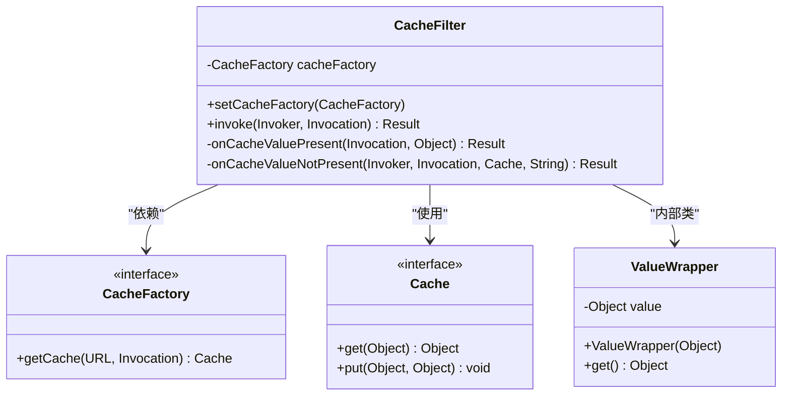
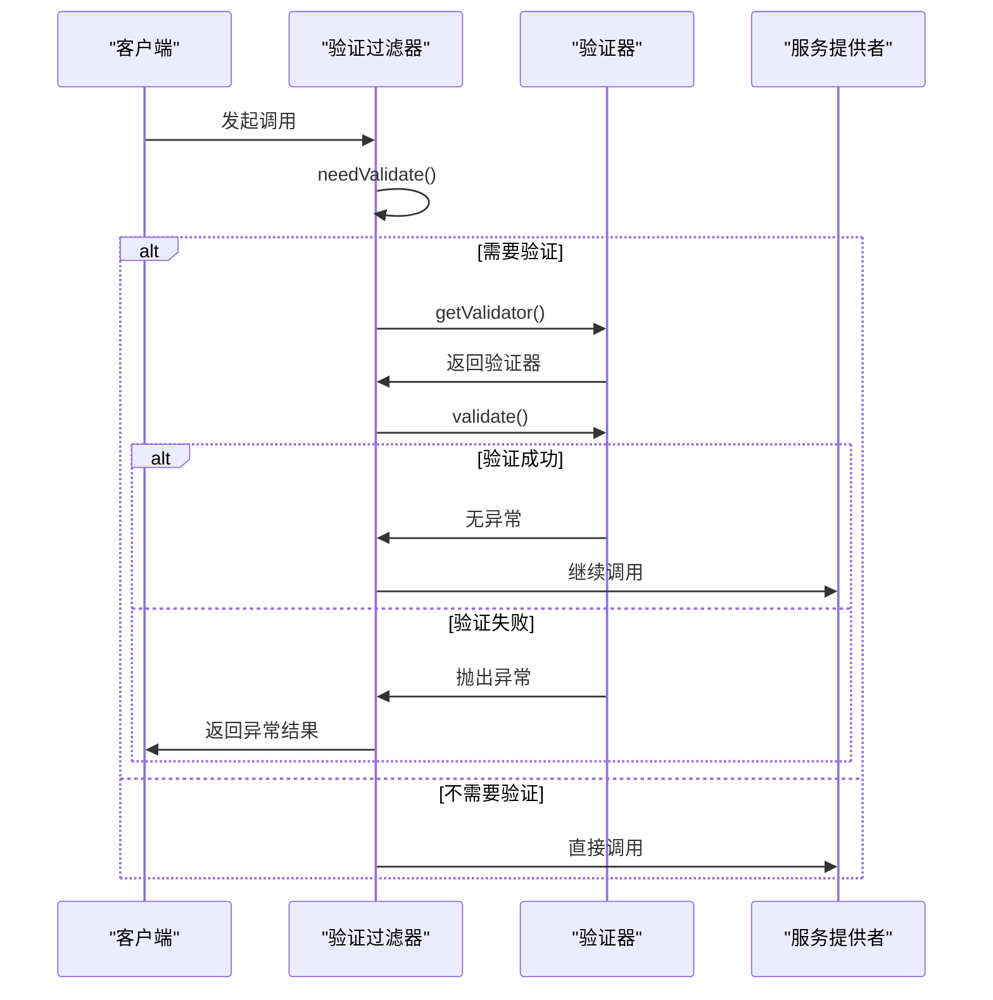
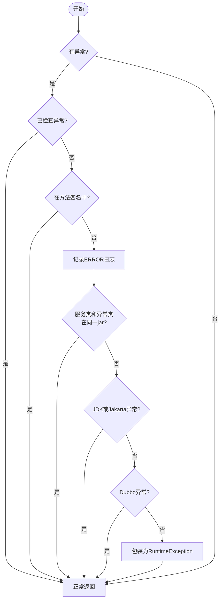
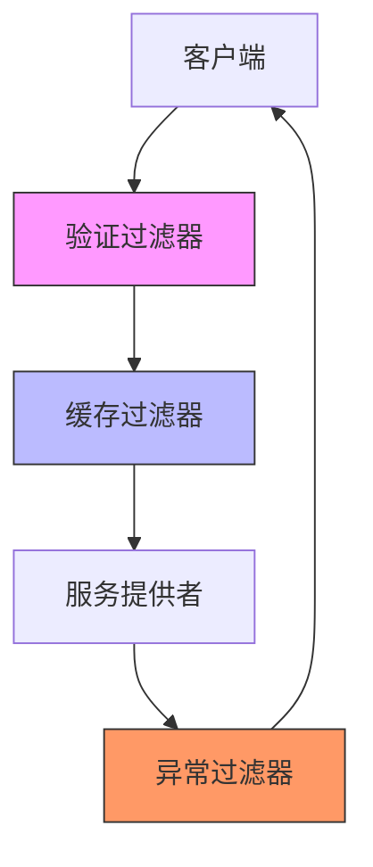

# 过滤器实现示例

<cite>
**本文档中引用的文件**  
- [CacheFilter.java](file://dubbo-plugin\dubbo-filter-cache\src\main\java\org\apache\dubbo\cache\filter\CacheFilter.java)
- [ValidationFilter.java](file://dubbo-plugin\dubbo-filter-validation\src\main\java\org\apache\dubbo\validation\filter\ValidationFilter.java)
- [ExceptionFilter.java](file://dubbo-rpc\dubbo-rpc-api\src\main\java\org\apache\dubbo\rpc\filter\ExceptionFilter.java)
- [CacheFactory.java](file://dubbo-plugin\dubbo-filter-cache\src\main\java\org\apache\dubbo\cache\CacheFactory.java)
- [Validator.java](file://dubbo-plugin\dubbo-filter-validation\src\main\java\org\apache\dubbo\validation\Validator.java)
- [org.apache.dubbo.rpc.Filter](file://dubbo-plugin\dubbo-filter-cache\src\main\resources\META-INF\dubbo\internal\org.apache.dubbo.rpc.Filter)
- [org.apache.dubbo.rpc.Filter](file://dubbo-plugin\dubbo-filter-validation\src\main\resources\META-INF\dubbo\internal\org.apache.dubbo.rpc.Filter)
- [CacheTest.java](file://dubbo-config\dubbo-config-api\src\test\java\org\apache\dubbo\config\cache\CacheTest.java)
- [ValidationFilterTest.java](file://dubbo-plugin\dubbo-filter-validation\src\test\java\org\apache\dubbo\validation\filter\ValidationFilterTest.java)
</cite>

## 目录
1. [引言](#引言)
2. [缓存过滤器(CacheFilter)详解](#缓存过滤器cachefilter详解)
3. [验证过滤器(ValidationFilter)详解](#验证过滤器validationfilter详解)
4. [异常过滤器(ExceptionFilter)详解](#异常过滤器exceptionfilter详解)
5. [过滤器配置与启用](#过滤器配置与启用)
6. [过滤器协同工作模式](#过滤器协同工作模式)
7. [使用示例](#使用示例)
8. [高级使用指南](#高级使用指南)

## 引言
本文档深入探讨Dubbo框架中三种核心过滤器的实现：缓存过滤器(CacheFilter)、验证过滤器(ValidationFilter)和异常过滤器(ExceptionFilter)。文档详细解释了每种过滤器的设计原理、实现方式、配置方法以及它们之间的协同工作机制，为开发者提供全面的指导。

## 缓存过滤器(CacheFilter)详解

缓存过滤器(CacheFilter)是Dubbo框架中的核心组件之一，用于在服务调用过程中缓存方法的返回值，从而提高系统性能。该过滤器通过拦截RPC调用，在方法执行前检查缓存中是否存在对应的结果，如果存在则直接返回缓存结果，避免重复的远程调用。

### 设计原理与实现方式
缓存过滤器的实现基于责任链模式和SPI扩展机制。当服务提供者或消费者配置了缓存属性时，Dubbo框架会自动将CacheFilter加入到调用链中。过滤器通过`@Activate`注解声明其激活条件，即在消费者和提供者组中，当URL参数包含`cache`键时激活。



**图源**
- [CacheFilter.java](file://dubbo-plugin\dubbo-filter-cache\src\main\java\org\apache\dubbo\cache\filter\CacheFilter.java#L67-L144)
- [CacheFactory.java](file://dubbo-plugin\dubbo-filter-cache\src\main\java\org\apache\dubbo\cache\CacheFactory.java#L31-L42)

### 缓存策略与缓存键生成机制
缓存过滤器支持多种缓存策略，包括LRU(最近最少使用)、ThreadLocal、JCache和Expiring(过期)等。这些策略通过不同的CacheFactory实现来提供。

缓存键的生成基于方法调用的参数。在`invoke`方法中，通过`StringUtils.toArgumentString(invocation.getArguments())`将方法参数转换为字符串作为缓存键。这种机制确保了相同参数的调用能够命中相同的缓存条目。

缓存值的处理通过`ValueWrapper`内部类实现，该类实现了Serializable接口，确保缓存值可以被序列化存储。当缓存命中时，过滤器会包装缓存值为`AsyncRpcResult`并返回；当缓存未命中时，会执行实际的方法调用，并将结果存入缓存。

**本节源码**
- [CacheFilter.java](file://dubbo-plugin\dubbo-filter-cache\src\main\java\org\apache\dubbo\cache\filter\CacheFilter.java#L94-L124)

## 验证过滤器(ValidationFilter)详解

验证过滤器(ValidationFilter)负责在方法调用前对参数进行验证，确保传入参数的合法性。该过滤器通过集成不同的验证框架，提供了灵活的参数验证机制。

### 参数验证流程
验证过滤器的执行流程如下：
1. 检查是否需要进行验证（通过`needValidate`方法）
2. 获取对应的Validator实例
3. 执行参数验证
4. 处理验证结果或异常



**图源**
- [ValidationFilter.java](file://dubbo-plugin\dubbo-filter-validation\src\main\java\org\apache\dubbo\validation\filter\ValidationFilter.java#L87-L111)

### 错误处理机制
验证过滤器具有完善的错误处理机制。当验证过程中发生`RpcException`时，会直接抛出该异常；对于其他类型的异常，则会将其包装为异步结果返回，避免中断整个调用链。

`needValidate`方法决定了是否需要进行验证，其判断条件包括：
- validation实例不为空
- 方法名不以"$"开头
- 方法级别的validation参数不为空
- 全局validation参数不为"false"

这种设计确保了验证只在必要时执行，提高了系统性能。

**本节源码**
- [ValidationFilter.java](file://dubbo-plugin\dubbo-filter-validation\src\main\java\org\apache\dubbo\validation\filter\ValidationFilter.java#L87-L111)

## 异常过滤器(ExceptionFilter)详解

异常过滤器(ExceptionFilter)负责处理服务调用过程中的异常，提供统一的异常处理机制。该过滤器在服务提供者端运行，对未声明的异常进行特殊处理。

### 异常捕获模式
异常过滤器实现了`Filter`和`Filter.Listener`接口，通过`onResponse`和`onError`方法捕获和处理异常。其主要功能包括：

1. **日志记录**：对于未声明的未检查异常，在ERROR级别记录日志
2. **异常包装**：将非API包中的异常包装为RuntimeException，避免序列化问题
3. **异常传递**：对于已声明的异常或JDK异常，直接传递给客户端



**图源**
- [ExceptionFilter.java](file://dubbo-rpc\dubbo-rpc-api\src\main\java\org\apache\dubbo\rpc\filter\ExceptionFilter.java#L58-L127)

### 异常处理策略
异常过滤器采用分层处理策略，优先级从高到低如下：
1. 已检查异常：直接返回，不进行任何处理
2. 方法签名中声明的异常：直接返回
3. 服务接口和异常类在同一jar包中的异常：直接返回
4. JDK或Jakarta基础库异常：直接返回
5. Dubbo框架异常(RpcException)：直接返回
6. 其他所有异常：包装为RuntimeException返回

这种策略确保了正常的业务异常能够正确传递，同时防止了潜在的序列化问题和敏感信息泄露。

**本节源码**
- [ExceptionFilter.java](file://dubbo-rpc\dubbo-rpc-api\src\main\java\org\apache\dubbo\rpc\filter\ExceptionFilter.java#L58-L127)

## 过滤器配置与启用

### 启用方式
过滤器通过SPI机制自动注册和启用。在`META-INF/dubbo/internal/org.apache.dubbo.rpc.Filter`文件中定义了过滤器的名称和实现类的映射关系：

```properties
cache=org.apache.dubbo.cache.filter.CacheFilter
validation=org.apache.dubbo.validation.filter.ValidationFilter
```

当服务配置中包含相应的参数时，对应的过滤器就会被激活。

### 配置说明
#### 缓存过滤器配置
缓存过滤器可以通过多种方式配置：

```xml
<!-- 服务级别配置 -->
<dubbo:service cache="lru" />

<!-- 方法级别配置 -->
<dubbo:service>
    <dubbo:method name="method2" cache="threadlocal" />
</dubbo:service>

<!-- 提供者级别配置 -->
<dubbo:provider cache="expiring" />

<!-- 消费者级别配置 -->
<dubbo:consumer cache="jcache" />
```

方法级别的配置优先级高于服务级别，这使得可以为特定方法配置不同的缓存策略。

#### 验证过滤器配置
验证过滤器的配置方式类似：

```xml
<!-- 启用JSR 303验证 -->
<dubbo:service validation="jvalidation" />

<!-- 方法级别验证 -->
<dubbo:service>
    <dubbo:method name="save" validation="jvalidation" />
</dubbo:service>
```

### 自定义验证实现
要添加新的验证类型，需要：
1. 实现`Validation`接口或继承`AbstractValidation`类
2. 实现对应的`Validator`类
3. 在`META-INF/dubbo/internal/org.apache.dubbo.validation.Validation`文件中添加映射

**本节源码**
- [org.apache.dubbo.rpc.Filter](file://dubbo-plugin\dubbo-filter-cache\src\main\resources\META-INF\dubbo\internal\org.apache.dubbo.rpc.Filter#L1)
- [org.apache.dubbo.rpc.Filter](file://dubbo-plugin\dubbo-filter-validation\src\main\resources\META-INF\dubbo\internal\org.apache.dubbo.rpc.Filter#L1)

## 过滤器协同工作模式

### 协同工作机制
在Dubbo的调用链中，多个过滤器按照特定顺序协同工作。通常的执行顺序为：
1. 验证过滤器(ValidationFilter)
2. 缓存过滤器(CacheFilter)
3. 异常过滤器(ExceptionFilter)

这种顺序确保了：
- 先验证参数合法性
- 再检查缓存
- 最后处理可能的异常



**图源**
- [ValidationFilter.java](file://dubbo-plugin\dubbo-filter-validation\src\main\java\org\apache\dubbo\validation\filter\ValidationFilter.java#L62-L65)
- [CacheFilter.java](file://dubbo-plugin\dubbo-filter-cache\src\main\java\org\apache\dubbo\cache\filter\CacheFilter.java#L67-L69)
- [ExceptionFilter.java](file://dubbo-rpc\dubbo-rpc-api\src\main\java\org\apache\dubbo\rpc\filter\ExceptionFilter.java#L49)

### 潜在冲突处理
不同过滤器之间可能存在潜在冲突，主要体现在：

1. **执行顺序冲突**：通过`@Activate`注解的`order`属性控制执行顺序
2. **缓存与验证冲突**：验证过滤器在缓存之前执行，确保缓存的都是经过验证的有效数据
3. **异常处理冲突**：异常过滤器位于调用链末端，能够捕获前面所有过滤器的异常

通过合理的顺序设计和职责分离，这些潜在冲突得到了有效解决。

**本节源码**
- [ValidationFilter.java](file://dubbo-plugin\dubbo-filter-validation\src\main\java\org\apache\dubbo\validation\filter\ValidationFilter.java#L65)
- [CacheFilter.java](file://dubbo-plugin\dubbo-filter-cache\src\main\java\org\apache\dubbo\cache\filter\CacheFilter.java#L69)
- [ExceptionFilter.java](file://dubbo-rpc\dubbo-rpc-api\src\main\java\org\apache\dubbo\rpc\filter\ExceptionFilter.java#L49)

## 使用示例

### 初学者示例
以下是一个简单的缓存过滤器使用示例：

```java
// 服务接口
public interface CacheService {
    String findCache(String id);
}

// 服务实现
public class CacheServiceImpl implements CacheService {
    private final AtomicInteger i = new AtomicInteger();
    
    public String findCache(String id) {
        return "request: " + id + ", response: " + i.getAndIncrement();
    }
}

// 配置使用
ReferenceConfig<CacheService> reference = new ReferenceConfig<>();
reference.setInterface(CacheService.class);
reference.setUrl("injvm://127.0.0.1?scope=remote&cache=true");

MethodConfig method = new MethodConfig();
method.setName("findCache");
method.setCache("lru");
reference.setMethods(Arrays.asList(method));
```

在这个示例中，`findCache`方法的返回值会被缓存，相同的参数调用将返回相同的缓存结果。

**本节源码**
- [CacheTest.java](file://dubbo-config\dubbo-config-api\src\test\java\org\apache\dubbo\config\cache\CacheTest.java#L58-L103)
- [CacheService.java](file://dubbo-config\dubbo-config-api\src\test\java\org\apache\dubbo\config\cache\CacheService.java#L22-L25)
- [CacheServiceImpl.java](file://dubbo-config\dubbo-config-api\src\test\java\org\apache\dubbo\config\cache\CacheServiceImpl.java#L24-L31)

## 高级使用指南

### 复杂过滤器组合
在实际应用中，经常需要组合使用多个过滤器。以下是一个高级使用示例：

```java
// 自定义验证器
public class CustomValidation implements Validation {
    @Override
    public Validator getValidator(URL url) {
        return new CustomValidator(url);
    }
}

// 自定义验证逻辑
public class CustomValidator implements Validator {
    private URL url;
    
    public CustomValidator(URL url) {
        this.url = url;
    }
    
    @Override
    public void validate(String methodName, Class<?>[] parameterTypes, Object[] arguments) throws Exception {
        // 自定义验证逻辑
        if (arguments != null && arguments.length > 0 && arguments[0] == null) {
            throw new IllegalArgumentException("参数不能为空");
        }
    }
    
    @Override
    public boolean isSupport() {
        return true;
    }
}
```

### 性能优化建议
1. **合理设置缓存策略**：根据业务特点选择合适的缓存策略
2. **避免过度验证**：只对关键参数进行验证
3. **监控异常频率**：通过异常过滤器的日志监控系统健康状况
4. **测试缓存失效**：确保缓存更新机制正常工作

### 调试与测试
使用提供的测试类可以验证过滤器的行为：

```java
// 验证过滤器测试
@Test
void testValidationFilter() {
    ValidationFilter validationFilter = new ValidationFilter();
    validationFilter.setValidation(validation);
    
    Result result = validationFilter.invoke(invoker, invocation);
    assertThat(String.valueOf(result.getValue()), is("success"));
}
```

**本节源码**
- [ValidationFilterTest.java](file://dubbo-plugin\dubbo-filter-validation\src\test\java\org\apache\dubbo\validation\filter\ValidationFilterTest.java#L37-L134)
- [CacheFilterTest.java](file://dubbo-plugin\dubbo-filter-cache\src\test\java\org\apache\dubbo\cache\filter\CacheFilterTest.java#L40-L141)