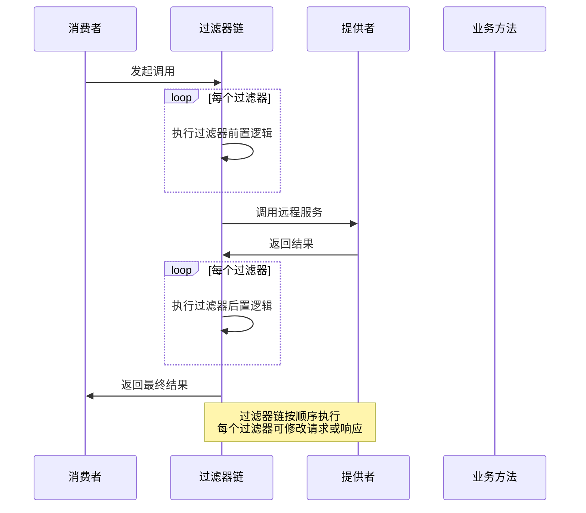
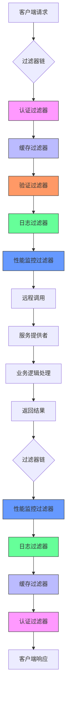

# 过滤器机制

<cite>
**本文档中引用的文件**  
- [Filter.java](file://dubbo-rpc/dubbo-rpc-api/src/main/java/org/apache/dubbo/rpc/Filter.java)
- [CacheFilter.java](file://dubbo-plugin/dubbo-filter-cache/src/main/java/org/apache/dubbo/cache/filter/CacheFilter.java)
- [ValidationFilter.java](file://dubbo-plugin/dubbo-filter-validation/src/main/java/org/apache/dubbo/validation/filter/ValidationFilter.java)
- [FilterChainBuilder.java](file://dubbo-cluster/src/main/java/org/apache/dubbo/rpc/cluster/filter/FilterChainBuilder.java)
- [org.apache.dubbo.rpc.Filter](file://dubbo-plugin/dubbo-filter-cache/src/main/resources/META-INF/dubbo/internal/org.apache.dubbo.rpc.Filter)
- [org.apache.dubbo.rpc.Filter](file://dubbo-plugin/dubbo-filter-validation/src/main/resources/META-INF/dubbo/internal/org.apache.dubbo.rpc.Filter)
- [ActivateComparator.java](file://dubbo-common/src/main/java/org/apache/dubbo/common/extension/support/ActivateComparator.java)
</cite>

## 目录
1. [引言](#引言)
2. [过滤器接口设计原理](#过滤器接口设计原理)
3. [过滤器链构建与执行流程](#过滤器链构建与执行流程)
4. [缓存过滤器实现分析](#缓存过滤器实现分析)
5. [验证过滤器实现分析](#验证过滤器实现分析)
6. [SPI扩展机制与加载过程](#spi扩展机制与加载过程)
7. [自定义过滤器开发指南](#自定义过滤器开发指南)
8. [过滤器调用时序图](#过滤器调用时序图)
9. [数据流图](#数据流图)

## 引言
Dubbo框架中的过滤器机制是其核心扩展点之一，为服务提供方和消费方提供了强大的拦截能力。通过过滤器，开发者可以在方法调用前后插入自定义逻辑，实现诸如缓存、验证、日志记录、性能监控等功能。本文档将深入分析dubbo-plugin模块中过滤器机制的详细内容，全面解释Filter接口的设计原理和实现方式。

**过滤器机制**在Dubbo 3.0版本中进行了重构，引入了新的过滤器链结构，支持在不同阶段拦截RPC请求。这种设计使得框架更加灵活，能够满足各种复杂的业务需求。本文档将详细描述过滤器链的构建和执行流程，并重点分析缓存过滤器和验证过滤器的具体实现。

## 过滤器接口设计原理

Dubbo的过滤器机制基于SPI（Service Provider Interface）扩展机制实现，核心接口为`org.apache.dubbo.rpc.Filter`。该接口继承自`BaseFilter`，定义了过滤器的基本行为。

`Filter`接口的设计遵循了AOP（面向切面编程）的思想，允许在远程方法调用的前后执行自定义逻辑。每个过滤器都实现了`invoke`方法，该方法接收`Invoker`和`Invocation`两个参数，分别代表服务提供者实例和方法调用信息。

过滤器接口的关键特性包括：
- **SPI注解**：通过`@SPI(scope = ExtensionScope.MODULE)`注解标记，表明这是一个可扩展的接口
- **线程安全**：过滤器实例是单例且线程安全的
- **分组激活**：支持在消费方和提供方两个分组中激活

过滤器的执行遵循责任链模式，多个过滤器形成一个链式结构，依次处理请求和响应。这种设计使得不同的功能可以解耦，每个过滤器专注于单一职责。

**Section sources**
- [Filter.java](file://dubbo-rpc/dubbo-rpc-api/src/main/java/org/apache/dubbo/rpc/Filter.java#L1-L70)

## 过滤器链构建与执行流程

过滤器链的构建和执行是Dubbo过滤器机制的核心。`FilterChainBuilder`接口负责构建过滤器链，它定义了`buildInvokerChain`和`buildClusterInvokerChain`两个方法，分别用于构建提供方和消费方的过滤器链。

在提供方侧，过滤器链的构建过程如下：
1. 从SPI扩展中获取所有激活的过滤器
2. 根据`@Activate`注解的配置对过滤器进行排序
3. 将过滤器按顺序链接成链式结构
4. 返回包装后的Invoker实例

`FilterChainNode`类是过滤器链的核心实现，它实现了`Invoker`接口，将原始Invoker、下一个节点和当前过滤器封装在一起。当调用`invoke`方法时，会先执行当前过滤器的逻辑，然后调用下一个节点。

过滤器链的执行流程遵循典型的AOP环绕通知模式：
1. 执行过滤器前置逻辑
2. 调用下一个过滤器或目标方法
3. 执行过滤器后置逻辑
4. 返回结果或处理异常

这种设计确保了过滤器能够完整地拦截方法调用过程，同时保持了良好的性能和可扩展性。

**Section sources**
- [FilterChainBuilder.java](file://dubbo-cluster/src/main/java/org/apache/dubbo/rpc/cluster/filter/FilterChainBuilder.java#L1-L416)

## 缓存过滤器实现分析

`CacheFilter`是Dubbo提供的一个核心过滤器，用于实现方法返回值的缓存功能。该过滤器通过`@Activate`注解在消费方和提供方都激活，配置键为`cache`。

`CacheFilter`的实现原理如下：
1. 检查是否配置了缓存，如果没有配置则直接调用目标方法
2. 根据URL参数获取对应的`CacheFactory`实例
3. 生成缓存键，通常基于方法参数
4. 尝试从缓存中获取结果
5. 如果缓存命中则返回缓存值，否则调用目标方法并将结果存入缓存

缓存过滤器支持多种缓存类型，包括：
- **lru**：基于最近最少使用算法的缓存
- **threadlocal**：基于线程本地存储的缓存
- **jcache**：基于JSR-107标准的缓存
- **expiring**：带过期时间的缓存

缓存键的生成策略是将方法参数转换为字符串，确保相同参数的调用能够命中同一缓存项。缓存值被包装在`ValueWrapper`类中，以支持序列化和反序列化。

`CacheFilter`的SPI配置位于`META-INF/dubbo/internal/org.apache.dubbo.rpc.Filter`文件中，内容为`cache=org.apache.dubbo.cache.filter.CacheFilter`，这使得框架能够自动发现和加载该过滤器。

**Section sources**
- [CacheFilter.java](file://dubbo-plugin/dubbo-filter-cache/src/main/java/org/apache/dubbo/cache/filter/CacheFilter.java#L1-L144)
- [org.apache.dubbo.rpc.Filter](file://dubbo-plugin/dubbo-filter-cache/src/main/resources/META-INF/dubbo/internal/org.apache.dubbo.rpc.Filter#L1-L1)

## 验证过滤器实现分析

`ValidationFilter`是Dubbo提供的另一个重要过滤器，用于实现方法参数的验证功能。该过滤器同样通过`@Activate`注解在消费方和提供方激活，配置键为`validation`，执行顺序为10000。

`ValidationFilter`的实现原理如下：
1. 检查是否需要验证，判断条件包括：
   - 验证配置不为空
   - 方法名不以"$"开头
   - 方法级别的验证配置存在
2. 获取`Validation`实例，该实例由框架根据URL参数自动注入
3. 通过`Validation`实例获取对应的`Validator`
4. 调用`Validator`的`validate`方法进行参数验证
5. 如果验证失败则抛出异常，否则继续执行

验证过滤器支持多种验证框架，通过`Validation`接口的SPI扩展机制实现。默认实现是`jvalidation`，基于JSR-303/380标准。

`ValidationFilter`的SPI配置位于`META-INF/dubbo/internal/org.apache.dubbo.rpc.Filter`文件中，内容为`validation=org.apache.dubbo.validation.filter.ValidationFilter`，这使得框架能够自动发现和加载该过滤器。

验证过滤器的设计体现了Dubbo的扩展性原则，开发者可以通过实现`Validation`接口和`Validator`接口来添加自定义的验证逻辑，而无需修改框架代码。

**Section sources**
- [ValidationFilter.java](file://dubbo-plugin/dubbo-filter-validation/src/main/java/org/apache/dubbo/validation/filter/ValidationFilter.java#L1-L112)
- [org.apache.dubbo.rpc.Filter](file://dubbo-plugin/dubbo-filter-validation/src/main/resources/META-INF/dubbo/internal/org.apache.dubbo.rpc.Filter#L1-L1)

## SPI扩展机制与加载过程

Dubbo的SPI扩展机制是过滤器功能的基础。`@Activate`注解是过滤器激活的关键，它包含以下重要属性：
- **group**：指定过滤器在哪个分组中激活，支持`CONSUMER`和`PROVIDER`
- **value**：指定激活的配置键，当URL中存在该键时过滤器被激活
- **order**：指定过滤器的执行顺序，数值越小优先级越高

过滤器的加载过程如下：
1. 框架扫描所有实现了`Filter`接口的类
2. 检查类上是否有`@Activate`注解
3. 根据注解配置判断是否激活
4. 使用`ActivateComparator`对激活的过滤器进行排序
5. 构建过滤器链并返回

`ActivateComparator`是过滤器排序的核心类，它根据以下规则对过滤器进行排序：
1. 首先比较`order`属性，数值小的优先
2. 如果`order`相同，则比较类名的字典序
3. 支持`before`和`after`属性，用于指定过滤器的相对位置

这种排序机制确保了过滤器执行顺序的确定性和可预测性，避免了因加载顺序不同而导致的行为差异。

SPI扩展机制使得Dubbo的过滤器系统具有极强的可扩展性，开发者可以轻松地添加自定义过滤器，而框架会自动将其集成到过滤器链中。

**Section sources**
- [ActivateComparator.java](file://dubbo-common/src/main/java/org/apache/dubbo/common/extension/support/ActivateComparator.java#L1-L188)

## 自定义过滤器开发指南

### 简单日志过滤器示例

创建一个简单的日志过滤器，用于记录方法调用信息：

```java
@Activate(group = {CONSUMER, PROVIDER}, value = "logging", order = 100)
public class LoggingFilter implements Filter {
    private static final Logger logger = LoggerFactory.getLogger(LoggingFilter.class);

    @Override
    public Result invoke(Invoker<?> invoker, Invocation invocation) throws RpcException {
        long start = System.currentTimeMillis();
        logger.info("开始调用: {}#{}", invoker.getInterface().getSimpleName(), invocation.getMethodName());
        
        try {
            Result result = invoker.invoke(invocation);
            long cost = System.currentTimeMillis() - start;
            logger.info("调用完成: {}#{}，耗时: {}ms", 
                invoker.getInterface().getSimpleName(), 
                invocation.getMethodName(), 
                cost);
            return result;
        } catch (Exception e) {
            long cost = System.currentTimeMillis() - start;
            logger.error("调用失败: {}#{}，耗时: {}ms，异常: {}", 
                invoker.getInterface().getSimpleName(), 
                invocation.getMethodName(), 
                cost, 
                e.getMessage());
            throw e;
        }
    }
}
```

在`META-INF/dubbo/internal/org.apache.dubbo.rpc.Filter`文件中添加配置：
```
logging=com.example.LoggingFilter
```

### 复杂性能监控过滤器

创建一个性能监控过滤器，用于收集方法调用的性能指标：

```java
@Activate(group = {CONSUMER, PROVIDER}, value = "metrics", order = 50)
public class MetricsFilter implements Filter {
    private final MetricsCollector collector;

    public MetricsFilter() {
        this.collector = MetricsCollector.getInstance();
    }

    @Override
    public Result invoke(Invoker<?> invoker, Invocation invocation) throws RpcException {
        String methodName = invocation.getMethodName();
        String interfaceName = invoker.getInterface().getSimpleName();
        String serviceKey = interfaceName + "." + methodName;
        
        Timer timer = collector.startTimer(serviceKey);
        
        try {
            Result result = invoker.invoke(invocation);
            collector.recordSuccess(serviceKey, timer.stop());
            return result;
        } catch (RpcException e) {
            collector.recordFailure(serviceKey, timer.stop(), e.getCode());
            throw e;
        } catch (Exception e) {
            collector.recordFailure(serviceKey, timer.stop(), -1);
            throw e;
        }
    }
}
```

### 配置过滤器顺序

通过`order`属性控制过滤器的执行顺序，数值越小越先执行：

```java
@Activate(group = PROVIDER, value = "auth", order = 10)
public class AuthFilter implements Filter { ... }

@Activate(group = PROVIDER, value = "cache", order = 20)
public class CacheFilter implements Filter { ... }

@Activate(group = PROVIDER, value = "metrics", order = 30)
public class MetricsFilter implements Filter { ... }
```

这样可以确保认证过滤器最先执行，然后是缓存过滤器，最后是性能监控过滤器。

**Section sources**
- [Filter.java](file://dubbo-rpc/dubbo-rpc-api/src/main/java/org/apache/dubbo/rpc/Filter.java#L1-L70)
- [CacheFilter.java](file://dubbo-plugin/dubbo-filter-cache/src/main/java/org/apache/dubbo/cache/filter/CacheFilter.java#L1-L144)
- [ValidationFilter.java](file://dubbo-plugin/dubbo-filter-validation/src/main/java/org/apache/dubbo/validation/filter/ValidationFilter.java#L1-L112)

## 过滤器调用时序图



**Diagram sources**
- [FilterChainBuilder.java](file://dubbo-cluster/src/main/java/org/apache/dubbo/rpc/cluster/filter/FilterChainBuilder.java#L1-L416)

## 数据流图



**Diagram sources**
- [FilterChainBuilder.java](file://dubbo-cluster/src/main/java/org/apache/dubbo/rpc/cluster/filter/FilterChainBuilder.java#L1-L416)
- [CacheFilter.java](file://dubbo-plugin/dubbo-filter-cache/src/main/java/org/apache/dubbo/cache/filter/CacheFilter.java#L1-L144)
- [ValidationFilter.java](file://dubbo-plugin/dubbo-filter-validation/src/main/java/org/apache/dubbo/validation/filter/ValidationFilter.java#L1-L112)