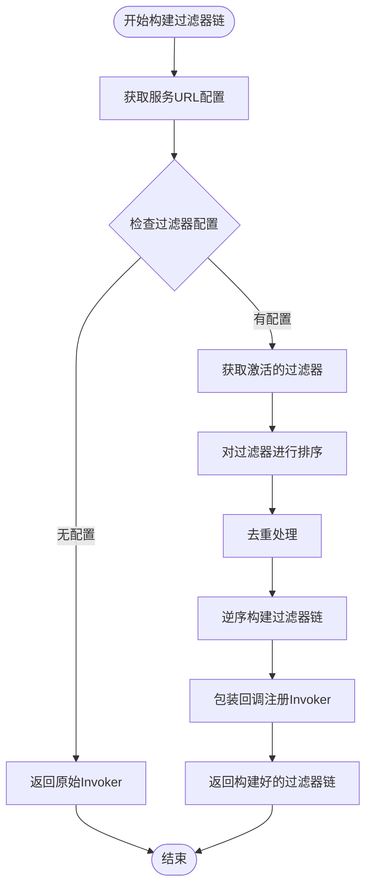
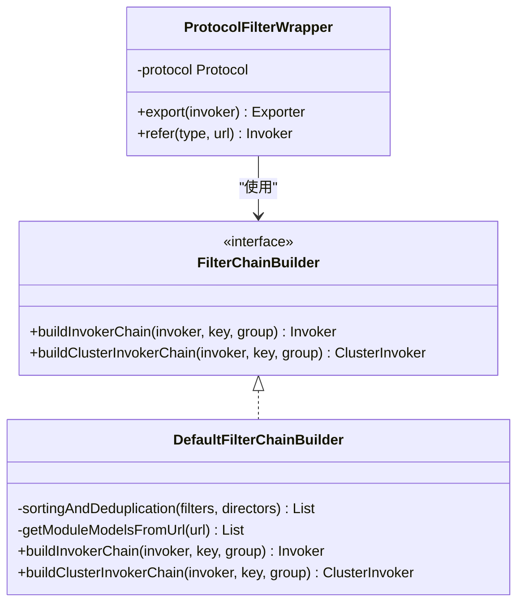
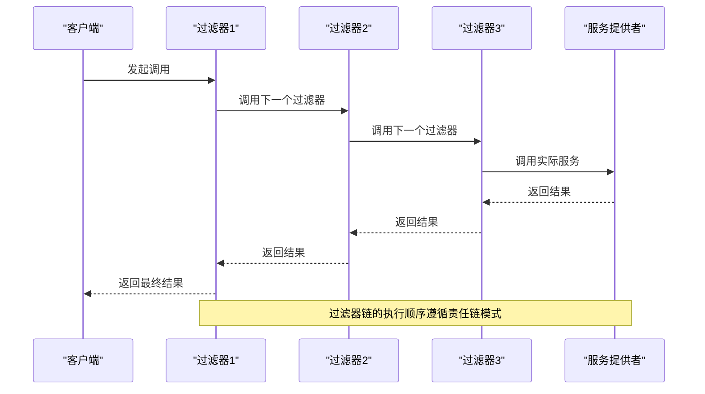
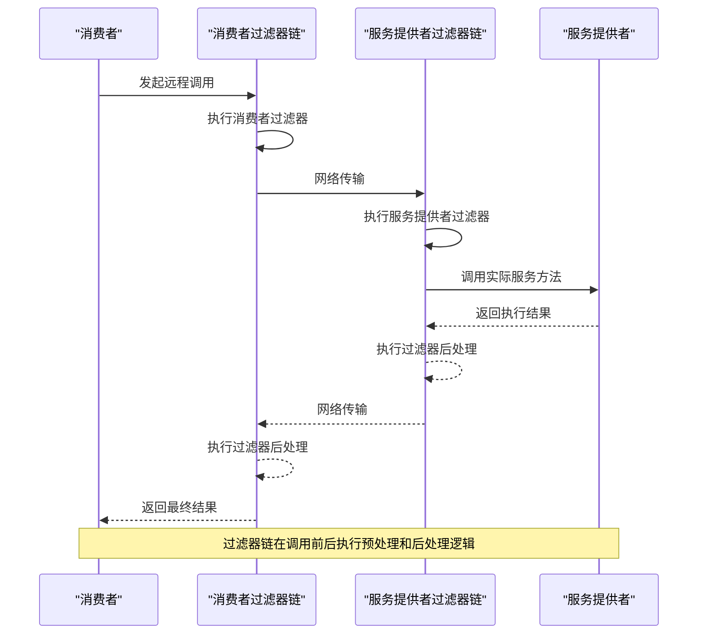
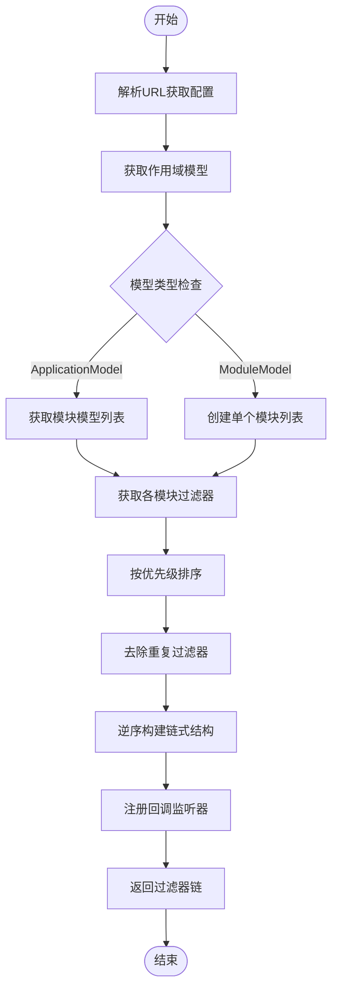
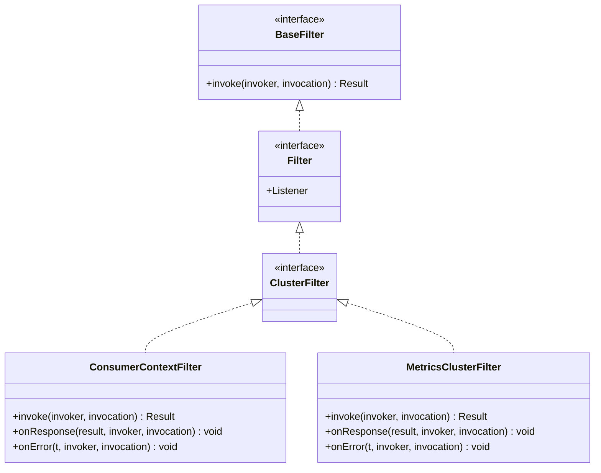
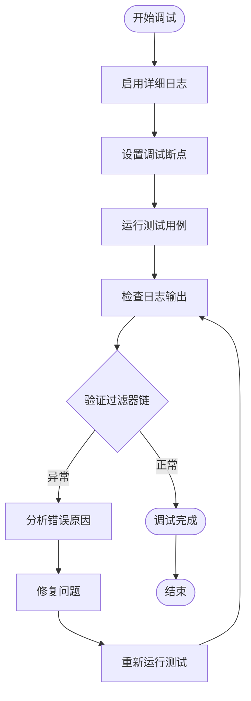

# 过滤器链机制

<cite>
**本文档引用的文件**  
- [FilterChainBuilder.java](file://dubbo-cluster/src/main/java/org/apache/dubbo/rpc/cluster/filter/FilterChainBuilder.java)
- [DefaultFilterChainBuilder.java](file://dubbo-cluster/src/main/java/org/apache/dubbo/rpc/cluster/filter/DefaultFilterChainBuilder.java)
- [ProtocolFilterWrapper.java](file://dubbo-cluster/src/main/java/org/apache/dubbo/rpc/cluster/filter/ProtocolFilterWrapper.java)
- [ConsumerContextFilter.java](file://dubbo-cluster/src/main/java/org/apache/dubbo/rpc/cluster/filter/support/ConsumerContextFilter.java)
- [LogFilter.java](file://dubbo-cluster/src/test/java/org/apache/dubbo/rpc/cluster/filter/LogFilter.java)
- [BaseFilter.java](file://dubbo-rpc/dubbo-rpc-api/src/main/java/org/apache/dubbo/rpc/BaseFilter.java)
- [ClusterFilter.java](file://dubbo-rpc/dubbo-rpc-api/src/main/java/org/apache/dubbo/rpc/cluster/filter/ClusterFilter.java)
- [MetricsClusterFilter.java](file://dubbo-metrics/dubbo-metrics-default/src/main/java/org/apache/dubbo/rpc/cluster/filter/support/MetricsClusterFilter.java)
- [DefaultFilterChainBuilderTest.java](file://dubbo-cluster/src/test/java/org/apache/dubbo/rpc/cluster/filter/DefaultFilterChainBuilderTest.java)
</cite>

## 目录
1. [引言](#引言)
2. [过滤器链构建机制](#过滤器链构建机制)
3. [FilterChainBuilder接口实现原理](#filterchainbuilder接口实现原理)
4. [过滤器串联方式与执行顺序控制](#过滤器串联方式与执行顺序控制)
5. [过滤器链调用时序图](#过滤器链调用时序图)
6. [过滤器链动态组装机制](#过滤器链动态组装机制)
7. [过滤器链使用示例](#过滤器链使用示例)
8. [性能监控与调试方法](#性能监控与调试方法)
9. [结论](#结论)

## 引言

过滤器链机制是Dubbo框架中用于在服务调用过程中插入自定义逻辑的核心组件。通过过滤器链，开发者可以在不修改业务代码的情况下，实现日志记录、性能监控、安全验证等功能。本文档将深入分析过滤器链的构建过程、执行机制和实际应用，为开发者提供全面的技术指导。

## 过滤器链构建机制

过滤器链的构建是通过`FilterChainBuilder`接口实现的。该接口定义了构建消费者和服务提供者过滤器链的方法。在Dubbo中，`DefaultFilterChainBuilder`是`FilterChainBuilder`的默认实现，负责根据配置自动构建过滤器链。

过滤器链的构建过程始于`ProtocolFilterWrapper`类，该类在导出服务和引用服务时调用`FilterChainBuilder`的`buildInvokerChain`方法。构建过程会根据URL中的配置参数，从SPI扩展机制中获取激活的过滤器，并按照指定顺序组装成链式结构。



**Diagram sources**
- [DefaultFilterChainBuilder.java](file://dubbo-cluster/src/main/java/org/apache/dubbo/rpc/cluster/filter/DefaultFilterChainBuilder.java#L43-L77)
- [ProtocolFilterWrapper.java](file://dubbo-cluster/src/main/java/org/apache/dubbo/rpc/cluster/filter/ProtocolFilterWrapper.java#L57-L72)

**Section sources**
- [FilterChainBuilder.java](file://dubbo-cluster/src/main/java/org/apache/dubbo/rpc/cluster/filter/FilterChainBuilder.java#L43-L48)
- [DefaultFilterChainBuilder.java](file://dubbo-cluster/src/main/java/org/apache/dubbo/rpc/cluster/filter/DefaultFilterChainBuilder.java#L38-L150)

## FilterChainBuilder接口实现原理

`FilterChainBuilder`接口是过滤器链构建的核心，它定义了两个主要方法：`buildInvokerChain`用于构建普通过滤器链，`buildClusterInvokerChain`用于构建集群过滤器链。该接口通过SPI机制扩展，允许自定义过滤器链构建逻辑。

`DefaultFilterChainBuilder`作为默认实现，其核心原理是利用Dubbo的扩展机制，根据URL参数获取激活的过滤器列表。构建过程中，首先从URL中提取模块模型，然后根据模块模型获取对应的过滤器扩展。对于多模块场景，会进行排序和去重处理，确保过滤器链的正确性。



**Diagram sources**
- [FilterChainBuilder.java](file://dubbo-cluster/src/main/java/org/apache/dubbo/rpc/cluster/filter/FilterChainBuilder.java#L43-L48)
- [DefaultFilterChainBuilder.java](file://dubbo-cluster/src/main/java/org/apache/dubbo/rpc/cluster/filter/DefaultFilterChainBuilder.java#L38-L150)
- [ProtocolFilterWrapper.java](file://dubbo-cluster/src/main/java/org/apache/dubbo/rpc/cluster/filter/ProtocolFilterWrapper.java#L36-L85)

**Section sources**
- [FilterChainBuilder.java](file://dubbo-cluster/src/main/java/org/apache/dubbo/rpc/cluster/filter/FilterChainBuilder.java#L43-L48)
- [DefaultFilterChainBuilder.java](file://dubbo-cluster/src/main/java/org/apache/dubbo/rpc/cluster/filter/DefaultFilterChainBuilder.java#L38-L150)

## 过滤器串联方式与执行顺序控制

过滤器链采用责任链模式进行串联，每个过滤器都持有下一个过滤器的引用，形成一个链式结构。在构建过程中，过滤器按照逆序方式添加，即最后一个配置的过滤器最先执行。这种设计确保了过滤器的执行顺序与配置顺序一致。

执行顺序控制通过`Activate`注解实现，该注解支持`order`属性和`group`属性。`order`属性定义了过滤器的优先级，数值越小优先级越高；`group`属性定义了过滤器的应用场景，如消费者端或服务提供者端。在构建过滤器链时，系统会根据这些属性对过滤器进行排序。



**Diagram sources**
- [FilterChainBuilder.java](file://dubbo-cluster/src/main/java/org/apache/dubbo/rpc/cluster/filter/FilterChainBuilder.java#L61-L154)
- [DefaultFilterChainBuilder.java](file://dubbo-cluster/src/main/java/org/apache/dubbo/rpc/cluster/filter/DefaultFilterChainBuilder.java#L68-L72)

**Section sources**
- [FilterChainBuilder.java](file://dubbo-cluster/src/main/java/org/apache/dubbo/rpc/cluster/filter/FilterChainBuilder.java#L61-L154)
- [ConsumerContextFilter.java](file://dubbo-cluster/src/main/java/org/apache/dubbo/rpc/cluster/filter/support/ConsumerContextFilter.java#L52-L53)

## 过滤器链调用时序图

从客户端请求到服务端处理再到响应返回的完整调用链路如下所示。该时序图展示了过滤器链在Dubbo调用过程中的作用位置和执行流程。



**Diagram sources**
- [ProtocolFilterWrapper.java](file://dubbo-cluster/src/main/java/org/apache/dubbo/rpc/cluster/filter/ProtocolFilterWrapper.java#L53-L72)
- [FilterChainBuilder.java](file://dubbo-cluster/src/main/java/org/apache/dubbo/rpc/cluster/filter/FilterChainBuilder.java#L92-L118)

**Section sources**
- [ProtocolFilterWrapper.java](file://dubbo-cluster/src/main/java/org/apache/dubbo/rpc/cluster/filter/ProtocolFilterWrapper.java#L53-L72)
- [DefaultFilterChainBuilder.java](file://dubbo-cluster/src/main/java/org/apache/dubbo/rpc/cluster/filter/DefaultFilterChainBuilder.java#L43-L77)

## 过滤器链动态组装机制

过滤器链的动态组装机制基于Dubbo的SPI扩展机制和URL配置参数。系统根据URL中的`reference.filter`或`service.filter`参数来确定需要激活的过滤器。如果没有显式配置，则根据`Activate`注解的条件自动激活符合条件的过滤器。

动态组装过程包括以下几个步骤：首先解析URL获取模块模型，然后根据模块模型获取对应的过滤器扩展实例，接着对过滤器进行排序和去重处理，最后逆序构建过滤器链。这种机制使得过滤器链能够根据不同的应用场景和配置动态调整。



**Diagram sources**
- [DefaultFilterChainBuilder.java](file://dubbo-cluster/src/main/java/org/apache/dubbo/rpc/cluster/filter/DefaultFilterChainBuilder.java#L47-L65)
- [FilterChainBuilder.java](file://dubbo-cluster/src/main/java/org/apache/dubbo/rpc/cluster/filter/FilterChainBuilder.java#L184-L277)

**Section sources**
- [DefaultFilterChainBuilder.java](file://dubbo-cluster/src/main/java/org/apache/dubbo/rpc/cluster/filter/DefaultFilterChainBuilder.java#L47-L65)
- [FilterChainBuilder.java](file://dubbo-cluster/src/main/java/org/apache/dubbo/rpc/cluster/filter/FilterChainBuilder.java#L184-L277)

## 过滤器链使用示例

### 简单过滤器链示例

以下是一个简单的过滤器实现示例，展示了如何创建一个基本的过滤器：

```java
@Activate(group = CONSUMER, value = "log")
public class LogFilter implements Filter, Filter.Listener {
    
    @Override
    public Result invoke(Invoker<?> invoker, Invocation invocation) throws RpcException {
        // 调用前处理
        System.out.println("开始调用: " + invocation.getMethodName());
        
        // 调用下一个过滤器或服务
        Result result = invoker.invoke(invocation);
        
        // 返回结果处理
        return result;
    }
    
    @Override
    public void onResponse(Result appResponse, Invoker<?> invoker, Invocation invocation) {
        System.out.println("调用成功: " + invocation.getMethodName());
    }
    
    @Override
    public void onError(Throwable t, Invoker<?> invoker, Invocation invocation) {
        System.out.println("调用失败: " + invocation.getMethodName() + ", 错误: " + t.getMessage());
    }
}
```

**Section sources**
- [LogFilter.java](file://dubbo-cluster/src/test/java/org/apache/dubbo/rpc/cluster/filter/LogFilter.java#L28-L42)

### 复杂多层过滤器链优化指南

对于复杂的多层过滤器链，建议遵循以下优化原则：

1. **合理设置执行顺序**：通过`order`属性精确控制过滤器的执行顺序，确保关键过滤器优先执行。
2. **避免过度嵌套**：过多的过滤器会增加调用开销，应定期审查和优化过滤器链。
3. **异步处理耗时操作**：对于日志记录、监控等耗时操作，考虑使用异步方式处理。
4. **缓存过滤器实例**：避免重复创建过滤器实例，提高性能。
5. **异常处理机制**：为每个过滤器实现完善的异常处理，防止异常中断整个调用链。



**Diagram sources**
- [BaseFilter.java](file://dubbo-rpc/dubbo-rpc-api/src/main/java/org/apache/dubbo/rpc/BaseFilter.java#L19-L55)
- [ConsumerContextFilter.java](file://dubbo-cluster/src/main/java/org/apache/dubbo/rpc/cluster/filter/support/ConsumerContextFilter.java#L53-L153)
- [MetricsClusterFilter.java](file://dubbo-metrics/dubbo-metrics-default/src/main/java/org/apache/dubbo/rpc/cluster/filter/support/MetricsClusterFilter.java#L38-L89)

**Section sources**
- [BaseFilter.java](file://dubbo-rpc/dubbo-rpc-api/src/main/java/org/apache/dubbo/rpc/BaseFilter.java#L19-L55)
- [ConsumerContextFilter.java](file://dubbo-cluster/src/main/java/org/apache/dubbo/rpc/cluster/filter/support/ConsumerContextFilter.java#L53-L153)

## 性能监控与调试方法

### 性能监控

过滤器链的性能监控可以通过以下几种方式实现：

1. **内置监控过滤器**：使用`MetricsClusterFilter`等内置过滤器收集调用指标。
2. **自定义监控**：在过滤器中添加性能计时逻辑，记录关键路径的执行时间。
3. **集成外部监控系统**：将过滤器链的监控数据上报到Prometheus、Zipkin等外部监控系统。

### 调试方法

调试过滤器链的有效方法包括：

1. **日志跟踪**：在过滤器的关键位置添加详细的日志输出，跟踪执行流程。
2. **断点调试**：在IDE中设置断点，逐步跟踪过滤器链的执行过程。
3. **配置验证**：通过单元测试验证过滤器链的配置是否正确生效。
4. **动态调整**：利用Dubbo的动态配置功能，实时调整过滤器链配置进行测试。



**Diagram sources**
- [DefaultFilterChainBuilderTest.java](file://dubbo-cluster/src/test/java/org/apache/dubbo/rpc/cluster/filter/DefaultFilterChainBuilderTest.java#L35-L107)
- [MetricsClusterFilter.java](file://dubbo-metrics/dubbo-metrics-default/src/main/java/org/apache/dubbo/rpc/cluster/filter/support/MetricsClusterFilter.java#L56-L68)

**Section sources**
- [DefaultFilterChainBuilderTest.java](file://dubbo-cluster/src/test/java/org/apache/dubbo/rpc/cluster/filter/DefaultFilterChainBuilderTest.java#L35-L107)
- [MetricsClusterFilter.java](file://dubbo-metrics/dubbo-metrics-default/src/main/java/org/apache/dubbo/rpc/cluster/filter/support/MetricsClusterFilter.java#L56-L68)

## 结论

过滤器链机制是Dubbo框架中实现横切关注点的核心技术。通过`FilterChainBuilder`接口和`DefaultFilterChainBuilder`实现，Dubbo提供了灵活而强大的过滤器链构建能力。开发者可以利用这一机制，在不侵入业务代码的情况下，实现日志记录、性能监控、安全验证等多种功能。

理解过滤器链的构建过程、执行顺序控制和动态组装机制，对于优化Dubbo应用的性能和可维护性至关重要。通过合理设计过滤器链，可以有效提升系统的可观测性和稳定性。同时，掌握性能监控和调试方法，有助于快速定位和解决过滤器链相关的问题。