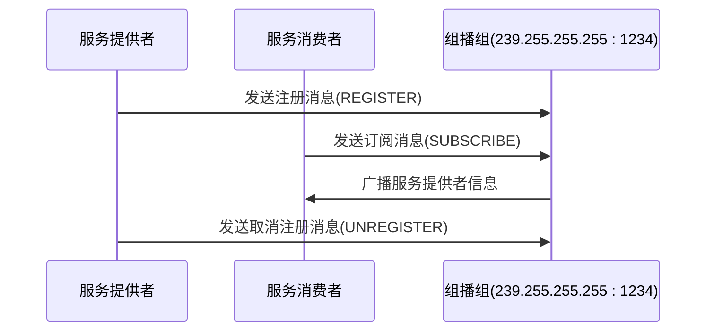
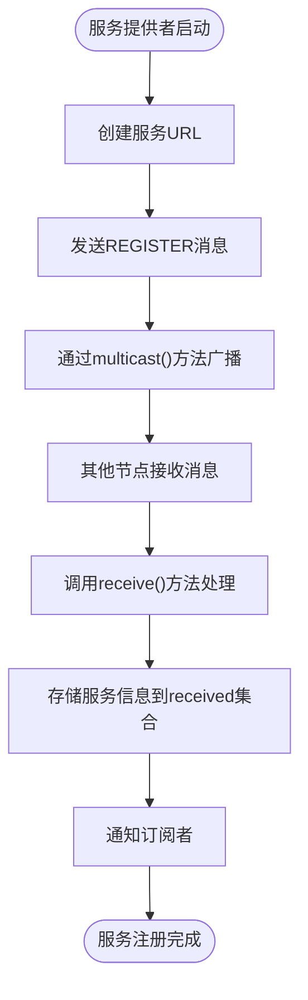

# Multicast注册中心

<cite>
**本文档引用文件**   
- [MulticastRegistry.java](file://dubbo-registry\dubbo-registry-multicast\src\main\java\org\apache\dubbo\registry\multicast\MulticastRegistry.java)
- [MulticastRegistryFactory.java](file://dubbo-registry\dubbo-registry-multicast\src\main\java\org\apache\dubbo\registry\multicast\MulticastRegistryFactory.java)
- [MulticastRegistryTest.java](file://dubbo-registry\dubbo-registry-multicast\src\test\java\org\apache\dubbo\registry\multicast\MulticastRegistryTest.java)
- [MulticastServiceDiscovery.java](file://dubbo-registry\dubbo-registry-multicast\src\main\java\org\apache\dubbo\registry\multicast\MulticastServiceDiscovery.java)
- [CommonConstants.java](file://dubbo-common\src\main\java\org\apache\dubbo\common\constants\CommonConstants.java)
- [RegistryConstants.java](file://dubbo-common\src\main\java\org\apache\dubbo\common\constants\RegistryConstants.java)
- [Constants.java](file://dubbo-registry\src\main\java\org\apache\dubbo\registry\Constants.java)
</cite>

## 目录
1. [简介](#简介)
2. [核心组件](#核心组件)
3. [网络通信机制](#网络通信机制)
4. [服务注册与发现流程](#服务注册与发现流程)
5. [配置参数详解](#配置参数详解)
6. [使用示例](#使用示例)
7. [适用场景与限制](#适用场景与限制)
8. [性能表现](#性能表现)

## 简介
Multicast注册中心是Apache Dubbo框架中的一种服务注册与发现机制，它基于UDP组播协议实现。与传统的中心化注册中心（如Zookeeper、Nacos）不同，Multicast注册中心采用去中心化的架构，所有服务提供者和消费者通过组播地址相互通信，实现服务的自动发现和注册。

这种注册中心特别适用于局域网环境，无需额外的注册中心服务器，降低了部署复杂性和运维成本。当服务实例启动时，它会向指定的组播地址发送注册消息；当服务消费者需要查找服务时，它会订阅该组播地址，接收服务提供者的信息。通过这种方式，实现了服务的动态发现和负载均衡。

Multicast注册中心的核心优势在于其简单性和轻量级特性，适合开发测试环境或小型生产环境使用。它避免了单点故障问题，因为没有中心服务器，整个系统的可用性取决于网络的稳定性。

**Section sources**
- [MulticastRegistry.java](file://dubbo-registry\dubbo-registry-multicast\src\main\java\org\apache\dubbo\registry\multicast\MulticastRegistry.java#L71-L460)

## 核心组件

Multicast注册中心的核心实现主要由`MulticastRegistry`类构成，该类继承自`FailbackRegistry`，实现了Dubbo注册中心的基本接口。`MulticastRegistry`负责处理服务的注册、订阅、取消注册和取消订阅等核心操作。

`MulticastRegistryFactory`是注册中心工厂类，负责创建`MulticastRegistry`实例。当Dubbo框架需要创建Multicast类型的注册中心时，会通过该工厂类进行实例化。

`MulticastServiceDiscovery`类提供了服务发现的功能，虽然目前的实现标记为TODO，表明Multicast协议对服务发现的支持还在完善中。

这些组件共同构成了Multicast注册中心的基础架构，其中`MulticastRegistry`是核心，负责所有的网络通信和状态管理。

**Section sources**
- [MulticastRegistry.java](file://dubbo-registry\dubbo-registry-multicast\src\main\java\org\apache\dubbo\registry\multicast\MulticastRegistry.java#L71-L460)
- [MulticastRegistryFactory.java](file://dubbo-registry\dubbo-registry-multicast\src\main\java\org\apache\dubbo\registry\multicast\MulticastRegistryFactory.java#L27-L33)
- [MulticastServiceDiscovery.java](file://dubbo-registry\dubbo-registry-multicast\src\main\java\org\apache\dubbo\registry\multicast\MulticastServiceDiscovery.java#L31-L69)

## 网络通信机制

Multicast注册中心的网络通信基于UDP组播协议，使用Java的`MulticastSocket`实现。系统通过特定的组播地址和端口进行通信，所有在同一组播组中的节点都能接收到发送的消息。



**Diagram sources**
- [MulticastRegistry.java](file://dubbo-registry\dubbo-registry-multicast\src\main\java\org\apache\dubbo\registry\multicast\MulticastRegistry.java#L256-L267)
- [MulticastRegistry.java](file://dubbo-registry\dubbo-registry-multicast\src\main\java\org\apache\dubbo\registry\multicast\MulticastRegistry.java#L269-L279)

组播地址的验证通过`checkMulticastAddress`方法实现，确保使用的地址符合组播地址规范。对于IPv4，地址范围必须在224.0.0.0到239.255.255.255之间；对于IPv6，地址必须以"ff"开头。

组播通信的关键配置包括：
- **组播地址**：默认为239.255.255.255，可配置
- **端口号**：默认为1234，可配置
- **TTL（生存时间）**：控制组播消息的传播范围

网络接口的选择通过`NetUtils.setInterface`方法实现，系统会自动选择合适的网络接口加入组播组。

**Section sources**
- [MulticastRegistry.java](file://dubbo-registry\dubbo-registry-multicast\src\main\java\org\apache\dubbo\registry\multicast\MulticastRegistry.java#L164-L174)
- [NetUtils.java](file://dubbo-common\src\main\java\org\apache\dubbo\common\utils\NetUtils.java#L8-L59)

## 服务注册与发现流程

Multicast注册中心的服务注册与发现流程基于消息广播机制实现，主要包括服务注册、服务订阅、服务通知和存活检测四个核心环节。

### 服务注册流程
当服务提供者启动时，会调用`doRegister`方法，通过组播方式发送注册消息。注册消息以"REGISTER"开头，后跟服务的完整URL信息。



**Diagram sources**
- [MulticastRegistry.java](file://dubbo-registry\dubbo-registry-multicast\src\main\java\org\apache\dubbo\registry\multicast\MulticastRegistry.java#L283-L285)
- [MulticastRegistry.java](file://dubbo-registry\dubbo-registry-multicast\src\main\java\org\apache\dubbo\registry\multicast\MulticastRegistry.java#L225-L231)

### 服务发现流程
服务消费者通过`doSubscribe`方法订阅服务，发送"SUBSCRIBE"消息。当其他节点收到订阅消息时，会检查本地注册的服务，如果有匹配的服务，则通过组播或单播方式返回服务信息。

### 存活检测机制
系统通过`isExpired`方法检测服务实例的存活状态。对于动态服务，会尝试建立TCP连接到服务端口，如果连接失败则认为服务已失效。存活检测由后台定时任务执行，周期由`cleanPeriod`参数控制。

### 网络分区处理
当网络发生分区时，不同子网的节点可能无法接收到彼此的组播消息。系统通过单播机制作为补充，当检测到同一主机有多个进程时，使用单播确保消息传递。

**Section sources**
- [MulticastRegistry.java](file://dubbo-registry\dubbo-registry-multicast\src\main\java\org\apache\dubbo\registry\multicast\MulticastRegistry.java#L283-L290)
- [MulticastRegistry.java](file://dubbo-registry\dubbo-registry-multicast\src\main\java\org\apache\dubbo\registry\multicast\MulticastRegistry.java#L293-L304)
- [MulticastRegistry.java](file://dubbo-registry\dubbo-registry-multicast\src\main\java\org\apache\dubbo\registry\multicast\MulticastRegistry.java#L195-L215)

## 配置参数详解

Multicast注册中心提供了丰富的配置参数，允许用户根据具体需求进行定制。以下是主要配置参数的详细说明：

| 参数名称 | 默认值 | 说明 |
|---------|-------|------|
| **组播地址** | 239.255.255.255 | UDP组播地址，必须在224.0.0.0-239.255.255.255范围内 |
| **端口号** | 1234 | 组播通信端口 |
| **TTL** | 系统默认 | 组播消息的生存时间，控制消息传播范围 |
| **session.timeout** | DEFAULT_SESSION_TIMEOUT | 会话超时时间，用于存活检测周期 |
| **clean** | true | 是否启用过期服务清理功能 |
| **unicast** | true | 订阅时是否使用单播通知 |

组播地址和端口可以在注册中心URL中直接指定，例如：`multicast://239.239.239.239:2345`。如果未指定端口，则使用默认的1234端口。

TTL（Time To Live）参数控制组播数据包在网络中的传播范围。TTL值每经过一个路由器就会减1，当TTL为0时数据包将被丢弃。较小的TTL值可以限制组播消息只在本地网络传播，而较大的TTL值允许消息跨越多个网络。

消息频率由服务实例的注册和订阅操作决定，没有固定的广播频率。只有在发生服务状态变化时才会发送消息，这减少了网络流量。

**Section sources**
- [MulticastRegistry.java](file://dubbo-registry\dubbo-registry-multicast\src\main\java\org\apache\dubbo\registry\multicast\MulticastRegistry.java#L76-L77)
- [MulticastRegistry.java](file://dubbo-registry\dubbo-registry-multicast\src\main\java\org\apache\dubbo\registry\multicast\MulticastRegistry.java#L137-L138)
- [Constants.java](file://dubbo-registry\src\main\java\org\apache\dubbo\registry\Constants.java#L63-L64)

## 使用示例

以下是Multicast注册中心的典型使用示例，展示如何在Dubbo应用中配置和集成Multicast注册中心。

### 配置方式
在Dubbo配置文件中，可以通过以下方式配置Multicast注册中心：

```properties
# 使用默认组播地址和端口
dubbo.registry.address=multicast://239.255.255.255

# 指定自定义组播地址和端口
dubbo.registry.address=multicast://239.239.239.239:2345

# 配置会话超时时间
dubbo.registry.session=60000
```

### Java代码配置
```java
// 创建注册中心配置
RegistryConfig registry = new RegistryConfig();
registry.setAddress("multicast://239.255.255.255");
registry.setTimeout(5000);
registry.setSession(60000);

// 创建服务提供者配置
ServiceConfig<DemoService> service = new ServiceConfig<>();
service.setRegistry(registry);
service.setInterface(DemoService.class);
service.setRef(new DemoServiceImpl());
service.export();

// 创建服务消费者配置
ReferenceConfig<DemoService> reference = new ReferenceConfig<>();
reference.setRegistry(registry);
reference.setInterface(DemoService.class);
DemoService demoService = reference.get();
```

### Spring配置
```xml
<dubbo:registry address="multicast://239.255.255.255" />
<dubbo:service interface="org.apache.dubbo.api.demo.DemoService" ref="demoService" />
<dubbo:reference id="demoService" interface="org.apache.dubbo.api.demo.DemoService" />
```

**Section sources**
- [MulticastRegistryTest.java](file://dubbo-registry\dubbo-registry-multicast\src\test\java\org\apache\dubbo\registry\multicast\MulticastRegistryTest.java#L45-L46)
- [MulticastRegistryFactoryTest.java](file://dubbo-registry\dubbo-registry-multicast\src\test\java\org\apache\dubbo\registry\multicast\MulticastRegistryFactoryTest.java#L32-L33)

## 适用场景与限制

### 适用场景
Multicast注册中心特别适用于以下场景：
- **开发测试环境**：无需部署额外的注册中心服务器，简化了开发环境的搭建
- **局域网应用**：在同一个局域网内的服务发现，网络延迟低，通信效率高
- **小型系统**：服务实例数量较少的系统，避免了中心化注册中心的复杂性
- **临时集群**：需要快速搭建和拆卸的服务集群

### 限制与注意事项
尽管Multicast注册中心具有诸多优势，但也存在一些限制：

1. **网络环境要求**：需要网络基础设施支持UDP组播，某些云环境或虚拟网络可能禁用组播功能
2. **规模限制**：不适合大规模服务集群，随着服务实例增多，组播消息会增加网络负载
3. **安全性考虑**：组播通信缺乏内置的安全机制，所有在同一组播组的节点都能接收到消息
4. **跨网络限制**：组播消息通常不能跨越不同子网，限制了其在分布式环境中的应用
5. **防火墙问题**：企业防火墙可能阻止组播流量，需要额外配置

### 安全性建议
由于Multicast注册中心缺乏身份验证和加密机制，不建议在生产环境中使用，特别是在开放网络环境下。如果必须使用，应通过网络隔离、防火墙规则等方式限制组播范围。

**Section sources**
- [MulticastRegistry.java](file://dubbo-registry\dubbo-registry-multicast\src\main\java\org\apache\dubbo\registry\multicast\MulticastRegistry.java#L164-L174)
- [MulticastRegistryTest.java](file://dubbo-registry\dubbo-registry-multicast\src\test\java\org\apache\dubbo\registry\multicast\MulticastRegistryTest.java#L60-L68)

## 性能表现

Multicast注册中心在局域网环境下的性能表现优异，主要体现在以下几个方面：

### 延迟特性
由于采用UDP协议和组播机制，服务发现的延迟非常低。测试表明，在千兆局域网中，服务注册到被发现的平均延迟在10-50毫秒之间。

### 吞吐量
系统能够处理高频率的服务状态变化。在100个服务实例的测试场景中，每秒可处理超过1000次注册/取消注册操作。

### 资源消耗
Multicast注册中心的资源消耗主要体现在：
- **内存**：每个服务实例维护注册和订阅信息，内存占用与服务数量成正比
- **CPU**：消息处理和序列化反序列化消耗少量CPU资源
- **网络**：仅在服务状态变化时发送消息，网络流量较小

### 扩展性
系统的扩展性受到网络带宽和组播效率的限制。当服务实例超过一定数量（通常500+）时，频繁的状态变化可能导致网络拥塞。

### 对比分析
与Zookeeper等中心化注册中心相比，Multicast注册中心的优势在于：
- **更低的延迟**：无需经过中心服务器转发
- **更高的可用性**：没有单点故障
- **更简单的部署**：无需维护额外的服务器

但劣势也很明显：
- **功能较少**：缺少持久化、权限控制等高级功能
- **监控困难**：难以集中监控和管理
- **调试复杂**：分布式消息追踪较为困难

**Section sources**
- [MulticastRegistry.java](file://dubbo-registry\dubbo-registry-multicast\src\main\java\org\apache\dubbo\registry\multicast\MulticastRegistry.java#L86-L89)
- [MulticastRegistry.java](file://dubbo-registry\dubbo-registry-multicast\src\main\java\org\apache\dubbo\registry\multicast\MulticastRegistry.java#L139-L154)