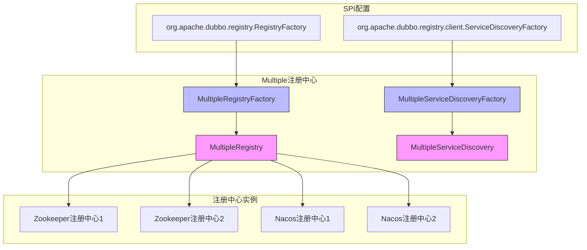
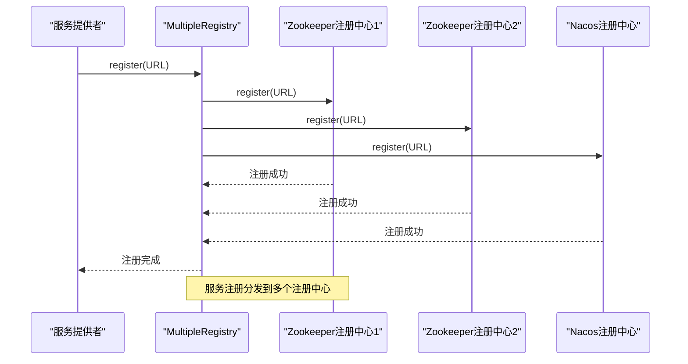
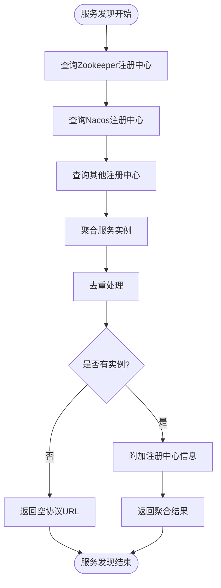
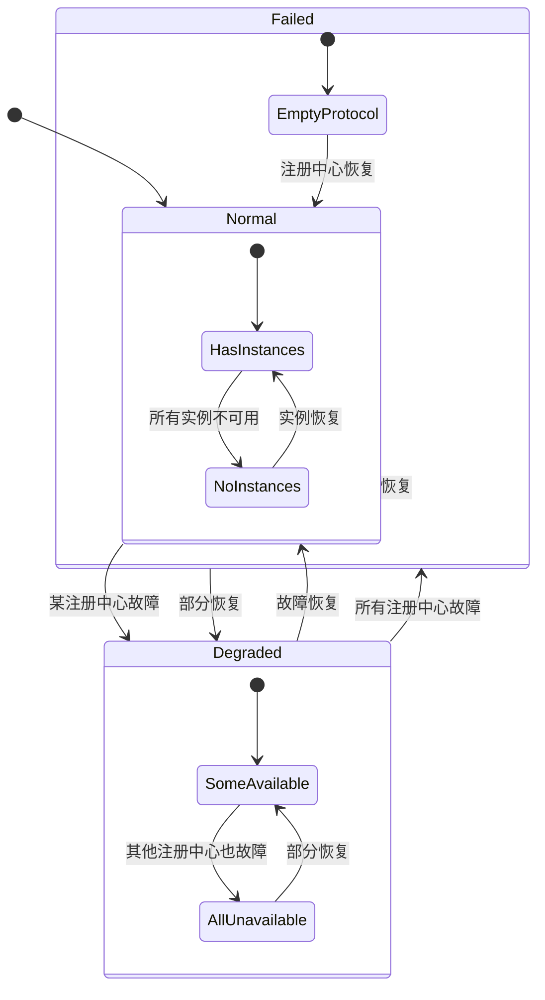

# Multiple注册中心

<cite>
**本文档引用的文件**   
- [MultipleRegistry.java](file://dubbo-registry\dubbo-registry-multiple\src\main\java\org\apache\dubbo\registry\multiple\MultipleRegistry.java)
- [MultipleRegistryFactory.java](file://dubbo-registry\dubbo-registry-multiple\src\main\java\org\apache\dubbo\registry\multiple\MultipleRegistryFactory.java)
- [MultipleServiceDiscovery.java](file://dubbo-registry\dubbo-registry-multiple\src\main\java\org\apache\dubbo\registry\multiple\MultipleServiceDiscovery.java)
- [MultipleServiceDiscoveryFactory.java](file://dubbo-registry\dubbo-registry-multiple\src\main\java\org\apache\dubbo\registry\multiple\MultipleServiceDiscoveryFactory.java)
- [org.apache.dubbo.registry.RegistryFactory](file://dubbo-registry\dubbo-registry-multiple\src\main\resources\META-INF\dubbo\internal\org.apache.dubbo.registry.RegistryFactory)
- [org.apache.dubbo.registry.client.ServiceDiscoveryFactory](file://dubbo-registry\dubbo-registry-multiple\src\main\resources\META-INF\dubbo\internal\org.apache.dubbo.registry.client.ServiceDiscoveryFactory)
- [MultipleRegistry2S2RTest.java](file://dubbo-registry\dubbo-registry-multiple\src\test\java\org\apache\dubbo\registry\multiple\MultipleRegistry2S2RTest.java)
- [MultipleRegistryTestUtil.java](file://dubbo-registry\dubbo-registry-multiple\src\test\java\org\apache\dubbo\registry\multiple\MultipleRegistryTestUtil.java)
- [RegistryConstants.java](file://dubbo-common\src\main\java\org\apache\dubbo\common\constants\RegistryConstants.java)
</cite>

## 目录
1. [简介](#简介)
2. [核心组件](#核心组件)
3. [架构设计](#架构设计)
4. [服务注册分发机制](#服务注册分发机制)
5. [服务发现聚合机制](#服务发现聚合机制)
6. [配置参数详解](#配置参数详解)
7. [使用示例](#使用示例)
8. [应用场景](#应用场景)
9. [故障转移与空保护](#故障转移与空保护)

## 简介

Multiple注册中心是Dubbo框架中一种高级的注册中心实现，它允许同时连接和管理多个不同类型的注册中心。这种设计模式为微服务架构提供了更高的灵活性和可靠性，特别是在跨数据中心部署、注册中心迁移和高可用架构等复杂场景下。Multiple注册中心通过聚合多个注册中心的功能，实现了服务注册的分发和服务发现的聚合，从而确保了服务治理的连续性和稳定性。

Multiple注册中心的核心思想是将多个物理上独立的注册中心逻辑上组合成一个统一的注册中心实体。这种设计不仅能够实现服务的多活部署，还能在某个注册中心出现故障时自动进行故障转移，保证服务的持续可用。同时，Multiple注册中心还支持对不同注册中心设置不同的优先级和路由策略，以满足不同业务场景的需求。

**本节来源**
- [MultipleRegistry.java](file://dubbo-registry\dubbo-registry-multiple\src\main\java\org\apache\dubbo\registry\multiple\MultipleRegistry.java#L1-L50)

## 核心组件

Multiple注册中心的核心实现主要由以下几个关键组件构成：

1. **MultipleRegistry类**：这是Multiple注册中心的主要实现类，继承自AbstractRegistry，负责管理多个注册中心的生命周期、服务注册和订阅等功能。

2. **MultipleRegistryFactory类**：作为MultipleRegistry的工厂类，负责创建MultipleRegistry实例，并通过SPI机制注册到Dubbo框架中。

3. **MultipleServiceDiscovery类**：实现了ServiceDiscovery接口，负责管理多个服务发现实例，提供统一的服务发现功能。

4. **MultipleServiceDiscoveryFactory类**：作为MultipleServiceDiscovery的工厂类，负责创建MultipleServiceDiscovery实例。

这些组件共同构成了Multiple注册中心的基础架构，通过合理的职责划分和协作，实现了对多个注册中心的统一管理和操作。

**本节来源**
- [MultipleRegistry.java](file://dubbo-registry\dubbo-registry-multiple\src\main\java\org\apache\dubbo\registry\multiple\MultipleRegistry.java#L43-L56)
- [MultipleRegistryFactory.java](file://dubbo-registry\dubbo-registry-multiple\src\main\java\org\apache\dubbo\registry\multiple\MultipleRegistryFactory.java#L23-L30)
- [MultipleServiceDiscovery.java](file://dubbo-registry\dubbo-registry-multiple\src\main\java\org\apache\dubbo\registry\multiple\MultipleServiceDiscovery.java#L40-L48)
- [MultipleServiceDiscoveryFactory.java](file://dubbo-registry\dubbo-registry-multiple\src\main\java\org\apache\dubbo\registry\multiple\MultipleServiceDiscoveryFactory.java#L23-L29)

## 架构设计

Multiple注册中心的架构设计采用了聚合模式，将多个独立的注册中心实例聚合为一个逻辑上的统一注册中心。其核心架构主要包括以下几个部分：

1. **注册中心管理**：MultipleRegistry维护了两个独立的注册中心映射，分别用于服务提供者注册（serviceRegistries）和服务消费者订阅（referenceRegistries）。这种分离设计使得可以为服务注册和发现配置不同的注册中心集群。

2. **工厂模式**：通过MultipleRegistryFactory和MultipleServiceDiscoveryFactory工厂类，实现了对MultipleRegistry和MultipleServiceDiscovery实例的创建和管理。这些工厂类通过Dubbo的SPI机制进行注册，确保了框架的扩展性。

3. **事件通知机制**：Multiple注册中心实现了复杂的事件通知机制，通过MultipleNotifyListenerWrapper和SingleNotifyListener包装类，将来自多个注册中心的事件通知聚合后统一发送给上层应用。

4. **SPI扩展**：通过在META-INF/dubbo/internal目录下配置SPI文件，将Multiple注册中心的工厂类注册到Dubbo框架中，使其能够被框架自动发现和使用。

这种架构设计不仅保证了Multiple注册中心的功能完整性，还确保了其与Dubbo框架其他组件的良好集成和兼容性。



**图表来源**
- [MultipleRegistry.java](file://dubbo-registry\dubbo-registry-multiple\src\main\java\org\apache\dubbo\registry\multiple\MultipleRegistry.java#L49-L52)
- [MultipleRegistryFactory.java](file://dubbo-registry\dubbo-registry-multiple\src\main\java\org\apache\dubbo\registry\multiple\MultipleRegistryFactory.java#L27-L28)
- [MultipleServiceDiscovery.java](file://dubbo-registry\dubbo-registry-multiple\src\main\java\org\apache\dubbo\registry\multiple\MultipleServiceDiscovery.java#L44-L48)
- [MultipleServiceDiscoveryFactory.java](file://dubbo-registry\dubbo-registry-multiple\src\main\java\org\apache\dubbo\registry\multiple\MultipleServiceDiscoveryFactory.java#L26-L27)
- [org.apache.dubbo.registry.RegistryFactory](file://dubbo-registry\dubbo-registry-multiple\src\main\resources\META-INF\dubbo\internal\org.apache.dubbo.registry.RegistryFactory#L1-L2)
- [org.apache.dubbo.registry.client.ServiceDiscoveryFactory](file://dubbo-registry\dubbo-registry-multiple\src\main\resources\META-INF\dubbo\internal\org.apache.dubbo.registry.client.ServiceDiscoveryFactory#L1-L1)

**本节来源**
- [MultipleRegistry.java](file://dubbo-registry\dubbo-registry-multiple\src\main\java\org\apache\dubbo\registry\multiple\MultipleRegistry.java#L43-L60)
- [MultipleServiceDiscovery.java](file://dubbo-registry\dubbo-registry-multiple\src\main\java\org\apache\dubbo\registry\multiple\MultipleServiceDiscovery.java#L40-L48)

## 服务注册分发机制

Multiple注册中心的服务注册分发机制是其核心功能之一，它确保了服务提供者的信息能够同时注册到配置的多个注册中心中。这一机制的实现主要依赖于MultipleRegistry类的register方法。

当服务提供者调用register方法进行注册时，MultipleRegistry会遍历所有配置的服务注册中心（serviceRegistries），并将服务URL分别注册到每个注册中心实例中。这种并行注册的方式确保了服务信息在多个注册中心之间的一致性。

服务注册分发的关键实现细节包括：

1. **注册中心初始化**：在MultipleRegistry构造时，通过initServiceRegistry方法初始化所有配置的服务注册中心。该方法会解析配置中的REGISTRY_FOR_SERVICE参数，创建对应的注册中心实例，并存储在serviceRegistries映射中。

2. **参数继承**：在创建子注册中心实例时，会继承父注册中心URL的参数，确保配置的一致性。同时，会设置CHECK_KEY参数，控制注册时的检查行为。

3. **并发注册**：服务注册操作会并发地发送到所有配置的注册中心，提高注册效率。如果某个注册中心注册失败，不会影响其他注册中心的注册过程。

4. **注册中心可用性检查**：isAvailable方法会检查所有服务注册中心的可用性，只有当至少有一个注册中心可用时，Multiple注册中心才被认为是可用的。

这种服务注册分发机制为微服务架构提供了重要的高可用保障，即使某个注册中心出现故障，服务仍然可以在其他注册中心正常注册和发现。



**图表来源**
- [MultipleRegistry.java](file://dubbo-registry\dubbo-registry-multiple\src\main\java\org\apache\dubbo\registry\multiple\MultipleRegistry.java#L168-L172)
- [MultipleRegistry.java](file://dubbo-registry\dubbo-registry-multiple\src\main\java\org\apache\dubbo\registry\multiple\MultipleRegistry.java#L91-L107)
- [MultipleRegistry.java](file://dubbo-registry\dubbo-registry-multiple\src\main\java\org\apache\dubbo\registry\multiple\MultipleRegistry.java#L135-L156)

**本节来源**
- [MultipleRegistry.java](file://dubbo-registry\dubbo-registry-multiple\src\main\java\org\apache\dubbo\registry\multiple\MultipleRegistry.java#L168-L180)

## 服务发现聚合机制

Multiple注册中心的服务发现聚合机制是其另一核心功能，它能够从多个注册中心收集服务实例信息，并将其聚合后提供给服务消费者。这一机制通过lookup方法和subscribe方法实现，确保了服务发现的全面性和可靠性。

服务发现聚合的关键实现细节包括：

1. **多注册中心查询**：lookup方法会遍历所有配置的引用注册中心（referenceRegistries），从每个注册中心查询服务实例，然后将结果合并去重后返回。

2. **事件通知聚合**：subscribe方法通过MultipleNotifyListenerWrapper包装类，将来自多个注册中心的事件通知聚合后统一处理。当任何一个注册中心发生服务实例变更时，都会触发聚合通知。

3. **注册中心URL附加**：在聚合服务实例时，可以通过配置"attachments"参数，将注册中心的特定信息附加到服务URL上，便于后续的流量管理和路由决策。

4. **空协议处理**：当所有注册中心都没有可用服务实例时，会返回带有空协议（empty protocol）的URL，通知消费者当前无可用服务。

服务发现聚合机制的实现中，MultipleNotifyListenerWrapper类扮演了关键角色。它维护了一个注册中心到SingleNotifyListener的映射，当收到任何一个注册中心的通知时，会调用notifySourceListener方法，将所有注册中心的服务实例信息聚合后统一通知给上层应用。

这种聚合机制不仅提高了服务发现的可靠性，还为跨注册中心的流量管理提供了基础支持，使得可以根据服务实例的来源进行精细化的路由控制。



**图表来源**
- [MultipleRegistry.java](file://dubbo-registry\dubbo-registry-multiple\src\main\java\org\apache\dubbo\registry\multiple\MultipleRegistry.java#L211-L219)
- [MultipleRegistry.java](file://dubbo-registry\dubbo-registry-multiple\src\main\java\org\apache\dubbo\registry\multiple\MultipleRegistry.java#L184-L193)
- [MultipleRegistry.java](file://dubbo-registry\dubbo-registry-multiple\src\main\java\org\apache\dubbo\registry\multiple\MultipleRegistry.java#L326-L351)
- [MultipleRegistry.java](file://dubbo-registry\dubbo-registry-multiple\src\main\java\org\apache\dubbo\registry\multiple\MultipleRegistry.java#L294-L309)

**本节来源**
- [MultipleRegistry.java](file://dubbo-registry\dubbo-registry-multiple\src\main\java\org\apache\dubbo\registry\multiple\MultipleRegistry.java#L211-L220)
- [MultipleRegistry.java](file://dubbo-registry\dubbo-registry-multiple\src\main\java\org\apache\dubbo\registry\multiple\MultipleRegistry.java#L184-L193)

## 配置参数详解

Multiple注册中心提供了丰富的配置参数，以满足不同场景下的需求。这些参数主要通过URL的查询参数进行配置，以下是关键配置参数的详细说明：

### 核心配置参数

- **service-registry**：指定用于服务注册的注册中心URL列表，多个URL之间用分隔符分隔。这是必填参数，用于定义服务提供者注册的目标注册中心。

- **reference-registry**：指定用于服务发现的注册中心URL列表，多个URL之间用分隔符分隔。这是必填参数，用于定义服务消费者订阅的注册中心。

- **separator**：指定注册中心URL列表的分隔符，默认为逗号（,）。可以根据需要配置为其他字符。

- **default**：布尔值，表示是否为默认注册中心。如果设置为true且未配置service-registry或reference-registry，则会抛出异常。

- **check**：布尔值，控制注册时是否进行检查。如果设置为true，在注册过程中会验证注册中心的可用性。

### 高级配置参数

- **attachments**：附加属性，可以将注册中心的特定信息（如区域、标签等）附加到服务URL上，格式为"key1=value1,key2=value2"。这些信息可用于后续的流量管理和路由决策。

- **enable-empty-protection**：布尔值，控制是否启用空保护机制。如果设置为true，当所有注册中心都没有可用服务实例时，会返回空协议URL。

- **application**：应用程序名称，用于标识注册中心所属的应用。这个参数会继承到所有子注册中心中。

- **registry-type**：注册中心类型，用于区分不同类型的注册中心实例。

这些配置参数可以通过多种方式设置，包括XML配置、注解配置、API编程配置等。在实际使用中，建议根据具体的部署架构和业务需求，合理配置这些参数，以达到最佳的性能和可靠性。

**本节来源**
- [MultipleRegistry.java](file://dubbo-registry\dubbo-registry-multiple\src\main\java\org\apache\dubbo\registry\multiple\MultipleRegistry.java#L46-L48)
- [MultipleRegistry.java](file://dubbo-registry\dubbo-registry-multiple\src\main\java\org\apache\dubbo\registry\multiple\MultipleRegistry.java#L63-L67)
- [MultipleRegistry.java](file://dubbo-registry\dubbo-registry-multiple\src\main\java\org\apache\dubbo\registry\multiple\MultipleRegistry.java#L327-L331)
- [RegistryConstants.java](file://dubbo-common\src\main\java\org\apache\dubbo\common\constants\RegistryConstants.java#L141-L142)

## 使用示例

以下是一个Multiple注册中心的典型使用示例，展示了如何配置和使用Multiple注册中心：

```java
// 创建Multiple注册中心URL
URL multipleRegistryUrl = URL.valueOf("multiple://127.0.0.1?application=myapp&"
    + MultipleRegistry.REGISTRY_FOR_SERVICE 
    + "=zookeeper://192.168.1.100:2181,zookeeper://192.168.1.101:2181&"
    + MultipleRegistry.REGISTRY_FOR_REFERENCE 
    + "=zookeeper://192.168.1.100:2181,zookeeper://192.168.1.101:2181&"
    + "attachments=zone=beijing,env=prod");

// 创建Multiple注册中心实例
RegistryFactory registryFactory = ExtensionLoader.getExtensionLoader(RegistryFactory.class)
    .getAdaptiveExtension();
Registry multipleRegistry = registryFactory.getRegistry(multipleRegistryUrl);

// 服务注册
URL serviceUrl = URL.valueOf("dubbo://192.168.1.200:20880/com.example.DemoService");
multipleRegistry.register(serviceUrl);

// 服务订阅
multipleRegistry.subscribe(serviceUrl, new NotifyListener() {
    @Override
    public void notify(List<URL> urls) {
        // 处理服务实例变更通知
        System.out.println("收到服务实例变更通知，实例数量：" + urls.size());
        for (URL url : urls) {
            System.out.println("服务实例：" + url);
            // 可以通过url.getParameter("zone")获取注册中心附加信息
        }
    }
});

// 服务发现
List<URL> discoveredUrls = multipleRegistry.lookup(serviceUrl);
System.out.println("发现服务实例数量：" + discoveredUrls.size());
```

在Spring配置中，可以这样使用：

```xml
<dubbo:registry id="multipleRegistry" 
                address="multiple://127.0.0.1" 
                protocol="multiple"
                parameters="service-registry=zookeeper://192.168.1.100:2181,zookeeper://192.168.1.101:2181;
                           reference-registry=zookeeper://192.168.1.100:2181,zookeeper://192.168.1.101:2181;
                           attachments=zone=beijing,env=prod" />
```

这个示例展示了Multiple注册中心的基本使用方法，包括注册中心的创建、服务注册、服务订阅和服务发现。通过合理配置，可以实现跨多个注册中心的服务治理。

**本节来源**
- [MultipleRegistry2S2RTest.java](file://dubbo-registry\dubbo-registry-multiple\src\test\java\org\apache\dubbo\registry\multiple\MultipleRegistry2S2RTest.java#L57-L62)
- [MultipleRegistry.java](file://dubbo-registry\dubbo-registry-multiple\src\main\java\org\apache\dubbo\registry\multiple\MultipleRegistry.java#L61-L68)

## 应用场景

Multiple注册中心适用于多种复杂的微服务架构场景，以下是几个典型的应用场景：

### 跨数据中心部署

在跨数据中心的微服务架构中，可以为每个数据中心配置独立的注册中心集群。通过Multiple注册中心，可以将服务同时注册到多个数据中心的注册中心中，实现服务的多活部署。当某个数据中心出现故障时，服务消费者仍然可以从其他数据中心发现和调用服务，确保业务的连续性。

### 注册中心迁移

在进行注册中心技术栈迁移时（如从Zookeeper迁移到Nacos），可以使用Multiple注册中心实现平滑过渡。在过渡期间，将服务同时注册到新旧两个注册中心，确保迁移过程中服务的可用性。待所有服务都稳定运行在新注册中心后，再逐步下线旧注册中心。

### 高可用架构

在对可用性要求极高的生产环境中，可以配置多个不同类型的注册中心（如Zookeeper和Nacos）作为冗余。即使某个注册中心出现故障，其他注册中心仍然可以正常工作，确保服务注册和发现功能的持续可用。

### 多环境管理

在复杂的部署环境中，可以为开发、测试、预发布和生产等不同环境配置不同的注册中心。通过Multiple注册中心的路由策略，可以实现环境间的隔离和流量控制，避免不同环境之间的相互影响。

### 混合云部署

在混合云架构中，可以将私有云和公有云的注册中心通过Multiple注册中心进行整合。这样既可以利用公有云的弹性扩展能力，又能保留私有云的安全性和可控性，实现资源的最优配置。

这些应用场景充分体现了Multiple注册中心的价值，它不仅提高了系统的可靠性和灵活性，还为复杂的微服务架构提供了强大的支持。

**本节来源**
- [MultipleRegistry.java](file://dubbo-registry\dubbo-registry-multiple\src\main\java\org\apache\dubbo\registry\multiple\MultipleRegistry.java#L1-L397)
- [MultipleRegistry2S2RTest.java](file://dubbo-registry\dubbo-registry-multiple\src\test\java\org\apache\dubbo\registry\multiple\MultipleRegistry2S2RTest.java#L37-L213)

## 故障转移与空保护

Multiple注册中心内置了完善的故障转移和空保护机制，确保在异常情况下系统的稳定运行。

### 故障转移机制

Multiple注册中心的故障转移主要体现在以下几个方面：

1. **注册中心可用性检查**：isAvailable方法会检查所有配置的注册中心的可用性。只要有一个注册中心可用，Multiple注册中心就被认为是可用的，这提供了基本的故障容错能力。

2. **独立的注册中心管理**：服务注册和发现分别由独立的注册中心集合管理（serviceRegistries和referenceRegistries）。即使服务注册中心全部不可用，服务发现功能仍然可以正常工作，反之亦然。

3. **事件通知容错**：当某个注册中心发生故障时，MultipleNotifyListenerWrapper会继续监听其他可用注册中心的事件，确保服务实例变更通知的连续性。

### 空保护机制

空保护机制是Multiple注册中心的重要特性，主要用于处理服务实例全部不可用的情况：

1. **空协议URL**：当所有注册中心都没有可用服务实例时，lookup方法会返回带有空协议（empty protocol）的URL。这可以防止消费者在无服务实例时进行无效的调用尝试。

2. **空保护配置**：通过enable-empty-protection参数可以控制是否启用空保护机制。启用后，系统会在日志中记录"Aggregated provider url size 0"和"No provider after aggregation"等信息，便于问题排查。

3. **优雅降级**：结合空协议URL，消费者可以实现优雅降级策略，如返回默认值、调用备用服务或直接失败等，避免系统雪崩。

这些机制共同构成了Multiple注册中心的可靠性保障体系，使其能够在复杂的生产环境中稳定运行。



**图表来源**
- [MultipleRegistry.java](file://dubbo-registry\dubbo-registry-multiple\src\main\java\org\apache\dubbo\registry\multiple\MultipleRegistry.java#L135-L156)
- [MultipleRegistry.java](file://dubbo-registry\dubbo-registry-multiple\src\main\java\org\apache\dubbo\registry\multiple\MultipleRegistry.java#L306-L309)
- [RegistryConstants.java](file://dubbo-common\src\main\java\org\apache\dubbo\common\constants\RegistryConstants.java#L53-L53)
- [MultipleRegistry2S2RTest.java](file://dubbo-registry\dubbo-registry-multiple\src\test\java\org\apache\dubbo\registry\multiple\MultipleRegistry2S2RTest.java#L150-L151)

**本节来源**
- [MultipleRegistry.java](file://dubbo-registry\dubbo-registry-multiple\src\main\java\org\apache\dubbo\registry\multiple\MultipleRegistry.java#L135-L156)
- [MultipleRegistry.java](file://dubbo-registry\dubbo-registry-multiple\src\main\java\org\apache\dubbo\registry\multiple\MultipleRegistry.java#L306-L312)
- [RegistryConstants.java](file://dubbo-common\src\main\java\org\apache\dubbo\common\constants\RegistryConstants.java#L53-L53)