# Nacos注册中心

<cite>
**本文档引用的文件**   
- [NacosRegistry.java](file://dubbo-registry\dubbo-registry-nacos\src\main\java\org\apache\dubbo\registry\nacos\NacosRegistry.java)
- [NacosRegistryFactory.java](file://dubbo-registry\dubbo-registry-nacos\src\main\java\org\apache\dubbo\registry\nacos\NacosRegistryFactory.java)
- [NacosConnectionManager.java](file://dubbo-registry\dubbo-registry-nacos\src\main\java\org\apache\dubbo\registry\nacos\NacosConnectionManager.java)
- [NacosNamingServiceWrapper.java](file://dubbo-registry\dubbo-registry-nacos\src\main\java\org\apache\dubbo\registry\nacos\NacosNamingServiceWrapper.java)
- [NacosServiceName.java](file://dubbo-registry\dubbo-registry-nacos\src\main\java\org\apache\dubbo\registry\nacos\NacosServiceName.java)
- [NacosAggregateListener.java](file://dubbo-registry\dubbo-registry-nacos\src\main\java\org\apache\dubbo\registry\nacos\NacosAggregateListener.java)
- [NacosNamingServiceUtils.java](file://dubbo-registry\dubbo-registry-nacos\src\main\java\org\apache\dubbo\registry\nacos\util\NacosNamingServiceUtils.java)
- [NacosServiceDiscoveryFactory.java](file://dubbo-registry\dubbo-registry-nacos\src\main\resources\META-INF\dubbo\internal\org.apache.dubbo.registry.client.ServiceDiscoveryFactory)
- [NacosRegistryTest.java](file://dubbo-registry\dubbo-registry-nacos\src\test\java\org\apache\dubbo\registry\nacos\NacosRegistryTest.java)
</cite>

## 目录
1. [Nacos注册中心概述](#nacos注册中心概述)
2. [NacosRegistry核心实现机制](#nacosregistry核心实现机制)
3. [服务注册与订阅流程](#服务注册与订阅流程)
4. [Nacos命名服务集成](#nacos命名服务集成)
5. [服务发现实现细节](#服务发现实现细节)
6. [配置参数详解](#配置参数详解)
7. [使用示例](#使用示例)
8. [容错机制与重试策略](#容错机制与重试策略)
9. [高并发性能优化](#高并发性能优化)

## Nacos注册中心概述

Nacos注册中心是Apache Dubbo框架中用于服务注册与发现的核心组件，它基于Nacos作为后端服务注册中心，实现了服务的动态注册、订阅、通知和健康检查等功能。Nacos注册中心通过NacosRegistry类实现了Dubbo的Registry接口，提供了完整的注册中心功能。

Nacos注册中心的主要功能包括：
- 服务注册：将服务实例信息注册到Nacos服务器
- 服务订阅：订阅服务实例的变化，接收通知
- 服务发现：从Nacos获取可用的服务实例列表
- 健康检查：监控服务实例的健康状态
- 元数据管理：存储和管理服务实例的元数据信息

Nacos注册中心通过SPI机制进行扩展，其工厂类NacosRegistryFactory在`META-INF/dubbo/internal/org.apache.dubbo.registry.RegistryFactory`文件中注册，使得Dubbo能够通过配置自动创建Nacos注册中心实例。

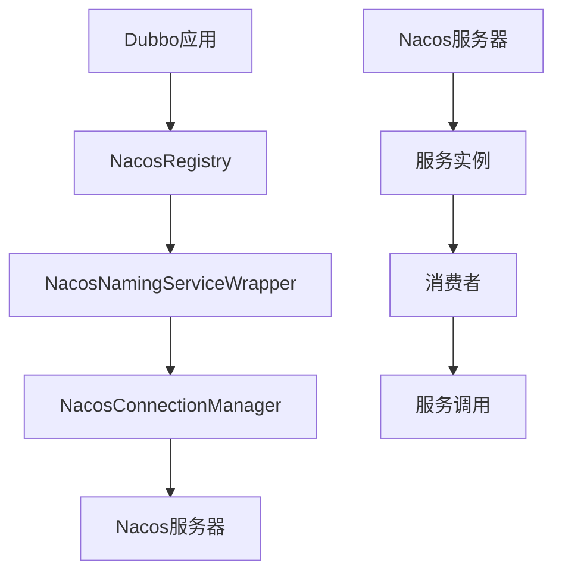

**图源**
- [NacosRegistry.java](file://dubbo-registry\dubbo-registry-nacos\src\main\java\org\apache\dubbo\registry\nacos\NacosRegistry.java)
- [NacosNamingServiceWrapper.java](file://dubbo-registry\dubbo-registry-nacos\src\main\java\org\apache\dubbo\registry\nacos\NacosNamingServiceWrapper.java)
- [NacosConnectionManager.java](file://dubbo-registry\dubbo-registry-nacos\src\main\java\org\apache\dubbo\registry\nacos\NacosConnectionManager.java)

## NacosRegistry核心实现机制

NacosRegistry类是Nacos注册中心的核心实现，它继承了FailbackRegistry抽象类，实现了Dubbo的Registry接口。NacosRegistry通过NacosNamingServiceWrapper与Nacos服务器进行通信，完成服务注册、订阅和发现等操作。

NacosRegistry的主要特性包括：
- 继承FailbackRegistry：提供了失败重试机制
- 使用NacosNamingServiceWrapper：封装了Nacos客户端的API调用
- 支持服务分组和命名空间：通过URL参数配置
- 实现服务实例的健康检查：通过Nacos的健康检查机制

NacosRegistry的构造函数接收两个参数：注册中心的URL和NacosNamingServiceWrapper实例。URL包含了连接Nacos服务器所需的所有配置信息，如服务器地址、端口、命名空间、分组等。

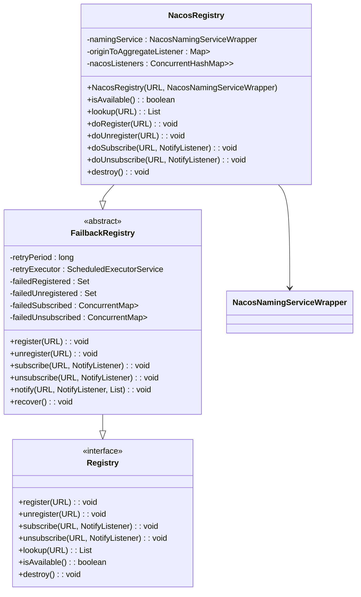

**图源**
- [NacosRegistry.java](file://dubbo-registry\dubbo-registry-nacos\src\main\java\org\apache\dubbo\registry\nacos\NacosRegistry.java)
- [NacosNamingServiceWrapper.java](file://dubbo-registry\dubbo-registry-nacos\src\main\java\org\apache\dubbo\registry\nacos\NacosNamingServiceWrapper.java)

**本节源码**
- [NacosRegistry.java](file://dubbo-registry\dubbo-registry-nacos\src\main\java\org\apache\dubbo\registry\nacos\NacosRegistry.java#L94-L150)

## 服务注册与订阅流程

Nacos注册中心的服务注册与订阅流程是其核心功能，通过NacosRegistry类的doRegister、doUnregister、doSubscribe和doUnsubscribe方法实现。

### 服务注册流程

服务注册流程通过doRegister方法实现，主要步骤如下：
1. 检查是否为服务提供方或需要注册消费者URL
2. 创建Nacos服务实例（Instance）
3. 构建服务名称（serviceName）
4. 调用NacosNamingServiceWrapper注册实例

服务名称的格式为：`{category}:{serviceInterface}:{version}:{group}`，其中category表示服务类别（如providers、consumers），serviceInterface是服务接口名，version是服务版本，group是服务分组。

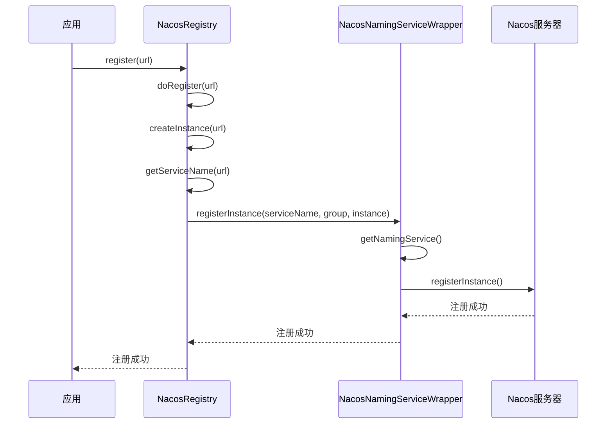

**图源**
- [NacosRegistry.java](file://dubbo-registry\dubbo-registry-nacos\src\main\java\org\apache\dubbo\registry\nacos\NacosRegistry.java#L180-L217)
- [NacosNamingServiceWrapper.java](file://dubbo-registry\dubbo-registry-nacos\src\main\java\org\apache\dubbo\registry\nacos\NacosNamingServiceWrapper.java#L119-L181)

### 服务订阅流程

服务订阅流程通过doSubscribe方法实现，主要步骤如下：
1. 创建NacosAggregateListener聚合监听器
2. 获取服务名称列表
3. 调用doSubscribe进行订阅
4. 为每个服务名称注册事件监听器

NacosAggregateListener用于聚合多个服务实例的通知，避免重复通知。当服务实例发生变化时，Nacos服务器会通过事件监听器通知订阅者。

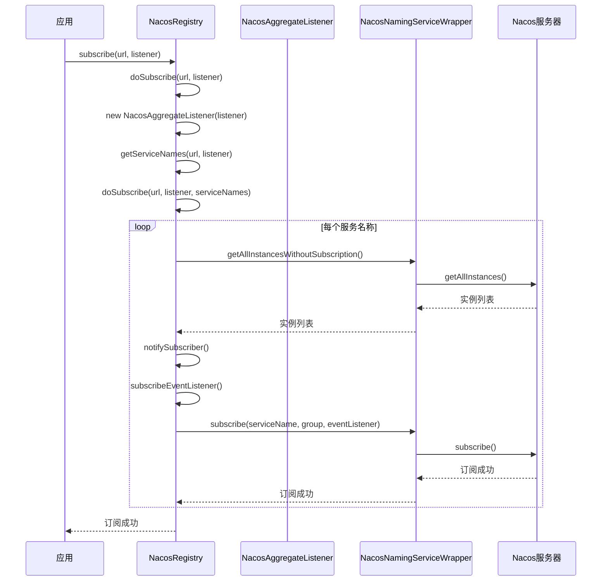

**图源**
- [NacosRegistry.java](file://dubbo-registry\dubbo-registry-nacos\src\main\java\org\apache\dubbo\registry\nacos\NacosRegistry.java#L249-L304)
- [NacosAggregateListener.java](file://dubbo-registry\dubbo-registry-nacos\src\main\java\org\apache\dubbo\registry\nacos\NacosAggregateListener.java#L46-L71)

**本节源码**
- [NacosRegistry.java](file://dubbo-registry\dubbo-registry-nacos\src\main\java\org\apache\dubbo\registry\nacos\NacosRegistry.java#L180-L304)

## Nacos命名服务集成

Nacos命名服务集成通过NacosNamingServiceWrapper类实现，该类封装了Nacos客户端的API调用，提供了对Nacos命名服务的访问。

### NacosNamingServiceWrapper实现

NacosNamingServiceWrapper是Nacos客户端NamingService的包装器，主要功能包括：
- 管理Nacos连接：通过NacosConnectionManager管理与Nacos服务器的连接
- 重试机制：在请求失败时自动重试
- 批量注册：支持批量注册服务实例
- 内部类符号处理：处理Java内部类符号的兼容性问题

NacosNamingServiceWrapper通过NacosConnectionManager获取NamingService实例，NacosConnectionManager负责管理与Nacos服务器的连接，包括连接创建、重试和关闭。

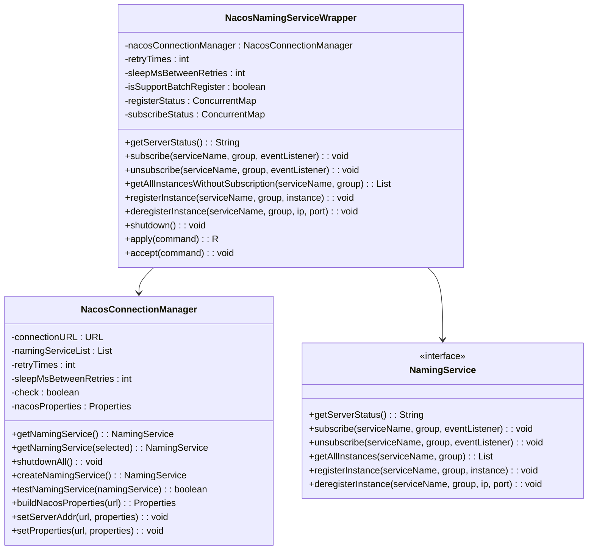

**图源**
- [NacosNamingServiceWrapper.java](file://dubbo-registry\dubbo-registry-nacos\src\main\java\org\apache\dubbo\registry\nacos\NacosNamingServiceWrapper.java)
- [NacosConnectionManager.java](file://dubbo-registry\dubbo-registry-nacos\src\main\java\org\apache\dubbo\registry\nacos\NacosConnectionManager.java)

### 服务名称处理

Nacos服务名称的处理通过NacosServiceName类实现，该类负责服务名称的解析和构建。服务名称的格式为：`{category}:{serviceInterface}:{version}:{group}`。

NacosServiceName类提供了以下功能：
- 服务名称解析：将字符串格式的服务名称解析为各个组成部分
- 服务名称构建：根据URL参数构建服务名称
- 兼容性处理：支持旧版本的服务名称格式
- 通配符匹配：支持服务名称的通配符匹配

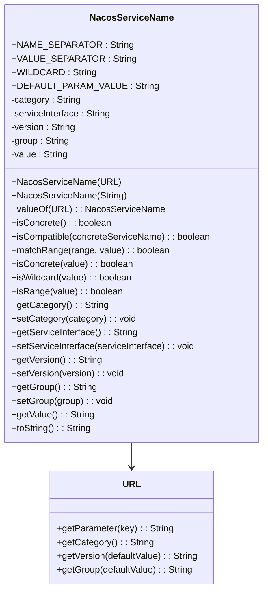

**图源**
- [NacosServiceName.java](file://dubbo-registry\dubbo-registry-nacos\src\main\java\org\apache\dubbo\registry\nacos\NacosServiceName.java)
- [NacosRegistry.java](file://dubbo-registry\dubbo-registry-nacos\src\main\java\org\apache\dubbo\registry\nacos\NacosRegistry.java#L384-L405)

**本节源码**
- [NacosNamingServiceWrapper.java](file://dubbo-registry\dubbo-registry-nacos\src\main\java\org\apache\dubbo\registry\nacos\NacosNamingServiceWrapper.java#L46-L289)
- [NacosServiceName.java](file://dubbo-registry\dubbo-registry-nacos\src\main\java\org\apache\dubbo\registry\nacos\NacosServiceName.java#L34-L234)

## 服务发现实现细节

Nacos服务发现的实现细节主要体现在服务实例的健康检查、权重管理、元数据存储等方面。

### 健康检查机制

Nacos注册中心通过Nacos的健康检查机制来监控服务实例的健康状态。服务实例的健康状态由Nacos服务器维护，Nacos客户端会定期向Nacos服务器发送心跳来保持实例的健康状态。

在NacosRegistry中，服务实例的健康检查主要通过以下方式实现：
- 实例状态检查：通过Instance的isHealthy()方法检查实例的健康状态
- 启用状态检查：通过Instance的isEnabled()方法检查实例的启用状态
- 空保护机制：当服务实例列表为空时，根据配置决定是否发送空通知

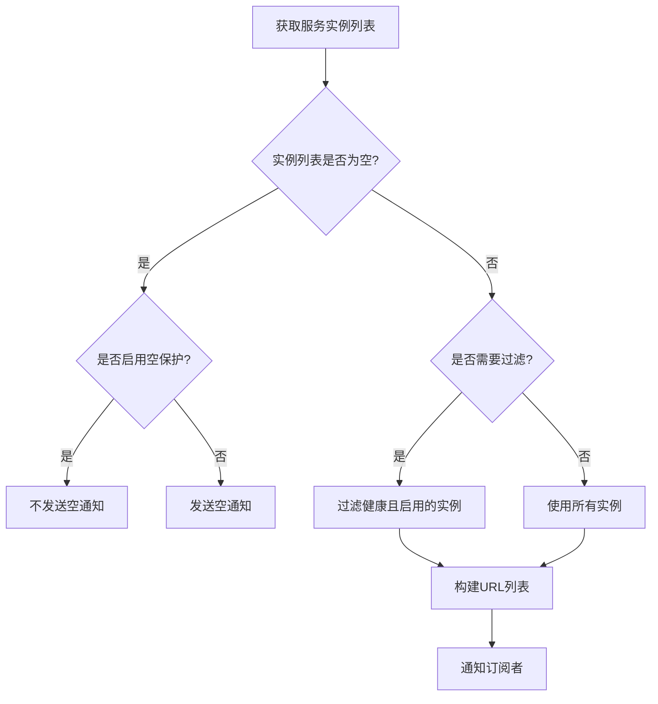

**图源**
- [NacosRegistry.java](file://dubbo-registry\dubbo-registry-nacos\src\main\java\org\apache\dubbo\registry\nacos\NacosRegistry.java#L611-L629)

### 权重管理

Nacos注册中心支持服务实例的权重管理，权重值存储在实例的元数据中。权重值用于负载均衡，权重越高的实例被选中的概率越大。

权重值通过URL参数配置，存储在Instance的metadata中。在构建服务URL时，会从metadata中提取权重值并设置到URL中。

### 元数据存储

Nacos注册中心使用Instance的metadata字段存储服务实例的元数据信息，包括：
- 协议类型（protocol）
- 服务路径（path）
- 版本号（version）
- 分组（group）
- 权重（weight）
- 其他自定义元数据

元数据信息在服务注册时从URL参数中提取并存储，在服务发现时从metadata中提取并构建服务URL。

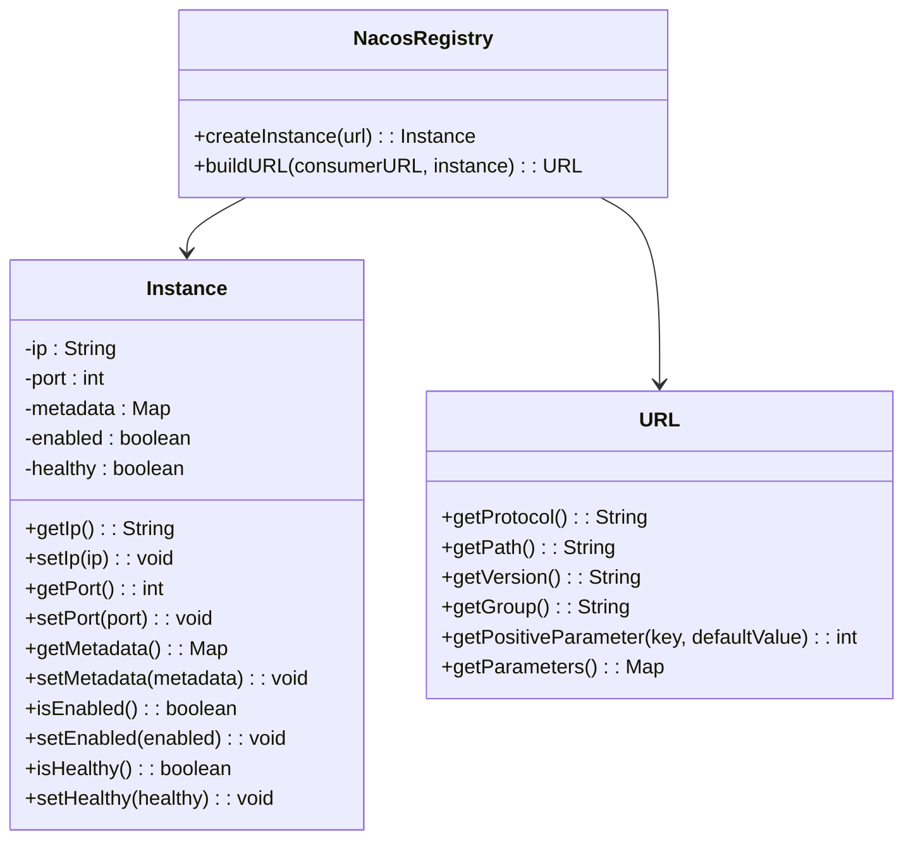

**图源**
- [NacosRegistry.java](file://dubbo-registry\dubbo-registry-nacos\src\main\java\org\apache\dubbo\registry\nacos\NacosRegistry.java#L721-L734)
- [NacosRegistry.java](file://dubbo-registry\dubbo-registry-nacos\src\main\java\org\apache\dubbo\registry\nacos\NacosRegistry.java#L713-L719)

**本节源码**
- [NacosRegistry.java](file://dubbo-registry\dubbo-registry-nacos\src\main\java\org\apache\dubbo\registry\nacos\NacosRegistry.java#L611-L719)

## 配置参数详解

Nacos注册中心的配置参数主要通过URL参数进行配置，包括连接配置、命名空间、分组等。

### 连接配置

连接配置参数用于配置与Nacos服务器的连接信息：

| 参数名 | 说明 | 默认值 |
|--------|------|--------|
| address | Nacos服务器地址 | 无 |
| port | Nacos服务器端口 | 8848 |
| backup | 备用Nacos服务器地址 | 无 |
| nacos.check | 是否检查Nacos服务器状态 | true |
| nacos.retry | 重试次数 | 10 |
| nacos.retry-wait | 重试间隔时间（毫秒） | 10 |

### 命名空间配置

命名空间配置参数用于配置Nacos的命名空间：

| 参数名 | 说明 | 默认值 |
|--------|------|--------|
| namespace | 命名空间ID | 无 |
| config.namespace | 配置中心命名空间 | 无 |

### 分组配置

分组配置参数用于配置Nacos的服务分组：

| 参数名 | 说明 | 默认值 |
|--------|------|--------|
| group | 服务分组 | DEFAULT_GROUP |
| nacos.group | Nacos分组 | 与group参数相同 |

### 其他配置

其他配置参数：

| 参数名 | 说明 | 默认值 |
|--------|------|--------|
| username | Nacos用户名 | 无 |
| password | Nacos密码 | 无 |
| nacos.service.names.pagination.size | 服务名称分页大小 | 100 |
| nacos.service.names.lookup.interval | 服务名称查询间隔（秒） | 30 |
| nacos.subscribe.legacy-name | 是否支持旧版本服务名称 | false |
| nacos.register.compatible | 是否兼容旧版本注册 | false |

**本节源码**
- [NacosConnectionManager.java](file://dubbo-registry\dubbo-registry-nacos\src\main\java\org\apache\dubbo\registry\nacos\NacosConnectionManager.java#L65-L73)
- [NacosNamingServiceUtils.java](file://dubbo-registry\dubbo-registry-nacos\src\main\java\org\apache\dubbo\registry\nacos\util\NacosNamingServiceUtils.java#L45-L52)

## 使用示例

### 通过NacosRegistryFactory创建注册中心实例

通过NacosRegistryFactory创建Nacos注册中心实例的代码示例如下：

```java
URL registryUrl = URL.valueOf("nacos://127.0.0.1:8848?namespace=public&group=DEFAULT_GROUP");
NacosRegistryFactory factory = new NacosRegistryFactory();
Registry registry = factory.createRegistry(registryUrl);
```

### 服务注册示例

服务注册的代码示例如下：

```java
URL serviceUrl = URL.valueOf("nacos://127.0.0.1:8848/org.apache.dubbo.demo.DemoService?interface=org.apache.dubbo.demo.DemoService&version=1.0.0&group=demo&side=provider");
registry.register(serviceUrl);
```

### 服务订阅示例

服务订阅的代码示例如下：

```java
URL serviceUrl = URL.valueOf("nacos://127.0.0.1:8848/org.apache.dubbo.demo.DemoService?interface=org.apache.dubbo.demo.DemoService&version=1.0.0&group=demo&side=consumer");
registry.subscribe(serviceUrl, new NotifyListener() {
    @Override
    public void notify(List<URL> urls) {
        // 处理服务实例变化通知
        for (URL url : urls) {
            System.out.println("Service instance: " + url.toFullString());
        }
    }
});
```

### Spring配置示例

在Spring配置文件中配置Nacos注册中心的示例如下：

```xml
<dubbo:registry address="nacos://127.0.0.1:8848" 
                namespace="public" 
                group="DEFAULT_GROUP" 
                timeout="5000"/>
```

**本节源码**
- [NacosRegistryFactory.java](file://dubbo-registry\dubbo-registry-nacos\src\main\java\org\apache\dubbo\registry\nacos\NacosRegistryFactory.java#L46-L49)
- [NacosRegistryTest.java](file://dubbo-registry\dubbo-registry-nacos\src\test\java\org\apache\dubbo\registry\nacos\NacosRegistryTest.java#L77-L117)

## 容错机制与重试策略

Nacos注册中心的容错机制与重试策略主要体现在以下几个方面：

### 连接重试机制

NacosConnectionManager实现了连接重试机制，在创建NamingService实例时，如果连接失败会自动重试。重试次数和重试间隔通过URL参数配置。

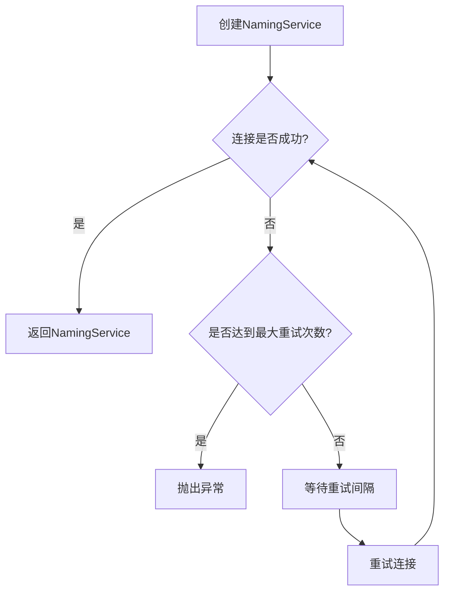

**图源**
- [NacosConnectionManager.java](file://dubbo-registry\dubbo-registry-nacos\src\main\java\org\apache\dubbo\registry\nacos\NacosConnectionManager.java#L125-L148)

### 请求重试机制

NacosNamingServiceWrapper实现了请求重试机制，在调用Nacos API失败时会自动重试。重试次数和重试间隔通过URL参数配置。

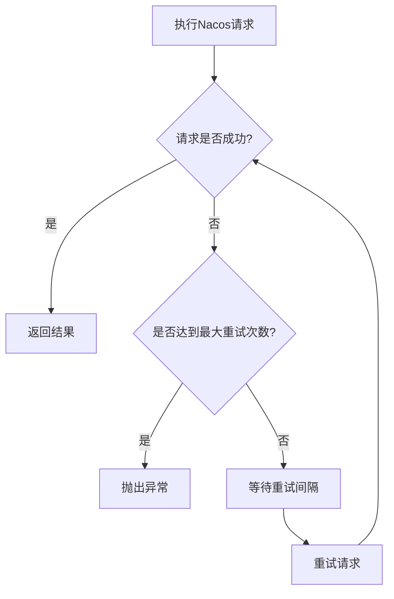

**图源**
- [NacosNamingServiceWrapper.java](file://dubbo-registry\dubbo-registry-nacos\src\main\java\org\apache\dubbo\registry\nacos\NacosNamingServiceWrapper.java#L443-L488)

### 断线重连机制

Nacos注册中心通过FailbackRegistry的断线重连机制实现断线重连。当注册或订阅失败时，会将失败的请求加入失败队列，定时重试。

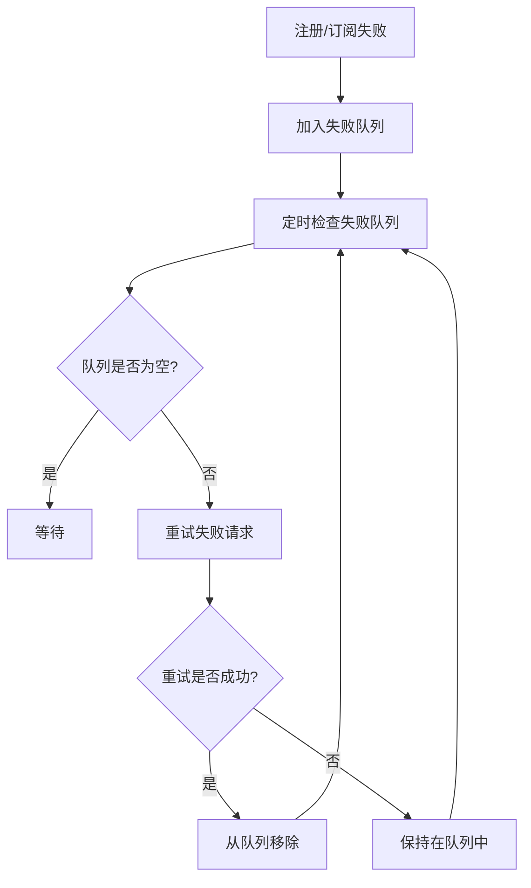

**图源**
- [FailbackRegistry.java](file://dubbo-registry\dubbo-registry-api\src\main\java\org\apache\dubbo\registry\support\FailbackRegistry.java)

**本节源码**
- [NacosConnectionManager.java](file://dubbo-registry\dubbo-registry-nacos\src\main\java\org\apache\dubbo\registry\nacos\NacosConnectionManager.java#L122-L148)
- [NacosNamingServiceWrapper.java](file://dubbo-registry\dubbo-registry-nacos\src\main\java\org\apache\dubbo\registry\nacos\NacosNamingServiceWrapper.java#L443-L488)

## 高并发性能优化

Nacos注册中心在高并发场景下的性能优化建议：

### 连接池优化

NacosConnectionManager使用连接池管理与Nacos服务器的连接，建议根据实际并发量调整连接池大小。

### 批量操作

NacosNamingServiceWrapper支持批量注册服务实例，建议在需要注册多个服务实例时使用批量操作，减少网络开销。

### 缓存优化

Nacos注册中心内部使用缓存存储服务实例信息，建议根据实际需求调整缓存大小和过期时间。

### 线程池优化

Nacos注册中心使用线程池处理异步操作，建议根据实际并发量调整线程池大小。

### 减少不必要的订阅

避免订阅不必要的服务，减少Nacos服务器的负载和网络开销。

### 合理设置重试参数

根据网络状况合理设置重试次数和重试间隔，避免过度重试导致系统负载过高。

**本节源码**
- [NacosNamingServiceWrapper.java](file://dubbo-registry\dubbo-registry-nacos\src\main\java\org\apache\dubbo\registry\nacos\NacosNamingServiceWrapper.java#L68-L71)
- [NacosConnectionManager.java](file://dubbo-registry\dubbo-registry-nacos\src\main\java\org\apache\dubbo\registry\nacos\NacosConnectionManager.java#L65-L73)