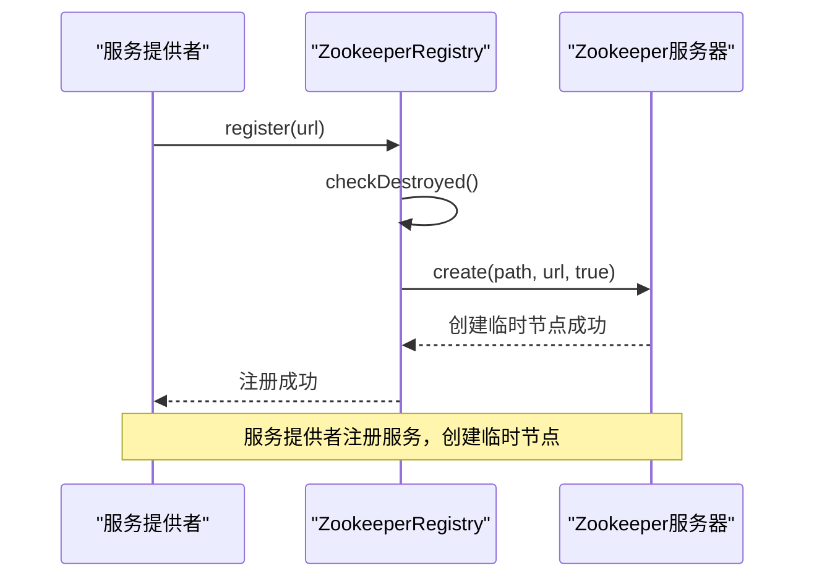
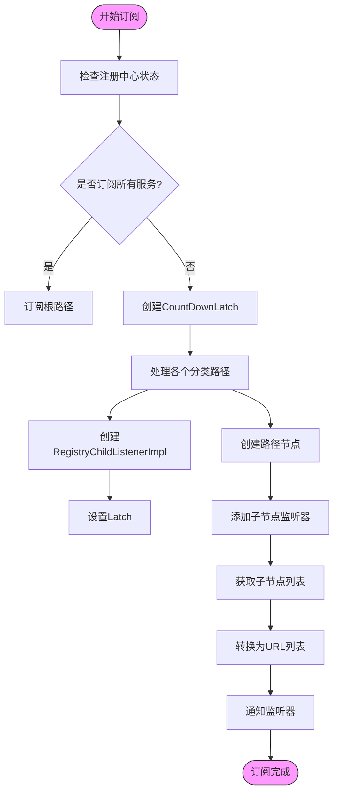
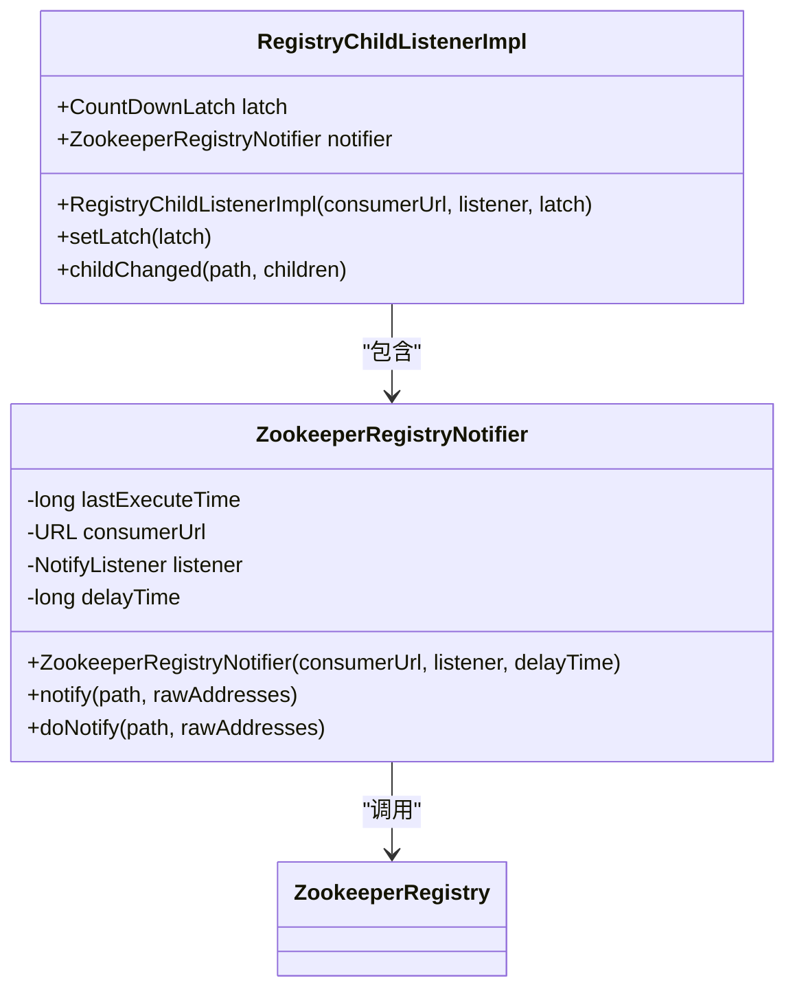
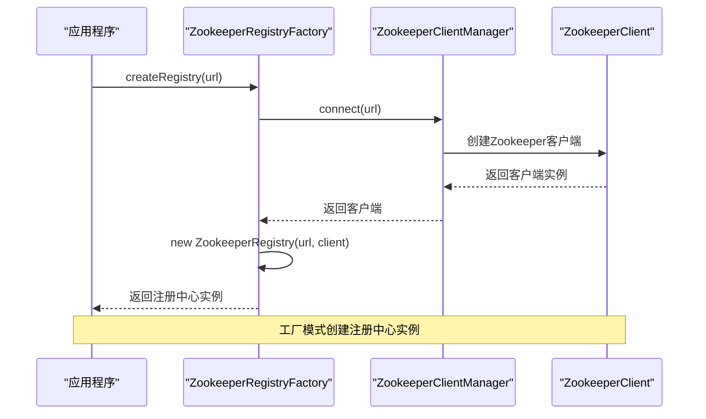
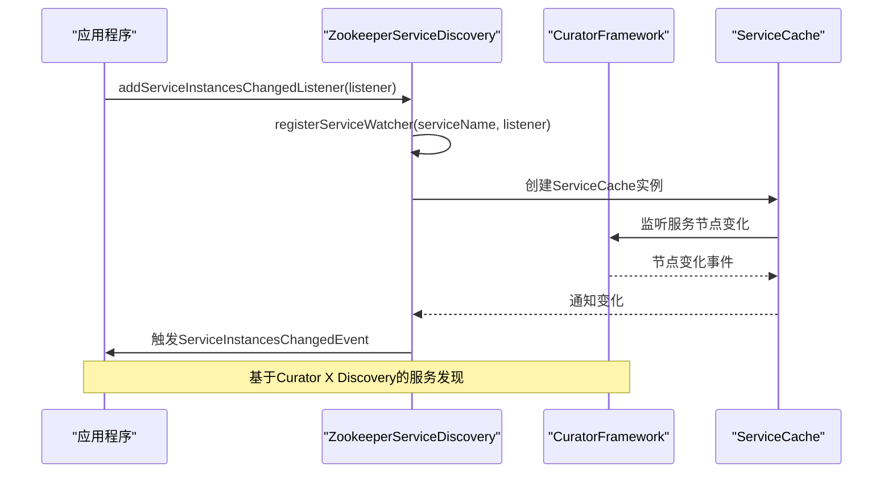
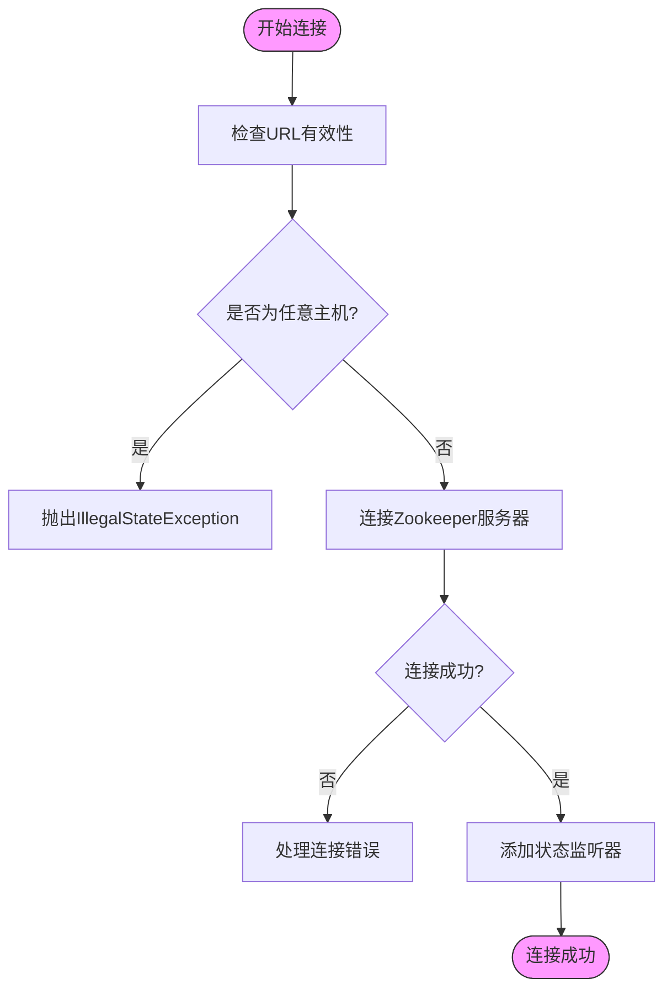
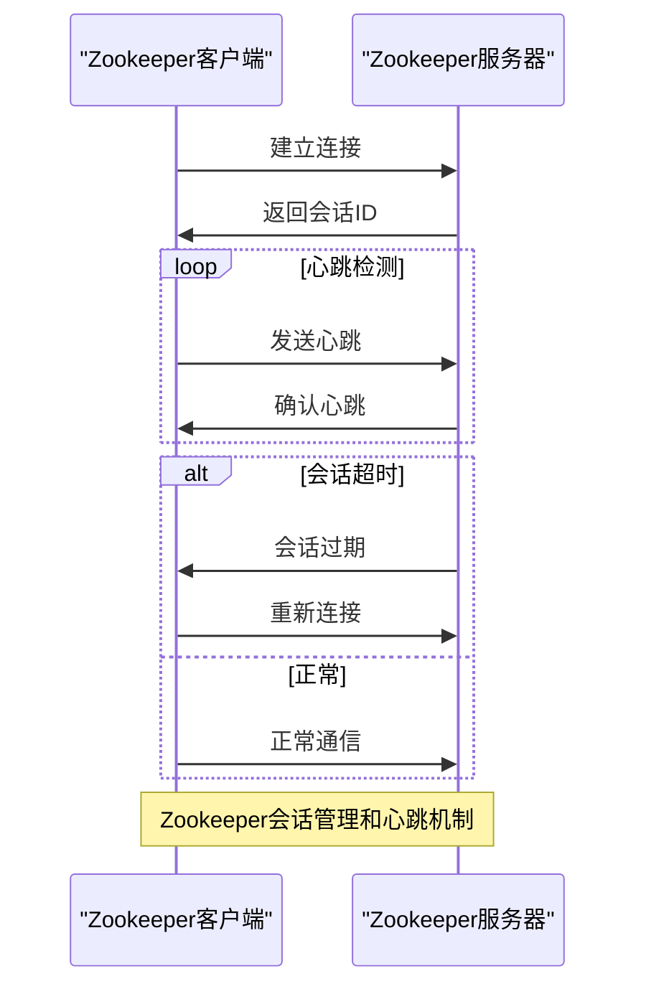

# Zookeeper注册中心

<cite>
**本文档引用的文件**   
- [ZookeeperRegistry.java](file://dubbo-registry\dubbo-registry-zookeeper\src\main\java\org\apache\dubbo\registry\zookeeper\ZookeeperRegistry.java)
- [ZookeeperRegistryFactory.java](file://dubbo-registry\dubbo-registry-zookeeper\src\main\java\org\apache\dubbo\registry\zookeeper\ZookeeperRegistryFactory.java)
- [ZookeeperServiceDiscovery.java](file://dubbo-registry\dubbo-registry-zookeeper\src\main\java\org\apache\dubbo\registry\zookeeper\ZookeeperServiceDiscovery.java)
- [Curator5ZookeeperClient.java](file://dubbo-remoting\dubbo-remoting-zookeeper-curator5\src\main\java\org\apache\dubbo\remoting\zookeeper\curator5\Curator5ZookeeperClient.java)
- [ZookeeperDynamicConfiguration.java](file://dubbo-configcenter\dubbo-configcenter-zookeeper\src\main\java\org\apache\dubbo\configcenter\support\zookeeper\ZookeeperDynamicConfiguration.java)
- [ZookeeperConfig.java](file://dubbo-test\dubbo-test-check\src\main\java\org\apache\dubbo\test\check\registrycenter\config\ZookeeperConfig.java)
- [ZookeeperRegistryCenterConfig.java](file://dubbo-test\dubbo-test-check\src\main\java\org\apache\dubbo\test\check\registrycenter\config\ZookeeperRegistryCenterConfig.java)
</cite>

## 目录
1. [简介](#简介)
2. [核心组件](#核心组件)
3. [架构概述](#架构概述)
4. [详细组件分析](#详细组件分析)
5. [依赖分析](#依赖分析)
6. [性能考虑](#性能考虑)
7. [故障排除指南](#故障排除指南)
8. [结论](#结论)

## 简介
Zookeeper注册中心是Dubbo框架中用于服务注册与发现的核心组件之一。它基于Apache Zookeeper实现，提供了高可用、强一致性的服务注册中心解决方案。Zookeeper注册中心通过ZNode的层次化数据结构来存储服务信息，利用Zookeeper的Watcher机制实现服务的动态发现和通知。本文档将深入分析Zookeeper注册中心的实现机制，包括服务注册、监听订阅、事件通知的具体流程，以及相关的配置参数和使用示例。

## 核心组件

Zookeeper注册中心的核心组件包括ZookeeperRegistry、ZookeeperRegistryFactory、ZookeeperServiceDiscovery等类。ZookeeperRegistry是注册中心的主要实现类，负责服务的注册、订阅和发现功能。ZookeeperRegistryFactory是注册中心工厂类，负责创建ZookeeperRegistry实例。ZookeeperServiceDiscovery是基于Curator X Discovery的服务发现实现，提供了更高级的服务发现功能。

**本文档引用的文件**   
- [ZookeeperRegistry.java](file://dubbo-registry\dubbo-registry-zookeeper\src\main\java\org\apache\dubbo\registry\zookeeper\ZookeeperRegistry.java)
- [ZookeeperRegistryFactory.java](file://dubbo-registry\dubbo-registry-zookeeper\src\main\java\org\apache\dubbo\registry\zookeeper\ZookeeperRegistryFactory.java)
- [ZookeeperServiceDiscovery.java](file://dubbo-registry\dubbo-registry-zookeeper\src\main\java\org\apache\dubbo\registry\zookeeper\ZookeeperServiceDiscovery.java)

## 架构概述

Zookeeper注册中心的架构基于Zookeeper的层次化数据结构设计，采用持久节点和临时节点相结合的方式存储服务信息。服务提供者在启动时会创建临时节点注册服务，服务消费者通过监听这些节点的变化来发现可用的服务实例。

```mermaid
graph TB
subgraph "Zookeeper Server"
ZKNode["/dubbo"]
subgraph "Service Providers"
Provider1["/dubbo/com.example.ServiceA/providers"]
Provider2["/dubbo/com.example.ServiceB/providers"]
end
subgraph "Service Consumers"
Consumer1["/dubbo/com.example.ServiceA/consumers"]
Consumer2["/dubbo/com.example.ServiceB/consumers"]
end
subgraph "Configuration"
Config1["/dubbo/com.example.ServiceA/configurators"]
Config2["/dubbo/com.example.ServiceB/configurators"]
end
subgraph "Routing"
Router1["/dubbo/com.example.ServiceA/routers"]
Router2["/dubbo/com.example.ServiceB/routers"]
end
end
subgraph "Dubbo Application"
ProviderApp["服务提供者"]
ConsumerApp["服务消费者"]
end
ProviderApp --> |注册服务| Provider1
ProviderApp --> |注册服务| Provider2
ConsumerApp --> |订阅服务| Consumer1
ConsumerApp --> |订阅服务| Consumer2
ConsumerApp --> |获取配置| Config1
ConsumerApp --> |获取路由| Router1
ZKNode --> Provider1
ZKNode --> Provider2
ZKNode --> Consumer1
ZKNode --> Consumer2
ZKNode --> Config1
ZKNode --> Router1
```



**图源**  
- [ZookeeperRegistry.java](file://dubbo-registry\dubbo-registry-zookeeper\src\main\java\org\apache\dubbo\registry\zookeeper\ZookeeperRegistry.java#L63-L66)
- [ZookeeperServiceDiscovery.java](file://dubbo-registry\dubbo-registry-zookeeper\src\main\java\org\apache\dubbo\registry\zookeeper\ZookeeperServiceDiscovery.java#L67-L72)

## 详细组件分析

### ZookeeperRegistry分析

ZookeeperRegistry是Zookeeper注册中心的核心实现类，继承自CacheableFailbackRegistry，提供了服务注册、订阅和发现的功能。它通过ZookeeperClient与Zookeeper服务器进行通信，利用Zookeeper的节点和Watcher机制实现服务的动态管理。

#### 服务注册流程
服务注册是Zookeeper注册中心的基础功能，服务提供者在启动时会将自己的服务信息注册到Zookeeper中。注册过程使用临时节点，确保服务实例在异常退出时能够自动从注册中心移除。



**图源**  
- [ZookeeperRegistry.java](file://dubbo-registry\dubbo-registry-zookeeper\src\main\java\org\apache\dubbo\registry\zookeeper\ZookeeperRegistry.java#L169-L177)

#### 服务订阅流程
服务订阅是服务消费者发现可用服务实例的关键机制。消费者通过订阅特定路径的节点变化，实时获取服务提供者列表的更新。



**图源**  
- [ZookeeperRegistry.java](file://dubbo-registry\dubbo-registry-zookeeper\src\main\java\org\apache\dubbo\registry\zookeeper\ZookeeperRegistry.java#L191-L285)

#### 事件通知机制
Zookeeper注册中心通过Watcher机制实现事件通知，当服务节点发生变化时，会通知所有订阅了该路径的消费者。



**图源**  
- [ZookeeperRegistry.java](file://dubbo-registry\dubbo-registry-zookeeper\src\main\java\org\apache\dubbo\registry\zookeeper\ZookeeperRegistry.java#L405-L479)

### ZookeeperRegistryFactory分析

ZookeeperRegistryFactory是注册中心工厂类，负责创建ZookeeperRegistry实例。它通过依赖注入的方式获取ZookeeperClientManager，确保Zookeeper客户端的统一管理和复用。



**图源**  
- [ZookeeperRegistryFactory.java](file://dubbo-registry\dubbo-registry-zookeeper\src\main\java\org\apache\dubbo\registry\zookeeper\ZookeeperRegistryFactory.java#L48-L51)

### ZookeeperServiceDiscovery分析

ZookeeperServiceDiscovery是基于Curator X Discovery的服务发现实现，提供了更高级的服务发现功能。它利用Curator的ServiceCache机制，实现了服务实例的缓存和自动更新。



**图源**  
- [ZookeeperServiceDiscovery.java](file://dubbo-registry\dubbo-registry-zookeeper\src\main\java\org\apache\dubbo\registry\zookeeper\ZookeeperServiceDiscovery.java#L154-L163)

## 依赖分析

Zookeeper注册中心依赖于多个核心组件，包括Zookeeper客户端、Curator框架、Dubbo的扩展机制等。这些依赖关系确保了注册中心的稳定性和可扩展性。

```mermaid
graph TD
ZookeeperRegistry --> ZookeeperClient : "使用"
ZookeeperRegistry --> CacheableFailbackRegistry : "继承"
ZookeeperRegistryFactory --> ZookeeperClientManager : "依赖"
ZookeeperServiceDiscovery --> CuratorFramework : "使用"
ZookeeperServiceDiscovery --> ServiceCache : "使用"
ZookeeperDynamicConfiguration --> ZookeeperClient : "使用"
ZookeeperDynamicConfiguration --> TreePathDynamicConfiguration : "继承"
style ZookeeperRegistry fill:#f9f,stroke:#333
style ZookeeperRegistryFactory fill:#f9f,stroke:#333
style ZookeeperServiceDiscovery fill:#f9f,stroke:#333
style ZookeeperDynamicConfiguration fill:#f9f,stroke:#333
```

**图源**  
- [ZookeeperRegistry.java](file://dubbo-registry\dubbo-registry-zookeeper\src\main\java\org\apache\dubbo\registry\zookeeper\ZookeeperRegistry.java)
- [ZookeeperRegistryFactory.java](file://dubbo-registry\dubbo-registry-zookeeper\src\main\java\org\apache\dubbo\registry\zookeeper\ZookeeperRegistryFactory.java)
- [ZookeeperServiceDiscovery.java](file://dubbo-registry\dubbo-registry-zookeeper\src\main\java\org\apache\dubbo\registry\zookeeper\ZookeeperServiceDiscovery.java)
- [ZookeeperDynamicConfiguration.java](file://dubbo-configcenter\dubbo-configcenter-zookeeper\src\main\java\org\apache\dubbo\configcenter\support\zookeeper\ZookeeperDynamicConfiguration.java)

## 性能考虑

Zookeeper注册中心在设计时充分考虑了性能因素，通过多种机制优化了服务注册和发现的性能。

1. **连接复用**：通过ZookeeperClientManager管理Zookeeper客户端连接，实现连接的复用，避免频繁创建和销毁连接带来的性能开销。
2. **缓存机制**：在ZookeeperRegistry中实现了缓存机制，减少对Zookeeper服务器的直接访问。
3. **异步通知**：事件通知采用异步方式，避免阻塞主线程，提高系统响应速度。
4. **批量操作**：在处理多个服务订阅时，采用批量操作的方式，减少网络通信次数。

**本文档引用的文件**   
- [ZookeeperRegistry.java](file://dubbo-registry\dubbo-registry-zookeeper\src\main\java\org\apache\dubbo\registry\zookeeper\ZookeeperRegistry.java)
- [ZookeeperClientManager.java](file://dubbo-remoting\dubbo-remoting-zookeeper-curator5\src\main\java\org\apache\dubbo\remoting\zookeeper\curator5\ZookeeperClientManager.java)

## 故障排除指南

### 连接问题
当Zookeeper注册中心无法连接到Zookeeper服务器时，可能的原因包括：
- Zookeeper服务器地址配置错误
- 网络连接问题
- Zookeeper服务器未启动

可以通过检查ZookeeperRegistry的构造函数中的连接逻辑来诊断问题：



**图源**  
- [ZookeeperRegistry.java](file://dubbo-registry\dubbo-registry-zookeeper\src\main\java\org\apache\dubbo\registry\zookeeper\ZookeeperRegistry.java#L74-L124)

### 会话超时问题
Zookeeper会话超时可能导致服务实例被错误地从注册中心移除。可以通过调整会话超时参数来解决：



**图源**  
- [Curator5ZookeeperClient.java](file://dubbo-remoting\dubbo-remoting-zookeeper-curator5\src\main\java\org\apache\dubbo\remoting\zookeeper\curator5\Curator5ZookeeperClient.java#L484-L544)

## 结论

Zookeeper注册中心作为Dubbo框架的核心组件，提供了稳定、高效的服务注册与发现功能。通过深入分析其源码实现，我们可以看到它充分利用了Zookeeper的特性，如临时节点、Watcher机制等，实现了服务的动态管理。同时，通过合理的架构设计和性能优化，确保了在大规模分布式环境下的稳定运行。对于开发者而言，理解Zookeeper注册中心的实现机制有助于更好地使用和优化Dubbo框架，提高系统的可靠性和性能。