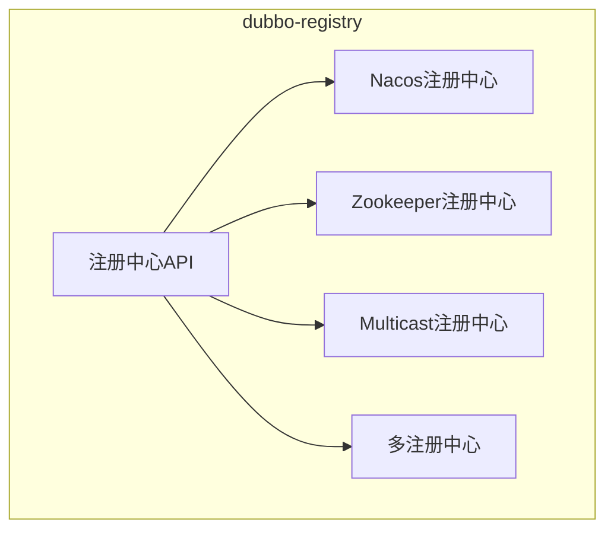
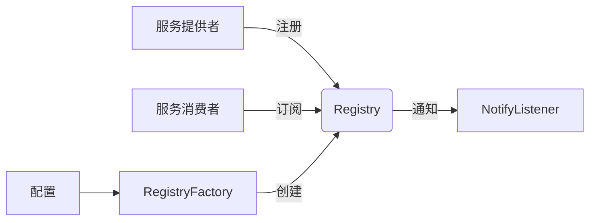
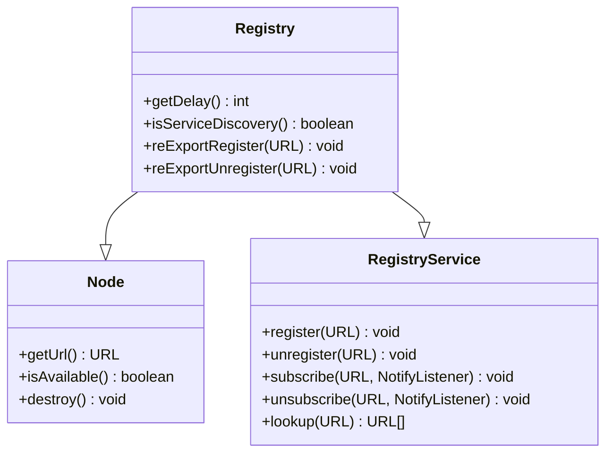
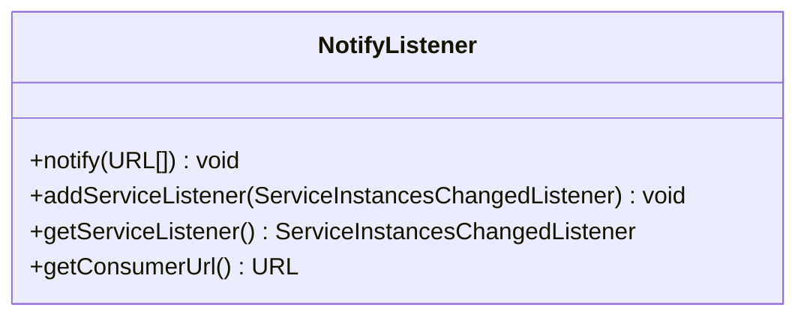
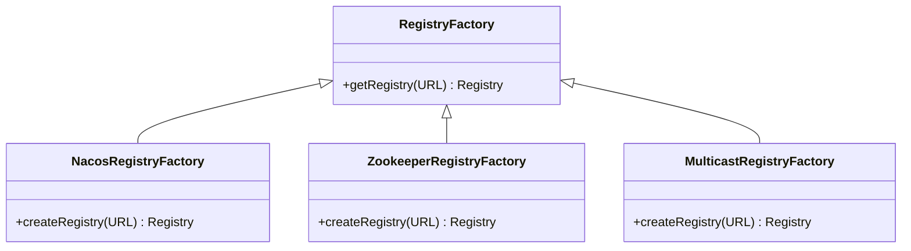
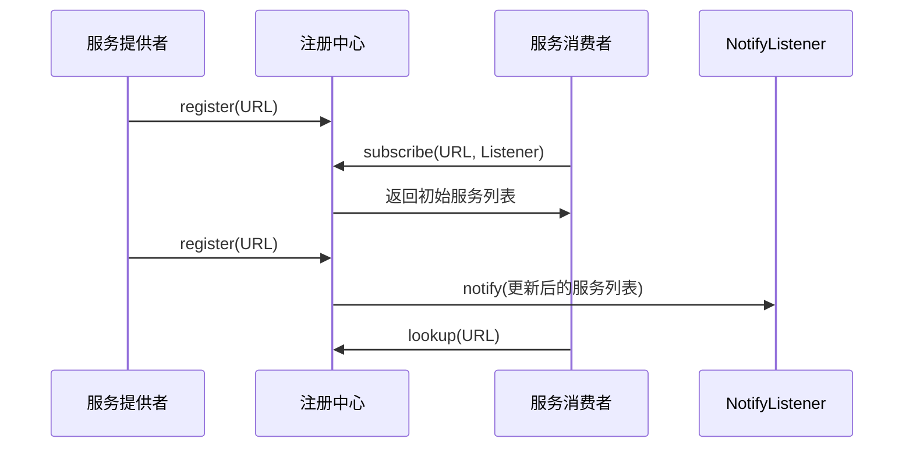
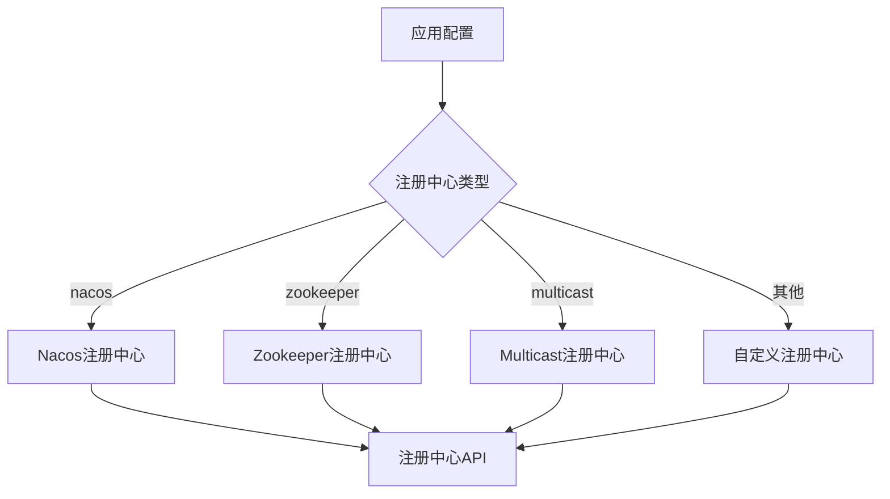
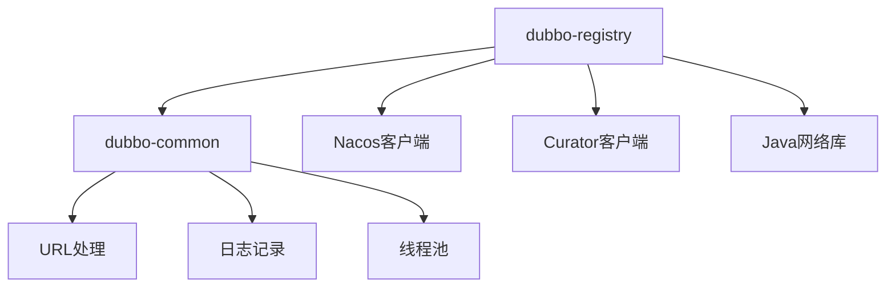

# dubbo-registry模块

<cite>
**本文档引用的文件**  
- [Registry.java](file://dubbo-registry/dubbo-registry-api/src/main/java/org/apache/dubbo/registry/Registry.java)
- [NotifyListener.java](file://dubbo-registry/dubbo-registry-api/src/main/java/org/apache/dubbo/registry/NotifyListener.java)
- [RegistryFactory.java](file://dubbo-registry/dubbo-registry-api/src/main/java/org/apache/dubbo/registry/RegistryFactory.java)
- [NacosRegistry.java](file://dubbo-registry/dubbo-registry-nacos/src/main/java/org/apache/dubbo/registry/nacos/NacosRegistry.java)
- [ZookeeperRegistry.java](file://dubbo-registry/dubbo-registry-zookeeper/src/main/java/org/apache/dubbo/registry/zookeeper/ZookeeperRegistry.java)
- [MulticastRegistry.java](file://dubbo-registry/dubbo-registry-multicast/src/main/java/org/apache/dubbo/registry/multicast/MulticastRegistry.java)
- [NacosRegistryFactory.java](file://dubbo-registry/dubbo-registry-nacos/src/main/java/org/apache/dubbo/registry/nacos/NacosRegistryFactory.java)
- [ZookeeperRegistryFactory.java](file://dubbo-registry/dubbo-registry-zookeeper/src/main/java/org/apache/dubbo/registry/zookeeper/ZookeeperRegistryFactory.java)
- [MulticastRegistryFactory.java](file://dubbo-registry/dubbo-registry-multicast/src/main/java/org/apache/dubbo/registry/multicast/MulticastRegistryFactory.java)
- [org.apache.dubbo.registry.RegistryFactory](file://dubbo-registry/dubbo-registry-api/src/main/resources/META-INF/dubbo/internal/org.apache.dubbo.registry.RegistryFactory)
- [org.apache.dubbo.registry.RegistryFactory](file://dubbo-registry/dubbo-registry-nacos/src/main/resources/META-INF/dubbo/internal/org.apache.dubbo.registry.RegistryFactory)
</cite>

## 目录
1. [简介](#简介)
2. [项目结构](#项目结构)
3. [核心组件](#核心组件)
4. [架构概述](#架构概述)
5. [详细组件分析](#详细组件分析)
6. [依赖分析](#依赖分析)
7. [性能考虑](#性能考虑)
8. [故障排除指南](#故障排除指南)
9. [结论](#结论)

## 简介
dubbo-registry模块是Apache Dubbo框架的核心组件之一，负责服务注册与发现功能。该模块提供了统一的注册中心接口和多种注册中心实现，支持Nacos、Zookeeper、Multicast等多种注册中心。通过该模块，Dubbo服务提供者可以将自己的服务注册到注册中心，服务消费者可以从注册中心发现可用的服务提供者，从而实现服务间的解耦和动态发现。

## 项目结构
dubbo-registry模块采用模块化设计，主要包含API定义和多个注册中心实现。API模块定义了注册中心的核心接口，而各个实现模块则提供了具体的注册中心功能。

**图表来源**
- [Registry.java](file://dubbo-registry/dubbo-registry-api/src/main/java/org/apache/dubbo/registry/Registry.java)
- [NacosRegistry.java](file://dubbo-registry/dubbo-registry-nacos/src/main/java/org/apache/dubbo/registry/nacos/NacosRegistry.java)
- [ZookeeperRegistry.java](file://dubbo-registry/dubbo-registry-zookeeper/src/main/java/org/apache/dubbo/registry/zookeeper/ZookeeperRegistry.java)
- [MulticastRegistry.java](file://dubbo-registry/dubbo-registry-multicast/src/main/java/org/apache/dubbo/registry/multicast/MulticastRegistry.java)

**章节来源**
- [Registry.java](file://dubbo-registry/dubbo-registry-api/src/main/java/org/apache/dubbo/registry/Registry.java)
- [NacosRegistry.java](file://dubbo-registry/dubbo-registry-nacos/src/main/java/org/apache/dubbo/registry/nacos/NacosRegistry.java)

## 核心组件

dubbo-registry模块的核心组件包括Registry接口、NotifyListener接口、RegistryFactory接口以及各种注册中心的具体实现。这些组件共同构成了服务注册与发现的基础架构。

**章节来源**
- [Registry.java](file://dubbo-registry/dubbo-registry-api/src/main/java/org/apache/dubbo/registry/Registry.java)
- [NotifyListener.java](file://dubbo-registry/dubbo-registry-api/src/main/java/org/apache/dubbo/registry/NotifyListener.java)
- [RegistryFactory.java](file://dubbo-registry/dubbo-registry-api/src/main/java/org/apache/dubbo/registry/RegistryFactory.java)

## 架构概述

dubbo-registry模块采用SPI（Service Provider Interface）机制实现可扩展的注册中心架构。通过RegistryFactory接口创建具体的注册中心实例，Registry接口提供服务注册、订阅和查询功能，NotifyListener接口用于接收服务变更通知。

**图表来源**
- [Registry.java](file://dubbo-registry/dubbo-registry-api/src/main/java/org/apache/dubbo/registry/Registry.java)
- [NotifyListener.java](file://dubbo-registry/dubbo-registry-api/src/main/java/org/apache/dubbo/registry/NotifyListener.java)
- [RegistryFactory.java](file://dubbo-registry/dubbo-registry-api/src/main/java/org/apache/dubbo/registry/RegistryFactory.java)

## 详细组件分析

### Registry接口分析
Registry接口是dubbo-registry模块的核心接口，继承自Node和RegistryService接口，定义了注册中心的基本行为。

**图表来源**
- [Registry.java](file://dubbo-registry/dubbo-registry-api/src/main/java/org/apache/dubbo/registry/Registry.java)

**章节来源**
- [Registry.java](file://dubbo-registry/dubbo-registry-api/src/main/java/org/apache/dubbo/registry/Registry.java)

### NotifyListener接口分析
NotifyListener接口用于接收服务变更通知，当注册中心中的服务信息发生变化时，会调用该接口的notify方法。

**图表来源**
- [NotifyListener.java](file://dubbo-registry/dubbo-registry-api/src/main/java/org/apache/dubbo/registry/NotifyListener.java)

**章节来源**
- [NotifyListener.java](file://dubbo-registry/dubbo-registry-api/src/main/java/org/apache/dubbo/registry/NotifyListener.java)

### RegistryFactory接口分析
RegistryFactory接口是注册中心工厂接口，用于创建具体的注册中心实例。

**图表来源**
- [RegistryFactory.java](file://dubbo-registry/dubbo-registry-api/src/main/java/org/apache/dubbo/registry/RegistryFactory.java)
- [NacosRegistryFactory.java](file://dubbo-registry/dubbo-registry-nacos/src/main/java/org/apache/dubbo/registry/nacos/NacosRegistryFactory.java)
- [ZookeeperRegistryFactory.java](file://dubbo-registry/dubbo-registry-zookeeper/src/main/java/org/apache/dubbo/registry/zookeeper/ZookeeperRegistryFactory.java)
- [MulticastRegistryFactory.java](file://dubbo-registry/dubbo-registry-multicast/src/main/java/org/apache/dubbo/registry/multicast/MulticastRegistryFactory.java)

**章节来源**
- [RegistryFactory.java](file://dubbo-registry/dubbo-registry-api/src/main/java/org/apache/dubbo/registry/RegistryFactory.java)

### 服务注册与发现流程
服务注册与发现的完整流程包括服务注册、服务订阅和变更通知三个主要步骤。

**图表来源**
- [Registry.java](file://dubbo-registry/dubbo-registry-api/src/main/java/org/apache/dubbo/registry/Registry.java)
- [NotifyListener.java](file://dubbo-registry/dubbo-registry-api/src/main/java/org/apache/dubbo/registry/NotifyListener.java)

**章节来源**
- [Registry.java](file://dubbo-registry/dubbo-registry-api/src/main/java/org/apache/dubbo/registry/Registry.java)
- [NotifyListener.java](file://dubbo-registry/dubbo-registry-api/src/main/java/org/apache/dubbo/registry/NotifyListener.java)

### 多注册中心架构
dubbo-registry模块支持多种注册中心，通过SPI机制实现灵活的注册中心选择。

**图表来源**
- [org.apache.dubbo.registry.RegistryFactory](file://dubbo-registry/dubbo-registry-api/src/main/resources/META-INF/dubbo/internal/org.apache.dubbo.registry.RegistryFactory)
- [org.apache.dubbo.registry.RegistryFactory](file://dubbo-registry/dubbo-registry-nacos/src/main/resources/META-INF/dubbo/internal/org.apache.dubbo.registry.RegistryFactory)

**章节来源**
- [RegistryFactory.java](file://dubbo-registry/dubbo-registry-api/src/main/java/org/apache/dubbo/registry/RegistryFactory.java)

## 依赖分析

dubbo-registry模块依赖于dubbo-common模块提供的基础功能，如URL处理、日志记录等。同时，不同的注册中心实现依赖于相应的客户端库，如Nacos注册中心依赖于Nacos客户端，Zookeeper注册中心依赖于Curator客户端。

**图表来源**
- [Registry.java](file://dubbo-registry/dubbo-registry-api/src/main/java/org/apache/dubbo/registry/Registry.java)
- [NacosRegistry.java](file://dubbo-registry/dubbo-registry-nacos/src/main/java/org/apache/dubbo/registry/nacos/NacosRegistry.java)
- [ZookeeperRegistry.java](file://dubbo-registry/dubbo-registry-zookeeper/src/main/java/org/apache/dubbo/registry/zookeeper/ZookeeperRegistry.java)

**章节来源**
- [Registry.java](file://dubbo-registry/dubbo-registry-api/src/main/java/org/apache/dubbo/registry/Registry.java)

## 性能考虑

dubbo-registry模块在设计时考虑了性能因素，通过缓存、异步处理和连接复用等机制提高性能。FailbackRegistry提供了失败重试机制，确保在网络不稳定的情况下仍能正常工作。

**章节来源**
- [NacosRegistry.java](file://dubbo-registry/dubbo-registry-nacos/src/main/java/org/apache/dubbo/registry/nacos/NacosRegistry.java)
- [ZookeeperRegistry.java](file://dubbo-registry/dubbo-registry-zookeeper/src/main/java/org/apache/dubbo/registry/zookeeper/ZookeeperRegistry.java)
- [MulticastRegistry.java](file://dubbo-registry/dubbo-registry-multicast/src/main/java/org/apache/dubbo/registry/multicast/MulticastRegistry.java)

## 故障排除指南

当遇到注册中心相关问题时，可以检查以下方面：注册中心服务是否正常运行、网络连接是否正常、配置是否正确、防火墙是否阻止了必要的端口。

**章节来源**
- [NacosRegistry.java](file://dubbo-registry/dubbo-registry-nacos/src/main/java/org/apache/dubbo/registry/nacos/NacosRegistry.java)
- [ZookeeperRegistry.java](file://dubbo-registry/dubbo-registry-zookeeper/src/main/java/org/apache/dubbo/registry/zookeeper/ZookeeperRegistry.java)
- [MulticastRegistry.java](file://dubbo-registry/dubbo-registry-multicast/src/main/java/org/apache/dubbo/registry/multicast/MulticastRegistry.java)

## 结论

dubbo-registry模块为Dubbo框架提供了强大而灵活的服务注册与发现功能。通过统一的接口设计和SPI扩展机制，支持多种注册中心实现，满足不同场景下的需求。模块设计考虑了高可用性、性能和易用性，是Dubbo微服务架构中不可或缺的组成部分。