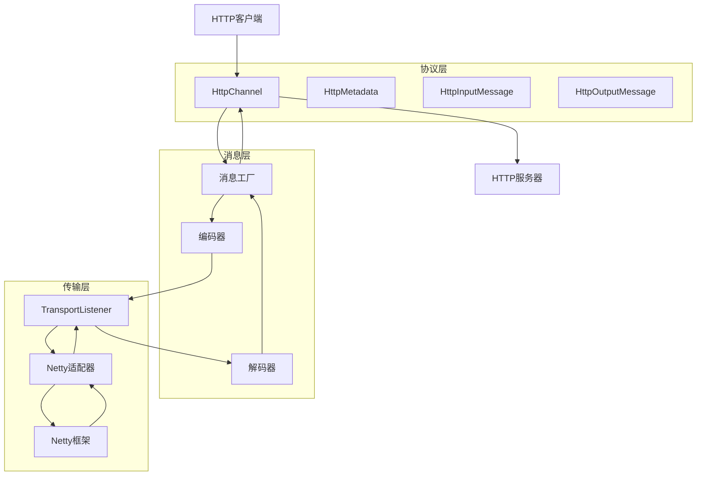
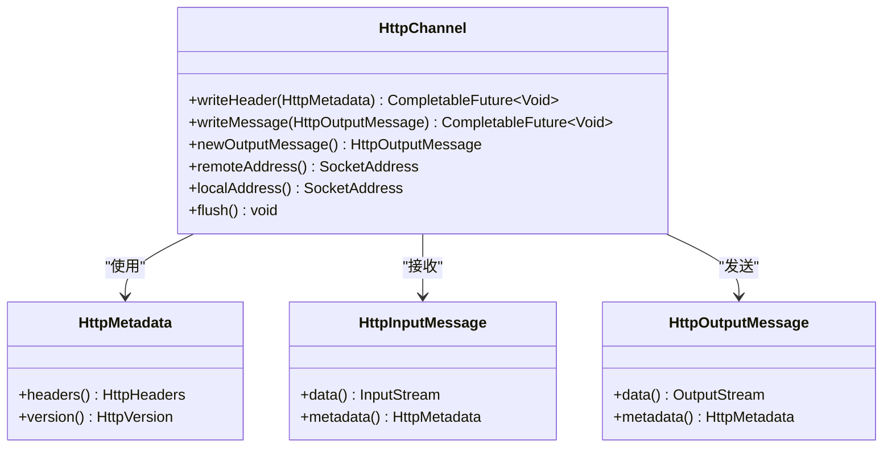
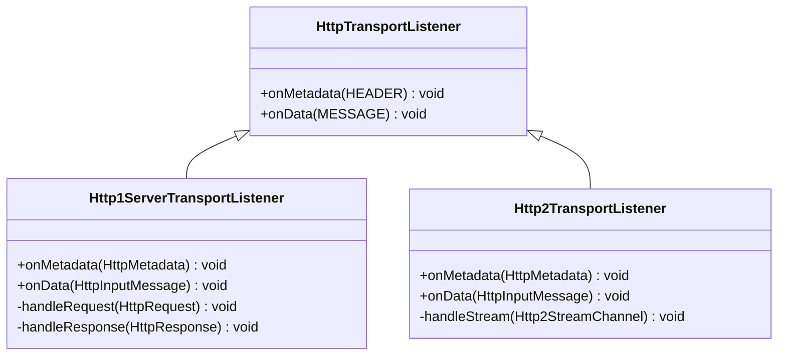
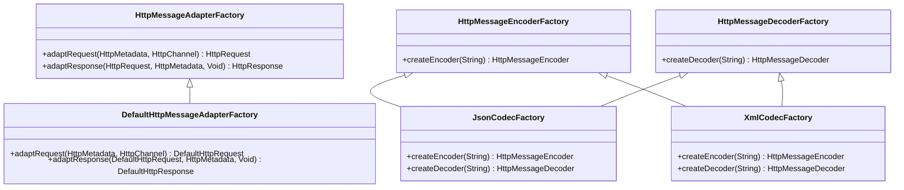
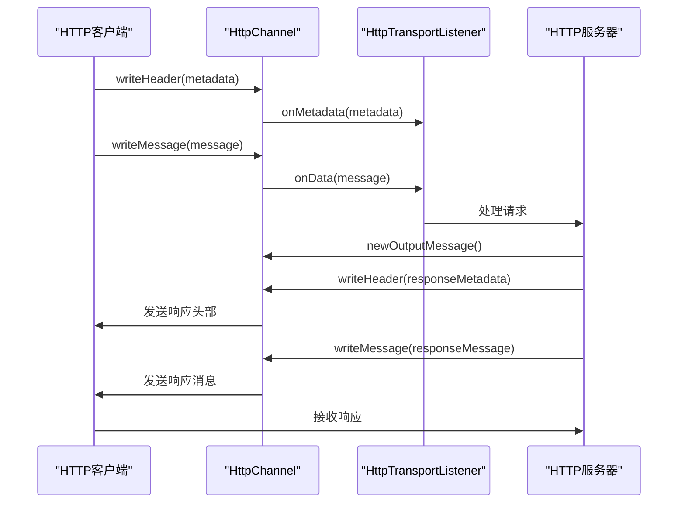
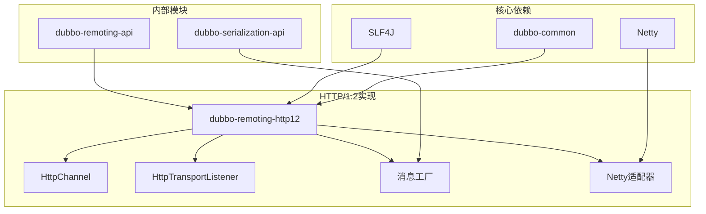

# HTTP1.2通信实现

<cite>
**本文档引用的文件**   
- [HttpChannel.java](file://dubbo-remoting\dubbo-remoting-http12\src\main\java\org\apache\dubbo\remoting\http12\HttpChannel.java)
- [HttpTransportListener.java](file://dubbo-remoting\dubbo-remoting-http12\src\main\java\org\apache\dubbo\remoting\http12\HttpTransportListener.java)
- [DefaultHttpRequest.java](file://dubbo-remoting\dubbo-remoting-http12\src\main\java\org\apache\dubbo\remoting\http12\message\DefaultHttpRequest.java)
- [DefaultHttpResponse.java](file://dubbo-remoting\dubbo-remoting-http12\src\main\java\org\apache\dubbo\remoting\http12\message\DefaultHttpResponse.java)
- [HttpMessageEncoderFactory](file://dubbo-remoting\dubbo-remoting-http12\src\main\resources\META-INF\dubbo\internal\org.apache.dubbo.remoting.http12.message.HttpMessageEncoderFactory)
- [HttpMessageDecoderFactory](file://dubbo-remoting\dubbo-remoting-http12\src\main\resources\META-INF\dubbo\internal\org.apache.dubbo.remoting.http12.message.HttpMessageDecoderFactory)
- [HttpMessageAdapterFactory](file://dubbo-remoting\dubbo-remoting-http12\src\main\resources\META-INF\dubbo\internal\org.apache.dubbo.remoting.http12.message.HttpMessageAdapterFactory)
- [DefaultHttpMessageAdapterFactory.java](file://dubbo-remoting\dubbo-remoting-http12\src\main\java\org\apache\dubbo\remoting\http12\message\DefaultHttpMessageAdapterFactory.java)
- [Http1ServerTransportListener.java](file://dubbo-remoting\dubbo-remoting-http12\src\main\java\org\apache\dubbo\remoting\http12\h1\Http1ServerTransportListener.java)
- [Http1ServerTransportListenerFactory.java](file://dubbo-remoting\dubbo-remoting-http12\src\main\java\org\apache\dubbo\remoting\http12\h1\Http1ServerTransportListenerFactory.java)
- [NettyHttp1Channel.java](file://dubbo-remoting\dubbo-remoting-http12\src\main\java\org\apache\dubbo\remoting\http12\netty4\h1\NettyHttp1Channel.java)
- [NettyHttp1Codec.java](file://dubbo-remoting\dubbo-remoting-http12\src\main\java\org\apache\dubbo\remoting\http12\netty4\h1\NettyHttp1Codec.java)
</cite>

## 目录
1. [引言](#引言)
2. [项目结构](#项目结构)
3. [核心组件](#核心组件)
4. [架构概述](#架构概述)
5. [详细组件分析](#详细组件分析)
6. [依赖分析](#依赖分析)
7. [性能考虑](#性能考虑)
8. [故障排除指南](#故障排除指南)
9. [结论](#结论)

## 引言
本文档详细介绍了Dubbo框架中HTTP/1.2通信的实现机制。重点阐述了HttpServer和HttpClient的实现原理，HTTP消息的编解码机制和消息工厂模式，以及HTTP头部、请求体和响应体的处理方式。文档还解释了HTTP连接的复用和管理策略，为初学者提供了配置和使用示例，同时为经验丰富的开发者提供了优化策略。

## 项目结构
HTTP/1.2通信实现位于dubbo-remoting-http12模块中，该模块是Dubbo远程通信层的一部分。项目结构清晰地分离了不同协议的实现，使得HTTP/1.2的实现独立且可扩展。

```mermaid
graph TB
subgraph "dubbo-remoting-http12"
subgraph "核心接口"
HttpChannel["HttpChannel"]
HttpTransportListener["HttpTransportListener"]
HttpMetadata["HttpMetadata"]
HttpInputMessage["HttpInputMessage"]
HttpOutputMessage["HttpOutputMessage"]
end
subgraph "消息处理"
message["message/"]
codec["codec/"]
DefaultHttpMessageAdapterFactory["DefaultHttpMessageAdapterFactory"]
end
subgraph "HTTP/1.x实现"
h1["h1/"]
Http1ServerTransportListener["Http1ServerTransportListener"]
Http1ServerTransportListenerFactory["Http1ServerTransportListenerFactory"]
end
subgraph "HTTP/2实现"
h2["h2/"]
Http2TransportListener["Http2TransportListener"]
Http2ServerTransportListenerFactory["Http2ServerTransportListenerFactory"]
end
subgraph "Netty4适配"
netty4["netty4/"]
NettyHttp1Channel["NettyHttp1Channel"]
NettyHttp1Codec["NettyHttp1Codec"]
end
subgraph "异常处理"
exception["exception/"]
HttpStatusException["HttpStatusException"]
HttpRequestTimeout["HttpRequestTimeout"]
end
HttpChannel --> h1
HttpTransportListener --> h1
HttpMetadata --> message
HttpInputMessage --> message
HttpOutputMessage --> message
message --> codec
h1 --> netty4
h2 --> netty4
h1 --> exception
h2 --> exception
```

**图示来源**
- [HttpChannel.java](file://dubbo-remoting\dubbo-remoting-http12\src\main\java\org\apache\dubbo\remoting\http12\HttpChannel.java)
- [HttpTransportListener.java](file://dubbo-remoting\dubbo-remoting-http12\src\main\java\org\apache\dubbo\remoting\http12\HttpTransportListener.java)
- [DefaultHttpMessageAdapterFactory.java](file://dubbo-remoting\dubbo-remoting-http12\src\main\java\org\apache\dubbo\remoting\http12\message\DefaultHttpMessageAdapterFactory.java)
- [Http1ServerTransportListener.java](file://dubbo-remoting\dubbo-remoting-http12\src\main\java\org\apache\dubbo\remoting\http12\h1\Http1ServerTransportListener.java)
- [Http1ServerTransportListenerFactory.java](file://dubbo-remoting\dubbo-remoting-http12\src\main\java\org\apache\dubbo\remoting\http12\h1\Http1ServerTransportListenerFactory.java)

**章节来源**
- [HttpChannel.java](file://dubbo-remoting\dubbo-remoting-http12\src\main\java\org\apache\dubbo\remoting\http12\HttpChannel.java)
- [HttpTransportListener.java](file://dubbo-remoting\dubbo-remoting-http12\src\main\java\org\apache\dubbo\remoting\http12\HttpTransportListener.java)

## 核心组件
HTTP/1.2通信实现的核心组件包括HttpChannel、HttpTransportListener、HttpRequest和HttpResponse。这些组件共同构成了HTTP通信的基础架构，提供了完整的请求-响应处理能力。

**章节来源**
- [HttpChannel.java](file://dubbo-remoting\dubbo-remoting-http12\src\main\java\org\apache\dubbo\remoting\http12\HttpChannel.java)
- [HttpTransportListener.java](file://dubbo-remoting\dubbo-remoting-http12\src\main\java\org\apache\dubbo\remoting\http12\HttpTransportListener.java)
- [DefaultHttpRequest.java](file://dubbo-remoting\dubbo-remoting-http12\src\main\java\org\apache\dubbo\remoting\http12\message\DefaultHttpRequest.java)
- [DefaultHttpResponse.java](file://dubbo-remoting\dubbo-remoting-http12\src\main\java\org\apache\dubbo\remoting\http12\message\DefaultHttpResponse.java)

## 架构概述
HTTP/1.2通信实现采用了分层架构设计，将协议处理、消息编解码、传输适配等职责分离。这种设计提高了代码的可维护性和可扩展性，同时也便于不同传输层的适配。



**图示来源**
- [HttpChannel.java](file://dubbo-remoting\dubbo-remoting-http12\src\main\java\org\apache\dubbo\remoting\http12\HttpChannel.java)
- [HttpTransportListener.java](file://dubbo-remoting\dubbo-remoting-http12\src\main\java\org\apache\dubbo\remoting\http12\HttpTransportListener.java)
- [HttpMessageEncoderFactory](file://dubbo-remoting\dubbo-remoting-http12\src\main\resources\META-INF\dubbo\internal\org.apache.dubbo.remoting.http12.message.HttpMessageEncoderFactory)
- [HttpMessageDecoderFactory](file://dubbo-remoting\dubbo-remoting-http12\src\main\resources\META-INF\dubbo\internal\org.apache.dubbo.remoting.http12.message.HttpMessageDecoderFactory)

## 详细组件分析

### HTTP通道分析
HttpChannel是HTTP通信的核心接口，定义了HTTP消息的发送和接收方法。它提供了写入头部、写入消息、创建输出消息等基本操作，是HTTP通信的基础。



**图示来源**
- [HttpChannel.java](file://dubbo-remoting\dubbo-remoting-http12\src\main\java\org\apache\dubbo\remoting\http12\HttpChannel.java)
- [HttpMetadata.java](file://dubbo-remoting\dubbo-remoting-http12\src\main\java\org\apache\dubbo\remoting\http12\HttpMetadata.java)
- [HttpInputMessage.java](file://dubbo-remoting\dubbo-remoting-http12\src\main\java\org\apache\dubbo\remoting\http12\HttpInputMessage.java)
- [HttpOutputMessage.java](file://dubbo-remoting\dubbo-remoting-http12\src\main\java\org\apache\dubbo\remoting\http12\HttpOutputMessage.java)

**章节来源**
- [HttpChannel.java](file://dubbo-remoting\dubbo-remoting-http12\src\main\java\org\apache\dubbo\remoting\http12\HttpChannel.java)

### 传输监听器分析
HttpTransportListener是HTTP传输的监听器接口，负责处理接收到的HTTP元数据和数据。它定义了onMetadata和onData两个方法，分别处理HTTP头部和消息体。



**图示来源**
- [HttpTransportListener.java](file://dubbo-remoting\dubbo-remoting-http12\src\main\java\org\apache\dubbo\remoting\http12\HttpTransportListener.java)
- [Http1ServerTransportListener.java](file://dubbo-remoting\dubbo-remoting-http12\src\main\java\org\apache\dubbo\remoting\http12\h1\Http1ServerTransportListener.java)
- [Http2TransportListener.java](file://dubbo-remoting\dubbo-remoting-http12\src\main\java\org\apache\dubbo\remoting\http12\h2\Http2TransportListener.java)

**章节来源**
- [HttpTransportListener.java](file://dubbo-remoting\dubbo-remoting-http12\src\main\java\org\apache\dubbo\remoting\http12\HttpTransportListener.java)
- [Http1ServerTransportListener.java](file://dubbo-remoting\dubbo-remoting-http12\src\main\java\org\apache\dubbo\remoting\http12\h1\Http1ServerTransportListener.java)

### 消息工厂模式分析
消息工厂模式是HTTP/1.2通信实现中的关键设计模式，通过SPI机制实现了消息编解码器的可扩展性。系统支持多种消息格式的编解码，包括JSON、XML、YAML等。



**图示来源**
- [HttpMessageAdapterFactory](file://dubbo-remoting\dubbo-remoting-http12\src\main\resources\META-INF\dubbo\internal\org.apache.dubbo.remoting.http12.message.HttpMessageAdapterFactory)
- [HttpMessageEncoderFactory](file://dubbo-remoting\dubbo-remoting-http12\src\main\resources\META-INF\dubbo\internal\org.apache.dubbo.remoting.http12.message.HttpMessageEncoderFactory)
- [HttpMessageDecoderFactory](file://dubbo-remoting\dubbo-remoting-http12\src\main\resources\META-INF\dubbo\internal\org.apache.dubbo.remoting.http12.message.HttpMessageDecoderFactory)
- [DefaultHttpMessageAdapterFactory.java](file://dubbo-remoting\dubbo-remoting-http12\src\main\java\org\apache\dubbo\remoting\http12\message\DefaultHttpMessageAdapterFactory.java)

**章节来源**
- [HttpMessageAdapterFactory](file://dubbo-remoting\dubbo-remoting-http12\src\main\resources\META-INF\dubbo\internal\org.apache.dubbo.remoting.http12.message.HttpMessageAdapterFactory)
- [HttpMessageEncoderFactory](file://dubbo-remoting\dubbo-remoting-http12\src\main\resources\META-INF\dubbo\internal\org.apache.dubbo.remoting.http12.message.HttpMessageEncoderFactory)
- [HttpMessageDecoderFactory](file://dubbo-remoting\dubbo-remoting-http12\src\main\resources\META-INF\dubbo\internal\org.apache.dubbo.remoting.http12.message.HttpMessageDecoderFactory)
- [DefaultHttpMessageAdapterFactory.java](file://dubbo-remoting\dubbo-remoting-http12\src\main\java\org\apache\dubbo\remoting\http12\message\DefaultHttpMessageAdapterFactory.java)

### 请求响应流程分析
HTTP/1.2通信的请求-响应流程是一个典型的异步处理过程，从客户端发起请求到服务器返回响应，经过了多个处理阶段。



**图示来源**
- [HttpChannel.java](file://dubbo-remoting\dubbo-remoting-http12\src\main\java\org\apache\dubbo\remoting\http12\HttpChannel.java)
- [HttpTransportListener.java](file://dubbo-remoting\dubbo-remoting-http12\src\main\java\org\apache\dubbo\remoting\http12\HttpTransportListener.java)
- [DefaultHttpRequest.java](file://dubbo-remoting\dubbo-remoting-http12\src\main\java\org\apache\dubbo\remoting\http12\message\DefaultHttpRequest.java)
- [DefaultHttpResponse.java](file://dubbo-remoting\dubbo-remoting-http12\src\main\java\org\apache\dubbo\remoting\http12\message\DefaultHttpResponse.java)

**章节来源**
- [HttpChannel.java](file://dubbo-remoting\dubbo-remoting-http12\src\main\java\org\apache\dubbo\remoting\http12\HttpChannel.java)
- [HttpTransportListener.java](file://dubbo-remoting\dubbo-remoting-http12\src\main\java\org\apache\dubbo\remoting\http12\HttpTransportListener.java)

## 依赖分析
HTTP/1.2通信实现依赖于多个核心组件和外部库，这些依赖关系确保了系统的稳定性和可扩展性。



**图示来源**
- [pom.xml](file://dubbo-remoting\dubbo-remoting-http12\pom.xml)
- [HttpChannel.java](file://dubbo-remoting\dubbo-remoting-http12\src\main\java\org\apache\dubbo\remoting\http12\HttpChannel.java)
- [HttpTransportListener.java](file://dubbo-remoting\dubbo-remoting-http12\src\main\java\org\apache\dubbo\remoting\http12\HttpTransportListener.java)

**章节来源**
- [pom.xml](file://dubbo-remoting\dubbo-remoting-http12\pom.xml)

## 性能考虑
HTTP/1.2通信实现考虑了多种性能优化策略，包括连接复用、缓冲区管理、异步处理等。这些策略有助于提高系统的吞吐量和响应速度。

**章节来源**
- [HttpChannel.java](file://dubbo-remoting\dubbo-remoting-http12\src\main\java\org\apache\dubbo\remoting\http12\HttpChannel.java)
- [HttpTransportListener.java](file://dubbo-remoting\dubbo-remoting-http12\src\main\java\org\apache\dubbo\remoting\http12\HttpTransportListener.java)
- [NettyHttp1Channel.java](file://dubbo-remoting\dubbo-remoting-http12\src\main\java\org\apache\dubbo\remoting\http12\netty4\h1\NettyHttp1Channel.java)

## 故障排除指南
HTTP/1.2通信实现提供了完善的错误处理机制，包括异常分类、错误码定义、异常传播等。这些机制有助于快速定位和解决通信问题。

**章节来源**
- [exception/](file://dubbo-remoting\dubbo-remoting-http12\src\main\java\org\apache\dubbo\remoting\http12\exception)
- [HttpStatus.java](file://dubbo-remoting\dubbo-remoting-http12\src\main\java\org\apache\dubbo\remoting\http12\HttpStatus.java)

## 结论
HTTP/1.2通信实现在Dubbo框架中扮演着重要角色，它提供了高效、可靠的HTTP通信能力。通过分层架构设计和SPI扩展机制，系统具有良好的可维护性和可扩展性。对于初学者，可以通过简单的配置快速上手；对于经验丰富的开发者，可以深入优化系统性能。