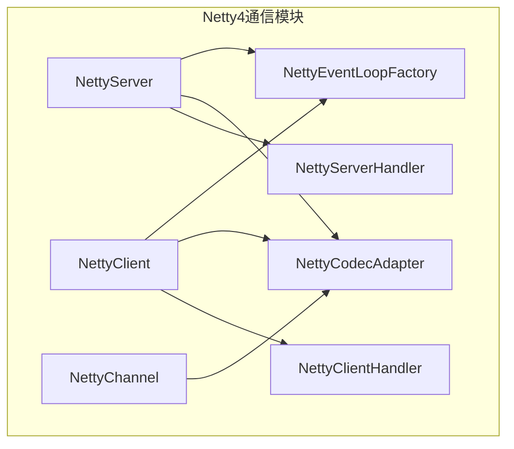
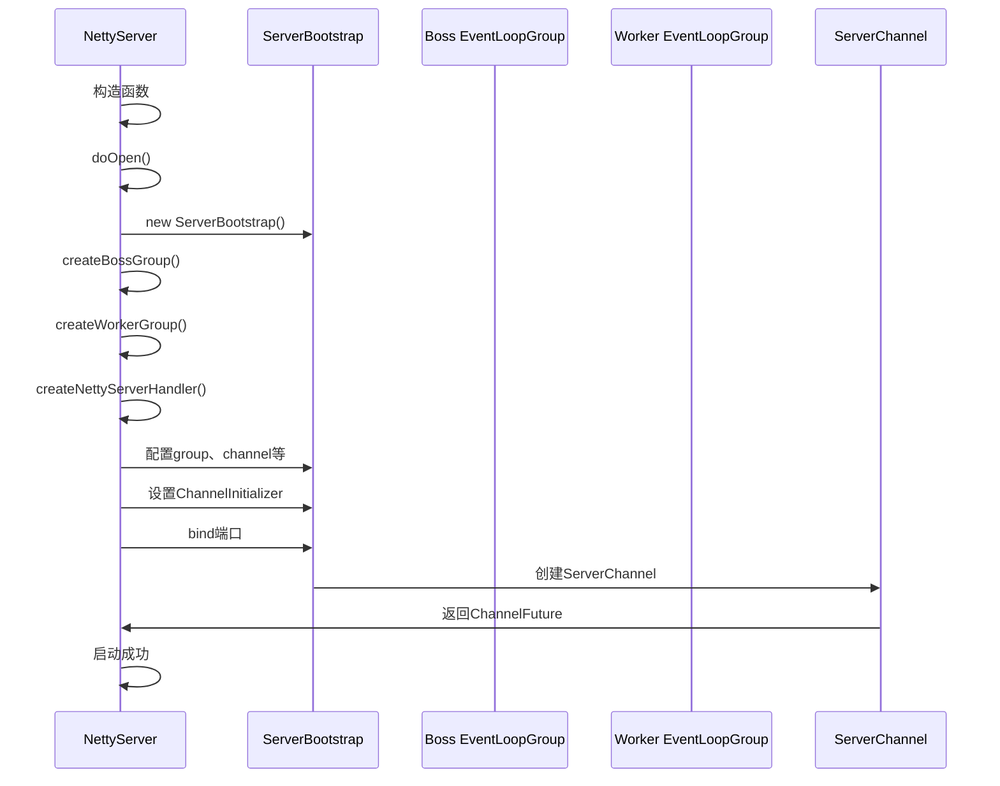
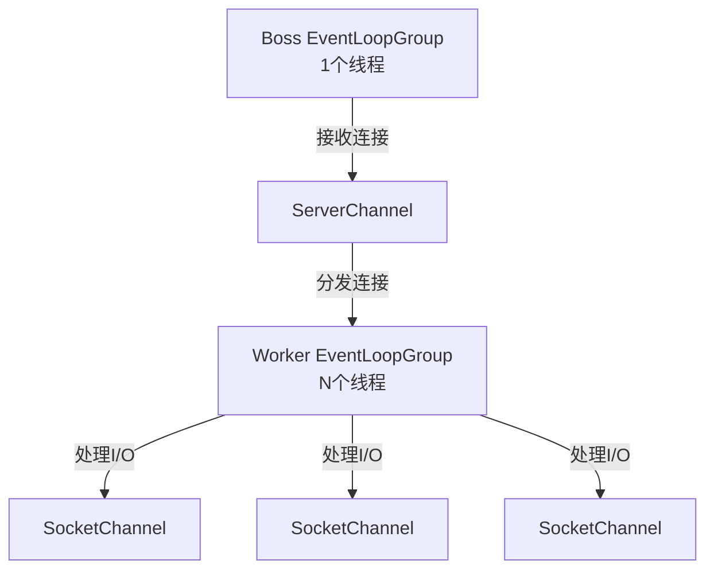
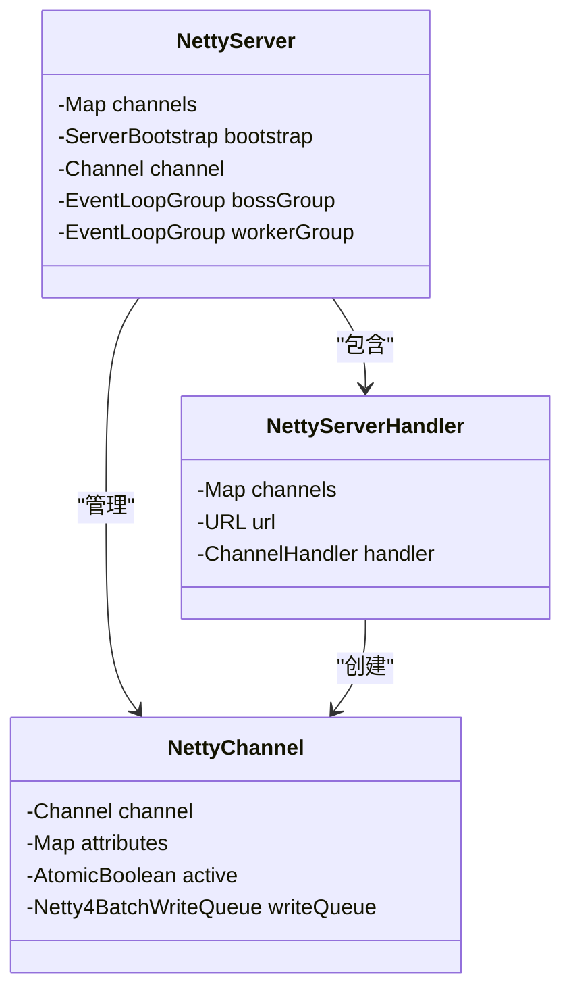
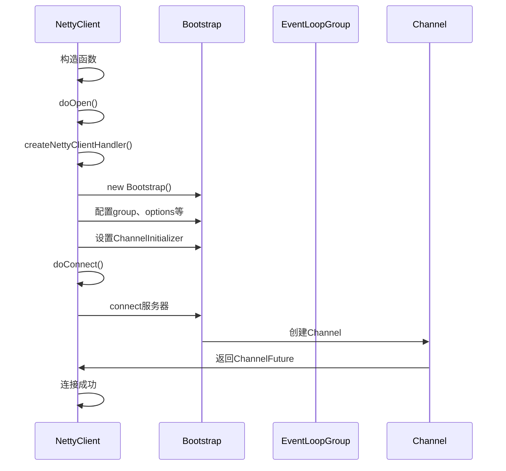
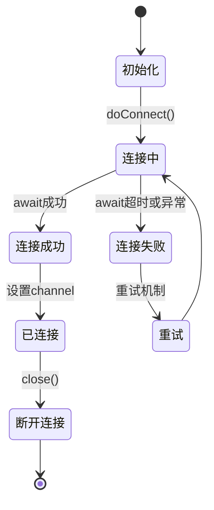
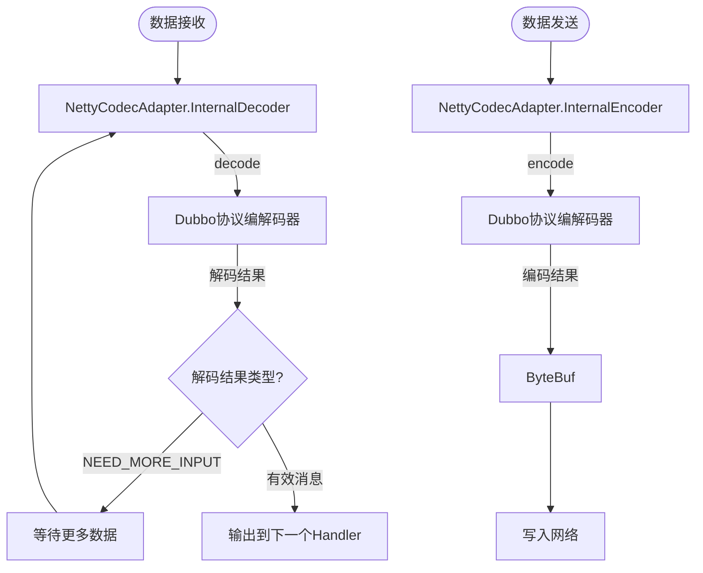
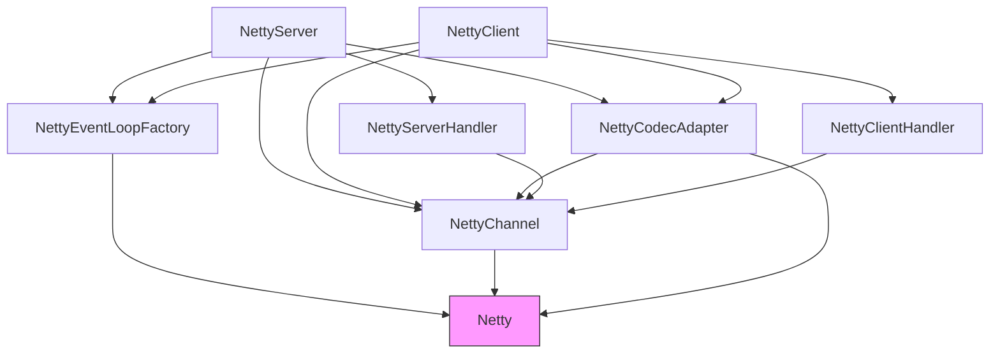

# Netty4通信实现

<cite>
**本文档引用的文件**   
- [NettyServer.java](file://dubbo-remoting\dubbo-remoting-netty4\src\main\java\org\apache\dubbo\remoting\transport\netty4\NettyServer.java)
- [NettyClient.java](file://dubbo-remoting\dubbo-remoting-netty4\src\main\java\org\apache\dubbo\remoting\transport\netty4\NettyClient.java)
- [NettyCodecAdapter.java](file://dubbo-remoting\dubbo-remoting-netty4\src\main\java\org\apache\dubbo\remoting\transport\netty4\NettyCodecAdapter.java)
- [NettyChannel.java](file://dubbo-remoting\dubbo-remoting-netty4\src\main\java\org\apache\dubbo\remoting\transport\netty4\NettyChannel.java)
- [NettyServerHandler.java](file://dubbo-remoting\dubbo-remoting-netty4\src\main\java\org\apache\dubbo\remoting\transport\netty4\NettyServerHandler.java)
- [NettyClientHandler.java](file://dubbo-remoting\dubbo-remoting-netty4\src\main\java\org\apache\dubbo\remoting\transport\netty4\NettyClientHandler.java)
- [NettyEventLoopFactory.java](file://dubbo-remoting\dubbo-remoting-netty4\src\main\java\org\apache\dubbo\remoting\transport\netty4\NettyEventLoopFactory.java)
</cite>

## 目录
1. [简介](#简介)
2. [项目结构](#项目结构)
3. [核心组件](#核心组件)
4. [架构概述](#架构概述)
5. [详细组件分析](#详细组件分析)
6. [依赖分析](#依赖分析)
7. [性能考虑](#性能考虑)
8. [故障排除指南](#故障排除指南)
9. [结论](#结论)

## 简介
本文档详细介绍了基于Netty4框架的服务器和客户端实现，重点分析了Dubbo框架中Netty4通信的实现机制。文档涵盖了NettyServer和NettyClient的启动流程、线程模型和连接管理机制，解释了NettyCodecAdapter如何实现Dubbo协议的编解码，以及Netty的ChannelPipeline配置和Handler链的处理流程。同时为初学者提供了配置示例，并为经验丰富的开发者提供了性能调优建议。

## 项目结构
Dubbo项目中的Netty4通信实现主要位于`dubbo-remoting-netty4`模块中，该模块提供了基于Netty4的网络通信功能。项目结构清晰地分离了服务器端和客户端的实现，以及相关的编解码器、处理器和工具类。



**图源**
- [NettyServer.java](file://dubbo-remoting\dubbo-remoting-netty4\src\main\java\org\apache\dubbo\remoting\transport\netty4\NettyServer.java)
- [NettyClient.java](file://dubbo-remoting\dubbo-remoting-netty4\src\main\java\org\apache\dubbo\remoting\transport\netty4\NettyClient.java)
- [NettyCodecAdapter.java](file://dubbo-remoting\dubbo-remoting-netty4\src\main\java\org\apache\dubbo\remoting\transport\netty4\NettyCodecAdapter.java)
- [NettyChannel.java](file://dubbo-remoting\dubbo-remoting-netty4\src\main\java\org\apache\dubbo\remoting\transport\netty4\NettyChannel.java)
- [NettyServerHandler.java](file://dubbo-remoting\dubbo-remoting-netty4\src\main\java\org\apache\dubbo\remoting\transport\netty4\NettyServerHandler.java)
- [NettyClientHandler.java](file://dubbo-remoting\dubbo-remoting-netty4\src\main\java\org\apache\dubbo\remoting\transport\netty4\NettyClientHandler.java)
- [NettyEventLoopFactory.java](file://dubbo-remoting\dubbo-remoting-netty4\src\main\java\org\apache\dubbo\remoting\transport\netty4\NettyEventLoopFactory.java)

## 核心组件

Netty4通信实现的核心组件包括NettyServer、NettyClient、NettyCodecAdapter、NettyChannel等。这些组件协同工作，实现了高效、可靠的网络通信功能。

**组件源**
- [NettyServer.java](file://dubbo-remoting\dubbo-remoting-netty4\src\main\java\org\apache\dubbo\remoting\transport\netty4\NettyServer.java#L63-L285)
- [NettyClient.java](file://dubbo-remoting\dubbo-remoting-netty4\src\main\java\org\apache\dubbo\remoting\transport\netty4\NettyClient.java#L60-L314)
- [NettyCodecAdapter.java](file://dubbo-remoting\dubbo-remoting-netty4\src\main\java\org\apache\dubbo\remoting\transport\netty4\NettyCodecAdapter.java#L37-L123)
- [NettyChannel.java](file://dubbo-remoting\dubbo-remoting-netty4\src\main\java\org\apache\dubbo\remoting\transport\netty4\NettyChannel.java#L60-L384)

## 架构概述

Netty4通信架构基于Netty的事件驱动模型，采用主从Reactor线程模型。服务器端使用两个EventLoopGroup：bossGroup负责接收客户端连接，workerGroup负责处理I/O操作。客户端则使用单个EventLoopGroup处理所有网络操作。

```mermaid
graph TB
subgraph "服务器端"
BossGroup[Boss EventLoopGroup]
WorkerGroup[Worker EventLoopGroup]
ServerBootstrap[ServerBootstrap]
ServerChannel[ServerChannel]
SocketChannel[SocketChannel]
BossGroup --> ServerBootstrap
WorkerGroup --> ServerBootstrap
ServerBootstrap --> ServerChannel
ServerChannel --> SocketChannel
end
subgraph "客户端"
ClientGroup[EventLoopGroup]
Bootstrap[Bootstrap]
Channel[Channel]
ClientGroup --> Bootstrap
Bootstrap --> Channel
end
SocketChannel < --> Channel
```

**图源**
- [NettyServer.java](file://dubbo-remoting\dubbo-remoting-netty4\src\main\java\org\apache\dubbo\remoting\transport\netty4\NettyServer.java#L97-L188)
- [NettyClient.java](file://dubbo-remoting\dubbo-remoting-netty4\src\main\java\org\apache\dubbo\remoting\transport\netty4\NettyClient.java#L103-L149)
- [NettyEventLoopFactory.java](file://dubbo-remoting\dubbo-remoting-netty4\src\main\java\org\apache\dubbo\remoting\transport\netty4\NettyEventLoopFactory.java#L50-L65)

## 详细组件分析

### NettyServer分析
NettyServer是基于Netty4的服务器实现，继承自AbstractServer，负责监听端口、接收客户端连接并处理网络I/O事件。

#### 启动流程


**图源**
- [NettyServer.java](file://dubbo-remoting\dubbo-remoting-netty4\src\main\java\org\apache\dubbo\remoting\transport\netty4\NettyServer.java#L95-L119)

#### 线程模型
NettyServer采用主从Reactor线程模型，其中：
- bossGroup：通常只有1个线程，负责接收客户端连接请求
- workerGroup：多个线程（默认为CPU核心数*2），负责处理已建立连接的I/O操作



**图源**
- [NettyServer.java](file://dubbo-remoting\dubbo-remoting-netty4\src\main\java\org\apache\dubbo\remoting\transport\netty4\NettyServer.java#L153-L161)
- [NettyEventLoopFactory.java](file://dubbo-remoting\dubbo-remoting-netty4\src\main\java\org\apache\dubbo\remoting\transport\netty4\NettyEventLoopFactory.java#L50-L56)

#### 连接管理
NettyServer通过ConcurrentHashMap维护所有活跃的客户端连接，每个连接对应一个NettyChannel实例。



**图源**
- [NettyServer.java](file://dubbo-remoting\dubbo-remoting-netty4\src\main\java\org\apache\dubbo\remoting\transport\netty4\NettyServer.java#L69-L80)
- [NettyServerHandler.java](file://dubbo-remoting\dubbo-remoting-netty4\src\main\java\org\apache\dubbo\remoting\transport\netty4\NettyServerHandler.java#L51-L58)
- [NettyChannel.java](file://dubbo-remoting\dubbo-remoting-netty4\src\main\java\org\apache\dubbo\remoting\transport\netty4\NettyChannel.java#L66-L77)

### NettyClient分析
NettyClient是基于Netty4的客户端实现，负责与服务器建立连接并发送请求。

#### 启动流程


**图源**
- [NettyClient.java](file://dubbo-remoting\dubbo-remoting-netty4\src\main\java\org\apache\dubbo\remoting\transport\netty4\NettyClient.java#L101-L150)

#### 连接管理
NettyClient使用volatile变量channel来引用当前的网络连接，每次成功连接都会替换该引用并关闭旧连接。



**图源**
- [NettyClient.java](file://dubbo-remoting\dubbo-remoting-netty4\src\main\java\org\apache\dubbo\remoting\transport\netty4\NettyClient.java#L158-L270)

### NettyCodecAdapter分析
NettyCodecAdapter负责将Dubbo协议的编解码器适配到Netty的ChannelHandler中。

#### 编解码流程


**图源**
- [NettyCodecAdapter.java](file://dubbo-remoting\dubbo-remoting-netty4\src\main\java\org\apache\dubbo\remoting\transport\netty4\NettyCodecAdapter.java#L63-L122)

#### ChannelPipeline配置
NettyServer和NettyClient的ChannelPipeline配置了相同的Handler链，但顺序和参数略有不同。

```mermaid
graph TB
subgraph "服务器端Pipeline"
SslServer["SslServerTlsHandler"]
Decoder["NettyCodecAdapter.getDecoder()"]
Encoder["NettyCodecAdapter.getEncoder()"]
IdleHandler["IdleStateHandler"]
Handler["NettyServerHandler"]
SslServer --> Decoder
Decoder --> Encoder
Encoder --> IdleHandler
IdleHandler --> Handler
end
subgraph "客户端Pipeline"
SslClient["SslClientTlsHandler"]
CDecoder["NettyCodecAdapter.getDecoder()"]
CEncoder["NettyCodecAdapter.getEncoder()"]
CIdleHandler["IdleStateHandler"]
CHandler["NettyClientHandler"]
SslClient --> CDecoder
CDecoder --> CEncoder
CEncoder --> CIdleHandler
CIdleHandler --> CHandler
end
```



**图源**
- [NettyServer.java](file://dubbo-remoting\dubbo-remoting-netty4\src\main\java\org\apache\dubbo\remoting\transport\netty4\NettyServer.java#L176-L186)
- [NettyClient.java](file://dubbo-remoting\dubbo-remoting-netty4\src\main\java\org\apache\dubbo\remoting\transport\netty4\NettyClient.java#L133-L137)

## 依赖分析

Netty4通信实现依赖于多个核心组件和外部库，形成了清晰的依赖关系。



**图源**
- [NettyServer.java](file://dubbo-remoting\dubbo-remoting-netty4\src\main\java\org\apache\dubbo\remoting\transport\netty4\NettyServer.java)
- [NettyClient.java](file://dubbo-remoting\dubbo-remoting-netty4\src\main\java\org\apache\dubbo\remoting\transport\netty4\NettyClient.java)
- [NettyCodecAdapter.java](file://dubbo-remoting\dubbo-remoting-netty4\src\main\java\org\apache\dubbo\remoting\transport\netty4\NettyCodecAdapter.java)
- [NettyChannel.java](file://dubbo-remoting\dubbo-remoting-netty4\src\main\java\org\apache\dubbo\remoting\transport\netty4\NettyChannel.java)
- [NettyServerHandler.java](file://dubbo-remoting\dubbo-remoting-netty4\src\main\java\org\apache\dubbo\remoting\transport\netty4\NettyServerHandler.java)
- [NettyClientHandler.java](file://dubbo-remoting\dubbo-remoting-netty4\src\main\java\org\apache\dubbo\remoting\transport\netty4\NettyClientHandler.java)
- [NettyEventLoopFactory.java](file://dubbo-remoting\dubbo-remoting-netty4\src\main\java\org\apache\dubbo\remoting\transport\netty4\NettyEventLoopFactory.java)

## 性能考虑

### 线程池配置
Netty4通信的性能与线程池配置密切相关。建议根据实际应用场景调整线程数：

- 服务器端workerGroup线程数：默认为CPU核心数*2，可根据并发连接数调整
- 客户端EventLoopGroup线程数：默认为CPU核心数*2，可根据并发请求量调整

### TCP参数优化
Netty4通信支持多种TCP参数优化：

- SO_REUSEADDR：允许端口重用，避免TIME_WAIT状态
- TCP_NODELAY：禁用Nagle算法，减少小数据包延迟
- SO_KEEPALIVE：启用TCP保活机制，检测连接状态
- ALLOCATOR：使用PooledByteBufAllocator提高内存分配效率

### 编解码优化
- 使用PooledByteBufAllocator减少内存分配开销
- 合理设置编解码缓冲区大小
- 考虑在I/O线程外进行编解码以避免阻塞

## 故障排除指南

### 常见问题
1. **连接超时**：检查网络状况、防火墙设置和服务器负载
2. **内存泄漏**：确保正确释放ByteBuf引用
3. **性能瓶颈**：分析线程池使用情况和GC日志
4. **SSL/TLS握手失败**：检查证书配置和协议版本兼容性

### 调试技巧
- 启用Netty的调试日志
- 使用Netty的内存泄漏检测工具
- 监控EventLoop的执行时间和任务队列长度
- 分析网络抓包数据

**组件源**
- [NettyServer.java](file://dubbo-remoting\dubbo-remoting-netty4\src\main\java\org\apache\dubbo\remoting\transport\netty4\NettyServer.java)
- [NettyClient.java](file://dubbo-remoting\dubbo-remoting-netty4\src\main\java\org\apache\dubbo\remoting\transport\netty4\NettyClient.java)
- [NettyChannel.java](file://dubbo-remoting\dubbo-remoting-netty4\src\main\java\org\apache\dubbo\remoting\transport\netty4\NettyChannel.java)

## 结论
Netty4通信实现为Dubbo框架提供了高效、可靠的网络通信能力。通过主从Reactor线程模型、灵活的ChannelPipeline配置和高效的编解码机制，实现了高性能的RPC通信。开发者可以根据具体需求进行配置优化和性能调优，以满足不同场景下的性能要求。