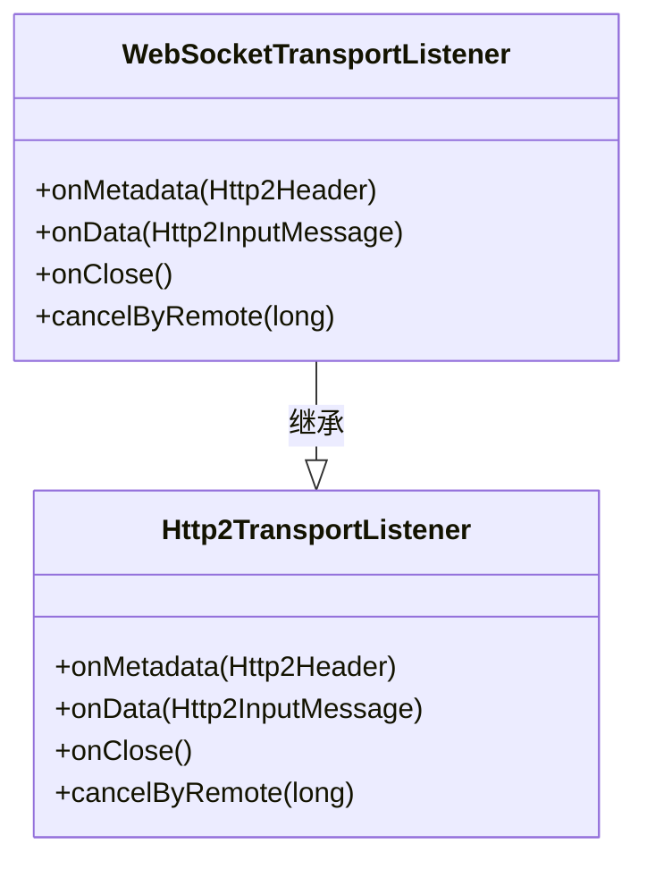
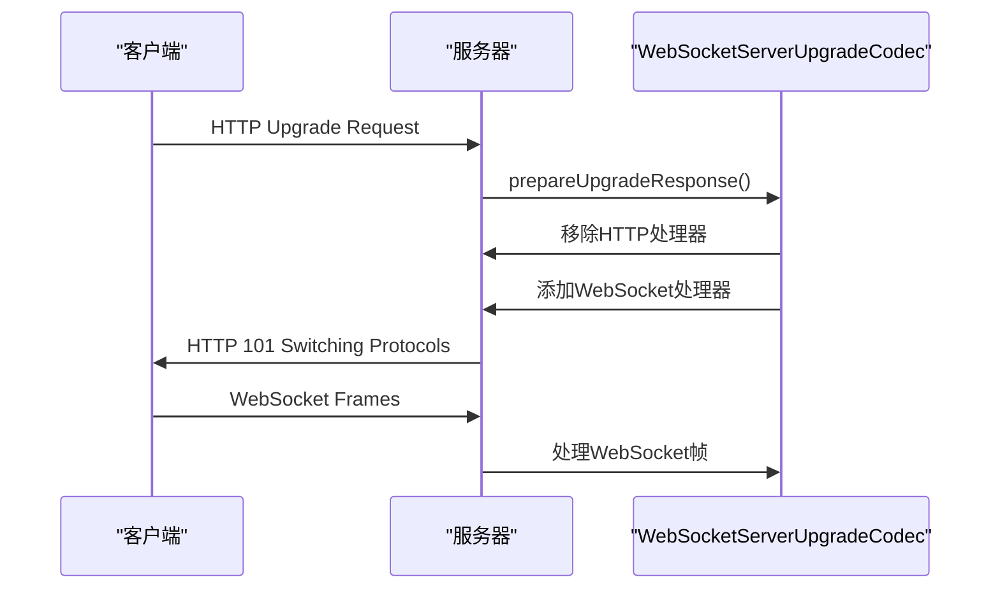
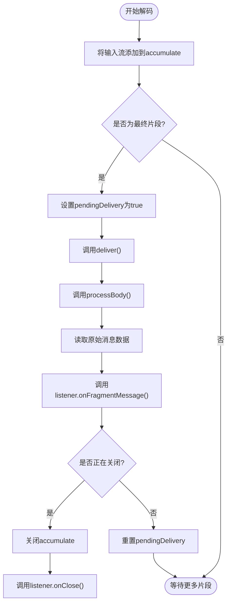
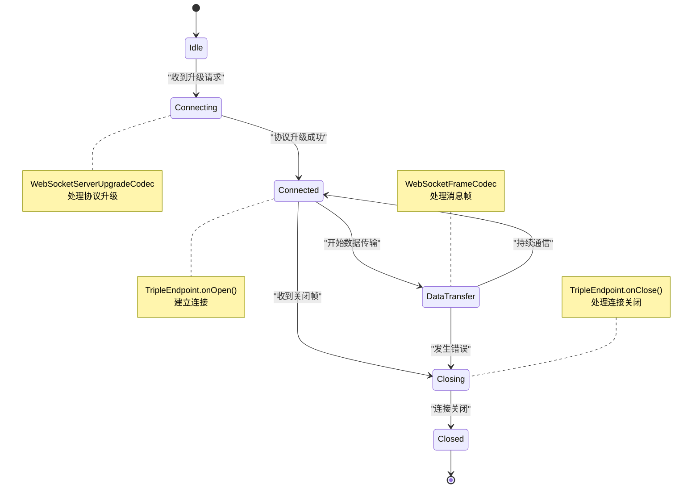
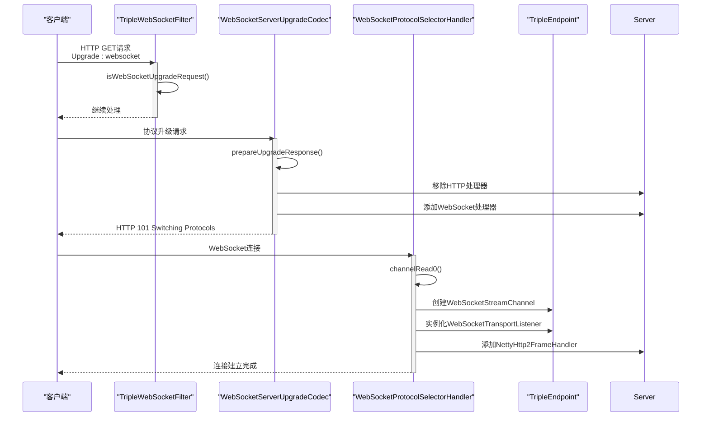
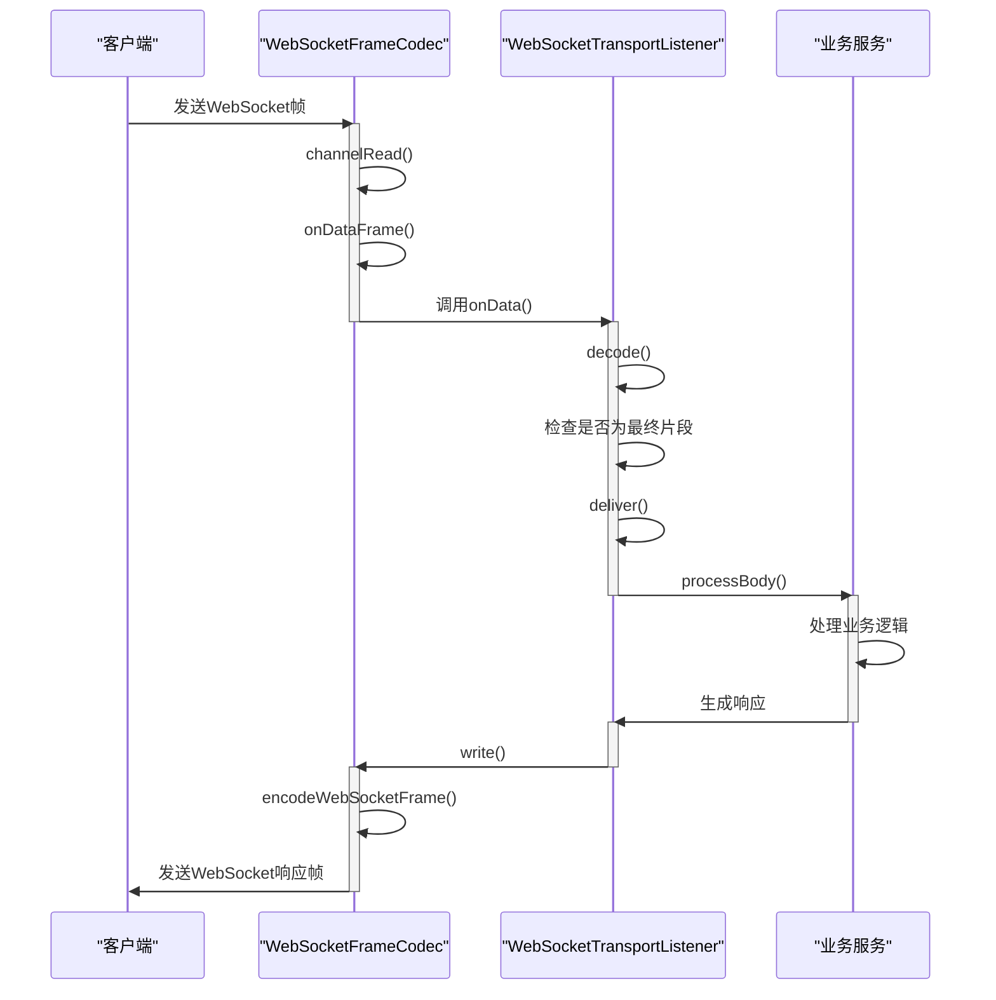

# WebSocket通信实现

<cite>
**本文档引用的文件**
- [WebSocketTransportListener.java](file://dubbo-remoting\dubbo-remoting-websocket\src\main\java\org\apache\dubbo\remoting\websocket\WebSocketTransportListener.java)
- [WebSocketServerTransportListenerFactory.java](file://dubbo-remoting\dubbo-remoting-websocket\src\main\java\org\apache\dubbo\remoting\websocket\WebSocketServerTransportListenerFactory.java)
- [FinalFragmentStreamingDecoder.java](file://dubbo-remoting\dubbo-remoting-websocket\src\main\java\org\apache\dubbo\remoting\websocket\FinalFragmentStreamingDecoder.java)
- [WebSocketServerUpgradeCodec.java](file://dubbo-remoting\dubbo-remoting-websocket\src\main\java\org\apache\dubbo\remoting\websocket\netty4\WebSocketServerUpgradeCodec.java)
- [WebSocketFrameCodec.java](file://dubbo-remoting\dubbo-remoting-websocket\src\main\java\org\apache\dubbo\remoting\websocket\netty4\WebSocketFrameCodec.java)
- [WebSocketProtocolSelectorHandler.java](file://dubbo-remoting\dubbo-remoting-websocket\src\main\java\org\apache\dubbo\remoting\websocket\netty4\WebSocketProtocolSelectorHandler.java)
- [TripleEndpoint.java](file://dubbo-plugin\dubbo-triple-websocket\src\main\java\org\apache\dubbo\rpc\protocol\tri\websocket\TripleEndpoint.java)
- [TripleWebSocketFilter.java](file://dubbo-plugin\dubbo-triple-websocket\src\main\java\org\apache\dubbo\rpc\protocol\tri\websocket\TripleWebSocketFilter.java)
- [WebSocketStreamChannel.java](file://dubbo-plugin\dubbo-triple-websocket\src\main\java\org\apache\dubbo\rpc\protocol\tri\websocket\WebSocketStreamChannel.java)
- [TripleHttp2Protocol.java](file://dubbo-rpc\dubbo-rpc-triple\src\main\java\org\apache\dubbo\rpc\protocol\tri\TripleHttp2Protocol.java)
</cite>

## 目录
1. [引言](#引言)
2. [WebSocketTransportListener监听机制](#websockettransportlistener监听机制)
3. [WebSocketServerUpgradeCodec协议升级处理](#websocketserverupgradecodec协议升级处理)
4. [FinalFragmentStreamingDecoder消息分片处理](#finalfragmentstreamingdecoder消息分片处理)
5. [WebSocket连接生命周期管理](#websocket连接生命周期管理)
6. [配置示例与最佳实践](#配置示例与最佳实践)
7. [WebSocket握手流程图](#websocket握手流程图)
8. [消息传输时序图](#消息传输时序图)

## 引言
本文档详细介绍了Dubbo框架中基于WebSocket协议的双向通信实现。WebSocket作为一种全双工通信协议，允许客户端和服务器之间建立持久连接，实现高效的数据交换。文档重点分析了WebSocketTransportListener的监听机制、WebSocketServerUpgradeCodec对HTTP到WebSocket协议升级的处理、FinalFragmentStreamingDecoder对消息分片的处理策略，以及WebSocket连接的完整生命周期管理。为开发者提供了从基础配置到高级最佳实践的全面指导。

## WebSocketTransportListener监听机制
WebSocketTransportListener是WebSocket通信的核心监听接口，继承自Http2TransportListener，负责处理WebSocket连接的各个生命周期事件。该接口定义了WebSocket连接的元数据处理、数据接收、连接关闭等关键方法。

当WebSocket连接建立时，TripleEndpoint的onOpen方法会创建WebSocketStreamChannel并实例化WebSocketTransportListener，将其与会话关联。监听器通过onMetadata方法接收连接元数据，通过onData方法接收来自客户端的消息数据，通过onClose方法处理连接正常关闭，通过cancelByRemote方法处理远程异常关闭。



**图源**
- [WebSocketTransportListener.java](file://dubbo-remoting\dubbo-remoting-websocket\src\main\java\org\apache\dubbo\remoting\websocket\WebSocketTransportListener.java)

**本节源码**
- [WebSocketTransportListener.java](file://dubbo-remoting\dubbo-remoting-websocket\src\main\java\org\apache\dubbo\remoting\websocket\WebSocketTransportListener.java)
- [TripleEndpoint.java](file://dubbo-plugin\dubbo-triple-websocket\src\main\java\org\apache\dubbo\rpc\protocol\tri\websocket\TripleEndpoint.java)

## WebSocketServerUpgradeCodec协议升级处理
WebSocketServerUpgradeCodec负责处理从HTTP协议到WebSocket协议的升级过程。当客户端发送WebSocket升级请求时，该编解码器会执行协议升级的准备工作，包括移除不再需要的HTTP处理器和添加WebSocket专用的处理器。

在prepareUpgradeResponse方法中，编解码器会从Netty管道中移除HttpObjectAggregator、NettyHttp1Codec等HTTP处理器，并添加WebSocketServerCompressionHandler、WebSocketProtocolSelectorHandler等WebSocket处理器。这种动态的管道重构确保了连接升级后能够正确处理WebSocket帧。



**图源**
- [WebSocketServerUpgradeCodec.java](file://dubbo-remoting\dubbo-remoting-websocket\src\main\java\org\apache\dubbo\remoting\websocket\netty4\WebSocketServerUpgradeCodec.java)
- [TripleHttp2Protocol.java](file://dubbo-rpc\dubbo-rpc-triple\src\main\java\org\apache\dubbo\rpc\protocol\tri\TripleHttp2Protocol.java)

**本节源码**
- [WebSocketServerUpgradeCodec.java](file://dubbo-remoting\dubbo-remoting-websocket\src\main\java\org\apache\dubbo\remoting\websocket\netty4\WebSocketServerUpgradeCodec.java)
- [TripleHttp2Protocol.java](file://dubbo-rpc\dubbo-rpc-triple\src\main\java\org\apache\dubbo\rpc\protocol\tri\TripleHttp2Protocol.java)

## FinalFragmentStreamingDecoder消息分片处理
FinalFragmentStreamingDecoder是处理WebSocket消息分片的核心组件，实现了StreamingDecoder接口。该解码器负责将可能分片的WebSocket消息流重组为完整的消息，确保应用层能够接收到完整的消息数据。

解码器维护了一个CompositeInputStream来累积接收到的数据片段。当接收到的数据流实现了FinalFragment接口且isFinalFragment()返回true时，表示这是消息的最后一个片段，解码器会触发deliver()方法将累积的数据传递给监听器。这种设计支持WebSocket协议的消息分片特性，允许大消息被分割成多个帧传输。



**图源**
- [FinalFragmentStreamingDecoder.java](file://dubbo-remoting\dubbo-remoting-websocket\src\main\java\org\apache\dubbo\remoting\websocket\FinalFragmentStreamingDecoder.java)

**本节源码**
- [FinalFragmentStreamingDecoder.java](file://dubbo-remoting\dubbo-remoting-websocket\src\main\java\org\apache\dubbo\remoting\websocket\FinalFragmentStreamingDecoder.java)
- [FinalFragment.java](file://dubbo-remoting\dubbo-remoting-websocket\src\main\java\org\apache\dubbo\remoting\websocket\FinalFragment.java)

## WebSocket连接生命周期管理
WebSocket连接的生命周期管理涵盖了从连接建立到关闭的完整过程。系统通过一系列组件协同工作，确保连接的正确建立、数据传输和优雅关闭。

连接生命周期始于客户端的HTTP升级请求，经过TripleWebSocketFilter的过滤和WebSocketServerUpgradeCodec的协议升级处理，最终由TripleEndpoint的onOpen方法完成连接建立。在连接期间，WebSocketFrameCodec负责将WebSocket帧转换为Http2InputMessage，供上层应用处理。连接关闭时，系统会通过onClose和onError方法处理正常和异常关闭情况。



**图源**
- [TripleEndpoint.java](file://dubbo-plugin\dubbo-triple-websocket\src\main\java\org\apache\dubbo\rpc\protocol\tri\websocket\TripleEndpoint.java)
- [WebSocketFrameCodec.java](file://dubbo-remoting\dubbo-remoting-websocket\src\main\java\org\apache\dubbo\remoting\websocket\netty4\WebSocketFrameCodec.java)

**本节源码**
- [TripleEndpoint.java](file://dubbo-plugin\dubbo-triple-websocket\src\main\java\org\apache\dubbo\rpc\protocol\tri\websocket\TripleEndpoint.java)
- [WebSocketFrameCodec.java](file://dubbo-remoting\dubbo-remoting-websocket\src\main\java\org\apache\dubbo\remoting\websocket\netty4\WebSocketFrameCodec.java)
- [WebSocketStreamChannel.java](file://dubbo-plugin\dubbo-triple-websocket\src\main\java\org\apache\dubbo\rpc\protocol\tri\websocket\WebSocketStreamChannel.java)

## 配置示例与最佳实践
### 初学者配置示例
对于初学者，Dubbo提供了简单的WebSocket配置方式。通过Spring Boot的自动配置，只需在application.yml中添加相关配置即可启用WebSocket支持：

```yaml
dubbo:
  websocket:
    filter-url-patterns: /*
    filter-order: -1000000
```

### 长连接管理最佳实践
1. **连接超时设置**：合理配置连接空闲超时时间，避免资源浪费
2. **心跳机制**：实现定期心跳检测，保持连接活跃
3. **连接池管理**：对于高并发场景，使用连接池管理WebSocket连接
4. **异常处理**：完善异常捕获和连接恢复机制

### 消息流控制最佳实践
1. **流量控制**：使用WebSocket的流量控制机制，避免消息积压
2. **消息分片**：对于大消息，合理使用分片传输
3. **背压处理**：实现背压机制，防止生产者速度超过消费者处理能力
4. **缓冲策略**：根据应用场景选择合适的缓冲策略

**本节源码**
- [TripleWebSocketFilter.java](file://dubbo-plugin\dubbo-triple-websocket\src\main\java\org\apache\dubbo\rpc\protocol\tri\websocket\TripleWebSocketFilter.java)
- [DubboTripleAutoConfiguration.java](file://dubbo-spring-boot-project\dubbo-spring-boot-autoconfigure\src\main\java\org\apache\dubbo\spring\boot\autoconfigure\DubboTripleAutoConfiguration.java)

## WebSocket握手流程图
WebSocket握手是建立连接的关键步骤，从HTTP协议升级到WebSocket协议。以下是完整的握手流程：



**图源**
- [TripleWebSocketFilter.java](file://dubbo-plugin\dubbo-triple-websocket\src\main\java\org\apache\dubbo\rpc\protocol\tri\websocket\TripleWebSocketFilter.java)
- [WebSocketServerUpgradeCodec.java](file://dubbo-remoting\dubbo-remoting-websocket\src\main\java\org\apache\dubbo\remoting\websocket\netty4\WebSocketServerUpgradeCodec.java)
- [WebSocketProtocolSelectorHandler.java](file://dubbo-remoting\dubbo-remoting-websocket\src\main\java\org\apache\dubbo\remoting\websocket\netty4\WebSocketProtocolSelectorHandler.java)

## 消息传输时序图
WebSocket建立连接后，消息传输的时序流程如下：



**图源**
- [WebSocketFrameCodec.java](file://dubbo-remoting\dubbo-remoting-websocket\src\main\java\org\apache\dubbo\remoting\websocket\netty4\WebSocketFrameCodec.java)
- [FinalFragmentStreamingDecoder.java](file://dubbo-remoting\dubbo-remoting-websocket\src\main\java\org\apache\dubbo\remoting\websocket\FinalFragmentStreamingDecoder.java)
- [TripleEndpoint.java](file://dubbo-plugin\dubbo-triple-websocket\src\main\java\org\apache\dubbo\rpc\protocol\tri\websocket\TripleEndpoint.java)