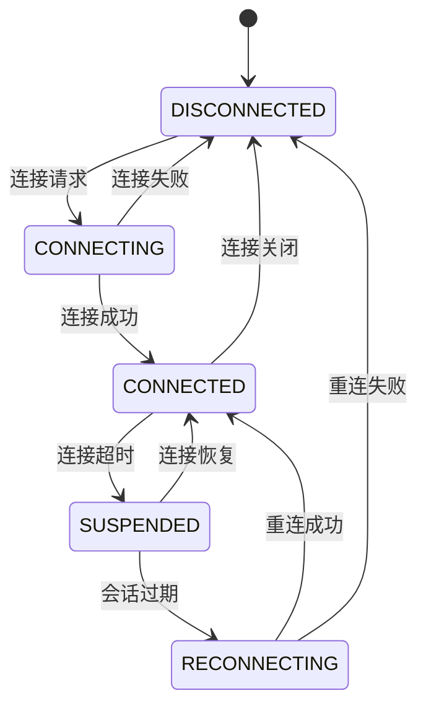
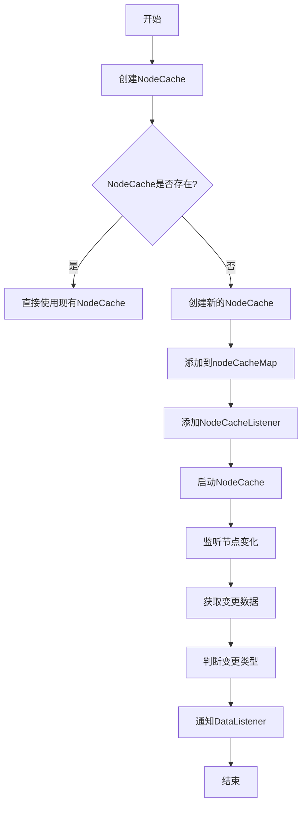
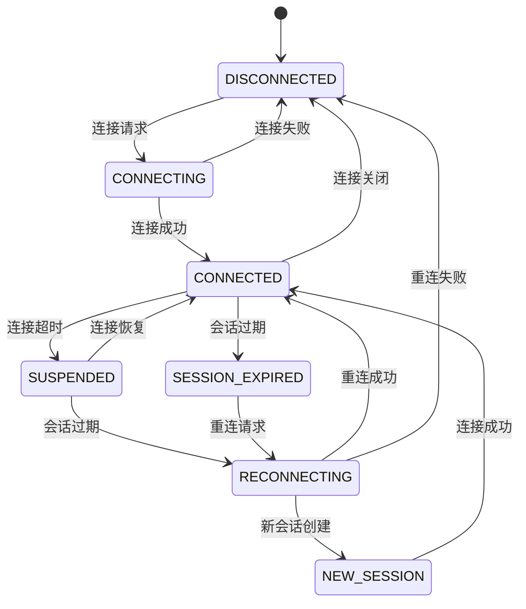
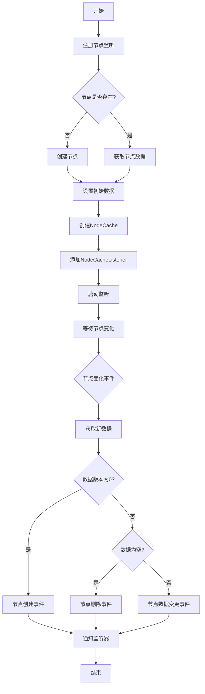

# Zookeeper通信实现

<cite>
**本文档引用的文件**
- [Curator5ZookeeperClient.java](file://dubbo-remoting\dubbo-remoting-zookeeper-curator5\src\main\java\org\apache\dubbo\remoting\zookeeper\curator5\Curator5ZookeeperClient.java)
- [ZookeeperClientManager.java](file://dubbo-remoting\dubbo-remoting-zookeeper-curator5\src\main\java\org\apache\dubbo\remoting\zookeeper\curator5\ZookeeperClientManager.java)
- [StateListener.java](file://dubbo-remoting\dubbo-remoting-zookeeper-curator5\src\main\java\org\apache\dubbo\remoting\zookeeper\curator5\StateListener.java)
- [AbstractZookeeperClient.java](file://dubbo-remoting\dubbo-remoting-zookeeper-curator5\src\main\java\org\apache\dubbo\remoting\zookeeper\curator5\AbstractZookeeperClient.java)
- [ZookeeperConfig.java](file://dubbo-test\dubbo-test-check\src\main\java\org\apache\dubbo\test\check\registrycenter\config\ZookeeperConfig.java)
</cite>

## 目录
1. [简介](#简介)
2. [Curator5ZookeeperClient连接管理机制](#curator5zookeeperclient连接管理机制)
3. [Curator5ZookeeperTransporter传输功能实现](#curator5zookeepertransporter传输功能实现)
4. [StateListener状态监听与处理策略](#statelistener状态监听与处理策略)
5. [会话管理与节点监听实现原理](#会话管理与节点监听实现原理)
6. [Zookeeper通信配置示例](#zookeeper通信配置示例)
7. [高级配置最佳实践](#高级配置最佳实践)
8. [连接状态转换图](#连接状态转换图)
9. [节点监听流程图](#节点监听流程图)

## 简介
本文档详细介绍了基于Zookeeper的通信能力实现，重点分析了Dubbo框架中Zookeeper通信的核心组件。文档涵盖了Curator5ZookeeperClient的连接管理机制、Curator5ZookeeperTransporter的传输功能实现、StateListener对连接状态的监听和处理策略，以及会话管理和节点监听的实现原理。为初学者提供了配置示例，为经验丰富的开发者提供了高级配置的最佳实践。

## Curator5ZookeeperClient连接管理机制

Curator5ZookeeperClient是Dubbo框架中基于Curator 5实现的Zookeeper客户端，负责管理与Zookeeper服务器的连接。该类继承自AbstractZookeeperClient，通过CuratorFramework实现与Zookeeper的通信。

连接管理机制的核心在于Curator5ZookeeperClient的构造函数，它接收一个URL参数，从中提取连接超时、会话超时等配置信息。通过CuratorFrameworkFactory.Builder构建CuratorFramework实例，并设置连接字符串、重试策略、连接超时、会话超时等参数。如果URL中包含用户信息，则会设置相应的授权和ACL提供者。

连接建立过程中，客户端会启动并阻塞等待连接建立。如果设置了检查连接的参数且连接未成功建立，会抛出IllegalStateException异常。连接成功后，会添加连接状态监听器CuratorConnectionStateListener来监控连接状态的变化。

**Section sources**
- [Curator5ZookeeperClient.java](file://dubbo-remoting\dubbo-remoting-zookeeper-curator5\src\main\java\org\apache\dubbo\remoting\zookeeper\curator5\Curator5ZookeeperClient.java#L69-L117)
- [AbstractZookeeperClient.java](file://dubbo-remoting\dubbo-remoting-zookeeper-curator5\src\main\java\org\apache\dubbo\remoting\zookeeper\curator5\AbstractZookeeperClient.java#L59-L61)

## Curator5ZookeeperTransporter传输功能实现

Curator5ZookeeperTransporter通过ZookeeperClientManager实现Zookeeper客户端的传输功能。ZookeeperClientManager负责管理Zookeeper客户端的生命周期，包括连接的创建、缓存和销毁。

ZookeeperClientManager使用单例模式，通过getInstance方法获取实例。它维护一个zookeeperClientMap来缓存已创建的Zookeeper客户端，避免重复创建连接。当需要连接Zookeeper时，首先从缓存中查找是否存在有效的连接，如果存在且连接正常，则直接返回缓存的客户端；否则创建新的客户端并加入缓存。

连接URL的处理包括提取主地址和备份地址，如果URL中包含用户名和密码，则会为所有地址添加认证信息。ZookeeperClientManager还负责在应用模型销毁时清理所有Zookeeper客户端连接。

**Section sources**
- [ZookeeperClientManager.java](file://dubbo-remoting\dubbo-remoting-zookeeper-curator5\src\main\java\org\apache\dubbo\remoting\zookeeper\curator5\ZookeeperClientManager.java#L50-L94)
- [ZookeeperClientManager.java](file://dubbo-remoting\dubbo-remoting-zookeeper-curator5\src\main\java\org\apache\dubbo\remoting\zookeeper\curator5\ZookeeperClientManager.java#L116-L142)

## StateListener状态监听与处理策略

StateListener接口定义了Zookeeper连接状态变化的监听机制。它包含五种状态：SESSION_LOST（会话丢失）、CONNECTED（已连接）、RECONNECTED（重新连接）、SUSPENDED（挂起）和NEW_SESSION_CREATED（新会话创建）。

CuratorConnectionStateListener实现了ConnectionStateListener接口，负责处理Curator框架的连接状态变化。当连接状态发生变化时，它会根据不同的状态执行相应的处理：

- **LOST状态**：表示Zookeeper会话已过期，通过stateChanged方法通知监听器SESSION_LOST状态
- **SUSPENDED状态**：表示连接超时，通过stateChanged方法通知监听器SUSPENDED状态
- **CONNECTED状态**：表示客户端成功连接到Zookeeper，记录会话ID并通过stateChanged方法通知监听器CONNECTED状态
- **RECONNECTED状态**：表示从连接丢失中恢复，如果会话ID不变则重用旧会话，否则创建新会话，并相应地通知RECONNECTED或NEW_SESSION_CREATED状态

这种状态监听机制使得上层应用能够及时感知连接状态的变化，并做出相应的处理。



**Diagram sources**
- [StateListener.java](file://dubbo-remoting\dubbo-remoting-zookeeper-curator5\src\main\java\org\apache\dubbo\remoting\zookeeper\curator5\StateListener.java#L19-L32)
- [Curator5ZookeeperClient.java](file://dubbo-remoting\dubbo-remoting-zookeeper-curator5\src\main\java\org\apache\dubbo\remoting\zookeeper\curator5\Curator5ZookeeperClient.java#L477-L544)

## 会话管理与节点监听实现原理

会话管理通过CuratorFramework的会话机制实现。在Curator5ZookeeperClient中，lastSessionId字段用于记录上一个会话的ID，以便在重新连接时判断是否重用了旧会话。连接状态监听器会捕获会话ID的变化，并在日志中记录相关信息。

节点监听的实现基于Curator的NodeCache和Watcher机制。Curator5ZookeeperClient维护一个静态的nodeCacheMap来存储NodeCache实例，避免重复创建。当添加数据监听器时，会创建NodeCache实例并将其加入map中，然后添加NodeCacheListenerImpl作为监听器。

NodeCacheListenerImpl实现了NodeCacheListener接口，当节点数据发生变化时，nodeChanged方法会被调用。该方法会获取当前节点的数据，根据数据版本判断是节点创建、删除还是数据变更，并通过DataListener通知上层应用。

子节点监听通过CuratorWatcherImpl实现，它实现了CuratorWatcher接口。当子节点发生变化时，process方法会被调用，获取最新的子节点列表并通过ChildListener通知上层应用。



**Diagram sources**
- [Curator5ZookeeperClient.java](file://dubbo-remoting\dubbo-remoting-zookeeper-curator5\src\main\java\org\apache\dubbo\remoting\zookeeper\curator5\Curator5ZookeeperClient.java#L374-L441)
- [Curator5ZookeeperClient.java](file://dubbo-remoting\dubbo-remoting-zookeeper-curator5\src\main\java\org\apache\dubbo\remoting\zookeeper\curator5\Curator5ZookeeperClient.java#L444-L475)

## Zookeeper通信配置示例

以下是一个基本的Zookeeper通信配置示例，适用于初学者：

```properties
# Zookeeper连接地址
zookeeper.connection.address=zookeeper://127.0.0.1:2181

# 连接超时时间（毫秒）
zookeeper.connection.timeout=30000

# 会话超时时间（毫秒）
zookeeper.session.timeout=60000

# 是否启用集合跟踪
zookeeper.ensemble.tracker=true
```

在Java代码中使用这些配置：

```java
// 创建URL对象
URL url = URL.valueOf("zookeeper://127.0.0.1:2181?timeout=30000&session=60000");

// 获取Zookeeper客户端管理器
ZookeeperClientManager manager = ZookeeperClientManager.getInstance(applicationModel);

// 连接Zookeeper
ZookeeperClient client = manager.connect(url);

// 使用客户端进行操作
client.create("/test", true, true);
String content = client.getContent("/test");
```

**Section sources**
- [ZookeeperConfig.java](file://dubbo-test\dubbo-test-check\src\main\java\org\apache\dubbo\test\check\registrycenter\config\ZookeeperConfig.java#L44-L84)
- [Curator5ZookeeperClient.java](file://dubbo-remoting\dubbo-remoting-zookeeper-curator5\src\main\java\org\apache\dubbo\remoting\zookeeper\curator5\Curator5ZookeeperClient.java#L72-L80)

## 高级配置最佳实践

对于经验丰富的开发者，以下是一些Zookeeper通信的高级配置最佳实践：

### 连接重试配置
```properties
# 设置连接重试策略
zookeeper.retry.policy=RetryNTimes
zookeeper.retry.times=3
zookeeper.retry.interval=1000
```

### 会话超时优化
```properties
# 根据网络状况调整会话超时
# 在稳定网络中可适当缩短
zookeeper.session.timeout=30000

# 连接超时通常设置为会话超时的1/2到2/3
zookeeper.connection.timeout=20000
```

### 安全配置
```properties
# 启用ACL权限控制
zookeeper.acl.enabled=true

# 配置用户名和密码
zookeeper.username=admin
zookeeper.password=secret
```

### 集群配置
```properties
# 配置多个Zookeeper服务器地址
zookeeper.connection.address=zookeeper://192.168.1.10:2181,192.168.1.11:2181,192.168.1.12:2181

# 或使用backup参数
zookeeper.connection.address=zookeeper://192.168.1.10:2181?backup=192.168.1.11:2181,192.168.1.12:2181
```

### 性能调优
```properties
# 启用集合跟踪以提高性能
zookeeper.ensemble.tracker=true

# 调整Curator线程池大小
zookeeper.curator.thread.pool.size=10
```

**Section sources**
- [Curator5ZookeeperClient.java](file://dubbo-remoting\dubbo-remoting-zookeeper-curator5\src\main\java\org\apache\dubbo\remoting\zookeeper\curator5\Curator5ZookeeperClient.java#L72-L84)
- [ZookeeperClientManager.java](file://dubbo-remoting\dubbo-remoting-zookeeper-curator5\src\main\java\org\apache\dubbo\remoting\zookeeper\curator5\ZookeeperClientManager.java#L116-L142)

## 连接状态转换图



**Diagram sources**
- [Curator5ZookeeperClient.java](file://dubbo-remoting\dubbo-remoting-zookeeper-curator5\src\main\java\org\apache\dubbo\remoting\zookeeper\curator5\Curator5ZookeeperClient.java#L477-L544)
- [StateListener.java](file://dubbo-remoting\dubbo-remoting-zookeeper-curator5\src\main\java\org\apache\dubbo\remoting\zookeeper\curator5\StateListener.java#L19-L32)

## 节点监听流程图



**Diagram sources**
- [Curator5ZookeeperClient.java](file://dubbo-remoting\dubbo-remoting-zookeeper-curator5\src\main\java\org\apache\dubbo\remoting\zookeeper\curator5\Curator5ZookeeperClient.java#L374-L441)
- [Curator5ZookeeperClient.java](file://dubbo-remoting\dubbo-remoting-zookeeper-curator5\src\main\java\org\apache\dubbo\remoting\zookeeper\curator5\Curator5ZookeeperClient.java#L410-L441)