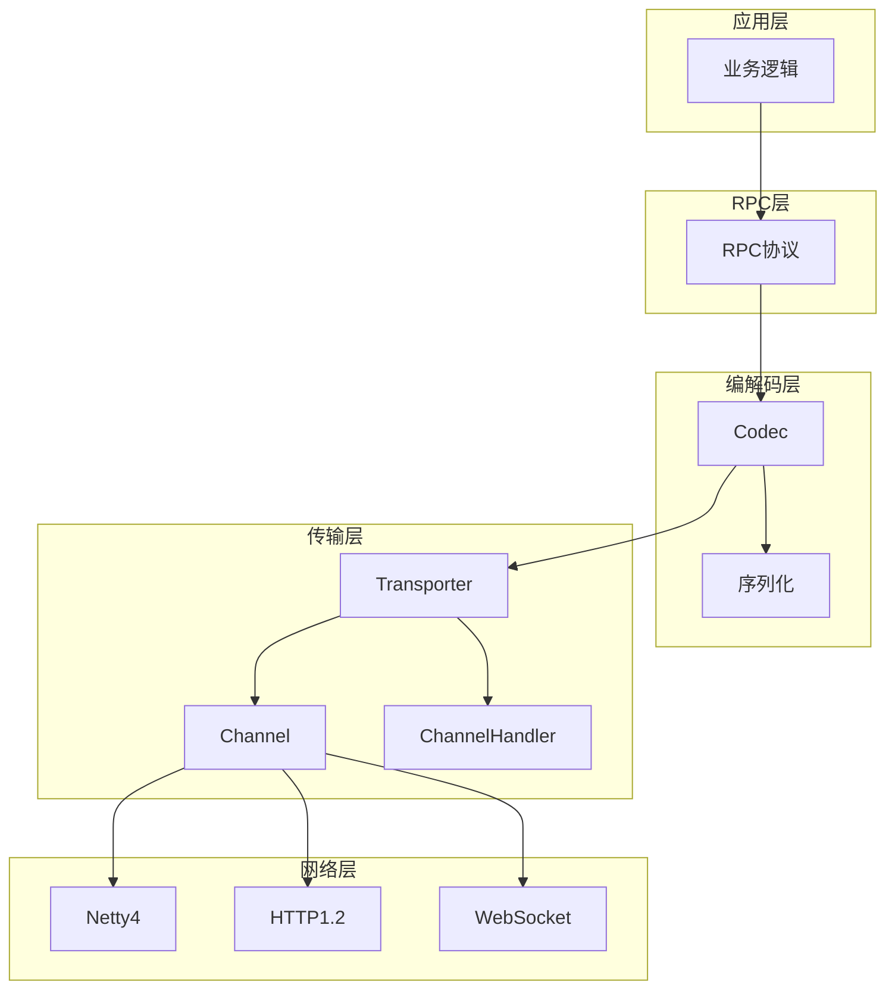
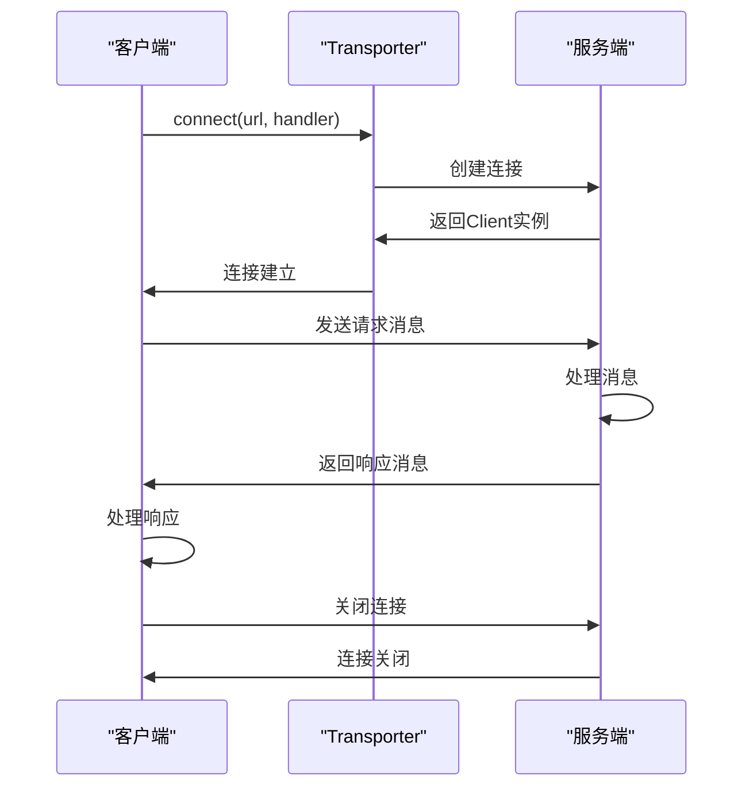

# dubbo-remoting模块

<cite>
**本文档引用的文件**
- [Transporter.java](file://dubbo-remoting/dubbo-remoting-api/src/main/java/org/apache/dubbo/remoting/Transporter.java)
- [Channel.java](file://dubbo-remoting/dubbo-remoting-api/src/main/java/org/apache/dubbo/remoting/Channel.java)
- [ChannelHandler.java](file://dubbo-remoting/dubbo-remoting-api/src/main/java/org/apache/dubbo/remoting/ChannelHandler.java)
- [Codec.java](file://dubbo-remoting/dubbo-remoting-api/src/main/java/org/apache/dubbo/remoting/Codec.java)
- [RemotingException.java](file://dubbo-remoting/dubbo-remoting-api/src/main/java/org/apache/dubbo/remoting/RemotingException.java)
- [Endpoint.java](file://dubbo-remoting/dubbo-remoting-api/src/main/java/org/apache/dubbo/remoting/Endpoint.java)
- [Client.java](file://dubbo-remoting/dubbo-remoting-api/src/main/java/org/apache/dubbo/remoting/Client.java)
- [RemotingServer.java](file://dubbo-remoting/dubbo-remoting-api/src/main/java/org/apache/dubbo/remoting/RemotingServer.java)
- [Transporters.java](file://dubbo-remoting/dubbo-remoting-api/src/main/java/org/apache/dubbo/remoting/Transporters.java)
- [RemotingConstants.java](file://dubbo-common/src/main/java/org/apache/dubbo/common/constants/RemotingConstants.java)
</cite>

## 目录
1. [简介](#简介)
2. [核心组件](#核心组件)
3. [通信模型](#通信模型)
4. [消息编解码机制](#消息编解码机制)
5. [网络协议支持](#网络协议支持)
6. [性能优化策略](#性能优化策略)
7. [使用示例](#使用示例)
8. [性能调优建议](#性能调优建议)
9. [通信协议栈架构](#通信协议栈架构)
10. [消息传输时序](#消息传输时序)

## 简介
dubbo-remoting模块是Apache Dubbo框架中的核心通信组件，负责提供底层网络通信能力。该模块设计了一个灵活且可扩展的通信抽象层，支持多种网络协议和传输方式，为上层RPC调用提供了可靠的网络基础。模块通过Transporter接口定义了服务端和客户端的通信契约，实现了基于Netty4、HTTP1.2、WebSocket等多种协议的传输支持。

**通信能力特点**：
- 提供统一的通信API，屏蔽底层协议差异
- 支持多种网络协议，包括TCP、HTTP、WebSocket等
- 基于SPI机制实现协议扩展，易于集成新协议
- 提供高效的编解码机制，支持多种序列化方式
- 具备完善的错误处理和连接管理机制

## 核心组件

### Transporter接口设计
Transporter接口是dubbo-remoting模块的核心SPI接口，定义了服务端绑定和客户端连接的基本契约。该接口通过@SPI注解标记，支持扩展机制，默认实现为"netty"。接口提供了两个核心方法：bind用于服务端绑定监听端口，connect用于客户端连接远程服务。

Transporter接口的设计体现了Dubbo的扩展性原则，通过Adaptive注解实现了运行时动态选择具体实现。当调用bind或connect方法时，系统会根据URL中的server或client参数值选择相应的Transporter实现。这种设计使得开发者可以轻松地替换或扩展通信协议，而无需修改上层代码。

**Transporter接口特性**：
- 单例模式：每个实现类在JVM中只有一个实例
- 线程安全：所有方法都是线程安全的
- 可扩展：通过SPI机制支持自定义实现
- 默认实现：Netty作为默认的传输实现

**核心方法说明**：
- `bind(URL url, ChannelHandler handler)`：服务端绑定方法，创建并启动一个监听指定地址的服务器
- `connect(URL url, ChannelHandler handler)`：客户端连接方法，创建并连接到指定地址的服务器

**Section sources**
- [Transporter.java](file://dubbo-remoting/dubbo-remoting-api/src/main/java/org/apache/dubbo/remoting/Transporter.java#L32-L58)

### Channel组件
Channel接口代表了一个网络连接通道，是Dubbo通信模型中的基本单元。它继承自Endpoint接口，提供了获取远程地址、检查连接状态、管理连接属性等基本功能。Channel接口的设计遵循了面向对象的封装原则，将网络连接的细节封装在接口内部，对外提供简洁的API。

Channel接口的主要功能包括：
- 获取连接的远程地址和本地地址
- 检查连接状态（是否已连接）
- 管理连接的属性（设置、获取、删除）
- 作为消息传输的载体

Channel接口的设计考虑了多线程环境下的安全性，所有方法都是线程安全的。这使得多个线程可以安全地共享同一个Channel实例，而无需额外的同步控制。此外，Channel接口还支持属性存储功能，允许在连接上存储自定义的元数据，这在实现复杂的通信逻辑时非常有用。

**Section sources**
- [Channel.java](file://dubbo-remoting/dubbo-remoting-api/src/main/java/org/apache/dubbo/remoting/Channel.java#L28-L75)

### ChannelHandler组件
ChannelHandler接口定义了网络事件的处理契约，是Dubbo通信模型中的事件处理器。它负责处理连接建立、断开、消息收发、异常捕获等网络事件。ChannelHandler接口的设计采用了责任链模式，多个处理器可以串联在一起，形成一个处理链，每个处理器负责处理特定类型的事件。

ChannelHandler接口的主要方法包括：
- `connected(Channel channel)`：连接建立事件处理
- `disconnected(Channel channel)`：连接断开事件处理
- `sent(Channel channel, Object message)`：消息发送事件处理
- `received(Channel channel, Object message)`：消息接收事件处理
- `caught(Channel channel, Throwable exception)`：异常捕获事件处理

这种设计使得开发者可以灵活地定制通信行为，例如添加日志记录、性能监控、安全验证等功能。通过实现ChannelHandler接口，可以在不修改核心通信逻辑的情况下，扩展通信功能。

**Section sources**
- [ChannelHandler.java](file://dubbo-remoting/dubbo-remoting-api/src/main/java/org/apache/dubbo/remoting/ChannelHandler.java#L29-L68)

### Codec组件
Codec接口定义了消息编解码的契约，负责将Java对象与网络字节流之间的相互转换。虽然该接口已被标记为@Deprecated，但它仍然是理解Dubbo编解码机制的重要组成部分。Codec接口的设计体现了单一职责原则，将编解码逻辑与网络传输逻辑分离。

Codec接口的主要方法包括：
- `encode(Channel channel, OutputStream output, Object message)`：将Java对象编码为字节流
- `decode(Channel channel, InputStream input)`：将字节流解码为Java对象

编解码过程中，Codec接口需要处理粘包和拆包问题，通过NEED_MORE_INPUT标记来指示是否需要更多输入数据。这种设计使得编解码器能够正确处理不完整的网络数据包，保证消息的完整性。

**Section sources**
- [Codec.java](file://dubbo-remoting/dubbo-remoting-api/src/main/java/org/apache/dubbo/remoting/Codec.java#L32-L62)

## 通信模型

### 服务端通信模型
dubbo-remoting模块的服务端通信模型基于经典的Reactor模式实现。服务端通过Transporter接口的bind方法创建一个RemotingServer实例，该实例负责监听指定端口并处理客户端连接。当客户端连接请求到达时，服务端会创建一个Channel实例表示该连接，并通过ChannelHandler处理后续的通信事件。

服务端通信流程如下：
1. 调用Transporter.bind方法创建服务器
2. 服务器开始监听指定端口
3. 接收客户端连接请求
4. 为每个连接创建Channel实例
5. 通过ChannelHandler处理消息收发
6. 连接断开时清理资源

服务端模型支持多线程处理，可以同时处理多个客户端连接。通过配置不同的Dispatcher策略，可以控制事件处理的线程模型，例如使用固定线程池或业务线程池。

**Section sources**
- [RemotingServer.java](file://dubbo-remoting/dubbo-remoting-api/src/main/java/org/apache/dubbo/remoting/RemotingServer.java#L31-L58)
- [Transporter.java](file://dubbo-remoting/dubbo-remoting-api/src/main/java/org/apache/dubbo/remoting/Transporter.java#L44-L45)

### 客户端通信模型
客户端通信模型与服务端类似，但角色相反。客户端通过Transporter接口的connect方法创建一个Client实例，该实例负责连接到远程服务器并维护连接状态。Client接口继承自Channel和Endpoint，具有发送消息和管理连接的能力。

客户端通信流程如下：
1. 调用Transporter.connect方法创建客户端
2. 客户端连接到指定服务器
3. 连接建立后创建Channel实例
4. 通过Channel发送请求消息
5. 接收服务器响应
6. 连接断开时尝试重连

客户端模型支持连接池和连接复用，可以有效减少连接创建的开销。同时，客户端还实现了心跳机制，定期检测连接状态，确保连接的可用性。

**Section sources**
- [Client.java](file://dubbo-remoting/dubbo-remoting-api/src/main/java/org/apache/dubbo/remoting/Client.java#L28-L37)
- [Transporter.java](file://dubbo-remoting/dubbo-remoting-api/src/main/java/org/apache/dubbo/remoting/Transporter.java#L56-L57)

### Endpoint抽象
Endpoint接口是Channel和RemotingServer的共同父接口，定义了通信端点的基本行为。它提供了获取URL、获取ChannelHandler、发送消息、关闭连接等通用方法。通过Endpoint抽象，Dubbo实现了服务端和客户端的统一管理。

Endpoint接口的主要方法包括：
- `getUrl()`：获取端点的URL配置
- `getChannelHandler()`：获取关联的ChannelHandler
- `send(Object message)`：发送消息
- `close()`：关闭连接
- `isClosed()`：检查连接是否已关闭

这种分层设计使得上层代码可以以统一的方式处理服务端和客户端，提高了代码的复用性和可维护性。

**Section sources**
- [Endpoint.java](file://dubbo-remoting/dubbo-remoting-api/src/main/java/org/apache/dubbo/remoting/Endpoint.java#L31-L88)

## 消息编解码机制

### 编解码流程
dubbo-remoting模块的消息编解码机制是通信过程中的关键环节。编解码流程主要包括以下几个步骤：

**编码流程**：
1. 获取消息对应的序列化方式
2. 将Java对象序列化为字节数组
3. 添加消息头信息（如消息类型、序列化方式等）
4. 将消息头和序列化后的数据写入输出流

**解码流程**：
1. 读取消息头信息
2. 根据消息头确定序列化方式
3. 读取序列化后的数据
4. 使用相应的反序列化器将字节数组转换为Java对象

编解码过程中需要处理粘包和拆包问题。当网络数据不完整时，解码器会返回NEED_MORE_INPUT标记，指示需要更多输入数据。这种设计确保了消息的完整性和正确性。

**Section sources**
- [Codec.java](file://dubbo-remoting/dubbo-remoting-api/src/main/java/org/apache/dubbo/remoting/Codec.java#L48-L60)

### 序列化支持
dubbo-remoting模块支持多种序列化方式，包括Hessian2、JSON、FastJSON2等。序列化方式的选择通常由URL参数中的serialization属性决定。不同的序列化方式在性能、兼容性和数据大小方面有不同的特点。

**常见序列化方式特点**：
- Hessian2：二进制序列化，性能优秀，兼容性好
- JSON：文本序列化，可读性强，跨语言支持好
- FastJSON2：高性能JSON序列化，适合大数据量场景

序列化器的选择对系统性能有重要影响。在高并发场景下，通常推荐使用二进制序列化方式以获得更好的性能。

**Section sources**
- [Codec.java](file://dubbo-remoting/dubbo-remoting-api/src/main/java/org/apache/dubbo/remoting/Codec.java#L48-L60)

## 网络协议支持

### Netty4协议支持
Netty4是dubbo-remoting模块的默认传输实现，提供了高性能的TCP通信能力。Netty4实现基于Netty框架，充分利用了其异步非阻塞IO模型和事件驱动架构。

Netty4实现的主要特点：
- 高性能：基于Netty的异步非阻塞IO模型
- 高可靠性：完善的连接管理和错误处理机制
- 易扩展：支持自定义ChannelHandler和编解码器
- 多协议支持：通过PortUnificationTransporter支持多种协议共存

Netty4实现通过NettyTransporter类提供服务端绑定和客户端连接功能，内部使用Netty的Bootstrap和ServerBootstrap进行网络配置。

**Section sources**
- [Transporter.java](file://dubbo-remoting/dubbo-remoting-api/src/main/java/org/apache/dubbo/remoting/Transporter.java#L32)
- [NettyTransporter.java](file://dubbo-remoting/dubbo-remoting-netty4/src/main/java/org/apache/dubbo/remoting/transport/netty4/NettyTransporter.java)

### HTTP1.2协议支持
HTTP1.2支持通过dubbo-remoting-http12模块实现，提供了基于HTTP协议的通信能力。这种支持使得Dubbo服务可以通过标准的HTTP端口暴露，便于与现有Web基础设施集成。

HTTP1.2实现的主要特点：
- 标准兼容：遵循HTTP/1.1协议规范
- 易于集成：可以与现有的Web服务器和代理服务器无缝集成
- 跨域支持：天然支持跨域访问
- 安全性：可以利用现有的HTTPS安全机制

HTTP1.2实现通常用于需要与Web前端直接通信的场景，或者在受限网络环境中需要通过HTTP代理的场景。

**Section sources**
- [NettyHttp1Channel.java](file://dubbo-remoting/dubbo-remoting-http12/src/main/java/org/apache/dubbo/remoting/http12/netty4/h1/NettyHttp1Channel.java)
- [NettyHttp1Codec.java](file://dubbo-remoting/dubbo-remoting-http12/src/main/java/org/apache/dubbo/remoting/http12/netty4/h1/NettyHttp1Codec.java)

### WebSocket协议支持
WebSocket支持通过dubbo-remoting-websocket模块实现，提供了全双工通信能力。WebSocket协议特别适合需要实时通信的场景，如消息推送、实时通知等。

WebSocket实现的主要特点：
- 全双工通信：客户端和服务器可以同时发送和接收消息
- 低延迟：建立连接后通信延迟低
- 长连接：连接建立后可以长时间保持
- 心跳机制：内置心跳检测，确保连接活跃

WebSocket实现通过WebSocketTransportListener和WebSocketFrameCodec等组件处理WebSocket协议的升级和帧处理。

**Section sources**
- [WebSocketTransportListener.java](file://dubbo-remoting/dubbo-remoting-websocket/src/main/java/org/apache/dubbo/remoting/websocket/WebSocketTransportListener.java)
- [WebSocketFrameCodec.java](file://dubbo-remoting/dubbo-remoting-websocket/src/main/java/org/apache/dubbo/remoting/websocket/netty4/WebSocketFrameCodec.java)

## 性能优化策略

### 连接池管理
dubbo-remoting模块通过连接池机制优化客户端性能。连接池可以复用已建立的连接，避免频繁创建和销毁连接的开销。连接池管理包括连接的创建、复用、回收和清理。

连接池的主要优化策略：
- 连接复用：避免重复的TCP三次握手
- 连接预热：预先创建一定数量的连接
- 连接保活：定期发送心跳包保持连接活跃
- 连接回收：及时关闭空闲连接释放资源

合理的连接池配置可以显著提高系统吞吐量，特别是在高并发场景下。

### 线程模型优化
dubbo-remoting模块提供了多种线程模型选择，通过Dispatcher策略控制事件处理的线程分配。不同的线程模型适用于不同的业务场景。

**常见线程模型**：
- Direct：直接在IO线程中处理事件，适合轻量级操作
- Message：使用固定线程池处理消息事件
- Execution：使用业务线程池处理事件
- All：所有事件都使用业务线程池处理

选择合适的线程模型可以避免IO线程阻塞，提高系统的并发处理能力。

### 批量处理
对于高频的小消息通信场景，可以采用批量处理策略。通过将多个小消息合并为一个大消息进行传输，可以减少网络开销和序列化开销。批量处理需要权衡延迟和吞吐量，通常需要根据具体业务需求进行配置。

## 使用示例

### 简单通信示例
以下是一个简单的dubbo-remoting通信示例，展示了如何使用Transporter接口创建服务端和客户端：

```java
// 创建服务端
URL serverUrl = URL.valueOf("dubbo://127.0.0.1:20880");
RemotingServer server = Transporters.bind(serverUrl, new ChannelHandler() {
    @Override
    public void connected(Channel channel) throws RemotingException {
        System.out.println("客户端连接: " + channel.getRemoteAddress());
    }
    
    @Override
    public void received(Channel channel, Object message) throws RemotingException {
        System.out.println("收到消息: " + message);
        // 回复消息
        channel.send("收到: " + message);
    }
    
    // 其他方法实现...
});

// 创建客户端
URL clientUrl = URL.valueOf("dubbo://127.0.0.1:20880");
Client client = Transporters.connect(clientUrl, new ChannelHandler() {
    @Override
    public void connected(Channel channel) throws RemotingException {
        System.out.println("连接服务器成功");
        // 发送消息
        channel.send("Hello Dubbo!");
    }
    
    @Override
    public void received(Channel channel, Object message) throws RemotingException {
        System.out.println("收到回复: " + message);
    }
    
    // 其他方法实现...
});
```

**Section sources**
- [Transporters.java](file://dubbo-remoting/dubbo-remoting-api/src/main/java/org/apache/dubbo/remoting/Transporters.java#L30-L67)
- [Transporter.java](file://dubbo-remoting/dubbo-remoting-api/src/main/java/org/apache/dubbo/remoting/Transporter.java#L44-L57)

## 性能调优建议

### 参数配置
合理的参数配置是性能优化的基础。以下是一些关键的配置建议：

**连接相关参数**：
- 连接超时时间：根据网络状况设置合理的超时时间
- 最大连接数：根据服务器资源和业务需求设置
- 心跳间隔：平衡连接检测频率和网络开销

**线程相关参数**：
- IO线程数：通常设置为CPU核心数
- 业务线程池大小：根据业务处理能力和并发需求设置
- 队列大小：避免线程池拒绝过多任务

### 监控与诊断
建立完善的监控体系是性能调优的前提。建议监控以下指标：
- 连接数：监控活跃连接和空闲连接
- 消息吞吐量：监控消息收发速率
- 延迟分布：监控消息处理延迟
- 错误率：监控通信错误发生频率

通过监控数据可以及时发现性能瓶颈，指导优化方向。

## 通信协议栈架构



**Diagram sources**
- [Transporter.java](file://dubbo-remoting/dubbo-remoting-api/src/main/java/org/apache/dubbo/remoting/Transporter.java)
- [Codec.java](file://dubbo-remoting/dubbo-remoting-api/src/main/java/org/apache/dubbo/remoting/Codec.java)
- [Channel.java](file://dubbo-remoting/dubbo-remoting-api/src/main/java/org/apache/dubbo/remoting/Channel.java)
- [ChannelHandler.java](file://dubbo-remoting/dubbo-remoting-api/src/main/java/org/apache/dubbo/remoting/ChannelHandler.java)

## 消息传输时序



**Diagram sources**
- [Transporter.java](file://dubbo-remoting/dubbo-remoting-api/src/main/java/org/apache/dubbo/remoting/Transporter.java#L56-L57)
- [Client.java](file://dubbo-remoting/dubbo-remoting-api/src/main/java/org/apache/dubbo/remoting/Client.java#L28-L37)
- [RemotingServer.java](file://dubbo-remoting/dubbo-remoting-api/src/main/java/org/apache/dubbo/remoting/RemotingServer.java#L31-L58)