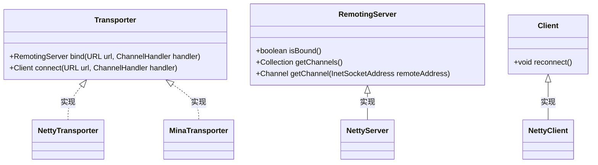
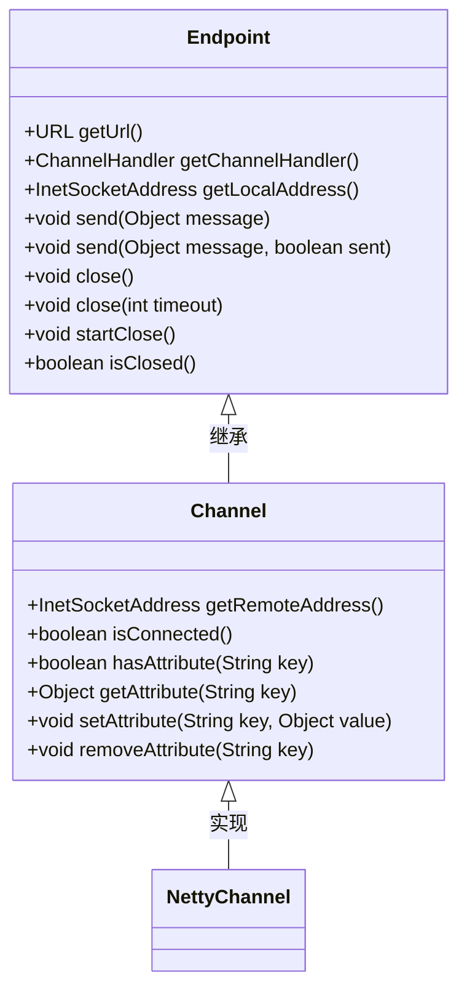
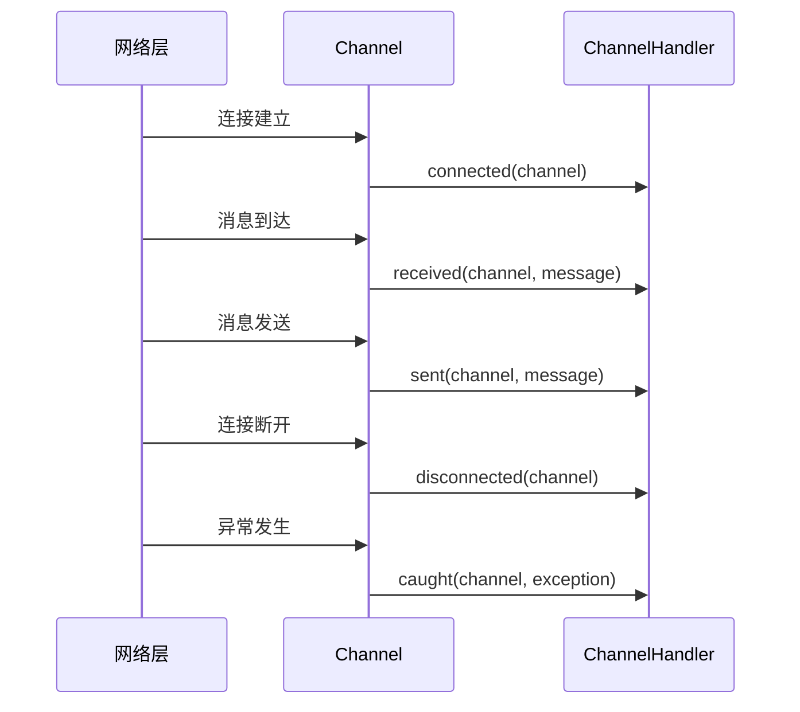
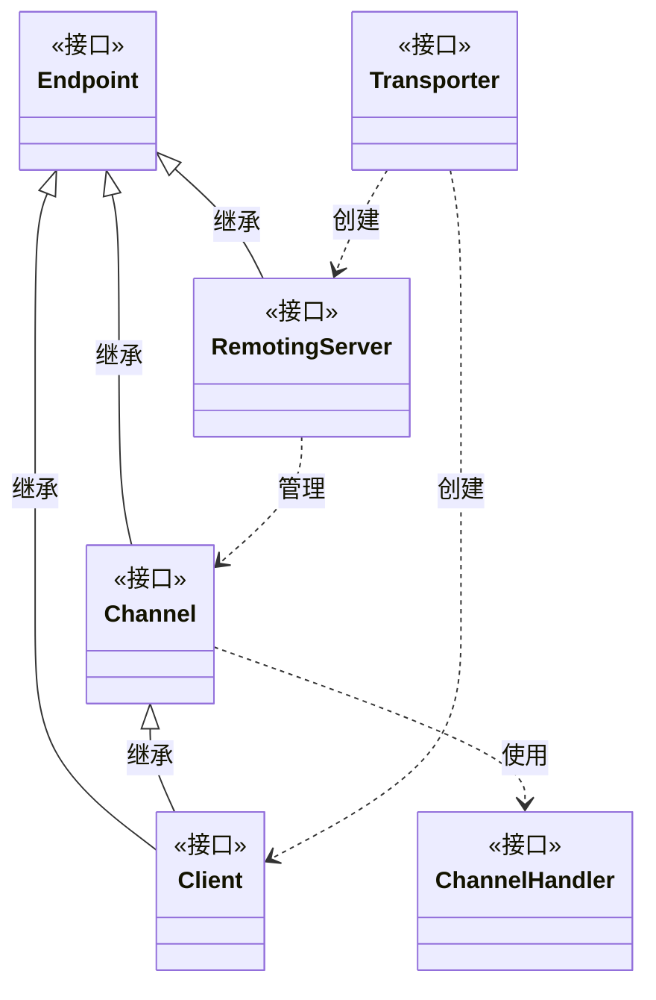

# 通信基础API

<cite>
**本文档引用的文件**
- [Transporter.java](file://dubbo-remoting\dubbo-remoting-api\src\main\java\org\apache\dubbo\remoting\Transporter.java)
- [Channel.java](file://dubbo-remoting\dubbo-remoting-api\src\main\java\org\apache\dubbo\remoting\Channel.java)
- [ChannelHandler.java](file://dubbo-remoting\dubbo-remoting-api\src\main\java\org\apache\dubbo\remoting\ChannelHandler.java)
- [RemotingServer.java](file://dubbo-remoting\dubbo-remoting-api\src\main\java\org\apache\dubbo\remoting\RemotingServer.java)
- [Client.java](file://dubbo-remoting\dubbo-remoting-api\src\main\java\org\apache\dubbo\remoting\Client.java)
- [Endpoint.java](file://dubbo-remoting\dubbo-remoting-api\src\main\java\org\apache\dubbo\remoting\Endpoint.java)
</cite>

## 目录
1. [引言](#引言)
2. [核心接口概述](#核心接口概述)
3. [Transporter接口详解](#transporter接口详解)
4. [Channel接口详解](#channel接口详解)
5. [ChannelHandler接口详解](#channelhandler接口详解)
6. [接口关系与继承体系](#接口关系与继承体系)
7. [SPI扩展机制](#spi扩展机制)
8. [API使用示例](#api使用示例)
9. [与其他模块的集成](#与其他模块的集成)
10. [设计原理与最佳实践](#设计原理与最佳实践)

## 引言
Dubbo的通信基础API是整个框架网络通信的核心，提供了统一的抽象层来处理底层网络传输。这些API设计精巧，通过Transporter、Channel、ChannelHandler等核心接口实现了网络通信的可扩展性和灵活性。本文档将深入分析这些基础API的设计原理、接口定义和使用方法，为开发者提供全面的技术参考。

## 核心接口概述
Dubbo的通信基础API由多个核心接口组成，形成了一个完整的网络通信抽象体系。这些接口包括Transporter（传输器）、Channel（通道）、ChannelHandler（通道处理器）、RemotingServer（远程服务器）和Client（客户端）等。它们共同构成了Dubbo网络通信的基础，为上层协议实现提供了统一的接口抽象。

**本节引用文件**
- [Transporter.java](file://dubbo-remoting\dubbo-remoting-api\src\main\java\org\apache\dubbo\remoting\Transporter.java)
- [Channel.java](file://dubbo-remoting\dubbo-remoting-api\src\main\java\org\apache\dubbo\remoting\Channel.java)
- [ChannelHandler.java](file://dubbo-remoting\dubbo-remoting-api\src\main\java\org\apache\dubbo\remoting\ChannelHandler.java)

## Transporter接口详解
Transporter接口是Dubbo通信层的核心SPI接口，负责创建和管理网络服务器和客户端。该接口通过@SPI注解标记，具有SPI扩展能力，默认实现为"netty"。

### 接口方法说明
Transporter接口定义了两个核心方法：

1. **bind方法**：用于绑定服务器端口，创建RemotingServer实例
   - 参数：URL（服务器配置URL）、ChannelHandler（通道处理器）
   - 返回值：RemotingServer（远程服务器实例）
   - 异常：RemotingException（远程通信异常）

2. **connect方法**：用于连接远程服务器，创建Client实例
   - 参数：URL（服务器地址URL）、ChannelHandler（通道处理器）
   - 返回值：Client（客户端实例）
   - 异常：RemotingException（远程通信异常）

### 设计模式与SPI扩展
Transporter接口采用了策略模式和SPI扩展机制。通过@SPI注解指定默认实现为"netty"，开发者可以轻松扩展其他传输实现，如mina、grizzly等。@Adaptive注解的应用使得框架能够根据URL参数动态选择合适的Transporter实现。



**图示来源**
- [Transporter.java](file://dubbo-remoting\dubbo-remoting-api\src\main\java\org\apache\dubbo\remoting\Transporter.java)
- [RemotingServer.java](file://dubbo-remoting\dubbo-remoting-api\src\main\java\org\apache\dubbo\remoting\RemotingServer.java)
- [Client.java](file://dubbo-remoting\dubbo-remoting-api\src\main\java\org\apache\dubbo\remoting\Client.java)

**本节引用文件**
- [Transporter.java](file://dubbo-remoting\dubbo-remoting-api\src\main\java\org\apache\dubbo\remoting\Transporter.java)

## Channel接口详解
Channel接口抽象了网络连接的概念，代表了一个双向通信的通道。它继承自Endpoint接口，提供了对网络连接状态和属性的访问能力。

### 接口方法说明
Channel接口提供了以下核心方法：

1. **getRemoteAddress**：获取远程地址
   - 返回值：InetSocketAddress（远程地址）

2. **isConnected**：检查连接状态
   - 返回值：boolean（是否已连接）

3. **getAttribute系列方法**：用于管理通道的属性
   - hasAttribute：检查属性是否存在
   - getAttribute：获取属性值
   - setAttribute：设置属性值
   - removeAttribute：移除属性

### 抽象网络连接
Channel接口通过统一的抽象，屏蔽了底层网络传输的具体实现细节。无论是TCP、UDP还是其他协议，都可以通过Channel接口进行统一操作。这种抽象使得上层协议实现无需关心底层传输细节，提高了代码的可移植性和可维护性。



**图示来源**
- [Channel.java](file://dubbo-remoting\dubbo-remoting-api\src\main\java\org\apache\dubbo\remoting\Channel.java)
- [Endpoint.java](file://dubbo-remoting\dubbo-remoting-api\src\main\java\org\apache\dubbo\remoting\Endpoint.java)

**本节引用文件**
- [Channel.java](file://dubbo-remoting\dubbo-remoting-api\src\main\java\org\apache\dubbo\remoting\Channel.java)
- [Endpoint.java](file://dubbo-remoting\dubbo-remoting-api\src\main\java\org\apache\dubbo\remoting\Endpoint.java)

## ChannelHandler接口详解
ChannelHandler接口是Dubbo事件处理模型的核心，负责处理各种网络事件。它采用了观察者模式，当网络状态发生变化时，框架会回调相应的处理方法。

### 事件处理模型
ChannelHandler接口定义了五个核心事件处理方法：

1. **connected**：通道连接事件
   - 当客户端成功连接到服务器时触发
   - 可用于初始化连接相关的资源

2. **disconnected**：通道断开事件
   - 当连接断开时触发
   - 可用于清理连接相关的资源

3. **sent**：消息发送事件
   - 当消息成功发送到网络时触发
   - 可用于记录发送日志或更新统计信息

4. **received**：消息接收事件
   - 当接收到消息时触发
   - 这是最常用的方法，用于处理业务逻辑

5. **caught**：异常捕获事件
   - 当发生异常时触发
   - 用于异常处理和错误恢复

### 方法参数与返回值
所有ChannelHandler方法都接收Channel参数，表示事件发生的通道。received和sent方法还接收Object类型的message参数，表示发送或接收的消息内容。caught方法接收Throwable类型的exception参数，表示捕获的异常。所有方法都可能抛出RemotingException异常。



**图示来源**
- [ChannelHandler.java](file://dubbo-remoting\dubbo-remoting-api\src\main\java\org\apache\dubbo\remoting\ChannelHandler.java)
- [Channel.java](file://dubbo-remoting\dubbo-remoting-api\src\main\java\org\apache\dubbo\remoting\Channel.java)

**本节引用文件**
- [ChannelHandler.java](file://dubbo-remoting\dubbo-remoting-api\src\main\java\org\apache\dubbo\remoting\ChannelHandler.java)

## 接口关系与继承体系
Dubbo的通信基础API通过精心设计的接口继承体系，实现了功能的分层和复用。理解这些接口之间的关系对于掌握整个通信层的设计至关重要。

### 继承关系分析
- **Endpoint接口**：作为所有通信端点的基接口，定义了基本的通信能力，如发送消息、关闭连接等。
- **Channel接口**：继承自Endpoint，增加了连接状态和属性管理能力，代表一个双向通信通道。
- **Client接口**：同时继承自Endpoint和Channel，增加了重连功能，代表客户端连接。
- **RemotingServer接口**：继承自Endpoint，增加了获取通道列表的能力，代表服务器端。

### 组件协作关系
这些接口通过组合和继承的方式协同工作。Transporter负责创建Server和Client，Server管理多个Channel，每个Channel都有对应的ChannelHandler处理事件。这种设计实现了关注点分离，使得各个组件职责明确。



**图示来源**
- [Endpoint.java](file://dubbo-remoting\dubbo-remoting-api\src\main\java\org\apache\dubbo\remoting\Endpoint.java)
- [Channel.java](file://dubbo-remoting\dubbo-remoting-api\src\main\java\org\apache\dubbo\remoting\Channel.java)
- [Client.java](file://dubbo-remoting\dubbo-remoting-api\src\main\java\org\apache\dubbo\remoting\Client.java)
- [RemotingServer.java](file://dubbo-remoting\dubbo-remoting-api\src\main\java\org\apache\dubbo\remoting\RemotingServer.java)
- [ChannelHandler.java](file://dubbo-remoting\dubbo-remoting-api\src\main\java\org\apache\dubbo\remoting\ChannelHandler.java)
- [Transporter.java](file://dubbo-remoting\dubbo-remoting-api\src\main\java\org\apache\dubbo\remoting\Transporter.java)

**本节引用文件**
- [Endpoint.java](file://dubbo-remoting\dubbo-remoting-api\src\main\java\org\apache\dubbo\remoting\Endpoint.java)
- [Channel.java](file://dubbo-remoting\dubbo-remoting-api\src\main\java\org\apache\dubbo\remoting\Channel.java)
- [Client.java](file://dubbo-remoting\dubbo-remoting-api\src\main\java\org\apache\dubbo\remoting\Client.java)
- [RemotingServer.java](file://dubbo-remoting\dubbo-remoting-api\src\main\java\org\apache\dubbo\remoting\RemotingServer.java)

## SPI扩展机制
Dubbo的SPI（Service Provider Interface）机制是其可扩展性的核心，Transporter接口就是SPI机制的典型应用。

### SPI注解详解
Transporter接口使用@SPI注解，该注解具有以下特性：
- value属性指定默认实现名称（"netty"）
- scope属性指定扩展范围（FRAMEWORK级别）
- 允许通过配置文件动态替换实现

### 扩展实现方式
要扩展Transporter接口，需要：
1. 创建新的实现类，如MinaTransporter
2. 在META-INF/dubbo/internal/org.apache.dubbo.remoting.Transporter文件中添加条目
3. 使用URL参数指定使用哪个实现

### 自适应扩展
@Adaptive注解使得Transporter接口具有自适应能力。框架会根据URL中的server或transporter参数动态选择合适的实现，无需硬编码。这种设计大大提高了框架的灵活性和可配置性。

**本节引用文件**
- [Transporter.java](file://dubbo-remoting\dubbo-remoting-api\src\main\java\org\apache\dubbo\remoting\Transporter.java)

## API使用示例
本节提供Transporter、Channel和ChannelHandler的使用示例，帮助开发者快速上手。

### 服务器端使用示例
```java
// 创建自定义ChannelHandler
public class MyChannelHandler implements ChannelHandler {
    @Override
    public void connected(Channel channel) throws RemotingException {
        System.out.println("客户端连接: " + channel.getRemoteAddress());
    }
    
    @Override
    public void received(Channel channel, Object message) throws RemotingException {
        System.out.println("收到消息: " + message);
        // 回复消息
        channel.send("已收到: " + message);
    }
    
    @Override
    public void caught(Channel channel, Throwable exception) throws RemotingException {
        System.err.println("发生异常: " + exception.getMessage());
    }
    
    // 其他方法可使用默认实现
}

// 启动服务器
URL url = URL.valueOf("dubbo://127.0.0.1:20880");
Transporter transporter = ExtensionLoader.getExtensionLoader(Transporter.class).getAdaptiveExtension();
RemotingServer server = transporter.bind(url, new MyChannelHandler());
```

### 客户端使用示例
```java
// 连接服务器
URL url = URL.valueOf("dubbo://127.0.0.1:20880");
Transporter transporter = ExtensionLoader.getExtensionLoader(Transporter.class).getAdaptiveExtension();
Client client = transporter.connect(url, new ChannelHandler() {
    @Override
    public void connected(Channel channel) throws RemotingException {
        System.out.println("连接成功");
        // 发送消息
        channel.send("Hello Server!");
    }
    
    @Override
    public void received(Channel channel, Object message) throws RemotingException {
        System.out.println("收到回复: " + message);
    }
    
    @Override
    public void caught(Channel channel, Throwable exception) throws RemotingException {
        System.err.println("客户端异常: " + exception.getMessage());
    }
});
```

**本节引用文件**
- [Transporter.java](file://dubbo-remoting\dubbo-remoting-api\src\main\java\org\apache\dubbo\remoting\Transporter.java)
- [Channel.java](file://dubbo-remoting\dubbo-remoting-api\src\main\java\org\apache\dubbo\remoting\Channel.java)
- [ChannelHandler.java](file://dubbo-remoting\dubbo-remoting-api\src\main\java\org\apache\dubbo\remoting\ChannelHandler.java)

## 与其他模块的集成
通信基础API作为Dubbo的核心组件，与多个上层模块紧密集成。

### 与协议模块的集成
RPC协议模块依赖通信基础API进行网络传输。例如，Dubbo协议通过Transporter创建Netty服务器，使用Channel进行消息传输，通过ChannelHandler处理RPC请求和响应。

### 与集群模块的集成
集群模块使用Client接口与多个服务提供者建立连接，通过RemotingServer接口管理本地服务暴露。负载均衡器根据Channel的连接状态选择合适的服务提供者。

### 与注册中心的集成
注册中心模块使用通信API与注册服务器通信，上报服务状态和获取服务列表。心跳机制通过Channel的连接状态检测服务可用性。

**本节引用文件**
- [Transporter.java](file://dubbo-remoting\dubbo-remoting-api\src\main\java\org\apache\dubbo\remoting\Transporter.java)
- [Channel.java](file://dubbo-remoting\dubbo-remoting-api\src\main\java\org\apache\dubbo\remoting\Channel.java)
- [ChannelHandler.java](file://dubbo-remoting\dubbo-remoting-api\src\main\java\org\apache\dubbo\remoting\ChannelHandler.java)

## 设计原理与最佳实践
### 设计原则
1. **单一职责原则**：每个接口只负责一个方面的功能
2. **开闭原则**：通过SPI机制实现扩展而不修改原有代码
3. **依赖倒置原则**：高层模块依赖于抽象而非具体实现

### 最佳实践
1. **ChannelHandler线程安全**：ChannelHandler实现必须是线程安全的，因为可能被多个线程并发调用
2. **异常处理**：在caught方法中妥善处理异常，避免异常传播导致连接中断
3. **资源管理**：在connected和disconnected方法中正确管理连接相关资源
4. **性能考虑**：避免在事件处理方法中执行耗时操作，必要时使用异步处理

### 常见问题与解决方案
1. **连接泄漏**：确保在disconnected方法中清理所有资源
2. **消息乱序**：依赖底层传输保证消息顺序，通常TCP协议已保证
3. **性能瓶颈**：使用线程池处理耗时操作，避免阻塞IO线程

**本节引用文件**
- [Transporter.java](file://dubbo-remoting\dubbo-remoting-api\src\main\java\org\apache\dubbo\remoting\Transporter.java)
- [Channel.java](file://dubbo-remoting\dubbo-remoting-api\src\main\java\org\apache\dubbo\remoting\Channel.java)
- [ChannelHandler.java](file://dubbo-remoting\dubbo-remoting-api\src\main\java\org\apache\dubbo\remoting\ChannelHandler.java)