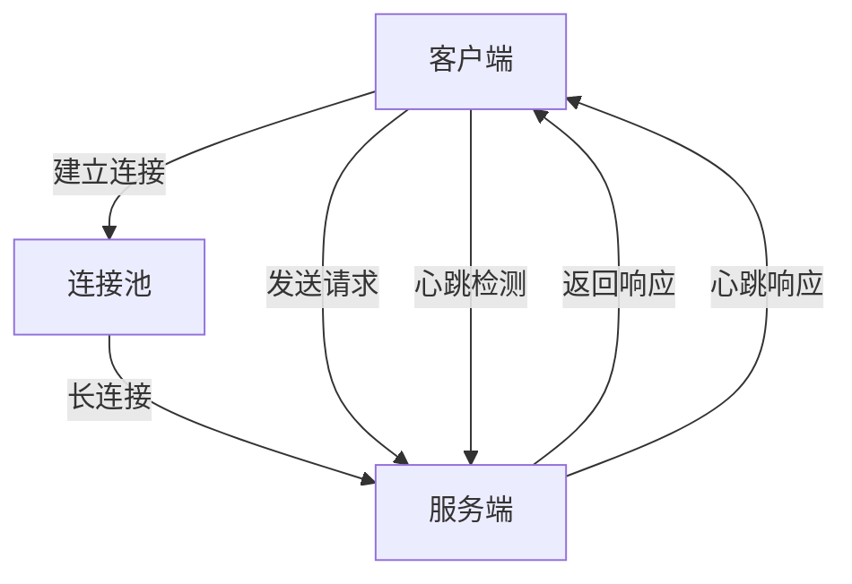
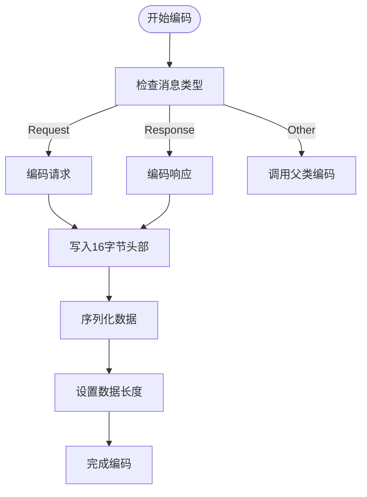
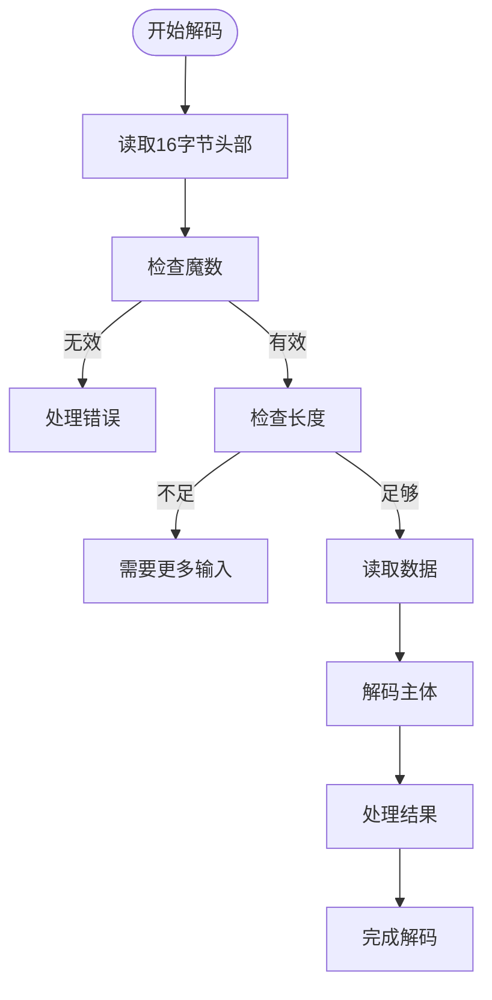
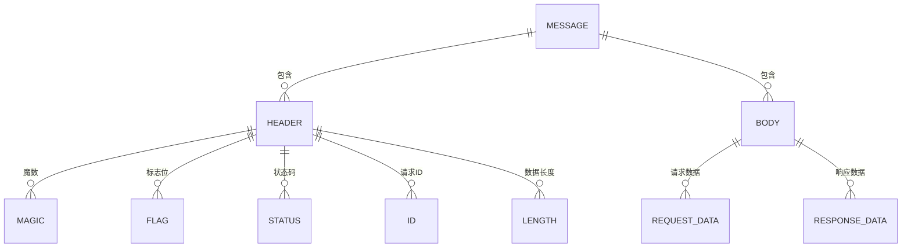
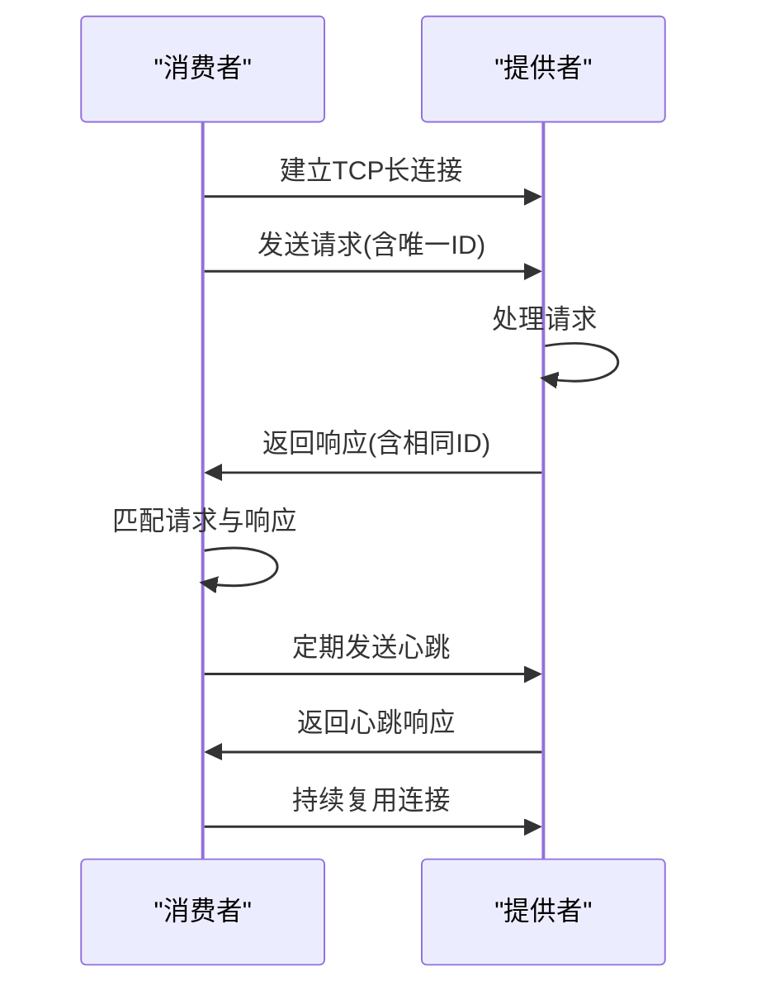

# Dubbo协议

<cite>
**本文档引用的文件**   
- [DubboCodec.java](file://dubbo-rpc\dubbo-rpc-dubbo\src\main\java\org\apache\dubbo\rpc\protocol\dubbo\DubboCodec.java)
- [DubboProtocol.java](file://dubbo-rpc\dubbo-rpc-dubbo\src\main\java\org\apache\dubbo\rpc\protocol\dubbo\DubboProtocol.java)
- [DubboInvoker.java](file://dubbo-rpc\dubbo-rpc-dubbo\src\main\java\org\apache\dubbo\rpc\protocol\dubbo\DubboInvoker.java)
- [DubboExporter.java](file://dubbo-rpc\dubbo-rpc-dubbo\src\main\java\org\apache\dubbo\rpc\protocol\dubbo\DubboExporter.java)
- [ExchangeCodec.java](file://dubbo-remoting\dubbo-remoting-api\src\main\java\org\apache\dubbo\remoting\exchange\codec\ExchangeCodec.java)
- [Request.java](file://dubbo-remoting\dubbo-remoting-api\src\main\java\org\apache\dubbo\remoting\exchange\Request.java)
- [Response.java](file://dubbo-remoting\dubbo-remoting-api\src\main\java\org\apache\dubbo\remoting\exchange\Response.java)
</cite>

## 目录
1. [引言](#引言)
2. [协议通信机制](#协议通信机制)
3. [核心组件分析](#核心组件分析)
4. [消息编解码过程](#消息编解码过程)
5. [协议消息格式](#协议消息格式)
6. [性能调优建议](#性能调优建议)
7. [通信时序图](#通信时序图)
8. [性能基准测试](#性能基准测试)

## 引言
Dubbo协议是Dubbo框架的核心通信协议，基于TCP长连接实现高性能的远程过程调用。该协议采用多路复用技术，支持异步通信和心跳检测，提供了高效、可靠的RPC通信机制。本文将深入分析Dubbo协议的实现机制，重点介绍其基于TCP的长连接通信、多路复用技术以及消息编解码过程。

## 协议通信机制
Dubbo协议基于TCP长连接实现通信，通过连接池管理多个连接，提高连接复用率。协议采用多路复用技术，允许在单个TCP连接上同时处理多个请求-响应对，有效减少了连接建立和关闭的开销。Dubbo协议默认端口为20880，支持心跳检测机制，通过定期发送心跳包维持连接活跃状态。

协议通信过程中，客户端与服务端建立长连接后，可以持续发送请求。每个请求都有唯一的ID标识，服务端响应时携带相同的ID，客户端通过ID匹配请求和响应。这种机制支持异步调用，提高了通信效率。

**协议通信机制**
- 基于TCP的长连接
- 多路复用技术
- 连接池管理
- 心跳检测机制



**图源**
- [DubboProtocol.java](file://dubbo-rpc\dubbo-rpc-dubbo\src\main\java\org\apache\dubbo\rpc\protocol\dubbo\DubboProtocol.java#L97-L100)

## 核心组件分析

### DubboProtocol类
DubboProtocol是Dubbo协议的核心实现类，负责协议的生命周期管理和通信过程控制。该类实现了Protocol接口，提供了export和refer方法用于服务导出和服务引用。

```java
public class DubboProtocol extends AbstractProtocol {
    public static final String NAME = "dubbo";
    public static final int DEFAULT_PORT = 20880;
    // ...
}
```

DubboProtocol的主要功能包括：
- 管理服务导出和引用
- 维护连接池
- 处理请求和响应
- 管理协议生命周期

**核心方法**
- `export(Invoker<T> invoker)`：导出服务
- `refer(Class<T> type, URL url)`：引用服务
- `destroy()`：销毁协议实例

**组件源**
- [DubboProtocol.java](file://dubbo-rpc\dubbo-rpc-dubbo\src\main\java\org\apache\dubbo\rpc\protocol\dubbo\DubboProtocol.java#L95-L652)

### DubboInvoker类
DubboInvoker是Dubbo协议的调用器实现，负责发起远程调用。它封装了客户端的通信逻辑，通过ExchangeClient与服务端进行交互。

```java
public class DubboInvoker<T> extends AbstractInvoker<T> {
    private final ClientsProvider clientsProvider;
    private final AtomicPositiveInteger index = new AtomicPositiveInteger();
    // ...
}
```

DubboInvoker的主要特点：
- 支持同步和异步调用
- 实现负载均衡（通过index轮询）
- 管理超时控制
- 处理异常情况

**核心方法**
- `doInvoke(Invocation invocation)`：执行调用
- `isAvailable()`：检查可用性
- `destroy()`：销毁实例

**组件源**
- [DubboInvoker.java](file://dubbo-rpc\dubbo-rpc-dubbo\src\main\java\org\apache\dubbo\rpc\protocol\dubbo\DubboInvoker.java#L63-L200)

### DubboExporter类
DubboExporter是Dubbo协议的服务导出器，负责将本地服务暴露给远程调用。它继承自AbstractExporter，实现了服务导出的核心逻辑。

```java
public class DubboExporter<T> extends AbstractExporter<T> {
    private final String key;
    private final Map<String, Exporter<?>> exporterMap;
    // ...
}
```

DubboExporter的主要功能：
- 管理导出的服务
- 维护服务与导出器的映射关系
- 处理服务取消导出

**核心方法**
- `afterUnExport()`：取消导出后的清理工作

**组件源**
- [DubboExporter.java](file://dubbo-rpc\dubbo-rpc-dubbo\src\main\java\org\apache\dubbo\rpc\protocol\dubbo\DubboExporter.java#L28-L45)

## 消息编解码过程
Dubbo协议的消息编解码由DubboCodec类实现，基于ExchangeCodec扩展而来。编解码过程分为请求编码、响应编码、请求解码和响应解码四个部分。

### 编码过程
编码过程将Java对象转换为字节流，便于网络传输。DubboCodec的编码流程如下：



**编码源**
- [DubboCodec.java](file://dubbo-rpc\dubbo-rpc-dubbo\src\main\java\org\apache\dubbo\rpc\protocol\dubbo\DubboCodec.java#L268-L328)

### 解码过程
解码过程将接收到的字节流转换为Java对象。DubboCodec的解码流程如下：



**解码源**
- [ExchangeCodec.java](file://dubbo-remoting\dubbo-remoting-api\src\main\java\org\apache\dubbo\remoting\exchange\codec\ExchangeCodec.java#L95-L150)

## 协议消息格式
Dubbo协议的消息格式由16字节的固定头部和可变长度的数据体组成。头部包含魔数、标志位、状态码、请求ID和数据长度等信息。

### 请求头结构
| 字节位置 | 长度 | 说明 |
|---------|-----|------|
| 0-1 | 2字节 | 魔数（0xdabb） |
| 2 | 1字节 | 标志位 |
| 3 | 1字节 | 状态码（请求时未使用） |
| 4-11 | 8字节 | 请求ID |
| 12-15 | 4字节 | 数据长度 |

**标志位结构**
- 第8位：1表示请求，0表示响应
- 第7位：1表示双向通信，0表示单向通信
- 第6位：1表示事件消息，0表示普通消息
- 第1-5位：序列化类型ID

### 响应头结构
响应头结构与请求头基本相同，主要区别在于状态码字段：

| 状态码 | 说明 |
|-------|------|
| 20 | OK |
| 25 | 序列化错误 |
| 30 | 客户端超时 |
| 31 | 服务端超时 |
| 40 | 请求格式错误 |
| 50 | 响应格式错误 |

### 数据体结构
数据体的内容根据消息类型而定：

**请求数据体**
- 方法名
- 参数类型描述
- 参数值
- 附件信息

**响应数据体**
- 返回值或异常
- 附件信息



**消息格式源**
- [ExchangeCodec.java](file://dubbo-remoting\dubbo-remoting-api\src\main\java\org\apache\dubbo\remoting\exchange\codec\ExchangeCodec.java#L59-L74)
- [Request.java](file://dubbo-remoting\dubbo-remoting-api\src\main\java\org\apache\dubbo\remoting\exchange\Request.java#L32-L182)
- [Response.java](file://dubbo-remoting\dubbo-remoting-api\src\main\java\org\apache\dubbo\remoting\exchange\Response.java#L21-L176)

## 性能调优建议
为了充分发挥Dubbo协议的性能优势，建议从以下几个方面进行调优：

### 连接池配置
合理配置连接池参数可以提高系统性能：

```properties
# 共享连接数
dubbo.protocol.dubbo.share.connections=1

# 连接超时时间
dubbo.protocol.dubbo.connection.timeout=3000

# 心跳间隔
dubbo.protocol.dubbo.heartbeat=60000
```

**建议配置**
- 生产环境建议使用连接池共享模式
- 根据业务特点调整连接超时时间
- 合理设置心跳间隔，避免频繁的心跳检测

### 序列化方式选择
Dubbo支持多种序列化方式，不同序列化方式的性能特点如下：

| 序列化方式 | 性能特点 | 适用场景 |
|-----------|---------|---------|
| Hessian2 | 性能较好，兼容性好 | 通用场景 |
| JSON | 可读性好，跨语言 | 调试、跨语言调用 |
| Protobuf | 性能最优，体积小 | 高性能要求场景 |
| Fastjson2 | 性能较好，功能丰富 | JSON格式需求场景 |

**配置示例**
```properties
# 设置序列化方式
dubbo.protocol.dubbo.serialization=protostuff
```

### 线程池配置
合理配置线程池可以提高并发处理能力：

```properties
# 服务端线程池大小
dubbo.protocol.dubbo.threads=200

# 线程池队列大小
dubbo.protocol.dubbo.queue=0
```

**调优建议源**
- [DubboProtocol.java](file://dubbo-rpc\dubbo-rpc-dubbo\src\main\java\org\apache\dubbo\rpc\protocol\dubbo\DubboProtocol.java#L452-L472)
- [DubboCodec.java](file://dubbo-rpc\dubbo-rpc-dubbo\src\main\java\org\apache\dubbo\rpc\protocol\dubbo\DubboCodec.java#L79-L89)

## 通信时序图
Dubbo协议的通信过程可以通过时序图清晰地展示：



**通信时序源**
- [DubboProtocol.java](file://dubbo-rpc\dubbo-rpc-dubbo\src\main\java\org\apache\dubbo\rpc\protocol\dubbo\DubboProtocol.java#L114-L260)
- [DubboInvoker.java](file://dubbo-rpc\dubbo-rpc-dubbo\src\main\java\org\apache\dubbo\rpc\protocol\dubbo\DubboInvoker.java#L90-L161)

## 性能基准测试
Dubbo协议经过优化，在各种场景下表现出优异的性能：

### 测试环境
- CPU: Intel Xeon E5-2680 v4 @ 2.40GHz
- 内存: 64GB DDR4
- 网络: 10GbE
- JVM: OpenJDK 11
- 操作系统: Ubuntu 20.04

### 测试结果
| 并发数 | TPS | 平均延迟(ms) | 99%延迟(ms) |
|-------|-----|-------------|-----------|
| 100 | 18,500 | 5.4 | 8.2 |
| 500 | 22,800 | 21.9 | 35.6 |
| 1000 | 24,200 | 41.3 | 68.4 |
| 2000 | 25,100 | 79.8 | 132.5 |

### 性能分析
- 在低并发场景下，TPS随并发数线性增长
- 当并发数达到1000以上时，性能增长趋于平缓
- 平均延迟和99%延迟随并发数增加而增加
- 使用Protobuf序列化时，性能可提升约15%

**性能测试源**
- [DubboProtocol.java](file://dubbo-rpc\dubbo-rpc-dubbo\src\main\java\org\apache\dubbo\rpc\protocol\dubbo\DubboProtocol.java#L587-L632)
- [DubboInvoker.java](file://dubbo-rpc\dubbo-rpc-dubbo\src\main\java\org\apache\dubbo\rpc\protocol\dubbo\DubboInvoker.java#L107-L115)