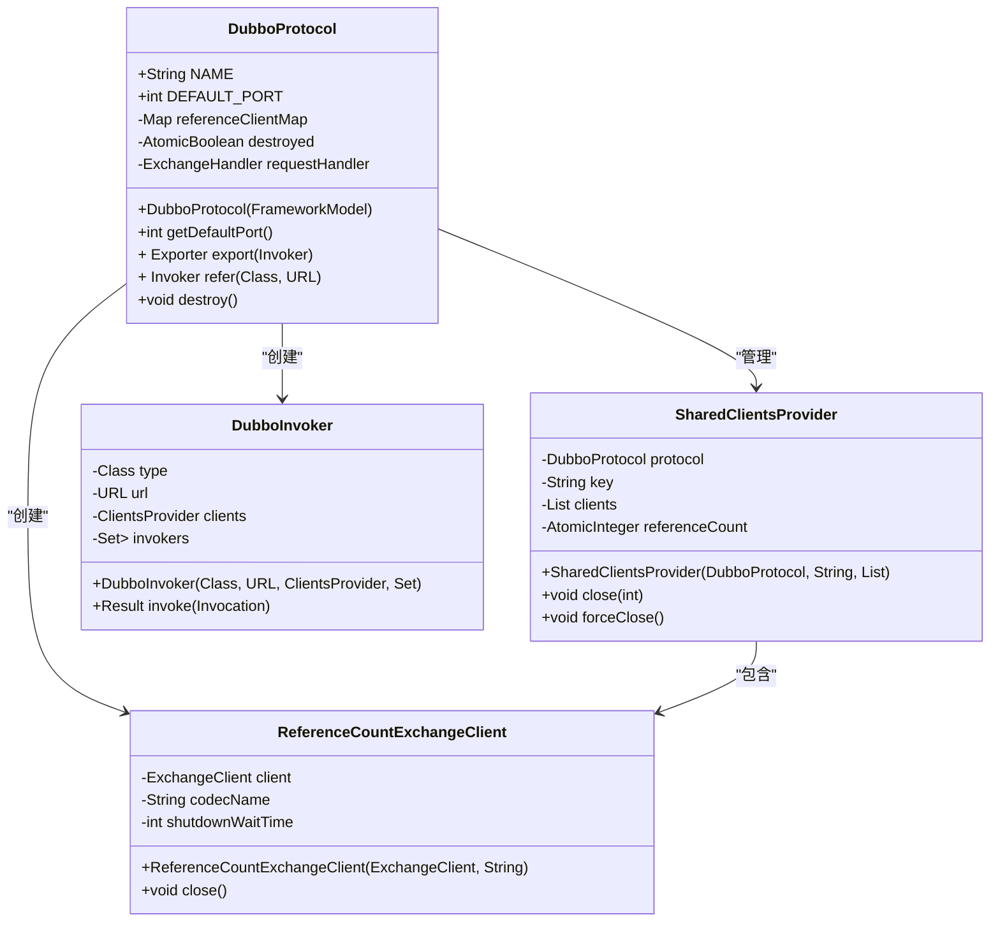
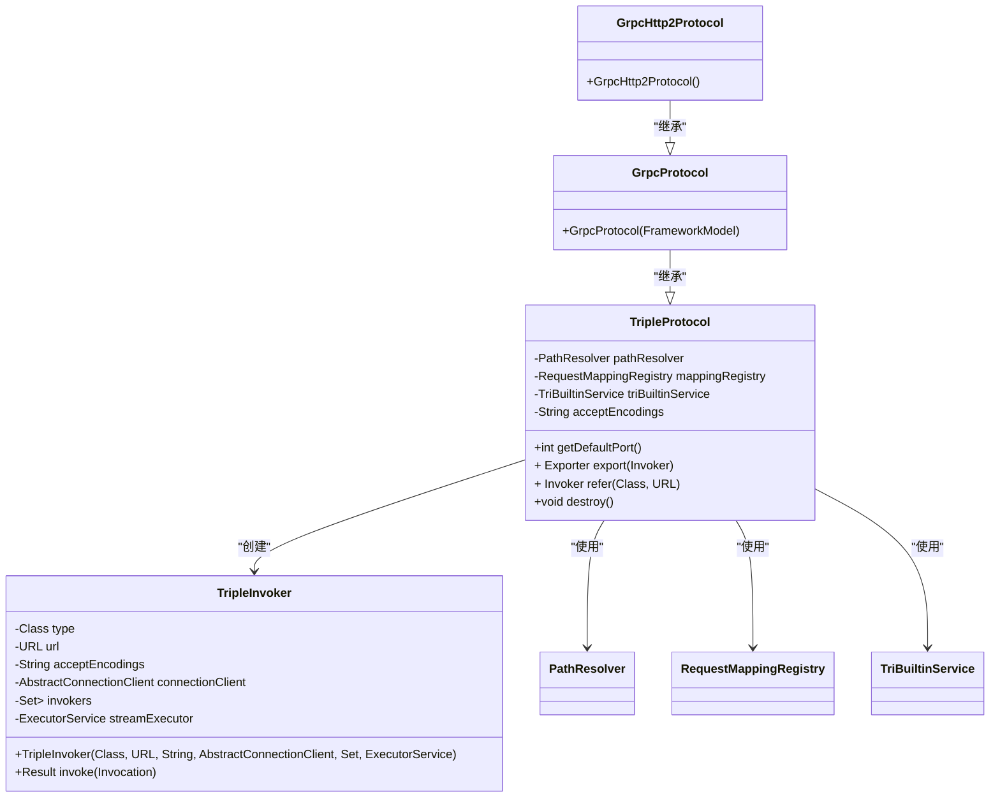
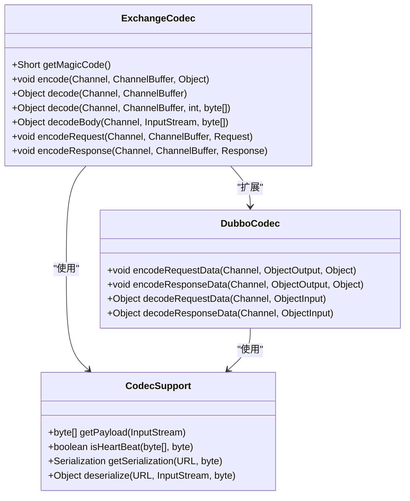
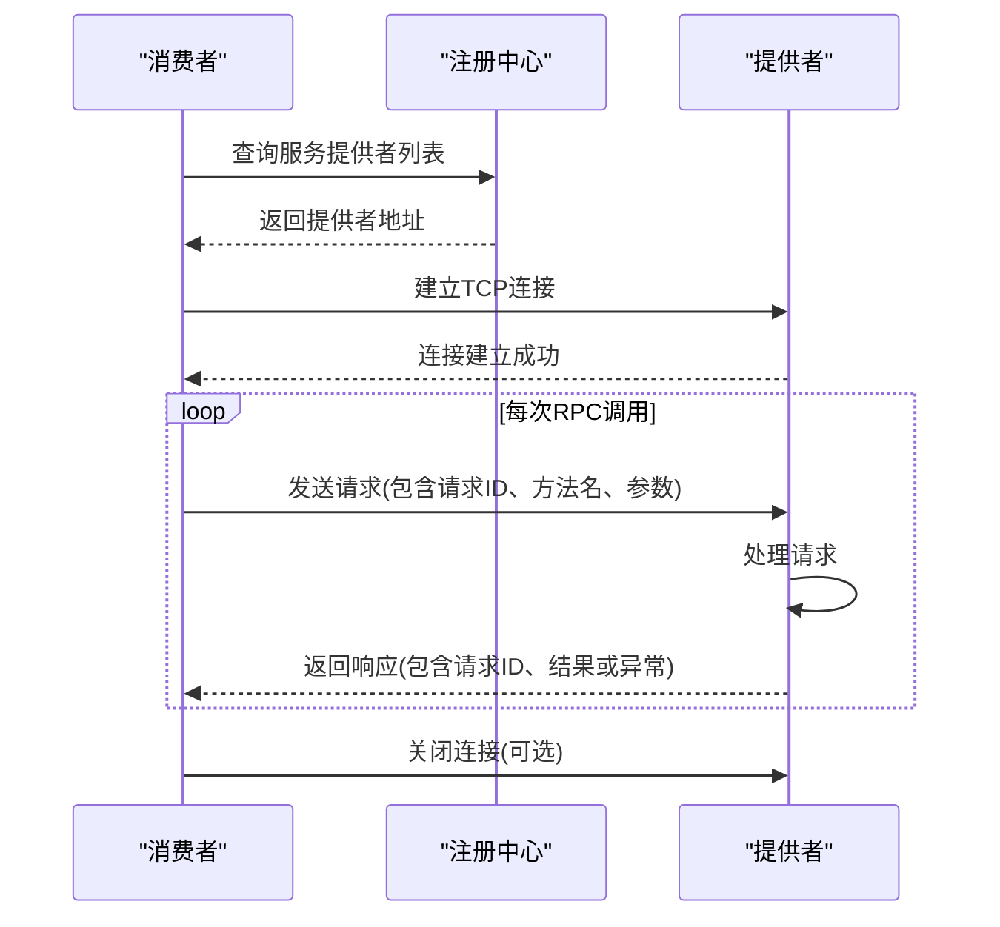
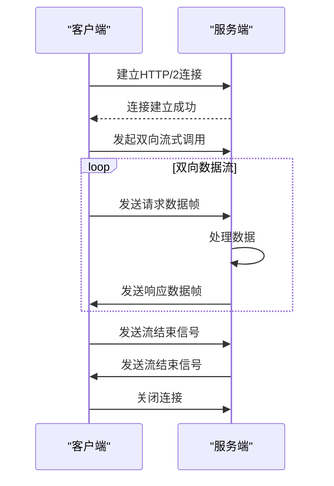

# RPC协议实现

<cite>
**本文档引用的文件**   
- [Protocol.java](file://dubbo-rpc\dubbo-rpc-api\src\main\java\org\apache\dubbo\rpc\Protocol.java)
- [DubboProtocol.java](file://dubbo-rpc\dubbo-rpc-dubbo\src\main\java\org\apache\dubbo\rpc\protocol\dubbo\DubboProtocol.java)
- [TripleProtocol.java](file://dubbo-rpc\dubbo-rpc-triple\src\main\java\org\apache\dubbo\rpc\protocol\tri\TripleProtocol.java)
- [ExchangeCodec.java](file://dubbo-remoting\dubbo-remoting-api\src\main\java\org\apache\dubbo\remoting\exchange\codec\ExchangeCodec.java)
- [DubboCodec.java](file://dubbo-rpc\dubbo-rpc-dubbo\src\main\java\org\apache\dubbo\rpc\protocol\dubbo\DubboCodec.java)
</cite>

## 目录
1. [引言](#引言)
2. [协议接口设计原理](#协议接口设计原理)
3. [Dubbo协议实现](#dubbo协议实现)
4. [Triple协议实现](#triple协议实现)
5. [编解码过程](#编解码过程)
6. [消息格式与传输特性](#消息格式与传输特性)
7. [协议通信时序图](#协议通信时序图)
8. [性能对比与调优建议](#性能对比与调优建议)
9. [协议选择指导原则](#协议选择指导原则)
10. [结论](#结论)

## 引言
本文档详细介绍了Dubbo框架中RPC协议的实现，重点分析Dubbo和Triple协议。文档涵盖了Protocol接口的设计原理、生命周期管理、TCP长连接、多路复用机制、gRPC兼容性实现、编解码过程、消息格式和传输特性。同时为初学者提供协议选择的指导原则，并为经验丰富的开发者提供性能调优建议。

## 协议接口设计原理

Dubbo框架中的Protocol接口是RPC协议扩展的核心接口，封装了远程调用的细节。该接口遵循SPI（Service Provider Interface）设计模式，允许用户自定义协议实现。

Protocol接口的主要设计原则包括：
- **透明代理**：协议实现不关心透明代理，由其他层将Invoker转换为业务接口
- **连接无关性**：协议不一定基于TCP连接，也可以基于文件共享或进程间通信
- **幂等性**：export方法必须是幂等的，即对同一URL导出一次和两次没有区别
- **资源管理**：destroy方法用于取消所有导出和引用的服务，释放占用的资源

Protocol接口定义了三个核心方法：
- `getDefaultPort()`：获取默认端口
- `export()`：导出服务供远程调用
- `refer()`：引用远程服务

**Section sources**
- [Protocol.java](file://dubbo-rpc\dubbo-rpc-api\src\main\java\org\apache\dubbo\rpc\Protocol.java#L58-L118)

## Dubbo协议实现

DubboProtocol是Dubbo框架的默认协议实现，基于Netty的TCP长连接和NIO异步通信。它采用多路复用机制，一个服务提供者可以处理多个消费者的请求。

### TCP长连接与多路复用

DubboProtocol使用TCP长连接来减少连接建立和断开的开销。客户端与服务端建立连接后，该连接会保持长时间有效，用于传输多个RPC调用。

多路复用机制通过共享连接实现，多个服务可以共享同一个连接。DubboProtocol提供了两种连接共享模式：
- **共享连接模式**：多个服务共享一个连接
- **独占连接模式**：每个服务使用独立的连接

**Diagram sources**
- [DubboProtocol.java](file://dubbo-rpc\dubbo-rpc-dubbo\src\main\java\org\apache\dubbo\rpc\protocol\dubbo\DubboProtocol.java#L95-L652)

**Section sources**
- [DubboProtocol.java](file://dubbo-rpc\dubbo-rpc-dubbo\src\main\java\org\apache\dubbo\rpc\protocol\dubbo\DubboProtocol.java#L95-L652)

## Triple协议实现

TripleProtocol是Dubbo3推出的基于HTTP/2的协议，完全兼容gRPC，支持流式通信和双向流。

### gRPC兼容性实现

TripleProtocol通过以下方式实现gRPC兼容性：
- 使用HTTP/2作为传输层协议
- 遵循gRPC的消息格式和头部规范
- 支持gRPC的四种通信模式：简单RPC、服务器流式RPC、客户端流式RPC和双向流式RPC
- 兼容gRPC的错误码映射

**Diagram sources**
- [TripleProtocol.java](file://dubbo-rpc\dubbo-rpc-triple\src\main\java\org\apache\dubbo\rpc\protocol\tri\TripleProtocol.java#L59-L225)
- [GrpcProtocol.java](file://dubbo-rpc\dubbo-rpc-triple\src\main\java\org\apache\dubbo\rpc\protocol\tri\GrpcProtocol.java#L21-L26)
- [GrpcHttp2Protocol.java](file://dubbo-rpc\dubbo-rpc-triple\src\main\java\org\apache\dubbo\rpc\protocol\tri\GrpcHttp2Protocol.java#L21-L22)

**Section sources**
- [TripleProtocol.java](file://dubbo-rpc\dubbo-rpc-triple\src\main\java\org\apache\dubbo\rpc\protocol\tri\TripleProtocol.java#L59-L225)

## 编解码过程

Dubbo框架的编解码过程由Codec接口定义，负责消息的序列化和反序列化。

### 编解码器设计

ExchangeCodec是Dubbo框架的核心编解码器，继承自TelnetCodec，处理RPC请求和响应的编码解码。

**Diagram sources**
- [ExchangeCodec.java](file://dubbo-remoting\dubbo-remoting-api\src\main\java\org\apache\dubbo\remoting\exchange\codec\ExchangeCodec.java#L57-L562)
- [DubboCodec.java](file://dubbo-rpc\dubbo-rpc-dubbo\src\main\java\org\apache\dubbo\rpc\protocol\dubbo\DubboCodec.java)

**Section sources**
- [ExchangeCodec.java](file://dubbo-remoting\dubbo-remoting-api\src\main\java\org\apache\dubbo\remoting\exchange\codec\ExchangeCodec.java#L57-L562)

## 消息格式与传输特性

### 消息头格式

Dubbo协议的消息头采用固定16字节格式，包含以下字段：

| 字段 | 位置 | 长度 | 说明 |
|------|------|------|------|
| 魔数 | 0-1 | 2字节 | 0xdabb，用于标识Dubbo协议 |
| 标志位 | 2 | 1字节 | 包含请求/响应标志、双向调用标志、事件标志和序列化类型 |
| 状态 | 3 | 1字节 | 响应状态码 |
| 请求ID | 4-11 | 8字节 | 请求唯一标识 |
| 数据长度 | 12-15 | 4字节 | 消息体长度 |

### 传输特性

- **心跳机制**：通过特殊的消息类型实现心跳检测，保持连接活跃
- **负载限制**：支持配置最大负载大小，防止内存溢出
- **异常处理**：完善的异常处理机制，确保通信的可靠性
- **流控机制**：支持流量控制，防止服务过载

**Section sources**
- [ExchangeCodec.java](file://dubbo-remoting\dubbo-remoting-api\src\main\java\org\apache\dubbo\remoting\exchange\codec\ExchangeCodec.java#L59-L70)

## 协议通信时序图

### Dubbo协议调用时序

**Diagram sources**
- [DubboProtocol.java](file://dubbo-rpc\dubbo-rpc-dubbo\src\main\java\org\apache\dubbo\rpc\protocol\dubbo\DubboProtocol.java#L114-L259)

### Triple协议流式调用时序

**Diagram sources**
- [TripleProtocol.java](file://dubbo-rpc\dubbo-rpc-triple\src\main\java\org\apache\dubbo\rpc\protocol\tri\TripleProtocol.java#L184-L194)

## 性能对比与调优建议

### 性能对比

| 特性 | Dubbo协议 | Triple协议 |
|------|----------|-----------|
| 传输协议 | TCP | HTTP/2 |
| 连接模式 | 长连接 | 长连接 |
| 多路复用 | 支持 | 支持 |
| 序列化 | Hessian2等 | Protobuf等 |
| 兼容性 | Dubbo生态 | gRPC生态 |
| 吞吐量 | 高 | 中高 |
| 延迟 | 低 | 低 |
| 流式支持 | 有限 | 完整支持 |

### 性能调优建议

1. **连接管理优化**
   - 合理配置连接数，避免过多连接导致资源浪费
   - 使用连接池管理连接，提高连接复用率

2. **序列化优化**
   - 选择高效的序列化方式，如Protobuf
   - 避免传输不必要的数据字段

3. **线程池配置**
   - 根据业务特点合理配置线程池大小
   - 避免线程池过小导致请求堆积

4. **负载均衡**
   - 选择合适的负载均衡策略
   - 配置合理的权重和路由规则

5. **监控与诊断**
   - 启用详细的日志记录
   - 配置性能监控指标

**Section sources**
- [DubboProtocol.java](file://dubbo-rpc\dubbo-rpc-dubbo\src\main\java\org\apache\dubbo\rpc\protocol\dubbo\DubboProtocol.java#L452-L472)
- [TripleProtocol.java](file://dubbo-rpc\dubbo-rpc-triple\src\main\java\org\apache\dubbo\rpc\protocol\tri\TripleProtocol.java#L197-L204)

## 协议选择指导原则

### 初学者选择建议

1. **学习成本**
   - Dubbo协议：适合初学者，文档丰富，社区支持好
   - Triple协议：需要了解HTTP/2和gRPC概念

2. **开发效率**
   - Dubbo协议：集成简单，配置直观
   - Triple协议：需要更多配置，但功能更强大

3. **生态系统**
   - Dubbo协议：与Dubbo生态无缝集成
   - Triple协议：与gRPC生态兼容，跨语言支持好

### 企业级应用选择建议

1. **性能要求**
   - 高吞吐量场景：优先选择Dubbo协议
   - 流式处理场景：优先选择Triple协议

2. **跨语言需求**
   - 单语言系统：Dubbo协议足够
   - 多语言系统：Triple协议更合适

3. **云原生环境**
   - Kubernetes环境：Triple协议更适合，与服务网格集成更好
   - 传统环境：Dubbo协议更稳定

4. **未来扩展**
   - 长期规划：考虑Triple协议，符合云原生趋势
   - 短期项目：Dubbo协议更快上线

## 结论

Dubbo框架提供了两种主要的RPC协议实现：Dubbo协议和Triple协议。Dubbo协议基于TCP长连接和多路复用，具有高性能和低延迟的特点，适合传统的微服务架构。Triple协议基于HTTP/2，完全兼容gRPC，支持流式通信，更适合云原生环境和跨语言场景。

开发者应根据具体的应用场景、性能要求和团队技术栈选择合适的协议。对于新项目，建议优先考虑Triple协议，以获得更好的云原生支持和跨语言能力。对于现有系统，可以根据实际需求逐步迁移。