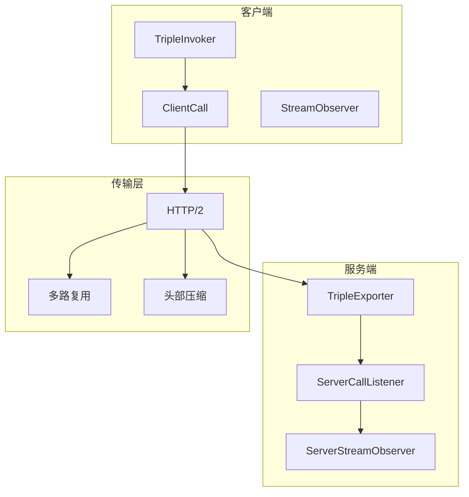
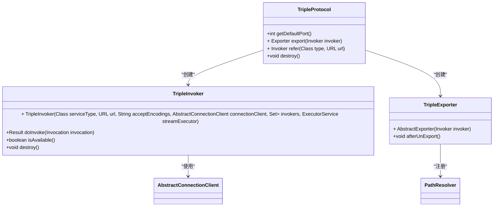
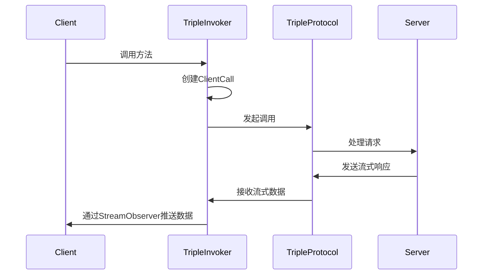
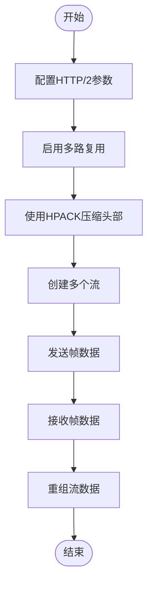
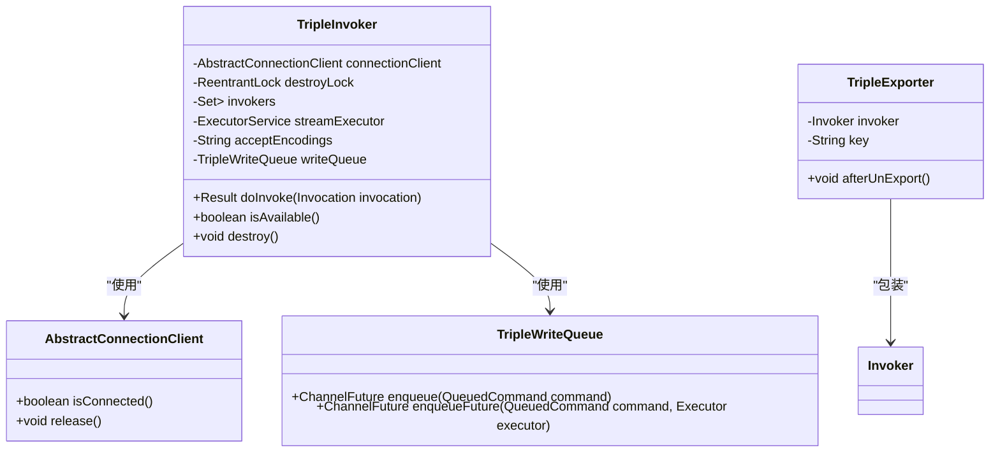
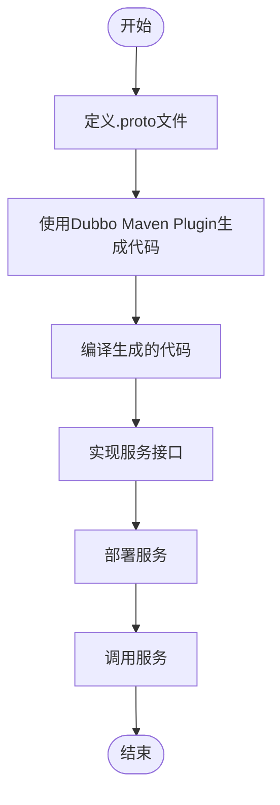
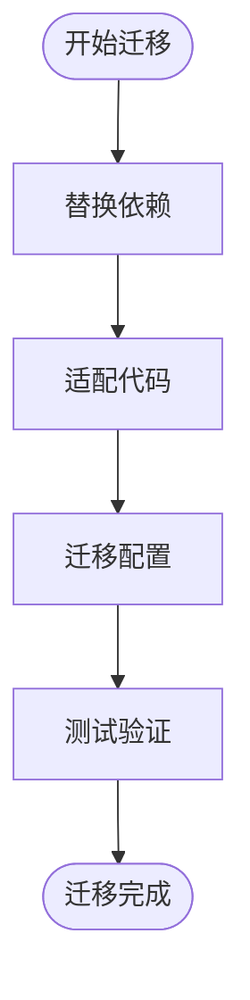
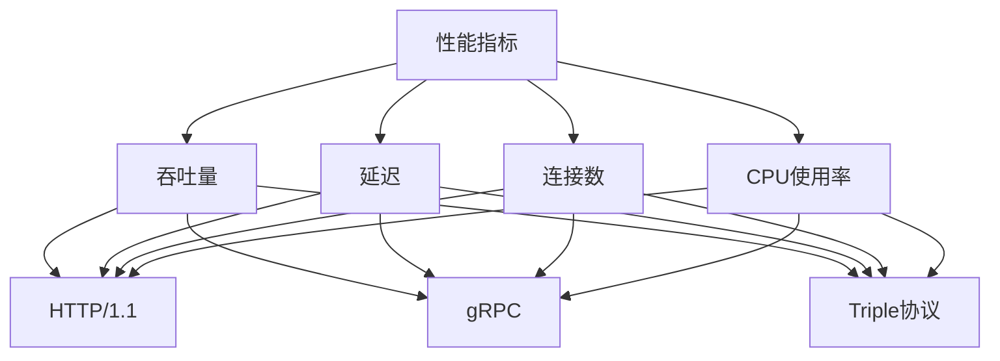
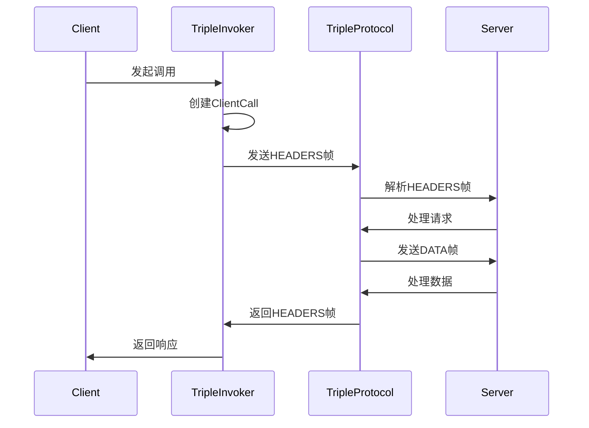

# Triple协议

<cite>
**本文档引用的文件**
- [TripleProtocol.java](file://dubbo-rpc\dubbo-rpc-triple\src\main\java\org\apache\dubbo\rpc\protocol\tri\TripleProtocol.java)
- [TripleInvoker.java](file://dubbo-rpc\dubbo-rpc-triple\src\main\java\org\apache\dubbo\rpc\protocol\tri\TripleInvoker.java)
- [TripleHttp2Protocol.java](file://dubbo-rpc\dubbo-rpc-triple\src\main\java\org\apache\dubbo\rpc\protocol\tri\TripleHttp2Protocol.java)
- [GrpcProtocol.java](file://dubbo-rpc\dubbo-rpc-triple\src\main\java\org\apache\dubbo\rpc\protocol\tri\GrpcProtocol.java)
- [GrpcHttp2Protocol.java](file://dubbo-rpc\dubbo-rpc-triple\src\main\java\org\apache\dubbo\rpc\protocol\tri\GrpcHttp2Protocol.java)
- [Compressor.java](file://dubbo-rpc\dubbo-rpc-triple\src\main\java\org\apache\dubbo\rpc\protocol\tri\compressor\Compressor.java)
- [DeCompressor.java](file://dubbo-rpc\dubbo-rpc-triple\src\main\java\org\apache\dubbo\rpc\protocol\tri\compressor\DeCompressor.java)
- [TripleServerConnectionHandler.java](file://dubbo-rpc\dubbo-rpc-triple\src\main\java\org\apache\dubbo\rpc\protocol\tri\transport\TripleServerConnectionHandler.java)
- [TripleWriteQueue.java](file://dubbo-rpc\dubbo-rpc-triple\src\main\java\org\apache\dubbo\rpc\protocol\tri\transport\TripleWriteQueue.java)
</cite>

## 目录
1. [简介](#简介)
2. [协议架构](#协议架构)
3. [核心组件](#核心组件)
4. [流式通信实现](#流式通信实现)
5. [头部压缩与多路复用](#头部压缩与多路复用)
6. [TripleInvoker与TripleExporter实现](#tripleinvoker与tripleexporter实现)
7. [IDL定义与代码生成](#idl定义与代码生成)
8. [从gRPC迁移指南](#从grpc迁移指南)
9. [性能对比分析](#性能对比分析)
10. [协议交互时序图](#协议交互时序图)

## 简介
Triple协议是Dubbo框架中基于HTTP/2的高性能RPC协议，旨在提供与gRPC兼容的通信能力，同时保持Dubbo生态系统的完整性和扩展性。该协议充分利用HTTP/2的多路复用、头部压缩和流式传输特性，为微服务架构提供高效、可靠的通信基础。

Triple协议的设计目标是实现gRPC的兼容性，使开发者能够无缝地在Dubbo和gRPC生态系统之间迁移。协议支持四种调用模式：单向调用（UNARY）、服务器流式调用（SERVER_STREAM）、客户端流式调用（CLIENT_STREAM）和双向流式调用（BI_STREAM），满足不同场景下的通信需求。

**本文档引用的文件**
- [TripleProtocol.java](file://dubbo-rpc\dubbo-rpc-triple\src\main\java\org\apache\dubbo\rpc\protocol\tri\TripleProtocol.java)
- [TripleInvoker.java](file://dubbo-rpc\dubbo-rpc-triple\src\main\java\org\apache\dubbo\rpc\protocol\tri\TripleInvoker.java)

## 协议架构
Triple协议的架构设计充分借鉴了gRPC的优秀实践，同时融入了Dubbo特有的扩展机制。协议的核心组件包括TripleProtocol、TripleInvoker、TripleExporter以及基于HTTP/2的传输层实现。

协议的默认端口为50051，与gRPC保持一致，确保了跨生态系统的兼容性。TripleProtocol继承自AbstractProtocol，实现了Dubbo的协议扩展接口，同时通过PortUnificationExchanger支持端口统一，允许在同一端口上处理多种协议。

**图表来源**
- [TripleProtocol.java](file://dubbo-rpc\dubbo-rpc-triple\src\main\java\org\apache\dubbo\rpc\protocol\tri\TripleProtocol.java)
- [TripleInvoker.java](file://dubbo-rpc\dubbo-rpc-triple\src\main\java\org\apache\dubbo\rpc\protocol\tri\TripleInvoker.java)

**本节来源**
- [TripleProtocol.java](file://dubbo-rpc\dubbo-rpc-triple\src\main\java\org\apache\dubbo\rpc\protocol\tri\TripleProtocol.java)
- [TripleInvoker.java](file://dubbo-rpc\dubbo-rpc-triple\src\main\java\org\apache\dubbo\rpc\protocol\tri\TripleInvoker.java)

## 核心组件
Triple协议的核心组件包括TripleProtocol、TripleInvoker和TripleExporter，这些组件共同构成了协议的完整实现。

TripleProtocol是协议的主入口，负责管理服务的导出和引用。它通过PathResolver注册服务路径，通过RequestMappingRegistry管理REST映射，并通过ExecutorRepository管理线程池。协议还集成了健康检查服务（TriBuiltinService），支持gRPC健康检查协议。

TripleInvoker是客户端调用的核心组件，负责创建和管理客户端连接。它通过AbstractConnectionClient与服务端建立连接，并通过TripleWriteQueue管理写操作队列。Invoker支持同步和异步调用模式，并通过StreamExecutor处理流式调用的回调。

**图表来源**
- [TripleProtocol.java](file://dubbo-rpc\dubbo-rpc-triple\src\main\java\org\apache\dubbo\rpc\protocol\tri\TripleProtocol.java)
- [TripleInvoker.java](file://dubbo-rpc\dubbo-rpc-triple\src\main\java\org\apache\dubbo\rpc\protocol\tri\TripleInvoker.java)

**本节来源**
- [TripleProtocol.java](file://dubbo-rpc\dubbo-rpc-triple\src\main\java\org\apache\dubbo\rpc\protocol\tri\TripleProtocol.java)
- [TripleInvoker.java](file://dubbo-rpc\dubbo-rpc-triple\src\main\java\org\apache\dubbo\rpc\protocol\tri\TripleInvoker.java)

## 流式通信实现
Triple协议支持四种流式通信模式：单向调用、服务器流式调用、客户端流式调用和双向流式调用。这些模式通过StreamObserver接口实现，提供了灵活的流式数据处理能力。

在服务器流式调用中，客户端发送单个请求，服务端返回一个流式响应。客户端通过StreamObserver接收数据流，可以逐个处理响应数据。这种模式适用于大数据集的分页查询或实时数据推送场景。

在客户端流式调用中，客户端发送一个数据流，服务端返回单个响应。客户端通过StreamObserver发送数据流，服务端在接收到所有数据后进行处理并返回结果。这种模式适用于批量数据上传或聚合计算场景。

双向流式调用结合了前两种模式的特点，客户端和服务端都可以发送和接收数据流。这种模式适用于实时通信、聊天应用或交互式数据分析场景。

**图表来源**
- [TripleInvoker.java](file://dubbo-rpc\dubbo-rpc-triple\src\main\java\org\apache\dubbo\rpc\protocol\tri\TripleInvoker.java)
- [TripleProtocol.java](file://dubbo-rpc\dubbo-rpc-triple\src\main\java\org\apache\dubbo\rpc\protocol\tri\TripleProtocol.java)

**本节来源**
- [TripleInvoker.java](file://dubbo-rpc\dubbo-rpc-triple\src\main\java\org\apache\dubbo\rpc\protocol\tri\TripleInvoker.java)
- [TripleProtocol.java](file://dubbo-rpc\dubbo-rpc-triple\src\main\java\org\apache\dubbo\rpc\protocol\tri\TripleProtocol.java)

## 头部压缩与多路复用
Triple协议基于HTTP/2实现头部压缩和多路复用，显著提升了通信效率和性能。协议通过HPACK算法对HTTP头部进行压缩，减少了网络传输的数据量，特别适合高频次、小数据量的微服务调用场景。

多路复用机制允许在单个TCP连接上同时处理多个请求和响应，避免了HTTP/1.1的队头阻塞问题。每个请求和响应被划分为多个帧，并通过流ID进行标识和重组。这种机制不仅提高了连接利用率，还降低了连接建立和关闭的开销。

协议通过TripleHttp2Protocol配置HTTP/2的连接参数，包括头部表大小、最大并发流数、初始窗口大小和最大帧大小等。这些参数可以根据具体应用场景进行调优，以达到最佳性能。

**图表来源**
- [TripleHttp2Protocol.java](file://dubbo-rpc\dubbo-rpc-triple\src\main\java\org\apache\dubbo\rpc\protocol\tri\TripleHttp2Protocol.java)
- [TripleProtocol.java](file://dubbo-rpc\dubbo-rpc-triple\src\main\java\org\apache\dubbo\rpc\protocol\tri\TripleProtocol.java)

**本节来源**
- [TripleHttp2Protocol.java](file://dubbo-rpc\dubbo-rpc-triple\src\main\java\org\apache\dubbo\rpc\protocol\tri\TripleHttp2Protocol.java)
- [TripleProtocol.java](file://dubbo-rpc\dubbo-rpc-triple\src\main\java\org\apache\dubbo\rpc\protocol\tri\TripleProtocol.java)

## TripleInvoker与TripleExporter实现
TripleInvoker是Triple协议客户端的核心实现，负责管理客户端连接、发起远程调用和处理响应。它通过AbstractConnectionClient与服务端建立连接，并通过TripleWriteQueue管理写操作队列。Invoker支持四种调用模式，并根据方法描述符的RPC类型选择相应的调用方式。

TripleExporter是服务端的核心实现，负责导出服务、处理请求和管理连接。它通过PathResolver注册服务路径，并通过ExecutorRepository管理线程池。Exporter在销毁时会清理相关资源，包括取消注册服务路径和关闭连接。

**图表来源**
- [TripleInvoker.java](file://dubbo-rpc\dubbo-rpc-triple\src\main\java\org\apache\dubbo\rpc\protocol\tri\TripleInvoker.java)
- [TripleProtocol.java](file://dubbo-rpc\dubbo-rpc-triple\src\main\java\org\apache\dubbo\rpc\protocol\tri\TripleProtocol.java)
- [TripleWriteQueue.java](file://dubbo-rpc\dubbo-rpc-triple\src\main\java\org\apache\dubbo\rpc\protocol\tri\transport\TripleWriteQueue.java)

**本节来源**
- [TripleInvoker.java](file://dubbo-rpc\dubbo-rpc-triple\src\main\java\org\apache\dubbo\rpc\protocol\tri\TripleInvoker.java)
- [TripleProtocol.java](file://dubbo-rpc\dubbo-rpc-triple\src\main\java\org\apache\dubbo\rpc\protocol\tri\TripleProtocol.java)
- [TripleWriteQueue.java](file://dubbo-rpc\dubbo-rpc-triple\src\main\java\org\apache\dubbo\rpc\protocol\tri\transport\TripleWriteQueue.java)

## IDL定义与代码生成
Triple协议支持通过IDL（接口定义语言）定义服务接口，通常使用Protocol Buffers（protobuf）作为IDL格式。开发者通过.proto文件定义服务接口和数据结构，然后使用代码生成工具生成客户端和服务端的存根代码。

Dubbo提供了Dubbo Maven Plugin来支持代码生成，通过dubbo-compiler模块实现。插件可以解析.proto文件，生成相应的Java接口和实现类，包括服务接口、消息类和存根类。生成的代码与gRPC兼容，可以在Dubbo和gRPC生态系统之间无缝迁移。

**图表来源**
- [TripleProtocol.java](file://dubbo-rpc\dubbo-rpc-triple\src\main\java\org\apache\dubbo\rpc\protocol\tri\TripleProtocol.java)
- [TripleInvoker.java](file://dubbo-rpc\dubbo-rpc-triple\src\main\java\org\apache\dubbo\rpc\protocol\tri\TripleInvoker.java)

**本节来源**
- [TripleProtocol.java](file://dubbo-rpc\dubbo-rpc-triple\src\main\java\org\apache\dubbo\rpc\protocol\tri\TripleProtocol.java)
- [TripleInvoker.java](file://dubbo-rpc\dubbo-rpc-triple\src\main\java\org\apache\dubbo\rpc\protocol\tri\TripleInvoker.java)

## 从gRPC迁移指南
从gRPC迁移到Triple协议是一个相对平滑的过程，因为Triple协议设计上保持了与gRPC的兼容性。迁移的主要步骤包括：

1. **依赖替换**：将gRPC的依赖替换为Dubbo Triple协议的依赖。在Maven或Gradle配置中，移除gRPC相关依赖，添加Dubbo Triple协议的依赖。

2. **代码适配**：由于Triple协议与gRPC的API设计相似，大部分代码可以直接复用。需要调整的是客户端和服务端的启动代码，使用Dubbo的API进行服务导出和引用。

3. **配置迁移**：将gRPC的配置迁移到Dubbo的配置体系中。Triple协议支持通过URL参数配置各种选项，如超时时间、重试次数、负载均衡策略等。

4. **测试验证**：在迁移完成后，进行全面的测试验证，确保所有功能正常工作，性能满足要求。

**图表来源**
- [TripleProtocol.java](file://dubbo-rpc\dubbo-rpc-triple\src\main\java\org\apache\dubbo\rpc\protocol\tri\TripleProtocol.java)
- [TripleInvoker.java](file://dubbo-rpc\dubbo-rpc-triple\src\main\java\org\apache\dubbo\rpc\protocol\tri\TripleInvoker.java)

**本节来源**
- [TripleProtocol.java](file://dubbo-rpc\dubbo-rpc-triple\src\main\java\org\apache\dubbo\rpc\protocol\tri\TripleProtocol.java)
- [TripleInvoker.java](file://dubbo-rpc\dubbo-rpc-triple\src\main\java\org\apache\dubbo\rpc\protocol\tri\TripleInvoker.java)

## 性能对比分析
Triple协议在性能方面进行了多项优化，与传统的HTTP/1.1协议相比，具有显著的优势。通过HTTP/2的多路复用和头部压缩，Triple协议减少了网络延迟和带宽消耗，提高了通信效率。

在单向调用场景下，Triple协议的性能与gRPC相当，因为两者都基于HTTP/2实现。在流式调用场景下，Triple协议通过优化的流控机制和高效的序列化方式，表现出更好的性能。

与Dubbo传统的Dubbo协议相比，Triple协议在跨语言支持和生态系统兼容性方面具有优势，但在纯Java环境下的性能可能略低于Dubbo协议，因为HTTP/2的协议开销大于自定义的二进制协议。

**图表来源**
- [TripleProtocol.java](file://dubbo-rpc\dubbo-rpc-triple\src\main\java\org\apache\dubbo\rpc\protocol\tri\TripleProtocol.java)
- [TripleInvoker.java](file://dubbo-rpc\dubbo-rpc-triple\src\main\java\org\apache\dubbo\rpc\protocol\tri\TripleInvoker.java)

**本节来源**
- [TripleProtocol.java](file://dubbo-rpc\dubbo-rpc-triple\src\main\java\org\apache\dubbo\rpc\protocol\tri\TripleProtocol.java)
- [TripleInvoker.java](file://dubbo-rpc\dubbo-rpc-triple\src\main\java\org\apache\dubbo\rpc\protocol\tri\TripleInvoker.java)

## 协议交互时序图
Triple协议的交互时序图展示了客户端和服务端之间的完整通信流程。从连接建立到请求处理，再到响应返回，每个步骤都通过HTTP/2的帧进行传输。

在单向调用中，客户端发送HEADERS帧和DATA帧，服务端返回HEADERS帧和DATA帧。在流式调用中，数据帧可以分多次发送和接收，通过流ID进行关联和重组。

**图表来源**
- [TripleInvoker.java](file://dubbo-rpc\dubbo-rpc-triple\src\main\java\org\apache\dubbo\rpc\protocol\tri\TripleInvoker.java)
- [TripleProtocol.java](file://dubbo-rpc\dubbo-rpc-triple\src\main\java\org\apache\dubbo\rpc\protocol\tri\TripleProtocol.java)

**本节来源**
- [TripleInvoker.java](file://dubbo-rpc\dubbo-rpc-triple\src\main\java\org\apache\dubbo\rpc\protocol\tri\TripleInvoker.java)
- [TripleProtocol.java](file://dubbo-rpc\dubbo-rpc-triple\src\main\java\org\apache\dubbo\rpc\protocol\tri\TripleProtocol.java)