# dubbo-rpc模块

<cite>
**本文档引用的文件**   
- [Protocol.java](file://dubbo-rpc/dubbo-rpc-api/src/main/java/org/apache/dubbo/rpc/Protocol.java)
- [Invoker.java](file://dubbo-rpc/dubbo-rpc-api/src/main/java/org/apache/dubbo/rpc/Invoker.java)
- [Invocation.java](file://dubbo-rpc/dubbo-rpc-api/src/main/java/org/apache/dubbo/rpc/Invocation.java)
- [Result.java](file://dubbo-rpc/dubbo-rpc-api/src/main/java/org/apache/dubbo/rpc/Result.java)
- [RpcContext.java](file://dubbo-rpc/dubbo-rpc-api/src/main/java/org/apache/dubbo/rpc/RpcContext.java)
- [RpcInvocation.java](file://dubbo-rpc/dubbo-rpc-api/src/main/java/org/apache/dubbo/rpc/RpcInvocation.java)
- [AppResponse.java](file://dubbo-rpc/dubbo-rpc-api/src/main/java/org/apache/dubbo/rpc/AppResponse.java)
- [AsyncRpcResult.java](file://dubbo-rpc/dubbo-rpc-api/src/main/java/org/apache/dubbo/rpc/AsyncRpcResult.java)
</cite>

## 目录
1. [引言](#引言)
2. [核心接口设计](#核心接口设计)
3. [Protocol接口详解](#protocol接口详解)
4. [Invoker、Invocation和Result接口](#invoker、invocation和result接口)
5. [RPC协议实现](#rpc协议实现)
6. [服务暴露与引用流程](#服务暴露与引用流程)
7. [调用上下文管理](#调用上下文管理)
8. [RPC调用示例](#rpc调用示例)
9. [高级调用模式](#高级调用模式)
10. [流程图与调用链路](#流程图与调用链路)
11. [结论](#结论)

## 引言
dubbo-rpc模块是Apache Dubbo框架的核心组件，负责实现远程过程调用（RPC）的规范和机制。该模块提供了统一的RPC调用接口，封装了远程调用的细节，支持多种RPC协议的实现。本文档将详细介绍dubbo-rpc模块的设计原理、核心接口、协议实现以及使用方法，为开发者提供全面的技术参考。

## 核心接口设计
dubbo-rpc模块采用面向接口的设计思想，通过一系列核心接口定义了RPC调用的规范。这些接口构成了Dubbo RPC调用的基础，包括Protocol、Invoker、Invocation、Result等。接口设计遵循SPI（Service Provider Interface）原则，允许用户自定义实现，提供了良好的扩展性。

**本文档引用的文件**
- [Protocol.java](file://dubbo-rpc/dubbo-rpc-api/src/main/java/org/apache/dubbo/rpc/Protocol.java)
- [Invoker.java](file://dubbo-rpc/dubbo-rpc-api/src/main/java/org/apache/dubbo/rpc/Invoker.java)
- [Invocation.java](file://dubbo-rpc/dubbo-rpc-api/src/main/java/org/apache/dubbo/rpc/Invocation.java)
- [Result.java](file://dubbo-rpc/dubbo-rpc-api/src/main/java/org/apache/dubbo/rpc/Result.java)

## Protocol接口详解
Protocol接口是Dubbo RPC模块的核心接口，定义了RPC协议的规范。该接口封装了远程调用的细节，提供了服务暴露和引用的功能。

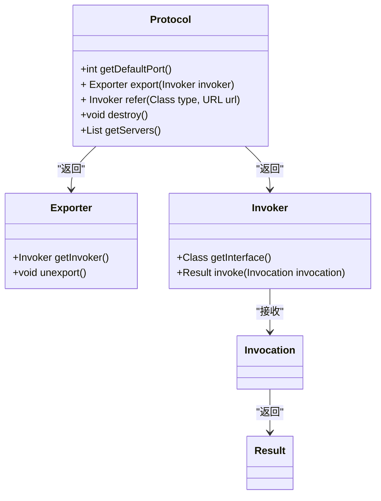

**图示来源**
- [Protocol.java](file://dubbo-rpc/dubbo-rpc-api/src/main/java/org/apache/dubbo/rpc/Protocol.java#L58-L118)
- [Invoker.java](file://dubbo-rpc/dubbo-rpc-api/src/main/java/org/apache/dubbo/rpc/Invoker.java#L29-L46)

### 接口方法说明
- `getDefaultPort()`: 获取协议的默认端口
- `export(Invoker<T> invoker)`: 暴露服务，将本地服务实例暴露为远程可调用的服务
- `refer(Class<T> type, URL url)`: 引用服务，创建远程服务的本地代理
- `destroy()`: 销毁协议，释放所有资源
- `getServers()`: 获取当前协议服务的所有服务器实例

### 设计原则
Protocol接口遵循以下设计原则：
1. **透明代理**: 协议实现不关心透明代理，由其他层完成
2. **无状态**: 协议实现应该是无状态的，可以被多个线程共享
3. **可扩展**: 通过SPI机制支持自定义协议实现
4. **线程安全**: 接口方法需要保证线程安全

## Invoker、Invocation和Result接口

### Invoker接口
Invoker接口是执行远程调用的核心接口，代表了一个可执行的服务调用。

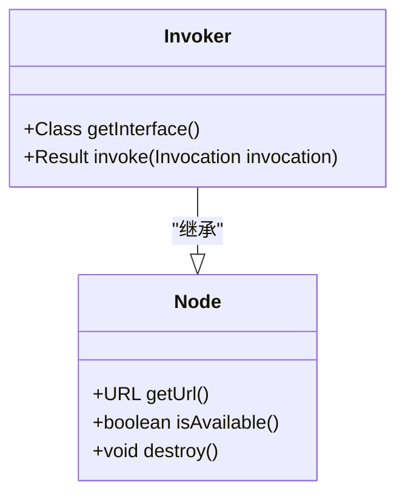

**图示来源**
- [Invoker.java](file://dubbo-rpc/dubbo-rpc-api/src/main/java/org/apache/dubbo/rpc/Invoker.java#L29-L46)

Invoker接口的主要方法：
- `getInterface()`: 获取服务接口类型
- `invoke(Invocation invocation)`: 执行调用，接收Invocation对象并返回Result对象

### Invocation接口
Invocation接口表示一次RPC调用的信息，包含了调用所需的所有上下文。

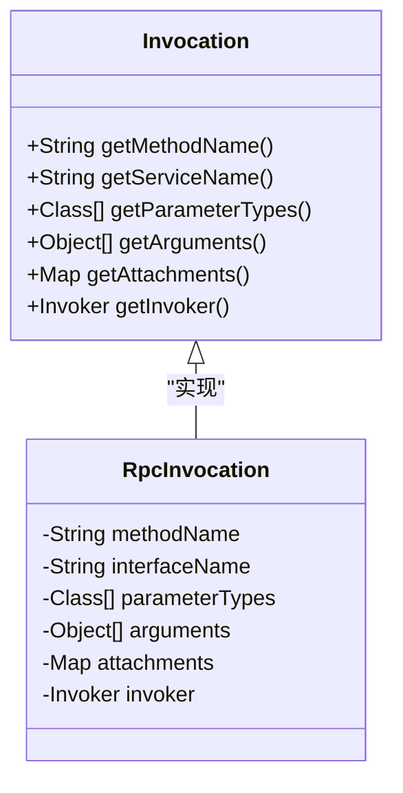

**图示来源**
- [Invocation.java](file://dubbo-rpc/dubbo-rpc-api/src/main/java/org/apache/dubbo/rpc/Invocation.java#L37-L182)
- [RpcInvocation.java](file://dubbo-rpc/dubbo-rpc-api/src/main/java/org/apache/dubbo/rpc/RpcInvocation.java#L58-L899)

Invocation接口的主要方法：
- `getMethodName()`: 获取方法名
- `getServiceName()`: 获取服务名
- `getParameterTypes()`: 获取参数类型数组
- `getArguments()`: 获取参数数组
- `getAttachments()`: 获取附件（用于传递额外信息）
- `getInvoker()`: 获取调用者实例

### Result接口
Result接口表示RPC调用的结果，封装了调用的返回值或异常。

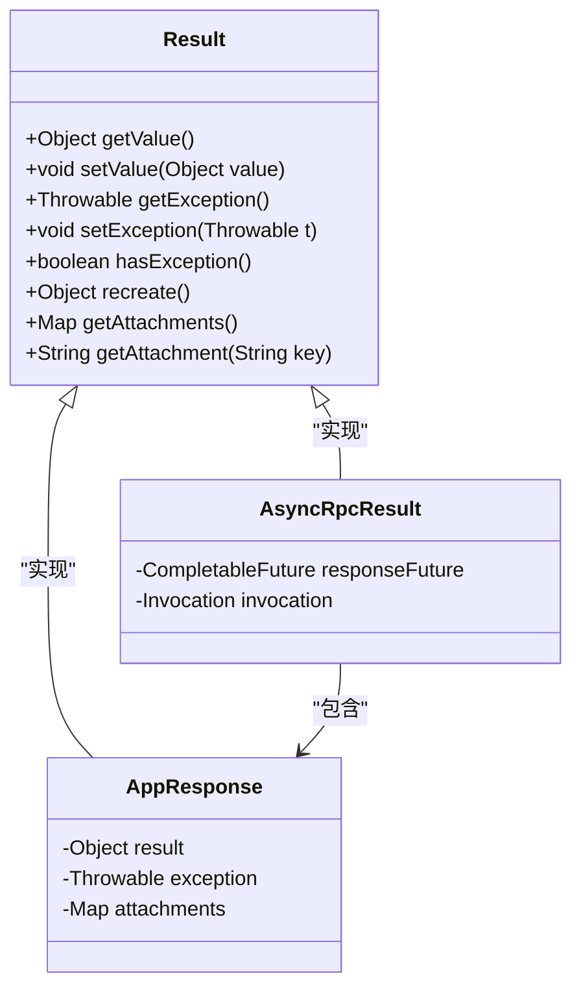

**图示来源**
- [Result.java](file://dubbo-rpc/dubbo-rpc-api/src/main/java/org/apache/dubbo/rpc/Result.java#L46-L188)
- [AppResponse.java](file://dubbo-rpc/dubbo-rpc-api/src/main/java/org/apache/dubbo/rpc/AppResponse.java#L54-L271)
- [AsyncRpcResult.java](file://dubbo-rpc/dubbo-rpc-api/src/main/java/org/apache/dubbo/rpc/AsyncRpcResult.java#L54-L380)

Result接口的主要方法：
- `getValue()`: 获取调用结果值
- `setValue(Object value)`: 设置调用结果值
- `getException()`: 获取调用异常
- `setException(Throwable t)`: 设置调用异常
- `hasException()`: 判断是否有异常
- `recreate()`: 重新创建结果，如果有异常则抛出，否则返回值

## RPC协议实现
dubbo-rpc模块支持多种RPC协议的实现，主要包括Dubbo协议和Triple协议。

### Dubbo协议
Dubbo协议是Dubbo框架的默认协议，基于TCP长连接和NIO异步通信，具有高性能的特点。

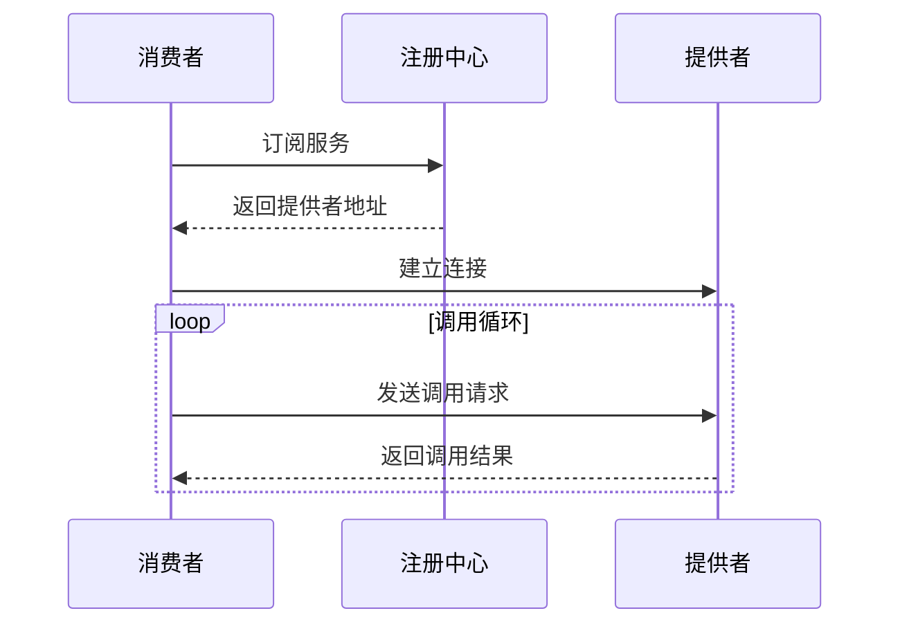

**图示来源**
- [Protocol.java](file://dubbo-rpc/dubbo-rpc-api/src/main/java/org/apache/dubbo/rpc/Protocol.java)
- [Invoker.java](file://dubbo-rpc/dubbo-rpc-api/src/main/java/org/apache/dubbo/rpc/Invoker.java)

### Triple协议
Triple协议是基于HTTP/2的协议，支持gRPC兼容，适用于跨语言调用场景。

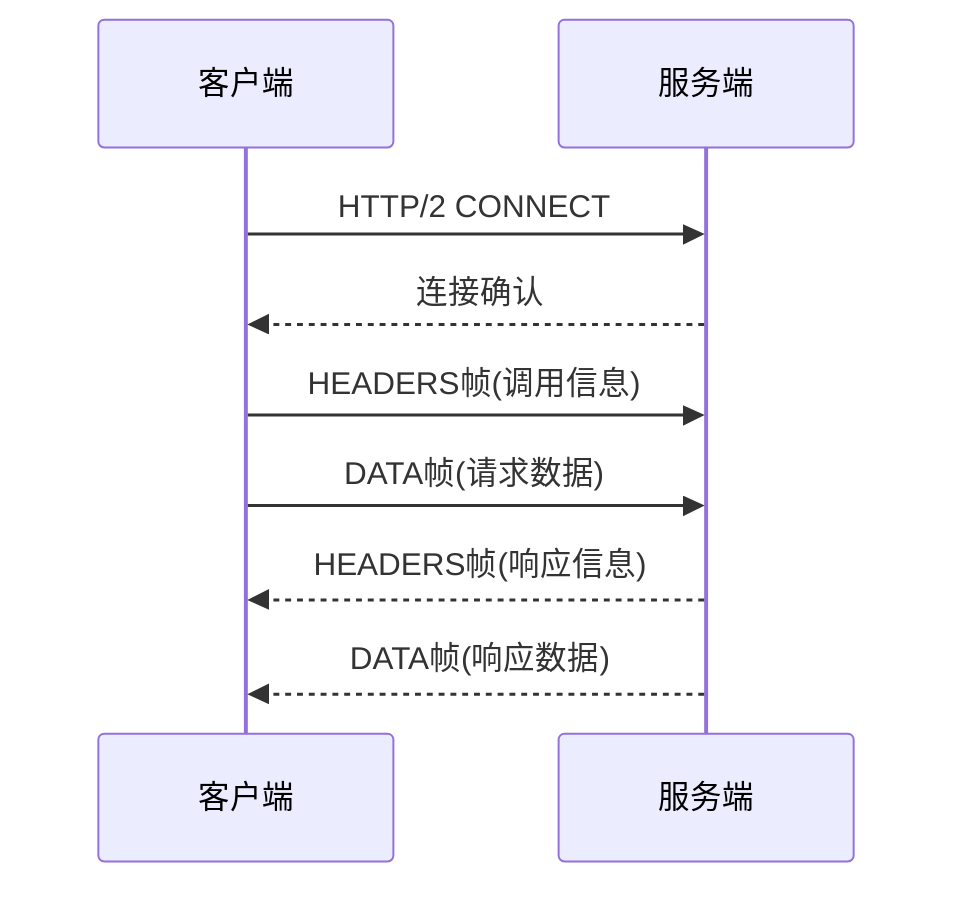

**图示来源**
- [Protocol.java](file://dubbo-rpc/dubbo-rpc-api/src/main/java/org/apache/dubbo/rpc/Protocol.java)
- [Invocation.java](file://dubbo-rpc/dubbo-rpc-api/src/main/java/org/apache/dubbo/rpc/Invocation.java)

## 服务暴露与引用流程

### 服务暴露流程
服务暴露是将本地服务实例发布为远程可调用服务的过程。

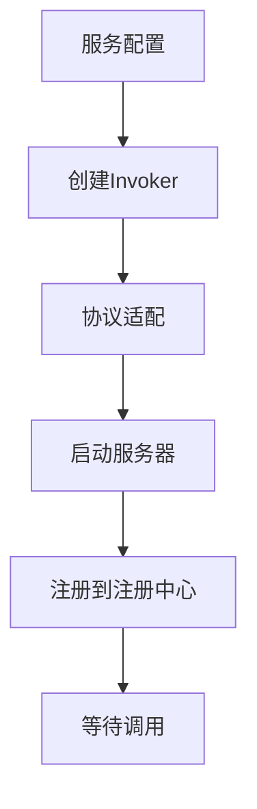

**图示来源**
- [Protocol.java](file://dubbo-rpc/dubbo-rpc-api/src/main/java/org/apache/dubbo/rpc/Protocol.java#L81-L82)
- [Invoker.java](file://dubbo-rpc/dubbo-rpc-api/src/main/java/org/apache/dubbo/rpc/Invoker.java)

服务暴露的主要步骤：
1. 创建服务配置
2. 创建Invoker实例
3. 通过Protocol的export方法暴露服务
4. 启动协议对应的服务器
5. 将服务信息注册到注册中心

### 服务引用流程
服务引用是创建远程服务本地代理的过程。

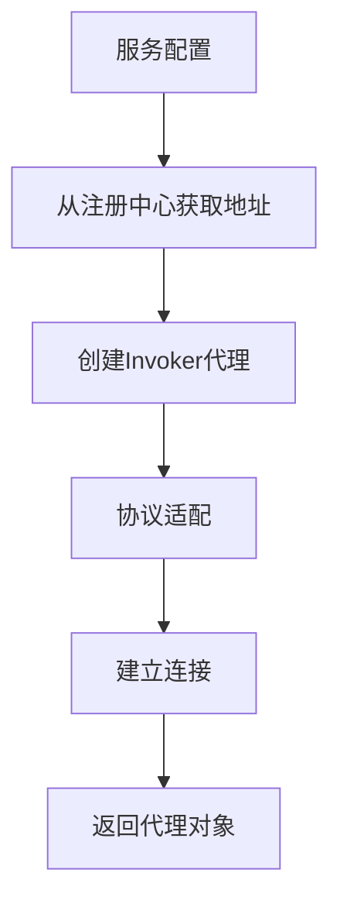

**图示来源**
- [Protocol.java](file://dubbo-rpc/dubbo-rpc-api/src/main/java/org/apache/dubbo/rpc/Protocol.java#L99-L100)
- [Invoker.java](file://dubbo-rpc/dubbo-rpc-api/src/main/java/org/apache/dubbo/rpc/Invoker.java)

服务引用的主要步骤：
1. 创建服务配置
2. 从注册中心获取服务提供者地址
3. 通过Protocol的refer方法引用服务
4. 创建Invoker代理实例
5. 建立与服务提供者的连接
6. 返回代理对象

## 调用上下文管理
RpcContext是Dubbo RPC调用的上下文管理类，用于在调用过程中传递上下文信息。

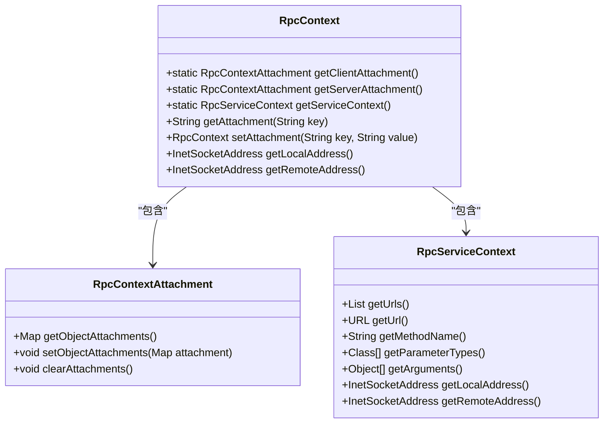

**图示来源**
- [RpcContext.java](file://dubbo-rpc/dubbo-rpc-api/src/main/java/org/apache/dubbo/rpc/RpcContext.java#L57-L1205)
- [RpcContextAttachment.java](file://dubbo-rpc/dubbo-rpc-api/src/main/java/org/apache/dubbo/rpc/RpcContextAttachment.java)
- [RpcServiceContext.java](file://dubbo-rpc/dubbo-rpc-api/src/main/java/org/apache/dubbo/rpc/RpcServiceContext.java)

### 上下文类型
RpcContext提供了多种上下文：
- **客户端附件**(ClientAttachment): 消费者端设置的附件，传递给提供者
- **服务器附件**(ServerAttachment): 提供者端获取的附件，来自消费者
- **服务上下文**(ServiceContext): 用于在整个调用过程中传递环境参数

### 主要功能
- 附件传递：通过setAttachment和getAttachment方法传递额外信息
- 地址信息：获取本地和远程地址信息
- 调用信息：获取方法名、参数类型、参数值等调用信息
- 异步调用：支持异步调用的上下文管理

## RPC调用示例

### 简单RPC调用
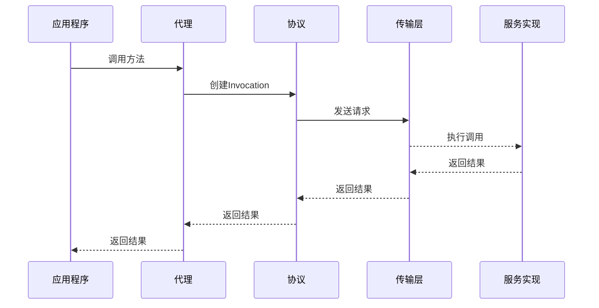

**图示来源**
- [Protocol.java](file://dubbo-rpc/dubbo-rpc-api/src/main/java/org/apache/dubbo/rpc/Protocol.java)
- [Invoker.java](file://dubbo-rpc/dubbo-rpc-api/src/main/java/org/apache/dubbo/rpc/Invoker.java)
- [Invocation.java](file://dubbo-rpc/dubbo-rpc-api/src/main/java/org/apache/dubbo/rpc/Invocation.java)

### 代码示例
```java
// 服务接口
public interface DemoService {
    String sayHello(String name);
}

// 服务实现
public class DemoServiceImpl implements DemoService {
    public String sayHello(String name) {
        return "Hello " + name;
    }
}

// 服务暴露
ServiceConfig<DemoService> service = new ServiceConfig<>();
service.setInterface(DemoService.class);
service.setRef(new DemoServiceImpl());
service.export();

// 服务引用
ReferenceConfig<DemoService> reference = new ReferenceConfig<>();
reference.setInterface(DemoService.class);
DemoService service = reference.get();
String result = service.sayHello("world");
```

## 高级调用模式

### 异步调用
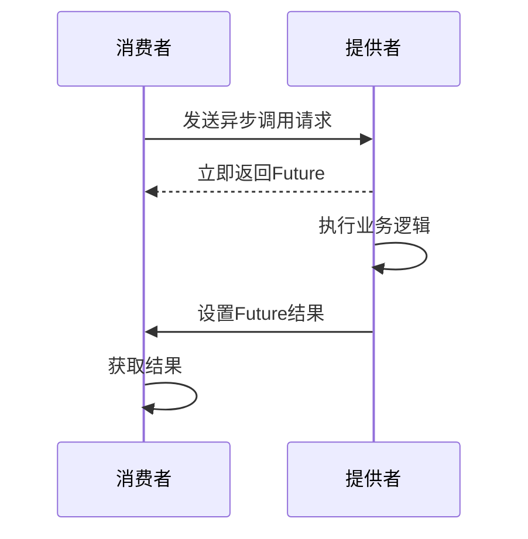

**图示来源**
- [AsyncRpcResult.java](file://dubbo-rpc/dubbo-rpc-api/src/main/java/org/apache/dubbo/rpc/AsyncRpcResult.java)
- [RpcContext.java](file://dubbo-rpc/dubbo-rpc-api/src/main/java/org/apache/dubbo/rpc/RpcContext.java)

### 回调调用
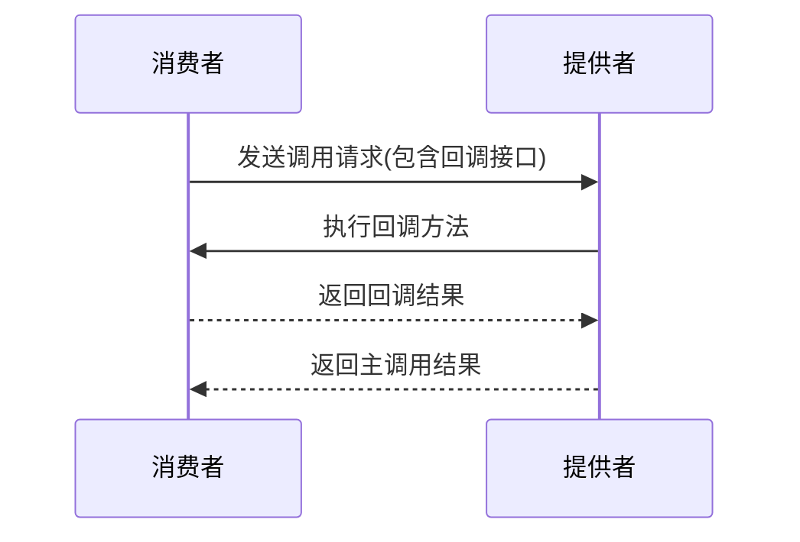

**图示来源**
- [Invoker.java](file://dubbo-rpc/dubbo-rpc-api/src/main/java/org/apache/dubbo/rpc/Invoker.java)
- [Invocation.java](file://dubbo-rpc/dubbo-rpc-api/src/main/java/org/apache/dubbo/rpc/Invocation.java)

### 参数回调
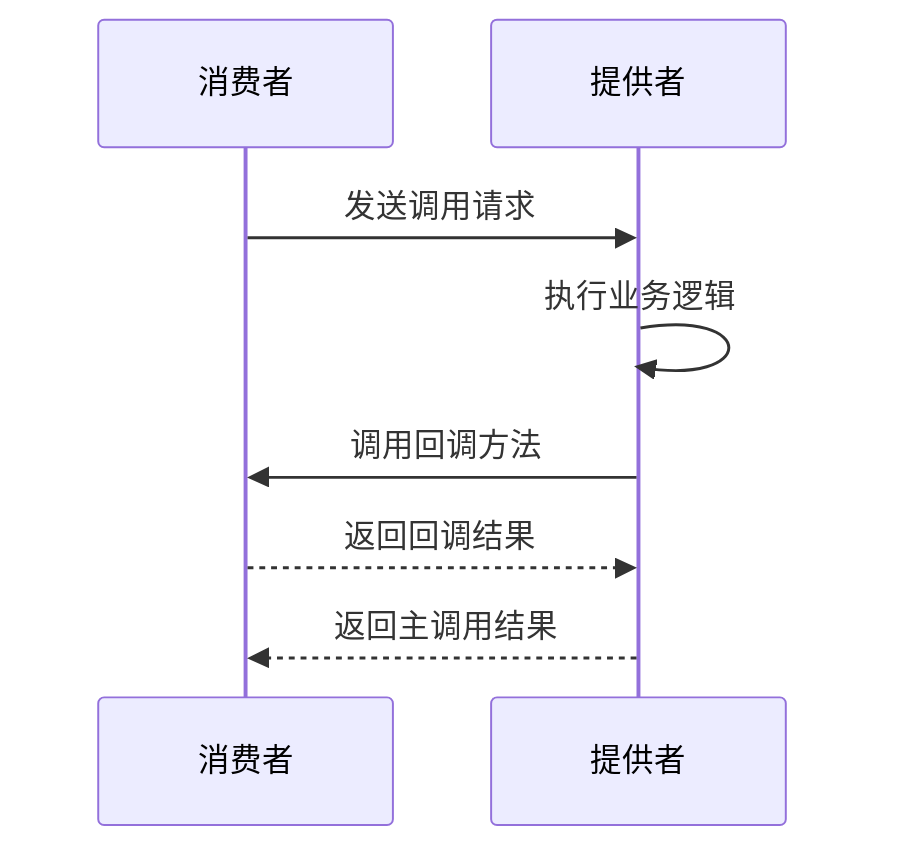

**图示来源**
- [RpcContext.java](file://dubbo-rpc/dubbo-rpc-api/src/main/java/org/apache/dubbo/rpc/RpcContext.java)
- [Result.java](file://dubbo-rpc/dubbo-rpc-api/src/main/java/org/apache/dubbo/rpc/Result.java)

## 流程图与调用链路

### 服务暴露完整流程
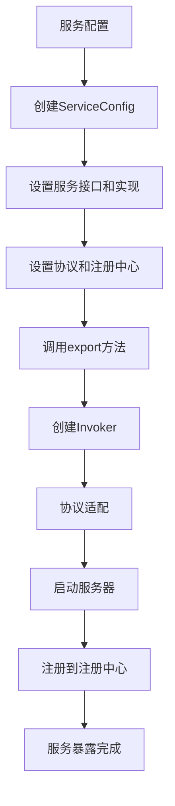

**图示来源**
- [Protocol.java](file://dubbo-rpc/dubbo-rpc-api/src/main/java/org/apache/dubbo/rpc/Protocol.java)
- [Invoker.java](file://dubbo-rpc/dubbo-rpc-api/src/main/java/org/apache/dubbo/rpc/Invoker.java)

### 服务引用完整流程
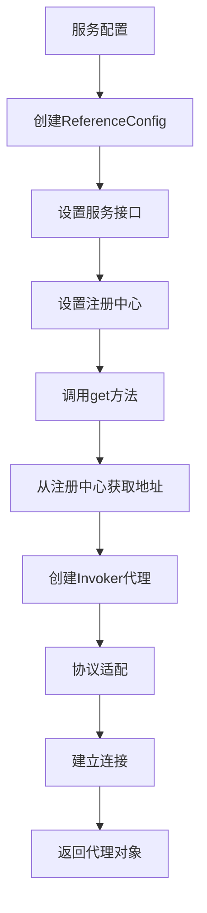

**图示来源**
- [Protocol.java](file://dubbo-rpc/dubbo-rpc-api/src/main/java/org/apache/dubbo/rpc/Protocol.java)
- [Invoker.java](file://dubbo-rpc/dubbo-rpc-api/src/main/java/org/apache/dubbo/rpc/Invoker.java)

### 调用链路追踪
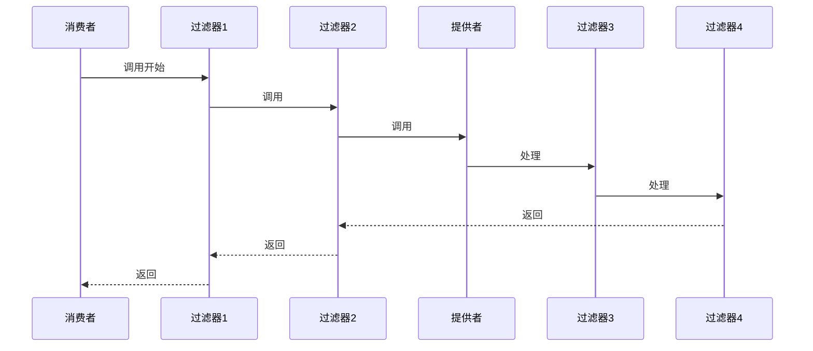

**图示来源**
- [Invoker.java](file://dubbo-rpc/dubbo-rpc-api/src/main/java/org/apache/dubbo/rpc/Invoker.java)
- [Invocation.java](file://dubbo-rpc/dubbo-rpc-api/src/main/java/org/apache/dubbo/rpc/Invocation.java)
- [Result.java](file://dubbo-rpc/dubbo-rpc-api/src/main/java/org/apache/dubbo/rpc/Result.java)

## 结论
dubbo-rpc模块通过精心设计的接口和实现，提供了强大而灵活的RPC调用能力。Protocol接口作为核心，定义了服务暴露和引用的规范；Invoker、Invocation和Result接口共同构成了RPC调用的基础；RpcContext提供了完善的上下文管理机制。这些组件协同工作，支持多种协议实现和高级调用模式，为构建分布式应用提供了坚实的基础。