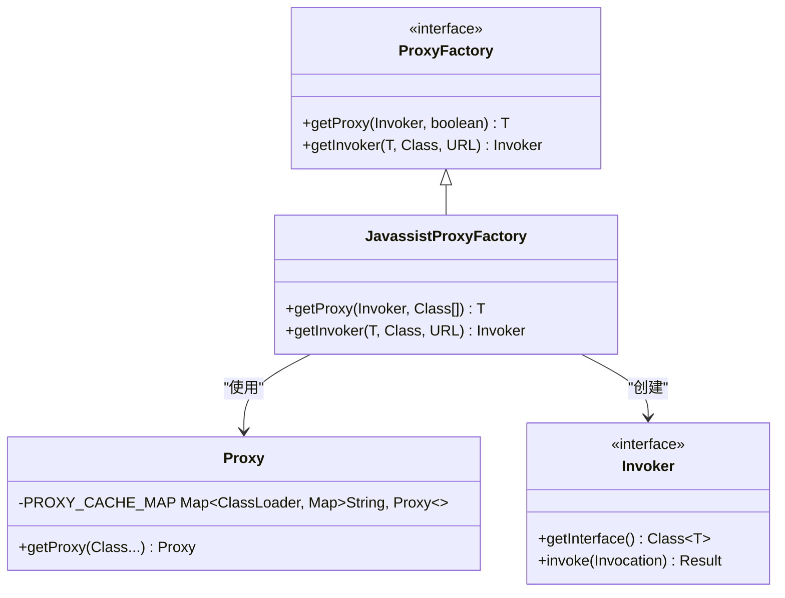
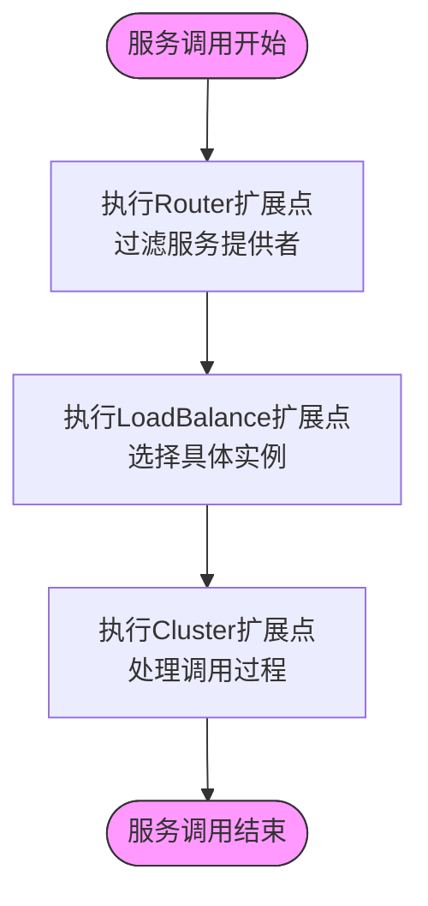
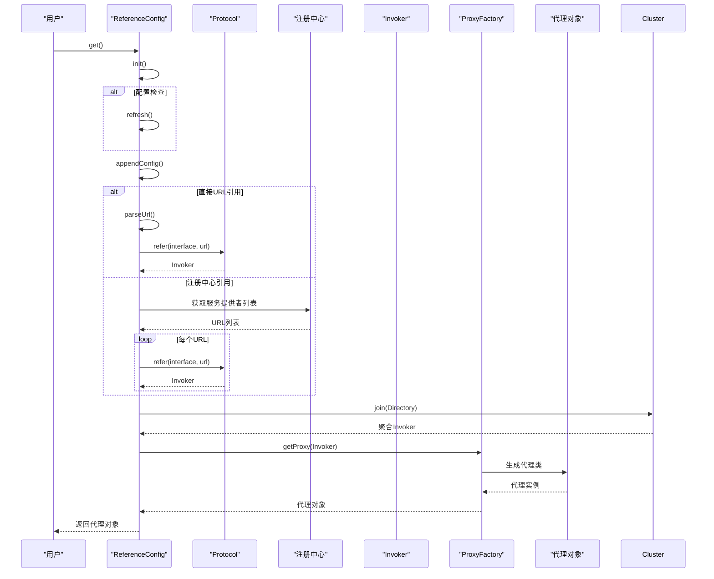

# 服务引用

<cite>
**本文档引用的文件**   
- [ReferenceConfig.java](file://dubbo-config\dubbo-config-api\src\main\java\org\apache\dubbo\config\ReferenceConfig.java)
- [Proxy.java](file://dubbo-common\src\main\java\org\apache\dubbo\common\bytecode\Proxy.java)
- [ProxyFactory.java](file://dubbo-rpc\dubbo-rpc-api\src\main\java\org\apache\dubbo\rpc\ProxyFactory.java)
- [JavassistProxyFactory.java](file://dubbo-rpc\dubbo-rpc-api\src\main\java\org\apache\dubbo\rpc\proxy\javassist\JavassistProxyFactory.java)
- [Cluster.java](file://dubbo-cluster\src\main\java\org\apache\dubbo\rpc\cluster\Cluster.java)
- [LoadBalance.java](file://dubbo-cluster\src\main\java\org\apache\dubbo\rpc\cluster\LoadBalance.java)
- [Router.java](file://dubbo-cluster\src\main\java\org\apache\dubbo\rpc\cluster\Router.java)
- [Invoker.java](file://dubbo-rpc\dubbo-rpc-api\src\main\java\org\apache\dubbo\rpc\Invoker.java)
</cite>

## 目录
1. [引言](#引言)
2. [服务引用流程](#服务引用流程)
3. [代理创建机制](#代理创建机制)
4. [SPI扩展点调用顺序](#spi扩展点调用顺序)
5. [简单示例](#简单示例)
6. [自定义集群策略](#自定义集群策略)
7. [时序图](#时序图)
8. [关键参数说明](#关键参数说明)

## 引言
服务引用是Dubbo框架中消费者获取远程服务代理的核心机制。通过服务引用，应用程序可以像调用本地方法一样调用远程服务，而无需关心底层的网络通信细节。本文档详细介绍了服务引用的完整流程，包括代理创建机制、SPI扩展点的调用顺序，以及如何为初学者提供简单示例和为经验丰富的开发者提供自定义集群策略的实现方法。

## 服务引用流程
服务引用的完整流程从`ReferenceConfig.get()`方法开始，该方法是服务引用的入口点。当用户调用`get()`方法时，Dubbo会检查引用是否已初始化，如果没有，则调用`init()`方法进行初始化。

在`init()`方法中，首先会刷新配置，然后初始化服务元数据。接着，通过`appendConfig()`方法收集所有引用参数，包括接口名称、版本号、分组等信息。这些参数将被用于构建服务URL。

接下来，根据配置的URL类型，服务引用分为两种情况：直接URL引用和注册中心引用。如果配置了直接URL，则直接解析URL并创建Invoker；如果使用注册中心，则从注册中心获取服务提供者的URL列表。

创建Invoker后，Dubbo会根据集群策略将多个Invoker合并为一个虚拟Invoker。最后，通过代理工厂创建服务代理，返回给用户使用。

**Section sources**
- [ReferenceConfig.java](file://dubbo-config\dubbo-config-api\src\main\java\org\apache\dubbo\config\ReferenceConfig.java#L230-L248)
- [ReferenceConfig.java](file://dubbo-config\dubbo-config-api\src\main\java\org\apache\dubbo\config\ReferenceConfig.java#L328-L404)

## 代理创建机制
代理创建机制是服务引用的核心部分，它负责生成可以透明调用远程服务的代理对象。Dubbo使用动态代理技术来实现这一功能，主要涉及`ProxyFactory`、`Proxy`和`Invoker`三个核心组件。

`ProxyFactory`是代理工厂接口，定义了`getProxy()`和`getInvoker()`两个方法。`getProxy()`方法用于根据Invoker创建代理对象，而`getInvoker()`方法则用于根据服务实现对象创建Invoker。

`Proxy`类是Dubbo的代理生成器，它使用字节码技术动态生成代理类。代理类实现了服务接口，并在方法调用时将调用委托给`InvokerInvocationHandler`处理。

`Invoker`是调用者接口，代表一个可执行的远程调用。每个服务提供者都有一个对应的Invoker，它封装了网络通信的细节。当代理对象的方法被调用时，实际是Invoker的`invoke()`方法被调用。

在Dubbo中，默认使用Javassist作为代理生成工具。`JavassistProxyFactory`实现了`ProxyFactory`接口，使用Javassist库动态生成代理类。如果Javassist不可用，会自动降级到使用JDK动态代理。



**Diagram sources**
- [ProxyFactory.java](file://dubbo-rpc\dubbo-rpc-api\src\main\java\org\apache\dubbo\rpc\ProxyFactory.java#L47-L60)
- [Proxy.java](file://dubbo-common\src\main\java\org\apache\dubbo\common\bytecode\Proxy.java#L37-L79)
- [Invoker.java](file://dubbo-rpc\dubbo-rpc-api\src\main\java\org\apache\dubbo\rpc\Invoker.java#L29-L46)
- [JavassistProxyFactory.java](file://dubbo-rpc\dubbo-rpc-api\src\main\java\org\apache\dubbo\rpc\proxy\javassist\JavassistProxyFactory.java#L37-L125)

**Section sources**
- [ProxyFactory.java](file://dubbo-rpc\dubbo-rpc-api\src\main\java\org\apache\dubbo\rpc\ProxyFactory.java#L41-L61)
- [Proxy.java](file://dubbo-common\src\main\java\org\apache\dubbo\common\bytecode\Proxy.java#L37-L79)
- [JavassistProxyFactory.java](file://dubbo-rpc\dubbo-rpc-api\src\main\java\org\apache\dubbo\rpc\proxy\javassist\JavassistProxyFactory.java#L37-L125)

## SPI扩展点调用顺序
在服务引用过程中，Dubbo通过SPI机制提供了多个扩展点，包括Cluster、LoadBalance和Router等。这些扩展点按照特定的顺序被调用，以实现灵活的服务治理功能。

首先，`Cluster`扩展点负责将多个服务提供者合并为一个虚拟调用者。Dubbo提供了多种集群策略，如Failover、Failfast、Failsafe等。当用户发起服务调用时，集群策略决定了如何处理调用失败的情况。

其次，`Router`扩展点在集群之前执行，用于根据路由规则过滤服务提供者列表。路由规则可以基于条件、标签、应用等维度进行配置。路由器会根据当前调用的上下文信息，筛选出符合条件的服务提供者。

最后，`LoadBalance`扩展点在路由之后执行，负责从剩余的服务提供者中选择一个具体的实例进行调用。Dubbo提供了多种负载均衡策略，如随机、轮询、最少活跃调用数等。

这些扩展点的调用顺序是固定的：首先执行路由器进行服务提供者过滤，然后由负载均衡器选择具体实例，最后由集群策略处理调用过程。这种分层设计使得各个扩展点可以独立工作，同时又能协同完成复杂的服务治理功能。



**Diagram sources**
- [Cluster.java](file://dubbo-cluster\src\main\java\org\apache\dubbo\rpc\cluster\Cluster.java#L34-L80)
- [LoadBalance.java](file://dubbo-cluster\src\main\java\org\apache\dubbo\rpc\cluster\LoadBalance.java#L36-L50)
- [Router.java](file://dubbo-cluster\src\main\java\org\apache\dubbo\rpc\cluster\Router.java#L35-L121)

**Section sources**
- [Cluster.java](file://dubbo-cluster\src\main\java\org\apache\dubbo\rpc\cluster\Cluster.java#L34-L80)
- [LoadBalance.java](file://dubbo-cluster\src\main\java\org\apache\dubbo\rpc\cluster\LoadBalance.java#L36-L50)
- [Router.java](file://dubbo-cluster\src\main\java\org\apache\dubbo\rpc\cluster\Router.java#L35-L121)

## 简单示例
对于初学者来说，使用Dubbo进行服务引用非常简单。以下是一个基本的使用示例：

```java
// 创建ReferenceConfig实例
ReferenceConfig<DemoService> reference = new ReferenceConfig<>();
// 设置接口类型
reference.setInterface(DemoService.class);
// 设置注册中心地址
reference.setRegistry(new RegistryConfig("zookeeper://127.0.0.1:2181"));
// 获取服务代理
DemoService service = reference.get();
// 调用远程服务
String result = service.sayHello("world");
```

在这个示例中，我们首先创建一个`ReferenceConfig`实例，并设置要引用的服务接口。然后配置注册中心地址，告诉Dubbo从哪里发现服务提供者。最后调用`get()`方法获取服务代理，并像调用本地方法一样调用远程服务。

需要注意的是，在实际生产环境中，通常会使用Spring等依赖注入框架来管理`ReferenceConfig`，而不是手动创建。这样可以更好地管理Bean的生命周期，并与其他组件集成。

**Section sources**
- [ReferenceConfig.java](file://dubbo-config\dubbo-config-api\src\main\java\org\apache\dubbo\config\ReferenceConfig.java#L230-L248)

## 自定义集群策略
对于经验丰富的开发者，Dubbo提供了强大的扩展能力，可以自定义集群策略来满足特定的业务需求。要实现自定义集群策略，需要遵循以下步骤：

首先，创建一个实现`Cluster`接口的类。`Cluster`接口定义了一个`join()`方法，该方法接收一个`Directory`对象和一个布尔值参数，返回一个`Invoker`对象。`Directory`对象包含了所有可用的服务提供者。

```java
@SPI("custom")
public class CustomCluster implements Cluster {
    @Override
    public <T> Invoker<T> join(Directory<T> directory, boolean buildFilterChain) throws RpcException {
        // 实现自定义集群逻辑
        return new CustomClusterInvoker<>(directory);
    }
}
```

然后，创建一个`AbstractClusterInvoker`的子类，实现具体的调用逻辑。在这个类中，可以重写`doInvoke()`方法来定义自己的调用策略。

```java
public class CustomClusterInvoker<T> extends AbstractClusterInvoker<T> {
    public CustomClusterInvoker(Directory<T> directory) {
        super(directory);
    }
    
    @Override
    protected Result doInvoke(Invocation invocation, List<Invoker<T>> invokers, LoadBalance loadbalance) throws RpcException {
        // 实现自定义调用逻辑
        // 例如：根据响应时间选择服务提供者
        Invoker<T> selected = selectInvoker(invokers);
        return selected.invoke(invocation);
    }
}
```

最后，在`META-INF/dubbo/org.apache.dubbo.rpc.cluster.Cluster`文件中添加扩展点配置：

```
custom=com.example.CustomCluster
```

通过这种方式，就可以在配置中使用自定义的集群策略了：

```xml
<dubbo:reference interface="com.example.DemoService" cluster="custom" />
```

**Section sources**
- [Cluster.java](file://dubbo-cluster\src\main\java\org\apache\dubbo\rpc\cluster\Cluster.java#L34-L80)

## 时序图
以下是服务引用的详细时序图，展示了从创建ReferenceConfig到获取服务代理的完整过程：



**Diagram sources**
- [ReferenceConfig.java](file://dubbo-config\dubbo-config-api\src\main\java\org\apache\dubbo\config\ReferenceConfig.java#L490-L523)
- [ProxyFactory.java](file://dubbo-rpc\dubbo-rpc-api\src\main\java\org\apache\dubbo\rpc\ProxyFactory.java#L47-L60)

## 关键参数说明
在服务引用过程中，有几个关键参数对行为有重要影响：

- **interface**: 指定要引用的服务接口，必须设置。
- **version**: 服务版本号，用于实现服务的版本控制。
- **group**: 服务分组，用于实现服务的逻辑隔离。
- **timeout**: 调用超时时间，单位为毫秒。
- **retries**: 失败重试次数，仅对failover集群策略有效。
- **loadbalance**: 负载均衡策略，可选值包括random、roundrobin、leastactive等。
- **cluster**: 集群策略，可选值包括failover、failfast、failsafe等。
- **check**: 启动时检查服务是否可用，true表示检查，false表示不检查。
- **url**: 直接指定服务提供者的URL，用于点对点直连。
- **registry**: 指定注册中心，可以配置多个注册中心。

这些参数可以通过XML配置、注解或API方式设置。其中，`interface`参数是必需的，其他参数都有默认值。合理配置这些参数可以优化服务调用的性能和可靠性。

**Section sources**
- [ReferenceConfig.java](file://dubbo-config\dubbo-config-api\src\main\java\org\apache\dubbo\config\ReferenceConfig.java#L431-L487)