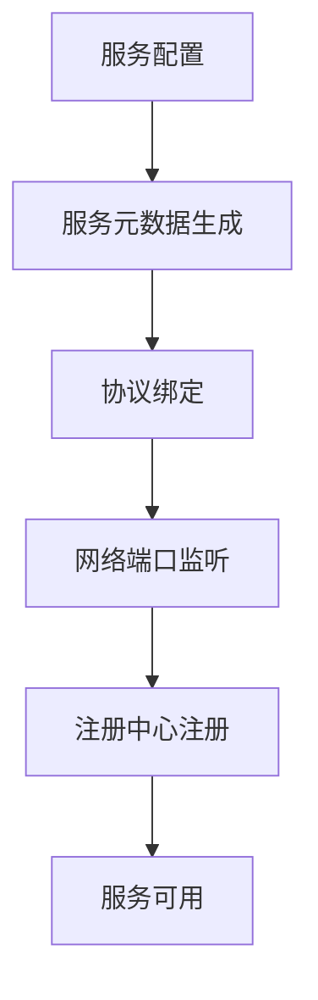
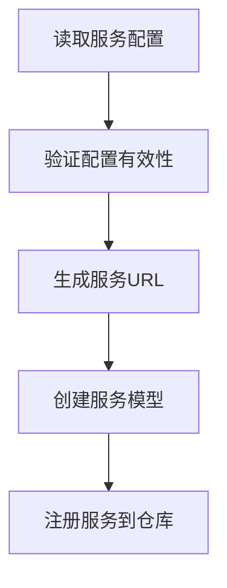
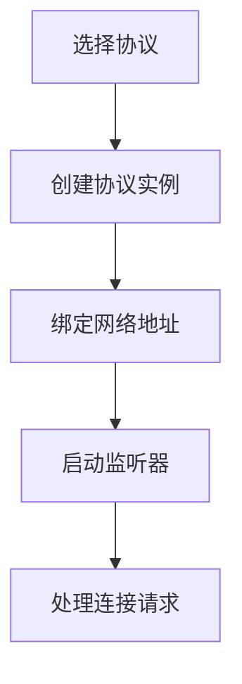
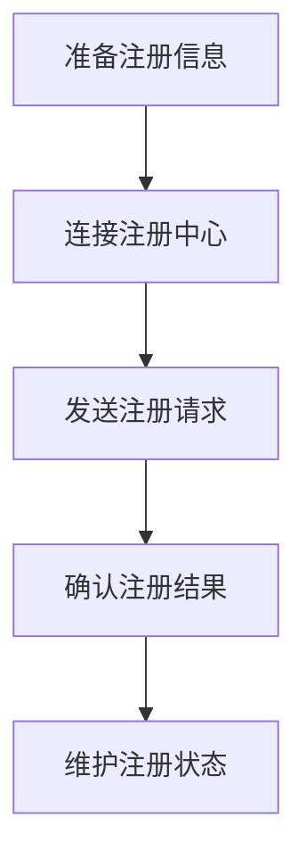
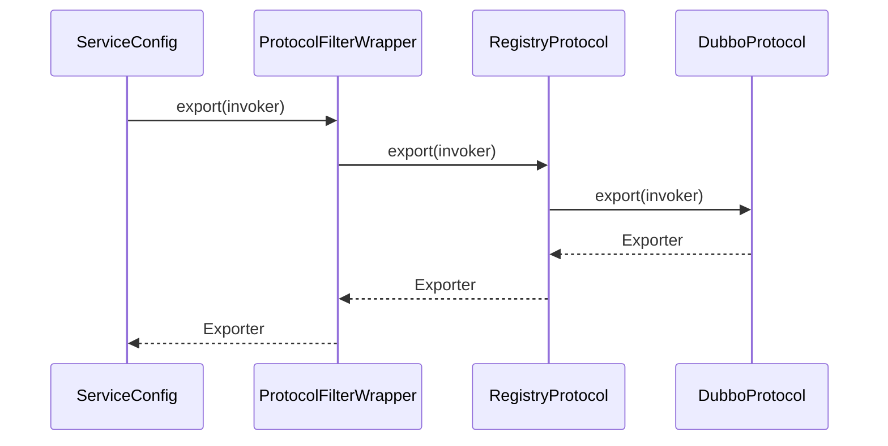
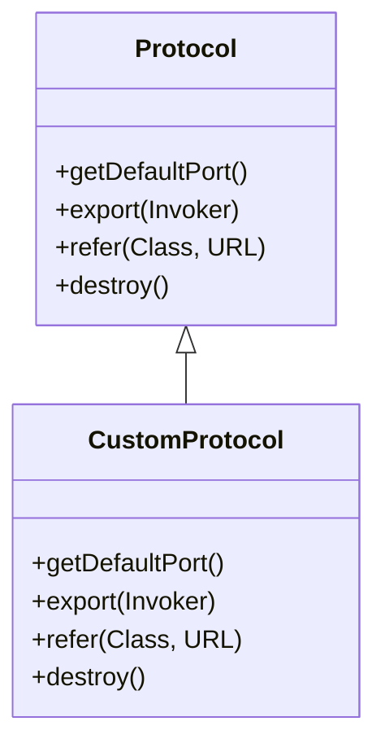
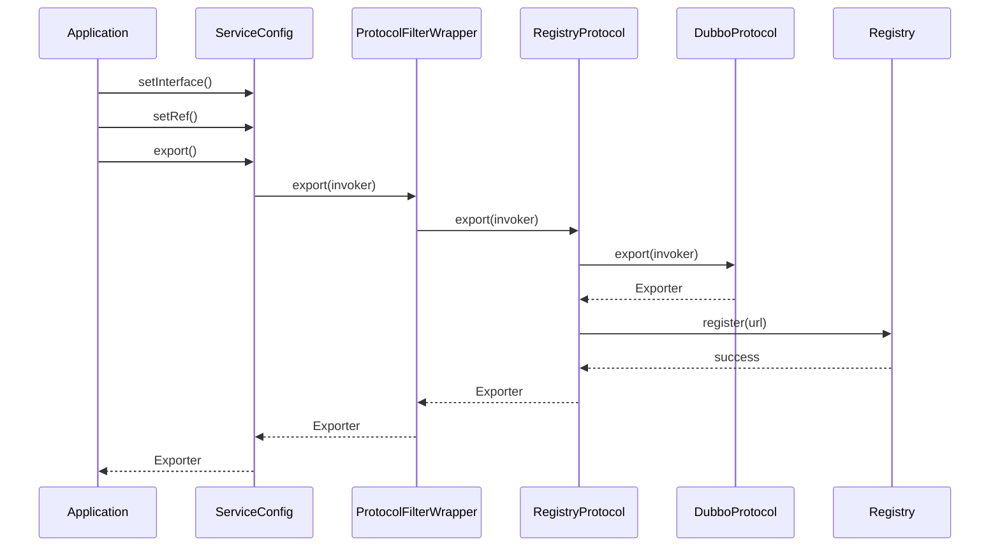

# 服务暴露

<cite>
**本文档引用的文件**   
- [Protocol.java](file://dubbo-rpc/dubbo-rpc-api/src/main/java/org/apache/dubbo/rpc/Protocol.java)
- [Exporter.java](file://dubbo-rpc/dubbo-rpc-api/src/main/java/org/apache/dubbo/rpc/Exporter.java)
- [Filter.java](file://dubbo-rpc/dubbo-rpc-api/src/main/java/org/apache/dubbo/rpc/Filter.java)
- [ProtocolFilterWrapper.java](file://dubbo-cluster/src/main/java/org/apache/dubbo/rpc/cluster/filter/ProtocolFilterWrapper.java)
- [ServiceConfig.java](file://dubbo-config/dubbo-config-api/src/main/java/org/apache/dubbo/config/ServiceConfig.java)
- [RegistryProtocol.java](file://dubbo-registry/dubbo-registry-api/src/main/java/org/apache/dubbo/registry/integration/RegistryProtocol.java)
- [DubboProtocol.java](file://dubbo-rpc/dubbo-rpc-dubbo/src/main/java/org/apache/dubbo/rpc/protocol/dubbo/DubboProtocol.java)
- [InternalServiceConfigBuilder.java](file://dubbo-config/dubbo-config-api/src/main/java/org/apache/dubbo/config/bootstrap/builders/InternalServiceConfigBuilder.java)
- [DefaultModuleDeployer.java](file://dubbo-config/dubbo-config-api/src/main/java/org/apache/dubbo/config/deploy/DefaultModuleDeployer.java)
</cite>

## 目录
1. [引言](#引言)
2. [服务暴露流程概述](#服务暴露流程概述)
3. [服务元数据生成](#服务元数据生成)
4. [协议绑定与网络端口监听](#协议绑定与网络端口监听)
5. [注册中心注册](#注册中心注册)
6. [SPI扩展点调用顺序](#spi扩展点调用顺序)
7. [初学者示例](#初学者示例)
8. [自定义协议暴露实现](#自定义协议暴露实现)
9. [服务暴露时序图](#服务暴露时序图)
10. [关键参数说明](#关键参数说明)

## 引言
服务暴露是Dubbo框架中的核心机制，它允许服务提供者将其服务接口暴露给网络中的其他组件。本文档详细介绍了服务暴露的完整流程，包括服务元数据的生成、协议绑定、网络端口监听和注册中心注册等关键步骤。同时，文档还深入探讨了服务暴露过程中的SPI扩展点，如Filter、Protocol等的调用顺序，并为不同层次的开发者提供了相应的实现示例。

## 服务暴露流程概述

服务暴露是Dubbo框架中服务提供者将服务接口暴露给消费者的关键过程。整个流程从服务配置开始，经过元数据生成、协议绑定、网络监听到最终在注册中心注册，形成一个完整的生命周期。



**时序图来源**
- [ServiceConfig.java](file://dubbo-config/dubbo-config-api/src/main/java/org/apache/dubbo/config/ServiceConfig.java#L411-L901)
- [RegistryProtocol.java](file://dubbo-registry/dubbo-registry-api/src/main/java/org/apache/dubbo/registry/integration/RegistryProtocol.java#L310-L1205)

## 服务元数据生成

服务元数据生成是服务暴露的第一步，它将服务接口的配置信息转换为可以在网络中传输的元数据。这个过程主要由ServiceConfig类负责，它收集服务的各种配置参数，包括接口名称、版本号、分组信息等。



**流程说明**
1. 读取服务配置：从配置文件或注解中读取服务的各项配置参数
2. 验证配置有效性：检查必填参数是否完整，参数值是否合法
3. 生成服务URL：将配置参数转换为标准的URL格式，包含协议、地址、端口等信息
4. 创建服务模型：构建服务的元数据模型，包含接口定义、方法签名等
5. 注册服务到仓库：将服务模型注册到本地服务仓库，便于后续查找和管理

**代码来源**
- [ServiceConfig.java](file://dubbo-config/dubbo-config-api/src/main/java/org/apache/dubbo/config/ServiceConfig.java#L411-L901)
- [InternalServiceConfigBuilder.java](file://dubbo-config/dubbo-config-api/src/main/java/org/apache/dubbo/config/bootstrap/builders/InternalServiceConfigBuilder.java#L245-L341)

## 协议绑定与网络端口监听

协议绑定和网络端口监听是服务暴露的核心环节，它决定了服务如何在网络上进行通信。Dubbo支持多种协议，如dubbo、http、rest等，每种协议都有其特定的绑定方式和监听机制。



**关键步骤**
1. 选择协议：根据配置选择合适的通信协议
2. 创建协议实例：通过SPI机制获取协议的具体实现
3. 绑定网络地址：将协议绑定到指定的IP地址和端口
4. 启动监听器：启动网络监听器，准备接收客户端连接
5. 处理连接请求：接收并处理来自消费者的连接请求

**代码来源**
- [DubboProtocol.java](file://dubbo-rpc/dubbo-rpc-dubbo/src/main/java/org/apache/dubbo/rpc/protocol/dubbo/DubboProtocol.java#L95-L200)
- [Protocol.java](file://dubbo-rpc/dubbo-rpc-api/src/main/java/org/apache/dubbo/rpc/Protocol.java#L57-L117)

## 注册中心注册

注册中心注册是服务暴露的最后一步，它将服务信息注册到注册中心，使消费者能够发现和调用该服务。这个过程由RegistryProtocol负责，它与注册中心进行交互，完成服务的注册和订阅。



**注册流程**
1. 准备注册信息：收集服务的元数据，包括URL、接口信息、版本号等
2. 连接注册中心：建立与注册中心的连接
3. 发送注册请求：将服务信息发送给注册中心
4. 确认注册结果：接收注册中心的响应，确认注册是否成功
5. 维护注册状态：定期检查注册状态，处理注册异常

**代码来源**
- [RegistryProtocol.java](file://dubbo-registry/dubbo-registry-api/src/main/java/org/apache/dubbo/registry/integration/RegistryProtocol.java#L310-L1205)
- [Registry.java](file://dubbo-registry/dubbo-registry-api/src/main/java/org/apache/dubbo/registry/Registry.java#L1-L48)

## SPI扩展点调用顺序

SPI（Service Provider Interface）扩展点是Dubbo框架的重要特性，它允许开发者在不修改核心代码的情况下扩展框架功能。在服务暴露过程中，多个SPI扩展点按照特定顺序被调用。



**调用顺序说明**
1. ServiceConfig首先调用Protocol的export方法
2. ProtocolFilterWrapper作为装饰器，先处理Filter链，然后调用实际的Protocol
3. RegistryProtocol处理注册中心相关的逻辑
4. DubboProtocol负责具体的网络通信协议实现
5. 返回路径与调用路径相反，形成完整的调用链

**代码来源**
- [ProtocolFilterWrapper.java](file://dubbo-cluster/src/main/java/org/apache/dubbo/rpc/cluster/filter/ProtocolFilterWrapper.java#L35-L84)
- [Filter.java](file://dubbo-rpc/dubbo-rpc-api/src/main/java/org/apache/dubbo/rpc/Filter.java#L67-L68)

## 初学者示例

对于初学者来说，理解服务暴露的基本用法是最重要的。以下是一个简单的服务暴露示例，展示了如何使用Dubbo暴露一个基本的服务。

```java
// 1. 定义服务接口
public interface DemoService {
    String sayHello(String name);
}

// 2. 实现服务接口
public class DemoServiceImpl implements DemoService {
    public String sayHello(String name) {
        return "Hello " + name;
    }
}

// 3. 配置并暴露服务
ServiceConfig<DemoService> service = new ServiceConfig<>();
service.setInterface(DemoService.class);
service.setRef(new DemoServiceImpl());
service.setProtocol(new ProtocolConfig("dubbo", 20880));
service.export();
```

**示例说明**
- 首先定义服务接口DemoService
- 然后实现该接口，提供具体的业务逻辑
- 最后通过ServiceConfig配置服务，并调用export方法暴露服务
- 服务将通过dubbo协议在20880端口上监听

**代码来源**
- [ServiceConfig.java](file://dubbo-config/dubbo-config-api/src/main/java/org/apache/dubbo/config/ServiceConfig.java#L411-L901)
- [DubboProtocol.java](file://dubbo-rpc/dubbo-rpc-dubbo/src/main/java/org/apache/dubbo/rpc/protocol/dubbo/DubboProtocol.java#L95-L200)

## 自定义协议暴露实现

对于有经验的开发者，可能需要实现自定义的协议来满足特定的业务需求。以下是如何实现自定义协议暴露的指导。



**实现步骤**
1. 创建自定义协议类，实现Protocol接口
2. 实现getDefaultPort方法，返回默认端口号
3. 实现export方法，处理服务暴露逻辑
4. 实现refer方法，处理服务引用逻辑
5. 实现destroy方法，处理资源释放逻辑
6. 在META-INF/dubbo/org.apache.dubbo.rpc.Protocol文件中注册自定义协议

**代码来源**
- [Protocol.java](file://dubbo-rpc/dubbo-rpc-api/src/main/java/org/apache/dubbo/rpc/Protocol.java#L57-L117)
- [Exporter.java](file://dubbo-rpc/dubbo-rpc-api/src/main/java/org/apache/dubbo/rpc/Exporter.java#L25-L52)

## 服务暴露时序图

服务暴露的完整时序图展示了从服务配置到最终注册的完整过程，帮助开发者理解各个组件之间的交互关系。



**时序说明**
1. 应用程序配置ServiceConfig并调用export方法
2. ServiceConfig通过代理模式调用ProtocolFilterWrapper的export方法
3. ProtocolFilterWrapper处理Filter链后调用RegistryProtocol
4. RegistryProtocol调用具体协议（如DubboProtocol）暴露服务
5. 具体协议返回Exporter给RegistryProtocol
6. RegistryProtocol将服务信息注册到注册中心
7. 注册成功后，Exporter沿原路径返回给应用程序

**代码来源**
- [ServiceConfig.java](file://dubbo-config/dubbo-config-api/src/main/java/org/apache/dubbo/config/ServiceConfig.java#L411-L901)
- [RegistryProtocol.java](file://dubbo-registry/dubbo-registry-api/src/main/java/org/apache/dubbo/registry/integration/RegistryProtocol.java#L310-L1205)
- [ProtocolFilterWrapper.java](file://dubbo-cluster/src/main/java/org/apache/dubbo/rpc/cluster/filter/ProtocolFilterWrapper.java#L35-L84)

## 关键参数说明

服务暴露过程中涉及多个关键参数，这些参数控制着服务的行为和特性。以下是主要参数的详细说明。

| 参数名称 | 参数说明 | 默认值 | 作用范围 |
|--------|--------|-------|--------|
| interface | 服务接口名称 | 无 | 必填，指定服务接口 |
| ref | 服务实现对象 | 无 | 必填，指定服务实现 |
| protocol | 通信协议 | dubbo | 指定服务使用的协议 |
| port | 服务端口 | 20880 | 指定服务监听端口 |
| register | 是否注册到注册中心 | true | 控制服务是否注册 |
| delay | 延迟暴露时间 | 0 | 设置服务延迟暴露时间 |
| version | 服务版本号 | 1.0.0 | 用于服务版本控制 |
| group | 服务分组 | 无 | 用于服务分组管理 |

**参数使用示例**
```java
ServiceConfig<DemoService> service = new ServiceConfig<>();
service.setInterface(DemoService.class);
service.setRef(new DemoServiceImpl());
service.setProtocol("dubbo");
service.setPort(20880);
service.setRegister(true);
service.setDelay(5000);
service.setVersion("1.0.0");
service.setGroup("demo");
service.export();
```

**代码来源**
- [ServiceConfig.java](file://dubbo-config/dubbo-config-api/src/main/java/org/apache/dubbo/config/ServiceConfig.java#L411-L901)
- [ProtocolConfigTest.java](file://dubbo-config/dubbo-config-api/src/test/java/org/apache/dubbo/config/ProtocolConfigTest.java#L158-L198)