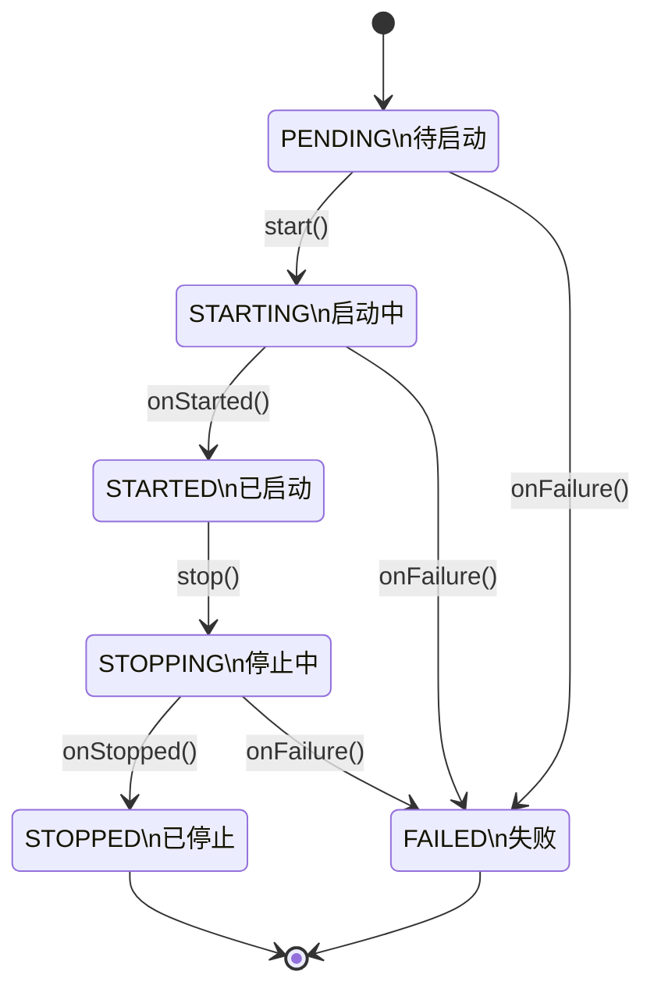
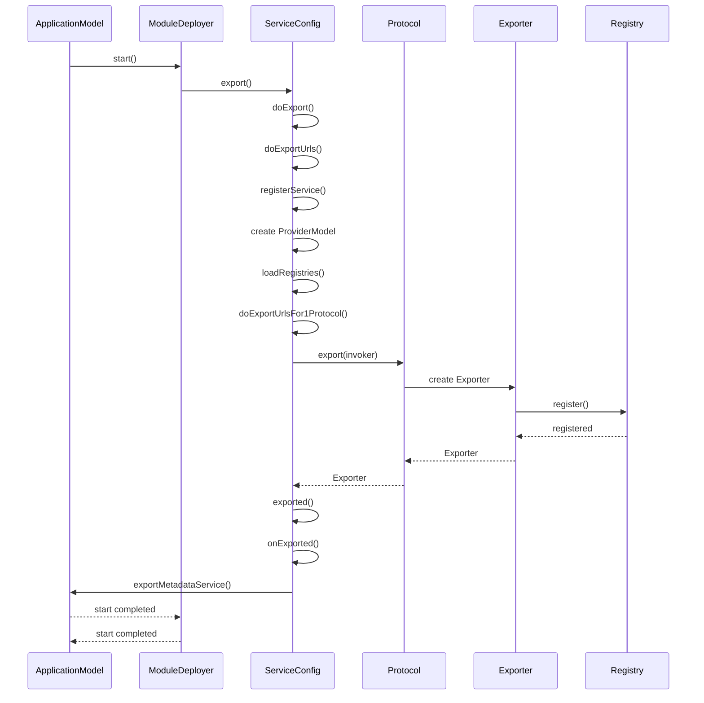

# 服务生命周期管理

<cite>
**本文档引用的文件**   
- [ServiceConfig.java](file://dubbo-config\dubbo-config-api\src\main\java\org\apache\dubbo\config\ServiceConfig.java)
- [DefaultApplicationDeployer.java](file://dubbo-config\dubbo-config-api\src\main\java\org\apache\dubbo\config\deploy\DefaultApplicationDeployer.java)
- [DefaultModuleDeployer.java](file://dubbo-config\dubbo-config-api\src\main\java\org\apache\dubbo\config\deploy\DefaultModuleDeployer.java)
- [Protocol.java](file://dubbo-rpc\dubbo-rpc-api\src\main\java\org\apache\dubbo\rpc\Protocol.java)
- [Exporter.java](file://dubbo-rpc\dubbo-rpc-api\src\main\java\org\apache\dubbo\rpc\Exporter.java)
- [Invoker.java](file://dubbo-rpc\dubbo-rpc-api\src\main\java\org\apache\dubbo\rpc\Invoker.java)
- [ProxyFactory.java](file://dubbo-rpc\dubbo-rpc-api\src\main\java\org\apache\dubbo\rpc\ProxyFactory.java)
- [ExporterListener.java](file://dubbo-rpc\dubbo-rpc-api\src\main\java\org\apache\dubbo\rpc\ExporterListener.java)
- [Deployer.java](file://dubbo-common\src\main\java\org\apache\dubbo\common\deploy\Deployer.java)
- [DeployListener.java](file://dubbo-common\src\main\java\org\apache\dubbo\common\deploy\DeployListener.java)
</cite>

## 目录
1. [简介](#简介)
2. [服务暴露流程](#服务暴露流程)
3. [服务引用流程](#服务引用流程)
4. [服务销毁流程](#服务销毁流程)
5. [生命周期事件通知](#生命周期事件通知)
6. [简单示例](#简单示例)
7. [扩展点实现](#扩展点实现)
8. [状态转换图](#状态转换图)
9. [关键事件时序图](#关键事件时序图)

## 简介
服务生命周期管理是Dubbo框架的核心功能之一，涵盖了服务从创建到销毁的完整过程。该管理机制包括服务暴露、服务引用和服务销毁三个主要阶段，每个阶段都有相应的注册、代理创建和资源清理操作。系统通过事件通知机制监控生命周期各阶段的状态变化，为开发者提供了丰富的扩展点来定制服务行为。本文档将详细介绍服务生命周期的各个阶段，为初学者提供简单示例，为经验丰富的开发者提供扩展点的实现方法。

## 服务暴露流程
服务暴露是将本地服务注册到远程调用系统的过程，使其他服务能够发现和调用该服务。这个过程始于`ServiceConfig`类的`export`方法，该方法首先检查服务是否已导出，然后根据配置决定是否延迟导出。如果不需要延迟，系统会调用`doExport`方法执行实际的导出操作。

在`doExportUrls`方法中，系统首先通过`ModuleServiceRepository`注册服务描述符，然后创建`ProviderModel`实例来表示服务提供者模型。接下来，系统会加载注册中心配置，并为每个协议配置调用`doExportUrlsFor1Protocol`方法。在该方法中，系统构建包含服务元数据的URL，处理服务执行器配置，最后调用`exportUrl`方法完成导出。

`exportUrl`方法根据服务作用域决定是否在本地和远程导出服务。对于远程导出，系统会调用`exportRemote`方法，该方法通过协议SPI（`protocolSPI`）执行实际的导出操作。导出成功后，系统会调用`exported`方法进行后续处理，包括服务名称映射、触发导出事件监听器和导出元数据服务。

**Section sources**
- [ServiceConfig.java](file://dubbo-config\dubbo-config-api\src\main\java\org\apache\dubbo\config\ServiceConfig.java#L325-L901)

## 服务引用流程
服务引用是创建远程服务代理的过程，使本地服务能够调用其他服务。这个过程通过`Protocol`接口的`refer`方法实现，该方法接收服务接口类型和URL作为参数，返回一个`Invoker`实例。`Invoker`是Dubbo中表示远程调用的核心接口，封装了实际的网络通信细节。

当应用启动时，`DefaultModuleDeployer`的`referServices`方法会触发服务引用过程。系统首先从配置中获取引用配置，然后通过`ReferenceConfig`的`get`方法创建代理。在`get`方法中，系统会调用`Protocol`的`refer`方法获取`Invoker`，然后通过`ProxyFactory`创建代理对象。

`ProxyFactory`是代理创建的核心接口，其`getProxy`方法接收`Invoker`作为参数，返回一个实现了服务接口的代理对象。代理对象在调用方法时，会将调用信息封装成`Invocation`对象，然后通过`Invoker`的`invoke`方法发送到远程服务。系统支持多种代理创建方式，如Javassist和JDK动态代理，可以通过配置进行选择。

**Section sources**
- [Protocol.java](file://dubbo-rpc\dubbo-rpc-api\src\main\java\org\apache\dubbo\rpc\Protocol.java#L84-L100)
- [ProxyFactory.java](file://dubbo-rpc\dubbo-rpc-api\src\main\java\org\apache\dubbo\rpc\ProxyFactory.java#L38-L61)
- [Invoker.java](file://dubbo-rpc\dubbo-rpc-api\src\main\java\org\apache\dubbo\rpc\Invoker.java#L29-L47)

## 服务销毁流程
服务销毁是清理服务资源并从系统中移除服务的过程，确保应用能够优雅地关闭。这个过程始于`ServiceConfig`的`unexport`方法，该方法首先检查服务是否已导出和未导出，然后遍历所有导出的`Exporter`实例，调用其`unregister`和`unexport`方法。

在`unexport`方法中，系统会等待服务空闲一段时间，以确保正在进行的调用能够完成。等待时间由`server.shutdown.timeout`配置项决定，默认为10秒。如果服务在2/3的等待时间内保持空闲，系统会直接取消导出；否则，系统会等待剩余时间或直到服务空闲。

应用级别的销毁由`DefaultApplicationDeployer`的`preDestroy`和`postDestroy`方法协调。`preDestroy`方法执行离线操作，将已导出的服务从注册中心注销，并取消注册指标服务。`postDestroy`方法则负责取消引用服务、销毁执行器仓库、销毁注册中心和清理资源缓存。

**Section sources**
- [ServiceConfig.java](file://dubbo-config\dubbo-config-api\src\main\java\org\apache\dubbo\config\ServiceConfig.java#L214-L307)
- [DefaultApplicationDeployer.java](file://dubbo-config\dubbo-config-api\src\main\java\org\apache\dubbo\config\deploy\DefaultApplicationDeployer.java#L1356-L1801)
- [DefaultModuleDeployer.java](file://dubbo-config\dubbo-config-api\src\main\java\org\apache\dubbo\config\deploy\DefaultModuleDeployer.java#L300-L325)

## 生命周期事件通知
Dubbo提供了完善的事件通知机制，允许开发者监听服务生命周期的关键事件。系统通过`DeployListener`接口实现事件通知，该接口定义了`onInitialize`、`onStarting`、`onStarted`、`onStopping`、`onStopped`和`onFailure`等方法，分别对应不同的生命周期阶段。

应用级别的事件由`ApplicationDeployListener`监听，模块级别的事件由`ModuleDeployListener`监听。当应用状态发生变化时，部署器会通知所有注册的监听器。例如，当应用开始启动时，系统会调用所有监听器的`onStarting`方法；当应用启动完成时，会调用`onStarted`方法。

此外，系统还提供了`ExporterListener`接口，用于监听服务导出和取消导出事件。当服务成功导出时，系统会调用`exported`方法；当服务被取消导出时，会调用`unexported`方法。这些监听器可以通过SPI机制扩展，开发者可以实现自定义的监听逻辑，如日志记录、监控上报或自定义清理操作。

**Section sources**
- [DeployListener.java](file://dubbo-common\src\main\java\org\apache\dubbo\common\deploy\DeployListener.java#L42-L58)
- [DefaultApplicationDeployer.java](file://dubbo-config\dubbo-config-api\src\main\java\org\apache\dubbo\config\deploy\DefaultApplicationDeployer.java#L1630-L1670)
- [ExporterListener.java](file://dubbo-rpc\dubbo-rpc-api\src\main\java\org\apache\dubbo\rpc\ExporterListener.java#L26-L45)

## 简单示例
以下是一个简单的服务生命周期管理示例，展示了如何使用Dubbo API进行服务暴露和引用：

```java
// 创建服务配置
ServiceConfig<DemoService> service = new ServiceConfig<>();
service.setInterface(DemoService.class);
service.setRef(new DemoServiceImpl());

// 创建应用配置
ApplicationConfig application = new ApplicationConfig();
application.setName("demo-provider");
service.setApplication(application);

// 创建注册中心配置
RegistryConfig registry = new RegistryConfig();
registry.setAddress("zookeeper://127.0.0.1:2181");
service.setRegistry(registry);

// 暴露服务
service.export();

// 创建引用配置
ReferenceConfig<DemoService> reference = new ReferenceConfig<>();
reference.setInterface(DemoService.class);
reference.setApplication(application);
reference.setRegistry(registry);

// 获取服务代理
DemoService demoService = reference.get();

// 使用服务
String result = demoService.sayHello("world");

// 销毁服务
service.unexport();
reference.destroy();
```

这个示例展示了服务生命周期的基本操作：首先配置服务接口和实现，然后配置应用和注册中心信息，接着调用`export`方法暴露服务，通过`get`方法获取服务代理，最后调用`unexport`和`destroy`方法清理资源。

**Section sources**
- [ServiceConfig.java](file://dubbo-config\dubbo-config-api\src\main\java\org\apache\dubbo\config\ServiceConfig.java#L325-L364)
- [ReferenceConfig.java](file://dubbo-config\dubbo-config-api\src\main\java\org\apache\dubbo\config\ReferenceConfig.java#L100-L150)

## 扩展点实现
Dubbo提供了多个扩展点，允许开发者定制服务生命周期的行为。主要的扩展点包括`DeployListener`、`ExporterListener`和`ConfigInitializer`。

要实现自定义的部署监听器，需要创建一个类实现`DeployListener`接口，并使用`@Activate`注解标记：

```java
@Activate(order = 100)
public class CustomDeployListener implements DeployListener<ApplicationModel> {
    
    @Override
    public void onStarting(ApplicationModel scopeModel) {
        // 应用启动前的自定义逻辑
        System.out.println("Application is starting: " + scopeModel.getApplicationName());
    }
    
    @Override
    public void onStarted(ApplicationModel scopeModel) {
        // 应用启动后的自定义逻辑
        System.out.println("Application started: " + scopeModel.getApplicationName());
    }
    
    @Override
    public void onStopping(ApplicationModel scopeModel) {
        // 应用停止前的自定义逻辑
        System.out.println("Application is stopping: " + scopeModel.getApplicationName());
    }
}
```

要实现自定义的导出监听器，需要创建一个类实现`ExporterListener`接口：

```java
@Activate(order = 100)
public class CustomExporterListener implements ExporterListener {
    
    @Override
    public void exported(Exporter<?> exporter) throws RpcException {
        // 服务导出后的自定义逻辑
        URL url = exporter.getInvoker().getUrl();
        System.out.println("Service exported: " + url.getServiceKey());
    }
    
    @Override
    public void unexported(Exporter<?> exporter) {
        // 服务取消导出后的自定义逻辑
        URL url = exporter.getInvoker().getUrl();
        System.out.println("Service unexported: " + url.getServiceKey());
    }
}
```

这些扩展点通过SPI机制加载，开发者只需将实现类放在`META-INF/dubbo`目录下，并在配置文件中声明即可。

**Section sources**
- [DeployListener.java](file://dubbo-common\src\main\java\org\apache\dubbo\common\deploy\DeployListener.java#L42-L58)
- [ExporterListener.java](file://dubbo-rpc\dubbo-rpc-api\src\main\java\org\apache\dubbo\rpc\ExporterListener.java#L26-L45)

## 状态转换图
以下是服务生命周期的状态转换图，展示了应用在不同阶段的状态变化：



**Diagram sources**
- [DefaultApplicationDeployer.java](file://dubbo-config\dubbo-config-api\src\main\java\org\apache\dubbo\config\deploy\DefaultApplicationDeployer.java#L143-L178)
- [Deployer.java](file://dubbo-common\src\main\java\org\apache\dubbo\common\deploy\Deployer.java#L51-L86)

## 关键事件时序图
以下是服务暴露过程的关键事件时序图，展示了各个组件之间的交互顺序：



**Diagram sources**
- [ServiceConfig.java](file://dubbo-config\dubbo-config-api\src\main\java\org\apache\dubbo\config\ServiceConfig.java#L325-L901)
- [Protocol.java](file://dubbo-rpc\dubbo-rpc-api\src\main\java\org\apache\dubbo\rpc\Protocol.java#L81-L82)
- [Exporter.java](file://dubbo-rpc\dubbo-rpc-api\src\main\java\org\apache\dubbo\rpc\Exporter.java#L26-L53)