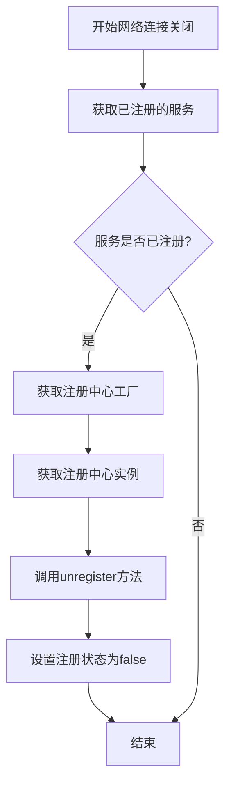
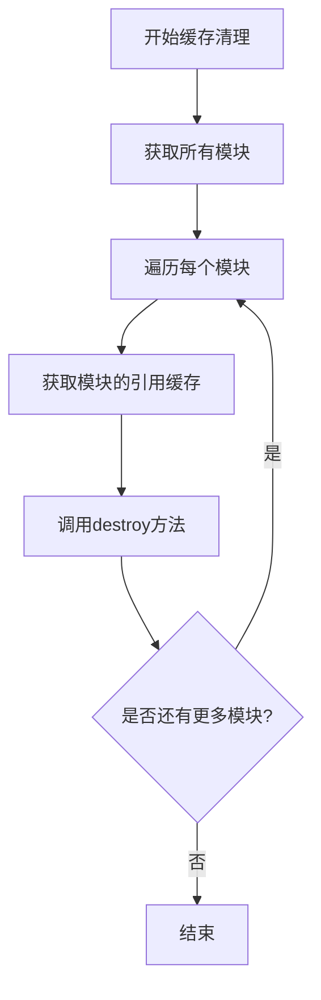
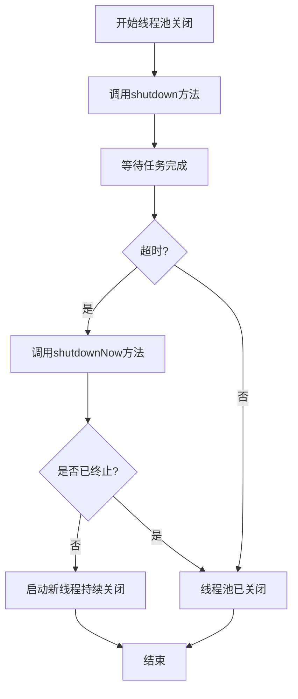
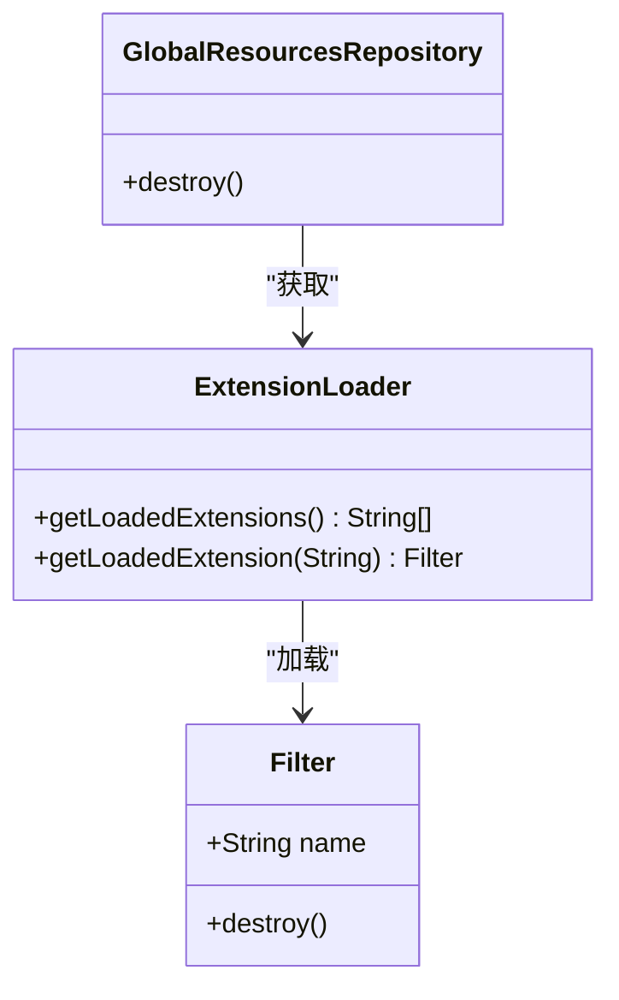
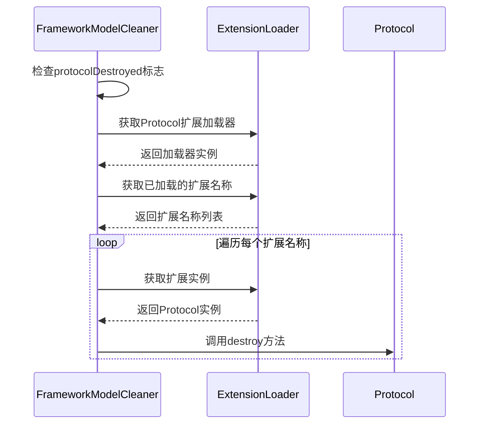
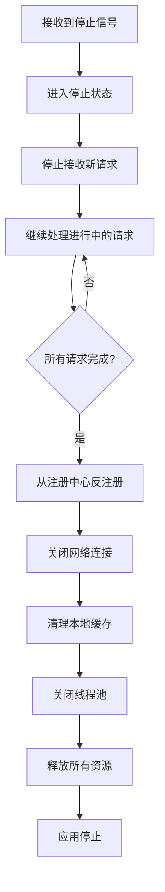
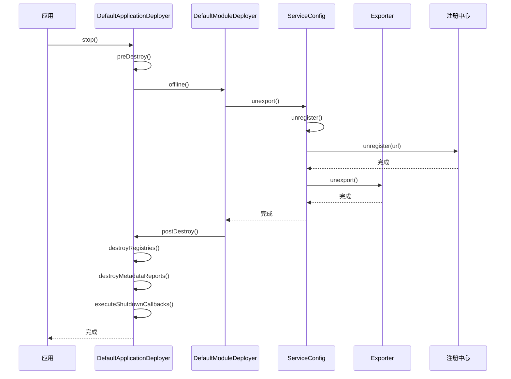

# 服务销毁

<cite>
**本文档引用的文件**
- [DefaultApplicationDeployer.java](file://dubbo-config\dubbo-config-api\src\main\java\org\apache\dubbo\config\deploy\DefaultApplicationDeployer.java)
- [DefaultModuleDeployer.java](file://dubbo-config\dubbo-config-api\src\main\java\org\apache\dubbo\config\deploy\DefaultModuleDeployer.java)
- [ServiceConfig.java](file://dubbo-config\dubbo-config-api\src\main\java\org\apache\dubbo\config\ServiceConfig.java)
- [Exporter.java](file://dubbo-rpc\dubbo-rpc-api\src\main\java\org\apache\dubbo\rpc\Exporter.java)
- [ExecutorUtil.java](file://dubbo-common\src\main\java\org\apache\dubbo\common\utils\ExecutorUtil.java)
- [GlobalResourcesRepository.java](file://dubbo-common\src\main\java\org\apache\dubbo\common\resource\GlobalResourcesRepository.java)
- [Filter.java](file://dubbo-rpc\dubbo-rpc-api\src\main\java\org\apache\dubbo\rpc\Filter.java)
- [Protocol.java](file://dubbo-rpc\dubbo-rpc-api\src\main\java\org\apache\dubbo\rpc\Protocol.java)
</cite>

## 目录
1. [简介](#简介)
2. [服务销毁流程概述](#服务销毁流程概述)
3. [资源清理过程](#资源清理过程)
4. [SPI扩展点清理](#spi扩展点清理)
5. [优雅停机实现](#优雅停机实现)
6. [服务销毁时序图](#服务销毁时序图)
7. [关键参数说明](#关键参数说明)
8. [简单示例](#简单示例)

## 简介
服务销毁是分布式系统中至关重要的环节，它确保了服务在停止时能够正确释放所有资源，避免资源泄漏和系统不稳定。本文档详细介绍了Dubbo框架中服务销毁的完整流程，包括资源清理、SPI扩展点处理、优雅停机等核心概念，为开发者提供全面的指导。

## 服务销毁流程概述
服务销毁是Dubbo应用生命周期的最后阶段，其主要目标是安全、有序地释放所有已分配的资源。整个销毁流程遵循严格的顺序，确保各个组件能够正确地进行清理工作。

服务销毁流程始于应用的停止请求，由`DefaultApplicationDeployer`类负责协调整个销毁过程。该类首先会通知所有模块开始停止，然后依次执行注册中心反注册、协议销毁、元数据报告销毁等操作。在整个过程中，系统会确保所有异步操作都已完成，并且所有资源都已正确释放。

销毁流程的核心是`postDestroy`方法，该方法在应用停止时被调用，负责执行所有必要的清理工作。此方法会同步调用`destroyRegistries`、`destroyMetadataReports`等方法，确保注册中心和元数据报告等关键组件被正确销毁。

**Section sources**
- [DefaultApplicationDeployer.java](file://dubbo-config\dubbo-config-api\src\main\java\org\apache\dubbo\config\deploy\DefaultApplicationDeployer.java#L1418-L1428)

## 资源清理过程
服务销毁过程中的资源清理是确保系统稳定性的关键步骤。Dubbo框架在销毁过程中会系统性地清理各种资源，包括网络连接、注册中心注册信息、本地缓存和线程池等。

### 网络连接关闭
在网络连接关闭阶段，系统会遍历所有已注册的服务，并从注册中心注销这些服务。这一过程通过`doOffline`方法实现，该方法会获取注册中心工厂，然后通过工厂获取具体的注册中心实例，最后调用`unregister`方法从注册中心移除服务URL。



**Diagram sources**
- [DefaultModuleDeployer.java](file://dubbo-config\dubbo-config-api\src\main\java\org\apache\dubbo\config\deploy\DefaultModuleDeployer.java#L271-L298)

### 注册中心反注册
注册中心反注册是服务销毁过程中的重要环节。当服务停止时，必须从注册中心移除其注册信息，以确保消费者不会尝试调用已停止的服务。这一过程通过`Registry`接口的`unregister`方法实现。

在反注册过程中，系统会遍历所有提供者模型的已注册URL，并调用注册中心的`unregister`方法。如果注册中心不可用或出现异常，系统会记录警告日志，但不会中断整个销毁流程，以确保其他资源能够正常释放。

**Section sources**
- [DefaultModuleDeployer.java](file://dubbo-config\dubbo-config-api\src\main\java\org\apache\dubbo\config\deploy\DefaultModuleDeployer.java#L271-L298)

### 本地缓存清理
本地缓存清理是服务销毁过程中的另一个重要步骤。Dubbo框架使用`ReferenceCache`来管理引用配置的缓存，确保在服务销毁时能够正确清理这些缓存。

缓存清理通过`CompositeReferenceCache`类的`destroyAll`方法实现，该方法会遍历所有模块的引用缓存，并调用各自的`destroy`方法。对于每个引用配置，系统会从缓存中移除对应的条目，并调用`destroyReference`方法进行最终的清理工作。



**Diagram sources**
- [SimpleReferenceCache.java](file://dubbo-config\dubbo-config-api\src\main\java\org\apache\dubbo\config\utils\SimpleReferenceCache.java#L236-L272)

### 线程池关闭
线程池关闭是服务销毁过程中确保资源完全释放的关键步骤。Dubbo框架使用`ExecutorUtil`类提供的`gracefulShutdown`方法来优雅地关闭线程池。

线程池关闭过程分为两个阶段：首先调用`shutdown`方法停止接收新任务，然后等待所有已提交的任务完成。如果在指定的超时时间内任务仍未完成，系统会调用`shutdownNow`方法强制关闭线程池。对于未能正常关闭的线程池，系统会启动一个新线程来持续尝试关闭，直到成功为止。



**Diagram sources**
- [ExecutorUtil.java](file://dubbo-common\src\main\java\org\apache\dubbo\common\utils\ExecutorUtil.java#L64-L86)

## SPI扩展点清理
SPI（Service Provider Interface）扩展点的清理是服务销毁过程中的重要组成部分。Dubbo框架通过SPI机制实现了高度的可扩展性，因此在服务销毁时必须正确清理这些扩展点，以避免资源泄漏。

### Filter清理
Filter是Dubbo框架中用于拦截RPC调用的重要扩展点。在服务销毁过程中，系统会通过`ExtensionLoader`获取所有已加载的Filter扩展，并调用其销毁方法。

Filter的清理顺序遵循SPI扩展的加载顺序，确保依赖关系正确的Filter能够按正确顺序被清理。系统会遍历所有已加载的Filter名称，获取对应的Filter实例，并调用其`destroy`方法。如果在清理过程中发生异常，系统会记录警告日志，但不会中断整个清理流程。



**Diagram sources**
- [Filter.java](file://dubbo-rpc\dubbo-rpc-api\src\main\java\org\apache\dubbo\rpc\Filter.java#L68-L70)

### Protocol清理
Protocol是Dubbo框架中负责网络通信的核心扩展点。在服务销毁过程中，系统会通过`FrameworkModelCleaner`类的`destroyProtocols`方法来清理所有协议。

Protocol的清理过程首先会检查`protocolDestroyed`标志，确保清理操作只执行一次。然后通过`ExtensionLoader`获取所有已加载的Protocol扩展，遍历并调用每个Protocol实例的`destroy`方法。这一过程确保了所有网络协议相关的资源都能被正确释放。



**Diagram sources**
- [FrameworkModelCleaner.java](file://dubbo-config\dubbo-config-api\src\main\java\org\apache\dubbo\config\deploy\FrameworkModelCleaner.java#L61-L75)

## 优雅停机实现
优雅停机是确保服务在停止时能够完成正在进行的请求，避免数据丢失和客户端异常的重要机制。Dubbo框架提供了完善的优雅停机支持，确保服务能够安全地停止。

### 优雅停机流程
优雅停机流程始于应用接收到停止信号。系统首先会进入停止状态，然后开始执行一系列清理操作。在此期间，服务会继续处理已接收的请求，但不再接受新的请求。

系统会等待所有正在进行的请求完成，然后逐步关闭各个组件。这一过程包括从注册中心反注册、关闭网络连接、清理本地缓存和关闭线程池等步骤。在整个过程中，系统会确保所有资源都被正确释放，避免资源泄漏。



**Diagram sources**
- [DefaultApplicationDeployer.java](file://dubbo-config\dubbo-config-api\src\main\java\org\apache\dubbo\config\deploy\DefaultApplicationDeployer.java#L1418-L1428)

### 关键实现细节
优雅停机的关键实现细节包括使用`CompletableFuture`来管理异步操作的生命周期，确保所有异步任务都能在应用停止前完成。系统会维护一个`asyncExportingFutures`和`asyncReferringFutures`列表，分别跟踪服务导出和服务引用的异步操作。

在销毁过程中，系统会等待这些异步操作完成，然后才继续执行后续的清理工作。对于未能在指定时间内完成的操作，系统会尝试取消它们，确保应用能够及时停止。

**Section sources**
- [DefaultModuleDeployer.java](file://dubbo-config\dubbo-config-api\src\main\java\org\apache\dubbo\config\deploy\DefaultModuleDeployer.java#L71-L73)

## 服务销毁时序图
服务销毁时序图展示了服务销毁过程中各个组件之间的交互顺序，帮助开发者理解整个销毁流程的执行顺序。



**Diagram sources**
- [DefaultApplicationDeployer.java](file://dubbo-config\dubbo-config-api\src\main\java\org\apache\dubbo\config\deploy\DefaultApplicationDeployer.java#L1418-L1428)
- [DefaultModuleDeployer.java](file://dubbo-config\dubbo-config-api\src\main\java\org\apache\dubbo\config\deploy\DefaultModuleDeployer.java#L301-L306)

## 关键参数说明
服务销毁过程中的关键参数对销毁行为有重要影响，理解这些参数有助于正确配置和调试服务销毁过程。

| 参数名称 | 说明 | 默认值 | 影响范围 |
|--------|------|-------|--------|
| shutdown.wait | 服务停止时等待的时间（毫秒） | 0 | 全局 |
| executor.management.mode | 执行器管理模式 | isolation | 应用级别 |
| dubbo.service.shutdown.wait | 服务停止等待时间 | 0 | 服务级别 |
| registry.unregister.on.stop | 停止时是否从注册中心反注册 | true | 应用级别 |

这些参数可以通过系统属性或配置文件进行设置，影响服务销毁的具体行为。例如，`shutdown.wait`参数决定了应用在收到停止信号后等待多久才开始执行销毁操作，这对于确保所有请求都能完成处理非常重要。

**Section sources**
- [ServiceConfig.java](file://dubbo-config\dubbo-config-api\src\main\java\org\apache\dubbo\config\ServiceConfig.java#L213-L257)

## 简单示例
以下是一个简单的服务销毁示例，展示了如何在实际应用中实现服务的优雅停机。

```java
// 创建服务配置
ServiceConfig<DemoService> service = new ServiceConfig<>();
service.setInterface(DemoService.class);
service.setRef(new DemoServiceImpl());

// 导出服务
service.export();

// 模拟应用运行一段时间
Thread.sleep(5000);

// 销毁服务
service.unexport();
```

在这个示例中，首先创建一个服务配置并设置接口和实现类，然后调用`export`方法导出服务。在服务运行一段时间后，调用`unexport`方法销毁服务。`unexport`方法会自动执行从注册中心反注册、关闭网络连接、清理本地缓存等一系列清理操作，确保服务能够安全地停止。

**Section sources**
- [ServiceConfigTest.java](file://dubbo-config\dubbo-config-api\src\test\java\org\apache\dubbo\config\ServiceConfigTest.java#L262-L268)