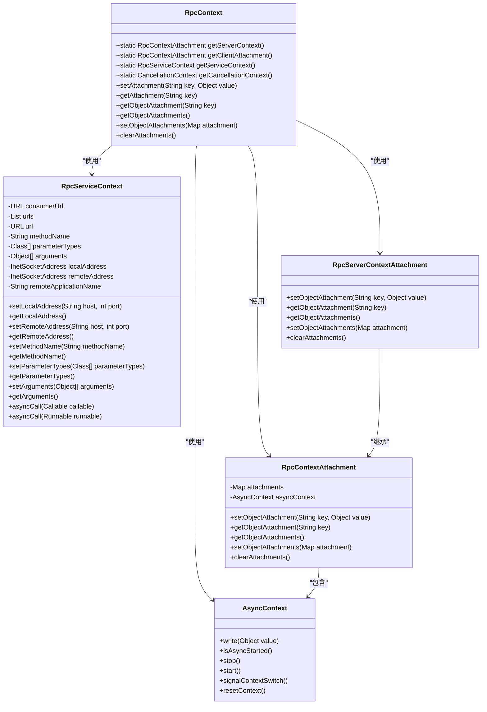
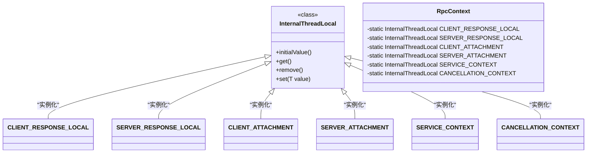
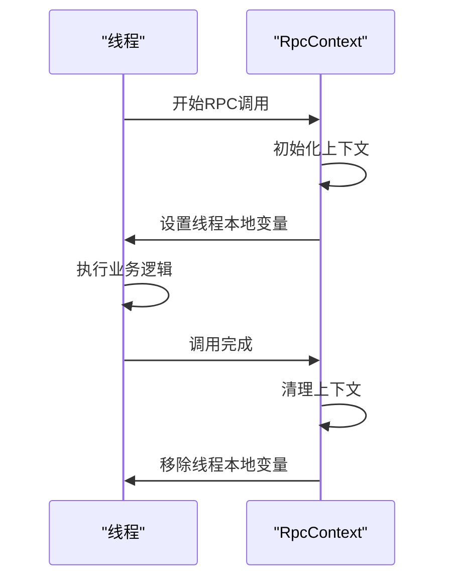
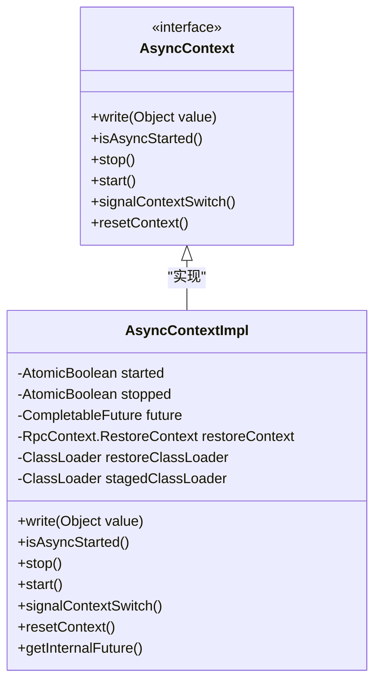
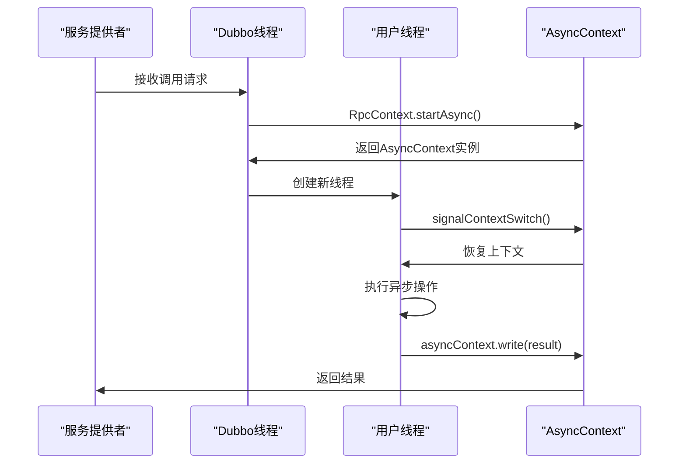
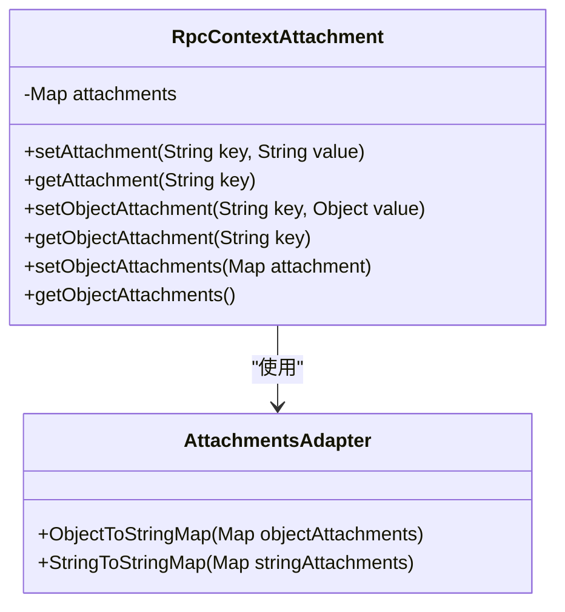
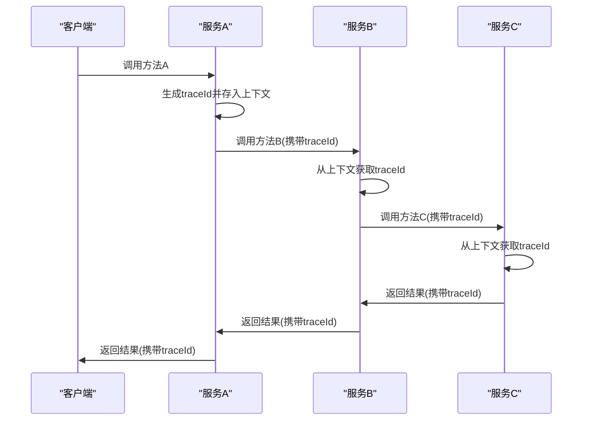
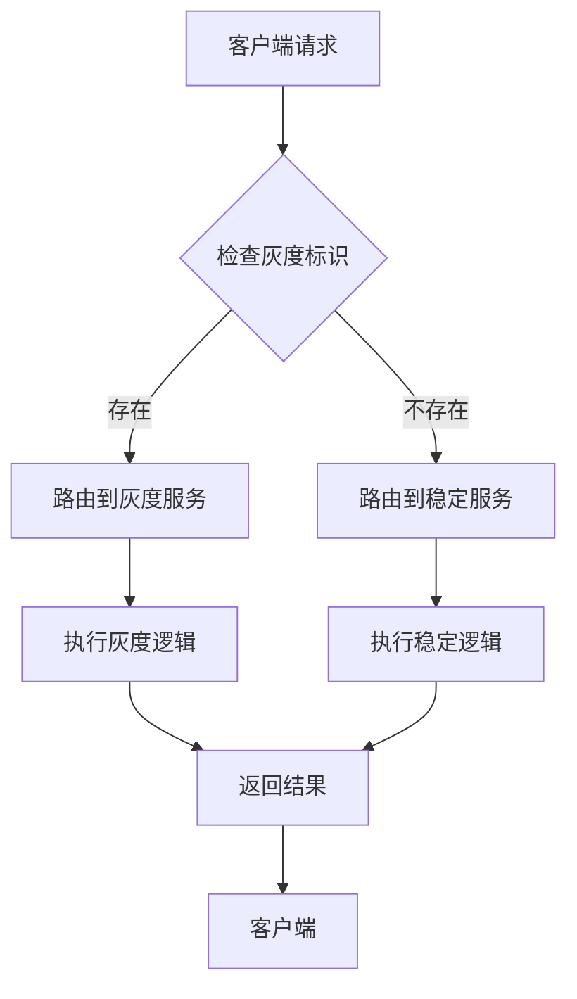

# 调用上下文管理

<cite>
**本文档引用的文件**   
- [RpcContext.java](file://dubbo-rpc\dubbo-rpc-api\src\main\java\org\apache\dubbo\rpc\RpcContext.java)
- [RpcContextAttachment.java](file://dubbo-rpc\dubbo-rpc-api\src\main\java\org\apache\dubbo\rpc\RpcContextAttachment.java)
- [RpcServiceContext.java](file://dubbo-rpc\dubbo-rpc-api\src\main\java\org\apache\dubbo\rpc\RpcServiceContext.java)
- [AsyncContext.java](file://dubbo-rpc\dubbo-rpc-api\src\main\java\org\apache\dubbo\rpc\AsyncContext.java)
- [AsyncContextImpl.java](file://dubbo-rpc\dubbo-rpc-api\src\main\java\org\apache\dubbo\rpc\AsyncContextImpl.java)
- [RpcServerContextAttachment.java](file://dubbo-rpc\dubbo-rpc-api\src\main\java\org\apache\dubbo\rpc\RpcServerContextAttachment.java)
- [RpcContextTest.java](file://dubbo-rpc\dubbo-rpc-api\src\test\java\org\apache\dubbo\rpc\RpcContextTest.java)
- [ContextFilter.java](file://dubbo-rpc\dubbo-rpc-api\src\main\java\org\apache\dubbo\rpc\filter\ContextFilter.java)
- [Result.java](file://dubbo-rpc\dubbo-rpc-api\src\main\java\org\apache\dubbo\rpc\Result.java)
- [AsyncRpcResult.java](file://dubbo-rpc\dubbo-rpc-api\src\main\java\org\apache\dubbo\rpc\AsyncRpcResult.java)
</cite>

## 目录
1. [引言](#引言)
2. [上下文设计与实现](#上下文设计与实现)
3. [线程本地存储机制](#线程本地存储机制)
4. [异步调用上下文传递](#异步调用上下文传递)
5. [附件使用场景与限制](#附件使用场景与限制)
6. [服务治理中的上下文作用](#服务治理中的上下文作用)
7. [上下文传递示例](#上下文传递示例)
8. [上下文扩展最佳实践](#上下文扩展最佳实践)
9. [常见问题解决方案](#常见问题解决方案)
10. [总结](#总结)

## 引言
调用上下文管理是分布式系统中至关重要的组件，它负责在服务调用过程中传递和管理上下文信息。在Dubbo框架中，RpcContext类提供了完整的上下文管理功能，支持线程本地存储、异步调用上下文传递、附件管理等多种特性。本文档将深入分析RpcContext的设计和使用，为开发者提供全面的指导。

## 上下文设计与实现

### 核心组件
Dubbo的调用上下文管理由多个核心组件构成，它们协同工作以实现完整的上下文管理功能。



**图源**
- [RpcContext.java](file://dubbo-rpc\dubbo-rpc-api\src\main\java\org\apache\dubbo\rpc\RpcContext.java)
- [RpcContextAttachment.java](file://dubbo-rpc\dubbo-rpc-api\src\main\java\org\apache\dubbo\rpc\RpcContextAttachment.java)
- [RpcServiceContext.java](file://dubbo-rpc\dubbo-rpc-api\src\main\java\org\apache\dubbo\rpc\RpcServiceContext.java)
- [AsyncContext.java](file://dubbo-rpc\dubbo-rpc-api\src\main\java\org\apache\dubbo\rpc\AsyncContext.java)
- [RpcServerContextAttachment.java](file://dubbo-rpc\dubbo-rpc-api\src\main\java\org\apache\dubbo\rpc\RpcServerContextAttachment.java)

### 上下文类型
Dubbo框架中定义了四种主要的上下文类型，每种类型都有其特定的用途：

1. **ServerContext**：服务器端上下文，用于在服务提供者端返回附件给消费者
2. **ClientAttachment**：客户端附件，用于在消费者端传递附件到下一个调用节点
3. **ServerAttachment**：服务器附件，用于在服务提供者端获取来自消费者的附件
4. **ServiceContext**：服务上下文，用于在整个调用过程中传递环境参数

这些上下文类型通过线程本地变量（ThreadLocal）实现隔离，确保每个线程都有独立的上下文实例。

## 线程本地存储机制

### 内部实现
RpcContext使用InternalThreadLocal来实现线程本地存储，这是一种性能优化的ThreadLocal实现。通过分析源码，我们可以看到多个InternalThreadLocal实例被定义用于不同的上下文场景：



**图源**
- [RpcContext.java](file://dubbo-rpc\dubbo-rpc-api\src\main\java\org\apache\dubbo\rpc\RpcContext.java)

### 上下文生命周期
上下文的生命周期与线程的执行周期紧密相关。当线程开始执行RPC调用时，上下文被初始化；当调用完成时，上下文被清理。这种机制确保了上下文信息不会在不同调用之间发生污染。



**图源**
- [RpcContext.java](file://dubbo-rpc\dubbo-rpc-api\src\main\java\org\apache\dubbo\rpc\RpcContext.java)

### 上下文清理
为了防止内存泄漏，RpcContext提供了多种清理方法：

- `removeClientAttachment()`：移除客户端附件
- `removeServerAttachment()`：移除服务器附件
- `removeServiceContext()`：移除服务上下文
- `removeContext()`：移除所有上下文

这些方法通常在调用完成后由框架自动调用，确保上下文资源被正确释放。

## 异步调用上下文传递

### 异步上下文机制
在异步调用场景中，上下文传递变得更加复杂，因为调用可能跨越多个线程。Dubbo通过AsyncContext接口解决了这个问题，允许开发者在异步操作中正确传递和恢复上下文。



**图源**
- [AsyncContext.java](file://dubbo-rpc\dubbo-rpc-api\src\main\java\org\apache\dubbo\rpc\AsyncContext.java)
- [AsyncContextImpl.java](file://dubbo-rpc\dubbo-rpc-api\src\main\java\org\apache\dubbo\rpc\AsyncContextImpl.java)

### 上下文切换流程
异步调用中的上下文传递需要显式地进行上下文切换，以确保新线程能够访问正确的上下文信息。



**图源**
- [AsyncContext.java](file://dubbo-rpc\dubbo-rpc-api\src\main\java\org\apache\dubbo\rpc\AsyncContext.java)

### 异步调用示例
以下是一个典型的异步调用示例，展示了如何正确使用AsyncContext进行上下文传递：

```java
public class AsyncServiceImpl implements AsyncService {
    public String sayHello(String name) {
        final AsyncContext asyncContext = RpcContext.startAsync();
        new Thread(() -> {
            // 在新线程中恢复上下文
            asyncContext.signalContextSwitch();
            
            try {
                Thread.sleep(500);
            } catch (InterruptedException e) {
                e.printStackTrace();
            }
            // 写入结果并完成异步调用
            asyncContext.write("Hello " + name + ", response from provider.");
            // 调用完成后重置上下文
            asyncContext.resetContext();
        }).start();
        return null;
    }
}
```

## 附件使用场景与限制

### 附件类型
Dubbo的附件系统支持两种类型的附件：

1. **字符串附件**：通过`setAttachment(String key, String value)`方法设置，只能存储字符串值
2. **对象附件**：通过`setObjectAttachment(String key, Object value)`方法设置，可以存储任意对象



**图源**
- [RpcContextAttachment.java](file://dubbo-rpc\dubbo-rpc-api\src\main\java\org\apache\dubbo\rpc\RpcContextAttachment.java)

### 使用场景
附件系统在多种场景下都非常有用：

1. **链路追踪**：在调用链中传递追踪ID
2. **灰度发布**：传递灰度标识，控制流量路由
3. **权限验证**：传递用户身份信息
4. **日志关联**：传递请求ID，便于日志追踪

### 限制与注意事项
尽管附件系统功能强大，但也有一些限制需要注意：

1. **序列化限制**：对象附件需要能够被序列化，否则在跨网络传输时会失败
2. **性能影响**：过多的附件会增加网络传输开销
3. **大小限制**：附件数据不宜过大，以免影响性能
4. **安全性**：敏感信息不应通过附件传递，除非有适当的加密措施

## 服务治理中的上下文作用

### 链路追踪
在分布式系统中，链路追踪是诊断问题的关键。通过在上下文中传递追踪ID，可以将分散在多个服务中的日志关联起来。



**图源**
- [RpcContext.java](file://dubbo-rpc\dubbo-rpc-api\src\main\java\org\apache\dubbo\rpc\RpcContext.java)

### 灰度发布
灰度发布是新功能上线的重要策略。通过在上下文中传递灰度标识，可以精确控制流量路由。



**图源**
- [RpcContext.java](file://dubbo-rpc\dubbo-rpc-api\src\main\java\org\apache\dubbo\rpc\RpcContext.java)

### 服务治理功能
上下文在服务治理中扮演着重要角色，支持多种治理功能：

1. **流量控制**：通过上下文传递流量控制信息
2. **熔断降级**：传递熔断状态信息
3. **负载均衡**：传递负载均衡策略
4. **服务路由**：传递路由规则

## 上下文传递示例

### 简单同步调用示例
对于初学者，以下是一个简单的同步调用上下文使用示例：

```java
// 消费者端设置附件
RpcContext.getContext().setAttachment("user-id", "12345");
RpcContext.getContext().setAttachment("request-id", "req-001");

// 调用远程服务
String result = demoService.sayHello("world");

// 获取服务端返回的附件
String serverInfo = RpcContext.getContext().getAttachment("server-info");
```

### 复杂异步调用示例
对于经验丰富的开发者，以下是一个复杂的异步调用示例：

```java
public class ComplexAsyncService {
    public CompletableFuture<String> processOrder(Order order) {
        // 开始异步上下文
        AsyncContext asyncContext = RpcContext.startAsync();
        
        // 创建CompletableFuture用于返回结果
        CompletableFuture<String> resultFuture = new CompletableFuture<>();
        
        // 在新线程中处理订单
        new Thread(() -> {
            try {
                // 切换到正确的上下文
                asyncContext.signalContextSwitch();
                
                // 获取上下文中的用户信息
                String userId = RpcContext.getContext().getAttachment("user-id");
                
                // 处理订单逻辑
                Order processedOrder = businessService.process(order, userId);
                
                // 调用下游服务
                PaymentResult paymentResult = paymentService.charge(processedOrder);
                
                // 根据支付结果决定返回值
                if (paymentResult.isSuccess()) {
                    resultFuture.complete("Order processed successfully");
                    asyncContext.write("Payment successful");
                } else {
                    resultFuture.completeExceptionally(
                        new BusinessException("Payment failed"));
                    asyncContext.write("Payment failed");
                }
            } catch (Exception e) {
                resultFuture.completeExceptionally(e);
                asyncContext.write(e);
            } finally {
                // 重置上下文
                asyncContext.resetContext();
            }
        }).start();
        
        return resultFuture;
    }
}
```

## 上下文扩展最佳实践

### 自定义上下文过滤器
通过实现自定义的上下文过滤器，可以在调用链中添加额外的上下文处理逻辑：

```java
@Activate(group = CommonConstants.PROVIDER, order = -10000)
public class CustomContextFilter implements Filter {
    
    @Override
    public Result invoke(Invoker<?> invoker, Invocation invocation) throws RpcException {
        // 调用前：设置自定义上下文信息
        setupCustomContext(invocation);
        
        try {
            // 执行调用
            Result result = invoker.invoke(invocation);
            
            // 调用后：处理返回结果
            processResult(result);
            
            return result;
        } finally {
            // 清理上下文
            cleanupContext();
        }
    }
    
    private void setupCustomContext(Invocation invocation) {
        // 从调用参数中提取信息
        String tenantId = extractTenantId(invocation);
        
        // 设置到上下文中
        RpcContext.getContext().setAttachment("tenant-id", tenantId);
        
        // 记录开始时间用于性能监控
        RpcContext.getContext().setAttachment("start-time", 
            String.valueOf(System.currentTimeMillis()));
    }
    
    private void processResult(Result result) {
        // 计算处理时间
        long startTime = Long.valueOf(
            RpcContext.getContext().getAttachment("start-time"));
        long duration = System.currentTimeMillis() - startTime;
        
        // 将处理时间作为附件返回
        result.setAttachment("processing-time", String.valueOf(duration));
    }
    
    private void cleanupContext() {
        // 清理临时附件
        RpcContext.getContext().removeAttachment("start-time");
    }
}
```

### 上下文继承与组合
在复杂的业务场景中，可能需要创建自定义的上下文类来满足特定需求：

```java
public class BusinessContext extends RpcContext {
    private static final InternalThreadLocal<BusinessContext> CONTEXT_LOCAL = 
        new InternalThreadLocal<BusinessContext>() {
            @Override
            protected BusinessContext initialValue() {
                return new BusinessContext();
            }
        };
    
    private String businessId;
    private String customerId;
    private Map<String, Object> customData;
    
    public static BusinessContext getContext() {
        return CONTEXT_LOCAL.get();
    }
    
    public static void removeContext() {
        CONTEXT_LOCAL.remove();
    }
    
    // Getters and setters
    public String getBusinessId() {
        return businessId;
    }
    
    public void setBusinessId(String businessId) {
        this.businessId = businessId;
    }
    
    public String getCustomerId() {
        return customerId;
    }
    
    public void setCustomerId(String customerId) {
        this.customerId = customerId;
    }
    
    public Object getCustomData(String key) {
        if (customData == null) {
            return null;
        }
        return customData.get(key);
    }
    
    public void setCustomData(String key, Object value) {
        if (customData == null) {
            customData = new HashMap<>();
        }
        customData.put(key, value);
    }
}
```

### 性能优化建议
为了确保上下文管理的高性能，建议遵循以下最佳实践：

1. **减少附件数量**：只传递必要的信息，避免过度使用附件
2. **合理使用对象附件**：对象附件会增加序列化开销，应谨慎使用
3. **及时清理上下文**：确保在调用完成后及时清理上下文，防止内存泄漏
4. **避免大对象**：不要在附件中传递大对象，以免影响网络性能

## 常见问题解决方案

### 上下文丢失问题
在异步调用中，上下文丢失是最常见的问题之一。解决方案是正确使用`signalContextSwitch()`方法：

```mermaid
flowchart TD
A[问题：上下文丢失] --> B{是否在新线程中}
B --> |是| C[调用signalContextSwitch()]
B --> |否| D[检查线程池配置]
C --> E[上下文恢复]
D --> F[确保使用Dubbo线程池]
E --> G[问题解决]
F --> G
```

**图源**
- [AsyncContext.java](file://dubbo-rpc\dubbo-rpc-api\src\main\java\org\apache\dubbo\rpc\AsyncContext.java)

### 附件序列化失败
当对象附件无法序列化时，会导致调用失败。解决方案包括：

1. 确保附件对象实现Serializable接口
2. 使用简单的数据结构（如Map、List）
3. 将复杂对象转换为JSON字符串

### 内存泄漏问题
不正确的上下文管理可能导致内存泄漏。预防措施包括：

1. 确保在finally块中调用`resetContext()`
2. 避免在静态变量中持有上下文引用
3. 定期监控线程本地变量的使用情况

## 总结
调用上下文管理是Dubbo框架的核心功能之一，它为分布式系统中的服务调用提供了强大的上下文传递能力。通过深入理解RpcContext的设计和实现，开发者可以更好地利用这一功能来构建可靠、高效的分布式应用。本文档详细介绍了上下文的线程本地存储机制、异步调用上下文传递、附件使用场景以及在服务治理中的作用，为不同层次的开发者提供了实用的指导和最佳实践。

**本文档引用的文件**   
- [RpcContext.java](file://dubbo-rpc\dubbo-rpc-api\src\main\java\org\apache\dubbo\rpc\RpcContext.java)
- [RpcContextAttachment.java](file://dubbo-rpc\dubbo-rpc-api\src\main\java\org\apache\dubbo\rpc\RpcContextAttachment.java)
- [RpcServiceContext.java](file://dubbo-rpc\dubbo-rpc-api\src\main\java\org\apache\dubbo\rpc\RpcServiceContext.java)
- [AsyncContext.java](file://dubbo-rpc\dubbo-rpc-api\src\main\java\org\apache\dubbo\rpc\AsyncContext.java)
- [AsyncContextImpl.java](file://dubbo-rpc\dubbo-rpc-api\src\main\java\org\apache\dubbo\rpc\AsyncContextImpl.java)
- [RpcServerContextAttachment.java](file://dubbo-rpc\dubbo-rpc-api\src\main\java\org\apache\dubbo\rpc\RpcServerContextAttachment.java)
- [RpcContextTest.java](file://dubbo-rpc\dubbo-rpc-api\src\test\java\org\apache\dubbo\rpc\RpcContextTest.java)
- [ContextFilter.java](file://dubbo-rpc\dubbo-rpc-api\src\main\java\org\apache\dubbo\rpc\filter\ContextFilter.java)
- [Result.java](file://dubbo-rpc\dubbo-rpc-api\src\main\java\org\apache\dubbo\rpc\Result.java)
- [AsyncRpcResult.java](file://dubbo-rpc\dubbo-rpc-api\src\main\java\org\apache\dubbo\rpc\AsyncRpcResult.java)