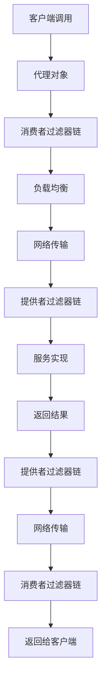
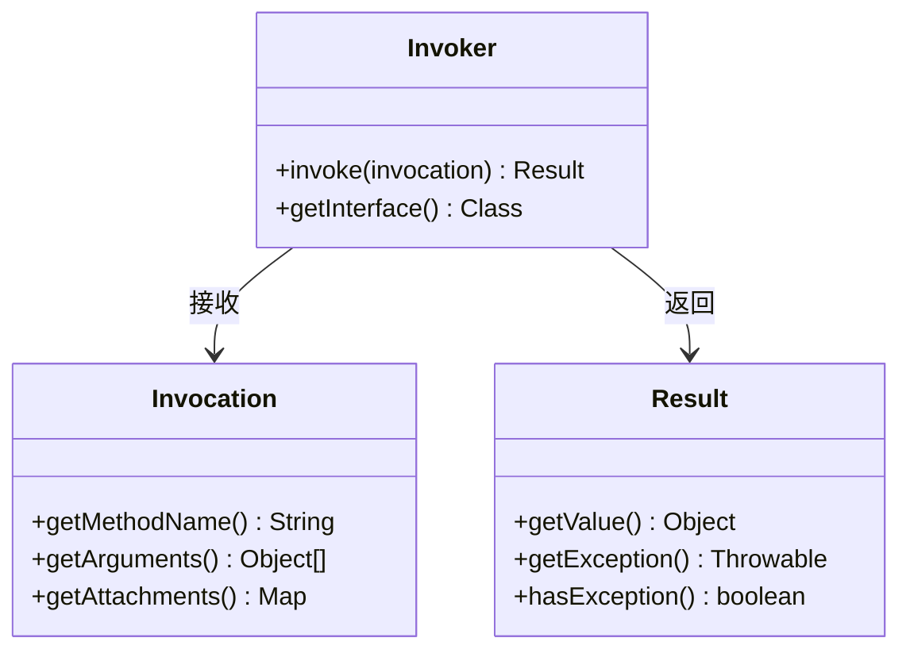

# 调用器与调用链

## 概述

在Dubbo分布式服务框架中,调用器(Invoker)与调用链(Invocation Chain)是实现远程过程调用(RPC)的核心机制。调用器作为服务调用的抽象,封装了本地或远程服务的执行逻辑;调用链则通过拦截器模式,在调用前后添加各种功能,如监控、限流、日志等。

## 核心概念

### 三大核心接口

Dubbo的RPC调用体系围绕三个核心接口构建:

- **Invoker**: 服务调用的统一抽象,代表了一个可执行的服务端点
- **Invocation**: 封装单次RPC调用的所有上下文信息
- **Result**: 代表一次RPC调用的结果,支持同步和异步调用模式

### 核心机制

- **代理机制**: 通过JDK动态代理实现本地调用和远程调用的统一
- **拦截器模式**: 基于责任链模式,实现横切关注点的功能扩展
- **异步处理**: 通过CompletableFuture实现完整的异步调用支持

## 文档导航

本模块文档按照主题拆分为以下几个部分:

### 1. [调用器核心接口](./调用器核心接口.md)

**主要内容**:
- Invoker接口设计原理
- 核心方法详解(invoke、getUrl、getInterface)
- 调用流程分析
- 生命周期管理
- 服务消费者与提供者端的实现差异
- 类图与状态转换图

**适合读者**: 需要深入了解Invoker接口设计和实现机制的开发者

### 2. [调用上下文](./调用上下文.md)

**主要内容**:
- Invocation接口设计
- 调用上下文组成(方法名、参数类型、参数值、附加属性)
- 上下文传递机制
- RpcInvocation实现
- 上下文使用示例

**适合读者**: 需要了解如何在调用链中传递和使用上下文信息的开发者

### 3. [结果处理机制](./结果处理机制.md)

**主要内容**:
- Result接口设计
- 同步与异步结果处理
- AsyncRpcResult实现
- 异步回调处理
- CompletableFuture集成
- 结果处理最佳实践

**适合读者**: 需要处理异步调用和回调的开发者

### 4. [调用链构建](./调用链构建.md)

**主要内容**:
- 拦截器机制
- FilterChainBuilder设计
- 调用链构建过程
- 自定义拦截器实现
- 拦截器激活与排序
- 性能监控集成

**适合读者**: 需要自定义拦截器或扩展调用链功能的开发者

### 5. [代理机制与远程调用](./代理机制与远程调用.md)

**主要内容**:
- JDK动态代理实现
- 代理对象创建流程
- 远程调用封装
- 序列化与反序列化
- 网络传输机制

**适合读者**: 需要了解代理和网络通信底层实现的开发者

### 6. [调用链执行流程](./调用链执行流程.md)

**主要内容**:
- 完整调用链执行流程
- 消费者端处理流程
- 提供者端处理流程
- 过滤器链执行顺序
- 调用链性能优化

**适合读者**: 需要全面理解调用链执行过程的开发者

### 7. [性能监控与指标](./性能监控与指标.md)

**主要内容**:
- 关键性能指标(TPS、延迟、错误率等)
- 监控拦截器实现
- 指标收集与聚合
- 性能数据上报
- 监控最佳实践

**适合读者**: 需要实现服务监控和性能分析的开发者

## 快速开始

### 基本使用示例

```java
// 1. 创建服务接口
public interface DemoService {
    String sayHello(String name);
}

// 2. 服务实现
public class DemoServiceImpl implements DemoService {
    @Override
    public String sayHello(String name) {
        return "Hello, " + name;
    }
}

// 3. 服务调用
DemoService service = ReferenceConfig.get().get();
String result = service.sayHello("World");
System.out.println(result); // 输出: Hello, World
```

### 自定义拦截器示例

```java
@Activate(group = CommonConstants.PROVIDER, order = 100)
public class CustomAuthFilter implements Filter {
    
    @Override
    public Result invoke(Invoker<?> invoker, Invocation invocation) throws RpcException {
        // 1. 从调用上下文中获取认证信息
        String token = invocation.getAttachment("auth-token");
        
        // 2. 验证认证信息
        if (!validateToken(token)) {
            return AsyncRpcResult.newDefaultAsyncResult(
                new RpcException("认证失败"), invocation);
        }
        
        // 3. 继续调用链
        return invoker.invoke(invocation);
    }
}
```

## 架构图示

### 调用链整体架构



### 核心接口关系



## 学习路径建议

### 初级开发者
1. 先阅读本概述文档,了解整体架构
2. 学习[调用器核心接口](./调用器核心接口.md),理解Invoker的基本概念
3. 学习基本使用示例,能够进行简单的服务调用

### 中级开发者
1. 深入学习[调用上下文](./调用上下文.md)和[结果处理机制](./结果处理机制.md)
2. 学习[调用链构建](./调用链构建.md),了解如何自定义拦截器
3. 实践异步调用和自定义拦截器

### 高级开发者
1. 学习[代理机制与远程调用](./代理机制与远程调用.md)的底层实现
2. 深入研究[调用链执行流程](./调用链执行流程.md)
3. 学习[性能监控与指标](./性能监控与指标.md),实现生产级监控方案
4. 根据业务需求,设计和实现自定义的调用链扩展

## 相关模块

- [dubbo-rpc模块](../) - RPC调用的顶层模块
- [dubbo-cluster模块](../../dubbo-cluster模块/) - 集群容错和负载均衡
- [dubbo-remoting模块](../../dubbo-remoting模块/) - 网络通信层
- [过滤器机制](../../../dubbo-plugin模块/过滤器机制/) - 拦截器的SPI扩展机制

## 参考资源

**核心源码文件**:
- [Invoker.java](file://dubbo-rpc\dubbo-rpc-api\src\main\java\org\apache\dubbo\rpc\Invoker.java)
- [Invocation.java](file://dubbo-rpc\dubbo-rpc-api\src\main\java\org\apache\dubbo\rpc\Invocation.java)
- [Result.java](file://dubbo-rpc\dubbo-rpc-api\src\main\java\org\apache\dubbo\rpc\Result.java)
- [FilterChainBuilder.java](file://dubbo-cluster\src\main\java\org\apache\dubbo\rpc\cluster\filter\FilterChainBuilder.java)

## 总结

调用器与调用链是Dubbo框架的核心机制,它们通过Invoker、Invocation和Result三个核心接口,实现了服务调用的抽象、上下文传递和结果处理。代理机制使得本地调用和远程调用的统一成为可能,而拦截器模式则为功能扩展提供了灵活的架构。

通过深入理解这些机制,开发者不仅可以更好地使用Dubbo,还可以根据业务需求定制自己的调用链,实现诸如认证、监控、限流等横切关注点。调用链的设计充分体现了面向切面编程的思想,在不侵入业务代码的情况下,为分布式服务提供了强大的功能支持。
