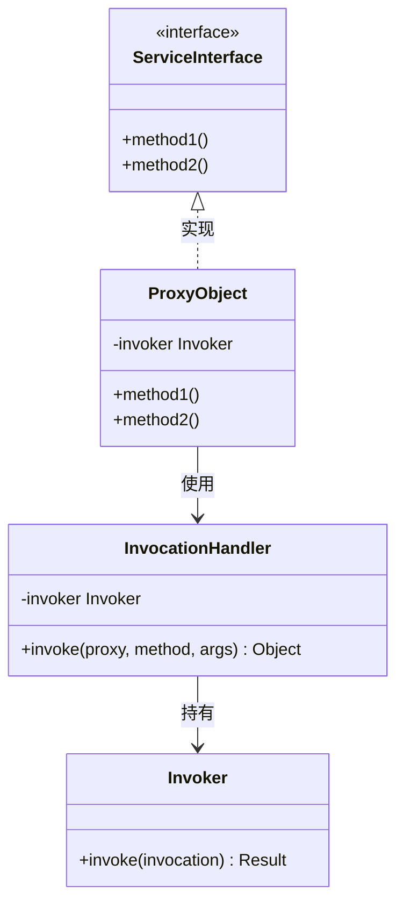
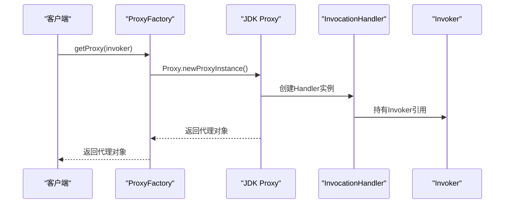
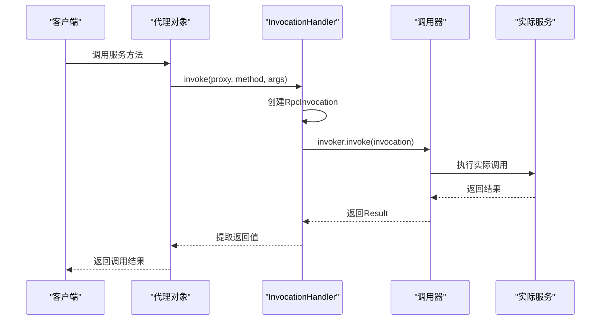
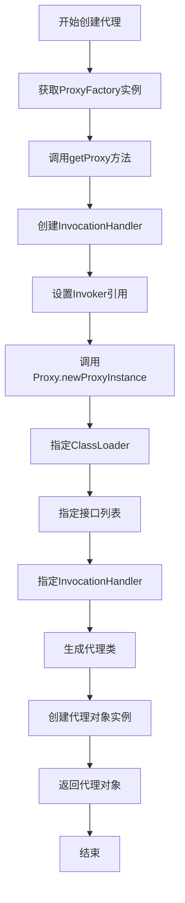
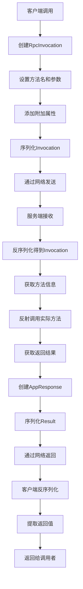
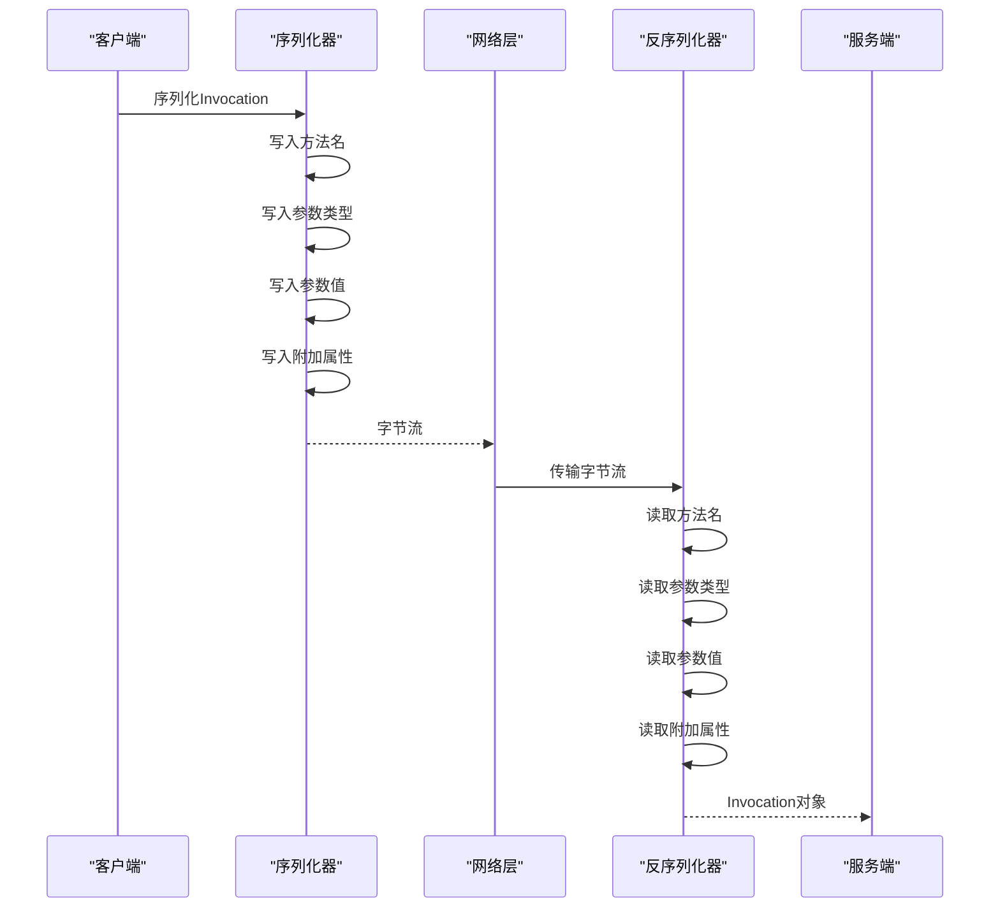

# 代理机制与远程调用

<cite>
**本文档引用的文件**   
- [JdkProxyFactory.java](file://dubbo-rpc\dubbo-rpc-api\src\main\java\org\apache\dubbo\rpc\proxy\jdk\JdkProxyFactory.java)
- [RpcInvocation.java](file://dubbo-rpc\dubbo-rpc-api\src\main\java\org\apache\dubbo\rpc\RpcInvocation.java)
- [Invoker.java](file://dubbo-rpc\dubbo-rpc-api\src\main\java\org\apache\dubbo\rpc\Invoker.java)
</cite>

## 目录
1. [引言](#引言)
2. [代理模式实现](#代理模式实现)
3. [JDK动态代理机制](#jdk动态代理机制)
4. [代理对象创建流程](#代理对象创建流程)
5. [远程调用封装](#远程调用封装)
6. [序列化与网络传输](#序列化与网络传输)
7. [代理使用示例](#代理使用示例)

## 引言

代理机制是Dubbo实现透明RPC调用的关键技术。通过代理模式,客户端可以像调用本地方法一样调用远程服务,而无需关心网络通信、序列化等底层细节。本文档将深入探讨Dubbo的代理机制实现,包括JDK动态代理的使用、代理对象的创建流程以及远程调用的封装过程。

## 代理模式实现

Dubbo使用代理模式来屏蔽远程调用的复杂性,使得调用者无需关心服务的实际位置。无论是本地JVM内的服务还是网络另一端的远程服务,都可以通过相同的接口进行调用。

### 代理模式设计

代理对象作为服务接口的实现,拦截客户端的方法调用,将调用信息封装成Invocation对象,并通过Invoker进行实际的调用。



**代理模式优势**:
- **透明性**: 客户端无需知道服务是本地还是远程
- **简化开发**: 开发者只需关注业务逻辑,无需处理网络通信
- **统一接口**: 本地和远程调用使用相同的API
- **易于扩展**: 可以在代理层添加各种增强功能

## JDK动态代理机制

Dubbo默认使用JDK动态代理来创建服务接口的代理对象。当客户端调用服务接口的方法时,实际执行的是代理对象的逻辑。

### 动态代理创建过程



### 代理调用流程



**调用流程说明**:
1. 客户端通过代理对象调用服务方法
2. 代理对象拦截调用,转发给InvocationHandler
3. InvocationHandler创建RpcInvocation对象,封装方法名、参数等信息
4. InvocationHandler调用Invoker的invoke方法,传入Invocation
5. Invoker执行实际的调用逻辑(本地或远程)
6. 调用结果通过Result对象返回
7. InvocationHandler从Result中提取返回值
8. 代理对象将返回值传递给客户端

**代码来源**:
- [JdkProxyFactory.java](file://dubbo-rpc\dubbo-rpc-api\src\main\java\org\apache\dubbo\rpc\proxy\jdk\JdkProxyFactory.java#L33-L51)

## 代理对象创建流程

代理对象的创建过程涉及ProxyFactory、Invoker和InvocationHandler等多个组件的协同工作。

### 创建流程详解



### 代理工厂实现

```java
public class JdkProxyFactory extends AbstractProxyFactory {
    
    @Override
    @SuppressWarnings("unchecked")
    public <T> T getProxy(Invoker<T> invoker, Class<?>[] interfaces) {
        // 创建InvocationHandler
        InvocationHandler handler = new InvokerInvocationHandler(invoker);
        
        // 使用JDK动态代理创建代理对象
        return (T) Proxy.newProxyInstance(
            Thread.currentThread().getContextClassLoader(),
            interfaces,
            handler
        );
    }
}
```

### InvocationHandler实现

```java
public class InvokerInvocationHandler implements InvocationHandler {
    
    private final Invoker<?> invoker;
    
    public InvokerInvocationHandler(Invoker<?> invoker) {
        this.invoker = invoker;
    }
    
    @Override
    public Object invoke(Object proxy, Method method, Object[] args) throws Throwable {
        // 特殊方法处理
        if (method.getDeclaringClass() == Object.class) {
            return method.invoke(invoker, args);
        }
        
        // 创建RpcInvocation
        RpcInvocation invocation = new RpcInvocation(
            method.getName(),
            method.getParameterTypes(),
            args
        );
        
        // 执行调用
        Result result = invoker.invoke(invocation);
        
        // 返回结果
        return result.recreate();
    }
}
```

**代码来源**:
- [JdkProxyFactory.java](file://dubbo-rpc\dubbo-rpc-api\src\main\java\org\apache\dubbo\rpc\proxy\jdk\JdkProxyFactory.java#L33-L51)

## 远程调用封装

对于远程调用,Invoker会将Invocation对象序列化并通过网络传输到服务提供方。服务提供方接收到请求后,反序列化得到Invocation对象,然后通过反射机制调用实际的服务方法。

### 远程调用流程



### RpcInvocation详解

RpcInvocation是Invocation接口的主要实现,封装了远程调用所需的所有信息:

```java
public class RpcInvocation implements Invocation {
    
    private String methodName;              // 方法名
    private Class<?>[] parameterTypes;      // 参数类型
    private Object[] arguments;             // 参数值
    private Map<String, String> attachments; // 附加属性
    private Invoker<?> invoker;             // 关联的Invoker
    
    // 构造方法
    public RpcInvocation(String methodName, Class<?>[] parameterTypes, Object[] arguments) {
        this.methodName = methodName;
        this.parameterTypes = parameterTypes;
        this.arguments = arguments;
        this.attachments = new HashMap<>();
    }
    
    // 添加附加属性
    public void setAttachment(String key, String value) {
        if (attachments == null) {
            attachments = new HashMap<>();
        }
        attachments.put(key, value);
    }
    
    // 获取附加属性
    public String getAttachment(String key) {
        if (attachments == null) {
            return null;
        }
        return attachments.get(key);
    }
}
```

**接口来源**:
- [RpcInvocation.java](file://dubbo-rpc\dubbo-rpc-api\src\main\java\org\apache\dubbo\rpc\RpcInvocation.java#L58-L899)

## 序列化与网络传输

远程调用需要将Java对象序列化为字节流,通过网络传输到远程服务器,然后反序列化还原为Java对象。

### 序列化流程



### 网络传输层

Dubbo支持多种网络传输协议,包括:
- **Netty**: 高性能异步事件驱动的网络框架(推荐)
- **Mina**: Apache的网络框架
- **HTTP**: 基于HTTP协议的传输

**传输过程**:
1. 客户端将序列化后的数据通过网络发送
2. 服务端接收数据并反序列化
3. 服务端执行方法调用
4. 服务端将结果序列化并返回
5. 客户端接收并反序列化结果

## 代理使用示例

### 基础使用

```java
// 1. 定义服务接口
public interface UserService {
    User getUserById(Long id);
    List<User> getAllUsers();
}

// 2. 获取服务引用(框架会自动创建代理对象)
@Reference
private UserService userService;

// 3. 调用远程服务(就像调用本地方法)
User user = userService.getUserById(1L);
List<User> users = userService.getAllUsers();
```

### 手动创建代理

```java
// 1. 创建URL
URL url = URL.valueOf("dubbo://127.0.0.1:20880/com.example.UserService");

// 2. 获取Protocol实例
Protocol protocol = ExtensionLoader.getExtensionLoader(Protocol.class)
    .getAdaptiveExtension();

// 3. 引用服务,获取Invoker
Invoker<UserService> invoker = protocol.refer(UserService.class, url);

// 4. 获取ProxyFactory实例
ProxyFactory proxyFactory = ExtensionLoader.getExtensionLoader(ProxyFactory.class)
    .getAdaptiveExtension();

// 5. 创建代理对象
UserService userService = proxyFactory.getProxy(invoker);

// 6. 调用服务
User user = userService.getUserById(1L);

// 7. 使用完毕后销毁
invoker.destroy();
```

### 自定义代理工厂

```java
public class CustomProxyFactory extends AbstractProxyFactory {
    
    @Override
    public <T> T getProxy(Invoker<T> invoker, Class<?>[] interfaces) {
        // 自定义代理创建逻辑
        InvocationHandler handler = new CustomInvocationHandler(invoker);
        return (T) Proxy.newProxyInstance(
            Thread.currentThread().getContextClassLoader(),
            interfaces,
            handler
        );
    }
    
    @Override
    public <T> Invoker<T> getInvoker(T proxy, Class<T> type, URL url) {
        // 自定义Invoker创建逻辑
        return new CustomInvoker<>(type, url, proxy);
    }
}

class CustomInvocationHandler implements InvocationHandler {
    
    private final Invoker<?> invoker;
    
    public CustomInvocationHandler(Invoker<?> invoker) {
        this.invoker = invoker;
    }
    
    @Override
    public Object invoke(Object proxy, Method method, Object[] args) throws Throwable {
        // 添加自定义逻辑
        System.out.println("Before invoke: " + method.getName());
        
        // 创建调用上下文
        RpcInvocation invocation = new RpcInvocation(
            method.getName(),
            method.getParameterTypes(),
            args
        );
        
        // 执行调用
        Result result = invoker.invoke(invocation);
        
        // 添加自定义逻辑
        System.out.println("After invoke: " + method.getName());
        
        return result.recreate();
    }
}
```

## 总结

代理机制是Dubbo实现透明RPC调用的核心技术,通过JDK动态代理或其他代理技术,将远程服务包装成本地接口,使得开发者可以像调用本地方法一样调用远程服务。代理对象拦截方法调用,将调用信息封装成Invocation对象,通过Invoker进行序列化和网络传输,最终在服务端反序列化并执行实际的方法调用。

理解代理机制对于深入掌握Dubbo的工作原理至关重要,也是实现自定义扩展和优化的基础。通过自定义ProxyFactory和InvocationHandler,开发者可以在代理层添加各种增强功能,如日志记录、性能监控、参数验证等,进一步提升系统的可维护性和可观测性。
