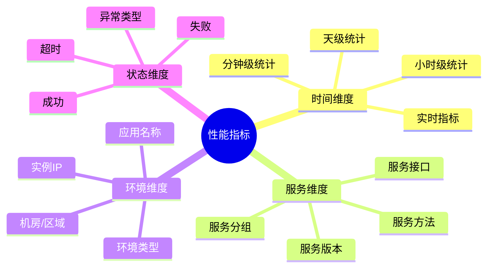
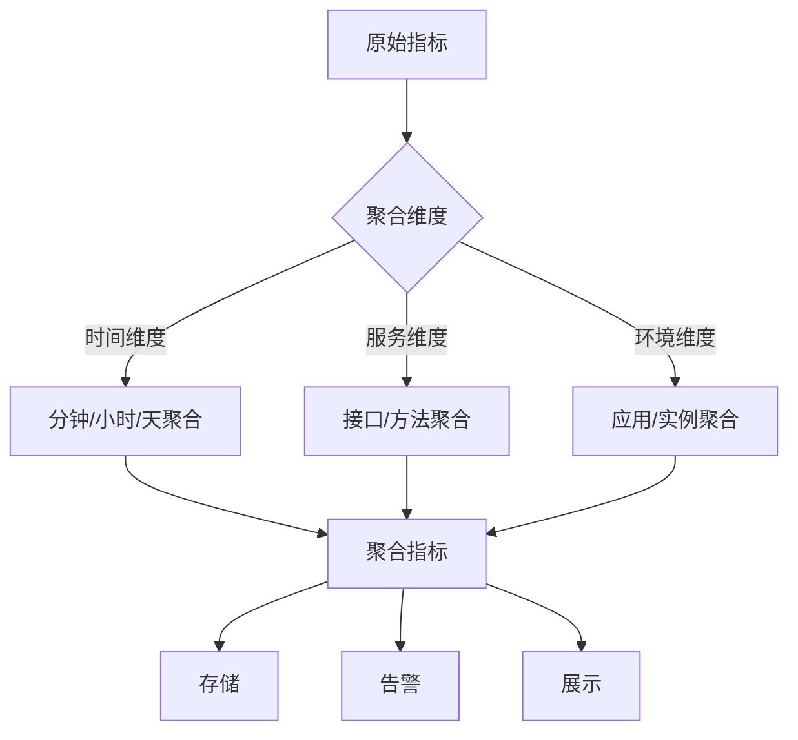

# 性能监控与指标

<cite>
**本文档引用的文件**   
- [MetricsFilter.java](file://dubbo-metrics\dubbo-metrics-default\src\main\java\org\apache\dubbo\metrics\filter\MetricsFilter.java)
- [Filter.java](file://dubbo-rpc\dubbo-rpc-api\src\main\java\org\apache\dubbo\rpc\Filter.java)
- [Result.java](file://dubbo-rpc\dubbo-rpc-api\src\main\java\org\apache\dubbo\rpc\Result.java)
</cite>

## 目录
1. [引言](#引言)
2. [关键性能指标](#关键性能指标)
3. [监控拦截器实现](#监控拦截器实现)
4. [指标收集机制](#指标收集机制)
5. [指标聚合与分析](#指标聚合与分析)
6. [性能数据上报](#性能数据上报)
7. [监控最佳实践](#监控最佳实践)
8. [监控系统集成](#监控系统集成)

## 引言

性能监控是生产环境中不可或缺的功能,通过在调用链中集成监控拦截器,可以收集各种性能指标,及时发现和解决性能问题。Dubbo提供了灵活的监控机制,支持自定义指标收集和多种监控系统集成。本文档将详细介绍如何在调用链中实现性能监控,包括指标定义、收集、聚合和上报等内容。

## 关键性能指标

在分布式RPC调用中,需要关注以下关键性能指标:

### 核心指标分类

| 类别 | 指标 | 说明 | 收集位置 |
|------|------|------|---------|
| **延迟指标** | 调用延迟(RT) | 从发起调用到收到响应的时间 | 消费者端 |
| | P50/P90/P99延迟 | 不同百分位的延迟统计 | 消费者端 |
| | 网络延迟 | 网络传输耗时 | 消费者和提供者端 |
| **吞吐量指标** | TPS | 每秒处理的事务数 | 提供者端 |
| | QPS | 每秒查询数 | 消费者和提供者端 |
| | 并发数 | 同时处理的请求数 | 提供者端 |
| **成功率指标** | 调用成功率 | 成功调用占总调用的比例 | 消费者端 |
| | 错误率 | 失败调用占总调用的比例 | 消费者和提供者端 |
| | 超时率 | 超时调用占总调用的比例 | 消费者端 |
| **资源指标** | CPU使用率 | 处理器资源使用情况 | 提供者端 |
| | 内存使用率 | 内存资源使用情况 | 提供者端 |
| | 线程池状态 | 活跃线程数、队列长度等 | 提供者端 |

### 指标维度

每个指标可以按照以下维度进行细分:



## 监控拦截器实现

监控拦截器是收集性能指标的核心组件,通过在调用链中插入监控逻辑来收集各种指标。

### 基础监控拦截器

```java
@Activate(group = {CONSUMER, PROVIDER})
public class MetricsFilter implements Filter {
    
    private final MetricsCollector collector;
    
    public MetricsFilter() {
        this.collector = new MetricsCollector();
    }
    
    @Override
    public Result invoke(Invoker<?> invoker, Invocation invocation) throws RpcException {
        // 记录开始时间
        long startTime = System.currentTimeMillis();
        String methodName = invocation.getMethodName();
        String serviceName = invoker.getInterface().getName();
        
        // 记录调用开始
        collector.recordRequestStart(serviceName, methodName);
        
        try {
            // 执行实际调用
            Result result = invoker.invoke(invocation);
            
            // 异步处理结果
            result.whenCompleteWithContext((r, throwable) -> {
                long duration = System.currentTimeMillis() - startTime;
                
                if (throwable != null) {
                    // 记录失败指标
                    collector.recordFailure(serviceName, methodName, duration, 
                                          throwable.getClass().getSimpleName());
                } else if (r.hasException()) {
                    // 记录业务异常
                    collector.recordBusinessException(serviceName, methodName, duration,
                                                      r.getException().getClass().getSimpleName());
                } else {
                    // 记录成功指标
                    collector.recordSuccess(serviceName, methodName, duration);
                }
            });
            
            return result;
        } catch (RpcException e) {
            // 记录RPC异常
            long duration = System.currentTimeMillis() - startTime;
            collector.recordRpcException(serviceName, methodName, duration, e.getCode());
            throw e;
        } catch (Exception e) {
            // 记录未知异常
            long duration = System.currentTimeMillis() - startTime;
            collector.recordFailure(serviceName, methodName, duration, 
                                  e.getClass().getSimpleName());
            throw e;
        }
    }
}
```

### 高级监控拦截器

```java
@Activate(group = CONSUMER, order = -7000)
public class AdvancedMetricsFilter implements Filter {
    
    private final Logger logger = LoggerFactory.getLogger(AdvancedMetricsFilter.class);
    private final MetricsRegistry registry;
    private final ConcurrentMap<String, MethodMetrics> metricsCache;
    
    public AdvancedMetricsFilter() {
        this.registry = MetricsRegistry.getInstance();
        this.metricsCache = new ConcurrentHashMap<>();
    }
    
    @Override
    public Result invoke(Invoker<?> invoker, Invocation invocation) throws RpcException {
        // 构建指标Key
        String metricsKey = buildMetricsKey(invoker, invocation);
        MethodMetrics metrics = getOrCreateMetrics(metricsKey);
        
        // 记录并发数
        metrics.incrementConcurrent();
        
        // 记录开始时间(纳秒精度)
        long startTime = System.nanoTime();
        
        try {
            Result result = invoker.invoke(invocation);
            
            // 处理异步结果
            return result.whenCompleteWithContext((r, throwable) -> {
                long duration = System.nanoTime() - startTime;
                
                // 减少并发数
                metrics.decrementConcurrent();
                
                if (throwable != null || (r != null && r.hasException())) {
                    // 记录失败
                    metrics.recordFailure(duration);
                    
                    // 判断是否超时
                    int timeout = getTimeout(invoker, invocation);
                    if (duration > timeout * 1_000_000L) { // 转换为纳秒
                        metrics.recordTimeout();
                    }
                } else {
                    // 记录成功
                    metrics.recordSuccess(duration);
                }
                
                // 定期上报指标
                if (shouldReport(metrics)) {
                    reportMetrics(metricsKey, metrics);
                }
            });
        } catch (Exception e) {
            metrics.decrementConcurrent();
            metrics.recordFailure(System.nanoTime() - startTime);
            throw e;
        }
    }
    
    private String buildMetricsKey(Invoker<?> invoker, Invocation invocation) {
        return String.format("%s.%s.%s",
            invoker.getUrl().getParameter(APPLICATION_KEY),
            invoker.getInterface().getName(),
            invocation.getMethodName());
    }
    
    private MethodMetrics getOrCreateMetrics(String key) {
        return metricsCache.computeIfAbsent(key, k -> new MethodMetrics());
    }
    
    private int getTimeout(Invoker<?> invoker, Invocation invocation) {
        return invoker.getUrl().getMethodParameter(
            invocation.getMethodName(), TIMEOUT_KEY, DEFAULT_TIMEOUT);
    }
    
    private boolean shouldReport(MethodMetrics metrics) {
        // 每收集1000次调用上报一次
        return metrics.getTotalCount() % 1000 == 0;
    }
    
    private void reportMetrics(String key, MethodMetrics metrics) {
        try {
            registry.report(key, metrics.snapshot());
        } catch (Exception e) {
            logger.error("上报指标失败: " + key, e);
        }
    }
}
```

**代码来源**:
- [MetricsFilter.java](file://dubbo-metrics\dubbo-metrics-default\src\main\java\org\apache\dubbo\metrics\filter\MetricsFilter.java)

## 指标收集机制

指标收集需要考虑性能影响和数据准确性,采用合适的数据结构和算法至关重要。

### 指标数据模型

```java
public class MethodMetrics {
    
    // 并发数(原子操作)
    private final AtomicInteger concurrentCount = new AtomicInteger(0);
    
    // 总调用次数
    private final LongAdder totalCount = new LongAdder();
    
    // 成功次数
    private final LongAdder successCount = new LongAdder();
    
    // 失败次数
    private final LongAdder failureCount = new LongAdder();
    
    // 超时次数
    private final LongAdder timeoutCount = new LongAdder();
    
    // 延迟统计(使用HdrHistogram)
    private final Histogram latencyHistogram;
    
    // 最近一次调用时间
    private volatile long lastInvokeTime;
    
    public MethodMetrics() {
        // 创建高精度直方图,记录1ns到1分钟的延迟
        this.latencyHistogram = new Histogram(
            TimeUnit.NANOSECONDS.toNanos(1),
            TimeUnit.MINUTES.toNanos(1),
            3  // 3位有效数字
        );
    }
    
    // 增加并发数
    public void incrementConcurrent() {
        concurrentCount.incrementAndGet();
    }
    
    // 减少并发数
    public void decrementConcurrent() {
        concurrentCount.decrementAndGet();
    }
    
    // 记录成功调用
    public void recordSuccess(long durationNanos) {
        totalCount.increment();
        successCount.increment();
        latencyHistogram.recordValue(durationNanos);
        lastInvokeTime = System.currentTimeMillis();
    }
    
    // 记录失败调用
    public void recordFailure(long durationNanos) {
        totalCount.increment();
        failureCount.increment();
        latencyHistogram.recordValue(durationNanos);
        lastInvokeTime = System.currentTimeMillis();
    }
    
    // 记录超时
    public void recordTimeout() {
        timeoutCount.increment();
    }
    
    // 获取快照
    public MetricsSnapshot snapshot() {
        MetricsSnapshot snapshot = new MetricsSnapshot();
        snapshot.setConcurrentCount(concurrentCount.get());
        snapshot.setTotalCount(totalCount.sum());
        snapshot.setSuccessCount(successCount.sum());
        snapshot.setFailureCount(failureCount.sum());
        snapshot.setTimeoutCount(timeoutCount.sum());
        snapshot.setLastInvokeTime(lastInvokeTime);
        
        // 计算百分位延迟
        snapshot.setP50(latencyHistogram.getValueAtPercentile(50.0));
        snapshot.setP90(latencyHistogram.getValueAtPercentile(90.0));
        snapshot.setP99(latencyHistogram.getValueAtPercentile(99.0));
        snapshot.setMax(latencyHistogram.getMaxValue());
        snapshot.setMean(latencyHistogram.getMean());
        
        return snapshot;
    }
    
    public long getTotalCount() {
        return totalCount.sum();
    }
}
```

### 时间窗口统计

```java
public class SlidingWindowMetrics {
    
    private final int windowSizeSeconds;
    private final int bucketCount;
    private final Bucket[] buckets;
    private final AtomicInteger currentBucketIndex;
    
    public SlidingWindowMetrics(int windowSizeSeconds, int bucketCount) {
        this.windowSizeSeconds = windowSizeSeconds;
        this.bucketCount = bucketCount;
        this.buckets = new Bucket[bucketCount];
        this.currentBucketIndex = new AtomicInteger(0);
        
        // 初始化桶
        for (int i = 0; i < bucketCount; i++) {
            buckets[i] = new Bucket();
        }
        
        // 启动桶轮换定时任务
        startBucketRotation();
    }
    
    public void recordSuccess(long duration) {
        getCurrentBucket().recordSuccess(duration);
    }
    
    public void recordFailure(long duration) {
        getCurrentBucket().recordFailure(duration);
    }
    
    public MetricsSnapshot getSnapshot() {
        // 聚合所有桶的数据
        MetricsSnapshot snapshot = new MetricsSnapshot();
        long totalSuccess = 0;
        long totalFailure = 0;
        List<Long> allDurations = new ArrayList<>();
        
        for (Bucket bucket : buckets) {
            totalSuccess += bucket.getSuccessCount();
            totalFailure += bucket.getFailureCount();
            allDurations.addAll(bucket.getDurations());
        }
        
        snapshot.setSuccessCount(totalSuccess);
        snapshot.setFailureCount(totalFailure);
        snapshot.setTotalCount(totalSuccess + totalFailure);
        
        // 计算百分位
        if (!allDurations.isEmpty()) {
            Collections.sort(allDurations);
            int size = allDurations.size();
            snapshot.setP50(allDurations.get(size / 2));
            snapshot.setP90(allDurations.get((int)(size * 0.9)));
            snapshot.setP99(allDurations.get((int)(size * 0.99)));
        }
        
        return snapshot;
    }
    
    private Bucket getCurrentBucket() {
        int index = currentBucketIndex.get() % bucketCount;
        return buckets[index];
    }
    
    private void startBucketRotation() {
        int intervalMs = (windowSizeSeconds * 1000) / bucketCount;
        ScheduledExecutorService scheduler = Executors.newScheduledThreadPool(1);
        
        scheduler.scheduleAtFixedRate(() -> {
            // 轮换到下一个桶
            int nextIndex = currentBucketIndex.incrementAndGet() % bucketCount;
            // 清空新的当前桶
            buckets[nextIndex].reset();
        }, intervalMs, intervalMs, TimeUnit.MILLISECONDS);
    }
    
    static class Bucket {
        private final LongAdder successCount = new LongAdder();
        private final LongAdder failureCount = new LongAdder();
        private final List<Long> durations = new CopyOnWriteArrayList<>();
        
        public void recordSuccess(long duration) {
            successCount.increment();
            durations.add(duration);
        }
        
        public void recordFailure(long duration) {
            failureCount.increment();
            durations.add(duration);
        }
        
        public void reset() {
            successCount.reset();
            failureCount.reset();
            durations.clear();
        }
        
        public long getSuccessCount() {
            return successCount.sum();
        }
        
        public long getFailureCount() {
            return failureCount.sum();
        }
        
        public List<Long> getDurations() {
            return new ArrayList<>(durations);
        }
    }
}
```

## 指标聚合与分析

收集的原始指标需要进行聚合和分析,才能生成有价值的监控数据。

### 聚合策略



### 聚合实现

```java
public class MetricsAggregator {
    
    private final ConcurrentMap<String, MethodMetrics> metricsMap;
    private final ScheduledExecutorService scheduler;
    
    public MetricsAggregator() {
        this.metricsMap = new ConcurrentHashMap<>();
        this.scheduler = Executors.newScheduledThreadPool(1);
        startAggregation();
    }
    
    public void record(String key, boolean success, long duration) {
        MethodMetrics metrics = metricsMap.computeIfAbsent(key, 
            k -> new MethodMetrics());
        
        if (success) {
            metrics.recordSuccess(duration);
        } else {
            metrics.recordFailure(duration);
        }
    }
    
    private void startAggregation() {
        // 每分钟执行一次聚合
        scheduler.scheduleAtFixedRate(this::aggregate, 1, 1, TimeUnit.MINUTES);
    }
    
    private void aggregate() {
        Map<String, MetricsSnapshot> snapshots = new HashMap<>();
        
        // 收集所有快照
        metricsMap.forEach((key, metrics) -> {
            snapshots.put(key, metrics.snapshot());
        });
        
        // 按服务维度聚合
        Map<String, ServiceMetrics> serviceMetrics = aggregateByService(snapshots);
        
        // 按应用维度聚合
        Map<String, AppMetrics> appMetrics = aggregateByApplication(snapshots);
        
        // 上报聚合后的指标
        reportAggregatedMetrics(serviceMetrics, appMetrics);
    }
    
    private Map<String, ServiceMetrics> aggregateByService(
            Map<String, MetricsSnapshot> snapshots) {
        Map<String, ServiceMetrics> result = new HashMap<>();
        
        snapshots.forEach((key, snapshot) -> {
            String serviceName = extractServiceName(key);
            ServiceMetrics sm = result.computeIfAbsent(serviceName,
                k -> new ServiceMetrics());
            sm.merge(snapshot);
        });
        
        return result;
    }
    
    private String extractServiceName(String key) {
        // key格式: app.service.method
        String[] parts = key.split("\\.");
        return parts.length >= 2 ? parts[1] : key;
    }
}
```

## 性能数据上报

指标数据需要上报到监控系统进行存储、展示和告警。

### 上报机制

```java
public class MetricsReporter {
    
    private final Logger logger = LoggerFactory.getLogger(MetricsReporter.class);
    private final MetricsRegistry registry;
    private final BlockingQueue<MetricsData> reportQueue;
    private final ExecutorService reportExecutor;
    
    public MetricsReporter(MetricsRegistry registry) {
        this.registry = registry;
        this.reportQueue = new LinkedBlockingQueue<>(10000);
        this.reportExecutor = Executors.newFixedThreadPool(2);
        startReporting();
    }
    
    public void report(String key, MetricsSnapshot snapshot) {
        MetricsData data = new MetricsData(key, snapshot, System.currentTimeMillis());
        
        // 异步入队,避免阻塞调用链
        if (!reportQueue.offer(data)) {
            logger.warn("指标上报队列已满,丢弃数据: " + key);
        }
    }
    
    private void startReporting() {
        // 启动多个消费线程
        for (int i = 0; i < 2; i++) {
            reportExecutor.submit(this::consumeAndReport);
        }
    }
    
    private void consumeAndReport() {
        while (!Thread.currentThread().isInterrupted()) {
            try {
                MetricsData data = reportQueue.poll(1, TimeUnit.SECONDS);
                if (data != null) {
                    doReport(data);
                }
            } catch (InterruptedException e) {
                Thread.currentThread().interrupt();
                break;
            } catch (Exception e) {
                logger.error("上报指标失败", e);
            }
        }
    }
    
    private void doReport(MetricsData data) {
        // 上报到注册中心
        registry.register(data.getKey(), data.getSnapshot());
        
        // 可以同时上报到多个监控系统
        reportToPrometheus(data);
        reportToInfluxDB(data);
    }
    
    private void reportToPrometheus(MetricsData data) {
        // Prometheus上报逻辑
    }
    
    private void reportToInfluxDB(MetricsData data) {
        // InfluxDB上报逻辑
    }
}
```

## 监控最佳实践

### 1. 采样策略

对于高QPS服务,全量收集指标会带来性能开销,可以采用采样策略:

```java
public class SamplingMetricsFilter implements Filter {
    
    private final AtomicLong counter = new AtomicLong(0);
    private final int samplingRate; // 采样率,如100表示每100次采样1次
    
    public SamplingMetricsFilter(int samplingRate) {
        this.samplingRate = samplingRate;
    }
    
    @Override
    public Result invoke(Invoker<?> invoker, Invocation invocation) throws RpcException {
        boolean shouldSample = (counter.incrementAndGet() % samplingRate == 0);
        
        if (shouldSample) {
            // 执行完整的监控逻辑
            return invokeWithMetrics(invoker, invocation);
        } else {
            // 跳过监控,直接调用
            return invoker.invoke(invocation);
        }
    }
}
```

### 2. 异步处理

避免监控逻辑阻塞主调用链:

```java
@Override
public Result invoke(Invoker<?> invoker, Invocation invocation) throws RpcException {
    Result result = invoker.invoke(invocation);
    
    // 使用异步回调处理指标
    result.whenCompleteWithContext((r, t) -> {
        CompletableFuture.runAsync(() -> {
            collectMetrics(invocation, r, t);
        }, metricsExecutor);
    });
    
    return result;
}
```

### 3. 资源限制

限制监控占用的资源:

```java
public class ResourceLimitedMetricsCollector {
    
    // 限制内存中保存的指标数量
    private final Cache<String, MethodMetrics> metricsCache = 
        CacheBuilder.newBuilder()
            .maximumSize(10000)
            .expireAfterAccess(1, TimeUnit.HOURS)
            .build();
    
    // 限制上报队列大小
    private final BlockingQueue<MetricsData> queue = 
        new LinkedBlockingQueue<>(5000);
}
```

## 监控系统集成

### Prometheus集成

```java
@Activate(group = {CONSUMER, PROVIDER})
public class PrometheusMetricsFilter implements Filter {
    
    private final Counter requestsTotal;
    private final Counter requestsSuccess;
    private final Counter requestsFailure;
    private final Histogram requestDuration;
    
    public PrometheusMetricsFilter() {
        // 注册Prometheus指标
        this.requestsTotal = Counter.build()
            .name("dubbo_requests_total")
            .help("Total requests")
            .labelNames("service", "method", "side")
            .register();
            
        this.requestsSuccess = Counter.build()
            .name("dubbo_requests_success")
            .help("Success requests")
            .labelNames("service", "method", "side")
            .register();
            
        this.requestsFailure = Counter.build()
            .name("dubbo_requests_failure")
            .help("Failed requests")
            .labelNames("service", "method", "side")
            .register();
            
        this.requestDuration = Histogram.build()
            .name("dubbo_request_duration_seconds")
            .help("Request duration in seconds")
            .labelNames("service", "method", "side")
            .buckets(0.001, 0.005, 0.01, 0.05, 0.1, 0.5, 1, 5)
            .register();
    }
    
    @Override
    public Result invoke(Invoker<?> invoker, Invocation invocation) throws RpcException {
        String service = invoker.getInterface().getName();
        String method = invocation.getMethodName();
        String side = invoker.getUrl().getParameter(SIDE_KEY);
        
        Timer.Sample sample = Timer.start();
        
        try {
            Result result = invoker.invoke(invocation);
            
            result.whenCompleteWithContext((r, t) -> {
                double duration = sample.stop(Timer.builder("")
                    .register(new SimpleMeterRegistry()));
                
                requestsTotal.labels(service, method, side).inc();
                
                if (t == null && !r.hasException()) {
                    requestsSuccess.labels(service, method, side).inc();
                } else {
                    requestsFailure.labels(service, method, side).inc();
                }
                
                requestDuration.labels(service, method, side).observe(duration);
            });
            
            return result;
        } catch (Exception e) {
            requestsTotal.labels(service, method, side).inc();
            requestsFailure.labels(service, method, side).inc();
            throw e;
        }
    }
}
```

## 总结

性能监控是保障分布式系统稳定运行的重要手段。通过在Dubbo调用链中集成监控拦截器,可以:

1. **实时掌握系统状态**: 收集关键性能指标,了解系统运行情况
2. **快速定位问题**: 通过监控数据快速发现和定位性能瓶颈
3. **支持容量规划**: 基于历史数据进行容量评估和规划
4. **提供告警依据**: 设置告警阈值,及时发现异常情况

在实现监控时,需要平衡监控的全面性和性能开销,采用合适的采样策略、异步处理和资源限制,确保监控不会对业务造成负面影响。同时,选择合适的监控系统进行集成,如Prometheus、Grafana等,可以更好地展示和分析监控数据。
