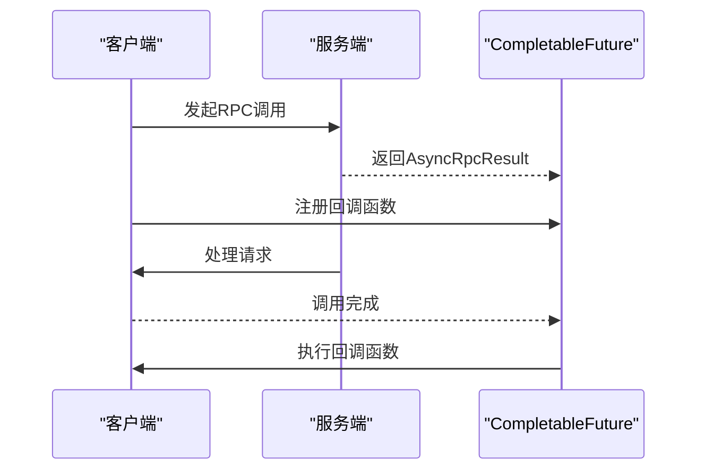
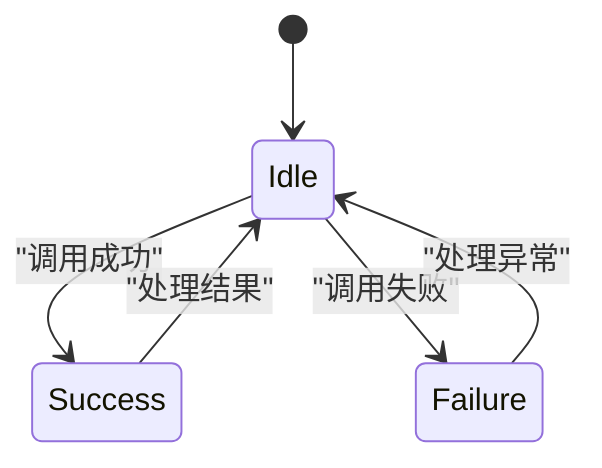
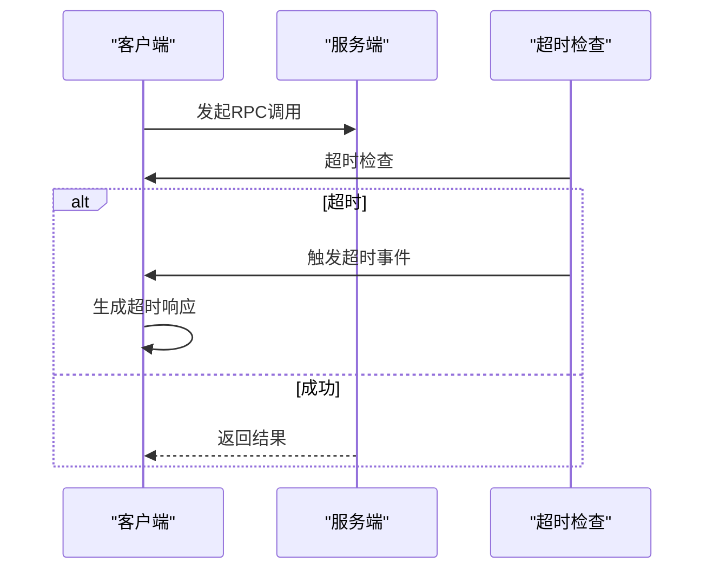
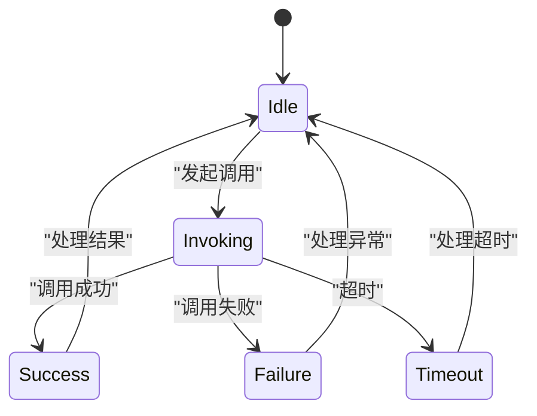

# 结果处理机制

<cite>
**Referenced Files in This Document**   
- [Result.java](file://dubbo-compatible\src\main\java\com\alibaba\dubbo\rpc\Result.java)
- [Result.java](file://dubbo-rpc\dubbo-rpc-api\src\main\java\org\apache\dubbo\rpc\Result.java)
- [AppResponse.java](file://dubbo-rpc\dubbo-rpc-api\src\main\java\org\apache\dubbo\rpc\AppResponse.java)
- [AsyncRpcResult.java](file://dubbo-rpc\dubbo-rpc-api\src\main\java\org\apache\dubbo\rpc\AsyncRpcResult.java)
</cite>

## 目录
1. [引言](#引言)
2. [Result接口设计与核心方法](#result接口设计与核心方法)
3. [异步回调实现机制](#异步回调实现机制)
4. [成功响应与异常处理](#成功响应与异常处理)
5. [超时处理与重试机制](#超时处理与重试机制)
6. [结果处理示例](#结果处理示例)
7. [自定义Result实现](#自定义result实现)
8. [状态机图](#状态机图)
9. [性能监控指标](#性能监控指标)
10. [结论](#结论)

## 引言
结果处理机制是Dubbo框架中RPC调用的核心组成部分，负责封装和传递远程调用的结果。Result接口作为结果处理的抽象，定义了获取调用结果、异常信息和附加属性的方法。本文档详细介绍了Result接口的设计和实现，包括核心方法的作用、异步回调的实现机制、成功响应和异常处理的不同表现，以及超时处理和重试机制。此外，还为初学者提供了简单的结果处理示例，并为经验丰富的开发者提供了自定义Result的实现方法。

## Result接口设计与核心方法
Result接口是Dubbo框架中用于表示RPC调用结果的核心接口。它定义了一系列方法，用于获取调用结果、异常信息和附加属性。以下是Result接口中的一些核心方法：

- **getValue()**: 获取调用结果。如果调用成功，返回结果对象；如果调用失败，返回null。
- **getException()**: 获取调用过程中抛出的异常。如果调用成功，返回null。
- **getAttachments()**: 获取调用的附加属性。这些属性可以用于传递额外的信息，如上下文信息、元数据等。
- **hasException()**: 判断调用是否抛出了异常。如果调用成功，返回false；如果调用失败，返回true。
- **recreate()**: 重新创建调用结果。如果调用成功，返回结果对象；如果调用失败，抛出异常。

这些方法共同构成了Result接口的基础，使得开发者可以方便地处理RPC调用的结果。

**Section sources**
- [Result.java](file://dubbo-rpc\dubbo-rpc-api\src\main\java\org\apache\dubbo\rpc\Result.java)

## 异步回调实现机制
在Dubbo框架中，异步调用是通过`AsyncRpcResult`类实现的。`AsyncRpcResult`实现了`CompletionStage`接口，允许开发者使用异步编程模型来处理RPC调用结果。当一个RPC调用被发起时，`AsyncRpcResult`会立即返回一个`CompletableFuture`对象，该对象代表了尚未完成的调用。开发者可以通过注册回调函数来处理调用完成后的结果或异常。



**Diagram sources**
- [AsyncRpcResult.java](file://dubbo-rpc\dubbo-rpc-api\src\main\java\org\apache\dubbo\rpc\AsyncRpcResult.java)

## 成功响应与异常处理
在Dubbo框架中，成功响应和异常处理是通过`AppResponse`类实现的。`AppResponse`是`Result`接口的一个具体实现，用于封装调用结果和异常信息。

- **成功响应**: 当RPC调用成功时，`AppResponse`的`value`字段会被设置为调用结果，`exception`字段为null。开发者可以通过`getValue()`方法获取调用结果。
- **异常处理**: 当RPC调用失败时，`AppResponse`的`value`字段为null，`exception`字段会被设置为抛出的异常。开发者可以通过`getException()`方法获取异常信息，并进行相应的处理。



**Diagram sources**
- [AppResponse.java](file://dubbo-rpc\dubbo-rpc-api\src\main\java\org\apache\dubbo\rpc\AppResponse.java)

## 超时处理与重试机制
在分布式系统中，网络延迟和故障是常见的问题。为了提高系统的可靠性和可用性，Dubbo框架提供了超时处理和重试机制。

- **超时处理**: 当RPC调用超过预设的超时时间时，`DefaultFuture`会触发超时事件，生成一个超时响应。超时响应的状态码为`Response.CLIENT_TIMEOUT`或`Response.SERVER_TIMEOUT`，具体取决于超时发生在客户端还是服务端。
- **重试机制**: 当RPC调用失败时，Dubbo框架可以根据配置的重试策略进行重试。重试策略可以通过`FailoverClusterInvoker`等集群调用器实现。重试次数和重试间隔可以通过配置文件进行设置。



**Diagram sources**
- [DefaultFuture.java](file://dubbo-remoting\dubbo-remoting-api\src\main\java\org\apache\dubbo\remoting\exchange\support\DefaultFuture.java)

## 结果处理示例
以下是一个简单的结果处理示例，展示了如何使用`Result`接口处理RPC调用结果：

```java
// 发起RPC调用
Result result = invoker.invoke(invocation);

// 检查是否有异常
if (result.hasException()) {
    // 处理异常
    Throwable exception = result.getException();
    System.err.println("调用失败: " + exception.getMessage());
} else {
    // 处理成功结果
    Object value = result.getValue();
    System.out.println("调用成功: " + value);
}
```

**Section sources**
- [Result.java](file://dubbo-rpc\dubbo-rpc-api\src\main\java\org\apache\dubbo\rpc\Result.java)

## 自定义Result实现
对于需要更复杂结果处理逻辑的场景，开发者可以自定义`Result`接口的实现。自定义`Result`实现可以继承`AppResponse`类或直接实现`Result`接口。以下是一个自定义`Result`实现的示例：

```java
public class CustomResult implements Result {
    private Object value;
    private Throwable exception;
    private Map<String, Object> attachments;

    public CustomResult(Object value) {
        this.value = value;
    }

    public CustomResult(Throwable exception) {
        this.exception = exception;
    }

    @Override
    public Object getValue() {
        return value;
    }

    @Override
    public void setValue(Object value) {
        this.value = value;
    }

    @Override
    public Throwable getException() {
        return exception;
    }

    @Override
    public void setException(Throwable t) {
        this.exception = t;
    }

    @Override
    public boolean hasException() {
        return exception != null;
    }

    @Override
    public Object recreate() throws Throwable {
        if (hasException()) {
            throw getException();
        } else {
            return getValue();
        }
    }

    @Override
    public Map<String, String> getAttachments() {
        return new AttachmentsAdapter.ObjectToStringMap(attachments);
    }

    @Override
    public void setAttachments(Map<String, String> map) {
        this.attachments = map == null ? new HashMap<>() : new HashMap<>(map);
    }

    @Override
    public void addObjectAttachments(Map<String, Object> map) {
        if (map == null) {
            return;
        }
        if (this.attachments == null) {
            this.attachments = new HashMap<>(map.size());
        }
        this.attachments.putAll(map);
    }

    @Override
    public String getAttachment(String key) {
        Object value = attachments.get(key);
        if (value instanceof String) {
            return (String) value;
        }
        return null;
    }

    @Override
    public Object getObjectAttachment(String key) {
        return attachments.get(key);
    }

    @Override
    public String getAttachment(String key, String defaultValue) {
        Object result = attachments.get(key);
        if (result == null) {
            return defaultValue;
        }
        if (result instanceof String) {
            return (String) result;
        }
        return defaultValue;
    }

    @Override
    public Object getObjectAttachment(String key, Object defaultValue) {
        Object result = attachments.get(key);
        if (result == null) {
            result = defaultValue;
        }
        return result;
    }

    @Override
    public void setAttachment(String key, String value) {
        setObjectAttachment(key, value);
    }

    @Override
    public void setAttachment(String key, Object value) {
        setObjectAttachment(key, value);
    }

    @Override
    public void setObjectAttachment(String key, Object value) {
        attachments.put(key, value);
    }
}
```

**Section sources**
- [Result.java](file://dubbo-rpc\dubbo-rpc-api\src\main\java\org\apache\dubbo\rpc\Result.java)

## 状态机图
以下是Result接口的状态机图，展示了调用过程中可能的状态转换：



**Diagram sources**
- [Result.java](file://dubbo-rpc\dubbo-rpc-api\src\main\java\org\apache\dubbo\rpc\Result.java)

## 性能监控指标
为了监控RPC调用的性能，Dubbo框架提供了一系列性能监控指标。这些指标可以帮助开发者了解调用的响应时间、成功率、失败率等信息。以下是一些常用的性能监控指标：

- **响应时间**: 记录每次RPC调用的响应时间，用于评估服务的性能。
- **成功率**: 记录成功调用的比例，用于评估服务的稳定性。
- **失败率**: 记录失败调用的比例，用于评估服务的可靠性。
- **超时率**: 记录超时调用的比例，用于评估网络状况和服务负载。

这些指标可以通过Dubbo的监控模块进行收集和展示，帮助开发者及时发现和解决问题。

**Section sources**
- [MetricsFilter.java](file://dubbo-metrics\dubbo-metrics-default\src\main\java\org\apache\dubbo\metrics\filter\MetricsFilter.java)

## 结论
结果处理机制是Dubbo框架中RPC调用的核心组成部分，通过`Result`接口和相关实现类，提供了灵活且强大的结果处理能力。本文档详细介绍了Result接口的设计和实现，包括核心方法的作用、异步回调的实现机制、成功响应和异常处理的不同表现，以及超时处理和重试机制。希望本文档能帮助开发者更好地理解和使用Dubbo框架的结果处理机制。