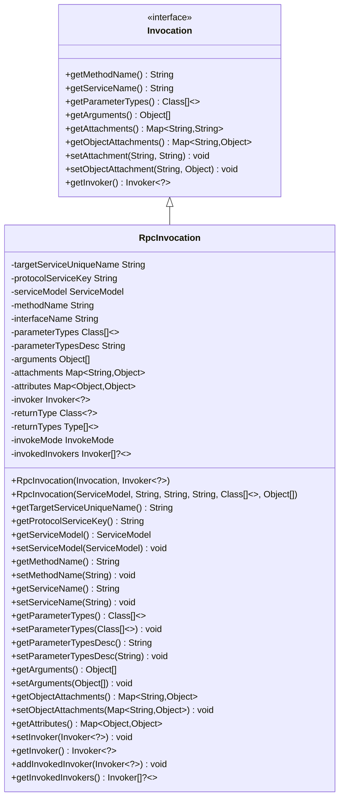
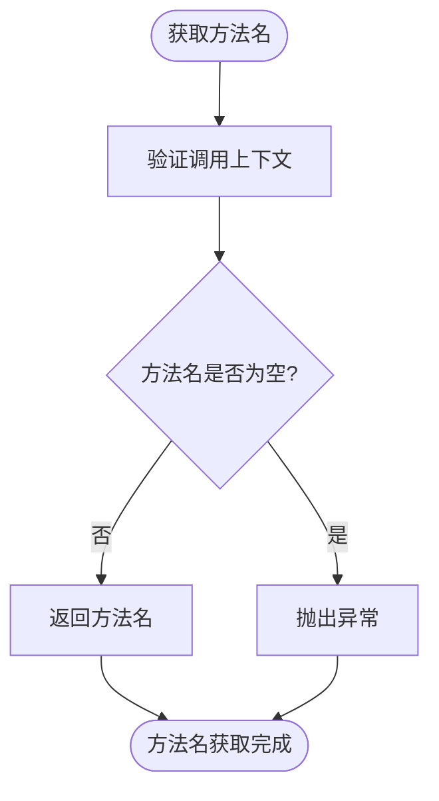
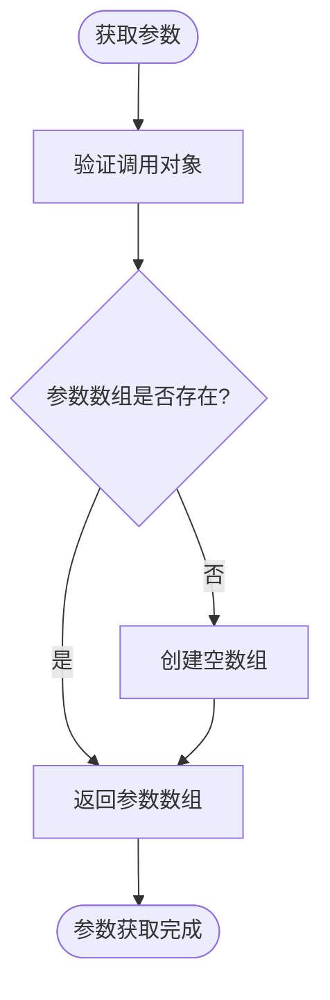
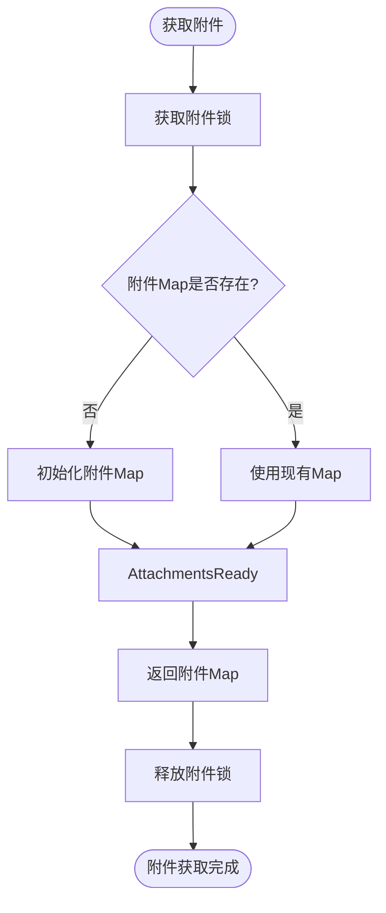
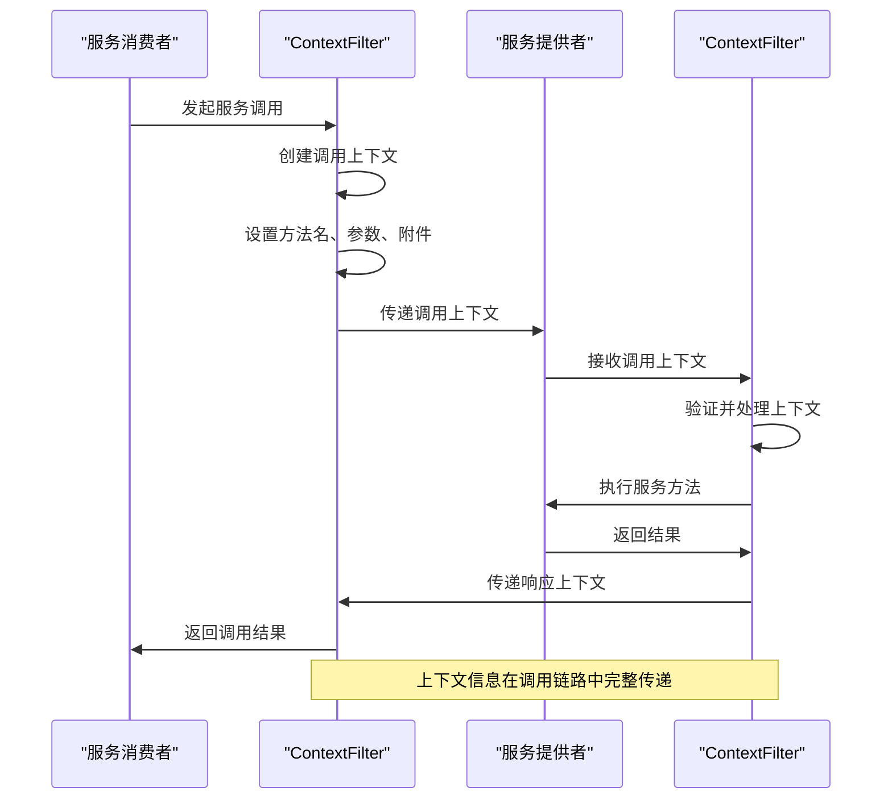
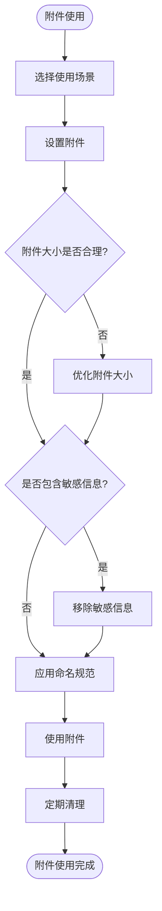
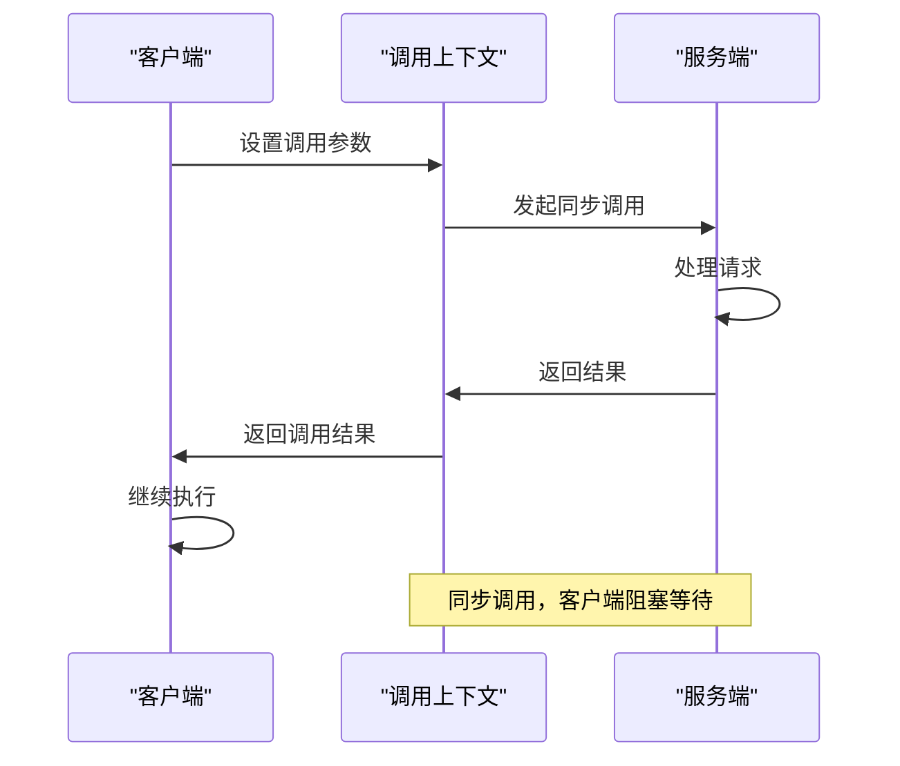
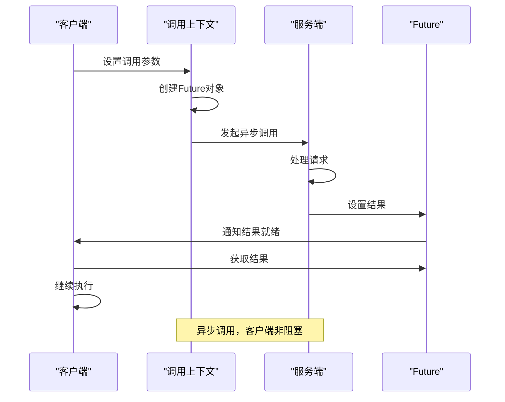
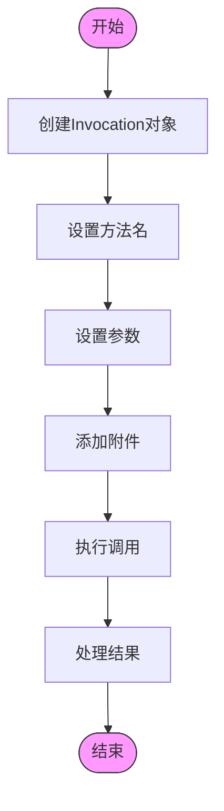
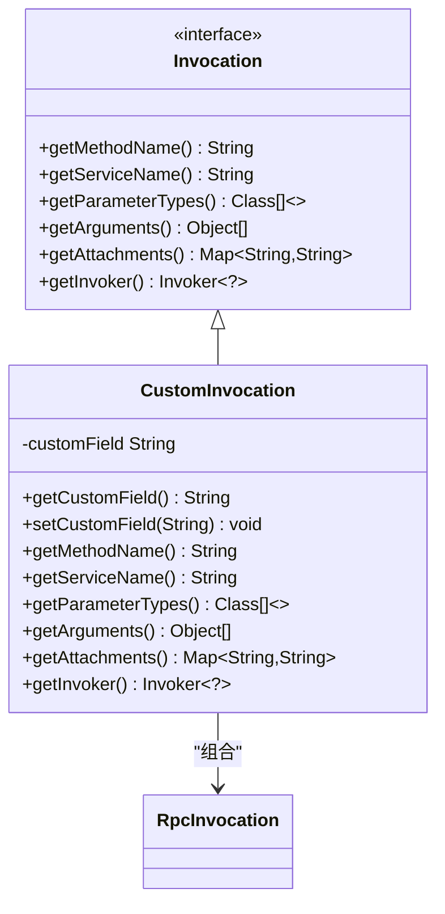

# 调用上下文

<cite>
**本文档引用文件**   
- [Invocation.java](file://dubbo-rpc\dubbo-rpc-api\src\main\java\org\apache\dubbo\rpc\Invocation.java)
- [RpcInvocation.java](file://dubbo-rpc\dubbo-rpc-api\src\main\java\org\apache\dubbo\rpc\RpcInvocation.java)
- [RpcContext.java](file://dubbo-rpc\dubbo-rpc-api\src\main\java\org\apache\dubbo\rpc\RpcContext.java)
- [RpcServiceContext.java](file://dubbo-rpc\dubbo-rpc-api\src\main\java\org\apache\dubbo\rpc\RpcServiceContext.java)
- [ContextFilter.java](file://dubbo-rpc\dubbo-rpc-api\src\main\java\org\apache\dubbo\rpc\filter\ContextFilter.java)
- [RpcContextTest.java](file://dubbo-rpc\dubbo-rpc-api\src\main\java\org\apache\dubbo\rpc\RpcContextTest.java)
</cite>

## 目录
1. [调用上下文概述](#调用上下文概述)
2. [Invocation接口设计](#invocation接口设计)
3. [核心方法详解](#核心方法详解)
4. [调用上下文传递机制](#调用上下文传递机制)
5. [Attachments附件使用](#attachments附件使用)
6. [同步与异步调用处理](#同步与异步调用处理)
7. [使用示例](#使用示例)
8. [调用上下文数据流图](#调用上下文数据流图)

## 调用上下文概述

调用上下文是Dubbo框架中用于在服务调用过程中传递上下文信息的核心机制。它通过Invocation接口和RpcContext类实现，为服务调用提供了方法名、参数、附件等关键信息的传递能力。调用上下文在分布式系统中扮演着重要角色，确保了服务调用链路中信息的完整传递和上下文的一致性。

调用上下文主要由两部分组成：Invocation接口和RpcContext类。Invocation接口定义了服务调用的基本信息，包括方法名、参数类型、参数值和附件等。RpcContext类则提供了线程本地的上下文管理，确保在多线程环境下上下文信息的隔离和正确传递。

**Section sources**
- [Invocation.java](file://dubbo-rpc\dubbo-rpc-api\src\main\java\org\apache\dubbo\rpc\Invocation.java#L30-L36)
- [RpcContext.java](file://dubbo-rpc\dubbo-rpc-api\src\main\java\org\apache\dubbo\rpc\RpcContext.java#L32-L47)

## Invocation接口设计

Invocation接口是Dubbo中服务调用的核心抽象，定义了服务调用所需的基本信息。该接口作为服务调用的载体，封装了方法调用的所有必要信息，包括方法名、参数类型、参数值和附件等。RpcInvocation是其主要实现类，提供了具体的功能实现。

Invocation接口的设计遵循了简洁性和扩展性的原则，通过接口定义了服务调用的基本契约，而具体的实现则由RpcInvocation类完成。这种设计模式使得框架具有良好的灵活性和可扩展性，能够适应不同的使用场景和需求。



**Diagram sources **
- [Invocation.java](file://dubbo-rpc\dubbo-rpc-api\src\main\java\org\apache\dubbo\rpc\Invocation.java#L37-L182)
- [RpcInvocation.java](file://dubbo-rpc\dubbo-rpc-api\src\main\java\org\apache\dubbo\rpc\RpcInvocation.java#L58-L899)

## 核心方法详解

### getMethodName()方法

getMethodName()方法用于获取服务调用的方法名。这是Invocation接口中最基本的方法之一，返回当前调用的方法名称字符串。该方法在服务路由、负载均衡和监控等场景中发挥着重要作用，是识别具体服务方法的关键标识。



**Section sources**
- [Invocation.java](file://dubbo-rpc\dubbo-rpc-api\src\main\java\org\apache\dubbo\rpc\Invocation.java#L43-L49)
- [RpcInvocation.java](file://dubbo-rpc\dubbo-rpc-api\src\main\java\org\apache\dubbo\rpc\RpcInvocation.java#L548-L554)

### getArguments()方法

getArguments()方法用于获取服务调用的参数数组。该方法返回一个Object数组，包含调用方法时传递的所有参数值。这些参数值在服务提供方被用于实际的方法调用，是服务调用数据传递的核心部分。



**Section sources**
- [Invocation.java](file://dubbo-rpc\dubbo-rpc-api\src\main\java\org\apache\dubbo\rpc\Invocation.java#L75-L81)
- [RpcInvocation.java](file://dubbo-rpc\dubbo-rpc-api\src\main\java\org\apache\dubbo\rpc\RpcInvocation.java#L594-L599)

### getAttachments()方法

getAttachments()方法用于获取调用附件。附件是服务调用中传递额外信息的机制，可以用于传递上下文信息、认证信息、跟踪信息等。该方法返回一个Map，包含键值对形式的附件信息。



**Section sources**
- [Invocation.java](file://dubbo-rpc\dubbo-rpc-api\src\main\java\org\apache\dubbo\rpc\Invocation.java#L83-L89)
- [RpcInvocation.java](file://dubbo-rpc\dubbo-rpc-api\src\main\java\org\apache\dubbo\rpc\RpcInvocation.java#L602-L613)

## 调用上下文传递机制

调用上下文的传递机制是Dubbo框架的核心功能之一，确保了服务调用链路中上下文信息的完整传递。该机制通过ContextFilter实现，在服务调用的各个阶段自动管理和传递上下文信息。

当服务消费者发起调用时，ContextFilter会创建并初始化调用上下文，将必要的信息如方法名、参数、附件等封装到Invocation对象中。在调用链路的每个节点，上下文信息都会被正确地传递和更新，确保服务提供方能够获取到完整的调用信息。



**Section sources**
- [ContextFilter.java](file://dubbo-rpc\dubbo-rpc-api\src\main\java\org\apache\dubbo\rpc\filter\ContextFilter.java#L63-L231)
- [RpcContext.java](file://dubbo-rpc\dubbo-rpc-api\src\main\java\org\apache\dubbo\rpc\RpcContext.java#L51-L308)

## Attachments附件使用

### 附件使用场景

Attachments附件在Dubbo框架中有多种使用场景，主要包括：

1. **跨服务调用的上下文传递**：在服务链路调用中，附件可以用于传递用户身份、权限信息、跟踪ID等上下文信息。
2. **服务治理**：附件可用于传递路由规则、负载均衡策略、熔断信息等服务治理相关的配置。
3. **监控和追踪**：附件可以携带调用链路ID、时间戳等信息，用于分布式追踪和性能监控。
4. **自定义扩展**：开发者可以通过附件机制实现自定义的功能扩展，如自定义认证、日志记录等。

### 最佳实践

使用Attachments附件时应遵循以下最佳实践：

1. **合理使用附件大小**：附件信息会随每次调用传输，过大的附件会影响性能，建议控制附件大小。
2. **避免敏感信息**：不要在附件中传递敏感信息，如密码、密钥等，以确保系统安全。
3. **统一命名规范**：建立统一的附件键名命名规范，避免键名冲突和混乱。
4. **及时清理**：在适当的时候清理不再需要的附件，避免内存泄漏。



**Section sources**
- [RpcContext.java](file://dubbo-rpc\dubbo-rpc-api\src\main\java\org\apache\dubbo\rpc\RpcContext.java#L660-L797)
- [RpcContextTest.java](file://dubbo-rpc\dubbo-rpc-api\src\main\java\org\apache\dubbo\rpc\RpcContextTest.java#L184-L205)

## 同步与异步调用处理

### 同步调用处理

在同步调用模式下，调用方会阻塞等待服务提供方的响应。调用上下文在同步调用中的处理相对简单，主要关注调用信息的正确传递和结果的获取。



### 异步调用处理

在异步调用模式下，调用方不会阻塞等待响应，而是通过Future或回调机制获取结果。调用上下文在异步调用中的处理更为复杂，需要管理异步状态和结果回调。



**Section sources**
- [RpcServiceContext.java](file://dubbo-rpc\dubbo-rpc-api\src\main\java\org\apache\dubbo\rpc\RpcServiceContext.java#L515-L560)
- [RpcContext.java](file://dubbo-rpc\dubbo-rpc-api\src\main\java\org\apache\dubbo\rpc\RpcContext.java#L388-L417)

## 使用示例

### 初学者使用示例

对于初学者，以下是一个简单的调用上下文使用示例：



**Section sources**
- [RpcInvocation.java](file://dubbo-rpc\dubbo-rpc-api\src\main\java\org\apache\dubbo\rpc\RpcInvocation.java#L157-L179)
- [RpcContext.java](file://dubbo-rpc\dubbo-rpc-api\src\main\java\org\apache\dubbo\rpc\RpcContext.java#L696-L723)

### 自定义Invocation实现

对于经验丰富的开发者，可以实现自定义的Invocation：



**Section sources**
- [Invocation.java](file://dubbo-rpc\dubbo-rpc-api\src\main\java\org\apache\dubbo\rpc\Invocation.java#L37-L182)
- [RpcInvocation.java](file://dubbo-rpc\dubbo-rpc-api\src\main\java\org\apache\dubbo\rpc\RpcInvocation.java#L58-L899)

## 调用上下文数据流图

```mermaid
flowchart TD
subgraph "客户端"
ClientStart([应用调用]) --> SetContext["设置调用上下文"]
SetContext --> CreateInvocation["创建Invocation"]
CreateInvocation --> AddAttachments["添加附件信息"]
AddAttachments --> Serialize["序列化调用信息"]
end
Serialize --> Transfer["网络传输"]
subgraph "服务端"
Transfer --> Deserialize["反序列化"]
Deserialize --> ExtractContext["提取调用上下文"]
ExtractContext --> ProcessCall["处理服务调用"]
ProcessCall --> CreateResponse["创建响应"]
CreateResponse --> AddResponseAttachments["添加响应附件"]
AddResponseAttachments --> SerializeResponse["序列化响应"]
end
SerializeResponse --> TransferBack["网络传输"]
subgraph "客户端"
TransferBack --> DeserializeResponse["反序列化响应"]
DeserializeResponse --> ExtractResult["提取调用结果"]
ExtractResult --> ReturnResult["返回结果"]
end
style ClientStart fill:#4CAF50,stroke:#333
style ReturnResult fill:#4CAF50,stroke:#333
style Transfer fill:#2196F3,stroke:#333,color:white
style TransferBack fill:#2196F3,stroke:#333,color:white
Note over ClientStart,ReturnResult: 调用上下文在客户端和服务端之间完整传递
```

**Diagram sources **
- [RpcInvocation.java](file://dubbo-rpc\dubbo-rpc-api\src\main\java\org\apache\dubbo\rpc\RpcInvocation.java#L434-L461)
- [ContextFilter.java](file://dubbo-rpc\dubbo-rpc-api\src\main\java\org\apache\dubbo\rpc\filter\ContextFilter.java#L138-L197)