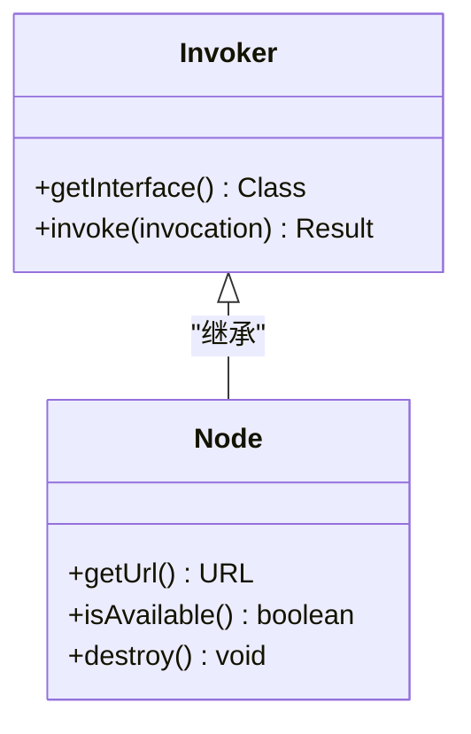
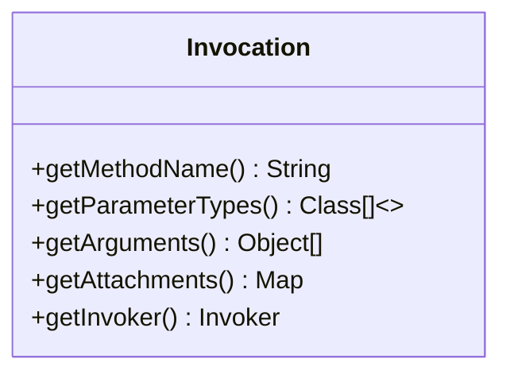
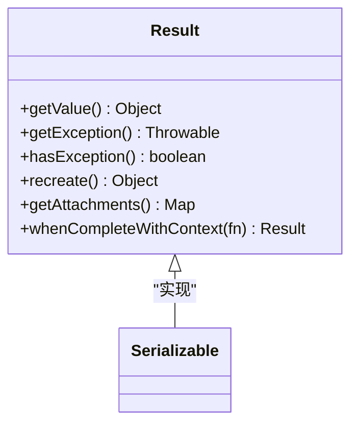
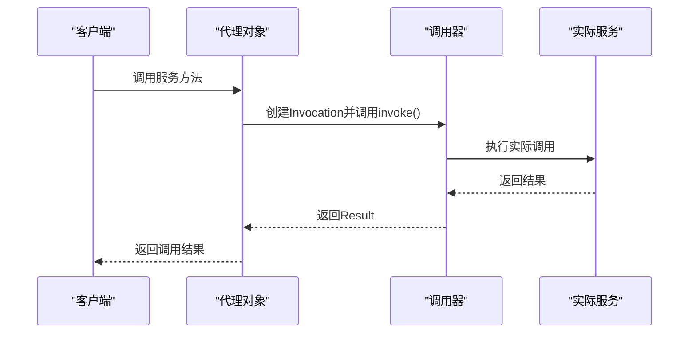
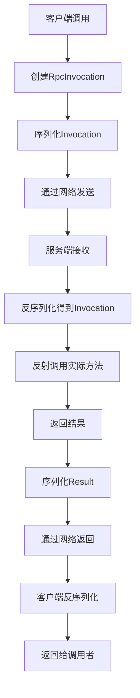
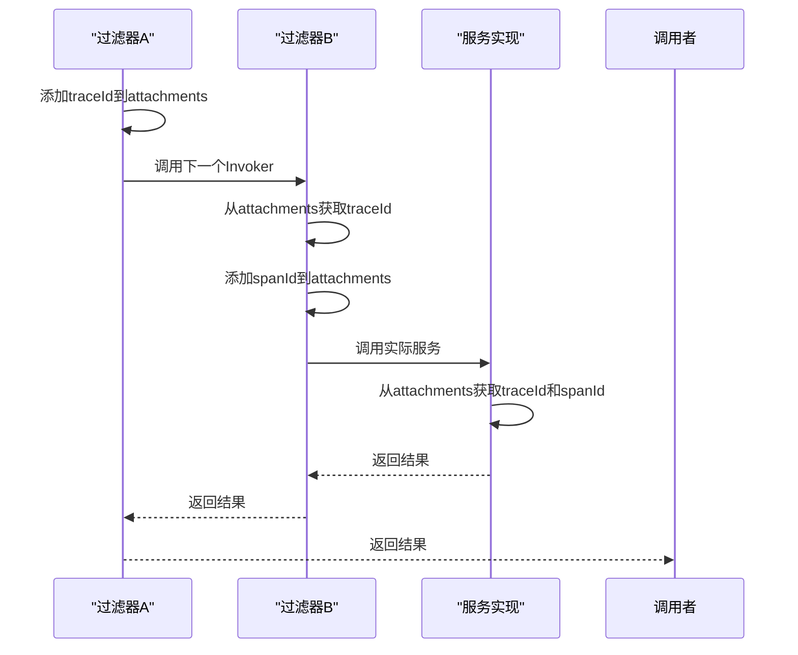
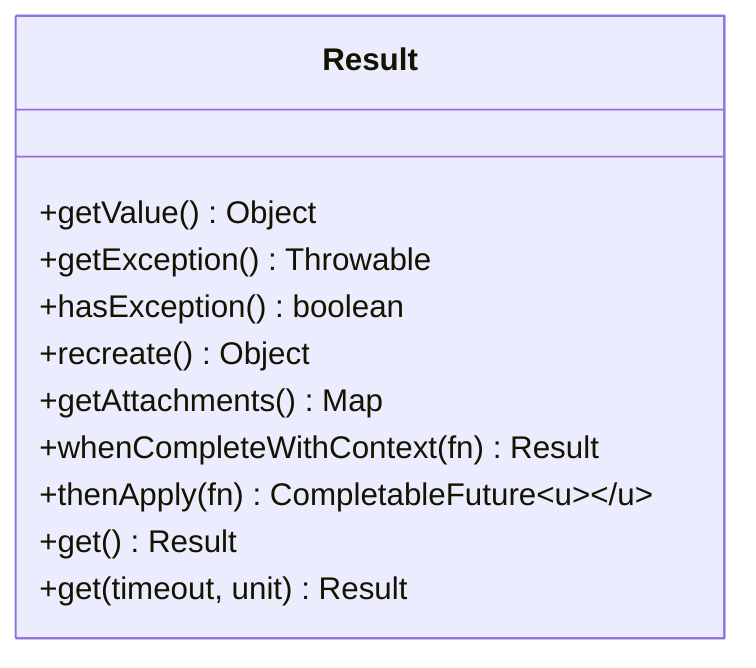
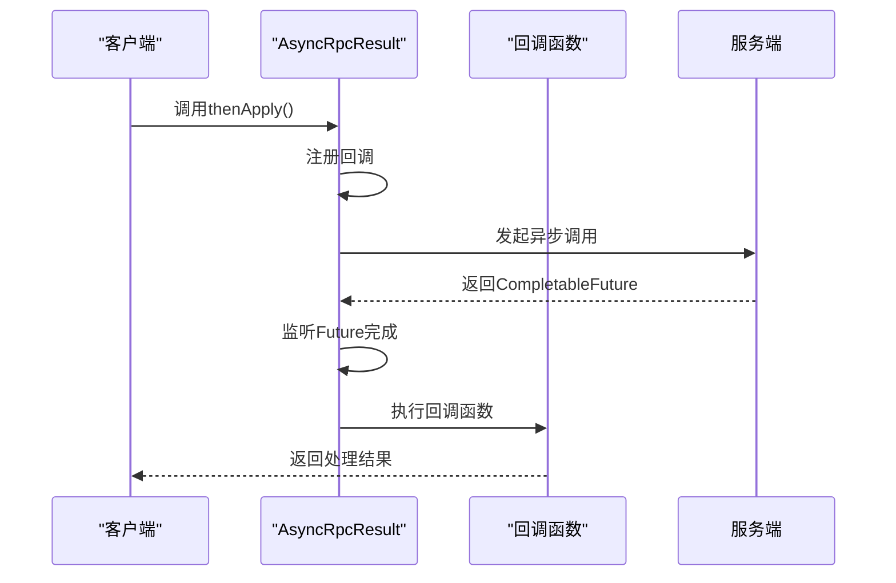
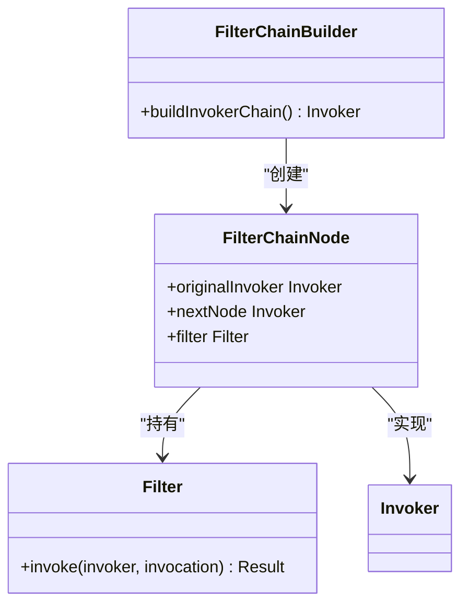
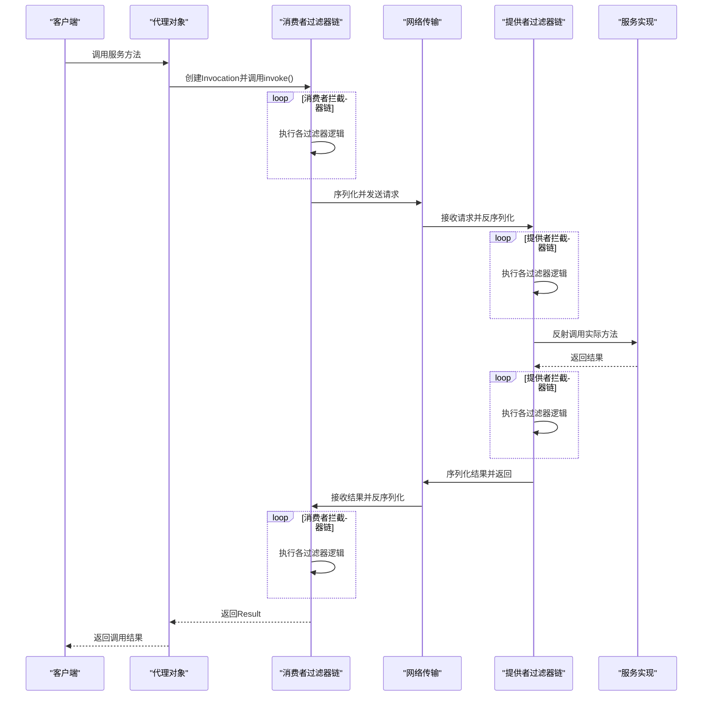

# 调用器与调用链

<cite>
**本文档引用的文件**   
- [Invoker.java](file://dubbo-rpc\dubbo-rpc-api\src\main\java\org\apache\dubbo\rpc\Invoker.java)
- [Invocation.java](file://dubbo-rpc\dubbo-rpc-api\src\main\java\org\apache\dubbo\rpc\Invocation.java)
- [Result.java](file://dubbo-rpc\dubbo-rpc-api\src\main\java\org\apache\dubbo\rpc\Result.java)
- [AsyncRpcResult.java](file://dubbo-rpc\dubbo-rpc-api\src\main\java\org\apache\dubbo\rpc\AsyncRpcResult.java)
- [RpcInvocation.java](file://dubbo-rpc\dubbo-rpc-api\src\main\java\org\apache\dubbo\rpc\RpcInvocation.java)
- [AppResponse.java](file://dubbo-rpc\dubbo-rpc-api\src\main\java\org\apache\dubbo\rpc\AppResponse.java)
- [FilterChainBuilder.java](file://dubbo-cluster\src\main\java\org\apache\dubbo\rpc\cluster\filter\FilterChainBuilder.java)
- [TpsLimitFilter.java](file://dubbo-rpc\dubbo-rpc-api\src\main\java\org\apache\dubbo\rpc\filter\TpsLimitFilter.java)
</cite>

## 目录
1. [引言](#引言)
2. [核心接口详解](#核心接口详解)
3. [调用器与代理机制](#调用器与代理机制)
4. [调用上下文与Invocation](#调用上下文与invocation)
5. [结果处理与Result](#结果处理与result)
6. [调用链构建与拦截器](#调用链构建与拦截器)
7. [调用链执行流程](#调用链执行流程)
8. [性能监控指标](#性能监控指标)
9. [调用链示例](#调用链示例)
10. [结论](#结论)

## 引言

在Dubbo分布式服务框架中，调用器（Invoker）与调用链（Invocation Chain）是实现远程过程调用（RPC）的核心机制。调用器作为服务调用的抽象，封装了本地或远程服务的执行逻辑；调用链则通过拦截器模式，在调用前后添加各种功能，如监控、限流、日志等。本文档将深入解析Invoker、Invocation和Result三大核心接口，详细阐述调用器的代理机制、调用上下文的传递、异步回调处理以及调用链的构建过程。

## 核心接口详解

Dubbo的RPC调用体系围绕三个核心接口构建：Invoker、Invocation和Result。它们共同定义了服务调用的契约，确保了调用过程的灵活性和可扩展性。

### Invoker接口

Invoker接口是Dubbo中所有服务调用的统一抽象，代表了一个可执行的服务端点。无论是本地调用还是远程调用，都通过Invoker接口进行统一处理。



**接口来源**
- [Invoker.java](file://dubbo-rpc\dubbo-rpc-api\src\main\java\org\apache\dubbo\rpc\Invoker.java#L28-L45)

### Invocation接口

Invocation接口封装了单次RPC调用的所有上下文信息，包括方法名、参数类型、参数值和附加属性。它是调用链中信息传递的载体。



**接口来源**
- [Invocation.java](file://dubbo-rpc\dubbo-rpc-api\src\main\java\org\apache\dubbo\rpc\Invocation.java#L36-L181)

### Result接口

Result接口代表一次RPC调用的结果，它既可以包含成功返回的值，也可以包含调用过程中抛出的异常。Result接口的设计支持同步和异步调用模式。



**接口来源**
- [Result.java](file://dubbo-rpc\dubbo-rpc-api\src\main\java\org\apache\dubbo\rpc\Result.java#L45-L187)

## 调用器与代理机制

调用器（Invoker）是Dubbo中服务调用的核心抽象，它通过代理机制实现了本地调用和远程调用的统一。代理模式使得调用者无需关心服务的实际位置，无论是本地JVM内的服务还是网络另一端的远程服务，都可以通过相同的接口进行调用。

### 代理模式实现

Dubbo使用JDK动态代理来创建服务接口的代理对象。当客户端调用服务接口的方法时，实际执行的是代理对象的逻辑，代理对象会将调用信息封装成Invocation对象，并通过Invoker进行实际的调用。



**调用流程说明**
1. 客户端通过代理对象调用服务方法
2. 代理对象创建RpcInvocation对象，封装方法名、参数等信息
3. 代理对象调用Invoker的invoke方法，传入Invocation
4. Invoker执行实际的调用逻辑（本地或远程）
5. 调用结果通过Result对象返回给客户端

**代码来源**
- [JdkProxyFactory.java](file://dubbo-rpc\dubbo-rpc-api\src\main\java\org\apache\dubbo\rpc\proxy\jdk\JdkProxyFactory.java#L33-L51)

### 远程调用封装

对于远程调用，Invoker会将Invocation对象序列化并通过网络传输到服务提供方。服务提供方接收到请求后，反序列化得到Invocation对象，然后通过反射机制调用实际的服务方法。



**接口来源**
- [RpcInvocation.java](file://dubbo-rpc\dubbo-rpc-api\src\main\java\org\apache\dubbo\rpc\RpcInvocation.java#L58-L899)

## 调用上下文与Invocation

Invocation接口是Dubbo调用上下文的核心，它不仅包含了方法调用的基本信息，还提供了丰富的扩展机制，使得调用链中的各个组件可以共享和传递数据。

### 调用上下文组成

一个完整的Invocation对象包含以下关键信息：

| 属性 | 类型 | 说明 |
|------|------|------|
| methodName | String | 被调用的方法名 |
| parameterTypes | Class<?>[] | 方法参数类型数组 |
| arguments | Object[] | 方法参数值数组 |
| attachments | Map<String, String> | 附加属性，用于传递元数据 |
| invoker | Invoker<?> | 当前调用的Invoker对象 |

**代码来源**
- [Invocation.java](file://dubbo-rpc\dubbo-rpc-api\src\main\java\org\apache\dubbo\rpc\Invocation.java#L36-L181)

### 上下文传递机制

Invocation的上下文传递机制是调用链功能实现的基础。通过attachments属性，可以在调用链的各个环节添加自定义信息，这些信息会随着调用过程一直传递到最终的服务实现。



**上下文传递示例**
```java
// 在过滤器中添加跟踪信息
invocation.setAttachment("traceId", generateTraceId());
invocation.setAttachment("spanId", generateSpanId());

// 在服务实现中获取跟踪信息
String traceId = invocation.getAttachment("traceId");
String spanId = invocation.getAttachment("spanId");
```

**代码来源**
- [RpcInvocation.java](file://dubbo-rpc\dubbo-rpc-api\src\main\java\org\apache\dubbo\rpc\RpcInvocation.java#L110-L155)

## 结果处理与Result

Result接口是Dubbo中调用结果的统一表示，它不仅封装了调用的返回值或异常，还提供了强大的异步处理能力。

### Result接口设计

Result接口的设计充分考虑了同步和异步调用的需求，提供了丰富的API来处理调用结果。



**关键方法说明**
- `getValue()`: 获取调用成功时的返回值
- `getException()`: 获取调用失败时的异常
- `hasException()`: 判断调用是否失败
- `recreate()`: 重新创建结果，如果失败则抛出异常
- `whenCompleteWithContext()`: 添加异步回调，保证在原始调用上下文中执行

**接口来源**
- [Result.java](file://dubbo-rpc\dubbo-rpc-api\src\main\java\org\apache\dubbo\rpc\Result.java#L45-L187)

### 异步回调处理

Dubbo通过AsyncRpcResult类实现了完整的异步调用支持。AsyncRpcResult实现了CompletableFuture接口，允许开发者使用现代的异步编程模型。



**异步处理示例**
```java
// 使用thenApply进行异步处理
CompletableFuture<String> future = asyncResult.thenApply(result -> {
    if (result.hasException()) {
        return "Error: " + result.getException().getMessage();
    } else {
        return "Success: " + result.getValue();
    }
});

// 使用whenCompleteWithContext添加回调
asyncResult.whenCompleteWithContext((result, throwable) -> {
    if (throwable != null) {
        logger.error("调用失败", throwable);
    } else {
        logger.info("调用成功，结果: " + result.getValue());
    }
});
```

**代码来源**
- [AsyncRpcResult.java](file://dubbo-rpc\dubbo-rpc-api\src\main\java\org\apache\dubbo\rpc\AsyncRpcResult.java#L54-L381)

## 调用链构建与拦截器

调用链是Dubbo实现横切关注点（如监控、限流、日志等）的核心机制。通过拦截器模式，Dubbo可以在不修改业务代码的情况下，为服务调用添加各种功能。

### 拦截器机制

Dubbo的拦截器机制基于责任链模式实现。每个拦截器（Filter）都实现了Invoker接口，在调用过程中形成一个链式结构，每个拦截器可以决定是否继续调用链的下一个节点。



**拦截器执行流程**
1. FilterChainBuilder根据配置创建拦截器链
2. 每个FilterChainNode持有下一个节点的引用，形成链式结构
3. 调用从链的头部开始，依次经过每个拦截器
4. 每个拦截器可以选择处理调用、修改参数或直接返回结果

**代码来源**
- [FilterChainBuilder.java](file://dubbo-cluster\src\main\java\org\apache\dubbo\rpc\cluster\filter\FilterChainBuilder.java#L55-L89)

### 自定义拦截器实现

开发者可以通过实现Filter接口来创建自定义的拦截器。通过@Activate注解，可以指定拦截器的激活条件，如作用域（provider/consumer）和配置项。

```java
@Activate(group = CommonConstants.PROVIDER, value = TPS_LIMIT_RATE_KEY)
public class TpsLimitFilter implements Filter {
    
    private final TPSLimiter tpsLimiter = new DefaultTPSLimiter();
    
    @Override
    public Result invoke(Invoker<?> invoker, Invocation invocation) throws RpcException {
        // 在调用前进行TPS限制检查
        if (!tpsLimiter.isAllowable(invoker.getUrl(), invocation)) {
            return AsyncRpcResult.newDefaultAsyncResult(
                new RpcException("超过最大TPS限制"), invocation);
        }
        
        // 继续调用链的下一个节点
        return invoker.invoke(invocation);
    }
}
```

**拦截器特点**
- **可配置性**: 通过@Activate注解控制拦截器的激活条件
- **链式执行**: 拦截器按顺序执行，形成调用链
- **灵活性**: 每个拦截器可以决定是否继续调用
- **可扩展性**: 易于添加新的拦截器功能

**代码来源**
- [TpsLimitFilter.java](file://dubbo-rpc\dubbo-rpc-api\src\main\java\org\apache\dubbo\rpc\filter\TpsLimitFilter.java#L41-L59)

## 调用链执行流程

调用链的执行流程是理解Dubbo调用机制的关键。从客户端发起调用到服务端返回结果，整个过程涉及多个组件的协同工作。

### 完整执行流程



**流程说明**
1. **客户端调用**: 客户端通过代理对象发起服务调用
2. **消费者拦截器链**: 在客户端执行一系列消费者端的过滤器，如负载均衡、路由等
3. **网络传输**: 将调用信息序列化并通过网络发送到服务端
4. **提供者拦截器链**: 在服务端执行一系列提供者端的过滤器，如限流、权限检查等
5. **服务执行**: 反射调用实际的服务方法
6. **结果返回**: 将结果按相反路径返回给客户端

**代码来源**
- [FilterChainBuilder.java](file://dubbo-cluster\src\main\java\org\apache\dubbo\rpc\cluster\filter\FilterChainBuilder.java#L251-L301)

### 调用链构建过程

调用链的构建是在服务引用或暴露时完成的。FilterChainBuilder负责根据配置创建完整的拦截器链。

```mermaid
flowchart TD
A[服务引用/暴露] --> B[FilterChainBuilder.buildInvokerChain()]
B --> C[获取所有激活的Filter]
C --> D[按顺序创建FilterChainNode]
D --> E[形成链式结构]
E --> F[返回链头Invoker]
F --> G[客户端/服务端使用]
```

**构建步骤**
1. 根据URL中的配置确定需要激活的过滤器
2. 按照优先级对过滤器进行排序
3. 创建FilterChainNode节点，将过滤器和Invoker包装在一起
4. 将所有节点链接成链式结构
5. 返回链头的Invoker作为最终的调用入口

**代码来源**
- [FilterChainBuilder.java](file://dubbo-cluster\src\main\java\org\apache\dubbo\rpc\cluster\filter\FilterChainBuilder.java#L25-L89)

## 性能监控指标

调用链不仅是功能扩展的机制，也是性能监控的基础。通过在调用链中添加监控拦截器，可以收集各种性能指标。

### 关键性能指标

| 指标 | 说明 | 收集位置 |
|------|------|---------|
| 调用延迟 | 从发起调用到收到响应的时间 | 消费者端拦截器 |
| TPS | 每秒处理的事务数 | 提供者端拦截器 |
| 错误率 | 失败调用占总调用的比例 | 消费者和提供者拦截器 |
| 调用成功率 | 成功调用占总调用的比例 | 消费者端拦截器 |
| 资源利用率 | CPU、内存等系统资源使用情况 | 提供者端拦截器 |

### 监控实现示例

```java
@Activate(group = CommonConstants.CONSUMER)
public class MetricsFilter implements Filter {
    
    private final MetricsCollector collector = new MetricsCollector();
    
    @Override
    public Result invoke(Invoker<?> invoker, Invocation invocation) throws RpcException {
        long startTime = System.currentTimeMillis();
        String methodName = invocation.getMethodName();
        
        try {
            // 执行实际调用
            Result result = invoker.invoke(invocation);
            
            // 记录成功指标
            long duration = System.currentTimeMillis() - startTime;
            collector.recordSuccess(methodName, duration);
            
            return result;
        } catch (Exception e) {
            // 记录失败指标
            long duration = System.currentTimeMillis() - startTime;
            collector.recordFailure(methodName, duration, e.getClass().getSimpleName());
            
            throw e;
        }
    }
}
```

**监控要点**
- **时间戳**: 在调用前后记录时间，计算调用延迟
- **异常处理**: 捕获异常并记录失败信息
- **指标聚合**: 对收集的原始数据进行聚合分析
- **异步上报**: 避免监控逻辑影响主调用链性能

**代码来源**
- [MetricsFilter.java](file://dubbo-metrics\dubbo-metrics-default\src\main\java\org\apache\dubbo\metrics\filter\MetricsFilter.java)

## 调用链示例

### 简单调用链示例

对于初学者，以下是一个简单的调用链示例，展示了基本的调用流程：

```java
// 1. 创建服务接口
public interface DemoService {
    String sayHello(String name);
}

// 2. 服务实现
public class DemoServiceImpl implements DemoService {
    @Override
    public String sayHello(String name) {
        return "Hello, " + name;
    }
}

// 3. 服务调用
DemoService service = ReferenceConfig.get().get();
String result = service.sayHello("World");
System.out.println(result); // 输出: Hello, World
```

**执行流程**
1. 客户端通过代理对象调用sayHello方法
2. 代理创建RpcInvocation，包含方法名"sayHello"和参数"World"
3. 调用链中的拦截器依次处理调用
4. 服务端接收请求，反射调用DemoServiceImpl.sayHello
5. 结果通过调用链返回给客户端

### 自定义调用链实现

对于经验丰富的开发者，可以实现自定义的调用链来满足特定需求：

```java
@Activate(group = CommonConstants.PROVIDER, order = 100)
public class CustomAuthFilter implements Filter {
    
    private final AuthService authService = new AuthService();
    
    @Override
    public Result invoke(Invoker<?> invoker, Invocation invocation) throws RpcException {
        // 1. 从调用上下文中获取认证信息
        String token = invocation.getAttachment("auth-token");
        
        // 2. 验证认证信息
        if (!authService.validateToken(token)) {
            return AsyncRpcResult.newDefaultAsyncResult(
                new RpcException("认证失败"), invocation);
        }
        
        // 3. 添加用户信息到上下文，供后续处理使用
        String userId = authService.getUserId(token);
        invocation.setAttachment("user-id", userId);
        
        // 4. 继续调用链
        return invoker.invoke(invocation);
    }
}
```

**自定义要点**
- **激活条件**: 使用@Activate注解指定拦截器的激活条件
- **顺序控制**: 通过order属性控制拦截器的执行顺序
- **上下文传递**: 利用attachments在调用链中传递数据
- **异常处理**: 正确处理异常并返回适当的Result

**代码来源**
- [TpsLimitFilter.java](file://dubbo-rpc\dubbo-rpc-api\src\main\java\org\apache\dubbo\rpc\filter\TpsLimitFilter.java#L41-L59)

## 结论

调用器与调用链是Dubbo框架的核心机制，它们通过Invoker、Invocation和Result三个核心接口，实现了服务调用的抽象、上下文传递和结果处理。代理机制使得本地调用和远程调用的统一成为可能，而拦截器模式则为功能扩展提供了灵活的架构。通过深入理解这些机制，开发者不仅可以更好地使用Dubbo，还可以根据业务需求定制自己的调用链，实现诸如认证、监控、限流等横切关注点。调用链的设计充分体现了面向切面编程的思想，在不侵入业务代码的情况下，为分布式服务提供了强大的功能支持。