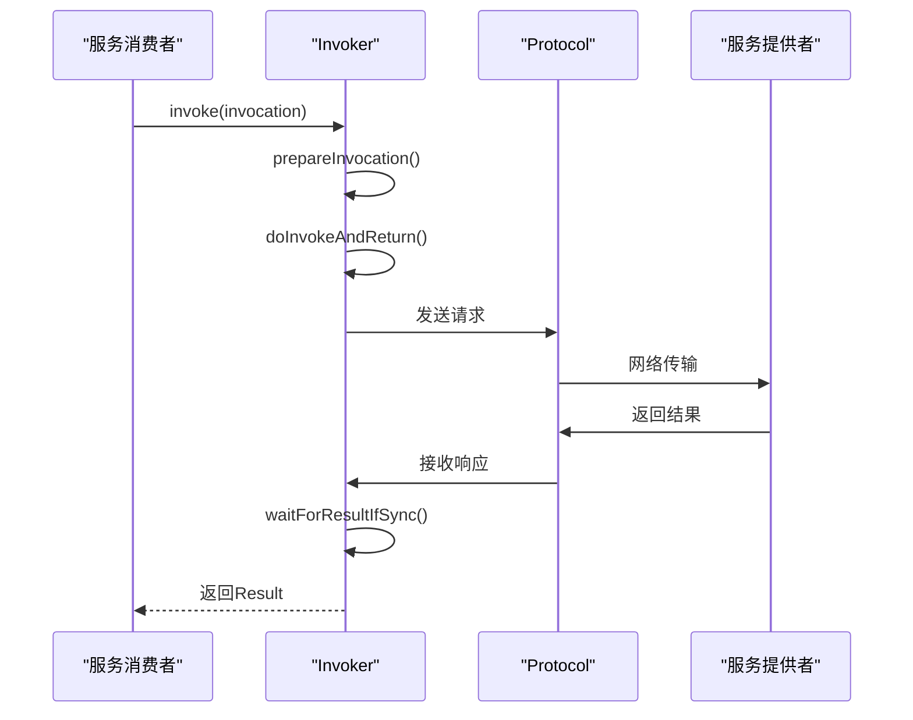
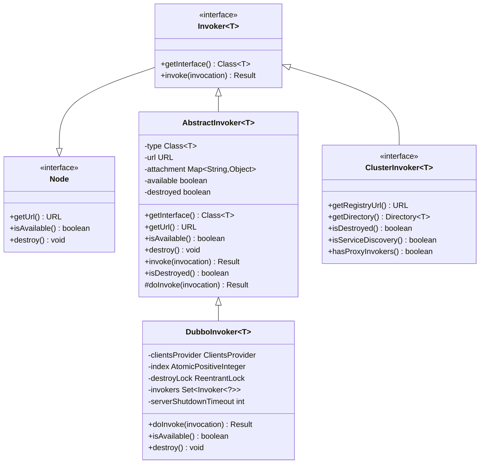
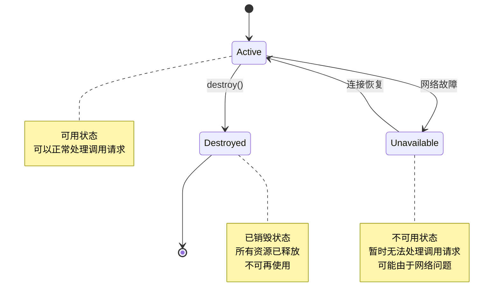

# 调用器核心接口

<cite>
**本文档引用的文件**   
- [Invoker.java](file://dubbo-rpc\dubbo-rpc-api\src\main\java\org\apache\dubbo\rpc\Invoker.java)
- [AbstractInvoker.java](file://dubbo-rpc\dubbo-rpc-api\src\main\java\org\apache\dubbo\rpc\protocol\AbstractInvoker.java)
- [DubboInvoker.java](file://dubbo-rpc\dubbo-rpc-dubbo\src\main\java\org\apache\dubbo\rpc\protocol\dubbo\DubboInvoker.java)
- [Protocol.java](file://dubbo-rpc\dubbo-rpc-api\src\main\java\org\apache\dubbo\rpc\Protocol.java)
- [Node.java](file://dubbo-common\src\main\java\org\apache\dubbo\common\Node.java)
- [ClusterInvoker.java](file://dubbo-cluster\src\main\java\org\apache\dubbo\rpc\cluster\ClusterInvoker.java)
</cite>

## 目录
1. [引言](#引言)
2. [调用器接口设计原理](#调用器接口设计原理)
3. [核心方法详解](#核心方法详解)
4. [调用流程分析](#调用流程分析)
5. [生命周期管理](#生命周期管理)
6. [服务消费者与提供者端的实现差异](#服务消费者与提供者端的实现差异)
7. [使用示例](#使用示例)
8. [自定义实现](#自定义实现)
9. [类图与状态转换图](#类图与状态转换图)

## 引言
调用器（Invoker）是Dubbo框架中用于执行远程调用的核心接口，它在服务消费者和服务提供者之间扮演着关键角色。作为RPC调用的抽象，Invoker封装了远程方法调用的细节，为上层提供了统一的调用方式。本文档将深入探讨Invoker接口的设计原理、实现机制及其在Dubbo架构中的重要作用。

## 调用器接口设计原理

Invoker接口的设计遵循了Dubbo框架的SPI（Service Provider Interface）扩展机制，体现了高度的灵活性和可扩展性。该接口继承自Node接口，继承了URL获取、可用性检查和销毁等基本能力。Invoker的核心设计思想是将远程服务调用抽象为一个可执行的实体，通过统一的接口进行管理。

在Dubbo架构中，Invoker是连接服务消费者和提供者的关键桥梁。对于服务消费者，Invoker代表了对远程服务的引用，封装了网络通信、序列化、负载均衡等细节；对于服务提供者，Invoker则包装了本地服务实现，负责接收请求并返回结果。这种统一的抽象使得Dubbo能够以一致的方式处理本地调用和远程调用。

**调用器接口设计原理**
- [Invoker.java](file://dubbo-rpc\dubbo-rpc-api\src\main\java\org\apache\dubbo\rpc\Invoker.java#L17-L47)
- [Node.java](file://dubbo-common\src\main\java\org\apache\dubbo\common\Node.java#L17-L47)

## 核心方法详解

### invoke()方法
invoke()方法是Invoker接口的核心，负责执行实际的远程调用。该方法接收一个Invocation对象作为参数，包含调用的方法名、参数类型、参数值等信息，并返回一个Result对象表示调用结果。在调用过程中，框架会处理序列化、网络传输、异常处理等复杂细节，为开发者提供透明的远程调用体验。

### getUrl()方法
getUrl()方法继承自Node接口，用于获取与Invoker关联的URL。这个URL包含了服务提供者的地址、端口、协议等关键信息，是Dubbo进行服务发现和路由的基础。通过URL，框架可以确定调用的目标地址和通信协议。

### getInterface()方法
getInterface()方法返回Invoker所代表的服务接口类型。这个信息对于框架进行类型检查、参数验证和结果处理至关重要。它确保了调用方和提供方在接口定义上的一致性，是Dubbo实现透明RPC调用的重要保障。

**核心方法详解**
- [Invoker.java](file://dubbo-rpc\dubbo-rpc-api\src\main\java\org\apache\dubbo\rpc\Invoker.java#L31-L46)
- [Node.java](file://dubbo-common\src\main\java\org\apache\dubbo\common\Node.java#L25-L46)

## 调用流程分析



**调用流程分析**
- [AbstractInvoker.java](file://dubbo-rpc\dubbo-rpc-api\src\main\java\org\apache\dubbo\rpc\protocol\AbstractInvoker.java#L174-L198)
- [DubboInvoker.java](file://dubbo-rpc\dubbo-rpc-dubbo\src\main\java\org\apache\dubbo\rpc\protocol\dubbo\DubboInvoker.java#L90-L161)

## 生命周期管理

Invoker的生命周期管理主要通过destroy()方法实现。当服务不再需要时，调用destroy()方法可以释放相关资源，如网络连接、线程池等。在AbstractInvoker的实现中，destroy()方法会设置destroyed标志位，标记Invoker已被销毁，并调用setAvailable(false)使其不可用。

destroy()方法的调用时机通常在以下场景：服务下线、应用关闭、连接池清理等。框架会在适当的时机自动调用此方法，确保资源的及时释放。同时，destroy()方法是幂等的，多次调用不会产生副作用，这保证了系统的稳定性。

**生命周期管理**
- [AbstractInvoker.java](file://dubbo-rpc\dubbo-rpc-api\src\main\java\org\apache\dubbo\rpc\protocol\AbstractInvoker.java#L155-L158)
- [DubboInvoker.java](file://dubbo-rpc\dubbo-rpc-dubbo\src\main\java\org\apache\dubbo\rpc\protocol\dubbo\DubboInvoker.java#L178-L197)

## 服务消费者与提供者端的实现差异

在服务消费者端，Invoker通常作为远程服务的代理，如DubboInvoker实现了基于Dubbo协议的远程调用。它负责建立和管理与服务提供者的网络连接，处理请求的序列化和发送，以及响应的接收和反序列化。

在服务提供者端，Invoker则包装了本地服务实现，如AbstractInvoker的子类负责接收来自消费者的请求，调用本地服务方法，并将结果返回。服务提供者端的Invoker还需要处理线程池管理、流量控制、服务降级等高级功能。

两者的主要差异体现在：消费者端Invoker关注请求的发送和结果的获取，而提供者端Invoker关注请求的接收和本地方法的执行。这种差异化的实现使得Dubbo能够高效地处理双向通信。

**服务消费者与提供者端的实现差异**
- [DubboInvoker.java](file://dubbo-rpc\dubbo-rpc-dubbo\src\main\java\org\apache\dubbo\rpc\protocol\dubbo\DubboInvoker.java#L63-L200)
- [AbstractInvoker.java](file://dubbo-rpc\dubbo-rpc-api\src\main\java\org\apache\dubbo\rpc\protocol\AbstractInvoker.java#L62-L353)

## 使用示例

对于初学者，使用Invoker的基本方式是通过Protocol的refer()方法获取服务引用：

```java
// 获取Protocol实例
Protocol protocol = ExtensionLoader.getExtensionLoader(Protocol.class).getAdaptiveExtension();

// 创建URL并引用服务
URL url = URL.valueOf("dubbo://127.0.0.1:20880/org.apache.dubbo.demo.DemoService");
Invoker<DemoService> invoker = protocol.refer(DemoService.class, url);

// 创建调用信息并执行调用
Invocation invocation = new RpcInvocation("sayHello", new Class[]{String.class}, new Object[]{"world"});
Result result = invoker.invoke(invocation);

// 处理调用结果
if (result.hasException()) {
    System.out.println("调用异常: " + result.getException().getMessage());
} else {
    System.out.println("调用结果: " + result.getValue());
}

// 使用完毕后销毁Invoker
invoker.destroy();
```

**使用示例**
- [Protocol.java](file://dubbo-rpc\dubbo-rpc-api\src\main\java\org\apache\dubbo\rpc\Protocol.java#L99-L100)

## 自定义实现

对于经验丰富的开发者，可以通过继承AbstractInvoker来创建自定义的Invoker实现。以下是一个简单的自定义Invoker示例：

```java
public class CustomInvoker<T> extends AbstractInvoker<T> {
    
    private final Client client;
    
    public CustomInvoker(Class<T> type, URL url, Client client) {
        super(type, url);
        this.client = client;
    }
    
    @Override
    protected Result doInvoke(Invocation invocation) throws Throwable {
        // 自定义调用逻辑
        Request request = buildRequest(invocation);
        
        // 发送请求并获取响应
        Response response = client.send(request);
        
        // 处理响应
        if (response.hasException()) {
            return AsyncRpcResult.newDefaultAsyncResult(null, response.getException(), invocation);
        } else {
            return AsyncRpcResult.newDefaultAsyncResult(response.getResult(), null, invocation);
        }
    }
    
    private Request buildRequest(Invocation invocation) {
        // 构建自定义请求
        Request request = new Request();
        request.setData(invocation);
        return request;
    }
}
```

**自定义实现**
- [AbstractInvoker.java](file://dubbo-rpc\dubbo-rpc-api\src\main\java\org\apache\dubbo\rpc\protocol\AbstractInvoker.java#L351-L352)

## 类图与状态转换图





**类图与状态转换图**
- [Invoker.java](file://dubbo-rpc\dubbo-rpc-api\src\main\java\org\apache\dubbo\rpc\Invoker.java#L29-L46)
- [AbstractInvoker.java](file://dubbo-rpc\dubbo-rpc-api\src\main\java\org\apache\dubbo\rpc\protocol\AbstractInvoker.java#L62-L353)
- [DubboInvoker.java](file://dubbo-rpc\dubbo-rpc-dubbo\src\main\java\org\apache\dubbo\rpc\protocol\dubbo\DubboInvoker.java#L63-L200)
- [ClusterInvoker.java](file://dubbo-cluster\src\main\java\org\apache\dubbo\rpc\cluster\ClusterInvoker.java#L34-L57)