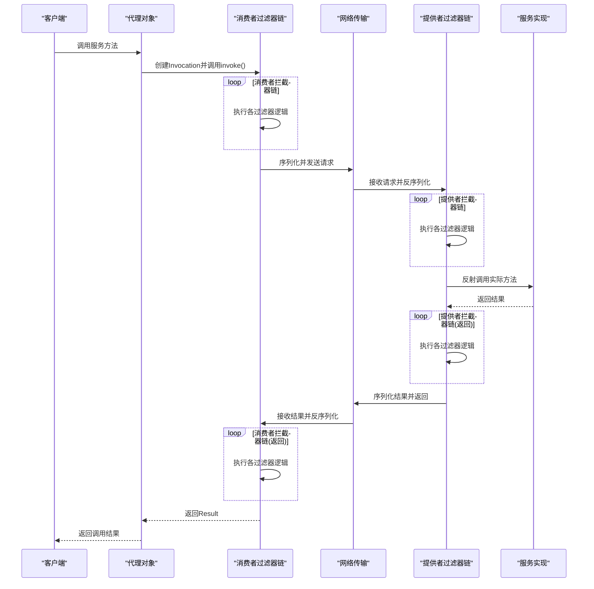
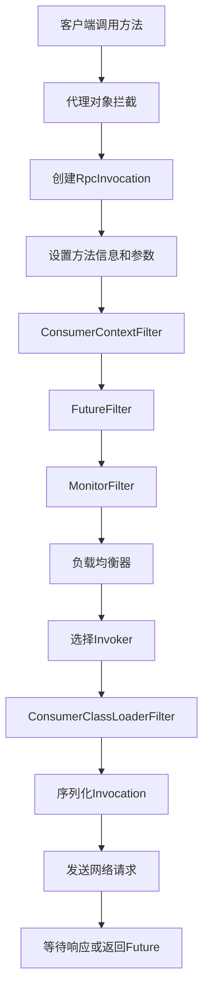
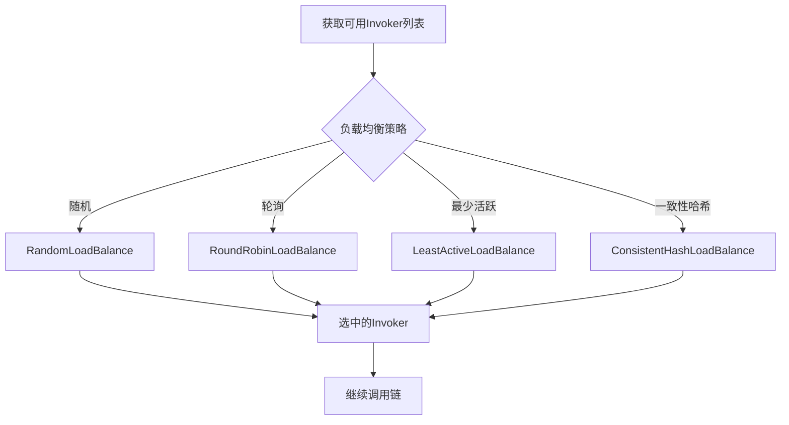
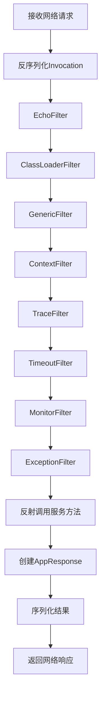
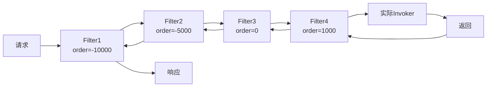
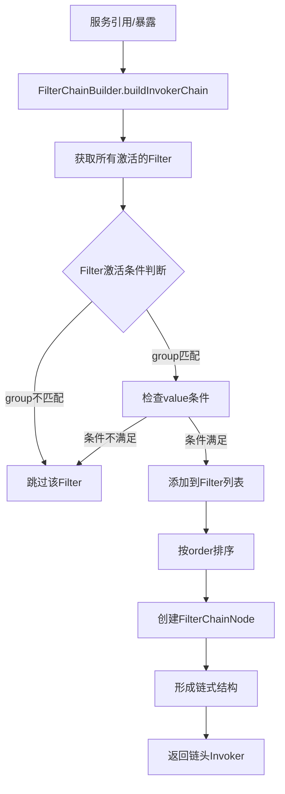
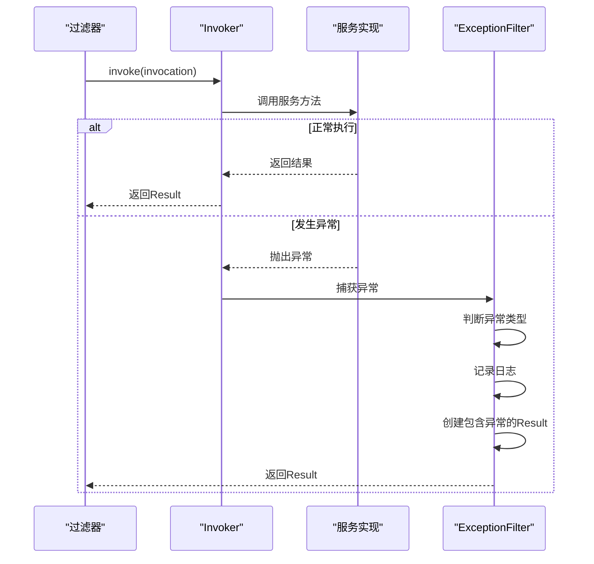

# 调用链执行流程

<cite>
**本文档引用的文件**   
- [FilterChainBuilder.java](file://dubbo-cluster\src\main\java\org\apache\dubbo\rpc\cluster\filter\FilterChainBuilder.java)
- [Filter.java](file://dubbo-rpc\dubbo-rpc-api\src\main\java\org\apache\dubbo\rpc\Filter.java)
- [Invoker.java](file://dubbo-rpc\dubbo-rpc-api\src\main\java\org\apache\dubbo\rpc\Invoker.java)
</cite>

## 目录
1. [引言](#引言)
2. [完整执行流程概览](#完整执行流程概览)
3. [消费者端处理流程](#消费者端处理流程)
4. [提供者端处理流程](#提供者端处理流程)
5. [过滤器链执行顺序](#过滤器链执行顺序)
6. [调用链构建过程](#调用链构建过程)
7. [异常处理机制](#异常处理机制)
8. [性能优化建议](#性能优化建议)

## 引言

调用链的执行流程是理解Dubbo调用机制的关键。从客户端发起调用到服务端返回结果,整个过程涉及代理对象、过滤器链、网络传输、服务实现等多个组件的协同工作。本文档将详细解析调用链的完整执行流程,包括消费者端和提供者端的处理过程,以及过滤器链的执行顺序。

## 完整执行流程概览

调用链的完整执行流程涵盖了从客户端发起调用到服务端返回结果的全过程,包括多个阶段的处理。

### 端到端调用流程



### 关键处理阶段

| 阶段 | 位置 | 主要职责 |
|------|------|---------|
| 代理拦截 | 客户端 | 拦截方法调用,创建Invocation对象 |
| 消费者过滤 | 客户端 | 执行消费者端过滤器,如负载均衡、路由等 |
| 序列化 | 客户端 | 将Invocation序列化为字节流 |
| 网络传输 | 网络层 | 通过网络将请求发送到服务端 |
| 反序列化 | 服务端 | 将字节流反序列化为Invocation |
| 提供者过滤 | 服务端 | 执行提供者端过滤器,如限流、权限检查等 |
| 服务执行 | 服务端 | 反射调用实际的服务方法 |
| 结果返回 | 服务端→客户端 | 按相反路径返回结果 |

**代码来源**:
- [FilterChainBuilder.java](file://dubbo-cluster\src\main\java\org\apache\dubbo\rpc\cluster\filter\FilterChainBuilder.java#L251-L301)

## 消费者端处理流程

消费者端的处理流程从代理对象拦截方法调用开始,经过一系列过滤器处理后,将请求发送到服务端。

### 消费者端流程详解



### 消费者端关键过滤器

#### 1. ConsumerContextFilter
- **作用**: 设置消费者端的RPC上下文
- **处理内容**: 
  - 设置本地地址和远程地址
  - 记录调用的服务接口和方法
  - 传递附加参数

```java
@Activate(group = CONSUMER, order = -10000)
public class ConsumerContextFilter implements Filter {
    
    @Override
    public Result invoke(Invoker<?> invoker, Invocation invocation) throws RpcException {
        // 设置RPC上下文
        RpcContext context = RpcContext.getContext();
        context.setInvoker(invoker)
               .setInvocation(invocation)
               .setLocalAddress(NetUtils.getLocalHost(), 0)
               .setRemoteAddress(invoker.getUrl().getHost(), 
                                invoker.getUrl().getPort());
        
        // 设置服务信息
        if (invocation instanceof RpcInvocation) {
            ((RpcInvocation) invocation).setInvoker(invoker);
        }
        
        try {
            // 继续调用链
            return invoker.invoke(invocation);
        } finally {
            // 清理上下文
            RpcContext.removeContext();
        }
    }
}
```

#### 2. FutureFilter
- **作用**: 处理异步调用,管理Future对象
- **处理内容**:
  - 为异步调用创建Future
  - 设置回调函数
  - 处理异步结果

#### 3. MonitorFilter
- **作用**: 收集调用监控数据
- **处理内容**:
  - 记录调用次数
  - 记录调用耗时
  - 记录成功/失败状态

### 负载均衡处理

在消费者端,负载均衡器会从多个可用的Invoker中选择一个进行调用:



**代码来源**:
- [ConsumerContextFilter.java](file://dubbo-rpc\dubbo-rpc-api\src\main\java\org\apache\dubbo\rpc\filter\ConsumerContextFilter.java)

## 提供者端处理流程

提供者端的处理流程从接收网络请求开始,经过反序列化和过滤器处理后,最终调用实际的服务方法。

### 提供者端流程详解



### 提供者端关键过滤器

#### 1. EchoFilter
- **作用**: 处理回声测试
- **处理内容**: 如果方法名是`$echo`,直接返回参数

```java
@Activate(group = PROVIDER, order = -110000)
public class EchoFilter implements Filter {
    
    @Override
    public Result invoke(Invoker<?> invoker, Invocation invocation) throws RpcException {
        // 回声测试
        if ("$echo".equals(invocation.getMethodName()) 
            && invocation.getArguments() != null 
            && invocation.getArguments().length == 1) {
            return AsyncRpcResult.newDefaultAsyncResult(
                invocation.getArguments()[0], invocation);
        }
        
        return invoker.invoke(invocation);
    }
}
```

#### 2. ClassLoaderFilter
- **作用**: 切换线程上下文类加载器
- **处理内容**: 确保使用正确的ClassLoader加载类

#### 3. GenericFilter
- **作用**: 处理泛化调用
- **处理内容**: 将泛化调用转换为实际的方法调用

#### 4. ContextFilter
- **作用**: 设置提供者端的RPC上下文
- **处理内容**:
  - 设置远程地址和本地地址
  - 传递附加参数
  - 记录调用信息

```java
@Activate(group = PROVIDER, order = -10000)
public class ContextFilter implements Filter {
    
    @Override
    public Result invoke(Invoker<?> invoker, Invocation invocation) throws RpcException {
        // 设置上下文
        Map<String, String> attachments = invocation.getAttachments();
        if (attachments != null) {
            Map<String, String> newAttachments = new HashMap<>(attachments);
            newAttachments.remove(PATH_KEY);
            newAttachments.remove(INTERFACE_KEY);
            RpcContext.getContext().setAttachments(newAttachments);
        }
        
        try {
            return invoker.invoke(invocation);
        } finally {
            RpcContext.removeContext();
        }
    }
}
```

#### 5. ExceptionFilter
- **作用**: 处理服务端异常
- **处理内容**:
  - 捕获并包装异常
  - 记录异常日志
  - 返回包含异常信息的Result

**代码来源**:
- [ContextFilter.java](file://dubbo-rpc\dubbo-rpc-api\src\main\java\org\apache\dubbo\rpc\filter\ContextFilter.java)

## 过滤器链执行顺序

过滤器的执行顺序由@Activate注解的order属性和配置决定。order值越小,优先级越高,越先执行。

### 消费者端过滤器顺序

| Order | 过滤器 | 作用 |
|-------|--------|------|
| -10000 | ConsumerContextFilter | 设置RPC上下文 |
| -9000 | FutureFilter | 处理异步调用 |
| -7000 | MonitorFilter | 监控数据收集 |
| 默认 | 自定义过滤器 | 业务自定义逻辑 |

### 提供者端过滤器顺序

| Order | 过滤器 | 作用 |
|-------|--------|------|
| -110000 | EchoFilter | 回声测试 |
| -30000 | ClassLoaderFilter | 切换类加载器 |
| -20000 | GenericFilter | 泛化调用处理 |
| -10000 | ContextFilter | 设置RPC上下文 |
| -5000 | TraceFilter | 链路追踪 |
| -3000 | TimeoutFilter | 超时处理 |
| -7000 | MonitorFilter | 监控数据收集 |
| -1 | ExceptionFilter | 异常处理 |

### 过滤器链执行示意图



**代码来源**:
- [FilterChainBuilder.java](file://dubbo-cluster\src\main\java\org\apache\dubbo\rpc\cluster\filter\FilterChainBuilder.java#L25-L89)

## 调用链构建过程

调用链的构建是在服务引用或暴露时完成的。FilterChainBuilder负责根据配置创建完整的拦截器链。

### 构建流程



### 构建代码实现

```java
public class FilterChainBuilder {
    
    public <T> Invoker<T> buildInvokerChain(
            Invoker<T> invoker,
            String key,
            String group) {
        
        Invoker<T> last = invoker;
        
        // 1. 获取所有激活的Filter
        List<Filter> filters = ExtensionLoader.getExtensionLoader(Filter.class)
            .getActivateExtension(invoker.getUrl(), key, group);
        
        // 2. 反向遍历,构建链式结构
        if (!filters.isEmpty()) {
            for (int i = filters.size() - 1; i >= 0; i--) {
                final Filter filter = filters.get(i);
                final Invoker<T> next = last;
                
                // 3. 创建FilterChainNode
                last = new FilterChainNode<>(invoker, next, filter);
            }
        }
        
        return last;
    }
    
    // FilterChainNode实现
    static class FilterChainNode<T> implements Invoker<T> {
        
        private final Invoker<T> originalInvoker;
        private final Invoker<T> nextNode;
        private final Filter filter;
        
        FilterChainNode(Invoker<T> originalInvoker, 
                       Invoker<T> nextNode, 
                       Filter filter) {
            this.originalInvoker = originalInvoker;
            this.nextNode = nextNode;
            this.filter = filter;
        }
        
        @Override
        public Result invoke(Invocation invocation) throws RpcException {
            // 执行Filter逻辑,然后调用下一个节点
            return filter.invoke(nextNode, invocation);
        }
        
        // ... 其他方法实现
    }
}
```

**构建步骤说明**:
1. 根据URL中的配置确定需要激活的过滤器
2. 按照优先级(order属性)对过滤器进行排序
3. 创建FilterChainNode节点,将过滤器和Invoker包装在一起
4. 将所有节点链接成链式结构(使用反向遍历)
5. 返回链头的Invoker作为最终的调用入口

**代码来源**:
- [FilterChainBuilder.java](file://dubbo-cluster\src\main\java\org\apache\dubbo\rpc\cluster\filter\FilterChainBuilder.java#L55-L89)

## 异常处理机制

调用链执行过程中可能会发生各种异常,Dubbo提供了完善的异常处理机制。

### 异常处理流程



### ExceptionFilter实现

```java
@Activate(group = PROVIDER, order = -1)
public class ExceptionFilter implements Filter {
    
    private final Logger logger = LoggerFactory.getLogger(ExceptionFilter.class);
    
    @Override
    public Result invoke(Invoker<?> invoker, Invocation invocation) throws RpcException {
        try {
            // 执行调用
            Result result = invoker.invoke(invocation);
            
            // 检查是否有异常
            if (result.hasException() && GenericService.class != invoker.getInterface()) {
                Throwable exception = result.getException();
                
                // 处理受检异常
                if (!(exception instanceof RuntimeException) 
                    && exception instanceof Exception) {
                    // 检查方法签名
                    Method method = invocation.getMethod();
                    Class<?>[] exceptionClasses = method.getExceptionTypes();
                    for (Class<?> exceptionClass : exceptionClasses) {
                        if (exception.getClass().equals(exceptionClass)) {
                            return result;
                        }
                    }
                    
                    // 记录未声明的异常
                    logger.error("服务方法抛出未声明的异常", exception);
                }
                
                // 返回结果
                return result;
            }
            
            return result;
        } catch (RuntimeException e) {
            logger.error("调用过程中发生运行时异常", e);
            throw e;
        }
    }
}
```

## 性能优化建议

### 1. 减少过滤器数量
- 只激活必要的过滤器
- 合并功能相似的过滤器
- 避免在过滤器中执行耗时操作

### 2. 优化序列化
- 选择高效的序列化协议(如Hessian2、Protobuf)
- 减少传输的数据量
- 使用压缩减少网络传输

### 3. 异步处理
- 使用异步调用减少线程阻塞
- 合理配置线程池大小
- 避免在调用链中执行同步阻塞操作

### 4. 监控与日志
- 合理设置监控采样率
- 避免过度日志记录
- 使用异步方式记录日志

### 性能优化示例

```java
@Activate(group = CONSUMER, order = 1000)
public class OptimizedFilter implements Filter {
    
    // 使用异步方式记录日志
    private final AsyncLogger logger = new AsyncLogger();
    
    @Override
    public Result invoke(Invoker<?> invoker, Invocation invocation) throws RpcException {
        long startTime = System.nanoTime();
        
        try {
            // 执行调用
            Result result = invoker.invoke(invocation);
            
            // 异步记录成功指标
            result.whenCompleteWithContext((r, t) -> {
                long duration = System.nanoTime() - startTime;
                if (t == null) {
                    logger.logSuccess(invocation.getMethodName(), duration);
                } else {
                    logger.logFailure(invocation.getMethodName(), duration, t);
                }
            });
            
            return result;
        } catch (Exception e) {
            // 异步记录异常
            long duration = System.nanoTime() - startTime;
            logger.logFailure(invocation.getMethodName(), duration, e);
            throw e;
        }
    }
}
```

## 总结

调用链的执行流程是Dubbo框架的核心机制之一,它通过代理、过滤器链、网络传输等多个组件的协同工作,实现了透明的远程过程调用。理解调用链的执行流程对于:

1. **调试问题**: 能够快速定位调用过程中的问题
2. **性能优化**: 识别性能瓶颈并进行优化
3. **功能扩展**: 正确地添加自定义过滤器
4. **架构设计**: 设计更合理的分布式系统架构

通过深入理解消费者端和提供者端的处理流程,以及过滤器链的执行顺序,开发者可以更好地利用Dubbo框架的能力,构建高性能、高可用的分布式服务系统。
