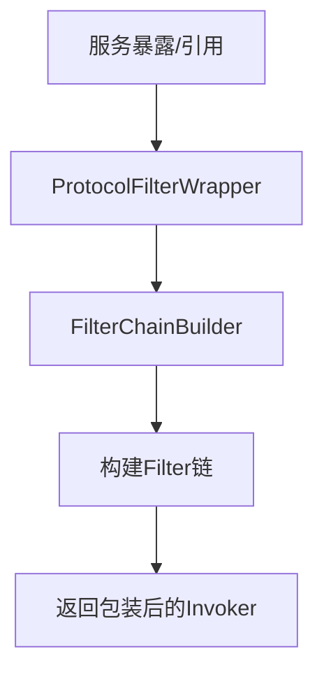
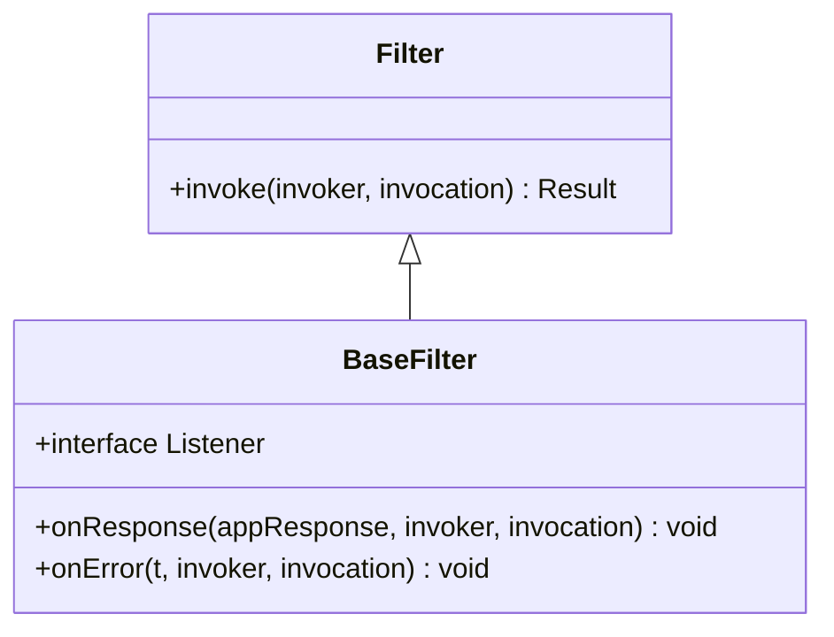
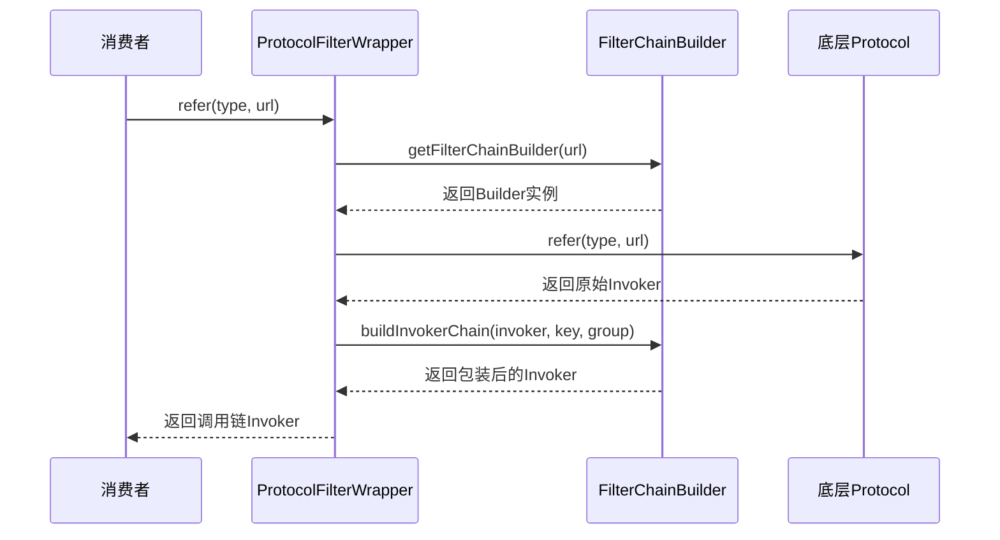
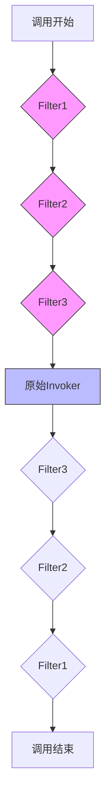

# 调用链构建

<cite>
**本文档引用的文件**   
- [Filter.java](file://dubbo-rpc\dubbo-rpc-api\src\main\java\org\apache\dubbo\rpc\Filter.java)
- [BaseFilter.java](file://dubbo-rpc\dubbo-rpc-api\src\main\java\org\apache\dubbo\rpc\BaseFilter.java)
- [ProtocolFilterWrapper.java](file://dubbo-cluster\src\main\java\org\apache\dubbo\rpc\cluster\filter\ProtocolFilterWrapper.java)
- [FilterChainBuilder.java](file://dubbo-cluster\src\main\java\org\apache\dubbo\rpc\cluster\filter\FilterChainBuilder.java)
- [DefaultFilterChainBuilder.java](file://dubbo-cluster\src\main\java\org\apache\dubbo\rpc\cluster\filter\DefaultFilterChainBuilder.java)
- [GenericFilter.java](file://dubbo-rpc\dubbo-rpc-api\src\main\java\org\apache\dubbo\rpc\filter\GenericFilter.java)
</cite>

## 目录
1. [引言](#引言)
2. [调用链构建概述](#调用链构建概述)
3. [Filter接口设计原理](#filter接口设计原理)
4. [ProtocolFilterWrapper调用链构建机制](#protocolfilterwrapper调用链构建机制)
5. [调用链执行流程与责任链模式](#调用链执行流程与责任链模式)
6. [自定义Filter实现方法](#自定义filter实现方法)
7. [调用链示例](#调用链示例)
8. [性能监控指标](#性能监控指标)

## 引言
调用链是Dubbo框架中实现服务治理、监控、安全等非功能性需求的核心机制。通过Filter拦截器模式，Dubbo能够在不修改业务代码的情况下，为远程调用添加各种横切关注点。本文档详细介绍了Dubbo调用链的构建过程、拦截器机制以及相关组件的设计原理。

## 调用链构建概述
Dubbo的调用链构建基于责任链模式（Chain of Responsibility Pattern），通过一系列Filter拦截器串联形成调用链。每个Filter都可以在调用前后执行特定逻辑，如日志记录、性能监控、安全验证等。调用链的构建主要由ProtocolFilterWrapper和FilterChainBuilder两个核心组件完成。

调用链的构建发生在服务暴露（export）和服务引用（refer）两个阶段：
- 服务提供方：在export方法中构建服务端调用链
- 服务消费方：在refer方法中构建客户端调用链



**调用链示例**
- [ProtocolFilterWrapper.java](file://dubbo-cluster\src\main\java\org\apache\dubbo\rpc\cluster\filter\ProtocolFilterWrapper.java#L53-L58)
- [FilterChainBuilder.java](file://dubbo-cluster\src\main\java\org\apache\dubbo\rpc\cluster\filter\FilterChainBuilder.java#L48-L53)

## Filter接口设计原理
Filter接口是Dubbo调用链机制的基础，定义了拦截器的基本行为。Filter接口继承自BaseFilter接口，主要包含invoke方法和Listener内部接口。

### Filter核心接口
Filter接口的核心是invoke方法，它接收Invoker和Invocation两个参数，返回Result对象。invoke方法的实现需要遵循特定的模式：在适当的位置调用nextInvoker.invoke()将请求传递给链中的下一个节点。

```java
Result invoke(Invoker<?> invoker, Invocation invocation) throws RpcException;
```

### Listener回调机制
Filter接口定义了Listener内部接口，用于处理调用结果的回调。Listener包含两个方法：
- onResponse：当调用成功返回时触发
- onError：当调用发生异常时触发

这种设计使得Filter可以在调用完成后执行清理工作或记录日志，而不需要在finally块中处理，提高了代码的可读性和可维护性。



**Filter接口设计**
- [Filter.java](file://dubbo-rpc\dubbo-rpc-api\src\main\java\org\apache\dubbo\rpc\Filter.java#L23-L53)
- [BaseFilter.java](file://dubbo-rpc\dubbo-rpc-api\src\main\java\org\apache\dubbo\rpc\BaseFilter.java#L23-L53)

## ProtocolFilterWrapper调用链构建机制
ProtocolFilterWrapper是调用链构建的关键组件，作为Protocol的装饰器，它在服务暴露和引用时负责构建Filter调用链。

### 服务暴露阶段
在export方法中，ProtocolFilterWrapper首先检查URL是否为注册中心地址。如果不是，则通过FilterChainBuilder构建服务端调用链，然后将包装后的Invoker传递给底层Protocol。

```java
public <T> Exporter<T> export(Invoker<T> invoker) throws RpcException {
    if (UrlUtils.isRegistry(invoker.getUrl())) {
        return protocol.export(invoker);
    }
    FilterChainBuilder builder = getFilterChainBuilder(invoker.getUrl());
    return protocol.export(builder.buildInvokerChain(invoker, SERVICE_FILTER_KEY, CommonConstants.PROVIDER));
}
```

### 服务引用阶段
在refer方法中，ProtocolFilterWrapper同样检查URL类型，然后通过FilterChainBuilder构建客户端调用链，将包装后的Invoker返回给调用方。

```java
public <T> Invoker<T> refer(Class<T> type, URL url) throws RpcException {
    if (UrlUtils.isRegistry(url)) {
        return protocol.refer(type, url);
    }
    FilterChainBuilder builder = getFilterChainBuilder(url);
    return builder.buildInvokerChain(protocol.refer(type, url), REFERENCE_FILTER_KEY, CommonConstants.CONSUMER);
}
```

### FilterChainBuilder获取机制
ProtocolFilterWrapper通过ScopeModelUtil.getExtensionLoader获取FilterChainBuilder的实例，这体现了Dubbo的扩展机制。

```java
private <T> FilterChainBuilder getFilterChainBuilder(URL url) {
    return ScopeModelUtil.getExtensionLoader(FilterChainBuilder.class, url.getScopeModel())
            .getDefaultExtension();
}
```



**ProtocolFilterWrapper机制**
- [ProtocolFilterWrapper.java](file://dubbo-cluster\src\main\java\org\apache\dubbo\rpc\cluster\filter\ProtocolFilterWrapper.java#L53-L73)
- [FilterChainBuilder.java](file://dubbo-cluster\src\main\java\org\apache\dubbo\rpc\cluster\filter\FilterChainBuilder.java#L48-L53)

## 调用链执行流程与责任链模式
Dubbo调用链的执行遵循责任链模式，每个Filter节点负责处理请求并决定是否将请求传递给下一个节点。

### FilterChainNode结构
FilterChainBuilder通过FilterChainNode类实现责任链模式。每个FilterChainNode包含三个关键字段：
- originalInvoker：原始的Invoker实例
- nextNode：链中的下一个节点
- filter：当前节点的Filter实例

```java
class FilterChainNode<T, TYPE extends Invoker<T>, FILTER extends BaseFilter> implements Invoker<T> {
    TYPE originalInvoker;
    Invoker<T> nextNode;
    FILTER filter;
}
```

### 调用链构建过程
调用链的构建过程是从后往前构建的。DefaultFilterChainBuilder首先获取所有激活的Filter列表，然后从列表末尾开始，逐个创建FilterChainNode实例，将前一个节点作为下一个节点的nextNode。

```java
for (int i = filters.size() - 1; i >= 0; i--) {
    final Filter filter = filters.get(i);
    final Invoker<T> next = last;
    last = new CopyOfFilterChainNode<>(originalInvoker, next, filter);
}
```

### 调用执行流程
当调用发生时，请求从调用链的头部开始，依次经过每个Filter节点。每个Filter的invoke方法负责执行自己的逻辑，并在适当的位置调用nextNode.invoke()将请求传递给下一个节点。



### 异步回调处理
对于异步调用，Filter通过whenCompleteWithContext方法注册回调，确保在调用完成或发生异常时能够执行相应的处理逻辑。

```java
return asyncResult.whenCompleteWithContext((r, t) -> {
    InvocationProfilerUtils.releaseDetailProfiler(invocation);
    if (filter instanceof ListenableFilter) {
        ListenableFilter listenableFilter = ((ListenableFilter) filter);
        Filter.Listener listener = listenableFilter.listener(invocation);
        try {
            if (listener != null) {
                if (t == null) {
                    listener.onResponse(r, originalInvoker, invocation);
                } else {
                    listener.onError(t, originalInvoker, invocation);
                }
            }
        } finally {
            listenableFilter.removeListener(invocation);
        }
    }
});
```

**调用链执行流程**
- [FilterChainBuilder.java](file://dubbo-cluster\src\main\java\org\apache\dubbo\rpc\cluster\filter\FilterChainBuilder.java#L92-L142)
- [DefaultFilterChainBuilder.java](file://dubbo-cluster\src\main\java\org\apache\dubbo\rpc\cluster\filter\DefaultFilterChainBuilder.java#L68-L72)

## 自定义Filter实现方法
创建自定义Filter是扩展Dubbo功能的主要方式。实现自定义Filter需要遵循以下步骤：

### 基本实现步骤
1. 创建类实现Filter接口
2. 添加@Activate注解配置激活条件
3. 实现invoke方法
4. 可选：实现Listener接口处理回调

### @Activate注解配置
@Activate注解用于配置Filter的激活条件，主要属性包括：
- group：指定Filter适用的组（provider或consumer）
- value：指定URL参数名称，当参数存在时激活
- order：指定执行顺序

```java
@Activate(group = CommonConstants.PROVIDER, order = -20000)
public class GenericFilter implements Filter, Filter.Listener {
    // 实现代码
}
```

### invoke方法实现模式
invoke方法的实现应遵循以下模式：
1. 执行前置处理逻辑
2. 调用nextInvoker.invoke()传递请求
3. 处理返回结果或异常
4. 执行后置处理逻辑

```java
@Override
public Result invoke(Invoker<?> invoker, Invocation invocation) throws RpcException {
    // 前置处理
    try {
        // 调用下一个节点
        Result result = invoker.invoke(invocation);
        // 后置处理
        return result;
    } catch (Exception e) {
        // 异常处理
        throw e;
    }
}
```

### Listener回调实现
如果需要在调用完成后执行特定逻辑，可以实现Listener接口：

```java
@Override
public void onResponse(Result appResponse, Invoker<?> invoker, Invocation invocation) {
    // 处理成功响应
}

@Override
public void onError(Throwable t, Invoker<?> invoker, Invocation invocation) {
    // 处理异常
}
```

**自定义Filter实现**
- [GenericFilter.java](file://dubbo-rpc\dubbo-rpc-api\src\main\java\org\apache\dubbo\rpc\filter\GenericFilter.java#L74-L88)
- [BaseFilter.java](file://dubbo-rpc\dubbo-rpc-api\src\main\java\org\apache\dubbo\rpc\BaseFilter.java#L32-L53)

## 调用链示例
### 简单调用链示例
对于初学者，以下是一个简单的调用链示例：

```java
// 1. 定义简单的日志Filter
@Activate(group = "provider")
public class SimpleLogFilter implements Filter {
    private static final Logger logger = LoggerFactory.getLogger(SimpleLogFilter.class);
    
    @Override
    public Result invoke(Invoker<?> invoker, Invocation invocation) throws RpcException {
        logger.info("调用开始: " + invocation.getMethodName());
        try {
            Result result = invoker.invoke(invocation);
            logger.info("调用成功: " + invocation.getMethodName());
            return result;
        } catch (Exception e) {
            logger.error("调用失败: " + invocation.getMethodName(), e);
            throw e;
        }
    }
}
```

### 复杂调用链配置
对于经验丰富的开发者，可以配置复杂的调用链：

```java
// 1. 配置多个Filter
@Activate(group = {"provider", "consumer"}, value = "myfilter", order = 100)
public class ComplexFilter implements Filter, Filter.Listener {
    
    @Override
    public Result invoke(Invoker<?> invoker, Invocation invocation) throws RpcException {
        // 性能监控开始
        long startTime = System.currentTimeMillis();
        
        try {
            // 上下文设置
            RpcContext.getContext().setAttachment("startTime", String.valueOf(startTime));
            
            // 调用下一个节点
            Result result = invoker.invoke(invocation);
            
            // 性能监控结束
            long cost = System.currentTimeMillis() - startTime;
            Metrics.record("rpc.cost", cost);
            
            return result;
        } catch (Exception e) {
            // 错误处理
            Metrics.increment("rpc.error");
            throw e;
        }
    }
    
    @Override
    public void onResponse(Result appResponse, Invoker<?> invoker, Invocation invocation) {
        // 响应后处理
        Metrics.increment("rpc.success");
    }
    
    @Override
    public void onError(Throwable t, Invoker<?> invoker, Invocation invocation) {
        // 异常后处理
        Metrics.increment("rpc.failure");
    }
}
```

**调用链示例**
- [GenericFilter.java](file://dubbo-rpc\dubbo-rpc-api\src\main\java\org\apache\dubbo\rpc\filter\GenericFilter.java#L88-L223)
- [FilterChainBuilder.java](file://dubbo-cluster\src\main\java\org\apache\dubbo\rpc\cluster\filter\FilterChainBuilder.java#L92-L142)

## 性能监控指标
调用链机制为性能监控提供了基础支持，可以通过以下指标进行监控：

### 核心性能指标
| 指标名称 | 说明 | 采集方式 |
|--------|------|---------|
| rpc.cost | 单次调用耗时 | 在Filter中记录开始和结束时间 |
| rpc.qps | 每秒请求数 | 统计单位时间内的调用次数 |
| rpc.error.rate | 错误率 | 错误次数/总调用次数 |
| rpc.success.rate | 成功率 | 成功次数/总调用次数 |
| filter.cost | 各Filter执行耗时 | 在每个Filter中单独计时 |

### 监控实现示例
```java
@Override
public Result invoke(Invoker<?> invoker, Invocation invocation) throws RpcException {
    // 开始性能监控
    InvocationProfilerUtils.enterDetailProfiler(
        invocation, () -> "Filter " + filter.getClass().getName() + " invoke.");
    
    try {
        // 执行Filter逻辑
        Result asyncResult = filter.invoke(nextNode, invocation);
        return asyncResult.whenCompleteWithContext((r, t) -> {
            // 结束性能监控
            InvocationProfilerUtils.releaseDetailProfiler(invocation);
            // 记录监控指标
            if (t == null) {
                Metrics.increment("rpc.success");
            } else {
                Metrics.increment("rpc.error");
            }
        });
    } catch (Exception e) {
        // 异常处理
        InvocationProfilerUtils.releaseDetailProfiler(invocation);
        throw e;
    }
}
```

### 监控数据采集
Dubbo通过InvocationProfilerUtils工具类提供性能监控支持，可以在Filter的invoke方法中使用：

```java
// 进入Profiler
InvocationProfilerUtils.enterDetailProfiler(invocation, () -> "Filter执行");

// 退出Profiler
InvocationProfilerUtils.releaseDetailProfiler(invocation);
```

**性能监控指标**
- [FilterChainBuilder.java](file://dubbo-cluster\src\main\java\org\apache\dubbo\rpc\cluster\filter\FilterChainBuilder.java#L95-L96)
- [FilterChainBuilder.java](file://dubbo-cluster\src\main\java\org\apache\dubbo\rpc\cluster\filter\FilterChainBuilder.java#L119-L120)