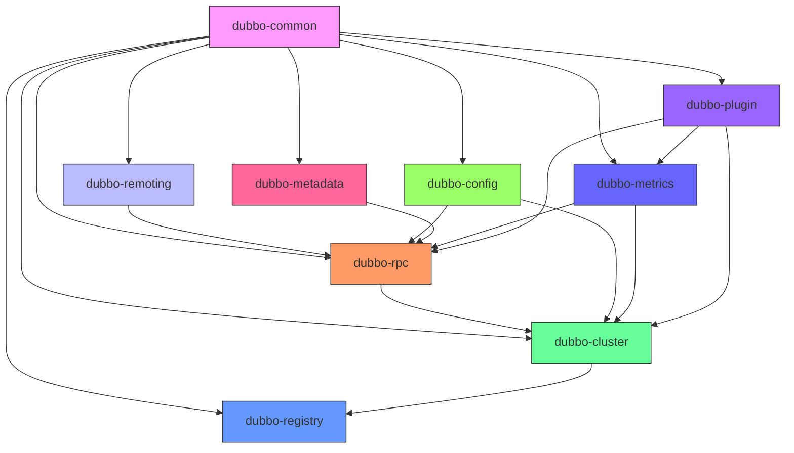

# 模块架构

<cite>
**本文档中引用的文件**  
- [dubbo-common/pom.xml](file://dubbo-common/pom.xml)
- [dubbo-remoting/pom.xml](file://dubbo-remoting/pom.xml)
- [dubbo-rpc/pom.xml](file://dubbo-rpc/pom.xml)
- [dubbo-cluster/pom.xml](file://dubbo-cluster/pom.xml)
- [dubbo-registry/pom.xml](file://dubbo-registry/pom.xml)
- [dubbo-config/pom.xml](file://dubbo-config/pom.xml)
- [dubbo-metadata/pom.xml](file://dubbo-metadata/pom.xml)
- [dubbo-metrics/pom.xml](file://dubbo-metrics/pom.xml)
- [dubbo-plugin/pom.xml](file://dubbo-plugin/pom.xml)
- [pom.xml](file://pom.xml)
</cite>

## 目录
1. [简介](#简介)
2. [核心模块概览](#核心模块概览)
3. [dubbo-common模块](#dubbo-common模块)
4. [dubbo-remoting模块](#dubbo-remoting模块)
5. [dubbo-rpc模块](#dubbo-rpc模块)
6. [dubbo-cluster模块](#dubbo-cluster模块)
7. [dubbo-registry模块](#dubbo-registry模块)
8. [dubbo-config模块](#dubbo-config模块)
9. [dubbo-metadata模块](#dubbo-metadata模块)
10. [dubbo-metrics模块](#dubbo-metrics模块)
11. [dubbo-plugin模块](#dubbo-plugin模块)
12. [模块依赖关系图](#模块依赖关系图)
13. [结论](#结论)

## 简介
Apache Dubbo是一个高性能的Java RPC框架，采用模块化设计，将不同的功能分离到独立的模块中，以提高代码的可维护性和可扩展性。本文档详细介绍了Dubbo的模块架构，重点分析了每个核心模块的功能、责任和内部结构。通过理解这些模块的设计和交互方式，开发者可以更好地掌握Dubbo的工作原理，并根据需要进行定制和扩展。

## 核心模块概览
Dubbo的模块化设计遵循高内聚、低耦合的原则，将复杂的分布式服务框架分解为多个职责明确的模块。这些模块通过清晰的接口进行通信，形成了一个灵活且可扩展的架构。主要的核心模块包括：

- **dubbo-common**: 提供基础工具类和SPI扩展机制
- **dubbo-remoting**: 负责网络通信，支持多种协议
- **dubbo-rpc**: 定义远程调用规范，实现RPC协议
- **dubbo-cluster**: 提供负载均衡和容错机制
- **dubbo-registry**: 支持多种注册中心实现
- **dubbo-config**: 负责配置管理
- **dubbo-metadata**: 管理服务元数据
- **dubbo-metrics**: 提供指标监控功能
- **dubbo-plugin**: 实现插件化架构

这些模块共同构成了Dubbo的核心功能，每个模块都可以独立发展和演进，同时通过标准接口与其他模块协同工作。

## dubbo-common模块
dubbo-common模块是Dubbo框架的基础模块，为其他所有模块提供公共组件和基础设施。该模块包含了框架运行所需的核心工具类、数据结构和扩展机制。

作为Dubbo的基石，dubbo-common模块提供了SPI（Service Provider Interface）扩展机制，这是Dubbo实现可插拔架构的关键。通过SPI机制，开发者可以轻松地替换或扩展框架的各个组件，而无需修改核心代码。这种设计使得Dubbo具有极高的灵活性和可定制性。

该模块还提供了丰富的工具类，包括配置管理、类型转换、序列化、反射操作等，这些工具被其他模块广泛使用。此外，dubbo-common还定义了框架级别的常量、异常和通用数据结构，确保了整个框架的一致性和稳定性。

**Section sources**
- [dubbo-common/pom.xml](file://dubbo-common/pom.xml)

## dubbo-remoting模块
dubbo-remoting模块负责Dubbo框架的网络通信能力，为上层的RPC调用提供可靠的传输层支持。该模块采用抽象化设计，将网络通信的具体实现与协议处理分离，支持多种网络协议和传输方式。

该模块的核心是抽象的Remoting API，定义了Channel、Transporter、Client、Server等接口，为不同的网络协议实现提供了统一的编程模型。通过这种设计，Dubbo可以轻松支持Netty、HTTP、WebSocket等多种网络协议，满足不同场景下的通信需求。

dubbo-remoting模块的架构具有良好的扩展性，新的协议实现可以通过插件方式添加，而不会影响现有代码。这种设计使得Dubbo能够适应不断变化的网络环境和技术需求，保持框架的先进性和竞争力。

**Section sources**
- [dubbo-remoting/pom.xml](file://dubbo-remoting/pom.xml)

## dubbo-rpc模块
dubbo-rpc模块定义了Dubbo远程调用的核心规范和实现，是框架RPC功能的核心。该模块抽象了远程调用的通用概念，如Invoker、Invocation、Result等，为不同的RPC协议提供了统一的编程接口。

该模块通过Protocol接口定义了服务暴露和引用的标准流程，实现了Dubbo的"一次编写，到处运行"的理念。不同的RPC协议（如Dubbo协议、Triple协议等）通过实现Protocol接口来提供具体的远程调用能力，而上层应用无需关心底层协议的差异。

dubbo-rpc模块还提供了Filter机制，允许在远程调用的各个阶段插入自定义逻辑，如日志记录、性能监控、安全验证等。这种设计使得框架功能可以灵活扩展，同时保持核心逻辑的简洁性。

**Section sources**
- [dubbo-rpc/pom.xml](file://dubbo-rpc/pom.xml)

## dubbo-cluster模块
dubbo-cluster模块为Dubbo提供了强大的集群管理能力，包括负载均衡、容错处理和集群路由等功能。该模块在服务消费者和服务提供者之间起到了桥梁作用，确保了服务调用的高可用性和高性能。

该模块的核心是Cluster接口，定义了如何将多个服务提供者组织成一个逻辑上的服务集群。通过不同的Cluster实现（如Failover、Failfast、Failsafe等），Dubbo可以提供多种容错策略，适应不同的业务场景需求。

负载均衡功能由LoadBalance接口实现，支持随机、轮询、最少活跃调用数等多种算法。这些算法可以根据服务提供者的健康状况和负载情况，智能地分配请求，最大化系统资源利用率。

**Section sources**
- [dubbo-cluster/pom.xml](file://dubbo-cluster/pom.xml)

## dubbo-registry模块
dubbo-registry模块实现了Dubbo的服务注册与发现功能，支持多种注册中心实现。该模块通过抽象的Registry接口，将服务注册发现的通用逻辑与具体注册中心的实现分离，实现了注册中心的可插拔。

该模块支持ZooKeeper、Nacos、Multicast等多种注册中心，开发者可以根据实际需求选择合适的注册中心。通过统一的接口设计，切换注册中心实现时，上层应用几乎无需修改代码。

dubbo-registry模块还提供了服务目录（Directory）和路由（Router）功能，可以根据各种条件（如应用名、版本号、分组等）对服务提供者进行筛选和路由，实现了灵活的服务治理能力。

**Section sources**
- [dubbo-registry/pom.xml](file://dubbo-registry/pom.xml)

## dubbo-config模块
dubbo-config模块负责Dubbo的配置管理功能，提供了声明式配置和编程式配置两种方式。该模块通过Config API将复杂的RPC配置简化为易于使用的配置对象，降低了使用门槛。

该模块的核心是各种Config类（如ApplicationConfig、ProtocolConfig、ServiceConfig等），这些类对应Dubbo配置文件中的各个元素，提供了类型安全的配置方式。通过这些配置类，开发者可以以编程方式构建和管理Dubbo服务的配置。

dubbo-config模块还与Spring框架深度集成，支持通过Spring的Bean配置方式来定义Dubbo服务，使得Dubbo可以无缝融入Spring生态系统。这种设计既保持了配置的灵活性，又提供了良好的开发体验。

**Section sources**
- [dubbo-config/pom.xml](file://dubbo-config/pom.xml)

## dubbo-metadata模块
dubbo-metadata模块负责管理Dubbo服务的元数据信息，包括服务接口定义、方法签名、参数类型等。该模块为服务治理、动态配置、服务测试等功能提供了必要的元数据支持。

该模块通过元数据报告（Metadata Report）机制，将服务的元数据信息发布到注册中心或其他存储系统，使得服务治理平台可以获取和分析服务的详细信息。这种设计实现了服务元数据的集中管理和共享。

dubbo-metadata模块还支持多种元数据存储实现，如ZooKeeper、Nacos等，可以根据部署环境选择合适的存储方式。通过统一的元数据接口，上层应用可以透明地访问服务元数据，而无需关心底层存储的差异。

**Section sources**
- [dubbo-metadata/pom.xml](file://dubbo-metadata/pom.xml)

## dubbo-metrics模块
dubbo-metrics模块为Dubbo提供了全面的指标监控功能，支持多种监控系统集成。该模块通过收集和暴露框架运行时的各种指标，帮助开发者了解系统运行状况，及时发现和解决问题。

该模块的核心是Metrics API，定义了计数器、计量器、定时器等基本指标类型，为不同监控系统的集成提供了统一的接口。通过这种设计，Dubbo可以轻松集成Prometheus、Micrometer等主流监控系统。

dubbo-metrics模块还提供了事件总线机制，允许其他模块发布和订阅框架级别的事件，实现了松耦合的监控和告警功能。这种设计使得监控功能可以灵活扩展，同时保持核心逻辑的简洁性。

**Section sources**
- [dubbo-metrics/pom.xml](file://dubbo-metrics/pom.xml)

## dubbo-plugin模块
dubbo-plugin模块实现了Dubbo的插件化架构，为框架功能的扩展提供了标准化的方式。该模块通过定义清晰的扩展点和插件接口，使得第三方开发者可以轻松地为Dubbo添加新功能。

该模块支持多种类型的插件，包括QoS（Quality of Service）、安全认证、编译器、过滤器等。每个插件都遵循统一的生命周期管理，确保了插件的稳定性和可靠性。

dubbo-plugin模块的设计体现了Dubbo的开放性和可扩展性，通过插件机制，Dubbo可以不断吸收社区的创新，保持技术的先进性。这种设计也降低了框架的复杂性，核心代码只需关注基本功能，扩展功能由插件实现。

**Section sources**
- [dubbo-plugin/pom.xml](file://dubbo-plugin/pom.xml)

## 模块依赖关系图
以下图表展示了Dubbo核心模块之间的依赖关系，帮助理解各模块的层次结构和交互方式。

**Diagram sources**
- [pom.xml](file://pom.xml)
- [dubbo-common/pom.xml](file://dubbo-common/pom.xml)
- [dubbo-remoting/pom.xml](file://dubbo-remoting/pom.xml)
- [dubbo-rpc/pom.xml](file://dubbo-rpc/pom.xml)
- [dubbo-cluster/pom.xml](file://dubbo-cluster/pom.xml)
- [dubbo-registry/pom.xml](file://dubbo-registry/pom.xml)
- [dubbo-config/pom.xml](file://dubbo-config/pom.xml)
- [dubbo-metadata/pom.xml](file://dubbo-metadata/pom.xml)
- [dubbo-metrics/pom.xml](file://dubbo-metrics/pom.xml)
- [dubbo-plugin/pom.xml](file://dubbo-plugin/pom.xml)

## 结论
Dubbo的模块化设计体现了良好的软件工程实践，通过将复杂的分布式服务框架分解为多个职责明确的模块，实现了高内聚、低耦合的架构。每个核心模块都专注于特定的功能领域，通过清晰的接口与其他模块交互，形成了一个灵活且可扩展的系统。

这种模块化设计带来了诸多优势：首先，它提高了代码的可维护性，每个模块可以独立开发、测试和演进；其次，它增强了框架的可扩展性，新的功能可以通过新增模块或插件的方式添加；最后，它降低了学习和使用门槛，开发者可以根据需要深入了解特定模块，而无需掌握整个框架的全部细节。

通过理解Dubbo的模块架构，开发者可以更好地利用框架提供的功能，根据实际需求进行定制和优化，充分发挥Dubbo在构建高性能分布式系统中的优势。