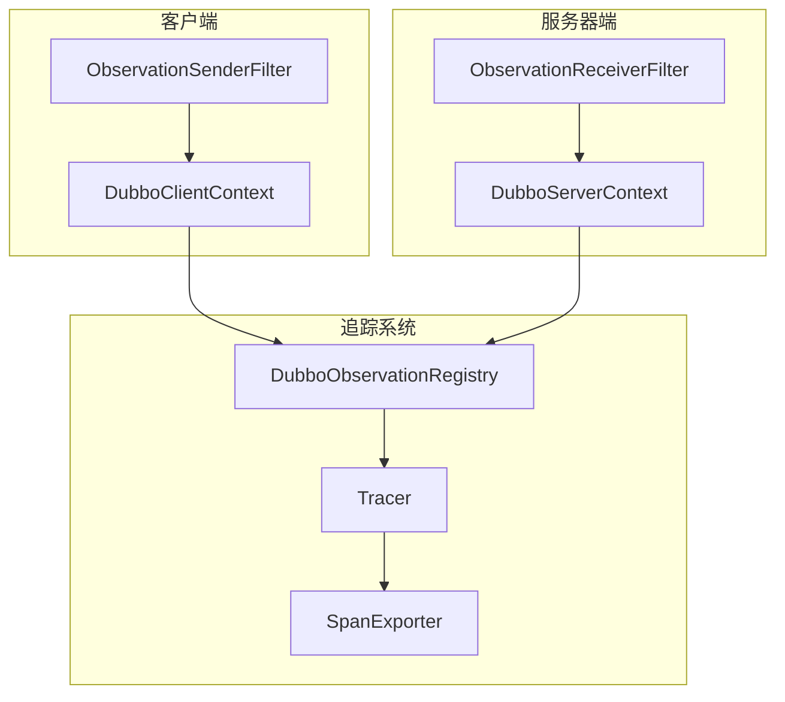
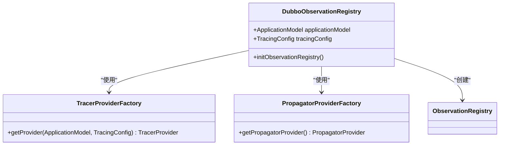
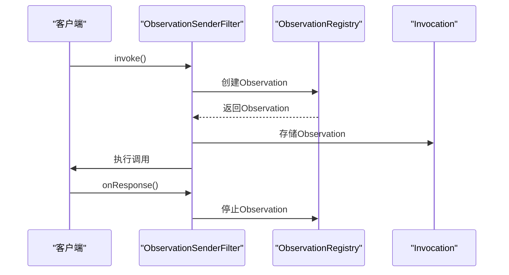
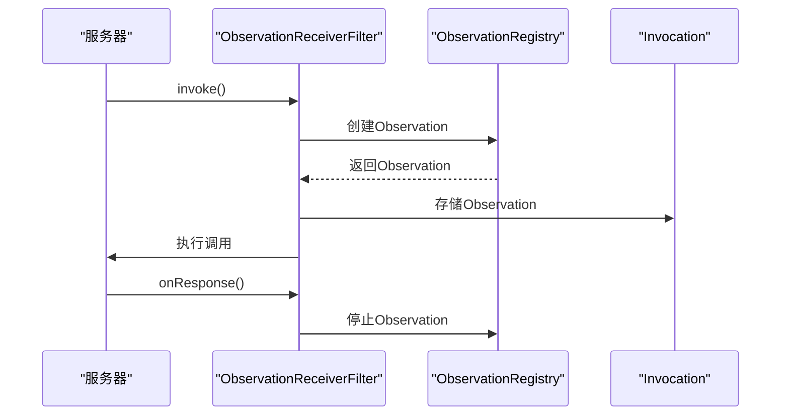
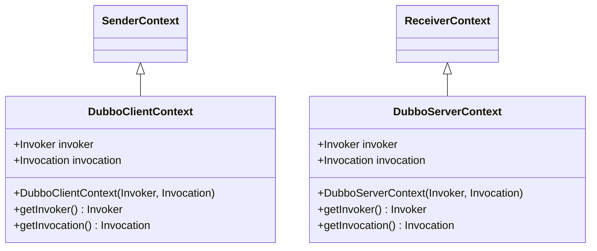
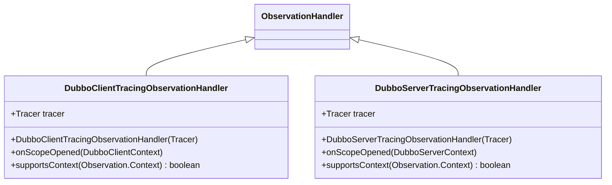
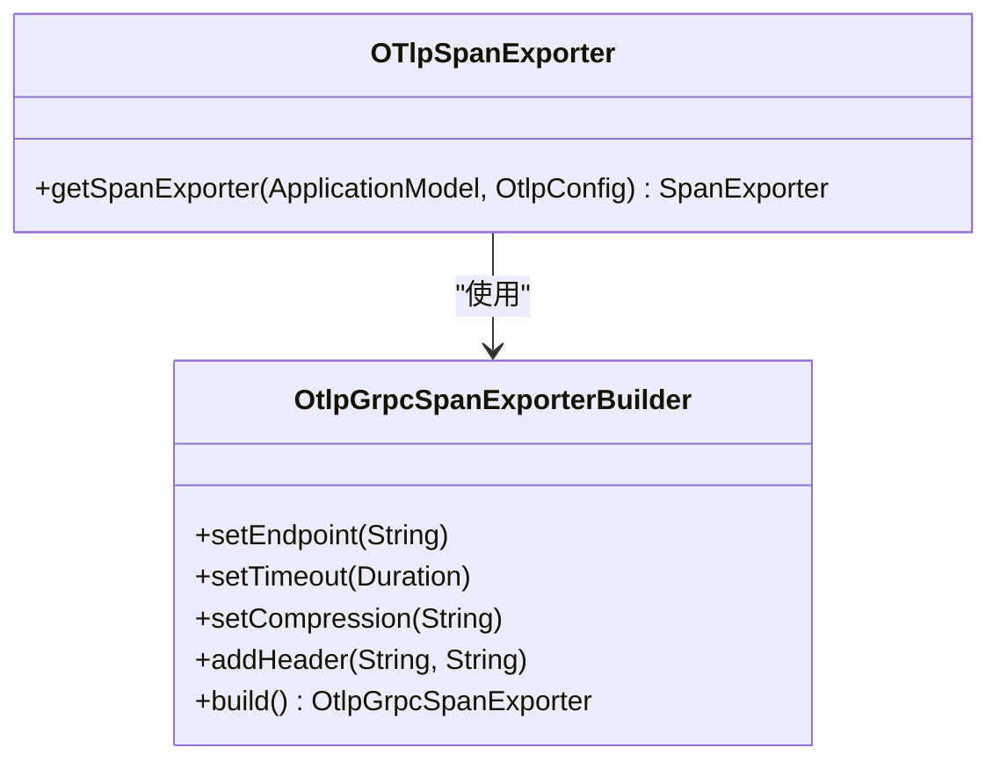
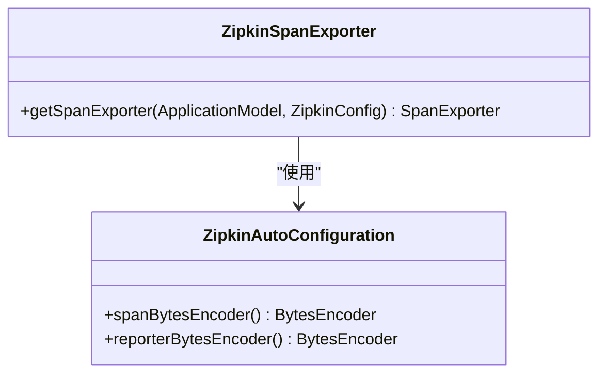
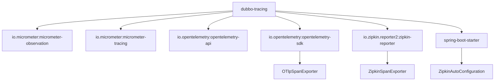

# 分布式追踪

<cite>
**本文档中引用的文件**  
- [DubboObservationRegistry.java](file://dubbo-metrics/dubbo-tracing/src/main/java/org/apache/dubbo/tracing/DubboObservationRegistry.java)
- [ObservationSenderFilter.java](file://dubbo-metrics/dubbo-tracing/src/main/java/org/apache/dubbo/tracing/filter/ObservationSenderFilter.java)
- [ObservationReceiverFilter.java](file://dubbo-metrics/dubbo-tracing/src/main/java/org/apache/dubbo/tracing/filter/ObservationReceiverFilter.java)
- [DubboClientTracingObservationHandler.java](file://dubbo-metrics/dubbo-tracing/src/main/java/org/apache/dubbo/tracing/handler/DubboClientTracingObservationHandler.java)
- [DubboServerTracingObservationHandler.java](file://dubbo-metrics/dubbo-tracing/src/main/java/org/apache/dubbo/tracing/handler/DubboServerTracingObservationHandler.java)
- [DubboClientContext.java](file://dubbo-metrics/dubbo-tracing/src/main/java/org/apache/dubbo/tracing/context/DubboClientContext.java)
- [DubboServerContext.java](file://dubbo-metrics/dubbo-tracing/src/main/java/org/apache/dubbo/tracing/context/DubboServerContext.java)
- [OTlpSpanExporter.java](file://dubbo-metrics/dubbo-tracing/src/main/java/org/apache/dubbo/tracing/exporter/otlp/OTlpSpanExporter.java)
- [ZipkinSpanExporter.java](file://dubbo-metrics/dubbo-tracing/src/main/java/org/apache/dubbo/tracing/exporter/zipkin/ZipkinSpanExporter.java)
- [OpenTelemetryProvider.java](file://dubbo-metrics/dubbo-tracing/src/main/java/org/apache/dubbo/tracing/tracer/otel/OpenTelemetryProvider.java)
- [OTelPropagatorProvider.java](file://dubbo-metrics/dubbo-tracing/src/main/java/org/apache/dubbo/tracing/tracer/otel/OTelPropagatorProvider.java)
- [ZipkinAutoConfiguration.java](file://dubbo-spring-boot-project/dubbo-spring-boot-autoconfigure/src/main/java/org/apache/dubbo/spring/boot/autoconfigure/observability/zipkin/ZipkinAutoConfiguration.java)
</cite>

## 目录
1. [简介](#简介)
2. [核心组件](#核心组件)
3. [架构概述](#架构概述)
4. [详细组件分析](#详细组件分析)
5. [依赖分析](#依赖分析)
6. [性能考虑](#性能考虑)
7. [故障排除指南](#故障排除指南)
8. [结论](#结论)

## 简介
本文档详细介绍了Dubbo与OpenTelemetry集成的分布式追踪功能。重点阐述了DubboObservationRegistry如何管理追踪上下文和观测器，以及DubboClientTracingFilter和DubboServerTracingFilter在客户端和服务器端的工作原理。文档还说明了如何配置和使用不同的追踪后端，如Zipkin和OTLP，并提供了实际的代码示例来展示如何启用和配置分布式追踪功能。

## 核心组件
分布式追踪功能的核心组件包括DubboObservationRegistry、ObservationSenderFilter、ObservationReceiverFilter、DubboClientTracingObservationHandler和DubboServerTracingObservationHandler。这些组件共同协作，实现了Dubbo服务调用的全链路追踪。

**本节来源**
- [DubboObservationRegistry.java](file://dubbo-metrics/dubbo-tracing/src/main/java/org/apache/dubbo/tracing/DubboObservationRegistry.java)
- [ObservationSenderFilter.java](file://dubbo-metrics/dubbo-tracing/src/main/java/org/apache/dubbo/tracing/filter/ObservationSenderFilter.java)
- [ObservationReceiverFilter.java](file://dubbo-metrics/dubbo-tracing/src/main/java/org/apache/dubbo/tracing/filter/ObservationReceiverFilter.java)

## 架构概述
Dubbo的分布式追踪架构基于Micrometer Observation和OpenTelemetry实现。通过ObservationRegistry管理追踪上下文，利用过滤器在客户端和服务器端创建和传播追踪信息，并通过不同的导出器将追踪数据发送到后端系统。

**图表来源**
- [DubboObservationRegistry.java](file://dubbo-metrics/dubbo-tracing/src/main/java/org/apache/dubbo/tracing/DubboObservationRegistry.java)
- [ObservationSenderFilter.java](file://dubbo-metrics/dubbo-tracing/src/main/java/org/apache/dubbo/tracing/filter/ObservationSenderFilter.java)
- [ObservationReceiverFilter.java](file://dubbo-metrics/dubbo-tracing/src/main/java/org/apache/dubbo/tracing/filter/ObservationReceiverFilter.java)

## 详细组件分析

### DubboObservationRegistry分析
DubboObservationRegistry是分布式追踪的核心管理器，负责初始化和管理追踪上下文。它通过TracerProviderFactory获取Tracer提供者，并创建ObservationRegistry实例来管理所有的观测操作。

**图表来源**
- [DubboObservationRegistry.java](file://dubbo-metrics/dubbo-tracing/src/main/java/org/apache/dubbo/tracing/DubboObservationRegistry.java)

**本节来源**
- [DubboObservationRegistry.java](file://dubbo-metrics/dubbo-tracing/src/main/java/org/apache/dubbo/tracing/DubboObservationRegistry.java)

### 追踪过滤器分析
Dubbo通过ObservationSenderFilter和ObservationReceiverFilter实现客户端和服务器端的追踪功能。这些过滤器在RPC调用过程中创建和管理追踪上下文。

#### 客户端追踪过滤器

**图表来源**
- [ObservationSenderFilter.java](file://dubbo-metrics/dubbo-tracing/src/main/java/org/apache/dubbo/tracing/filter/ObservationSenderFilter.java)

#### 服务器端追踪过滤器

**图表来源**
- [ObservationReceiverFilter.java](file://dubbo-metrics/dubbo-tracing/src/main/java/org/apache/dubbo/tracing/filter/ObservationReceiverFilter.java)

**本节来源**
- [ObservationSenderFilter.java](file://dubbo-metrics/dubbo-tracing/src/main/java/org/apache/dubbo/tracing/filter/ObservationSenderFilter.java)
- [ObservationReceiverFilter.java](file://dubbo-metrics/dubbo-tracing/src/main/java/org/apache/dubbo/tracing/filter/ObservationReceiverFilter.java)

### 追踪上下文分析
DubboClientContext和DubboServerContext分别代表客户端和服务器端的追踪上下文，它们继承自Micrometer的SenderContext和ReceiverContext，用于在RPC调用中传递追踪信息。

**图表来源**
- [DubboClientContext.java](file://dubbo-metrics/dubbo-tracing/src/main/java/org/apache/dubbo/tracing/context/DubboClientContext.java)
- [DubboServerContext.java](file://dubbo-metrics/dubbo-tracing/src/main/java/org/apache/dubbo/tracing/context/DubboServerContext.java)

**本节来源**
- [DubboClientContext.java](file://dubbo-metrics/dubbo-tracing/src/main/java/org/apache/dubbo/tracing/context/DubboClientContext.java)
- [DubboServerContext.java](file://dubbo-metrics/dubbo-tracing/src/main/java/org/apache/dubbo/tracing/context/DubboServerContext.java)

### 追踪处理器分析
DubboClientTracingObservationHandler和DubboServerTracingObservationHandler是追踪观察器的处理器，它们负责处理客户端和服务器端的追踪事件。

**图表来源**
- [DubboClientTracingObservationHandler.java](file://dubbo-metrics/dubbo-tracing/src/main/java/org/apache/dubbo/tracing/handler/DubboClientTracingObservationHandler.java)
- [DubboServerTracingObservationHandler.java](file://dubbo-metrics/dubbo-tracing/src/main/java/org/apache/dubbo/tracing/handler/DubboServerTracingObservationHandler.java)

**本节来源**
- [DubboClientTracingObservationHandler.java](file://dubbo-metrics/dubbo-tracing/src/main/java/org/apache/dubbo/tracing/handler/DubboClientTracingObservationHandler.java)
- [DubboServerTracingObservationHandler.java](file://dubbo-metrics/dubbo-tracing/src/main/java/org/apache/dubbo/tracing/handler/DubboServerTracingObservationHandler.java)

### 追踪后端配置
Dubbo支持多种追踪后端配置，包括OTLP和Zipkin。通过OpenTelemetryProvider和相应的导出器实现与不同后端的集成。

#### OTLP导出器

**图表来源**
- [OTlpSpanExporter.java](file://dubbo-metrics/dubbo-tracing/src/main/java/org/apache/dubbo/tracing/exporter/otlp/OTlpSpanExporter.java)

#### Zipkin导出器

**图表来源**
- [ZipkinSpanExporter.java](file://dubbo-metrics/dubbo-tracing/src/main/java/org/apache/dubbo/tracing/exporter/zipkin/ZipkinSpanExporter.java)
- [ZipkinAutoConfiguration.java](file://dubbo-spring-boot-project/dubbo-spring-boot-autoconfigure/src/main/java/org/apache/dubbo/spring/boot/autoconfigure/observability/zipkin/ZipkinAutoConfiguration.java)

**本节来源**
- [OTlpSpanExporter.java](file://dubbo-metrics/dubbo-tracing/src/main/java/org/apache/dubbo/tracing/exporter/otlp/OTlpSpanExporter.java)
- [ZipkinSpanExporter.java](file://dubbo-metrics/dubbo-tracing/src/main/java/org/apache/dubbo/tracing/exporter/zipkin/ZipkinSpanExporter.java)
- [ZipkinAutoConfiguration.java](file://dubbo-spring-boot-project/dubbo-spring-boot-autoconfigure/src/main/java/org/apache/dubbo/spring/boot/autoconfigure/observability/zipkin/ZipkinAutoConfiguration.java)

## 依赖分析
Dubbo的分布式追踪功能依赖于多个核心组件和外部库。这些依赖关系确保了追踪功能的完整性和可扩展性。

**图表来源**
- [pom.xml](file://dubbo-metrics/dubbo-tracing/pom.xml)
- [OpenTelemetryProvider.java](file://dubbo-metrics/dubbo-tracing/src/main/java/org/apache/dubbo/tracing/tracer/otel/OpenTelemetryProvider.java)

**本节来源**
- [pom.xml](file://dubbo-metrics/dubbo-tracing/pom.xml)

## 性能考虑
分布式追踪功能对系统性能有一定影响，主要体现在以下几个方面：

1. **追踪上下文传播**：每次RPC调用都需要在请求头中传递追踪信息，增加了网络传输开销。
2. **跨度创建和结束**：每个服务调用都需要创建和结束跨度，消耗CPU资源。
3. **数据导出**：追踪数据需要定期导出到后端系统，可能影响网络带宽。

为了减少性能影响，建议：
- 合理配置采样率，避免对所有请求进行追踪
- 使用批量导出模式，减少网络请求次数
- 选择高效的序列化格式

## 故障排除指南
在使用分布式追踪功能时，可能会遇到以下常见问题：

1. **追踪数据未显示**：检查追踪后端配置是否正确，确保端点地址可达。
2. **追踪上下文丢失**：确认客户端和服务器端都启用了追踪过滤器。
3. **性能下降**：调整采样率，优化导出配置。

**本节来源**
- [DubboObservationRegistry.java](file://dubbo-metrics/dubbo-tracing/src/main/java/org/apache/dubbo/tracing/DubboObservationRegistry.java)
- [OpenTelemetryProvider.java](file://dubbo-metrics/dubbo-tracing/src/main/java/org/apache/dubbo/tracing/tracer/otel/OpenTelemetryProvider.java)

## 结论
Dubbo通过与OpenTelemetry的集成，提供了强大的分布式追踪功能。通过DubboObservationRegistry统一管理追踪上下文，利用过滤器在客户端和服务器端实现追踪信息的传播，支持多种追踪后端配置。开发者可以根据需要启用和配置分布式追踪功能，实现服务调用的全链路监控。