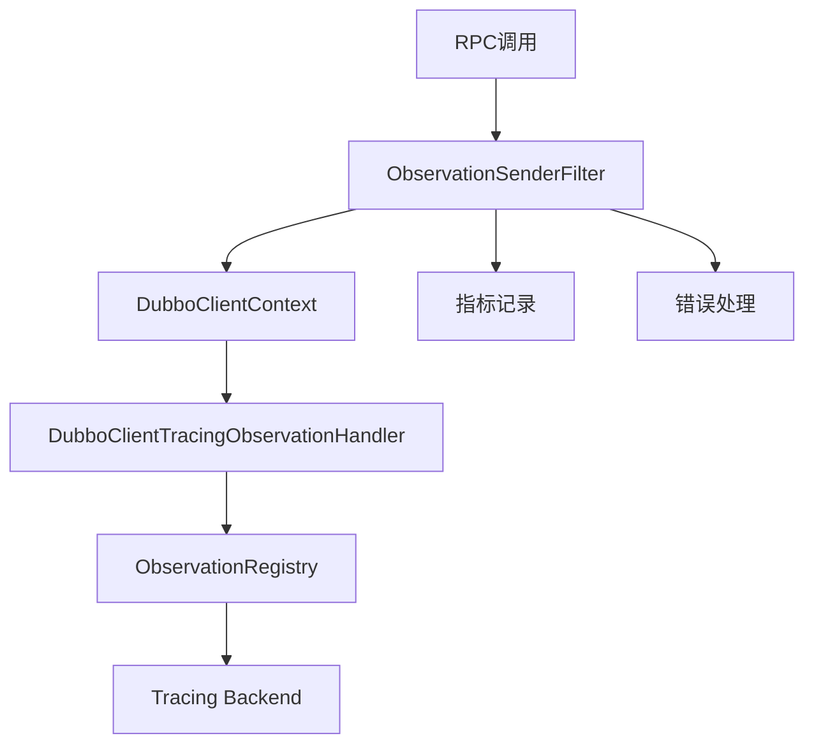
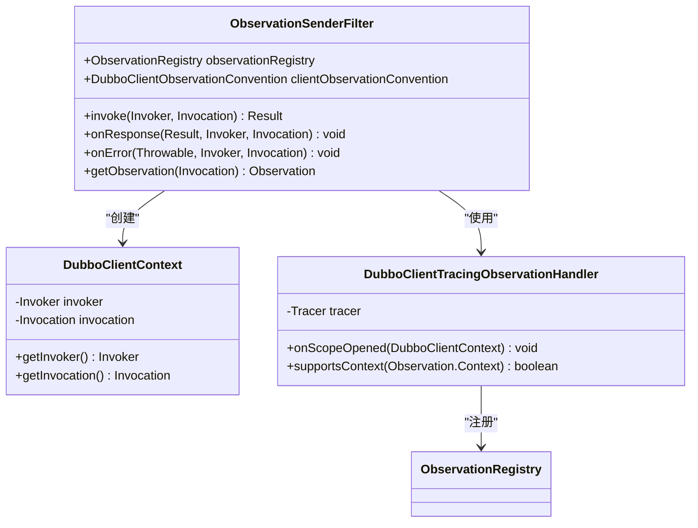
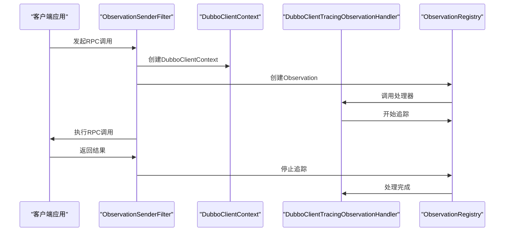
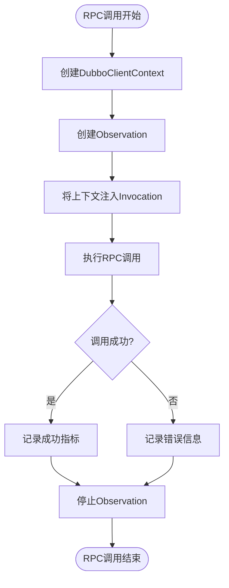
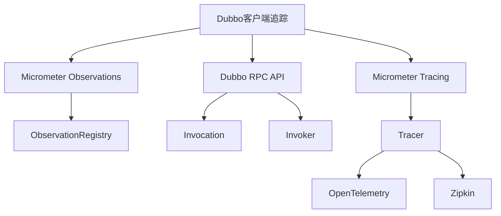

# 客户端追踪过滤器

<cite>
**本文档中引用的文件**  
- [ObservationSenderFilter.java](file://dubbo-metrics/dubbo-tracing/src/main/java/org/apache/dubbo/tracing/filter/ObservationSenderFilter.java)
- [DubboClientContext.java](file://dubbo-metrics/dubbo-tracing/src/main/java/org/apache/dubbo/tracing/context/DubboClientContext.java)
- [DubboClientTracingObservationHandler.java](file://dubbo-metrics/dubbo-tracing/src/main/java/org/apache/dubbo/tracing/handler/DubboClientTracingObservationHandler.java)
- [DefaultDubboClientObservationConvention.java](file://dubbo-metrics/dubbo-tracing/src/main/java/org/apache/dubbo/tracing/DefaultDubboClientObservationConvention.java)
- [DubboObservationDocumentation.java](file://dubbo-metrics/dubbo-tracing/src/main/java/org/apache/dubbo/tracing/DubboObservationDocumentation.java)
- [DubboMicrometerTracingAutoConfiguration.java](file://dubbo-spring-boot-project/dubbo-spring-boot-autoconfigure/src/main/java/org/apache/dubbo/spring/boot/autoconfigure/observability/DubboMicrometerTracingAutoConfiguration.java)
- [pom.xml](file://dubbo-metrics/dubbo-tracing/pom.xml)
</cite>

## 目录
1. [简介](#简介)
2. [核心组件](#核心组件)
3. [架构概述](#架构概述)
4. [详细组件分析](#详细组件分析)
5. [依赖分析](#依赖分析)
6. [性能考虑](#性能考虑)
7. [故障排除指南](#故障排除指南)
8. [结论](#结论)

## 简介
本文档详细介绍了Dubbo客户端追踪过滤器的实现和工作原理。重点分析了`ObservationSenderFilter`如何在RPC调用发起前创建新的追踪跨度，并将追踪上下文注入到请求中。文档还解释了该过滤器与Dubbo过滤器链的集成方式、执行时机、异步调用的上下文传播机制，以及关键指标的记录方法。同时提供了配置和启用客户端追踪功能的实际示例。

## 核心组件
客户端追踪功能主要由`ObservationSenderFilter`、`DubboClientContext`、`DubboClientTracingObservationHandler`等核心组件构成。这些组件协同工作，实现了完整的客户端追踪功能，包括追踪上下文的创建、传播、指标记录和错误处理。

**本节来源**  
- [ObservationSenderFilter.java](file://dubbo-metrics/dubbo-tracing/src/main/java/org/apache/dubbo/tracing/filter/ObservationSenderFilter.java)
- [DubboClientContext.java](file://dubbo-metrics/dubbo-tracing/src/main/java/org/apache/dubbo/tracing/context/DubboClientContext.java)
- [DubboClientTracingObservationHandler.java](file://dubbo-metrics/dubbo-tracing/src/main/java/org/apache/dubbo/tracing/handler/DubboClientTracingObservationHandler.java)

## 架构概述
客户端追踪过滤器基于Micrometer Observations框架构建，通过Dubbo的过滤器机制在RPC调用的关键节点插入追踪逻辑。整体架构分为三个主要层次：过滤器层负责拦截RPC调用，上下文层管理追踪数据，处理器层负责具体的追踪操作。

**图表来源**  
- [ObservationSenderFilter.java](file://dubbo-metrics/dubbo-tracing/src/main/java/org/apache/dubbo/tracing/filter/ObservationSenderFilter.java)
- [DubboClientContext.java](file://dubbo-metrics/dubbo-tracing/src/main/java/org/apache/dubbo/tracing/context/DubboClientContext.java)
- [DubboClientTracingObservationHandler.java](file://dubbo-metrics/dubbo-tracing/src/main/java/org/apache/dubbo/tracing/handler/DubboClientTracingObservationHandler.java)

## 详细组件分析

### ObservationSenderFilter分析
`ObservationSenderFilter`是客户端追踪的核心过滤器，实现了Dubbo的`ClusterFilter`接口。该过滤器在RPC调用发起前创建追踪观察，并在调用完成后记录结果。

#### 对象导向组件

**图表来源**  
- [ObservationSenderFilter.java](file://dubbo-metrics/dubbo-tracing/src/main/java/org/apache/dubbo/tracing/filter/ObservationSenderFilter.java)
- [DubboClientContext.java](file://dubbo-metrics/dubbo-tracing/src/main/java/org/apache/dubbo/tracing/context/DubboClientContext.java)
- [DubboClientTracingObservationHandler.java](file://dubbo-metrics/dubbo-tracing/src/main/java/org/apache/dubbo/tracing/handler/DubboClientTracingObservationHandler.java)

#### API/服务组件

**图表来源**  
- [ObservationSenderFilter.java](file://dubbo-metrics/dubbo-tracing/src/main/java/org/apache/dubbo/tracing/filter/ObservationSenderFilter.java)
- [DubboClientTracingObservationHandler.java](file://dubbo-metrics/dubbo-tracing/src/main/java/org/apache/dubbo/tracing/handler/DubboClientTracingObservationHandler.java)

### 追踪上下文传播
客户端追踪过滤器通过`DubboClientContext`管理追踪上下文，确保在异步调用中上下文能够正确传播。

**图表来源**  
- [ObservationSenderFilter.java](file://dubbo-metrics/dubbo-tracing/src/main/java/org/apache/dubbo/tracing/filter/ObservationSenderFilter.java)
- [DubboClientContext.java](file://dubbo-metrics/dubbo-tracing/src/main/java/org/apache/dubbo/tracing/context/DubboClientContext.java)

**本节来源**  
- [ObservationSenderFilter.java](file://dubbo-metrics/dubbo-tracing/src/main/java/org/apache/dubbo/tracing/filter/ObservationSenderFilter.java)
- [DubboClientContext.java](file://dubbo-metrics/dubbo-tracing/src/main/java/org/apache/dubbo/tracing/context/DubboClientContext.java)

## 依赖分析
客户端追踪功能依赖于多个核心模块，包括Micrometer Observations框架、Dubbo RPC核心模块和追踪后端实现。

**图表来源**  
- [pom.xml](file://dubbo-metrics/dubbo-tracing/pom.xml)
- [ObservationSenderFilter.java](file://dubbo-metrics/dubbo-tracing/src/main/java/org/apache/dubbo/tracing/filter/ObservationSenderFilter.java)

**本节来源**  
- [pom.xml](file://dubbo-metrics/dubbo-tracing/pom.xml)
- [ObservationSenderFilter.java](file://dubbo-metrics/dubbo-tracing/src/main/java/org/apache/dubbo/tracing/filter/ObservationSenderFilter.java)

## 性能考虑
客户端追踪过滤器在设计时考虑了性能影响，通过条件化激活和空操作注册表来最小化对系统性能的影响。过滤器仅在启用追踪功能时才会创建和处理追踪数据，避免了不必要的开销。

## 故障排除指南
当客户端追踪功能无法正常工作时，可以检查以下方面：
- 确认`ObservationRegistry`是否正确配置
- 检查`Tracer`实现是否可用
- 验证过滤器是否被正确激活
- 确认依赖的Micrometer模块是否已添加

**本节来源**  
- [DubboMicrometerTracingAutoConfiguration.java](file://dubbo-spring-boot-project/dubbo-spring-boot-autoconfigure/src/main/java/org/apache/dubbo/spring/boot/autoconfigure/observability/DubboMicrometerTracingAutoConfiguration.java)
- [ObservationSenderFilter.java](file://dubbo-metrics/dubbo-tracing/src/main/java/org/apache/dubbo/tracing/filter/ObservationSenderFilter.java)

## 结论
Dubbo客户端追踪过滤器通过集成Micrometer Observations框架，提供了一套完整的分布式追踪解决方案。该实现不仅能够准确记录RPC调用的追踪信息，还能处理异步调用的上下文传播，并记录关键性能指标。通过合理的配置和使用，开发者可以有效地监控和诊断分布式系统中的调用链路问题。