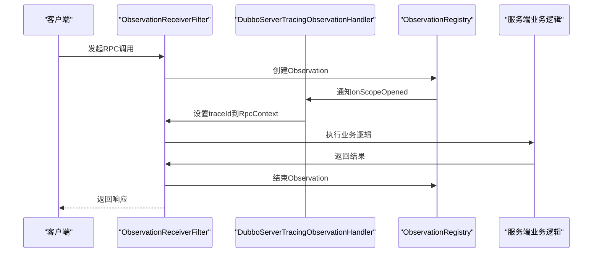
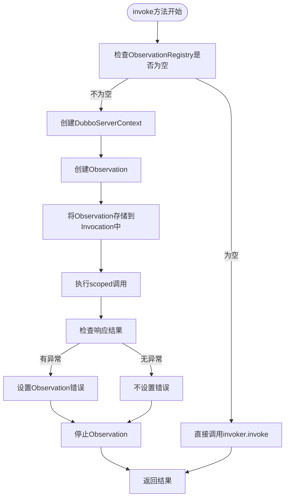
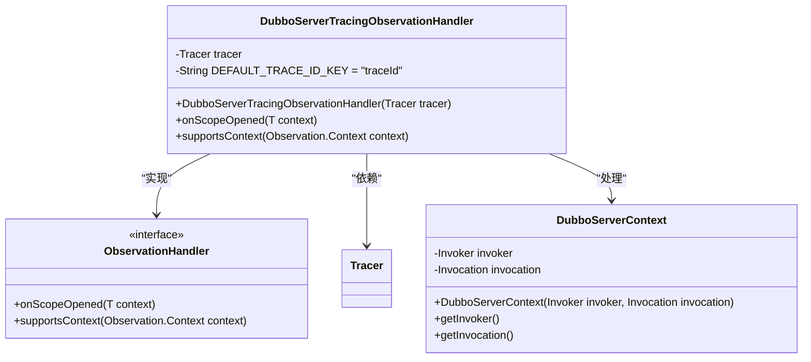
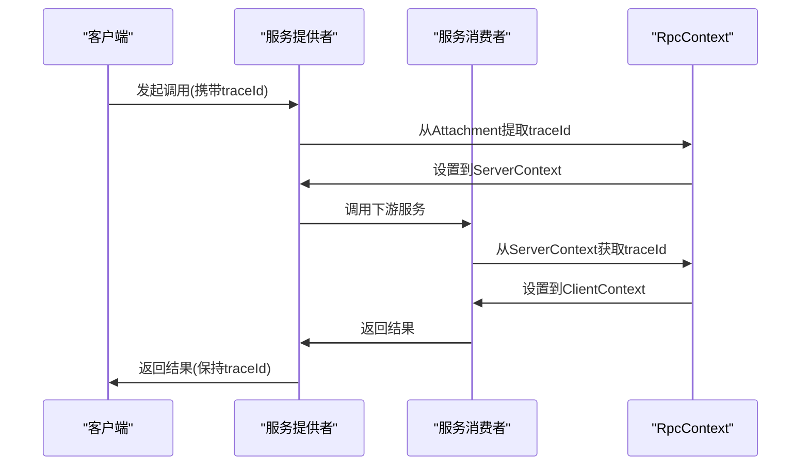
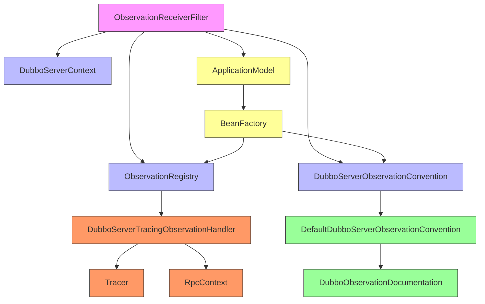
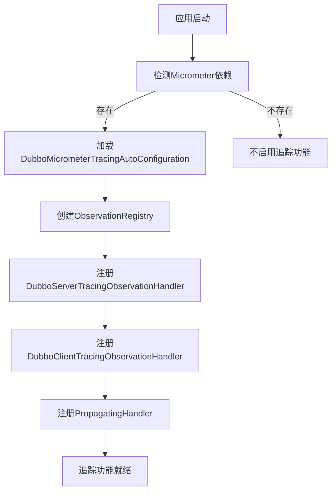

# 服务器端追踪过滤器

<cite>
**本文档中引用的文件**
- [ObservationReceiverFilter.java](file://dubbo-metrics\dubbo-tracing\src\main\java\org\apache\dubbo\tracing\filter\ObservationReceiverFilter.java)
- [DubboServerTracingObservationHandler.java](file://dubbo-metrics\dubbo-tracing\src\main\java\org\apache\dubbo\tracing\handler\DubboServerTracingObservationHandler.java)
- [DubboServerContext.java](file://dubbo-metrics\dubbo-tracing\src\main\java\org\apache\dubbo\tracing\context\DubboServerContext.java)
- [DefaultDubboServerObservationConvention.java](file://dubbo-metrics\dubbo-tracing\src\main\java\org\apache\dubbo\tracing\DefaultDubboServerObservationConvention.java)
- [DubboObservationDocumentation.java](file://dubbo-metrics\dubbo-tracing\src\main\java\org\apache\dubbo\tracing\DubboObservationDocumentation.java)
- [DubboMicrometerTracingAutoConfiguration.java](file://dubbo-spring-boot-project\dubbo-spring-boot-autoconfigure\src\main\java\org\apache\dubbo\spring\boot\autoconfigure\observability\DubboMicrometerTracingAutoConfiguration.java)
- [TracingConfig.java](file://dubbo-common\src\main\java\org\apache\dubbo\config\TracingConfig.java)
</cite>

## 目录
1. [引言](#引言)
2. [核心组件分析](#核心组件分析)
3. [服务器端追踪过滤器架构](#服务器端追踪过滤器架构)
4. [详细组件分析](#详细组件分析)
5. [依赖分析](#依赖分析)
6. [配置与启用](#配置与启用)
7. [结论](#结论)

## 引言
本文档详细介绍了Dubbo框架中的服务器端追踪过滤器实现，重点分析了`ObservationReceiverFilter`的实现原理和工作流程。该过滤器是Dubbo分布式追踪系统的核心组件，负责在RPC请求到达服务端时创建追踪上下文，记录服务端处理的关键指标，并确保客户端和服务器端的追踪信息能够正确关联。文档将深入探讨其与Dubbo过滤器链的集成方式、执行时机、上下文传播机制以及如何在请求完成后正确结束追踪跨度。

## 核心组件分析
服务器端追踪过滤器的核心实现主要由以下几个组件构成：`ObservationReceiverFilter`作为主要的过滤器实现，负责在RPC调用过程中创建和管理追踪观察；`DubboServerTracingObservationHandler`作为观察处理器，处理追踪上下文的创建和传播；`DubboServerContext`作为服务器端上下文，封装了追踪所需的信息；`DefaultDubboServerObservationConvention`作为默认的观察约定，定义了追踪的命名和键值对规则。

**本节来源**
- [ObservationReceiverFilter.java](file://dubbo-metrics\dubbo-tracing\src\main\java\org\apache\dubbo\tracing\filter\ObservationReceiverFilter.java)
- [DubboServerTracingObservationHandler.java](file://dubbo-metrics\dubbo-tracing\src\main\java\org\apache\dubbo\tracing\handler\DubboServerTracingObservationHandler.java)
- [DubboServerContext.java](file://dubbo-metrics\dubbo-tracing\src\main\java\org\apache\dubbo\tracing\context\DubboServerContext.java)
- [DefaultDubboServerObservationConvention.java](file://dubbo-metrics\dubbo-tracing\src\main\java\org\apache\dubbo\tracing\DefaultDubboServerObservationConvention.java)

## 服务器端追踪过滤器架构
服务器端追踪过滤器通过Dubbo的过滤器机制集成到RPC调用流程中，采用Micrometer Observations框架实现分布式追踪功能。当RPC请求到达服务端时，过滤器会创建一个观察（Observation）来跟踪整个调用过程。



**图表来源**
- [ObservationReceiverFilter.java](file://dubbo-metrics\dubbo-tracing\src\main\java\org\apache\dubbo\tracing\filter\ObservationReceiverFilter.java)
- [DubboServerTracingObservationHandler.java](file://dubbo-metrics\dubbo-tracing\src\main\java\org\apache\dubbo\tracing\handler\DubboServerTracingObservationHandler.java)

## 详细组件分析

### ObservationReceiverFilter分析
`ObservationReceiverFilter`是服务器端追踪的核心过滤器，实现了Dubbo的`Filter`接口，并通过`@Activate`注解在提供者（PROVIDER）组中激活。该过滤器在RPC调用的各个阶段执行相应的追踪操作。



**图表来源**
- [ObservationReceiverFilter.java](file://dubbo-metrics\dubbo-tracing\src\main\java\org\apache\dubbo\tracing\filter\ObservationReceiverFilter.java)

**本节来源**
- [ObservationReceiverFilter.java](file://dubbo-metrics\dubbo-tracing\src\main\java\org\apache\dubbo\tracing\filter\ObservationReceiverFilter.java)

### DubboServerTracingObservationHandler分析
`DubboServerTracingObservationHandler`是追踪观察的处理器，实现了`ObservationHandler`接口，负责处理服务器端追踪上下文的创建和传播。



**图表来源**
- [DubboServerTracingObservationHandler.java](file://dubbo-metrics\dubbo-tracing\src\main\java\org\apache\dubbo\tracing\handler\DubboServerTracingObservationHandler.java)
- [DubboServerContext.java](file://dubbo-metrics\dubbo-tracing\src\main\java\org\apache\dubbo\tracing\context\DubboServerContext.java)

**本节来源**
- [DubboServerTracingObservationHandler.java](file://dubbo-metrics\dubbo-tracing\src\main\java\org\apache\dubbo\tracing\handler\DubboServerTracingObservationHandler.java)

### 追踪上下文传播机制
服务器端追踪过滤器通过`RpcContext`实现追踪上下文的传播，确保跨服务调用的追踪链路完整。



**图表来源**
- [DubboServerTracingObservationHandler.java](file://dubbo-metrics\dubbo-tracing\src\main\java\org\apache\dubbo\tracing\handler\DubboServerTracingObservationHandler.java)
- [DubboServerContext.java](file://dubbo-metrics\dubbo-tracing\src\main\java\org\apache\dubbo\tracing\context\DubboServerContext.java)

## 依赖分析
服务器端追踪过滤器依赖于多个核心组件和框架，形成了完整的追踪系统。



**图表来源**
- [ObservationReceiverFilter.java](file://dubbo-metrics\dubbo-tracing\src\main\java\org\apache\dubbo\tracing\filter\ObservationReceiverFilter.java)
- [DubboServerTracingObservationHandler.java](file://dubbo-metrics\dubbo-tracing\src\main\java\org\apache\dubbo\tracing\handler\DubboServerTracingObservationHandler.java)
- [DefaultDubboServerObservationConvention.java](file://dubbo-metrics\dubbo-tracing\src\main\java\org\apache\dubbo\tracing\DefaultDubboServerObservationConvention.java)

**本节来源**
- [ObservationReceiverFilter.java](file://dubbo-metrics\dubbo-tracing\src\main\java\org\apache\dubbo\tracing\filter\ObservationReceiverFilter.java)
- [DubboServerTracingObservationHandler.java](file://dubbo-metrics\dubbo-tracing\src\main\java\org\apache\dubbo\tracing\handler\DubboServerTracingObservationHandler.java)
- [DefaultDubboServerObservationConvention.java](file://dubbo-metrics\dubbo-tracing\src\main\java\org\apache\dubbo\tracing\DefaultDubboServerObservationConvention.java)

## 配置与启用
服务器端追踪功能通过Spring Boot自动配置实现，开发者可以通过简单的配置来启用和自定义追踪行为。

### 基础配置示例
```yaml
dubbo:
  tracing:
    enabled: true
    sampling:
      probability: 0.1
    baggage:
      enabled: true
      correlation:
        fields:
          - "user-id"
          - "tenant-id"
```

### 自动配置机制


**图表来源**
- [DubboMicrometerTracingAutoConfiguration.java](file://dubbo-spring-boot-project\dubbo-spring-boot-autoconfigure\src\main\java\org\apache\dubbo\spring\boot\autoconfigure\observability\DubboMicrometerTracingAutoConfiguration.java)
- [TracingConfig.java](file://dubbo-common\src\main\java\org\apache\dubbo\config\TracingConfig.java)

**本节来源**
- [DubboMicrometerTracingAutoConfiguration.java](file://dubbo-spring-boot-project\dubbo-spring-boot-autoconfigure\src\main\java\org\apache\dubbo\spring\boot\autoconfigure\observability\DubboMicrometerTracingAutoConfiguration.java)
- [TracingConfig.java](file://dubbo-common\src\main\java\org\apache\dubbo\config\TracingConfig.java)

## 结论
Dubbo服务器端追踪过滤器通过`ObservationReceiverFilter`实现了完整的服务器端追踪功能，该过滤器在RPC请求到达时提取追踪上下文，创建服务器端的追踪跨度，并通过`DubboServerTracingObservationHandler`处理上下文的正确传播。过滤器与Dubbo过滤器链紧密集成，在请求处理过程中精确地执行追踪操作，确保客户端和服务器端的追踪信息能够正确关联。通过Micrometer Observations框架，过滤器能够记录服务端处理的关键指标，如处理时间、异常信息等，并在请求完成后正确结束追踪跨度。开发者可以通过简单的配置启用服务器端追踪功能，并根据需要进行自定义，为分布式系统的监控和故障排查提供了强大的支持。