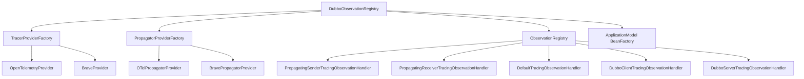
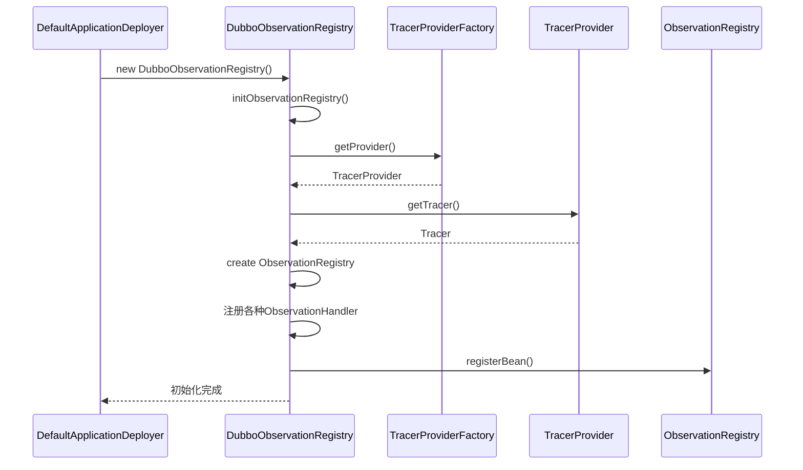
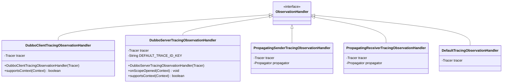
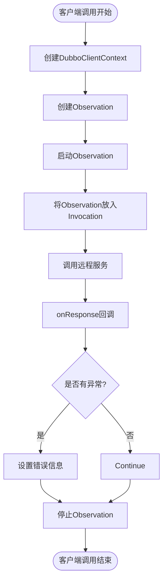
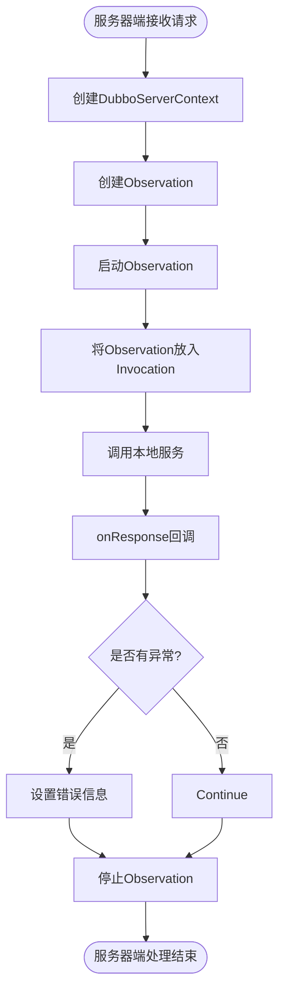
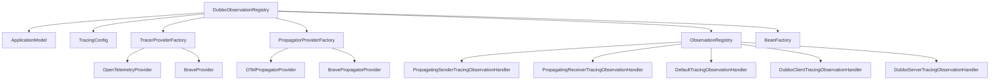

# 追踪注册表

<cite>
**本文档中引用的文件**   
- [DubboObservationRegistry.java](file://dubbo-metrics/dubbo-tracing/src/main/java/org/apache/dubbo/tracing/DubboObservationRegistry.java)
- [ObservationSenderFilter.java](file://dubbo-metrics/dubbo-tracing/src/main/java/org/apache/dubbo/tracing/filter/ObservationSenderFilter.java)
- [ObservationReceiverFilter.java](file://dubbo-metrics/dubbo-tracing/src/main/java/org/apache/dubbo/tracing/filter/ObservationReceiverFilter.java)
- [DefaultApplicationDeployer.java](file://dubbo-config/dubbo-config-api/src/main/java/org/apache/dubbo/config/deploy/DefaultApplicationDeployer.java)
- [DubboClientTracingObservationHandler.java](file://dubbo-metrics/dubbo-tracing/src/main/java/org/apache/dubbo/tracing/handler/DubboClientTracingObservationHandler.java)
- [DubboServerTracingObservationHandler.java](file://dubbo-metrics/dubbo-tracing/src/main/java/org/apache/dubbo/tracing/handler/DubboServerTracingObservationHandler.java)
- [TracerProviderFactory.java](file://dubbo-metrics/dubbo-tracing/src/main/java/org/apache/dubbo/tracing/tracer/TracerProviderFactory.java)
</cite>

## 目录
1. [简介](#简介)
2. [核心组件](#核心组件)
3. [架构概述](#架构概述)
4. [详细组件分析](#详细组件分析)
5. [依赖分析](#依赖分析)
6. [性能考虑](#性能考虑)
7. [故障排除指南](#故障排除指南)
8. [结论](#结论)

## 简介
DubboObservationRegistry 是 Dubbo 框架中实现分布式追踪的核心组件，它作为 Dubbo 与 OpenTelemetry 之间的桥梁，负责管理追踪上下文和观测器的生命周期。该注册表通过 SPI 扩展机制实现了追踪功能的可插拔性，允许开发者根据需要选择不同的追踪实现（如 OpenTelemetry 或 Brave）。在应用启动时，DubboObservationRegistry 会自动初始化，并注册客户端和服务器端的观测器，从而实现对 RPC 调用的全面监控。

## 核心组件
DubboObservationRegistry 的核心功能包括：初始化观测注册表、管理追踪上下文、注册和管理客户端与服务器端的观测器。它通过 TracerProviderFactory 选择合适的追踪提供者（OpenTelemetry 或 Brave），并创建相应的 Tracer 和 Propagator 实例。注册表还负责将 ObservationRegistry、Tracer 和 Propagator 注册到应用模型的 Bean 工厂中，以便在整个应用生命周期内使用。

**本文档中引用的文件**
- [DubboObservationRegistry.java](file://dubbo-metrics/dubbo-tracing/src/main/java/org/apache/dubbo/tracing/DubboObservationRegistry.java#L42-L108)
- [DefaultApplicationDeployer.java](file://dubbo-config/dubbo-config-api/src/main/java/org/apache/dubbo/config/deploy/DefaultApplicationDeployer.java#L588-L591)

## 架构概述

**图表来源**
- [DubboObservationRegistry.java](file://dubbo-metrics/dubbo-tracing/src/main/java/org/apache/dubbo/tracing/DubboObservationRegistry.java#L57-L107)
- [TracerProviderFactory.java](file://dubbo-metrics/dubbo-tracing/src/main/java/org/apache/dubbo/tracing/tracer/TracerProviderFactory.java#L27-L37)

## 详细组件分析

### DubboObservationRegistry 分析
DubboObservationRegistry 是追踪功能的核心实现，负责初始化和管理观测注册表。它首先检查是否存在外部提供的 ObservationRegistry（如 Spring 环境中的实例），如果存在则直接使用；否则，根据配置创建新的注册表实例。

#### 初始化过程

**图表来源**
- [DubboObservationRegistry.java](file://dubbo-metrics/dubbo-tracing/src/main/java/org/apache/dubbo/tracing/DubboObservationRegistry.java#L57-L107)
- [DefaultApplicationDeployer.java](file://dubbo-config/dubbo-config-api/src/main/java/org/apache/dubbo/config/deploy/DefaultApplicationDeployer.java#L588-L591)

#### 观测器处理

**图表来源**
- [DubboClientTracingObservationHandler.java](file://dubbo-metrics/dubbo-tracing/src/main/java/org/apache/dubbo/tracing/handler/DubboClientTracingObservationHandler.java#L25-L39)
- [DubboServerTracingObservationHandler.java](file://dubbo-metrics/dubbo-tracing/src/main/java/org/apache/dubbo/tracing/handler/DubboServerTracingObservationHandler.java#L27-L50)

### 追踪过滤器分析
追踪功能通过过滤器机制在 RPC 调用过程中创建和管理观测。客户端和服务器端分别使用不同的过滤器来处理追踪上下文。

#### 客户端追踪流程

**图表来源**
- [ObservationSenderFilter.java](file://dubbo-metrics/dubbo-tracing/src/main/java/org/apache/dubbo/tracing/filter/ObservationSenderFilter.java#L58-L97)

#### 服务器端追踪流程

**图表来源**
- [ObservationReceiverFilter.java](file://dubbo-metrics/dubbo-tracing/src/main/java/org/apache/dubbo/tracing/filter/ObservationReceiverFilter.java#L57-L96)

## 依赖分析

**图表来源**
- [DubboObservationRegistry.java](file://dubbo-metrics/dubbo-tracing/src/main/java/org/apache/dubbo/tracing/DubboObservationRegistry.java#L48-L50)
- [TracerProviderFactory.java](file://dubbo-metrics/dubbo-tracing/src/main/java/org/apache/dubbo/tracing/tracer/TracerProviderFactory.java#L27-L37)

**本文档中引用的文件**
- [DubboObservationRegistry.java](file://dubbo-metrics/dubbo-tracing/src/main/java/org/apache/dubbo/tracing/DubboObservationRegistry.java#L42-L108)
- [TracerProviderFactory.java](file://dubbo-metrics/dubbo-tracing/src/main/java/org/apache/dubbo/tracing/tracer/TracerProviderFactory.java#L27-L37)

## 性能考虑
DubboObservationRegistry 在设计时充分考虑了性能影响。它通过以下机制确保追踪功能对应用性能的影响最小化：
1. **惰性初始化**：只有在配置启用追踪功能时才会初始化相关组件
2. **外部注册表优先**：优先使用外部提供的 ObservationRegistry，避免重复创建
3. **依赖检查**：在初始化前检查必要的追踪依赖是否可用，避免不必要的资源消耗
4. **条件激活**：追踪过滤器通过 @Activate 注解在特定条件下激活，减少不必要的处理开销

## 故障排除指南
当追踪功能无法正常工作时，可以按照以下步骤进行排查：
1. 检查应用是否正确引入了 micrometer-tracing 相关依赖
2. 确认 TracingConfig 配置是否正确启用
3. 查看日志中是否有 "Can not found OpenTelemetry/Brave tracer dependencies" 相关警告
4. 验证 ObservationRegistry 是否已成功注册到 BeanFactory 中
5. 检查过滤器是否按预期顺序执行

**本文档中引用的文件**
- [DubboObservationRegistry.java](file://dubbo-metrics/dubbo-tracing/src/main/java/org/apache/dubbo/tracing/DubboObservationRegistry.java#L73-L78)
- [DefaultApplicationDeployer.java](file://dubbo-config/dubbo-config-api/src/main/java/org/apache/dubbo/config/deploy/DefaultApplicationDeployer.java#L580-L581)

## 结论
DubboObservationRegistry 作为 Dubbo 与 OpenTelemetry 之间的桥梁，提供了一套完整且灵活的追踪解决方案。通过 SPI 扩展机制，它实现了追踪功能的可插拔性，允许开发者根据实际需求选择合适的追踪实现。注册表的初始化过程充分考虑了性能和兼容性，确保在各种部署环境中都能稳定运行。对于初学者，可以通过简单的配置启用追踪功能；对于经验丰富的开发者，则可以自定义观测器和上下文，实现更精细的监控需求。