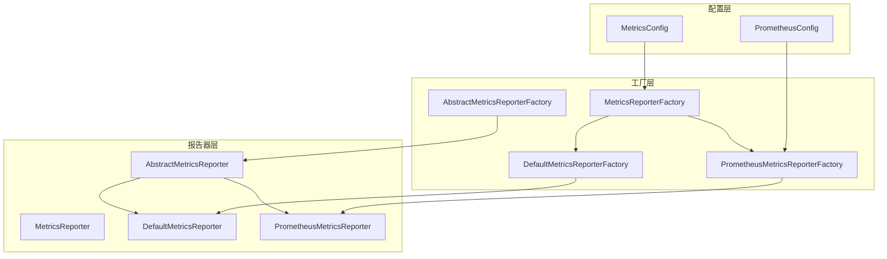
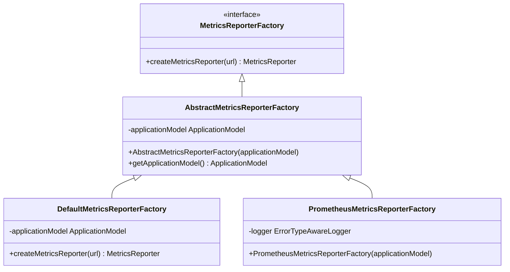
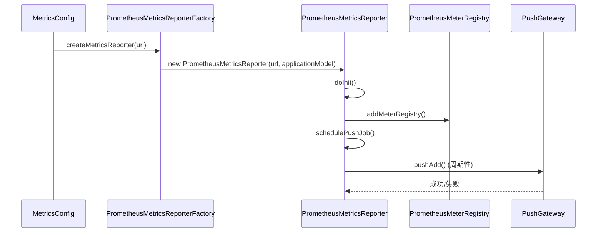
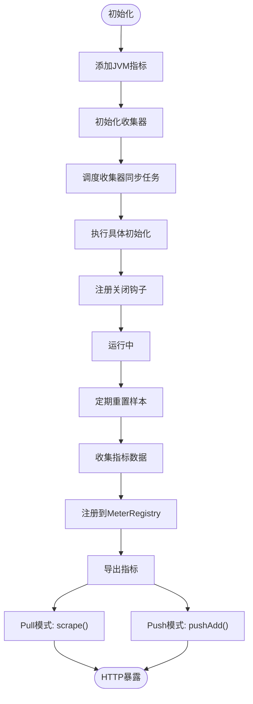
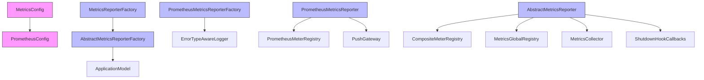

# 指标报告器

<cite>
**本文档中引用的文件**  
- [MetricsReporterFactory.java](file://dubbo-metrics\dubbo-metrics-api\src\main\java\org\apache\dubbo\metrics\report\MetricsReporterFactory.java)
- [PrometheusMetricsReporterFactory.java](file://dubbo-metrics\dubbo-metrics-prometheus\src\main\java\org\apache\dubbo\metrics\prometheus\PrometheusMetricsReporterFactory.java)
- [PrometheusMetricsReporter.java](file://dubbo-metrics\dubbo-metrics-prometheus\src\main\java\org\apache\dubbo\metrics\prometheus\PrometheusMetricsReporter.java)
- [MetricsConfig.java](file://dubbo-common\src\main\java\org\apache\dubbo\config\MetricsConfig.java)
- [PrometheusConfig.java](file://dubbo-common\src\main\java\org\apache\dubbo\config\nested\PrometheusConfig.java)
- [AbstractMetricsReporter.java](file://dubbo-metrics\dubbo-metrics-default\src\main\java\org\apache\dubbo\metrics\report\AbstractMetricsReporter.java)
- [DefaultMetricsReporter.java](file://dubbo-metrics\dubbo-metrics-default\src\main\java\org\apache\dubbo\metrics\report\DefaultMetricsReporter.java)
</cite>

## 目录
1. [引言](#引言)
2. [核心组件](#核心组件)
3. [架构概述](#架构概述)
4. [详细组件分析](#详细组件分析)
5. [依赖分析](#依赖分析)
6. [性能考虑](#性能考虑)
7. [故障排除指南](#故障排除指南)
8. [结论](#结论)

## 引言
本文档详细介绍了Dubbo框架中的指标报告器系统，重点分析了MetricsReporterFactory接口及其在不同后端系统中的实现，特别是PrometheusMetricsReporterFactory。文档将深入探讨报告器如何将收集到的指标数据格式化并导出到监控系统，包括Pull模式和Push模式的工作机制。同时，文档将描述Prometheus报告器的HTTP端点暴露方式、指标暴露格式和性能影响，并提供配置示例展示如何启用和配置不同的报告器。

## 核心组件

指标报告器系统的核心组件包括MetricsReporterFactory接口、AbstractMetricsReporterFactory抽象类以及具体的实现类如DefaultMetricsReporterFactory和PrometheusMetricsReporterFactory。这些组件共同构成了Dubbo的指标收集和报告框架，允许将收集到的指标数据导出到不同的监控系统。

**本节来源**
- [MetricsReporterFactory.java](file://dubbo-metrics\dubbo-metrics-api\src\main\java\org\apache\dubbo\metrics\report\MetricsReporterFactory.java)
- [AbstractMetricsReporterFactory.java](file://dubbo-metrics\dubbo-metrics-api\src\main\java\org\apache\dubbo\metrics\report\AbstractMetricsReporterFactory.java)

## 架构概述

**图表来源**
- [MetricsReporterFactory.java](file://dubbo-metrics\dubbo-metrics-api\src\main\java\org\apache\dubbo\metrics\report\MetricsReporterFactory.java)
- [PrometheusMetricsReporterFactory.java](file://dubbo-metrics\dubbo-metrics-prometheus\src\main\java\org\apache\dubbo\metrics\prometheus\PrometheusMetricsReporterFactory.java)
- [PrometheusMetricsReporter.java](file://dubbo-metrics\dubbo-metrics-prometheus\src\main\java\org\apache\dubbo\metrics\prometheus\PrometheusMetricsReporter.java)

## 详细组件分析

### MetricsReporterFactory接口分析

MetricsReporterFactory是创建MetricsReporter实例的工厂接口，通过SPI机制实现可扩展性。该接口使用@SPI注解标记，允许通过不同的协议创建相应的报告器实例。

**图表来源**
- [MetricsReporterFactory.java](file://dubbo-metrics\dubbo-metrics-api\src\main\java\org\apache\dubbo\metrics\report\MetricsReporterFactory.java)
- [AbstractMetricsReporterFactory.java](file://dubbo-metrics\dubbo-metrics-api\src\main\java\org\apache\dubbo\metrics\report\AbstractMetricsReporterFactory.java)

### PrometheusMetricsReporterFactory分析

PrometheusMetricsReporterFactory是MetricsReporterFactory接口的具体实现，专门用于创建PrometheusMetricsReporter实例。该工厂类通过SPI机制注册，当配置使用prometheus协议时，会自动创建相应的报告器。

**图表来源**
- [PrometheusMetricsReporterFactory.java](file://dubbo-metrics\dubbo-metrics-prometheus\src\main\java\org\apache\dubbo\metrics\prometheus\PrometheusMetricsReporterFactory.java)
- [PrometheusMetricsReporter.java](file://dubbo-metrics\dubbo-metrics-prometheus\src\main\java\org\apache\dubbo\metrics\prometheus\PrometheusMetricsReporter.java)

### 报告器生命周期与数据导出机制

**图表来源**
- [AbstractMetricsReporter.java](file://dubbo-metrics\dubbo-metrics-default\src\main\java\org\apache\dubbo\metrics\report\AbstractMetricsReporter.java)
- [PrometheusMetricsReporter.java](file://dubbo-metrics\dubbo-metrics-prometheus\src\main\java\org\apache\dubbo\metrics\prometheus\PrometheusMetricsReporter.java)

**本节来源**
- [AbstractMetricsReporter.java](file://dubbo-metrics\dubbo-metrics-default\src\main\java\org\apache\dubbo\metrics\report\AbstractMetricsReporter.java)
- [PrometheusMetricsReporter.java](file://dubbo-metrics\dubbo-metrics-prometheus\src\main\java\org\apache\dubbo\metrics\prometheus\PrometheusMetricsReporter.java)

## 依赖分析

**图表来源**
- [MetricsConfig.java](file://dubbo-common\src\main\java\org\apache\dubbo\config\MetricsConfig.java)
- [PrometheusConfig.java](file://dubbo-common\src\main\java\org\apache\dubbo\config\nested\PrometheusConfig.java)
- [MetricsReporterFactory.java](file://dubbo-metrics\dubbo-metrics-api\src\main\java\org\apache\dubbo\metrics\report\MetricsReporterFactory.java)

## 性能考虑

指标报告器系统的性能影响主要体现在以下几个方面：首先，定期的指标收集和同步任务会占用一定的CPU和内存资源；其次，Push模式下向Pushgateway推送数据会产生网络开销；最后，暴露大量指标数据可能会影响HTTP端点的响应时间。系统通过配置参数如collectorSyncPeriod和pushInterval来平衡监控粒度和性能开销。

## 故障排除指南

当指标报告器出现问题时，可以检查以下方面：确认MetricsConfig配置是否正确；验证PrometheusConfig中的exporter和pushgateway配置是否启用；检查网络连接是否正常，特别是Push模式下与Pushgateway的连接；查看日志中是否有相关的错误信息，特别是与指标收集和推送相关的异常。

**本节来源**
- [PrometheusMetricsReporter.java](file://dubbo-metrics\dubbo-metrics-prometheus\src\main\java\org\apache\dubbo\metrics\prometheus\PrometheusMetricsReporter.java)
- [AbstractMetricsReporter.java](file://dubbo-metrics\dubbo-metrics-default\src\main\java\org\apache\dubbo\metrics\report\AbstractMetricsReporter.java)

## 结论

Dubbo的指标报告器系统通过灵活的工厂模式和SPI机制，实现了对不同监控后端的支持。PrometheusMetricsReporterFactory作为核心实现，提供了Pull和Push两种模式来导出指标数据，满足了不同部署场景的需求。系统通过合理的生命周期管理和错误处理机制，确保了指标收集的稳定性和可靠性。