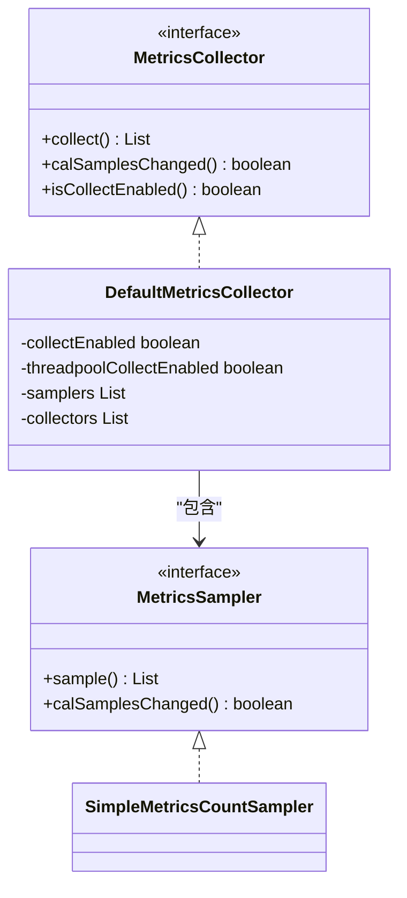
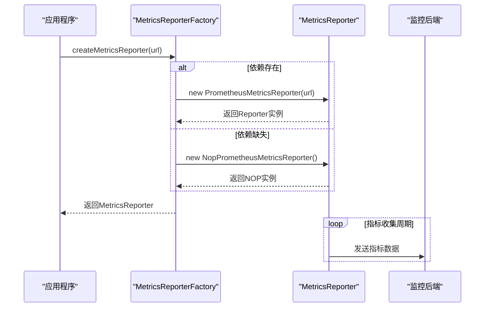
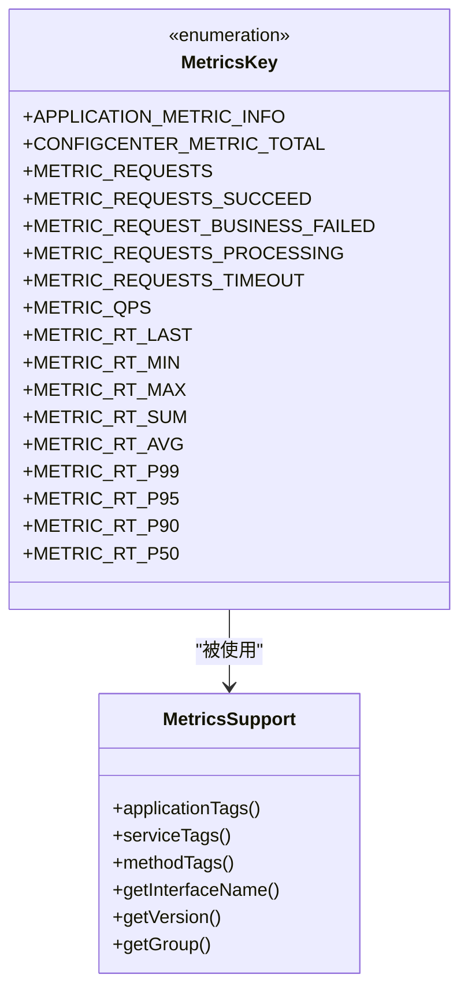
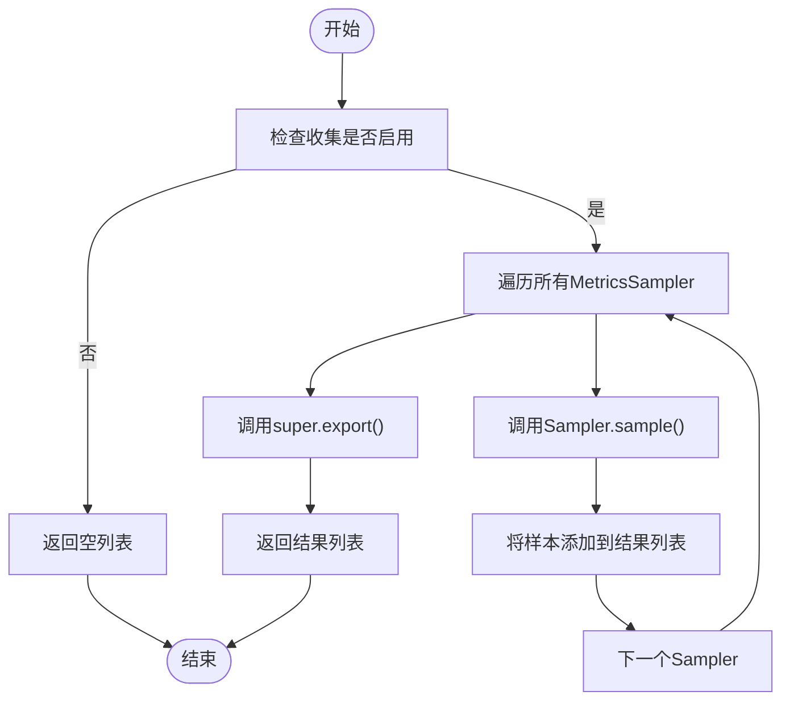

# 指标收集

<cite>
**本文档中引用的文件**  
- [MetricsCollector.java](file://dubbo-metrics\dubbo-metrics-api\src\main\java\org\apache\dubbo\metrics\collector\MetricsCollector.java)
- [MetricsReporterFactory.java](file://dubbo-metrics\dubbo-metrics-api\src\main\java\org\apache\dubbo\metrics\report\MetricsReporterFactory.java)
- [MetricsKey.java](file://dubbo-metrics\dubbo-metrics-event\src\main\java\org\apache\dubbo\metrics\model\key\MetricsKey.java)
- [DefaultMetricsCollector.java](file://dubbo-metrics\dubbo-metrics-default\src\main\java\org\apache\dubbo\metrics\collector\DefaultMetricsCollector.java)
- [PrometheusMetricsReporterFactory.java](file://dubbo-metrics\dubbo-metrics-prometheus\src\main\java\org\apache\dubbo\metrics\prometheus\PrometheusMetricsReporterFactory.java)
- [MetricsReporter.java](file://dubbo-metrics\dubbo-metrics-api\src\main\java\org\apache\dubbo\metrics\report\MetricsReporter.java)
- [SimpleMetricsCountSampler.java](file://dubbo-metrics\dubbo-metrics-default\src\main\java\org\apache\dubbo\metrics\collector\sample\SimpleMetricsCountSampler.java)
- [RequestEvent.java](file://dubbo-metrics\dubbo-metrics-default\src\main\java\org\apache\dubbo\metrics\event\RequestEvent.java)
- [MetricsSupport.java](file://dubbo-metrics\dubbo-metrics-api\src\main\java\org\apache\dubbo\metrics\model\MetricsSupport.java)
</cite>

## 目录
1. [引言](#引言)
2. [核心组件](#核心组件)
3. [MetricsCollector职责与工作原理](#metricscollector职责与工作原理)
4. [MetricsReporterFactory与后端报告](#metricsreporterfactory与后端报告)
5. [MetricsKey设计与使用](#metricskey设计与使用)
6. [指标聚合策略与采样机制](#指标聚合策略与采样机制)
7. [性能影响与优化](#性能影响与优化)
8. [配置与使用示例](#配置与使用示例)
9. [结论](#结论)

## 引言
Dubbo的Metrics模块为分布式系统提供了全面的性能监控能力。该模块通过收集RPC调用的关键性能指标，如QPS、响应时间、错误率等，帮助开发者和运维人员深入了解系统运行状况。本文档将深入分析Metrics模块的实现机制，包括MetricsCollector、MetricsReporterFactory和MetricsKey等核心组件的工作原理，以及如何配置和使用这些功能。

## 核心组件

Dubbo的Metrics模块由多个核心组件构成，主要包括MetricsCollector、MetricsReporterFactory、MetricsKey和MetricsSupport等。这些组件协同工作，实现了从指标收集、处理到报告的完整流程。

**本节来源**
- [MetricsCollector.java](file://dubbo-metrics\dubbo-metrics-api\src\main\java\org\apache\dubbo\metrics\collector\MetricsCollector.java)
- [MetricsReporterFactory.java](file://dubbo-metrics\dubbo-metrics-api\src\main\java\org\apache\dubbo\metrics\report\MetricsReporterFactory.java)
- [MetricsKey.java](file://dubbo-metrics\dubbo-metrics-event\src\main\java\org\apache\dubbo\metrics\model\key\MetricsKey.java)

## MetricsCollector职责与工作原理

MetricsCollector是Dubbo Metrics模块的核心接口，负责收集框架内部的各种性能指标。它通过SPI机制实现扩展，允许不同的实现来收集和处理指标数据。

MetricsCollector接口定义了collect()方法，用于收集指标数据并返回MetricSample列表。该接口还提供了calSamplesChanged()方法，用于检查指标样本是否发生变化，并在检查后重置变化标志。DefaultMetricsCollector是MetricsCollector的默认实现，它通过组合多个MetricsSampler来收集不同类型的指标。

MetricsCollector的工作流程基于事件驱动机制。当RPC调用发生时，系统会发布RequestEvent事件，MetricsCollector监听这些事件并更新相应的指标数据。这种设计使得指标收集与业务逻辑解耦，提高了系统的可维护性和扩展性。



**图表来源**
- [MetricsCollector.java](file://dubbo-metrics\dubbo-metrics-api\src\main\java\org\apache\dubbo\metrics\collector\MetricsCollector.java)
- [DefaultMetricsCollector.java](file://dubbo-metrics\dubbo-metrics-default\src\main\java\org\apache\dubbo\metrics\collector\DefaultMetricsCollector.java)
- [SimpleMetricsCountSampler.java](file://dubbo-metrics\dubbo-metrics-default\src\main\java\org\apache\dubbo\metrics\collector\sample\SimpleMetricsCountSampler.java)

**本节来源**
- [MetricsCollector.java](file://dubbo-metrics\dubbo-metrics-api\src\main\java\org\apache\dubbo\metrics\collector\MetricsCollector.java)
- [DefaultMetricsCollector.java](file://dubbo-metrics\dubbo-metrics-default\src\main\java\org\apache\dubbo\metrics\collector\DefaultMetricsCollector.java)

## MetricsReporterFactory与后端报告

MetricsReporterFactory是创建MetricsReporter实例的工厂接口，负责将收集到的指标数据报告给不同的后端系统。该接口通过@Adaptive注解实现了自适应扩展，可以根据URL中的协议参数选择合适的MetricsReporter实现。

PrometheusMetricsReporterFactory是MetricsReporterFactory的一个具体实现，专门用于将指标数据报告给Prometheus监控系统。当创建MetricsReporter实例时，它会尝试实例化PrometheusMetricsReporter，如果必要的依赖类未找到，则会回退到NopPrometheusMetricsReporter，避免因缺少依赖而导致系统启动失败。

这种设计模式确保了系统的健壮性和灵活性，允许在不同环境中使用不同的监控后端，同时保持了API的一致性。



**图表来源**
- [MetricsReporterFactory.java](file://dubbo-metrics\dubbo-metrics-api\src\main\java\org\apache\dubbo\metrics\report\MetricsReporterFactory.java)
- [PrometheusMetricsReporterFactory.java](file://dubbo-metrics\dubbo-metrics-prometheus\src\main\java\org\apache\dubbo\metrics\prometheus\PrometheusMetricsReporterFactory.java)
- [MetricsReporter.java](file://dubbo-metrics\dubbo-metrics-api\src\main\java\org\apache\dubbo\metrics\report\MetricsReporter.java)

**本节来源**
- [MetricsReporterFactory.java](file://dubbo-metrics\dubbo-metrics-api\src\main\java\org\apache\dubbo\metrics\report\MetricsReporterFactory.java)
- [PrometheusMetricsReporterFactory.java](file://dubbo-metrics\dubbo-metrics-prometheus\src\main\java\org\apache\dubbo\metrics\prometheus\PrometheusMetricsReporterFactory.java)

## MetricsKey设计与使用

MetricsKey是Dubbo Metrics模块中用于定义指标名称和描述的枚举类型。它采用统一的命名规范，确保指标名称的可读性和一致性。每个MetricsKey包含一个名称和描述，名称遵循"dubbo.[模块].[指标].[聚合类型]"的格式。

MetricsKey的设计考虑了指标的层次结构和聚合需求。例如，METRIC_QPS表示QPS指标，METRIC_RT_LAST表示最后一次响应时间，而METRIC_RT_P99则表示响应时间的99分位值。这种命名方式不仅清晰地表达了指标的含义，还便于在监控系统中进行分类和查询。

在使用MetricsKey时，可以通过getName()方法获取指标名称，通过getDescription()方法获取指标描述。对于需要动态生成名称的指标，可以使用getNameByType()方法，传入具体的类型参数来生成最终的指标名称。



**图表来源**
- [MetricsKey.java](file://dubbo-metrics\dubbo-metrics-event\src\main\java\org\apache\dubbo\metrics\model\key\MetricsKey.java)
- [MetricsSupport.java](file://dubbo-metrics\dubbo-metrics-api\src\main\java\org\apache\dubbo\metrics\model\MetricsSupport.java)

**本节来源**
- [MetricsKey.java](file://dubbo-metrics\dubbo-metrics-event\src\main\java\org\apache\dubbo\metrics\model\key\MetricsKey.java)

## 指标聚合策略与采样机制

Dubbo Metrics模块采用高效的聚合策略和采样机制来处理大量的指标数据。聚合策略主要通过MetricsSupport类中的fillZero()方法实现，该方法确保所有可能的指标组合都被初始化，即使某些组合的值为零。

采样机制基于MetricsSampler接口实现，不同的Sampler负责收集特定类型的指标。SimpleMetricsCountSampler是常用的采样器实现，它使用ConcurrentHashMap来存储指标计数，确保线程安全的同时提供高性能的读写操作。

指标数据的更新采用原子操作，避免了锁竞争带来的性能开销。当指标发生变化时，calSamplesChanged()方法会返回true，触发指标数据的重新计算和报告。这种设计既保证了数据的准确性，又最大限度地减少了对系统性能的影响。



**图表来源**
- [DefaultMetricsCollector.java](file://dubbo-metrics\dubbo-metrics-default\src\main\java\org\apache\dubbo\metrics\collector\DefaultMetricsCollector.java)
- [SimpleMetricsCountSampler.java](file://dubbo-metrics\dubbo-metrics-default\src\main\java\org\apache\dubbo\metrics\collector\sample\SimpleMetricsCountSampler.java)

**本节来源**
- [DefaultMetricsCollector.java](file://dubbo-metrics\dubbo-metrics-default\src\main\java\org\apache\dubbo\metrics\collector\DefaultMetricsCollector.java)
- [SimpleMetricsCountSampler.java](file://dubbo-metrics\dubbo-metrics-default\src\main\java\org\apache\dubbo\metrics\collector\sample\SimpleMetricsCountSampler.java)

## 性能影响与优化

Dubbo Metrics模块在设计时充分考虑了性能影响，采用了多种优化策略来最小化对系统性能的影响。首先，指标收集是可配置的，可以通过设置collectEnabled标志来启用或禁用指标收集功能。

其次，指标数据的存储和更新采用无锁设计，使用ConcurrentHashMap和AtomicLong等线程安全的数据结构，避免了传统锁机制带来的性能瓶颈。此外，指标数据的报告采用异步方式，不会阻塞业务线程的执行。

为了进一步优化性能，Metrics模块还实现了变化检测机制。只有当指标数据发生变化时，才会触发数据报告，减少了不必要的I/O操作。这种设计在高并发场景下尤为重要，可以显著降低系统开销。

**本节来源**
- [DefaultMetricsCollector.java](file://dubbo-metrics\dubbo-metrics-default\src\main\java\org\apache\dubbo\metrics\collector\DefaultMetricsCollector.java)
- [SimpleMetricsCountSampler.java](file://dubbo-metrics\dubbo-metrics-default\src\main\java\org\apache\dubbo\metrics\collector\sample\SimpleMetricsCountSampler.java)

## 配置与使用示例

配置和使用Dubbo Metrics功能相对简单。对于初学者，可以通过在配置文件中添加简单的配置来启用默认的指标收集功能。例如，在application.properties中添加dubbo.metrics.collect-enabled=true即可启用指标收集。

对于经验丰富的开发者，可以通过实现自定义的MetricsCollector和MetricsReporter来扩展指标收集功能。自定义MetricsCollector需要实现MetricsCollector接口，并通过SPI机制注册。自定义MetricsReporter则需要实现MetricsReporter接口，并在META-INF/dubbo/internal目录下创建相应的配置文件。

以下是一个基本的配置示例：
```properties
# 启用指标收集
dubbo.metrics.collect-enabled=true
# 设置指标报告间隔
dubbo.metrics.report.interval=60s
# 指定报告后端
dubbo.metrics.reporter.protocol=prometheus
```

**本节来源**
- [MetricsCollector.java](file://dubbo-metrics\dubbo-metrics-api\src\main\java\org\apache\dubbo\metrics\collector\MetricsCollector.java)
- [MetricsReporterFactory.java](file://dubbo-metrics\dubbo-metrics-api\src\main\java\org\apache\dubbo\metrics\report\MetricsReporterFactory.java)

## 结论

Dubbo的Metrics模块提供了一套完整且灵活的指标收集和报告机制。通过MetricsCollector、MetricsReporterFactory和MetricsKey等核心组件的协同工作，实现了对RPC调用关键性能指标的全面监控。该模块的设计充分考虑了性能影响，采用高效的聚合策略和采样机制，确保在高并发场景下仍能保持良好的系统性能。

对于开发者而言，理解这些核心组件的工作原理有助于更好地配置和使用Metrics功能，从而更有效地监控和优化分布式系统的性能。随着微服务架构的普及，这样的监控能力变得越来越重要，Dubbo的Metrics模块为此提供了一个强大而灵活的解决方案。