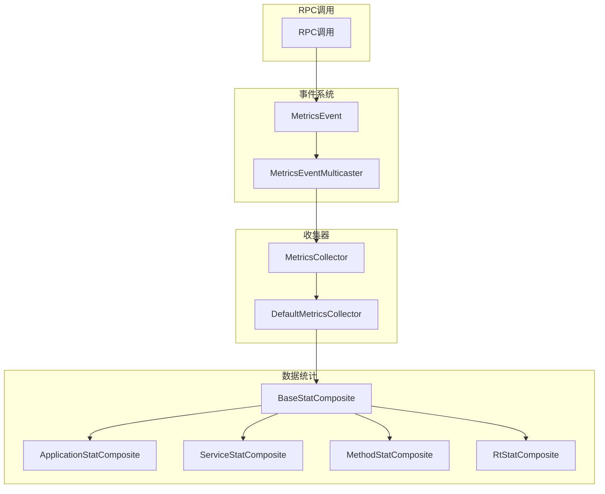
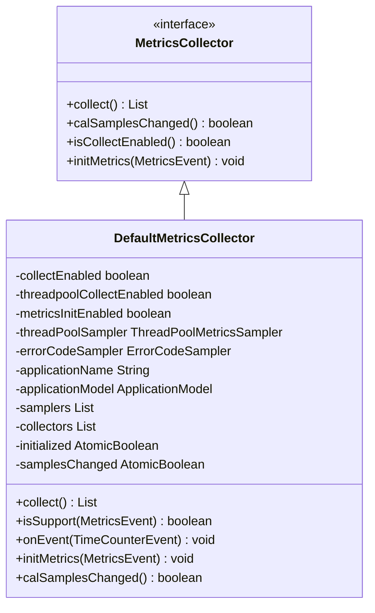
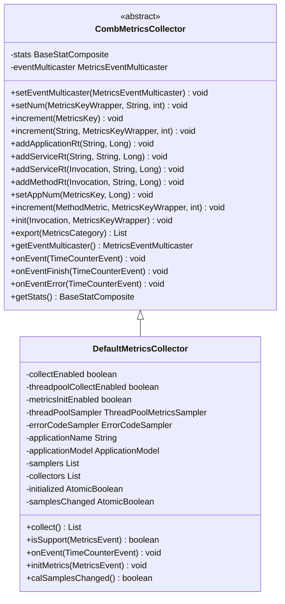
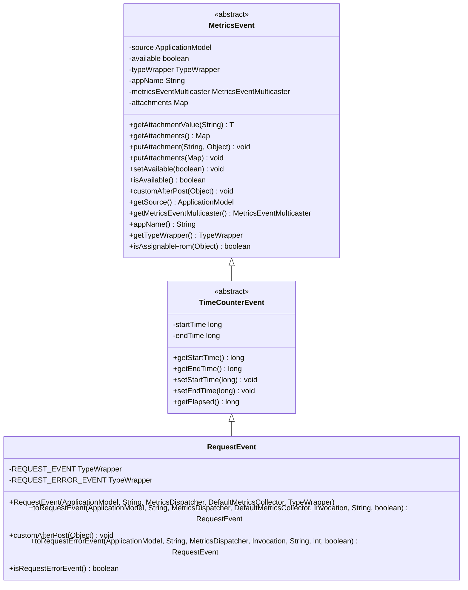
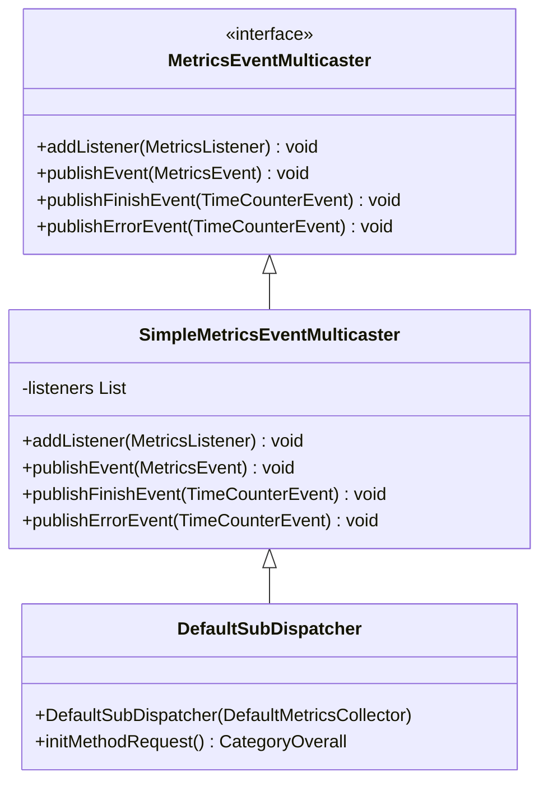
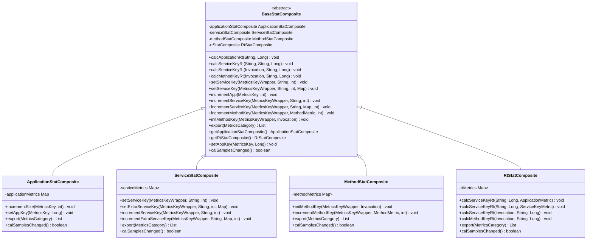
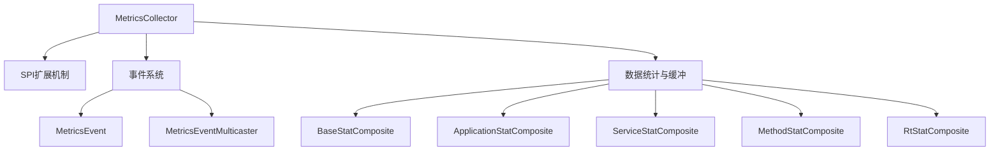

# 指标收集器

<cite>
**本文档中引用的文件**  
- [MetricsCollector.java](file://dubbo-metrics\dubbo-metrics-api\src\main\java\org\apache\dubbo\metrics\collector\MetricsCollector.java)
- [DefaultMetricsCollector.java](file://dubbo-metrics\dubbo-metrics-default\src\main\java\org\apache\dubbo\metrics\collector\DefaultMetricsCollector.java)
- [CombMetricsCollector.java](file://dubbo-metrics\dubbo-metrics-api\src\main\java\org\apache\dubbo\metrics\collector\CombMetricsCollector.java)
- [MetricsEvent.java](file://dubbo-metrics\dubbo-metrics-event\src\main\java\org\apache\dubbo\metrics\event\MetricsEvent.java)
- [RequestEvent.java](file://dubbo-metrics\dubbo-metrics-default\src\main\java\org\apache\dubbo\metrics\event\RequestEvent.java)
- [MetricsEventMulticaster.java](file://dubbo-metrics\dubbo-metrics-event\src\main\java\org\apache\dubbo\metrics\event\MetricsEventMulticaster.java)
- [DefaultSubDispatcher.java](file://dubbo-metrics\dubbo-metrics-default\src\main\java\org\apache\dubbo\metrics\event\DefaultSubDispatcher.java)
- [BaseStatComposite.java](file://dubbo-metrics\dubbo-metrics-api\src\main\java\org\apache\dubbo\metrics\data\BaseStatComposite.java)
- [org.apache.dubbo.metrics.collector.MetricsCollector](file://dubbo-metrics\dubbo-metrics-default\src\main\resources\META-INF\dubbo\internal\org.apache.dubbo.metrics.collector.MetricsCollector)
</cite>

## 目录
1. [简介](#简介)
2. [核心组件](#核心组件)
3. [架构概述](#架构概述)
4. [详细组件分析](#详细组件分析)
5. [依赖分析](#依赖分析)
6. [性能考虑](#性能考虑)
7. [故障排除指南](#故障排除指南)
8. [结论](#结论)

## 简介
本文档详细介绍了Dubbo框架中的指标收集器系统，重点阐述了MetricsCollector接口及其默认实现DefaultMetricsCollector。文档深入解析了收集器如何通过拦截RPC调用的各个阶段（如调用开始、结束、异常等）来收集指标数据，以及其与MetricsEvent事件系统的集成机制。同时，文档还探讨了在高并发场景下的性能影响、线程安全设计、数据缓冲策略和内存管理机制，并为开发者提供了自定义MetricsCollector的实现方法和SPI扩展注册方式。

## 核心组件
指标收集器系统的核心组件包括MetricsCollector接口、DefaultMetricsCollector实现类、MetricsEvent事件系统以及相关的数据统计和缓冲机制。这些组件共同构成了一个完整的指标收集和报告框架，能够有效地监控Dubbo框架的运行状态和性能表现。

**节来源**
- [MetricsCollector.java](file://dubbo-metrics\dubbo-metrics-api\src\main\java\org\apache\dubbo\metrics\collector\MetricsCollector.java)
- [DefaultMetricsCollector.java](file://dubbo-metrics\dubbo-metrics-default\src\main\java\org\apache\dubbo\metrics\collector\DefaultMetricsCollector.java)

## 架构概述
指标收集器系统采用事件驱动的架构设计，通过MetricsEvent事件系统与RPC调用的各个阶段进行集成。当RPC调用发生时，系统会生成相应的MetricsEvent事件，这些事件被MetricsEventMulticaster分发给注册的MetricsCollector进行处理。DefaultMetricsCollector作为默认实现，负责收集和统计各种指标数据，并通过BaseStatComposite进行数据聚合和缓冲。

**图来源**
- [MetricsEvent.java](file://dubbo-metrics\dubbo-metrics-event\src\main\java\org\apache\dubbo\metrics\event\MetricsEvent.java)
- [MetricsEventMulticaster.java](file://dubbo-metrics\dubbo-metrics-event\src\main\java\org\apache\dubbo\metrics\event\MetricsEventMulticaster.java)
- [MetricsCollector.java](file://dubbo-metrics\dubbo-metrics-api\src\main\java\org\apache\dubbo\metrics\collector\MetricsCollector.java)
- [DefaultMetricsCollector.java](file://dubbo-metrics\dubbo-metrics-default\src\main\java\org\apache\dubbo\metrics\collector\DefaultMetricsCollector.java)
- [BaseStatComposite.java](file://dubbo-metrics\dubbo-metrics-api\src\main\java\org\apache\dubbo\metrics\data\BaseStatComposite.java)

## 详细组件分析

### MetricsCollector接口分析
MetricsCollector接口是指标收集器的核心接口，定义了收集器的基本行为和功能。该接口通过SPI注解标记，支持扩展和自定义实现。接口提供了collect方法用于收集指标数据，calSamplesChanged方法用于检查样本是否发生变化，以及isCollectEnabled方法用于检查收集功能是否启用。

**图来源**
- [MetricsCollector.java](file://dubbo-metrics\dubbo-metrics-api\src\main\java\org\apache\dubbo\metrics\collector\MetricsCollector.java)
- [DefaultMetricsCollector.java](file://dubbo-metrics\dubbo-metrics-default\src\main\java\org\apache\dubbo\metrics\collector\DefaultMetricsCollector.java)

**节来源**
- [MetricsCollector.java](file://dubbo-metrics\dubbo-metrics-api\src\main\java\org\apache\dubbo\metrics\collector\MetricsCollector.java)
- [DefaultMetricsCollector.java](file://dubbo-metrics\dubbo-metrics-default\src\main\java\org\apache\dubbo\metrics\collector\DefaultMetricsCollector.java)

### DefaultMetricsCollector实现分析
DefaultMetricsCollector是MetricsCollector接口的默认实现，继承自CombMetricsCollector。该类通过组合多种MetricsSampler来收集不同类型的指标数据，包括应用级别、服务级别和方法级别的指标。收集器通过AtomicBoolean来保证线程安全，并使用CAS操作来检查和重置样本变化标志。

**图来源**
- [CombMetricsCollector.java](file://dubbo-metrics\dubbo-metrics-api\src\main\java\org\apache\dubbo\metrics\collector\CombMetricsCollector.java)
- [DefaultMetricsCollector.java](file://dubbo-metrics\dubbo-metrics-default\src\main\java\org\apache\dubbo\metrics\collector\DefaultMetricsCollector.java)

**节来源**
- [CombMetricsCollector.java](file://dubbo-metrics\dubbo-metrics-api\src\main\java\org\apache\dubbo\metrics\collector\CombMetricsCollector.java)
- [DefaultMetricsCollector.java](file://dubbo-metrics\dubbo-metrics-default\src\main\java\org\apache\dubbo\metrics\collector\DefaultMetricsCollector.java)

### MetricsEvent系统分析
MetricsEvent系统是指标收集器与RPC调用集成的核心机制。该系统通过定义各种事件类型（如TOTAL、SUCCEED、BUSINESS_FAILED等）来监控RPC调用的不同阶段。RequestEvent是具体的事件实现，用于监控请求的开始、结束和异常情况。事件通过MetricsEventMulticaster进行分发，确保所有注册的监听器都能接收到相应的事件。

**图来源**
- [MetricsEvent.java](file://dubbo-metrics\dubbo-metrics-event\src\main\java\org\apache\dubbo\metrics\event\MetricsEvent.java)
- [RequestEvent.java](file://dubbo-metrics\dubbo-metrics-default\src\main\java\org\apache\dubbo\metrics\event\RequestEvent.java)

**节来源**
- [MetricsEvent.java](file://dubbo-metrics\dubbo-metrics-event\src\main\java\org\apache\dubbo\metrics\event\MetricsEvent.java)
- [RequestEvent.java](file://dubbo-metrics\dubbo-metrics-default\src\main\java\org\apache\dubbo\metrics\event\RequestEvent.java)

### 事件分发机制分析
事件分发机制通过MetricsEventMulticaster接口和DefaultSubDispatcher实现类来完成。MetricsEventMulticaster定义了添加监听器和发布事件的方法，而DefaultSubDispatcher则实现了具体的事件分发逻辑。DefaultSubDispatcher通过addListener方法注册各种监听器，并在publishEvent、publishFinishEvent和publishErrorEvent方法中将事件分发给相应的监听器。

**图来源**
- [MetricsEventMulticaster.java](file://dubbo-metrics\dubbo-metrics-event\src\main\java\org\apache\dubbo\metrics\event\MetricsEventMulticaster.java)
- [DefaultSubDispatcher.java](file://dubbo-metrics\dubbo-metrics-default\src\main\java\org\apache\dubbo\metrics\event\DefaultSubDispatcher.java)

**节来源**
- [MetricsEventMulticaster.java](file://dubbo-metrics\dubbo-metrics-event\src\main\java\org\apache\dubbo\metrics\event\MetricsEventMulticaster.java)
- [DefaultSubDispatcher.java](file://dubbo-metrics\dubbo-metrics-default\src\main\java\org\apache\dubbo\metrics\event\DefaultSubDispatcher.java)

### 数据统计与缓冲机制分析
数据统计与缓冲机制通过BaseStatComposite类及其子类来实现。BaseStatComposite作为数据聚合器，使用内部数据容器计算和分类由MetricsCollector收集的注册数据，并提供MetricsExport接口用于导出标准输出格式。BaseStatComposite包含ApplicationStatComposite、ServiceStatComposite、MethodStatComposite和RtStatComposite四个子类，分别负责应用级别、服务级别、方法级别和响应时间的统计。

**图来源**
- [BaseStatComposite.java](file://dubbo-metrics\dubbo-metrics-api\src\main\java\org\apache\dubbo\metrics\data\BaseStatComposite.java)

**节来源**
- [BaseStatComposite.java](file://dubbo-metrics\dubbo-metrics-api\src\main\java\org\apache\dubbo\metrics\data\BaseStatComposite.java)

## 依赖分析
指标收集器系统依赖于Dubbo框架的多个核心组件，包括SPI扩展机制、事件系统、数据统计和缓冲机制等。通过SPI扩展机制，开发者可以自定义MetricsCollector的实现；通过事件系统，收集器能够与RPC调用的各个阶段进行集成；通过数据统计和缓冲机制，收集器能够高效地处理和存储指标数据。

**图来源**
- [MetricsCollector.java](file://dubbo-metrics\dubbo-metrics-api\src\main\java\org\apache\dubbo\metrics\collector\MetricsCollector.java)
- [MetricsEvent.java](file://dubbo-metrics\dubbo-metrics-event\src\main\java\org\apache\dubbo\metrics\event\MetricsEvent.java)
- [MetricsEventMulticaster.java](file://dubbo-metrics\dubbo-metrics-event\src\main\java\org\apache\dubbo\metrics\event\MetricsEventMulticaster.java)
- [BaseStatComposite.java](file://dubbo-metrics\dubbo-metrics-api\src\main\java\org\apache\dubbo\metrics\data\BaseStatComposite.java)

**节来源**
- [MetricsCollector.java](file://dubbo-metrics\dubbo-metrics-api\src\main\java\org\apache\dubbo\metrics\collector\MetricsCollector.java)
- [MetricsEvent.java](file://dubbo-metrics\dubbo-metrics-event\src\main\java\org\apache\dubbo\metrics\event\MetricsEvent.java)
- [MetricsEventMulticaster.java](file://dubbo-metrics\dubbo-metrics-event\src\main\java\org\apache\dubbo\metrics\event\MetricsEventMulticaster.java)
- [BaseStatComposite.java](file://dubbo-metrics\dubbo-metrics-api\src\main\java\org\apache\dubbo\metrics\data\BaseStatComposite.java)

## 性能考虑
在高并发场景下，指标收集器系统通过多种机制来保证性能和稳定性。首先，使用AtomicBoolean和CAS操作来保证线程安全，避免了锁竞争带来的性能开销。其次，通过数据缓冲和批量处理机制，减少了频繁的I/O操作。此外，收集器支持动态启用和禁用，可以根据实际需求灵活调整收集粒度，避免不必要的性能损耗。

**节来源**
- [DefaultMetricsCollector.java](file://dubbo-metrics\dubbo-metrics-default\src\main\java\org\apache\dubbo\metrics\collector\DefaultMetricsCollector.java)
- [BaseStatComposite.java](file://dubbo-metrics\dubbo-metrics-api\src\main\java\org\apache\dubbo\metrics\data\BaseStatComposite.java)

## 故障排除指南
在使用指标收集器时，可能会遇到一些常见问题。例如，收集器未生效、指标数据不准确、性能下降等。对于收集器未生效的问题，需要检查SPI配置文件是否正确，以及收集器的启用状态。对于指标数据不准确的问题，需要检查事件分发机制是否正常工作。对于性能下降的问题，需要检查收集器的配置是否过于频繁，以及数据缓冲机制是否正常工作。

**节来源**
- [MetricsCollector.java](file://dubbo-metrics\dubbo-metrics-api\src\main\java\org\apache\dubbo\metrics\collector\MetricsCollector.java)
- [DefaultMetricsCollector.java](file://dubbo-metrics\dubbo-metrics-default\src\main\java\org\apache\dubbo\metrics\collector\DefaultMetricsCollector.java)
- [org.apache.dubbo.metrics.collector.MetricsCollector](file://dubbo-metrics\dubbo-metrics-default\src\main\resources\META-INF\dubbo\internal\org.apache.dubbo.metrics.collector.MetricsCollector)

## 结论
指标收集器系统是Dubbo框架中重要的监控组件，通过事件驱动的架构设计和高效的数据处理机制，能够有效地收集和报告框架的运行状态和性能表现。系统提供了灵活的扩展机制，支持开发者自定义实现，并通过SPI配置文件进行注册。在高并发场景下，系统通过线程安全设计和数据缓冲策略，保证了性能和稳定性。未来，可以进一步优化数据存储和查询性能，以及提供更丰富的监控指标和可视化界面。